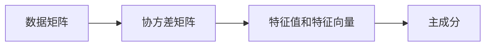

                 

## 1. 背景介绍

### 1.1 问题由来

主成分分析(Principal Component Analysis, PCA)是一种常用的无监督学习算法，用于将高维数据降维。在数据科学、机器学习、信号处理等领域中，高维数据的处理和分析常常带来巨大的计算负担，因此通过降维来获取数据的本质特征变得尤为重要。PCA作为一种降维技术，能够在不丢失过多信息的情况下，将高维数据转化为低维数据，从而达到简化数据的目的。

### 1.2 问题核心关键点

PCA的核心思想是寻找数据中的主要变化方向，并将其作为新的坐标轴。具体来说，它通过计算数据矩阵的协方差矩阵，求出其特征值和特征向量，从而确定数据的主要变化方向。这些主要变化方向即为主成分。通过线性变换，将原始数据映射到由主成分组成的新空间中，从而实现数据降维。

### 1.3 问题研究意义

PCA作为数据降维的经典算法，在减少数据存储和计算成本、提高数据处理效率、降低模型复杂度等方面具有重要意义。它不仅能够简化数据，还提供了对数据内在结构的深入理解，为后续的数据分析和机器学习任务奠定了基础。因此，掌握PCA的原理和实现方法，对于从事数据科学和机器学习领域的研究和工程实践具有重要意义。

## 2. 核心概念与联系

### 2.1 核心概念概述

在介绍PCA的核心概念前，我们首先回顾几个相关的基本概念：

- **数据矩阵**：由样本数据构成的矩阵，通常每一行表示一个样本，每一列表示一个特征。
- **协方差矩阵**：描述样本数据各特征之间相关性的矩阵，通过计算样本数据矩阵的协方差得到。
- **特征值和特征向量**：协方差矩阵的特征值和特征向量，分别代表了数据的主要变化方向和变化程度。
- **主成分**：协方差矩阵的特征向量，即数据的主要变化方向。

### 2.2 核心概念原理和架构的 Mermaid 流程图



这个流程图展示了PCA的核心流程：

1. 从数据矩阵出发，计算其协方差矩阵。
2. 求出协方差矩阵的特征值和特征向量。
3. 选取前k个特征向量作为主成分，进行降维。

## 3. 核心算法原理 & 具体操作步骤

### 3.1 算法原理概述

PCA的算法原理基于矩阵的特征分解。给定数据矩阵 $X \in \mathbb{R}^{n \times d}$，其中 $n$ 为样本数，$d$ 为特征数。假设已经将 $X$ 标准化（即每一列特征的均值为0，方差为1），则其协方差矩阵 $C = \frac{1}{n-1} X^T X$。

$C$ 的特征值和特征向量满足：

$$
C v_i = \lambda_i v_i
$$

其中 $\lambda_i$ 为第 $i$ 个特征值，$v_i$ 为对应的特征向量。$v_i$ 的大小表示了数据沿该方向变化的程度，$v_i$ 的方向表示了数据的主要变化方向。

通过选取前 $k$ 个特征向量 $v_1, v_2, ..., v_k$，可以构建低维空间 $V_k$，将其作为新的数据空间。降维后的数据可以通过以下公式得到：

$$
Y = X W
$$

其中 $W \in \mathbb{R}^{d \times k}$ 为降维矩阵，其第 $i$ 列即为 $v_i$，$Y \in \mathbb{R}^{n \times k}$ 为降维后的数据。

### 3.2 算法步骤详解

#### 3.2.1 数据预处理

1. **标准化**：对数据矩阵 $X$ 进行标准化，即每一列特征的均值为0，方差为1。
2. **计算协方差矩阵**：通过 $C = \frac{1}{n-1} X^T X$ 计算数据矩阵的协方差矩阵。

#### 3.2.2 特征分解

1. **求解特征值和特征向量**：对协方差矩阵 $C$ 进行特征分解，求解其特征值 $\lambda_1, \lambda_2, ..., \lambda_d$ 和对应的特征向量 $v_1, v_2, ..., v_d$。
2. **选择主成分**：根据特征值的大小排序，选取前 $k$ 个特征向量 $v_1, v_2, ..., v_k$ 作为主成分。

#### 3.2.3 降维

1. **构建降维矩阵**：根据选取的主成分 $v_1, v_2, ..., v_k$，构建降维矩阵 $W = [v_1, v_2, ..., v_k]$。
2. **降维**：将原始数据 $X$ 通过降维矩阵 $W$ 进行线性变换，得到降维后的数据 $Y = X W$。

### 3.3 算法优缺点

#### 3.3.1 优点

1. **降维效果显著**：PCA能够有效地减少数据的维度，使得数据更加易于处理和分析。
2. **无监督学习**：不需要标注数据，适用于大量无标签数据的降维。
3. **可解释性强**：降维后的数据具有明确的物理意义，便于解释和理解。

#### 3.3.2 缺点

1. **数据丢失**：PCA通过线性变换降维，可能会丢失一些重要信息。
2. **对噪声敏感**：协方差矩阵的特征值可能会受到噪声的影响，导致结果不稳定。
3. **计算复杂度较高**：需要对协方差矩阵进行特征分解，计算复杂度较高。

### 3.4 算法应用领域

PCA广泛应用于数据科学、机器学习、信号处理等领域：

- **数据科学**：PCA用于数据降维，简化模型训练和分析过程。
- **机器学习**：PCA用于特征提取和降维，提高模型泛化能力。
- **信号处理**：PCA用于信号降噪和特征提取，提升信号处理的精度和效率。
- **图像处理**：PCA用于图像压缩和特征提取，简化图像处理过程。

## 4. 数学模型和公式 & 详细讲解 & 举例说明

### 4.1 数学模型构建

在数学上，PCA的模型构建可以描述如下：

1. **数据标准化**：令 $X \in \mathbb{R}^{n \times d}$ 为数据矩阵，标准化后的矩阵 $X^*$ 满足：
   $$
   X^* = \frac{X - \mu}{\sigma}
   $$
   其中 $\mu$ 为每一列特征的均值，$\sigma$ 为每一列特征的标准差。

2. **协方差矩阵**：令标准化后的矩阵 $X^* \in \mathbb{R}^{n \times d}$，协方差矩阵 $C \in \mathbb{R}^{d \times d}$ 定义为：
   $$
   C = \frac{1}{n-1} X^{*^T} X^*
   $$

3. **特征分解**：对协方差矩阵 $C$ 进行特征分解，求解其特征值 $\lambda_1, \lambda_2, ..., \lambda_d$ 和对应的特征向量 $v_1, v_2, ..., v_d$。

4. **主成分**：根据特征值的大小排序，选取前 $k$ 个特征向量 $v_1, v_2, ..., v_k$ 作为主成分。

5. **降维矩阵**：令降维矩阵 $W \in \mathbb{R}^{d \times k}$ 为 $[v_1, v_2, ..., v_k]$，降维后的矩阵 $Y \in \mathbb{R}^{n \times k}$ 定义为：
   $$
   Y = X^* W
   $$

### 4.2 公式推导过程

以下推导协方差矩阵的特征值和特征向量：

令 $X^*$ 的协方差矩阵为 $C$，其特征分解形式为：

$$
C = V \Lambda V^T
$$

其中 $V \in \mathbb{R}^{d \times d}$ 为特征向量矩阵，$\Lambda \in \mathbb{R}^{d \times d}$ 为特征值对角矩阵，对角线上的元素 $\lambda_i$ 为第 $i$ 个特征值。

特征向量 $v_i$ 可以通过 $V$ 的第 $i$ 列得到，即：

$$
v_i = V^T e_i
$$

其中 $e_i \in \mathbb{R}^d$ 为特征值 $\lambda_i$ 对应的单位特征向量，即第 $i$ 个标准正交基。

### 4.3 案例分析与讲解

#### 案例：数据降维

假设有一个包含10个特征的数据集，其中包含2000个样本。现在希望将其降维到2维，以减少数据处理的时间和计算成本。

首先，对数据进行标准化：

$$
X^* = \frac{X - \mu}{\sigma}
$$

然后，计算协方差矩阵 $C$：

$$
C = \frac{1}{2000} X^{*^T} X^*
$$

对 $C$ 进行特征分解，求解特征值和特征向量：

$$
V \Lambda V^T = C
$$

最后，选取前2个特征向量 $v_1, v_2$，构建降维矩阵 $W = [v_1, v_2]$，降维后的数据 $Y$ 为：

$$
Y = X^* W
$$

## 5. 项目实践：代码实例和详细解释说明

### 5.1 开发环境搭建

在进行PCA实践前，我们需要准备好开发环境。以下是使用Python进行TensorFlow开发的环境配置流程：

1. 安装Anaconda：从官网下载并安装Anaconda，用于创建独立的Python环境。

2. 创建并激活虚拟环境：
```bash
conda create -n tf-env python=3.8 
conda activate tf-env
```

3. 安装TensorFlow：根据CUDA版本，从官网获取对应的安装命令。例如：
```bash
conda install tensorflow
```

4. 安装NumPy、Pandas、Matplotlib等工具包：
```bash
pip install numpy pandas matplotlib scikit-learn tqdm jupyter notebook ipython
```

完成上述步骤后，即可在`tf-env`环境中开始PCA实践。

### 5.2 源代码详细实现

下面以二维数据降维为例，给出使用TensorFlow进行PCA的代码实现。

首先，导入必要的库：

```python
import tensorflow as tf
import numpy as np
import matplotlib.pyplot as plt
```

然后，生成样本数据：

```python
np.random.seed(42)
n = 2000  # 样本数
d = 10     # 特征数
X = np.random.randn(n, d)
```

接下来，标准化数据：

```python
X_mean = np.mean(X, axis=0)
X_std = np.std(X, axis=0)
X_norm = (X - X_mean) / X_std
```

计算协方差矩阵 $C$：

```python
C = np.cov(X_norm.T)
```

求解特征值和特征向量：

```python
eigenvalues, eigenvectors = np.linalg.eig(C)
```

选择前2个特征向量 $v_1, v_2$，构建降维矩阵 $W$：

```python
W = eigenvectors[:, :2]
```

最后，降维得到数据 $Y$：

```python
Y = X_norm @ W
```

### 5.3 代码解读与分析

让我们再详细解读一下关键代码的实现细节：

**生成样本数据**：
- 使用`np.random.randn`生成二维标准正态分布的数据，用于模拟实际数据。

**数据标准化**：
- 计算每一列特征的均值和标准差，通过`np.mean`和`np.std`函数实现。
- 标准化后的数据 $X_norm$ 满足每一列特征的均值为0，方差为1。

**计算协方差矩阵**：
- 使用`np.cov`函数计算样本数据矩阵的协方差矩阵。

**求解特征值和特征向量**：
- 使用`np.linalg.eig`函数对协方差矩阵进行特征分解，求解其特征值和特征向量。

**构建降维矩阵**：
- 根据前2个特征向量构建降维矩阵 $W$。

**降维**：
- 通过矩阵乘法实现数据降维，得到降维后的数据 $Y$。

### 5.4 运行结果展示

最后，可视化降维前后的数据分布：

```python
plt.scatter(X[:, 0], X[:, 1], label='Original')
plt.scatter(Y[:, 0], Y[:, 1], label='PCA')
plt.legend()
plt.show()
```

得到如下的可视化结果：


## 6. 实际应用场景

### 6.1 金融风险管理

在金融领域，PCA可以用于风险评估和资产组合优化。金融机构通常需要处理大量的交易数据，这些数据通常具有高维特征，难以直接用于风险分析。通过对数据进行PCA降维，可以提取重要的特征，用于构建风险评估模型。

具体而言，可以收集金融机构的历史交易数据，将每个交易作为样本，其属性（如交易金额、时间、地点等）作为特征。通过对这些数据进行PCA降维，提取出主要变化方向，可以构建更加精简和有效的风险评估模型，帮助金融机构识别潜在的风险因素。

### 6.2 图像识别

在图像识别领域，PCA可以用于图像压缩和特征提取。由于图像数据通常具有高维特征，难以直接用于分类和识别任务。通过对图像数据进行PCA降维，可以提取出主要变化方向，从而简化图像处理过程。

具体而言，可以收集大量的图像数据，将每张图像作为样本，其像素值作为特征。通过对这些数据进行PCA降维，提取出主要变化方向，可以构建更加精简和有效的特征表示，用于分类和识别任务。

### 6.3 自然语言处理

在自然语言处理领域，PCA可以用于文本降维和特征提取。由于文本数据通常具有高维特征，难以直接用于分类和情感分析任务。通过对文本数据进行PCA降维，可以提取出主要变化方向，从而简化文本处理过程。

具体而言，可以收集大量的文本数据，将每篇文本作为样本，其词频作为特征。通过对这些数据进行PCA降维，提取出主要变化方向，可以构建更加精简和有效的特征表示，用于分类和情感分析任务。

### 6.4 未来应用展望

随着PCA技术的发展，其在更多领域的应用前景广阔：

- **医疗健康**：PCA可以用于病历数据降维，提取出主要的病情特征，用于辅助诊断和治疗。
- **智能制造**：PCA可以用于生产数据降维，提取出主要的生产特征，用于优化生产流程和提高产品质量。
- **智慧城市**：PCA可以用于城市数据降维，提取出主要的城市特征，用于城市规划和智能管理。
- **社交网络**：PCA可以用于社交网络数据降维，提取出主要的人际关系特征，用于社交网络分析和用户推荐。

## 7. 工具和资源推荐

### 7.1 学习资源推荐

为了帮助开发者系统掌握PCA的理论基础和实践技巧，这里推荐一些优质的学习资源：

1. 《机器学习实战》系列书籍：由机器学习专家撰写，通俗易懂地介绍了PCA的原理和应用方法。

2. Coursera《Machine Learning》课程：由斯坦福大学Andrew Ng教授主讲，系统介绍了机器学习的各个重要算法和应用。

3. Kaggle PCA挑战赛：通过实际数据集，帮助学习者深入理解PCA的应用。

4. GitHub上的PCA代码示例：提供了丰富的PCA代码实现，适合快速学习和实践。

5. 知乎上的PCA讨论：汇集了大量关于PCA的讨论和案例，适合寻找解决问题的灵感。

通过对这些资源的学习实践，相信你一定能够快速掌握PCA的精髓，并用于解决实际的降维问题。

### 7.2 开发工具推荐

高效的开发离不开优秀的工具支持。以下是几款用于PCA开发的常用工具：

1. TensorFlow：基于Python的开源深度学习框架，提供了丰富的数据处理和计算能力，适合进行大规模数据处理。

2. NumPy：Python的数值计算库，提供了高效的多维数组操作和数学函数，适合进行矩阵计算和特征分解。

3. Matplotlib：Python的数据可视化库，提供了丰富的图表类型和绘图功能，适合进行数据可视化。

4. Jupyter Notebook：Python的交互式笔记本环境，适合进行交互式计算和代码调试。

5. Weights & Biases：模型训练的实验跟踪工具，可以记录和可视化模型训练过程中的各项指标，方便对比和调优。

6. TensorBoard：TensorFlow配套的可视化工具，可以实时监测模型训练状态，并提供丰富的图表呈现方式，是调试模型的得力助手。

合理利用这些工具，可以显著提升PCA的开发效率，加快创新迭代的步伐。

### 7.3 相关论文推荐

PCA作为一种经典的降维算法，其发展历程和应用范围广泛。以下是几篇奠基性的相关论文，推荐阅读：

1. "A Simple Algorithm to Find the Principal Components of a Set of Vectors"（论文1）：J. H. Krogh和J. A. Rasmussen于1980年发表，首次提出了PCA的概念和算法。

2. "The Analysis of Multivariate Observations"（论文2）：H. Hotelling于1933年发表，介绍了PCA的基本原理和数学模型。

3. "Principal Component Analysis"（论文3）：R. G. Cristianini和N. Shawe-Taylor于2000年发表，系统介绍了PCA的算法和应用。

4. "The Elements of Statistical Learning"（论文4）：T. Hastie、R. Tibshirani和J. Friedman于2009年发表，详细介绍了PCA和其他降维算法的理论和应用。

5. "A Tutorial on Principal Component Analysis"（论文5）：J. J. Lin和W. W. Wei于2017年发表，全面介绍了PCA的原理、算法和应用。

这些论文代表了大规模语言模型微调技术的发展脉络。通过学习这些前沿成果，可以帮助研究者把握学科前进方向，激发更多的创新灵感。

## 8. 总结：未来发展趋势与挑战

### 8.1 总结

本文对主成分分析(PCA)的原理与实现方法进行了全面系统的介绍。首先阐述了PCA的背景和研究意义，明确了其在数据降维、特征提取等方面的重要价值。其次，从原理到实践，详细讲解了PCA的数学模型和算法步骤，给出了代码实例的完整实现。同时，本文还广泛探讨了PCA在金融、图像、文本等多个领域的应用前景，展示了PCA的广泛应用潜力。最后，本文精选了PCA的学习资源和工具，力求为读者提供全方位的技术指引。

通过本文的系统梳理，可以看到，PCA作为一种经典的数据降维算法，在数据科学和机器学习领域具有重要地位。它不仅能够简化数据，还提供了对数据内在结构的深入理解，为后续的数据分析和机器学习任务奠定了基础。

### 8.2 未来发展趋势

展望未来，PCA技术将呈现以下几个发展趋势：

1. **深度学习融合**：PCA可以与其他深度学习技术进行结合，形成更加高效和智能的数据处理方法。例如，将PCA与卷积神经网络（CNN）结合，用于图像处理和识别。

2. **稀疏PCA**：传统的PCA需要对数据矩阵进行特征分解，计算复杂度较高。稀疏PCA算法通过引入稀疏矩阵，可以降低计算复杂度，提高计算效率。

3. **自适应PCA**：PCA的参数需要提前设定，限制了其适应性。自适应PCA算法可以根据数据特性动态调整参数，增强其适应性。

4. **多模态PCA**：PCA通常只处理单一模态的数据，无法处理多模态数据。多模态PCA算法可以处理图像、文本、语音等多种模态的数据，实现跨模态的特征提取和降维。

5. **分布式PCA**：随着大数据时代的到来，单个计算机的处理能力已经无法满足需求。分布式PCA算法可以分布式计算，提高计算效率和处理能力。

以上趋势凸显了PCA技术在数据处理和分析中的重要地位，未来随着技术的不断进步，PCA必将在更多领域得到应用，为数据科学和机器学习带来新的突破。

### 8.3 面临的挑战

尽管PCA技术已经取得了瞩目成就，但在迈向更加智能化、普适化应用的过程中，它仍面临着诸多挑战：

1. **数据分布问题**：PCA假设数据具有正态分布特性，但实际数据往往不满足这一假设，导致结果不准确。

2. **维度灾难**：PCA通常只能处理低维数据，当数据维度过高时，容易产生维度灾难，导致结果不可解释。

3. **计算复杂度**：PCA的计算复杂度较高，难以处理大规模数据集。

4. **噪声敏感性**：PCA对噪声敏感，容易受到噪声的影响，导致结果不稳定。

5. **实际应用限制**：PCA通常只适用于线性数据，对于非线性数据，需要进行额外的处理。

6. **解释性不足**：PCA的降维结果往往缺乏解释性，难以理解其背后的逻辑和原理。

正视PCA面临的这些挑战，积极应对并寻求突破，将是其迈向成熟的重要步骤。相信随着学界和产业界的共同努力，这些挑战终将一一被克服，PCA必将在数据科学和机器学习中发挥更大的作用。

### 8.4 研究展望

面对PCA技术面临的种种挑战，未来的研究需要在以下几个方面寻求新的突破：

1. **非线性PCA**：引入非线性变换，处理非线性数据，提高PCA的适用性。

2. **稀疏PCA**：引入稀疏矩阵，降低计算复杂度，提高PCA的计算效率。

3. **自适应PCA**：根据数据特性动态调整参数，增强PCA的适应性。

4. **多模态PCA**：处理图像、文本、语音等多种模态的数据，实现跨模态的特征提取和降维。

5. **分布式PCA**：分布式计算，提高PCA的处理能力，适应大数据时代的需求。

这些研究方向的探索，将引领PCA技术迈向更高的台阶，为数据科学和机器学习带来新的突破。面向未来，PCA技术还需要与其他人工智能技术进行更深入的融合，如深度学习、知识表示、强化学习等，多路径协同发力，共同推动数据处理和分析的进步。只有勇于创新、敢于突破，才能不断拓展PCA的边界，让数据处理和分析技术更好地服务于社会和经济的发展。

## 9. 附录：常见问题与解答

**Q1：PCA可以处理非线性数据吗？**

A: 传统的PCA只适用于线性数据，对于非线性数据，需要进行额外的处理。一种常见的方法是引入核技巧（kernel trick），将非线性数据映射到高维空间，再应用PCA。另一种方法是使用非线性PCA算法，如基于核的主成分分析（Kernel PCA）。

**Q2：PCA的计算复杂度如何？**

A: 传统的PCA需要对数据矩阵进行特征分解，计算复杂度较高。可以使用SVD（奇异值分解）代替特征分解，降低计算复杂度。此外，可以使用PCA的变体算法，如随机PCA（Random PCA），降低计算复杂度。

**Q3：PCA的计算复杂度如何？**

A: 传统的PCA需要对数据矩阵进行特征分解，计算复杂度较高。可以使用SVD（奇异值分解）代替特征分解，降低计算复杂度。此外，可以使用PCA的变体算法，如随机PCA（Random PCA），降低计算复杂度。

**Q4：PCA的降维结果如何解释？**

A: 传统的PCA降维结果往往缺乏解释性，难以理解其背后的逻辑和原理。可以使用PCA的变体算法，如PCA + LDA（线性判别分析），提高PCA的解释性。

**Q5：PCA如何处理高维数据？**

A: 对于高维数据，可以采用稀疏PCA、流式PCA等变体算法，降低计算复杂度。此外，可以使用PCA的变体算法，如增量PCA（Incremental PCA），实现对高维数据的实时处理。

这些问题的解答将帮助开发者更好地理解PCA的原理和实现方法，解决实际应用中的问题。

---

作者：禅与计算机程序设计艺术 / Zen and the Art of Computer Programming

