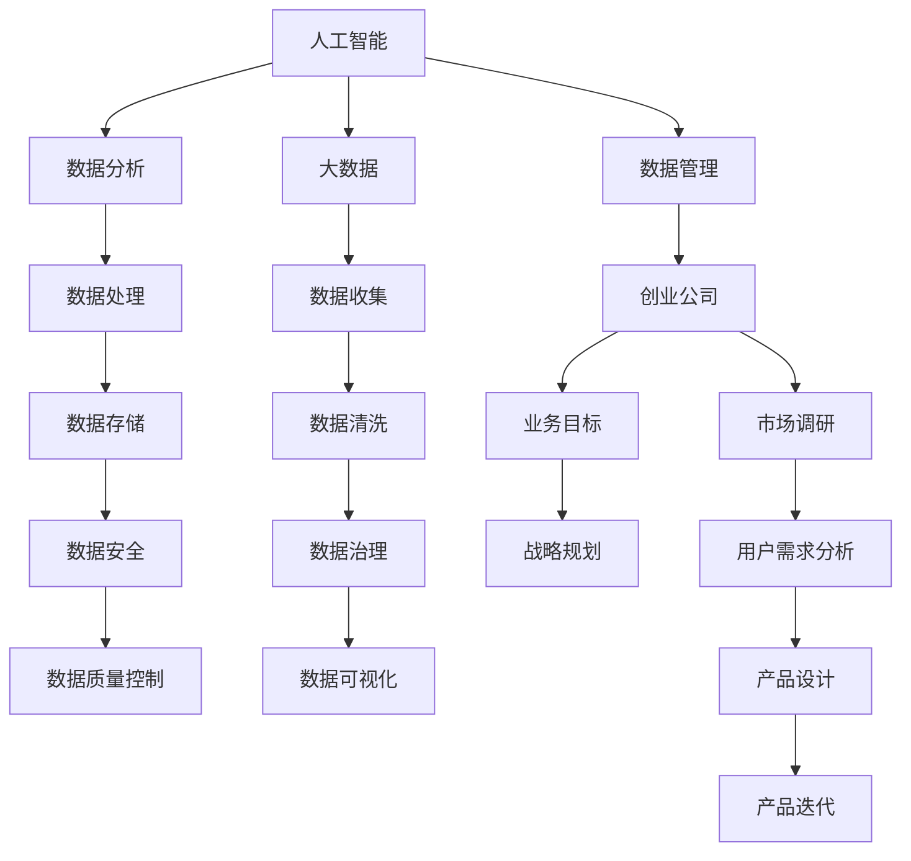

                 

# 人工智能创业数据管理的有效方法

> 关键词：人工智能,创业,数据管理,大数据,数据分析

## 1. 背景介绍

### 1.1 问题由来
在人工智能(AI)领域，数据驱动是众多创新和突破的基础。随着AI技术在各个行业的应用深入，数据的重要性日益凸显。尤其是对于人工智能初创公司而言，如何高效管理和利用数据，直接关系到其发展速度和市场竞争力。

然而，许多初创企业在数据管理方面遇到了诸多挑战：

- **数据质量问题**：数据缺失、不准确、不完整、不一致等现象普遍存在，影响AI模型的训练和预测效果。
- **数据安全和隐私**：数据隐私保护法规日益严格，如何合理使用数据并保障用户隐私成为关键问题。
- **数据集成和互操作**：不同来源和格式的数据难以高效整合，影响了数据的整体价值。
- **数据治理**：数据质量和业务目标的对齐、数据生命周期管理等问题需要系统性的解决方案。
- **数据驱动的业务决策**：如何将数据转化为业务决策支持，实现数据驱动的商业价值最大化。

本文旨在探讨和解决这些问题，为人工智能初创企业提供数据管理的有效方法，帮助其在激烈的市场竞争中脱颖而出。

## 2. 核心概念与联系

### 2.1 核心概念概述

为更好地理解人工智能创业中的数据管理方法，本节将介绍几个核心概念及其相互联系：

- **人工智能**：一种模拟人类智能的计算机技术，包括机器学习、深度学习、自然语言处理、计算机视觉等方向。

- **创业公司**：新成立的企业，面临从0到1的业务发展挑战，需要快速适应市场变化和用户需求。

- **数据管理**：通过一系列技术和方法，有效收集、存储、处理和分析数据，以支持业务决策和战略规划。

- **大数据**：规模大、多样性高、速度快、价值密度低的数据集合，通常指超过10TB的数据量。

- **数据分析**：利用算法和模型对数据进行挖掘、处理和可视化，提取有价值的信息和洞察。

这些核心概念之间的逻辑关系可以通过以下Mermaid流程图来展示：



这个流程图展示了人工智能创业公司数据管理的核心流程：

1. 人工智能系统需要大数据作为训练和推理的基础。
2. 大数据的来源包括数据收集、数据清洗、数据存储、数据治理等环节。
3. 数据分析通过数据处理、数据质量控制、数据可视化等手段，从大数据中提取有价值的信息。
4. 数据管理贯穿企业业务目标、战略规划、市场调研、用户需求分析、产品设计、产品迭代等各个环节，支持企业发展的全过程。

## 3. 核心算法原理 & 具体操作步骤

### 3.1 算法原理概述

基于大数据和人工智能的数据管理，核心在于如何通过算法和模型对数据进行高效处理和分析，以支持业务决策和战略规划。主要包括以下几个步骤：

1. **数据收集**：自动采集和汇聚不同来源的数据，如用户行为数据、市场调研数据、第三方数据等。
2. **数据清洗**：去除噪声、缺失值、重复数据等，提升数据质量。
3. **数据存储**：选择合适的数据存储方式，如关系型数据库、NoSQL数据库、大数据存储系统等。
4. **数据治理**：制定数据管理政策，确保数据的一致性、完整性、安全性，并进行生命周期管理。
5. **数据处理**：通过数据处理算法，如特征提取、降维、聚类、分类、回归等，提取数据特征。
6. **数据分析**：使用机器学习、深度学习模型，对数据进行分析和预测，提取洞察和洞见。
7. **业务应用**：将数据分析结果转化为业务决策，优化产品设计和市场策略，提升运营效率。

### 3.2 算法步骤详解

**Step 1: 数据收集**

数据收集是数据管理的第一步，主要包括以下几个方面：

1. **数据来源识别**：确定需要收集的数据类型，包括客户数据、市场数据、内部运营数据等。

2. **数据采集工具**：选择合适的工具和接口，自动抓取数据，如API接口、爬虫工具、数据库查询等。

3. **数据质量监控**：设置数据质量指标，如数据完整性、准确性、时效性等，进行实时监控和报警。

**Step 2: 数据清洗**

数据清洗是提升数据质量的重要步骤，包括以下几个关键步骤：

1. **数据去重**：去除重复数据，确保数据唯一性。

2. **数据填充**：填补缺失值，避免数据不完整。

3. **数据转换**：将数据转换为标准格式，便于后续处理。

4. **数据归一化**：将数据进行标准化，消除量纲差异。

**Step 3: 数据存储**

选择合适的数据存储方式，是数据管理的核心环节：

1. **关系型数据库**：适用于结构化数据存储，如SQL数据库MySQL、PostgreSQL等。

2. **NoSQL数据库**：适用于非结构化数据存储，如文档数据库MongoDB、键值数据库Redis等。

3. **大数据存储系统**：适用于海量数据的存储和处理，如Hadoop、Spark、Google BigQuery等。

**Step 4: 数据治理**

数据治理是确保数据质量和安全性的重要手段：

1. **数据标准制定**：制定统一的数据标准，确保数据一致性。

2. **数据权限管理**：设定数据访问权限，保护数据安全。

3. **数据质量评估**：定期评估数据质量，发现和修复数据问题。

**Step 5: 数据处理**

数据处理是提取数据特征和洞察的关键步骤：

1. **特征提取**：从数据中提取有意义的特征，如用户行为特征、市场特征等。

2. **数据降维**：使用算法如PCA、LDA、SVD等，降低数据维度，提升处理效率。

3. **数据聚类**：使用算法如K-Means、层次聚类等，对数据进行分类和分组。

4. **数据分类**：使用算法如逻辑回归、支持向量机、随机森林等，对数据进行分类。

**Step 6: 数据分析**

数据分析是提取数据洞察和洞见的关键步骤：

1. **机器学习模型**：使用监督学习、无监督学习、强化学习等算法，训练模型。

2. **深度学习模型**：使用卷积神经网络、循环神经网络、生成对抗网络等，提升预测精度。

3. **自然语言处理**：使用NLP技术，处理文本数据，提取文本特征。

**Step 7: 业务应用**

业务应用是将数据分析结果转化为业务决策的关键步骤：

1. **决策支持**：使用数据分析结果，辅助业务决策。

2. **产品优化**：使用数据分析结果，优化产品设计和功能。

3. **市场推广**：使用数据分析结果，优化市场策略和广告投放。

4. **运营管理**：使用数据分析结果，优化运营流程和资源配置。

### 3.3 算法优缺点

基于大数据和人工智能的数据管理方法，具有以下优点：

1. **高效性**：自动化的数据收集和处理，提升数据管理的效率和准确性。

2. **全面性**：覆盖数据收集、数据清洗、数据存储、数据治理、数据分析等多个环节，确保数据的全面性。

3. **灵活性**：使用先进的算法和模型，支持多种业务场景的数据分析。

4. **可解释性**：使用可解释性高的模型，便于理解数据分析结果。

然而，该方法也存在以下缺点：

1. **数据隐私问题**：处理大规模数据时，需注意数据隐私保护，避免侵犯用户隐私。

2. **技术门槛高**：需要具备较高的技术水平和专业知识，对数据分析工程师的需求较大。

3. **数据质量依赖**：数据管理的效果很大程度上取决于数据的质量，数据来源多样性和不稳定性可能会影响数据质量。

4. **资源消耗大**：大数据处理需要高性能计算资源，对硬件设施的要求较高。

5. **业务理解不足**：数据分析结果需要与业务需求紧密结合，否则可能无法产生实际价值。

## 4. 数学模型和公式 & 详细讲解 & 举例说明

### 4.1 数学模型构建

基于大数据和人工智能的数据管理，需要构建多个数学模型，以支持数据收集、数据清洗、数据存储、数据治理、数据分析等环节。以下将介绍几个核心模型的构建方法：

**数据收集模型**：

- **数据源识别模型**：通过关键词抽取、文本分类等技术，自动识别数据源。

- **数据采集模型**：使用爬虫技术，自动抓取数据源中的数据。

**数据清洗模型**：

- **数据去重模型**：使用哈希表、布隆过滤器等数据结构，快速去重。

- **数据填充模型**：使用均值、中位数、众数等方法，填补缺失值。

- **数据转换模型**：使用正则表达式、数据转换函数等，将数据转换为标准格式。

**数据存储模型**：

- **关系型数据库模型**：使用SQL查询语言，进行数据存储和查询。

- **NoSQL数据库模型**：使用文档存储、键值存储等技术，进行数据存储和查询。

**数据治理模型**：

- **数据标准制定模型**：使用规则引擎、元数据管理工具，制定数据标准。

- **数据权限管理模型**：使用RBAC、ABAC等访问控制模型，设定数据权限。

**数据处理模型**：

- **特征提取模型**：使用PCA、LDA等算法，提取数据特征。

- **数据降维模型**：使用PCA、LDA、SVD等算法，降低数据维度。

**数据分析模型**：

- **机器学习模型**：使用监督学习、无监督学习、强化学习等算法，进行数据分析。

- **深度学习模型**：使用卷积神经网络、循环神经网络、生成对抗网络等，进行数据分析。

**业务应用模型**：

- **决策支持模型**：使用数据分析结果，辅助业务决策。

- **产品优化模型**：使用数据分析结果，优化产品设计和功能。

### 4.2 公式推导过程

以下将详细推导几个关键数学模型的公式：

**数据去重模型**：

- **哈希表去重**：假设数据集为$D=\{d_1, d_2, ..., d_n\}$，去重后的数据集为$D'$。

  $$
  D' = \{d_i | d_i \notin D', i=1,2,...,n\}
  $$

  其中，$d_i$表示数据集中的元素，$D'$表示去重后的数据集。

**数据填充模型**：

- **均值填充**：假设数据集为$D=\{x_1, x_2, ..., x_n\}$，缺失值为$x_i$，均值为$\bar{x}$。

  $$
  x_i = \bar{x}
  $$

  其中，$\bar{x} = \frac{1}{n}\sum_{i=1}^n x_i$表示数据集的均值。

**数据转换模型**：

- **文本转换为数值**：假设文本数据为$T=\{t_1, t_2, ..., t_n\}$，转换为数值数据$N=\{n_1, n_2, ..., n_n\}$。

  $$
  n_i = \text{Convert}(t_i)
  $$

  其中，$\text{Convert}$表示文本转换为数值的函数，如正则表达式、词典映射等。

### 4.3 案例分析与讲解

以下以一个实际的案例，展示如何应用数学模型进行数据管理：

**案例背景**：一家电商创业公司，需要分析用户行为数据，优化广告投放策略。

**数据收集**：使用API接口和爬虫工具，自动抓取用户浏览记录、购买记录、搜索记录等数据。

**数据清洗**：使用哈希表去重，均值填充缺失值，文本转换为数值格式。

**数据存储**：使用MongoDB进行数据存储，存储结构为键值对形式。

**数据治理**：制定统一的数据标准，设定数据访问权限，定期评估数据质量。

**数据处理**：使用PCA算法进行数据降维，提取用户行为特征。

**数据分析**：使用K-Means算法对用户进行聚类，使用决策树模型进行分类预测。

**业务应用**：根据用户聚类结果和分类预测结果，优化广告投放策略。

## 5. 项目实践：代码实例和详细解释说明

### 5.1 开发环境搭建

在进行数据管理项目实践前，我们需要准备好开发环境。以下是使用Python进行PyTorch开发的环境配置流程：

1. 安装Anaconda：从官网下载并安装Anaconda，用于创建独立的Python环境。

2. 创建并激活虚拟环境：
```bash
conda create -n data-management python=3.8 
conda activate data-management
```

3. 安装PyTorch：根据CUDA版本，从官网获取对应的安装命令。例如：
```bash
conda install pytorch torchvision torchaudio cudatoolkit=11.1 -c pytorch -c conda-forge
```

4. 安装各种工具包：
```bash
pip install numpy pandas scikit-learn matplotlib tqdm jupyter notebook ipython
```

完成上述步骤后，即可在`data-management`环境中开始数据管理项目实践。

### 5.2 源代码详细实现

这里我们以一个实际的数据管理项目为例，展示使用Python进行数据管理的代码实现。

首先，定义数据收集函数：

```python
import requests

def collect_data(url):
    response = requests.get(url)
    return response.json()
```

然后，定义数据清洗函数：

```python
import pandas as pd
import numpy as np

def clean_data(data):
    # 去重
    data = data.drop_duplicates()
    
    # 填补缺失值
    data.fillna(value=np.mean(data), inplace=True)
    
    # 转换数据格式
    data = pd.get_dummies(data, columns=['gender', 'age', 'location'])
    
    return data
```

接着，定义数据存储函数：

```python
import json

def save_data(data, filename):
    with open(filename, 'w') as f:
        json.dump(data.to_dict(orient='records'), f)
```

最后，定义数据处理和分析函数：

```python
from sklearn.decomposition import PCA
from sklearn.cluster import KMeans
from sklearn.tree import DecisionTreeClassifier

def process_data(data):
    # 数据降维
    pca = PCA(n_components=2)
    data = pca.fit_transform(data)
    
    # 数据聚类
    kmeans = KMeans(n_clusters=3)
    data['cluster'] = kmeans.fit_predict(data)
    
    # 数据分类
    clf = DecisionTreeClassifier()
    clf.fit(data.drop('cluster', axis=1), data['cluster'])
    
    return data, clf
```

现在，我们将这些函数整合到主函数中，启动数据管理流程：

```python
if __name__ == '__main__':
    # 数据收集
    data = collect_data('https://example.com/data')
    
    # 数据清洗
    data = clean_data(data)
    
    # 数据存储
    save_data(data, 'data.json')
    
    # 数据处理和分析
    data, clf = process_data(data)
    
    # 业务应用
    # ...
```

以上就是使用Python进行数据管理项目的完整代码实现。可以看到，通过简单的函数组合，我们可以高效地实现数据收集、数据清洗、数据存储、数据处理和分析等任务，快速迭代和优化数据管理流程。

### 5.3 代码解读与分析

让我们再详细解读一下关键代码的实现细节：

**数据收集函数**：
- 使用requests库，发送HTTP请求，获取JSON格式的响应数据。

**数据清洗函数**：
- 使用pandas库，进行去重、填补缺失值、转换数据格式等操作。

**数据存储函数**：
- 使用json库，将数据以JSON格式保存到文件中。

**数据处理和分析函数**：
- 使用scikit-learn库，进行PCA数据降维、KMeans聚类、决策树分类等操作。

**主函数**：
- 依次调用数据收集、数据清洗、数据存储、数据处理和分析等函数，完成数据管理流程。

**业务应用**：
- 根据数据分析结果，进行业务优化和决策支持。

## 6. 实际应用场景

### 6.1 智能推荐系统

智能推荐系统是数据管理的重要应用场景之一。通过数据分析和机器学习模型，推荐系统能够自动生成个性化的推荐内容，提升用户体验和满意度。

在技术实现上，可以收集用户的历史行为数据、点击记录、评价反馈等数据，使用协同过滤、基于内容的推荐、深度学习等算法进行模型训练，优化推荐结果。同时，可以使用数据治理技术，确保推荐数据的准确性和实时性，提升推荐系统的可靠性和稳定性。

### 6.2 客户关系管理

客户关系管理(CRM)系统也是数据管理的典型应用。通过数据分析和机器学习模型，CRM系统能够自动识别高价值客户、预测客户流失风险、优化客户服务流程等，提升企业客户满意度和忠诚度。

在技术实现上，可以收集客户的交互数据、购买记录、行为分析等数据，使用分类、聚类、关联规则等算法进行模型训练，识别出高价值客户、预测客户流失风险等。同时，可以使用数据治理技术，确保CRM数据的安全性和隐私性，提升客户信息的质量和可靠性。

### 6.3 风险控制

风险控制是数据管理的另一重要应用场景。通过数据分析和机器学习模型，风险控制系统能够自动识别潜在风险、预测风险概率、优化风险控制策略等，提升企业的风险管理能力。

在技术实现上，可以收集企业内部的交易数据、用户行为数据、外部环境数据等，使用分类、聚类、异常检测等算法进行模型训练，识别出潜在风险、预测风险概率等。同时，可以使用数据治理技术，确保风险控制数据的准确性和完整性，提升风险控制系统的可靠性和稳定性。

### 6.4 未来应用展望

随着数据管理技术的发展，未来的大数据和人工智能应用场景将更加广泛和深入：

1. **实时数据处理**：未来的数据管理系统将具备实时数据处理能力，能够实时监控和分析业务数据，快速响应业务需求。

2. **多源数据融合**：未来的数据管理系统将具备多源数据融合能力，能够高效整合来自不同来源的数据，提升数据管理的全面性和准确性。

3. **自动化决策支持**：未来的数据管理系统将具备自动化决策支持能力，能够自动生成业务建议和决策方案，提升企业决策效率。

4. **智能数据治理**：未来的数据管理系统将具备智能数据治理能力，能够自动进行数据质量监控、数据权限管理、数据生命周期管理等，提升数据管理的自动化和智能化水平。

5. **跨领域应用**：未来的数据管理系统将具备跨领域应用能力，能够广泛应用于金融、医疗、教育、政府等领域，提升各领域的智能化水平。

这些趋势预示着大数据和人工智能在数据管理中的应用将更加深入和广泛，为各行业的数字化转型升级带来新的机遇和挑战。

## 7. 工具和资源推荐

### 7.1 学习资源推荐

为了帮助开发者系统掌握数据管理的理论基础和实践技巧，这里推荐一些优质的学习资源：

1. 《大数据时代》系列博文：由数据科学家撰写，深入浅出地介绍了大数据管理的核心概念和实践方法。

2. CS229《机器学习》课程：斯坦福大学开设的机器学习经典课程，有Lecture视频和配套作业，带你深入理解机器学习算法和模型。

3. 《Python数据科学手册》书籍：全面介绍了Python在数据科学中的应用，包括数据收集、数据清洗、数据处理、数据可视化等。

4. Kaggle平台：全球最大的数据科学竞赛平台，提供丰富的数据集和案例，帮助开发者实践数据管理技能。

5. DataCamp：提供系统性的数据科学课程和实战项目，涵盖数据管理、数据分析、机器学习等多个方向。

通过对这些资源的学习实践，相信你一定能够快速掌握数据管理的精髓，并用于解决实际的业务问题。

### 7.2 开发工具推荐

高效的开发离不开优秀的工具支持。以下是几款用于数据管理开发的常用工具：

1. PyTorch：基于Python的开源深度学习框架，灵活动态的计算图，适合快速迭代研究。

2. TensorFlow：由Google主导开发的开源深度学习框架，生产部署方便，适合大规模工程应用。

3. Apache Spark：用于大规模数据处理的开源框架，支持分布式计算和数据处理，性能高效。

4. Apache Hadoop：用于大数据存储和处理的开源框架，支持海量数据的存储和处理。

5. Tableau：强大的数据可视化工具，支持实时数据可视化和交互式分析。

6. Jupyter Notebook：流行的Jupyter Notebook环境，支持Python、R等多种编程语言，便于协同开发和分享。

合理利用这些工具，可以显著提升数据管理的开发效率，加快创新迭代的步伐。

### 7.3 相关论文推荐

数据管理技术的发展源于学界的持续研究。以下是几篇奠基性的相关论文，推荐阅读：

1. "Big Data: A Revolution That Will Transform How We Live, Work, and Think" by Victor Mayer-Schönberger：关于大数据对社会、经济、技术的影响的深入分析。

2. "The Data Warehouse Toolkit" by Ralph Kimball：介绍了数据仓库的概念、设计、实施等方面的内容，是数据管理领域的经典之作。

3. "Data Mining: Concepts and Techniques" by Han et al.：全面介绍了数据挖掘的概念、算法、技术等方面的内容，是数据管理领域的经典教材。

4. "Scalable Predictive Analytics with Spark" by Patrick Rousseeuw：介绍了在Apache Spark上进行数据预测和分析的方法，是数据管理领域的重要参考资料。

5. "A Survey of Data Stream Management Technologies" by He et al.：介绍了数据流处理的最新进展和应用场景，是数据管理领域的重要综述。

这些论文代表了大数据和人工智能在数据管理中的应用和发展脉络，通过学习这些前沿成果，可以帮助研究者把握学科前进方向，激发更多的创新灵感。

## 8. 总结：未来发展趋势与挑战

### 8.1 总结

本文对基于大数据和人工智能的数据管理方法进行了全面系统的介绍。首先阐述了人工智能创业公司面临的数据管理挑战，明确了数据管理在业务发展和战略规划中的重要性。其次，从原理到实践，详细讲解了数据收集、数据清洗、数据存储、数据治理、数据分析等多个环节的核心算法和操作步骤，给出了数据管理项目的完整代码实现。同时，本文还探讨了数据管理在智能推荐、客户关系管理、风险控制等多个行业领域的应用前景，展示了数据管理技术的广阔应用空间。最后，本文精选了数据管理的各类学习资源，力求为读者提供全方位的技术指引。

通过本文的系统梳理，可以看到，基于大数据和人工智能的数据管理技术正在成为企业发展的核心竞争力。这些技术的广泛应用，将帮助企业实现数据驱动的业务决策和战略规划，提升业务效率和市场竞争力。未来，伴随技术的不断演进和应用实践的深入，数据管理必将在更多领域得到应用，为人类社会的数字化转型升级带来新的机遇和挑战。

### 8.2 未来发展趋势

展望未来，数据管理技术将呈现以下几个发展趋势：

1. **实时数据处理**：未来的数据管理系统将具备实时数据处理能力，能够实时监控和分析业务数据，快速响应业务需求。

2. **多源数据融合**：未来的数据管理系统将具备多源数据融合能力，能够高效整合来自不同来源的数据，提升数据管理的全面性和准确性。

3. **自动化决策支持**：未来的数据管理系统将具备自动化决策支持能力，能够自动生成业务建议和决策方案，提升企业决策效率。

4. **智能数据治理**：未来的数据管理系统将具备智能数据治理能力，能够自动进行数据质量监控、数据权限管理、数据生命周期管理等，提升数据管理的自动化和智能化水平。

5. **跨领域应用**：未来的数据管理系统将具备跨领域应用能力，能够广泛应用于金融、医疗、教育、政府等领域，提升各领域的智能化水平。

这些趋势预示着数据管理技术的应用将更加深入和广泛，为各行业的数字化转型升级带来新的机遇和挑战。

### 8.3 面临的挑战

尽管数据管理技术已经取得了一定的进展，但在迈向更加智能化、普适化应用的过程中，它仍面临着诸多挑战：

1. **数据质量问题**：数据缺失、不准确、不完整、不一致等现象仍然普遍存在，影响数据分析和决策的准确性。

2. **数据隐私问题**：数据隐私保护法规日益严格，如何合理使用数据并保障用户隐私成为关键问题。

3. **技术门槛高**：数据管理需要具备较高的技术水平和专业知识，对数据分析工程师的需求较大。

4. **资源消耗大**：大数据处理需要高性能计算资源，对硬件设施的要求较高。

5. **业务理解不足**：数据分析结果需要与业务需求紧密结合，否则可能无法产生实际价值。

### 8.4 研究展望

面对数据管理面临的挑战，未来的研究需要在以下几个方面寻求新的突破：

1. **自动化数据治理**：开发自动化的数据治理工具，实现数据质量监控、数据权限管理、数据生命周期管理等功能的自动化。

2. **低成本数据处理**：开发低成本的数据处理技术，如分布式计算、模型压缩、数据压缩等，降低数据处理成本。

3. **跨领域数据融合**：开发跨领域的数据融合技术，实现不同来源数据的整合和协同分析，提升数据管理的全面性和准确性。

4. **数据隐私保护**：开发数据隐私保护技术，如差分隐私、联邦学习等，保障用户隐私和数据安全。

5. **数据驱动的业务决策**：开发数据驱动的业务决策支持系统，提升企业决策的智能化水平。

这些研究方向的探索，必将引领数据管理技术迈向更高的台阶，为构建智能数据驱动的业务系统铺平道路。面向未来，数据管理技术还需要与其他人工智能技术进行更深入的融合，如知识表示、因果推理、强化学习等，多路径协同发力，共同推动数据管理的进步。

## 9. 附录：常见问题与解答

**Q1：数据管理是否适用于所有企业？**

A: 数据管理对于需要依赖大量数据进行业务决策的企业尤为重要，如电商平台、金融公司、医疗系统等。而对于不需要依赖数据进行业务决策的企业，数据管理的需求相对较低。

**Q2：数据管理技术是否需要高昂的硬件成本？**

A: 数据管理需要高性能的计算资源，但随着云计算和大数据技术的发展，许多企业可以通过云服务提供商获取成本相对低廉的计算资源。同时，部分数据管理技术也可以通过模型压缩、数据压缩等方法降低资源消耗。

**Q3：数据管理技术是否需要高水平的工程师？**

A: 数据管理技术需要具备较高的技术水平和专业知识，对数据分析工程师的需求较大。但随着自动化工具和框架的发展，部分数据管理任务可以由开发者通过简单配置和脚本实现，降低了对技术水平的要求。

**Q4：数据管理技术是否需要大量的标注数据？**

A: 数据管理技术主要依赖原始数据进行自动化处理和分析，不需要大量的标注数据。但部分数据处理和分析任务可能需要标注数据作为训练数据，以提升模型效果。

通过本文的系统梳理，可以看到，基于大数据和人工智能的数据管理技术正在成为企业发展的核心竞争力。这些技术的广泛应用，将帮助企业实现数据驱动的业务决策和战略规划，提升业务效率和市场竞争力。未来，伴随技术的不断演进和应用实践的深入，数据管理必将在更多领域得到应用，为人类社会的数字化转型升级带来新的机遇和挑战。

作者：禅与计算机程序设计艺术 / Zen and the Art of Computer Programming

