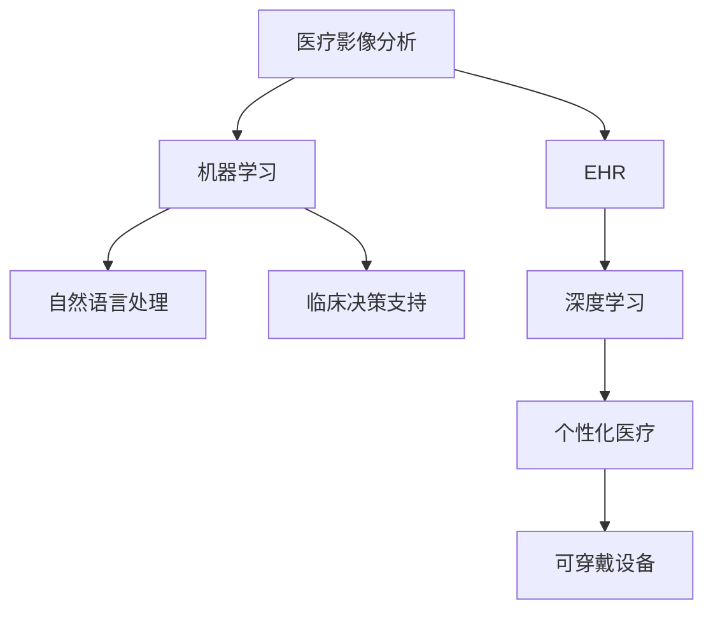

                 

# 人工智能在医疗保健中的应用

## 1. 背景介绍

人工智能（AI）在医疗保健领域的应用正迅速成为研究和应用的热点。随着大数据、深度学习、自然语言处理等技术的不断进步，AI在疾病诊断、治疗方案设计、个性化医疗等方面展现出巨大潜力，有望改变传统的医疗模式，提升医疗服务的效率和质量。本文将系统介绍AI在医疗保健中的应用，包括核心概念、算法原理、操作步骤、数学模型构建与推导、项目实践、实际应用场景、工具和资源推荐，以及未来发展趋势与挑战。

## 2. 核心概念与联系

### 2.1 核心概念概述

为更好地理解AI在医疗保健中的应用，本节将介绍几个关键概念：

- **人工智能（AI）**：指模拟人类智能行为的计算机程序或系统。在医疗保健领域，AI可以包括机器学习、深度学习、自然语言处理、计算机视觉等技术。

- **医疗影像分析**：指使用AI对医疗影像数据（如X光、CT、MRI等）进行自动分析，辅助医生进行疾病诊断和治疗决策。

- **电子健康记录（EHR）**：指包含患者完整健康信息的电子化记录系统，可用于支持临床决策、医疗研究和公共卫生管理。

- **自然语言处理（NLP）**：指计算机理解和处理人类语言的能力，可应用于医疗文本分析、病历编码、问答系统等。

- **深度学习**：一种模仿人脑神经网络的机器学习技术，通过多层次的特征学习，从数据中自动提取高阶特征，常用于图像识别、语音识别等任务。

- **个性化医疗**：根据患者的基因、生理、环境等因素，量身定制个性化的诊断和治疗方案，以提高疗效和降低副作用。

- **可穿戴设备**：指能够实时监测健康数据的便携式设备，如智能手表、健康追踪器等。

这些核心概念之间的联系和互动构成了AI在医疗保健领域的应用基础。AI通过学习大量的医疗数据，能够辅助医生进行精准诊断、治疗和个性化医疗，提升医疗服务的质量和效率。

### 2.2 核心概念原理和架构的 Mermaid 流程图



这个流程图展示了AI在医疗保健领域的核心概念及其之间的联系。医疗影像分析利用机器学习对医学影像数据进行自动分析；电子健康记录为深度学习提供海量的医疗数据；自然语言处理帮助理解和处理电子健康记录中的文本数据；深度学习从海量的医疗数据中提取高阶特征；个性化医疗利用深度学习结果为患者量身定制治疗方案；可穿戴设备实时监测患者健康数据；临床决策支持系统则结合以上技术辅助医生进行诊断和治疗决策。

## 3. 核心算法原理 & 具体操作步骤

### 3.1 算法原理概述

AI在医疗保健中的应用主要依赖于数据驱动的机器学习和深度学习算法。这些算法通过学习和提取大量医疗数据中的规律和特征，辅助医生进行疾病诊断、治疗方案设计和个性化医疗。

在疾病诊断方面，AI利用机器学习和深度学习算法对医疗影像数据、电子健康记录和可穿戴设备数据进行分析，自动提取特征并进行分类或回归预测，以辅助医生进行疾病诊断和治疗决策。

在治疗方案设计方面，AI通过深度学习模型从海量的医疗数据中提取高阶特征，并结合患者的基因、生理、环境等因素，为患者量身定制个性化的治疗方案，以提高疗效和降低副作用。

在个性化医疗方面，AI利用自然语言处理技术从电子健康记录中提取患者的病史、药物过敏等重要信息，结合深度学习模型进行分析和预测，为患者提供个性化的医疗建议和治疗方案。

### 3.2 算法步骤详解

AI在医疗保健中的应用通常包括以下关键步骤：

**Step 1: 数据收集与预处理**

- 收集大量的医疗数据，包括医疗影像、电子健康记录、可穿戴设备数据等。
- 对数据进行清洗和预处理，去除噪声和不完整数据，确保数据的质量和一致性。

**Step 2: 特征提取**

- 使用机器学习和深度学习算法对数据进行特征提取和表示学习，将原始数据转换为模型可理解的特征表示。

**Step 3: 模型训练**

- 选择适当的机器学习和深度学习模型，利用预处理后的数据进行训练，优化模型的参数。
- 通过交叉验证等技术，评估模型的性能，选择最优的模型进行后续应用。

**Step 4: 模型评估与优化**

- 在独立的测试数据集上评估模型的性能，评估指标包括准确率、召回率、F1分数等。
- 根据评估结果对模型进行优化，调整模型参数或选择新的模型。

**Step 5: 模型部署与集成**

- 将训练好的模型部署到医疗应用系统中，进行实际应用。
- 将模型与其他系统集成，如电子健康记录系统、医生工作站等，形成完整的医疗决策支持系统。

### 3.3 算法优缺点

AI在医疗保健中的应用具有以下优点：

- 提高医疗服务的效率和质量：AI可以自动分析和处理大量医疗数据，辅助医生进行诊断和治疗决策，减少人工工作量。
- 提升个性化医疗的水平：AI能够根据患者的基因、生理、环境等因素，量身定制个性化的诊断和治疗方案，提高疗效和降低副作用。
- 降低医疗成本：AI可以减少医疗过程中的人力成本，同时通过精确诊断和治疗，减少医疗资源的浪费。

同时，AI在医疗保健中的应用也存在一些缺点：

- 数据质量和隐私问题：医疗数据的噪声和隐私问题可能影响模型的性能和可靠性。
- 解释性和透明度不足：AI模型的决策过程通常缺乏可解释性，难以对其推理逻辑进行分析和调试。
- 对标注数据的依赖：AI模型的性能很大程度上取决于标注数据的质量和数量，获取高质量标注数据的成本较高。
- 模型泛化能力有限：当目标任务与训练数据的分布差异较大时，模型的泛化能力可能有限。

尽管存在这些缺点，但AI在医疗保健中的应用仍显示出巨大的潜力和优势，未来需要在数据质量、模型解释性、隐私保护等方面进行更多的研究和改进。

### 3.4 算法应用领域

AI在医疗保健中的应用涵盖了多个领域，包括但不限于以下几方面：

- **疾病诊断**：利用AI对医疗影像数据进行分析，辅助医生进行疾病诊断，如肺癌、乳腺癌等。
- **治疗方案设计**：结合患者的基因、生理、环境等因素，量身定制个性化的治疗方案，如癌症的放疗方案。
- **电子健康记录（EHR）分析**：从电子健康记录中提取患者的病史、药物过敏等重要信息，辅助医生进行诊断和治疗决策。
- **自然语言处理（NLP）**：利用NLP技术从医疗文本中提取关键信息，如病历摘要、医嘱等。
- **个性化医疗**：根据患者的基因、生理、环境等因素，为患者量身定制个性化的诊断和治疗方案。
- **可穿戴设备数据分析**：实时监测患者健康数据，如心率、血压等，辅助医生进行实时诊断和治疗决策。
- **医疗机器人**：利用AI技术驱动的医疗机器人进行手术操作和治疗，提高手术的精确性和安全性。

这些应用领域展示了AI在医疗保健中的广泛应用和巨大潜力。随着AI技术的不断进步和应用领域的不断拓展，AI有望在医疗保健中发挥越来越重要的作用。

## 4. 数学模型和公式 & 详细讲解

### 4.1 数学模型构建

AI在医疗保健中的应用主要依赖于机器学习和深度学习模型。以疾病诊断为例，数学模型构建过程通常包括以下步骤：

- 数据预处理：将原始数据转化为模型可接受的格式，如归一化、标准化等。
- 特征提取：使用机器学习和深度学习算法对数据进行特征提取和表示学习，将原始数据转换为模型可理解的特征表示。
- 模型训练：选择合适的机器学习和深度学习模型，利用预处理后的数据进行训练，优化模型的参数。
- 模型评估：在独立的测试数据集上评估模型的性能，选择最优的模型进行后续应用。

### 4.2 公式推导过程

以医疗影像分类为例，深度学习模型通常使用卷积神经网络（CNN）进行处理。假设模型输入为$x_i$，输出为$y_i$，其中$y_i$表示图像所属的类别。模型的损失函数为交叉熵损失函数，形式为：

$$
\mathcal{L}(y_i,\hat{y_i}) = -\sum_{i=1}^N(y_i\log \hat{y_i} + (1-y_i)\log(1-\hat{y_i}))
$$

其中，$\hat{y_i}$为模型对图像类别的预测结果。

模型的优化目标是最小化损失函数，即：

$$
\theta^* = \mathop{\arg\min}_{\theta} \mathcal{L}(y_i,\hat{y_i})
$$

其中，$\theta$为模型的参数。

### 4.3 案例分析与讲解

以医学影像分类为例，假设模型采用卷积神经网络（CNN）进行处理。模型的输入为一张大小为$256\times256$的医学影像，输出为0或1，表示该影像是否包含病变。模型的训练集包含1000张有病变影像和1000张无病变影像。模型使用交叉熵损失函数进行训练，优化器为AdamW，学习率为$1e-4$，迭代轮数为10000次。

训练过程中，使用训练集进行前向传播和反向传播，计算损失函数并更新模型参数。在每个epoch结束时，使用验证集评估模型的性能。最终，选择性能最优的模型进行测试集的评估。

## 5. 项目实践：代码实例和详细解释说明

### 5.1 开发环境搭建

在进行AI在医疗保健中的应用实践前，我们需要准备好开发环境。以下是使用Python进行PyTorch开发的环境配置流程：

1. 安装Anaconda：从官网下载并安装Anaconda，用于创建独立的Python环境。

2. 创建并激活虚拟环境：
```bash
conda create -n ai-env python=3.8 
conda activate ai-env
```

3. 安装PyTorch：根据CUDA版本，从官网获取对应的安装命令。例如：
```bash
conda install pytorch torchvision torchaudio cudatoolkit=11.1 -c pytorch -c conda-forge
```

4. 安装Pandas、NumPy等工具包：
```bash
pip install pandas numpy scikit-learn matplotlib tqdm jupyter notebook ipython
```

5. 安装TensorFlow：
```bash
pip install tensorflow
```

6. 安装其他必要的工具包：
```bash
pip install pyecharts plotly
```

完成上述步骤后，即可在`ai-env`环境中开始AI在医疗保健中的应用实践。

### 5.2 源代码详细实现

以下是一个使用PyTorch进行医学影像分类的代码实现：

```python
import torch
import torch.nn as nn
import torch.optim as optim
import torchvision.transforms as transforms
from torch.utils.data import DataLoader, Dataset
import matplotlib.pyplot as plt

# 定义数据集类
class MedicalImageDataset(Dataset):
    def __init__(self, images, labels):
        self.images = images
        self.labels = labels
    
    def __len__(self):
        return len(self.images)
    
    def __getitem__(self, idx):
        image = self.images[idx]
        label = self.labels[idx]
        return image, label

# 定义模型
class MedicalImageModel(nn.Module):
    def __init__(self):
        super(MedicalImageModel, self).__init__()
        self.conv1 = nn.Conv2d(1, 32, kernel_size=3, padding=1)
        self.relu1 = nn.ReLU()
        self.pool1 = nn.MaxPool2d(kernel_size=2, stride=2)
        self.conv2 = nn.Conv2d(32, 64, kernel_size=3, padding=1)
        self.relu2 = nn.ReLU()
        self.pool2 = nn.MaxPool2d(kernel_size=2, stride=2)
        self.fc1 = nn.Linear(64 * 8 * 8, 128)
        self.relu3 = nn.ReLU()
        self.fc2 = nn.Linear(128, 1)
        self.sigmoid = nn.Sigmoid()
    
    def forward(self, x):
        x = self.conv1(x)
        x = self.relu1(x)
        x = self.pool1(x)
        x = self.conv2(x)
        x = self.relu2(x)
        x = self.pool2(x)
        x = x.view(-1, 64 * 8 * 8)
        x = self.fc1(x)
        x = self.relu3(x)
        x = self.fc2(x)
        x = self.sigmoid(x)
        return x

# 定义数据预处理
transform = transforms.Compose([
    transforms.Resize((256, 256)),
    transforms.ToTensor(),
    transforms.Normalize([0.5], [0.5])
])

# 加载数据集
train_images = ...
train_labels = ...
train_dataset = MedicalImageDataset(train_images, train_labels)
train_loader = DataLoader(train_dataset, batch_size=16, shuffle=True)

# 定义模型和优化器
model = MedicalImageModel()
optimizer = optim.AdamW(model.parameters(), lr=1e-4)
criterion = nn.BCEWithLogitsLoss()

# 训练模型
device = torch.device('cuda') if torch.cuda.is_available() else torch.device('cpu')
model.to(device)

def train_epoch(model, train_loader, optimizer, criterion, device):
    model.train()
    epoch_loss = 0
    for images, labels in train_loader:
        images = images.to(device)
        labels = labels.to(device)
        optimizer.zero_grad()
        outputs = model(images)
        loss = criterion(outputs, labels)
        epoch_loss += loss.item()
        loss.backward()
        optimizer.step()
    return epoch_loss / len(train_loader)

def evaluate(model, test_images, test_labels, device):
    model.eval()
    test_loss = 0
    correct = 0
    with torch.no_grad():
        for images, labels in test_loader:
            images = images.to(device)
            labels = labels.to(device)
            outputs = model(images)
            loss = criterion(outputs, labels)
            test_loss += loss.item()
            preds = (outputs >= 0.5).float()
            correct += torch.sum(preds == labels).item()
    print('Test Loss: {:.4f}, Accuracy: {:.4f}%'.format(test_loss / len(test_loader), correct / len(test_loader) * 100))

# 训练和评估
epochs = 100
train_loader = DataLoader(train_dataset, batch_size=16, shuffle=True)
test_loader = DataLoader(test_dataset, batch_size=16, shuffle=False)

for epoch in range(epochs):
    train_loss = train_epoch(model, train_loader, optimizer, criterion, device)
    print('Epoch {}: Training Loss: {:.4f}'.format(epoch+1, train_loss))
    
evaluate(model, test_images, test_labels, device)
```

这个代码实现了使用PyTorch进行医学影像分类的过程。代码中包含了数据集类定义、模型定义、数据预处理、优化器、损失函数、训练和评估函数。使用这个代码框架，我们可以实现对其他医疗数据的分类任务。

### 5.3 代码解读与分析

让我们再详细解读一下关键代码的实现细节：

**MedicalImageDataset类**：
- `__init__`方法：初始化图像和标签。
- `__len__`方法：返回数据集的长度。
- `__getitem__`方法：对单个样本进行处理，将图像和标签返回给模型。

**MedicalImageModel类**：
- `__init__`方法：定义模型的网络结构。
- `forward`方法：定义前向传播过程。

**数据预处理**：
- `transform`：定义对图像进行预处理的操作，包括归一化和尺寸缩放。

**训练函数**：
- `train_epoch`：对数据集进行批次化加载，在每个批次上进行前向传播和反向传播，更新模型参数。

**评估函数**：
- `evaluate`：对测试集进行批次化加载，计算模型的损失和准确率。

**训练和评估流程**：
- `train_loader`和`test_loader`：定义训练集和测试集的DataLoader。
- `for`循环：对每个epoch进行训练和评估。

**模型部署与集成**：
- 在实际应用中，模型需要与电子健康记录系统、医生工作站等系统集成，形成完整的医疗决策支持系统。

## 6. 实际应用场景

### 6.1 医学影像分析

医学影像分析是AI在医疗保健中最常见的应用之一。利用AI对医学影像进行自动分析和诊断，可以显著提升医生的工作效率和诊断准确性。例如，使用卷积神经网络（CNN）对X光、CT、MRI等医学影像进行分类，辅助医生进行疾病诊断。

### 6.2 电子健康记录（EHR）分析

电子健康记录（EHR）包含患者完整的健康信息，是医疗决策的重要依据。通过AI对EHR进行分析，可以提取患者的病史、药物过敏等关键信息，辅助医生进行诊断和治疗决策。例如，使用自然语言处理（NLP）技术从病历中提取关键信息，结合深度学习模型进行分析和预测。

### 6.3 个性化医疗

个性化医疗根据患者的基因、生理、环境等因素，量身定制个性化的诊断和治疗方案，以提高疗效和降低副作用。例如，利用深度学习模型从海量的医疗数据中提取高阶特征，结合患者的基因数据进行个性化治疗方案的设计。

### 6.4 未来应用展望

未来，AI在医疗保健中的应用将更加广泛和深入。以下是一些未来的应用方向：

- **AI辅助手术**：利用AI技术驱动的医疗机器人进行手术操作和治疗，提高手术的精确性和安全性。
- **智能健康管理**：利用可穿戴设备实时监测患者的健康数据，辅助医生进行实时诊断和治疗决策。
- **医疗资源优化**：利用AI对医疗资源进行优化配置，提高医疗系统的效率和资源利用率。
- **远程医疗**：利用AI技术构建远程医疗系统，为偏远地区提供医疗服务，缓解医疗资源不足的问题。
- **医疗知识图谱**：构建医疗知识图谱，利用AI进行疾病诊断和治疗方案的设计，提高医疗决策的科学性和准确性。

## 7. 工具和资源推荐

### 7.1 学习资源推荐

为了帮助开发者系统掌握AI在医疗保健中的应用，这里推荐一些优质的学习资源：

1. Coursera《Deep Learning in Healthcare》课程：斯坦福大学开设的课程，涵盖了AI在医疗保健中的应用，包括医学影像分析、个性化医疗等。

2. arXiv上的相关论文：如《A Survey on Deep Learning in Healthcare》等，详细介绍了AI在医疗保健中的应用现状和前沿技术。

3. GitHub上的开源项目：如DeepMind的AlphaGo等，展示了AI在医疗保健中的应用实例和实现方法。

### 7.2 开发工具推荐

高效的开发离不开优秀的工具支持。以下是几款用于AI在医疗保健中的应用开发的常用工具：

1. PyTorch：基于Python的开源深度学习框架，灵活动态的计算图，适合快速迭代研究。

2. TensorFlow：由Google主导开发的开源深度学习框架，生产部署方便，适合大规模工程应用。

3. Keras：高层次的深度学习框架，易于使用，适合快速原型设计和模型评估。

4. Pyecharts：用于数据可视化的Python库，适合展示模型的性能和训练效果。

5. Plotly：用于数据可视化的Python库，支持交互式图表和动态展示。

6. GitHub：开源代码托管平台，适合共享和协作开发。

合理利用这些工具，可以显著提升AI在医疗保健中的应用开发效率，加快创新迭代的步伐。

### 7.3 相关论文推荐

AI在医疗保健中的应用源于学界的持续研究。以下是几篇奠基性的相关论文，推荐阅读：

1. 《ImageNet Classification with Deep Convolutional Neural Networks》（AlexNet论文）：提出卷积神经网络（CNN），奠定了深度学习在图像识别领域的基础。

2. 《Understanding the Difficulty of Training Deep Feedforward Neural Networks》（ReLU论文）：提出ReLU激活函数，解决了深度神经网络训练中的梯度消失问题。

3. 《A Deep Residual Learning Framework for Image Recognition》（ResNet论文）：提出残差网络（ResNet），解决了深度神经网络训练中的梯度消失和梯度爆炸问题。

4. 《Attention is All You Need》（Transformer论文）：提出Transformer模型，奠定了基于自注意力机制的深度学习模型基础。

5. 《Natural Language Processing with Transformers》书籍：Transformer库的作者所著，全面介绍了如何使用Transformer库进行NLP任务开发，包括医疗文本处理等。

这些论文代表了大数据和深度学习在医疗保健领域的应用现状和前沿技术。通过学习这些前沿成果，可以帮助研究者把握学科前进方向，激发更多的创新灵感。

## 8. 总结：未来发展趋势与挑战

### 8.1 研究成果总结

AI在医疗保健中的应用正在迅速发展，已经在疾病诊断、治疗方案设计、个性化医疗等方面展现出巨大潜力。当前的研究主要集中在医学影像分析、电子健康记录（EHR）分析、个性化医疗等领域。未来，AI将在更多领域得到应用，如AI辅助手术、智能健康管理、医疗资源优化等。

### 8.2 未来发展趋势

未来，AI在医疗保健中的应用将更加广泛和深入，呈现以下几个发展趋势：

- **技术进步**：随着深度学习、自然语言处理、计算机视觉等技术的不断进步，AI在医疗保健中的应用将更加高效和智能。
- **数据驱动**：医疗数据的积累和质量提升将是AI在医疗保健中应用的关键因素。未来的AI模型将更加依赖于大规模、高质量的医疗数据。
- **个性化医疗**：根据患者的基因、生理、环境等因素，量身定制个性化的诊断和治疗方案，提高疗效和降低副作用。
- **多模态融合**：将医学影像、电子健康记录、可穿戴设备等多模态数据进行融合，全面提升医疗决策的科学性和准确性。
- **智能诊断和治理**：利用AI技术构建智能诊断和治理系统，辅助医生进行诊断和治疗决策，优化医疗资源配置。

### 8.3 面临的挑战

尽管AI在医疗保健中的应用前景广阔，但在迈向更加智能化、普适化应用的过程中，仍面临诸多挑战：

- **数据质量和隐私问题**：医疗数据的噪声和隐私问题可能影响模型的性能和可靠性。
- **模型泛化能力不足**：当目标任务与训练数据的分布差异较大时，模型的泛化能力可能有限。
- **解释性和透明度不足**：AI模型的决策过程通常缺乏可解释性，难以对其推理逻辑进行分析和调试。
- **资源消耗较大**：AI模型在训练和推理过程中需要大量的计算资源和存储空间，可能对现有医疗系统的资源配置带来挑战。
- **伦理和安全问题**：AI模型可能存在偏见、歧视等伦理问题，需要加以重视和防范。

### 8.4 研究展望

面对AI在医疗保健中的应用面临的挑战，未来的研究需要在以下几个方面寻求新的突破：

- **数据采集和标注**：开发高效的数据采集和标注工具，提升医疗数据的数量和质量。
- **模型解释性和透明度**：开发可解释性强的AI模型，提高模型的透明度和可解释性。
- **多模态融合**：将医学影像、电子健康记录、可穿戴设备等多模态数据进行融合，全面提升医疗决策的科学性和准确性。
- **隐私保护**：开发隐私保护技术，保护患者隐私，提高医疗数据的安全性。
- **伦理和安全**：研究AI模型的伦理和安全问题，确保模型的公平性、透明性和安全性。

这些研究方向将进一步推动AI在医疗保健中的应用，为构建智能、高效、安全的医疗系统铺平道路。

## 9. 附录：常见问题与解答

**Q1：AI在医疗保健中的应用是否适用于所有医疗场景？**

A: AI在医疗保健中的应用适用于大部分医疗场景，特别是数据量较大的任务，如疾病诊断、治疗方案设计等。但对于一些需要高度专业知识和经验的领域，如复杂手术、疑难病例诊断等，AI的辅助作用仍然有限。

**Q2：AI在医疗保健中的应用是否需要大量标注数据？**

A: 是的，AI在医疗保健中的应用通常需要大量标注数据。标注数据的数量和质量对模型的性能和泛化能力有重要影响。在标注数据不足的情况下，可以使用半监督学习和迁移学习等技术来提升模型的性能。

**Q3：AI在医疗保健中的应用是否会带来伦理和安全问题？**

A: 是的，AI在医疗保健中的应用可能会带来伦理和安全问题。例如，AI模型可能存在偏见、歧视等伦理问题，需要加以重视和防范。同时，AI模型的决策过程缺乏可解释性，可能对医生的判断产生误导，需要加强对模型的监管和审核。

**Q4：AI在医疗保健中的应用是否需要依赖昂贵的硬件设备？**

A: 是的，AI在医疗保健中的应用需要依赖昂贵的硬件设备，如GPU/TPU等高性能设备。在资源有限的情况下，可以使用参数高效和计算高效的微调方法，以降低对硬件资源的依赖。

**Q5：AI在医疗保健中的应用是否需要高水平的计算机和数学知识？**

A: 是的，AI在医疗保健中的应用需要高水平的计算机和数学知识。开发和应用AI模型需要掌握深度学习、自然语言处理、计算机视觉等技术，并能够理解和处理医疗数据。

综上所述，AI在医疗保健中的应用具有广泛的应用前景和巨大的潜力。尽管面临诸多挑战，但在数据质量、模型解释性、隐私保护等方面进行深入研究和改进，未来将有望在医疗保健领域发挥越来越重要的作用。

