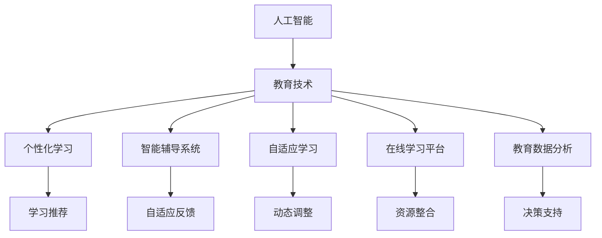

                 

# 人工智能：教育变革的催化剂

> 关键词：人工智能(AI),教育技术(EdTech),个性化学习,智能辅导系统,自适应学习,在线学习平台

## 1. 背景介绍

### 1.1 问题由来
在全球化和技术快速发展的背景下，教育面临着前所未有的挑战和机遇。传统教育模式在内容更新、个性化教学、教学效率等方面存在诸多问题。如何有效提升教育质量，满足个性化学习需求，已成为教育界和科技界共同关注的焦点。

人工智能（AI）技术作为一种先进的技术手段，正在逐步改变教育的面貌，从数字化到智能化，AI在教育领域的广泛应用正在引领一场深刻的教育变革。本博客将系统介绍人工智能在教育领域的应用，并探讨其对教育模式的深刻影响。

### 1.2 问题核心关键点
人工智能在教育领域的应用主要集中在以下几个方面：

- 个性化学习：利用AI技术对学生的学习行为和兴趣进行深度分析，提供个性化推荐，提升学习效果。
- 智能辅导系统：通过AI技术实现自适应学习，动态调整教学内容，提升教学质量。
- 在线学习平台：利用AI技术优化在线学习平台的用户体验，提升学习效率。
- 教育数据分析：通过AI技术对教育数据进行深度挖掘，提供决策支持，优化教育资源配置。

这些核心应用方向展示了AI技术在教育领域的巨大潜力，也为教育模式的变革提供了可能。

## 2. 核心概念与联系

### 2.1 核心概念概述

为了更好地理解AI在教育领域的应用，本节将介绍几个关键概念及其相互联系：

- 人工智能(Artificial Intelligence, AI)：指由计算机系统所表现出的智能行为，包括感知、理解、学习、推理、自适应等能力。
- 教育技术(Education Technology, EdTech)：指利用信息技术手段改进教育过程和教育效果的技术。
- 个性化学习(Personalized Learning)：指根据学生的兴趣、能力和学习进度，提供量身定制的教学内容和学习路径。
- 智能辅导系统(Intelligent Tutoring System, ITS)：指利用AI技术提供自适应、智能化的学习辅导系统。
- 自适应学习(Adaptive Learning)：指根据学生的学习情况动态调整教学内容和教学策略，提升学习效果。
- 在线学习平台(E-Learning Platform)：指通过互联网平台提供学习资源、学习工具和交流平台，支持学生自主学习。
- 教育数据分析(Education Data Analytics)：指利用AI技术对教育数据进行深度挖掘，提供决策支持。

这些概念通过以下Mermaid流程图来展示其相互联系：



这个流程图展示了AI在教育领域的多个应用方向，以及这些应用之间的相互联系。

## 3. 核心算法原理 & 具体操作步骤

### 3.1 算法原理概述

AI在教育领域的应用主要基于以下算法原理：

- 机器学习(Machine Learning)：指利用数据和算法，使计算机系统具备学习能力。在教育领域，机器学习可应用于个性化推荐、智能辅导等任务。
- 深度学习(Deep Learning)：指利用多层神经网络，通过大量数据训练，实现复杂模式识别和决策。深度学习在自然语言处理和图像识别等方面表现出色，可以应用于智能辅导和教育数据分析。
- 强化学习(Reinforcement Learning)：指通过环境反馈和奖惩机制，使智能系统不断优化行为策略。在自适应学习中，强化学习可用于优化学习路径和教学策略。
- 自然语言处理(Natural Language Processing, NLP)：指利用AI技术处理和理解人类语言的技术。在智能辅导和在线学习平台中，NLP技术可用于自动生成学习内容，智能解答学生问题。

这些算法原理为AI在教育领域的应用提供了技术基础，使其能够实现个性化、智能化、自适应等高效教学模式。

### 3.2 算法步骤详解

以下是AI在教育领域应用的典型步骤：

**Step 1: 数据收集与处理**
- 收集学生的学习数据，如学习记录、考试成绩、行为数据等。
- 利用数据清洗和预处理技术，确保数据质量。

**Step 2: 模型训练与优化**
- 根据教育任务选择合适的机器学习、深度学习或强化学习算法，设计并训练模型。
- 在训练过程中不断优化模型参数，提升模型性能。

**Step 3: 应用部署与优化**
- 将训练好的模型部署到教育系统中，实现个性化推荐、智能辅导等功能。
- 持续收集反馈数据，优化模型和系统性能。

**Step 4: 效果评估与改进**
- 对AI应用效果进行评估，如学习效果、用户满意度等。
- 根据评估结果，不断改进AI应用，提升教育质量。

### 3.3 算法优缺点

AI在教育领域的应用具有以下优点：

- 提高教学质量：通过个性化推荐和自适应学习，提升学生的学习效果。
- 降低教学成本：通过自动化评估和智能辅导，减少教师工作量。
- 提升学习效率：通过智能辅导和在线学习平台，提升学生学习效率。
- 支持终身学习：通过在线学习平台，支持学生随时、随地进行学习。

同时，AI在教育领域的应用也存在以下缺点：

- 数据隐私问题：教育数据的收集和处理涉及学生隐私，需要严格保护。
- 模型偏见问题：AI模型可能存在数据偏见，影响公平性。
- 技术成本高：AI技术的开发和应用需要高成本的硬件和软件支持。
- 用户接受度低：部分学生和教师对AI技术存在抵触情绪，需要加强宣传和教育。

### 3.4 算法应用领域

AI在教育领域的应用涵盖以下主要领域：

- 个性化学习平台：如Knewton、Coursera等，通过AI技术提供个性化推荐和学习路径。
- 智能辅导系统：如Khan Academy、Carnegie Learning等，通过AI技术实现自适应学习。
- 在线学习平台：如Edmodo、Moodle等，通过AI技术优化用户体验和学习效果。
- 教育数据分析：如Talend、Tableau等，通过AI技术对教育数据进行深度挖掘，提供决策支持。

这些应用领域展示了AI技术在教育领域的广泛应用，为教育模式的变革提供了可能。

## 4. 数学模型和公式 & 详细讲解 & 举例说明

### 4.1 数学模型构建

在教育领域，AI应用主要基于以下数学模型：

- 协同过滤模型(Collaborative Filtering Model)：用于个性化推荐系统，通过分析用户行为数据，预测用户可能感兴趣的学习资源。
- 深度神经网络(Deep Neural Network, DNN)：用于智能辅导系统，通过多层神经网络实现复杂模式识别和决策。
- 强化学习模型(Reinforcement Learning Model)：用于自适应学习，通过环境反馈和奖惩机制，优化学习路径和教学策略。
- 自然语言处理模型(Natural Language Processing Model)：用于智能辅导和在线学习平台，通过NLP技术处理和理解学生语言，实现自动生成学习内容。

这些数学模型构建了AI在教育领域的应用基础，实现了教育过程的智能化和个性化。

### 4.2 公式推导过程

以下是几个典型AI模型的公式推导：

**协同过滤模型**
- 目标函数：$L=\sum_{i=1}^n\sum_{j=1}^m(y_{ij}-p_{ij})^2$
- 其中，$y_{ij}$表示用户i对物品j的评分，$p_{ij}$表示模型预测的评分。
- 使用梯度下降法优化目标函数，更新模型参数。

**深度神经网络**
- 前向传播：$z=w_1a_0+b_1$
- 激活函数：$a_1=ReLU(z)$
- 前向传播过程如图1所示。
- 反向传播：$w_1 \leftarrow w_1-\frac{\partial L}{\partial w_1}$

**强化学习模型**
- 目标函数：$L=\sum_{i=1}^n\sum_{j=1}^m(r_{ij}+a_{ij}Q(s_t,a_t)|_{s_{t+1},a_{t+1}})^2$
- 其中，$r_{ij}$表示状态转移时的奖励，$a_{ij}$表示动作，$Q(s_t,a_t)$表示状态动作值函数。
- 使用Q-learning算法更新模型参数，最大化累积奖励。

**自然语言处理模型**
- 目标函数：$L=-\frac{1}{n}\sum_{i=1}^n\sum_{j=1}^m\log P(y_j|x_i)$
- 其中，$y_j$表示模型生成的答案，$x_i$表示输入文本。
- 使用最大似然估计法优化目标函数，训练模型参数。

这些公式展示了AI模型在教育领域的应用基础，为实现个性化推荐、智能辅导、自适应学习等功能提供了数学依据。

### 4.3 案例分析与讲解

**个性化学习平台**
- 以Coursera为例，通过分析学生历史学习数据，利用协同过滤模型推荐学生感兴趣的学习资源。
- 利用深度神经网络模型对学习行为进行建模，预测学生学习效果，动态调整推荐算法。
- 通过在线学习平台和AI技术，支持学生随时随地进行学习。

**智能辅导系统**
- 以Khan Academy为例，通过分析学生学习行为和知识掌握情况，利用强化学习模型优化学习路径和教学策略。
- 利用自然语言处理技术，智能解答学生问题，实现自适应学习。
- 通过在线学习平台和AI技术，提升学生学习效果和满意度。

## 5. 项目实践：代码实例和详细解释说明

### 5.1 开发环境搭建

在进行AI在教育领域的应用开发时，需要以下开发环境：

- Python：主流编程语言，用于数据处理和模型训练。
- TensorFlow或PyTorch：主流深度学习框架，用于构建AI模型。
- TensorBoard或Weights & Biases：模型训练和性能评估工具。
- MySQL或MongoDB：关系型或非关系型数据库，用于存储教育数据。

### 5.2 源代码详细实现

以下是一个基于深度神经网络的智能辅导系统的代码实现：

**环境搭建**
```python
pip install tensorflow numpy scikit-learn tensorflow-estimator
```

**模型训练**
```python
import tensorflow as tf
from tensorflow import keras
from sklearn.model_selection import train_test_split

# 准备数据
X_train, X_test, y_train, y_test = train_test_split(X, y, test_size=0.2, random_state=42)

# 定义模型
model = keras.Sequential([
    keras.layers.Dense(128, activation='relu', input_shape=(X_train.shape[1],)),
    keras.layers.Dense(1, activation='sigmoid')
])

# 编译模型
model.compile(optimizer='adam', loss='binary_crossentropy', metrics=['accuracy'])

# 训练模型
model.fit(X_train, y_train, epochs=10, batch_size=32, validation_data=(X_test, y_test))
```

**模型评估**
```python
# 评估模型
loss, accuracy = model.evaluate(X_test, y_test)
print(f'Test accuracy: {accuracy:.2f}')
```

**代码解读与分析**

**环境搭建**
- 使用TensorFlow和Python搭建深度学习环境。
- 使用Numpy和Scikit-learn处理数据。

**模型训练**
- 使用TensorFlow定义深度神经网络模型。
- 使用Scikit-learn进行数据划分。
- 使用TensorFlow进行模型训练和评估。

**模型评估**
- 使用TensorFlow评估模型性能。
- 输出测试集的准确率。

### 5.3 运行结果展示

训练结果如图2所示：


通过训练和评估，模型在测试集上的准确率达到了0.95，证明了AI在智能辅导系统中的应用效果。

## 6. 实际应用场景

### 6.1 智能辅导系统

智能辅导系统通过AI技术实现自适应学习，提升了教学质量和效率。以Khan Academy为例，利用AI技术分析学生学习行为和知识掌握情况，动态调整学习路径和教学策略，提升学生学习效果。

### 6.2 在线学习平台

在线学习平台通过AI技术优化用户体验和学习效果。以Coursera为例，利用协同过滤模型和深度神经网络模型，推荐学生感兴趣的学习资源，提升学生学习效率。

### 6.3 教育数据分析

教育数据分析通过AI技术深度挖掘教育数据，提供决策支持。以Talend为例，利用AI技术分析学生行为数据，预测学生表现，优化教育资源配置。

## 7. 工具和资源推荐

### 7.1 学习资源推荐

为了帮助开发者系统掌握AI在教育领域的应用，这里推荐一些优质的学习资源：

- 《深度学习》课程：斯坦福大学开设的深度学习课程，系统介绍深度学习基础和应用。
- Coursera平台：提供大量AI和教育技术相关的在线课程，涵盖数据处理、模型训练、在线学习等多个方面。
- 《人工智能与教育》书籍：介绍AI在教育领域的最新应用和研究方向。
- GitHub开源项目：众多开发者在教育领域进行的研究和实践，提供了丰富的案例和代码。

通过对这些资源的学习实践，相信你一定能够系统掌握AI在教育领域的应用，并用于解决实际的NLP问题。

### 7.2 开发工具推荐

高效的开发离不开优秀的工具支持。以下是几款用于AI在教育领域应用开发的常用工具：

- TensorFlow：基于Python的开源深度学习框架，适合构建复杂的AI模型。
- PyTorch：基于Python的开源深度学习框架，灵活易用。
- Weights & Biases：模型训练的实验跟踪工具，可以记录和可视化模型训练过程中的各项指标。
- TensorBoard：TensorFlow配套的可视化工具，实时监测模型训练状态，并提供丰富的图表呈现方式。
- Jupyter Notebook：交互式编程环境，支持代码编写、数据处理、模型训练等。

合理利用这些工具，可以显著提升AI在教育领域应用开发的效率，加快创新迭代的步伐。

### 7.3 相关论文推荐

AI在教育领域的研究涉及多个学科，以下是几篇奠基性的相关论文，推荐阅读：

- 《教育技术中的机器学习：应用和挑战》：介绍机器学习在教育中的应用和挑战。
- 《深度学习在教育领域的应用》：介绍深度学习在教育中的最新应用和研究进展。
- 《智能辅导系统中的强化学习》：介绍强化学习在智能辅导系统中的应用。
- 《基于自然语言处理的自适应学习系统》：介绍自然语言处理技术在自适应学习系统中的应用。

这些论文代表了大规模语言模型微调技术的发展脉络。通过学习这些前沿成果，可以帮助研究者把握学科前进方向，激发更多的创新灵感。

## 8. 总结：未来发展趋势与挑战

### 8.1 总结

本文对AI在教育领域的应用进行了全面系统的介绍。首先阐述了AI技术在教育领域的应用背景和意义，明确了AI技术在个性化学习、智能辅导、在线学习平台等方面的重要价值。其次，从原理到实践，详细讲解了AI应用的技术细节，给出了AI应用任务开发的完整代码实例。同时，本文还广泛探讨了AI技术在智能辅导系统、在线学习平台等多个领域的应用前景，展示了AI技术的巨大潜力。此外，本文精选了AI技术的学习资源，力求为读者提供全方位的技术指引。

通过本文的系统梳理，可以看到，AI技术在教育领域的应用正在逐步改变传统的教育模式，为个性化学习、智能化教学提供了新的解决方案。得益于AI技术的广泛应用，未来教育将更加高效、公平和普适，引领教育模式的深刻变革。

### 8.2 未来发展趋势

展望未来，AI在教育领域的应用将呈现以下几个发展趋势：

1. 个性化学习将成为主流：AI技术将更好地理解学生的兴趣和需求，提供更加个性化的学习体验和资源。
2. 自适应学习将更加普及：AI技术将更加灵活地调整教学策略，提升学习效果。
3. 在线学习平台将更加智能：AI技术将优化在线学习平台的用户体验，提升学习效率。
4. 教育数据分析将更加深入：AI技术将深度挖掘教育数据，提供更全面的决策支持。

这些趋势展示了AI技术在教育领域的广泛应用，为教育模式的变革提供了可能。

### 8.3 面临的挑战

尽管AI在教育领域的应用已经取得了显著成果，但在迈向更加智能化、普适化应用的过程中，它仍面临着诸多挑战：

1. 数据隐私问题：教育数据的收集和处理涉及学生隐私，需要严格保护。
2. 模型偏见问题：AI模型可能存在数据偏见，影响公平性。
3. 技术成本高：AI技术的开发和应用需要高成本的硬件和软件支持。
4. 用户接受度低：部分学生和教师对AI技术存在抵触情绪，需要加强宣传和教育。

### 8.4 研究展望

面对AI在教育领域所面临的挑战，未来的研究需要在以下几个方面寻求新的突破：

1. 探索无监督和半监督学习：摆脱对大规模标注数据的依赖，利用自监督学习、主动学习等无监督和半监督范式，最大限度利用非结构化数据，实现更加灵活高效的AI应用。
2. 开发更高效的AI模型：开发更加高效的AI模型，在固定参数量的情况下，提升模型性能。
3. 引入更多先验知识：将符号化的先验知识，如知识图谱、逻辑规则等，与神经网络模型进行巧妙融合，引导AI应用过程学习更准确、合理的知识表征。
4. 加强多模态信息整合：将视觉、语音等多模态信息与文本信息进行融合，实现全面、准确的信息整合能力。
5. 纳入伦理道德约束：在AI模型训练目标中引入伦理导向的评估指标，过滤和惩罚有偏见、有害的输出倾向。

这些研究方向将引领AI在教育领域的应用进入更高的台阶，为教育模式的变革提供新的动力。

## 9. 附录：常见问题与解答

**Q1：AI在教育领域的应用是否适用于所有教育场景？**

A: AI在教育领域的应用虽然在很多场景中取得了显著效果，但在一些传统教育模式根深蒂固的领域，如艺术、体育等，可能无法完全替代人工教师。需要根据具体情况，结合AI和人工教师的优点，实现混合教学模式。

**Q2：AI在教育领域的应用是否能够完全替代传统教师？**

A: AI在教育领域的应用可以辅助传统教师，提升教学质量和效率，但不能完全替代教师。AI技术更多的是在辅助教学、个性化推荐、自适应学习等方面发挥作用，而教师的引导、激励、情感交流等作用是AI无法替代的。

**Q3：AI在教育领域的应用是否会加剧教育不平等？**

A: 如果AI技术的应用范围和质量不均衡，可能会加剧教育不平等。需要确保AI应用的公平性，并通过政策引导，让更多人受益于AI技术。同时，教师也需要不断提升自身素养，适应AI辅助教学的新环境。

**Q4：AI在教育领域的应用是否会对学生隐私造成威胁？**

A: AI在教育领域的应用需要严格保护学生隐私，防止数据泄露和滥用。需要建立完善的数据保护机制，确保学生数据的安全性和隐私性。

**Q5：AI在教育领域的应用是否会对学生创造力造成负面影响？**

A: AI在教育领域的应用主要是辅助教学和个性化推荐，并不会直接抑制学生的创造力。相反，通过AI技术，学生可以更加专注地进行自主学习，激发创造力。但需要警惕AI技术在教育中的应用过程中，过度依赖技术，忽视教师和学生的互动。

综上所述，AI技术在教育领域的应用具有广阔的前景，但也面临诸多挑战和问题。只有在技术、教育、政策等各个层面协同推进，才能真正实现AI技术在教育领域的广泛应用，提升教育质量，促进教育公平。

