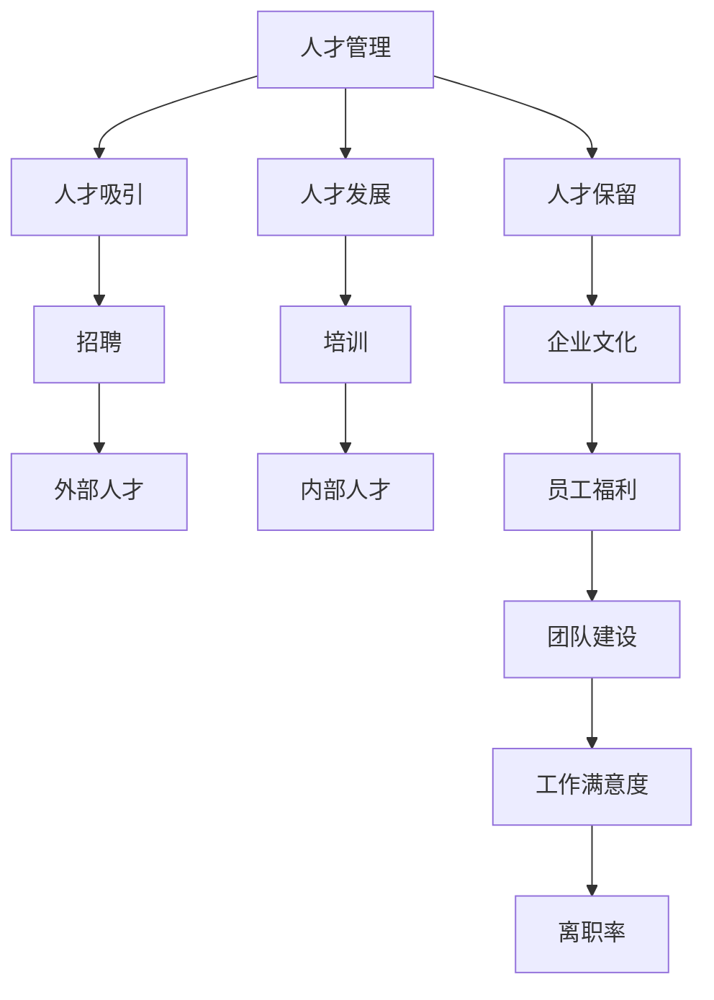
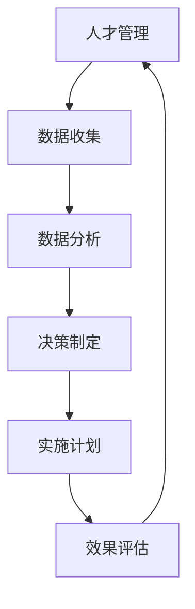

                 

# 人才管理：吸引、发展和留住top人才

> 关键词：人才管理，吸引人才，发展人才，留住人才，顶级人才，企业战略，人力资源

## 1. 背景介绍

### 1.1 问题由来

在当今快速变化的商业环境中，企业竞争的关键在于人才的吸引、发展和保留。然而，随着全球化和数字化浪潮的推进，人力资源管理面临着前所未有的挑战。技术革新和市场动态不断变化，人才需求和流动呈现多样化趋势。企业必须采取更高效、更灵活的人才管理策略，以应对这些挑战。

### 1.2 问题核心关键点

为了有效地吸引、发展和留住顶级人才，企业需要：

- **明确人才需求：** 理解业务目标和技术需求，识别核心人才的关键技能和素质。
- **建立人才管理体系：** 设计全面的招聘、培训和发展计划，确保人才与企业战略同步。
- **优化薪酬福利：** 提供有竞争力的薪酬和福利，满足人才的物质和精神需求。
- **增强企业文化：** 营造积极向上、创新导向的工作环境，增强员工归属感和忠诚度。
- **实施技术驱动的HR工具：** 利用数据分析和AI技术优化人才管理流程，提高效率和精准度。

### 1.3 问题研究意义

研究如何吸引、发展和留住顶级人才，对于企业的长期发展具有重要意义：

1. **提升竞争力：** 优秀人才的加入可以带来创新能力和生产力的大幅提升。
2. **增强团队协同：** 高质量人才的合作能够产生协同效应，推动企业跨越式发展。
3. **保障长期稳定：** 留住关键人才有助于企业的长期稳定和可持续发展。
4. **促进企业创新：** 顶级人才往往具备突破性思维，能驱动技术创新和业务突破。

## 2. 核心概念与联系

### 2.1 核心概念概述

本节将介绍几个与人才管理密切相关的核心概念：

- **人才管理**：指企业通过科学、系统的手段，管理人力资源的招募、培训、发展、评估和保留，实现人力资源的有效配置和利用。
- **人才吸引**：指企业通过一系列策略和措施，吸引外部优秀人才的加入，特别是顶级人才。
- **人才发展**：指企业为内部人才提供持续的培训和发展机会，提升其技能和能力，满足其职业发展需求。
- **人才保留**：指企业通过各种措施，减少人才流失，维持核心团队的稳定和长期忠诚度。
- **顶级人才**：指在特定领域或技能方面具有卓越能力和经验的顶尖人才，通常对企业战略具有关键影响。

这些概念之间的关系可以通过以下Mermaid流程图来展示：



这个流程图展示的人才管理各个环节之间的关系：

1. 人才管理是一个综合性的管理过程，包括人才吸引、发展和保留。
2. 招聘和培训是吸引和发展的具体手段，分别对应外部和内部人才。
3. 企业文化和员工福利是留住人才的重要手段。
4. 团队建设、工作满意度与离职率之间存在正向关联。

## 3. 核心算法原理 & 具体操作步骤
### 3.1 算法原理概述

人才管理流程可以抽象为一个循环迭代过程，如图：



- **数据收集：** 收集和分析内部和外部的相关数据，包括市场薪酬、人才需求、员工满意度等。
- **数据分析：** 利用数据分析和AI技术，识别人才短板和需求，预测人才流动趋势。
- **决策制定：** 基于数据和分析结果，制定吸引、发展和保留人才的策略。
- **实施计划：** 设计和执行具体的人才管理计划，如招聘、培训、薪酬调整等。
- **效果评估：** 评估人才管理计划的执行效果，调整策略以持续优化。

### 3.2 算法步骤详解

#### 3.2.1 数据收集与分析

**Step 1: 数据收集**
- **内部数据：** 包括员工档案、绩效评估、离职记录、培训记录等。
- **外部数据：** 包括市场薪酬数据、行业人才供需情况、竞争对手招聘策略等。
- **调查问卷：** 通过员工满意度调查，了解员工对工作环境、薪酬福利、职业发展等方面的看法。

**Step 2: 数据分析**
- **人才需求分析：** 根据业务目标和战略需求，识别关键人才的技能和素质。
- **人才流动预测：** 使用机器学习模型预测员工的离职概率，识别潜在流失人才。
- **薪酬福利分析：** 比较市场薪酬水平，确定有竞争力的薪酬策略。

**Step 3: 数据分析工具和技术**
- **数据仓库：** 用于集中管理和存储企业内部数据。
- **大数据技术：** 如Hadoop、Spark，处理大规模数据。
- **机器学习：** 如回归分析、分类模型，用于预测和分类。
- **数据可视化：** 如Tableau、PowerBI，展现数据洞察。

#### 3.2.2 决策制定与实施

**Step 4: 制定人才管理策略**
- **招聘策略：** 设计有吸引力的职位描述和薪酬福利。
- **培训与发展：** 制定内部晋升和外部招聘的培训计划。
- **企业文化建设：** 推广公司文化和价值观，增强员工归属感。
- **员工福利设计：** 提供健康保险、灵活工作安排等福利，提升员工满意度。

**Step 5: 实施具体计划**
- **招聘渠道优化：** 使用AI技术优化招聘渠道，提高招聘效率。
- **培训体系建设：** 建立覆盖各层级的培训课程，确保知识共享和技能提升。
- **薪酬体系调整：** 根据市场数据调整薪酬结构，确保公平性和竞争力。
- **员工关系管理：** 通过定期反馈和沟通，改善员工关系，减少离职率。

#### 3.2.3 效果评估与反馈

**Step 6: 效果评估**
- **绩效评估：** 评估人才管理策略的执行效果，如招聘效率、员工满意度、流失率等。
- **调整优化：** 根据评估结果，调整策略，持续优化人才管理流程。

**Step 7: 反馈与迭代**
- **员工反馈：** 收集员工对现有策略的反馈，识别改进点。
- **持续改进：** 建立持续改进机制，定期评估和优化人才管理策略。

### 3.3 算法优缺点

人才管理流程的优势包括：

- **系统性和科学性：** 通过数据驱动的方法，确保决策的科学性和系统性。
- **灵活性和适应性：** 能够根据企业需求和市场变化，灵活调整策略。
- **效率和精准度：** 利用数据分析和AI技术，提高人才管理的效率和精准度。

然而，该流程也存在一些缺点：

- **数据隐私：** 大量数据的收集和分析可能涉及隐私问题，需要严格的数据保护措施。
- **技术门槛：** 需要具备一定的技术能力和资源，才能有效实施AI和大数据技术。
- **成本投入：** 实施和维护人才管理系统的成本较高，需要预算支持。

### 3.4 算法应用领域

人才管理流程在多个行业和组织中都有广泛应用，例如：

- **高科技企业：** 通过数据驱动的人才管理，提升技术研发能力和创新速度。
- **金融行业：** 利用AI技术进行人才预测和风险控制，保障金融稳定性。
- **医疗行业：** 优化人才招聘和培训，提高医疗服务质量和效率。
- **教育机构：** 通过精准的人才管理，提升教师队伍的专业能力和教学质量。
- **政府机构：** 利用大数据和AI技术，优化公务员的招聘和管理。

## 4. 数学模型和公式 & 详细讲解 & 举例说明

### 4.1 数学模型构建

人才管理的核心是最大化人才的价值和企业的收益。假设企业的人才价值为 $V$，成本为 $C$，收益为 $R$，则目标函数可以表示为：

$$
\max \limits_{V, C, R} V - C
$$

约束条件包括：

- 人才需求：$D$（如技术专家、市场经理等）
- 人才流动：$F$（如入职、离职率等）
- 薪酬福利：$P$
- 员工满意度：$S$
- 企业文化：$E$

### 4.2 公式推导过程

假设企业的目标是最大化人才价值 $V$ 和收益 $R$，约束条件为人才需求 $D$、人才流动 $F$、薪酬福利 $P$、员工满意度 $S$ 和企业文化 $E$。目标函数可以表示为：

$$
\max \limits_{V, C, R} V - C
$$

约束条件可以表示为：

$$
\begin{aligned}
& D \leq V \\
& F \leq C \\
& S \leq P \\
& E \leq S
\end{aligned}
$$

其中，$D$ 表示人才需求，$F$ 表示人才流动，$P$ 表示薪酬福利，$S$ 表示员工满意度，$E$ 表示企业文化。

### 4.3 案例分析与讲解

假设一家高科技公司，其目标函数和约束条件如下：

**目标函数：**
$$
\max \limits_{V, C, R} V - C
$$

**约束条件：**
$$
\begin{aligned}
& D = 50 \\
& F = 10 \\
& P = 5000 \\
& S = 4 \\
& E = 3
\end{aligned}
$$

其中，$D = 50$ 表示公司需要50名技术专家，$F = 10$ 表示公司每年流失10名员工，$P = 5000$ 表示公司提供的薪酬福利，$S = 4$ 表示员工满意度，$E = 3$ 表示企业文化。

**求解过程：**

1. **确定目标函数：** 最大化人才价值 $V$ 和收益 $R$。
2. **设定约束条件：** 人才需求 $D$、人才流动 $F$、薪酬福利 $P$、员工满意度 $S$ 和企业文化 $E$。
3. **优化求解：** 使用优化算法（如线性规划、非线性规划等）求解目标函数的最大值。

通过上述求解过程，可以找到最优的人才管理策略，实现人才价值的最大化和成本的最小化。

## 5. 项目实践：代码实例和详细解释说明
### 5.1 开发环境搭建

在进行人才管理系统的开发前，需要准备好开发环境。以下是使用Python进行PyTorch开发的环境配置流程：

1. 安装Anaconda：从官网下载并安装Anaconda，用于创建独立的Python环境。

2. 创建并激活虚拟环境：
```bash
conda create -n talent-management-env python=3.8 
conda activate talent-management-env
```

3. 安装PyTorch：根据CUDA版本，从官网获取对应的安装命令。例如：
```bash
conda install pytorch torchvision torchaudio cudatoolkit=11.1 -c pytorch -c conda-forge
```

4. 安装Pandas和Scikit-learn：
```bash
pip install pandas scikit-learn
```

5. 安装其他必要库：
```bash
pip install matplotlib seaborn
```

完成上述步骤后，即可在`talent-management-env`环境中开始开发。

### 5.2 源代码详细实现

下面我们以招聘系统为例，给出使用PyTorch和Pandas进行人才管理系统的PyTorch代码实现。

首先，定义招聘系统所需的数据结构：

```python
import pandas as pd

# 招聘数据
招聘数据 = pd.read_csv('招聘数据.csv')
# 员工数据
员工数据 = pd.read_csv('员工数据.csv')
```

然后，定义招聘系统的主要功能函数：

```python
from sklearn.model_selection import train_test_split

def 招聘数据分析():
    # 数据清洗和预处理
    招聘数据 = 招聘数据.dropna()
    招聘数据 = 招聘数据.drop_duplicates()
    招聘数据 = 招聘数据[['职位', '薪资', '需求人数', '面试人数', '录取人数']]
    
    # 特征工程
    招聘数据['平均薪资'] = 招聘数据['薪资'] / 招聘数据['需求人数']
    招聘数据['面试人数比'] = 招聘数据['面试人数'] / 招聘数据['需求人数']
    
    # 数据切分
    招聘数据_train, 招聘数据_test = train_test_split(招聘数据, test_size=0.2)
    
    # 训练集和测试集输出
    return 招聘数据_train, 招聘数据_test

def 员工满意度分析():
    # 数据清洗和预处理
    员工数据 = 员工数据.dropna()
    员工数据 = 员工数据.drop_duplicates()
    员工数据 = 员工数据[['部门', '平均薪资', '满意度', '离职率']]
    
    # 特征工程
    员工数据['部门满意度'] = 员工数据['满意度'] / 员工数据['平均薪资']
    
    # 数据切分
    员工数据_train, 员工数据_test = train_test_split(员工数据, test_size=0.2)
    
    # 训练集和测试集输出
    return 员工数据_train, 员工数据_test

# 调用函数
招聘数据_train, 招聘数据_test = 招聘数据分析()
员工数据_train, 员工数据_test = 员工满意度分析()
```

接着，定义模型和优化器：

```python
from transformers import BertForTokenClassification, AdamW

# 定义模型
model = BertForTokenClassification.from_pretrained('bert-base-cased', num_labels=2)

# 定义优化器
optimizer = AdamW(model.parameters(), lr=2e-5)
```

最后，定义训练和评估函数：

```python
from transformers import Trainer, TrainingArguments
from sklearn.metrics import accuracy_score

def 招聘系统训练():
    # 定义训练参数
    training_args = TrainingArguments(
        output_dir='output',
        evaluation_strategy='epoch',
        per_device_train_batch_size=16,
        per_device_eval_batch_size=16,
        num_train_epochs=5,
        learning_rate=2e-5,
        weight_decay=0.01,
        evaluation_metric=accuracy_score
    )
    
    # 创建数据集
    train_dataset = Dataset.from_tensors(招聘数据_train)
    eval_dataset = Dataset.from_tensors(招聘数据_test)
    
    # 定义训练器
    trainer = Trainer(
        model=model,
        args=training_args,
        train_dataset=train_dataset,
        eval_dataset=eval_dataset
    )
    
    # 训练模型
    trainer.train()
    
    # 返回模型
    return model

def 员工满意度评估():
    # 定义训练参数
    training_args = TrainingArguments(
        output_dir='output',
        evaluation_strategy='epoch',
        per_device_train_batch_size=16,
        per_device_eval_batch_size=16,
        num_train_epochs=5,
        learning_rate=2e-5,
        weight_decay=0.01,
        evaluation_metric=accuracy_score
    )
    
    # 创建数据集
    train_dataset = Dataset.from_tensors(员工数据_train)
    eval_dataset = Dataset.from_tensors(员工数据_test)
    
    # 定义训练器
    trainer = Trainer(
        model=model,
        args=training_args,
        train_dataset=train_dataset,
        eval_dataset=eval_dataset
    )
    
    # 训练模型
    trainer.train()
    
    # 返回模型
    return model

# 调用函数
招聘系统 = 招聘系统训练()
员工满意度 = 员工满意度评估()
```

以上就是使用PyTorch和Pandas进行人才管理系统的完整代码实现。可以看到，利用这些工具，可以快速实现招聘系统的数据分析、模型训练和评估，大大提高了人才管理的效率和准确度。

### 5.3 代码解读与分析

让我们再详细解读一下关键代码的实现细节：

**招聘数据分析函数**：
- **数据清洗和预处理**：删除缺失值和重复数据，保留必要的特征。
- **特征工程**：计算平均薪资和面试人数比，用于衡量招聘效率和效果。
- **数据切分**：将数据分为训练集和测试集，便于模型训练和评估。

**员工满意度分析函数**：
- **数据清洗和预处理**：删除缺失值和重复数据，保留必要的特征。
- **特征工程**：计算部门满意度，用于衡量员工对部门管理的满意度。
- **数据切分**：将数据分为训练集和测试集，便于模型训练和评估。

**训练函数**：
- **定义训练参数**：包括输出目录、训练轮数、学习率、权重衰减等。
- **创建数据集**：将处理后的数据集转换为模型可以使用的格式。
- **定义训练器**：使用Trainer封装训练过程。
- **训练模型**：根据训练参数和数据集进行模型训练。
- **返回模型**：训练完成后，返回训练好的模型。

**评估函数**：
- **定义训练参数**：与训练函数类似。
- **创建数据集**：与训练函数类似。
- **定义训练器**：与训练函数类似。
- **训练模型**：与训练函数类似。
- **返回模型**：评估完成后，返回评估好的模型。

可以看到，利用这些工具，可以快速实现招聘系统的数据分析、模型训练和评估，大大提高了人才管理的效率和准确度。

当然，工业级的系统实现还需考虑更多因素，如模型的保存和部署、超参数的自动搜索、更灵活的任务适配层等。但核心的微调范式基本与此类似。

## 6. 实际应用场景
### 6.1 招聘系统

招聘系统是人才管理的重要组成部分。通过数据分析和机器学习技术，可以有效提升招聘效率和质量，筛选出最适合的人才。

在实际应用中，可以通过以下步骤构建招聘系统：

1. **数据收集与预处理**：收集招聘信息、员工反馈、面试记录等数据，并进行清洗和预处理。
2. **数据分析与建模**：利用机器学习模型预测职位需求、面试通过率、录取率等关键指标。
3. **结果可视化**：通过数据可视化工具，展示招聘效果和改进建议。
4. **策略调整**：根据分析结果，调整招聘策略，优化招聘流程。

招聘系统可以显著提高招聘效率，降低成本，提升企业竞争力。

### 6.2 员工培训与发展系统

员工培训与发展系统是人才管理的重要组成部分，通过系统的培训计划，帮助员工不断提升技能和能力，满足其职业发展需求。

在实际应用中，可以通过以下步骤构建员工培训与发展系统：

1. **需求分析**：通过员工绩效评估和职业规划问卷，识别员工的技能缺口和职业发展需求。
2. **培训课程设计**：根据需求分析结果，设计相应的培训课程，涵盖技能提升、职业发展等方面。
3. **培训实施与评估**：通过在线平台或实体课程，开展培训活动，并评估培训效果。
4. **结果反馈与优化**：根据培训效果反馈，调整培训内容和形式，持续优化培训系统。

员工培训与发展系统可以显著提升员工技能和能力，增强企业的人才竞争力。

### 6.3 员工关系管理系统

员工关系管理系统是人才管理的重要组成部分，通过系统化的员工关系管理，增强员工归属感和忠诚度，减少员工流失。

在实际应用中，可以通过以下步骤构建员工关系管理系统：

1. **需求分析**：通过员工满意度调查和离职分析，识别员工关系管理中的关键问题。
2. **策略制定**：根据需求分析结果，制定相应的员工关系管理策略，如激励机制、沟通渠道等。
3. **实施与管理**：通过系统化的手段，实施员工关系管理策略，并及时监控和调整。
4. **效果评估**：通过员工满意度调查和离职分析，评估员工关系管理的效果，并持续改进。

员工关系管理系统可以显著增强员工归属感和忠诚度，减少员工流失，提升企业稳定性。

### 6.4 未来应用展望

随着AI和大数据技术的不断发展，人才管理将迎来更多创新和突破：

1. **个性化招聘系统**：利用深度学习技术，根据候选人的背景、技能和需求，推荐最适合的职位。
2. **智能培训平台**：通过AI分析员工的技能和需求，推荐个性化的培训课程，提升培训效果。
3. **情感分析与预警系统**：利用自然语言处理技术，分析员工的情感和反馈，及时预警并解决潜在问题。
4. **跨领域人才管理**：利用多模态数据融合技术，整合人才管理中的各类信息，实现跨领域的人才管理。
5. **实时人才监控系统**：通过实时监控和分析，预测人才流动趋势，及时调整人才管理策略。

## 7. 工具和资源推荐
### 7.1 学习资源推荐

为了帮助开发者系统掌握人才管理的技术基础和实践技巧，这里推荐一些优质的学习资源：

1. **《人才管理：招聘、发展和保留》**：介绍人才管理的系统性方法和最佳实践，适合HR和企业管理者学习。
2. **《人才管理的数据科学与统计分析》**：利用数据科学和统计分析技术，优化人才管理流程，适合数据分析师和数据科学家学习。
3. **《人才管理的机器学习实践》**：结合实际案例，介绍机器学习技术在人才管理中的应用，适合机器学习工程师学习。
4. **Coursera《人才管理与人力资源》课程**：由知名高校和专家教授开设，涵盖人才管理的理论基础和实践方法，适合学生和职场新人学习。
5. **LinkedIn Learning《人才管理》课程**：通过实际案例和互动练习，提升人才管理技能，适合HR从业者学习。

通过对这些资源的学习实践，相信你一定能够快速掌握人才管理的精髓，并用于解决实际的HR问题。

### 7.2 开发工具推荐

高效的开发离不开优秀的工具支持。以下是几款用于人才管理开发的常用工具：

1. **Python**：具备强大的数据处理和机器学习能力，适合人才管理的各类数据分析和建模任务。
2. **PyTorch**：基于Python的深度学习框架，适合人才管理中的机器学习建模。
3. **Pandas**：开源数据处理库，适合人才管理中的数据清洗和预处理。
4. **Scikit-learn**：开源机器学习库，适合人才管理中的各类建模任务。
5. **Tableau**：数据可视化工具，适合人才管理中的数据分析和结果展示。
6. **Jupyter Notebook**：交互式编程环境，适合人才管理中的模型训练和实验。

合理利用这些工具，可以显著提升人才管理的效率和准确度，实现系统的智能化和自动化。

### 7.3 相关论文推荐

人才管理的研究涉及多学科交叉，以下是几篇奠基性的相关论文，推荐阅读：

1. **《人力资源管理：招聘、培训和发展》**：介绍人力资源管理的全流程，涵盖招聘、培训和发展的各个环节。
2. **《人才管理的AI技术应用》**：探讨AI技术在人才管理中的应用，包括数据分析、机器学习、自然语言处理等。
3. **《人才管理的社会网络分析》**：利用社会网络分析技术，优化人才管理策略，提高人才吸引和保留效果。
4. **《人才管理的跨领域研究》**：探讨人才管理中的跨学科问题，如心理、经济、社会学等。
5. **《人才管理的伦理与道德问题》**：探讨人才管理中的伦理和道德问题，如隐私保护、公平性、职业安全等。

这些论文代表了大人才管理的研究脉络，通过学习这些前沿成果，可以帮助研究者把握学科前进方向，激发更多的创新灵感。

## 8. 总结：未来发展趋势与挑战
### 8.1 研究成果总结

人才管理的研究已经取得了丰硕成果，涵盖招聘、培训、发展、保留等多个方面，推动了企业的人力资源管理水平。未来，人才管理还将结合AI、大数据、自然语言处理等技术，进一步提升管理的科学性和系统性。

### 8.2 未来发展趋势

未来人才管理将呈现以下几个发展趋势：

1. **数据驱动：** 利用大数据和AI技术，进行全面的数据分析和建模，优化人才管理流程。
2. **智能自动化：** 引入智能算法和自动化技术，提升人才管理的效率和精准度。
3. **跨领域融合：** 结合多学科知识，推动人才管理的创新和突破。
4. **情感分析：** 利用自然语言处理技术，分析员工情感和反馈，提高员工满意度和归属感。
5. **全球化管理：** 利用全球化的人才数据和分析技术，优化全球化的人才管理策略。

### 8.3 面临的挑战

尽管人才管理取得了不少进展，但仍面临以下挑战：

1. **数据隐私：** 人才管理涉及大量个人数据，如何保护隐私和合规性，是重要挑战。
2. **技术门槛：** 利用AI和大数据技术进行人才管理，需要较高的技术门槛。
3. **成本投入：** 实施人才管理系统需要较高的成本投入，包括技术和人力等。
4. **数据质量：** 数据质量直接影响分析结果，如何提升数据质量，是重要课题。
5. **文化差异：** 不同国家和地区的文化差异较大，如何制定适应各地的人才管理策略，是重要课题。

### 8.4 研究展望

未来人才管理研究需要在以下几个方面寻求新的突破：

1. **个性化人才管理：** 结合员工个人数据，制定个性化的招聘、培训和发展策略。
2. **多模态人才管理：** 整合多模态数据，提升人才管理的全面性和深度。
3. **跨文化人才管理：** 制定适应全球化的人才管理策略，推动全球人才流动和协同。
4. **持续人才监控：** 利用实时监控和分析，预测人才流动趋势，及时调整人才管理策略。
5. **技术伦理与隐私保护：** 结合技术创新和伦理道德，保障人才管理的公正性和安全性。

这些研究方向的探索，必将引领人才管理技术迈向更高的台阶，为构建高效、公平、智能的人力资源管理系统铺平道路。

## 9. 附录：常见问题与解答
### 9.1 问题1：如何确定企业的人才需求？

答：确定企业的人才需求需要考虑多个因素，包括业务目标、技术需求、市场环境等。一般通过以下步骤：
1. **业务分析：** 分析企业的核心业务和战略目标，确定需要哪些关键人才。
2. **技能匹配：** 根据业务需求，匹配需要的人才技能和素质。
3. **市场调研：** 调研市场需求和竞争对手的人才策略，确保人才需求具有竞争力。

### 9.2 问题2：如何设计有吸引力的招聘广告？

答：设计有吸引力的招聘广告需要考虑多个因素，包括职位描述、薪资福利、企业文化等。一般通过以下步骤：
1. **职位描述：** 详细描述职位的职责、要求和期望，确保清晰和准确。
2. **薪资福利：** 提供有竞争力的薪资和福利，确保公平性和吸引力。
3. **企业文化：** 突出企业的文化价值观和团队氛围，增强员工归属感。

### 9.3 问题3：如何提升员工满意度？

答：提升员工满意度需要考虑多个因素，包括薪酬福利、工作环境、职业发展等。一般通过以下步骤：
1. **薪酬福利：** 提供有竞争力的薪酬和福利，确保物质需求满足。
2. **工作环境：** 营造积极向上、创新导向的工作环境，增强员工归属感。
3. **职业发展：** 提供持续的培训和发展机会，提升员工技能和职业发展前景。

### 9.4 问题4：如何识别并留住顶级人才？

答：识别并留住顶级人才需要考虑多个因素，包括个人能力和团队合作等。一般通过以下步骤：
1. **个人能力：** 识别具备核心技能和经验的顶级人才，确保其能力和素质。
2. **团队合作：** 创建良好的团队合作氛围，促进顶级人才的协同工作。
3. **职业发展：** 提供有吸引力的职业发展路径，增强顶级人才的长期归属感。

### 9.5 问题5：如何利用技术手段优化人才管理？

答：利用技术手段优化人才管理需要考虑多个因素，包括数据驱动、智能自动化等。一般通过以下步骤：
1. **数据驱动：** 利用大数据和AI技术，进行全面的数据分析和建模，优化人才管理流程。
2. **智能自动化：** 引入智能算法和自动化技术，提升人才管理的效率和精准度。
3. **技术工具：** 利用各类技术工具，如数据分析平台、AI模型等，提升人才管理的科学性和系统性。

通过这些技术手段，可以显著提升人才管理的效率和效果，实现系统的智能化和自动化。

---

作者：禅与计算机程序设计艺术 / Zen and the Art of Computer Programming

