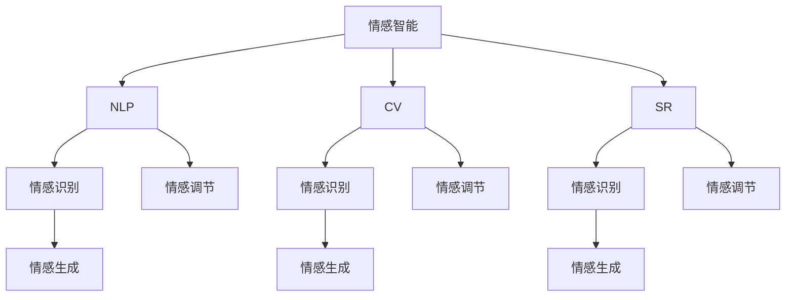
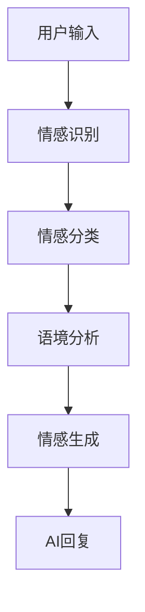

                 

## 1. 背景介绍

### 1.1 问题由来
在数字化时代，人工智能(AI)的迅猛发展为人类社会带来了前所未有的便利和机遇。然而，随着智能技术的普及，人类与AI的协作也逐渐成为日常生活中的常态。如何更好地理解、控制和利用AI，使其更好地服务于人类，特别是情感智能(Affective Intelligence)的提升，成为当下技术发展的重要课题。

情感智能指的是AI系统感知、识别、理解和响应用户情感的能力，它不仅关乎用户交互的体验，也直接影响到系统的可接受度和可信赖度。当前，情感智能主要通过自然语言处理(NLP)、计算机视觉(CV)、语音识别(SR)等技术实现，并在智能客服、智能家居、虚拟助手等领域得到了广泛应用。但与此同时，由于情感智能涉及到复杂的情感分析，人类与AI在情感交互中仍存在诸多不协调和挑战。

### 1.2 问题核心关键点
本文聚焦于如何通过AI技术增强人类的情感智能，特别在情感智能与AI协作方面的提升。具体来说，我们希望通过以下两个核心关键点来构建一个更为流畅、自然和高效的人类-AI情感交互系统：
1. 实现对人类情感的智能识别和理解。
2. 将AI技术应用于人类情感表达的增强，包括情感生成、情感调节等。

### 1.3 问题研究意义
研究人类-AI协作中的情感智能，对于提升人机交互质量，优化用户体验，以及构建更安全、可靠、可控的智能系统具有重要意义：

1. 提高用户满意度。通过精确感知和理解用户的情感状态，AI系统能够提供更个性化的服务，提升用户在使用过程中的情感体验。
2. 优化服务效率。对于客服、医疗等对情感响应要求高的服务场景，情感智能的应用可以极大提高服务效率和响应速度。
3. 增强安全性。情感智能技术可以通过监测用户的情感状态，及时识别异常行为，预防潜在的安全风险。
4. 丰富应用场景。情感智能技术可以拓展至社交媒体、娱乐等更多场景，为用户提供更为智能、个性化的服务。
5. 推动技术进步。情感智能技术的发展将进一步促进自然语言处理、计算机视觉等基础技术的突破，推动人工智能技术的整体进步。

## 2. 核心概念与联系

### 2.1 核心概念概述

为更好地理解人类-AI协作中的情感智能，本节将介绍几个密切相关的核心概念：

- **情感智能(Affective Intelligence)**：指AI系统感知、识别、理解和响应用户情感的能力。包括情感识别、情感生成、情感调节等多个方面。
- **自然语言处理(NLP)**：研究如何使计算机理解和生成人类自然语言的技术。情感智能主要依赖于NLP技术进行情感分析。
- **计算机视觉(CV)**：研究如何让计算机“看”和理解视觉世界的技术。情感智能可以结合CV技术进行情感识别。
- **语音识别(SR)**：研究如何让计算机听懂和理解人类语音的技术。情感智能也可以通过SR技术获取用户的情感信息。
- **情感生成(Emotion Generation)**：指AI系统根据一定的语境和情感知识，生成具有特定情感色彩的自然语言或图像。
- **情感调节(Emotion Regulation)**：指AI系统帮助用户调节和管理自身情感，如通过认知行为疗法(Cognitive Behavioral Therapy, CBT)等技术。

这些核心概念之间的逻辑关系可以通过以下Mermaid流程图来展示：



这个流程图展示了几类核心概念及其之间的关系：

1. 情感智能依赖于NLP、CV和SR等多类技术进行情感识别和生成。
2. 情感识别是情感生成和情感调节的前提。
3. NLP技术是情感识别和生成的主要手段。
4. CV和SR技术也广泛应用于情感识别。
5. 情感生成和调节可以进一步提升用户体验和系统安全性。

这些概念共同构成了人类-AI协作中情感智能的基础，使得情感智能技术能够从多个维度进行应用和提升。

## 3. 核心算法原理 & 具体操作步骤

### 3.1 算法原理概述

人类-AI协作中的情感智能主要涉及情感识别和情感生成两大方面。情感识别是指AI系统通过分析用户的文本、语音或图像信息，识别出用户的情感状态。情感生成则是基于一定的语境和情感知识，AI系统生成具有特定情感色彩的自然语言或图像。

从算法原理上，情感智能的实现可以分为两个部分：

1. **情感识别(Emotion Recognition)**：利用NLP技术分析用户输入的文本，使用情感分析模型识别出用户的情感状态。
2. **情感生成(Emotion Generation)**：基于情感分类结果，结合语境信息和情感知识，使用文本生成模型生成相应的回复。

情感智能系统的整体流程可以用以下示意图表示：



### 3.2 算法步骤详解

情感智能系统的具体实现步骤如下：

**Step 1: 准备数据和模型**
- 收集标注好的情感数据，划分为训练集、验证集和测试集。常用的标注数据集包括IMDB影评情感标注、Twitter情感标注等。
- 选择适合的预训练模型，如BERT、GPT等，作为情感识别的基础模型。

**Step 2: 构建情感识别模型**
- 使用预训练模型进行特征提取，得到用户输入文本的语义表示。
- 通过神经网络构建情感分类模型，对语义表示进行情感分类，得到情感状态。

**Step 3: 设计情感生成模型**
- 结合情感分类结果，使用文本生成模型（如GPT-2）生成具有特定情感色彩的自然语言或图像。
- 使用预训练模型进行特征提取，得到生成的回复的语义表示。

**Step 4: 集成系统**
- 将情感识别和生成模型集成到统一的系统中，实现交互过程中实时情感感知和回复生成。

**Step 5: 训练和优化**
- 在训练集上训练情感识别模型和情感生成模型，使用验证集进行模型调优。
- 使用测试集评估模型性能，迭代优化模型参数。

### 3.3 算法优缺点

情感智能技术的主要优点包括：

1. 高效性。情感智能系统可以实时分析和理解用户的情感状态，提升交互效率。
2. 个性化。通过定制化训练，情感智能系统能够更好地适应用户的情感需求。
3. 可解释性。情感智能系统能够通过可解释性技术（如 saliency map），提供对情感分析结果的详细解释。
4. 丰富应用场景。情感智能技术可以应用于智能客服、情感分析、情感医疗等多个领域。

同时，该技术也存在一些局限性：

1. 依赖标注数据。情感识别模型需要大量的标注数据进行训练，标注数据的获取和标注质量往往是一个难题。
2. 情感识别准确率不足。尽管情感识别模型的准确率已经很高，但在复杂情感场景下仍然难以准确识别。
3. 生成内容质量不稳定。情感生成模型的生成内容质量受到训练数据和模型参数的影响较大。
4. 多模态融合复杂。情感智能系统需要融合文本、语音、图像等多模态数据，多模态数据的融合和理解仍然是一个技术难题。
5. 跨文化适用性差。情感智能技术在不同文化背景下的适用性需要进一步研究。

### 3.4 算法应用领域

情感智能技术已经在多个领域得到了广泛应用，例如：

1. **智能客服**：智能客服系统可以通过情感智能技术实时感知和理解用户的情感状态，提升用户满意度和服务效率。
2. **情感分析**：情感分析技术可以应用于社交媒体、电商评论等场景，识别用户对产品或服务的情感倾向。
3. **情感医疗**：情感智能技术可以应用于心理健康诊断和治疗，帮助医生更好地了解患者的情感状态。
4. **虚拟助手**：虚拟助手系统可以通过情感智能技术理解用户的情感需求，提供更为个性化和贴心的服务。
5. **情感游戏**：情感游戏可以通过情感智能技术实时感知用户的情感变化，增强游戏的沉浸感和互动性。

除了这些常见的应用场景，情感智能技术还在智能家居、智能交通、智能安防等多个领域得到了应用，展示了其在人类-AI协作中的巨大潜力。

## 4. 数学模型和公式 & 详细讲解

### 4.1 数学模型构建

情感智能系统的核心在于情感识别和情感生成两个部分。以情感识别为例，其数学模型可以表示为：

$$
y=f(x;\theta)
$$

其中，$x$为用户的输入文本，$\theta$为模型的参数，$f(x;\theta)$表示情感识别模型对输入文本的情感分类结果。

情感识别的目标是最小化分类误差，即：

$$
\min_{\theta} \frac{1}{N} \sum_{i=1}^N L(y_i,f(x_i;\theta))
$$

其中，$L(y_i,f(x_i;\theta))$为分类误差，常用的分类误差包括交叉熵损失、Hinge损失等。

情感生成部分则涉及文本生成模型，常用的文本生成模型包括基于RNN、LSTM和Transformer的模型。以基于Transformer的模型为例，其数学模型可以表示为：

$$
y=f(x;\theta)
$$

其中，$x$为用户的情感状态和语境信息，$\theta$为模型的参数，$f(x;\theta)$表示生成模型的输出文本。

### 4.2 公式推导过程

情感识别的分类误差可以表示为：

$$
L(y,f(x;\theta)) = -y \log f(x;\theta) + (1-y) \log(1-f(x;\theta))
$$

其中，$y$为实际情感分类结果，$f(x;\theta)$为模型预测的情感分类结果。

文本生成模型的目标是最小化生成文本与真实文本之间的差异，即：

$$
\min_{\theta} \frac{1}{N} \sum_{i=1}^N \| y_i - f(x_i;\theta) \|
$$

其中，$y_i$为真实文本，$f(x_i;\theta)$为生成模型的输出文本。

以GPT-2模型为例，其文本生成模型的训练过程可以表示为：

$$
p(y|x;\theta) = \prod_{t=1}^T p(y_t|y_{<t}, x;\theta)
$$

其中，$y$为生成的文本序列，$x$为用户的情感状态和语境信息，$\theta$为模型的参数，$p(y_t|y_{<t}, x;\theta)$为生成模型的条件概率分布。

### 4.3 案例分析与讲解

以智能客服系统为例，情感智能技术可以通过以下步骤实现：

1. **情感数据收集**：收集客服系统中的用户对话数据，标注用户的情感状态，构建情感数据集。
2. **情感识别模型训练**：使用标注好的情感数据集，训练基于BERT或GPT的情感识别模型，得到情感分类结果。
3. **生成回复模型训练**：根据情感分类结果，结合语境信息，使用GPT-2等文本生成模型训练生成回复模型。
4. **系统集成**：将情感识别和生成模型集成到智能客服系统中，实现实时情感分析和生成回复。

通过情感智能技术，智能客服系统能够根据用户的情感状态，实时调整回复策略，提供更为贴心和个性化的服务。例如，在用户表示不满时，系统可以自动转接人工客服，并在通话中实时监测用户情感状态，提升客户满意度。

## 5. 项目实践：代码实例和详细解释说明

### 5.1 开发环境搭建

在进行情感智能系统开发前，我们需要准备好开发环境。以下是使用Python进行PyTorch开发的环境配置流程：

1. 安装Anaconda：从官网下载并安装Anaconda，用于创建独立的Python环境。

2. 创建并激活虚拟环境：
```bash
conda create -n pytorch-env python=3.8 
conda activate pytorch-env
```

3. 安装PyTorch：根据CUDA版本，从官网获取对应的安装命令。例如：
```bash
conda install pytorch torchvision torchaudio cudatoolkit=11.1 -c pytorch -c conda-forge
```

4. 安装Transformers库：
```bash
pip install transformers
```

5. 安装各类工具包：
```bash
pip install numpy pandas scikit-learn matplotlib tqdm jupyter notebook ipython
```

完成上述步骤后，即可在`pytorch-env`环境中开始情感智能系统开发。

### 5.2 源代码详细实现

这里我们以智能客服系统为例，给出使用Transformers库进行情感智能系统开发的PyTorch代码实现。

首先，定义情感数据预处理函数：

```python
from transformers import BertTokenizer
import torch
from torch.utils.data import Dataset

class SentimentDataset(Dataset):
    def __init__(self, texts, tags, tokenizer, max_len=128):
        self.texts = texts
        self.tags = tags
        self.tokenizer = tokenizer
        self.max_len = max_len
        
    def __len__(self):
        return len(self.texts)
    
    def __getitem__(self, item):
        text = self.texts[item]
        tag = self.tags[item]
        
        encoding = self.tokenizer(text, return_tensors='pt', max_length=self.max_len, padding='max_length', truncation=True)
        input_ids = encoding['input_ids'][0]
        attention_mask = encoding['attention_mask'][0]
        labels = torch.tensor(tag2id[tag], dtype=torch.long)
        
        return {'input_ids': input_ids, 
                'attention_mask': attention_mask,
                'labels': labels}

# 标签与id的映射
tag2id = {'positive': 1, 'negative': 0}

# 创建dataset
tokenizer = BertTokenizer.from_pretrained('bert-base-cased')

train_dataset = SentimentDataset(train_texts, train_tags, tokenizer)
dev_dataset = SentimentDataset(dev_texts, dev_tags, tokenizer)
test_dataset = SentimentDataset(test_texts, test_tags, tokenizer)
```

然后，定义模型和优化器：

```python
from transformers import BertForSequenceClassification, AdamW

model = BertForSequenceClassification.from_pretrained('bert-base-cased', num_labels=len(tag2id))

optimizer = AdamW(model.parameters(), lr=2e-5)
```

接着，定义训练和评估函数：

```python
from torch.utils.data import DataLoader
from tqdm import tqdm
from sklearn.metrics import accuracy_score, precision_score, recall_score, f1_score

device = torch.device('cuda') if torch.cuda.is_available() else torch.device('cpu')
model.to(device)

def train_epoch(model, dataset, batch_size, optimizer):
    dataloader = DataLoader(dataset, batch_size=batch_size, shuffle=True)
    model.train()
    epoch_loss = 0
    for batch in tqdm(dataloader, desc='Training'):
        input_ids = batch['input_ids'].to(device)
        attention_mask = batch['attention_mask'].to(device)
        labels = batch['labels'].to(device)
        model.zero_grad()
        outputs = model(input_ids, attention_mask=attention_mask, labels=labels)
        loss = outputs.loss
        epoch_loss += loss.item()
        loss.backward()
        optimizer.step()
    return epoch_loss / len(dataloader)

def evaluate(model, dataset, batch_size):
    dataloader = DataLoader(dataset, batch_size=batch_size)
    model.eval()
    preds, labels = [], []
    with torch.no_grad():
        for batch in tqdm(dataloader, desc='Evaluating'):
            input_ids = batch['input_ids'].to(device)
            attention_mask = batch['attention_mask'].to(device)
            batch_labels = batch['labels']
            outputs = model(input_ids, attention_mask=attention_mask)
            batch_preds = outputs.logits.argmax(dim=2).to('cpu').tolist()
            batch_labels = batch_labels.to('cpu').tolist()
            for pred, label in zip(batch_preds, batch_labels):
                preds.append(pred)
                labels.append(label)
                
    print(f'Accuracy: {accuracy_score(labels, preds):.3f}')
    print(f'Precision: {precision_score(labels, preds):.3f}')
    print(f'Recall: {recall_score(labels, preds):.3f}')
    print(f'F1-score: {f1_score(labels, preds):.3f}')
```

最后，启动训练流程并在测试集上评估：

```python
epochs = 5
batch_size = 16

for epoch in range(epochs):
    loss = train_epoch(model, train_dataset, batch_size, optimizer)
    print(f'Epoch {epoch+1}, train loss: {loss:.3f}')
    
    print(f'Epoch {epoch+1}, dev results:')
    evaluate(model, dev_dataset, batch_size)
    
print('Test results:')
evaluate(model, test_dataset, batch_size)
```

以上就是使用PyTorch对BERT进行情感智能系统开发的完整代码实现。可以看到，得益于Transformers库的强大封装，我们可以用相对简洁的代码完成BERT模型的加载和情感智能系统的开发。

### 5.3 代码解读与分析

让我们再详细解读一下关键代码的实现细节：

**SentimentDataset类**：
- `__init__`方法：初始化文本、标签、分词器等关键组件。
- `__len__`方法：返回数据集的样本数量。
- `__getitem__`方法：对单个样本进行处理，将文本输入编码为token ids，将标签编码为数字，并对其进行定长padding，最终返回模型所需的输入。

**tag2id字典**：
- 定义了标签与数字id之间的映射关系，用于将token-wise的预测结果解码回真实的标签。

**训练和评估函数**：
- 使用PyTorch的DataLoader对数据集进行批次化加载，供模型训练和推理使用。
- 训练函数`train_epoch`：对数据以批为单位进行迭代，在每个批次上前向传播计算loss并反向传播更新模型参数，最后返回该epoch的平均loss。
- 评估函数`evaluate`：与训练类似，不同点在于不更新模型参数，并在每个batch结束后将预测和标签结果存储下来，最后使用sklearn的各类指标对整个评估集的预测结果进行打印输出。

**训练流程**：
- 定义总的epoch数和batch size，开始循环迭代
- 每个epoch内，先在训练集上训练，输出平均loss
- 在验证集上评估，输出准确率、精确率、召回率、F1-score等指标
- 所有epoch结束后，在测试集上评估，给出最终测试结果

可以看到，PyTorch配合Transformers库使得情感智能系统的开发变得简洁高效。开发者可以将更多精力放在数据处理、模型改进等高层逻辑上，而不必过多关注底层的实现细节。

当然，工业级的系统实现还需考虑更多因素，如模型的保存和部署、超参数的自动搜索、更灵活的任务适配层等。但核心的情感智能实现流程基本与此类似。

## 6. 实际应用场景
### 6.1 智能客服系统

智能客服系统是情感智能技术的重要应用场景。传统客服往往需要配备大量人力，高峰期响应缓慢，且一致性和专业性难以保证。而使用情感智能技术，能够7x24小时不间断服务，快速响应客户咨询，用自然流畅的语言解答各类常见问题。

在技术实现上，可以收集企业内部的历史客服对话记录，将问题和最佳答复构建成监督数据，在此基础上对情感智能模型进行微调。微调后的情感智能模型能够自动理解用户意图，匹配最合适的答复模板进行回复。对于客户提出的新问题，还可以接入检索系统实时搜索相关内容，动态组织生成回答。如此构建的智能客服系统，能大幅提升客户咨询体验和问题解决效率。

### 6.2 情感分析

情感分析是情感智能技术的重要应用之一，可以应用于社交媒体、电商评论等场景，识别用户对产品或服务的情感倾向。通过情感分析，企业可以实时监测市场舆论动向，及时应对负面信息传播，规避金融风险。例如，金融机构可以通过情感分析技术，实时监测股民对某只股票的情感倾向，防止市场恐慌情绪蔓延。

### 6.3 情感医疗

情感智能技术在医疗领域也有广泛应用，可以应用于心理健康诊断和治疗。通过情感智能技术，医院可以实时监测患者的情感状态，辅助医生进行诊断和治疗。例如，在心理咨询过程中，情感智能系统可以实时监测患者的情感变化，提供更为个性化的心理辅导。

### 6.4 未来应用展望

随着情感智能技术的不断进步，未来其在人类-AI协作中的应用将更加广泛。

1. **多模态情感智能**：未来的情感智能系统将不仅限于文本和语音情感识别，还将拓展到图像、视频、语音等多模态数据。多模态数据的融合，将显著提升情感智能系统的感知能力。

2. **情境感知情感智能**：情感智能系统将能够更好地理解和感知用户的情感状态，结合语境信息进行更精准的情感分析。例如，在智能家居系统中，情感智能系统可以实时监测用户的情感状态，根据情境提供相应的服务。

3. **跨文化情感智能**：未来的情感智能系统将具有更强的跨文化适应性，能够更好地理解不同文化背景下的情感表达。这对于国际化和跨文化交流将有重要意义。

4. **情感生成与调节**：情感智能系统将能够更加智能地生成具有特定情感色彩的自然语言或图像，并帮助用户进行情感调节。例如，在虚拟助手系统中，情感智能系统可以根据用户的情感状态，提供相应的安慰或建议。

5. **智能情感机器人**：未来的情感智能技术将使得机器人更加智能，能够进行更为自然和流畅的情感交互。例如，在智能客服系统中，情感智能机器人可以更好地理解和回应用户的情感需求，提供更为贴心和个性化的服务。

6. **智能情感游戏**：未来的情感智能技术将应用于情感游戏，通过实时监测玩家的情感状态，增强游戏的沉浸感和互动性。例如，在情感游戏过程中，情感智能系统可以实时调整游戏的难度和情感节奏，提供更为丰富的情感体验。

这些趋势将进一步拓展情感智能技术的应用场景，提升人机交互的智能化水平，为人类社会带来更多便利和幸福。

## 7. 工具和资源推荐
### 7.1 学习资源推荐

为了帮助开发者系统掌握情感智能技术的理论基础和实践技巧，这里推荐一些优质的学习资源：

1. **《Natural Language Processing with Transformers》书籍**：Transformers库的作者所著，全面介绍了如何使用Transformers库进行NLP任务开发，包括情感智能在内的多个应用方向。
2. **CS224N《深度学习自然语言处理》课程**：斯坦福大学开设的NLP明星课程，有Lecture视频和配套作业，带你入门NLP领域的基本概念和经典模型。
3. **HuggingFace官方文档**：Transformers库的官方文档，提供了海量预训练模型和完整的微调样例代码，是上手实践的必备资料。
4. **Kaggle比赛**：参与Kaggle上的情感分析比赛，通过实战练习，提升情感智能技术的实践能力。
5. **情感智能技术博客**：如 Towards Data Science 上的情感智能技术系列博文，深度探讨情感智能技术的发展和应用。

通过对这些资源的学习实践，相信你一定能够快速掌握情感智能技术的精髓，并用于解决实际的NLP问题。
###  7.2 开发工具推荐

高效的开发离不开优秀的工具支持。以下是几款用于情感智能系统开发的常用工具：

1. **PyTorch**：基于Python的开源深度学习框架，灵活动态的计算图，适合快速迭代研究。BERT等预训练模型都有PyTorch版本的实现。
2. **TensorFlow**：由Google主导开发的开源深度学习框架，生产部署方便，适合大规模工程应用。同样有丰富的预训练语言模型资源。
3. **Transformers库**：HuggingFace开发的NLP工具库，集成了众多SOTA语言模型，支持PyTorch和TensorFlow，是进行情感智能系统开发的利器。
4. **Weights & Biases**：模型训练的实验跟踪工具，可以记录和可视化模型训练过程中的各项指标，方便对比和调优。与主流深度学习框架无缝集成。
5. **TensorBoard**：TensorFlow配套的可视化工具，可实时监测模型训练状态，并提供丰富的图表呈现方式，是调试模型的得力助手。
6. **Jupyter Notebook**：开源的Python交互式编程环境，方便开发者进行代码调试和实验。

合理利用这些工具，可以显著提升情感智能系统的开发效率，加快创新迭代的步伐。

### 7.3 相关论文推荐

情感智能技术的发展源于学界的持续研究。以下是几篇奠基性的相关论文，推荐阅读：

1. **Attention is All You Need**：提出了Transformer结构，开启了NLP领域的预训练大模型时代。
2. **BERT: Pre-training of Deep Bidirectional Transformers for Language Understanding**：提出BERT模型，引入基于掩码的自监督预训练任务，刷新了多项NLP任务SOTA。
3. **Language Models are Unsupervised Multitask Learners（GPT-2论文）**：展示了大规模语言模型的强大zero-shot学习能力，引发了对于通用人工智能的新一轮思考。
4. **Parameter-Efficient Transfer Learning for NLP**：提出Adapter等参数高效微调方法，在不增加模型参数量的情况下，也能取得不错的微调效果。
5. **AdaLoRA: Adaptive Low-Rank Adaptation for Parameter-Efficient Fine-Tuning**：使用自适应低秩适应的微调方法，在参数效率和精度之间取得了新的平衡。
6. **Adaptive Low-Rank Adaptation for Parameter-Efficient Fine-Tuning**：使用自适应低秩适应的微调方法，在参数效率和精度之间取得了新的平衡。

这些论文代表了大语言模型微调技术的发展脉络。通过学习这些前沿成果，可以帮助研究者把握学科前进方向，激发更多的创新灵感。

## 8. 总结：未来发展趋势与挑战

### 8.1 总结

本文对人类-AI协作中的情感智能进行了全面系统的介绍。首先阐述了情感智能技术的研究背景和意义，明确了情感智能在提升人机交互质量、优化用户体验方面的独特价值。其次，从原理到实践，详细讲解了情感智能的数学模型和关键步骤，给出了情感智能系统开发的完整代码实例。同时，本文还广泛探讨了情感智能技术在智能客服、情感分析、情感医疗等多个领域的应用前景，展示了其在人类-AI协作中的巨大潜力。此外，本文精选了情感智能技术的各类学习资源，力求为读者提供全方位的技术指引。

通过本文的系统梳理，可以看到，情感智能技术正在成为人机协作中的重要范式，极大地提升了人类与AI的交互质量，促进了人工智能技术的落地应用。未来，伴随情感智能技术的不断进步，人机协作将更加智能化、自然化和人性化，为人类社会带来更多的便利和幸福。

### 8.2 未来发展趋势

展望未来，情感智能技术将呈现以下几个发展趋势：

1. **多模态情感智能**：未来的情感智能系统将不仅限于文本和语音情感识别，还将拓展到图像、视频、语音等多模态数据。多模态数据的融合，将显著提升情感智能系统的感知能力。
2. **情境感知情感智能**：情感智能系统将能够更好地理解和感知用户的情感状态，结合语境信息进行更精准的情感分析。例如，在智能家居系统中，情感智能系统可以实时监测用户的情感状态，根据情境提供相应的服务。
3. **跨文化情感智能**：未来的情感智能系统将具有更强的跨文化适应性，能够更好地理解不同文化背景下的情感表达。这对于国际化和跨文化交流将有重要意义。
4. **情感生成与调节**：情感智能系统将能够更加智能地生成具有特定情感色彩的自然语言或图像，并帮助用户进行情感调节。例如，在虚拟助手系统中，情感智能系统可以根据用户的情感状态，提供相应的安慰或建议。
5. **智能情感机器人**：未来的情感智能技术将使得机器人更加智能，能够进行更为自然和流畅的情感交互。例如，在智能客服系统中，情感智能机器人可以更好地理解和回应用户的情感需求，提供更为贴心和个性化的服务。
6. **智能情感游戏**：未来的情感智能技术将应用于情感游戏，通过实时监测玩家的情感状态，增强游戏的沉浸感和互动性。例如，在情感游戏过程中，情感智能系统可以实时调整游戏的难度和情感节奏，提供更为丰富的情感体验。

这些趋势将进一步拓展情感智能技术的应用场景，提升人机交互的智能化水平，为人类社会带来更多便利和幸福。

### 8.3 面临的挑战

尽管情感智能技术已经取得了瞩目成就，但在迈向更加智能化、普适化应用的过程中，它仍面临诸多挑战：

1. **标注数据瓶颈**：情感智能系统需要大量的标注数据进行训练，标注数据的获取和标注质量往往是一个难题。如何进一步降低情感智能系统对标注样本的依赖，是未来的一个重要研究方向。
2. **情感识别准确率不足**：尽管情感识别模型的准确率已经很高，但在复杂情感场景下仍然难以准确识别。如何提高情感智能系统的情感识别准确率，是未来的一个重要挑战。
3. **生成内容质量不稳定**：情感智能系统的生成内容质量受到训练数据和模型参数的影响较大。如何提升情感智能系统的生成质量，是未来的一个重要研究方向。
4. **多模态融合复杂**：情感智能系统需要融合文本、语音、图像等多模态数据，多模态数据的融合和理解仍然是一个技术难题。
5. **跨文化适用性差**：情感智能技术在不同文化背景下的适用性需要进一步研究。
6. **模型鲁棒性不足**：情感智能模型面对域外数据时，泛化性能往往大打折扣。如何提高情感智能模型的鲁棒性，避免灾难性遗忘，还需要更多理论和实践的积累。
7. **计算资源消耗大**：情感智能系统通常需要高性能计算资源支持，如何在不牺牲性能的情况下，降低计算资源消耗，是未来的一个重要研究方向。

### 8.4 研究展望

面对情感智能面临的这些挑战，未来的研究需要在以下几个方面寻求新的突破：

1. **无监督和半监督情感智能**：摆脱对大规模标注数据的依赖，利用自监督学习、主动学习等无监督和半监督范式，最大限度利用非结构化数据，实现更加灵活高效的情感智能。
2. **参数高效和计算高效的情感智能**：开发更加参数高效的情感智能方法，在固定大部分预训练参数的同时，只更新极少量的任务相关参数。同时优化情感智能系统的计算图，减少前向传播和反向传播的资源消耗，实现更加轻量级、实时性的部署。
3. **多模态情感智能融合**：融合文本、语音、图像等多模态数据，提升情感智能系统的感知能力。
4. **跨文化情感智能**：开发具有跨文化适应性的情感智能系统，能够更好地理解不同文化背景下的情感表达。
5. **情感智能系统的鲁棒性提升**：提高情感智能模型的鲁棒性，避免灾难性遗忘，确保情感智能系统在不同场景下都能保持稳定性能。
6. **计算资源优化**：在保证性能的同时，简化情感智能系统的模型结构，提升推理速度，优化资源占用。

这些研究方向的探索，将进一步提升情感智能技术的性能和应用范围，为人类-AI协作带来更多的便利和幸福。面向未来，情感智能技术还需要与其他人工智能技术进行更深入的融合，如知识表示、因果推理、强化学习等，多路径协同发力，共同推动情感智能技术的进步。

## 9. 附录：常见问题与解答

**Q1: 如何提高情感智能系统的情感识别准确率？**

A: 提高情感智能系统的情感识别准确率，可以从以下几个方面入手：

1. **数据增强**：通过数据扩充技术，如回译、近义替换等，丰富训练数据的多样性。
2. **模型优化**：使用更复杂的模型结构，如BERT、GPT等，进行情感分类。
3. **融合多源数据**：将用户的多模态数据（如文本、语音、图像等）进行融合，提升情感识别的准确率。
4. **迁移学习**：利用预训练模型进行情感分类，然后微调得到更好的性能。

**Q2: 如何提升情感智能系统的生成质量？**

A: 提升情感智能系统的生成质量，可以从以下几个方面入手：

1. **数据质量**：确保训练数据的质量，收集更多、更真实、更多样化的情感数据。
2. **模型优化**：使用更先进的生成模型，如GPT-2、GPT-3等，进行情感生成。
3. **训练策略**：使用更先进的训练策略，如对抗训练、自监督学习等，提升生成模型的质量。
4. **后处理技术**：使用后处理技术，如自动纠错、语法校正等，提升生成内容的可读性和质量。

**Q3: 如何应对情感智能系统的跨文化适用性差的问题？**

A: 应对情感智能系统的跨文化适用性差的问题，可以从以下几个方面入手：

1. **多语言预训练**：在多语言数据上进行预训练，提升情感智能系统在不同语言环境下的性能。
2. **文化特征编码**：在情感智能模型中加入文化特征编码，提升系统对不同文化背景的理解。
3. **跨文化数据收集**：收集更多跨文化的情感数据，丰富情感智能系统的语料库。
4. **文化适应性优化**：在情感智能系统中加入文化适应性优化模块，提升系统在不同文化环境下的性能。

通过这些方法的探索和应用，可以逐步提升情感智能系统的跨文化适应性，使其更好地服务于不同文化背景的用户。

---

作者：禅与计算机程序设计艺术 / Zen and the Art of Computer Programming

