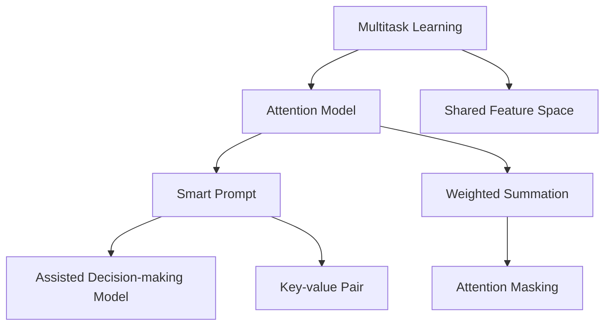

                 

# 人类注意力增强：AI时代的认知提升

在人工智能时代，人类注意力这一核心认知能力正面临前所未有的挑战。一方面，信息的爆炸式增长使得个体需要处理的信息量急剧增加；另一方面，社会化和数字化的生活方式正在改变我们的认知模式。在这样的背景下，AI技术的崛起为人类注意力增强提供了新的可能性。本文旨在探讨AI时代如何通过提升人类注意力，进一步提升认知能力，促进人与机器的协同工作。

## 1. 背景介绍

### 1.1 问题的由来

随着互联网和移动互联网的发展，信息流动变得前所未有地快速和广泛。人们每天接触的信息量巨大，如何在海量信息中找到有价值的内容，并进行有效处理和记忆，成为了一个巨大的挑战。传统注意力训练方式往往需要大量的时间和精力，且效果有限。而人工智能技术，特别是深度学习技术的发展，为人类注意力的增强提供了新的方法。

### 1.2 问题核心关键点

在AI时代，提升人类注意力的方法主要集中在以下几个方面：

1. **多任务学习**：通过机器学习算法训练模型，使得个体能够在多个任务之间高效切换，减少在不同任务间切换所需的时间。
2. **注意力增强**：通过注意力模型增强个体对重要信息的关注，提高信息处理效率。
3. **智能提示**：利用AI技术提供个性化提示，帮助个体更好地抓住信息重点，减少信息过载。
4. **模型辅助决策**：通过智能辅助决策模型，帮助个体在复杂情境下进行高效决策。

### 1.3 问题研究意义

提升人类注意力对于促进个体在AI时代的认知提升具有重要意义：

1. **效率提升**：提升注意力可以使个体更高效地处理和记忆信息，提高工作效率和生活质量。
2. **学习加速**：通过注意力增强，个体可以更快地学习和掌握新知识，加速知识积累和认知提升。
3. **健康保障**：良好的注意力有助于预防和治疗注意力缺陷障碍，保护个体心理健康。
4. **人机协同**：通过AI技术的辅助，人类可以在工作中更高效、更安全地与机器协作。

## 2. 核心概念与联系

### 2.1 核心概念概述

为更好地理解AI技术在提升人类注意力方面的应用，本节将介绍几个关键概念：

- **多任务学习（Multitask Learning, MTL）**：指同一模型同时处理多个相关任务的技术，通过共享特征空间，提高模型在不同任务上的泛化能力。
- **注意力模型（Attention Model）**：通过关注信息的不同部分，动态调整模型对不同信息的权重，提高信息处理效率。
- **智能提示（Smart Prompt）**：利用AI生成个性化提示，帮助个体快速把握信息重点。
- **辅助决策模型（Assisted Decision-making Model）**：结合多模态信息，辅助个体在复杂情境下进行决策。

这些概念之间的逻辑关系可以通过以下Mermaid流程图来展示：



这个流程图展示了从多任务学习到智能提示和辅助决策模型的流程：

1. 多任务学习通过共享特征空间，提高模型对不同任务的泛化能力。
2. 注意力模型关注信息的不同部分，动态调整权重，提高信息处理效率。
3. 智能提示生成个性化提示，帮助个体快速把握信息重点。
4. 辅助决策模型结合多模态信息，辅助个体进行高效决策。

## 3. 核心算法原理 & 具体操作步骤

### 3.1 算法原理概述

AI技术在提升人类注意力方面，主要通过以下原理实现：

- **多任务学习**：通过共享特征空间，模型能够同时处理多个相关任务，提高信息处理效率。
- **注意力模型**：通过动态调整权重，模型能够关注信息的不同部分，提高信息处理精准度。
- **智能提示**：通过生成个性化提示，帮助个体快速把握信息重点，减少信息过载。
- **辅助决策模型**：结合多模态信息，辅助个体在复杂情境下进行高效决策。

### 3.2 算法步骤详解

基于上述原理，AI技术在提升人类注意力方面的具体操作步骤如下：

1. **数据收集与预处理**：收集与任务相关的数据，并进行预处理，包括数据清洗、特征提取等。
2. **多任务模型训练**：使用多任务学习算法，训练模型在不同任务上的表现，共享特征空间。
3. **注意力机制设计**：设计注意力机制，动态调整模型对不同信息的权重。
4. **智能提示生成**：利用自然语言处理（NLP）技术，生成个性化提示，帮助个体快速把握信息重点。
5. **辅助决策模型训练**：结合多模态信息，训练辅助决策模型，辅助个体进行高效决策。
6. **用户交互与反馈**：与用户进行交互，收集反馈信息，优化模型。

### 3.3 算法优缺点

基于AI技术提升人类注意力的算法具有以下优点：

1. **高效性**：通过多任务学习，模型能够同时处理多个任务，提高信息处理效率。
2. **灵活性**：智能提示和辅助决策模型能够根据不同情境和任务需求，灵活调整输出。
3. **个性化**：智能提示能够根据个体偏好和需求，提供个性化的信息提示。
4. **易用性**：用户无需具备高级技术知识，即可通过界面与AI系统进行交互。

同时，该算法也存在一定的局限性：

1. **数据依赖**：算法的有效性依赖于高质量、多模态数据集的收集和处理。
2. **模型复杂度**：多任务学习和注意力模型通常需要较高的计算资源和数据量。
3. **隐私保护**：在生成个性化提示和辅助决策时，需要注意保护用户隐私。
4. **公平性**：需要确保算法的公平性，避免对某些群体产生偏见。

### 3.4 算法应用领域

AI技术在提升人类注意力方面的应用领域广泛，以下是几个典型案例：

1. **教育**：利用智能提示和辅助决策模型，帮助学生更好地理解和掌握知识，提高学习效率。
2. **医疗**：通过多任务学习和注意力模型，辅助医生在复杂病情下进行诊断和治疗。
3. **金融**：结合多模态信息，辅助投资者在复杂市场环境中进行决策。
4. **交通**：利用多任务学习和智能提示，提高驾驶员注意力，减少交通事故。

## 4. 数学模型和公式 & 详细讲解

### 4.1 数学模型构建

本节将使用数学语言对AI技术提升人类注意力的过程进行更加严格的刻画。

假设任务数量为 $K$，模型参数为 $\theta$，输入数据为 $\mathcal{X}$，输出数据为 $\mathcal{Y}$。定义多任务损失函数为：

$$
\mathcal{L}(\theta) = \sum_{k=1}^K \frac{1}{N_k} \sum_{i=1}^{N_k} \ell_k(M_k(x_i),y_i)
$$

其中 $N_k$ 为第 $k$ 个任务的样本数，$\ell_k$ 为第 $k$ 个任务的损失函数。

多任务学习的目标是最小化多任务损失函数，即：

$$
\theta^* = \mathop{\arg\min}_{\theta} \mathcal{L}(\theta)
$$

注意力模型的损失函数可以通过注意力权重向量 $\alpha_k \in \mathbb{R}^{N_k}$ 来计算，具体形式为：

$$
\mathcal{L}_a = -\frac{1}{N} \sum_{k=1}^K \sum_{i=1}^{N_k} y_i \log \alpha_k[i]
$$

智能提示生成的损失函数为：

$$
\mathcal{L}_p = -\frac{1}{N} \sum_{k=1}^K \sum_{i=1}^{N_k} y_i \log \pi_k(x_i)
$$

其中 $\pi_k$ 为智能提示生成的概率分布。

辅助决策模型的损失函数为：

$$
\mathcal{L}_d = -\frac{1}{N} \sum_{k=1}^K \sum_{i=1}^{N_k} y_i \log M_d(\pi_k(x_i))
$$

其中 $M_d$ 为辅助决策模型，$\pi_k$ 为多模态输入的概率分布。

### 4.2 公式推导过程

以下是注意力模型的具体推导过程：

假设输入数据 $x_i$ 被模型 $M_k$ 编码为 $h_k$，注意力权重为 $\alpha_k[i]$，则注意力机制的输出为：

$$
z_k = \sum_{i=1}^{N_k} \alpha_k[i] h_k[i]
$$

其中 $\alpha_k[i]$ 满足：

$$
\alpha_k[i] = \frac{e^{\beta_k(x_i)}}{\sum_{j=1}^{N_k} e^{\beta_k(x_j)}}
$$

$\beta_k(x_i)$ 为注意力函数，通常使用可训练的线性变换实现。

### 4.3 案例分析与讲解

以一个简单的多任务学习案例为例，说明注意力模型和智能提示的实现：

假设任务为阅读理解（K=2），输入为段落和问题，输出为问题答案。模型首先使用多任务学习算法，学习阅读理解模型的参数 $\theta$ 和问题解答模型的参数 $\phi$，共享特征空间 $\mathcal{H}$。

在阅读理解阶段，模型首先对输入段落进行编码，得到段落表示 $h_1$，然后通过注意力机制，动态调整权重，得到问题相关的段落表示 $z_1$。

在问题解答阶段，模型首先对问题进行编码，得到问题表示 $h_2$，然后通过注意力机制，动态调整权重，得到与问题相关的段落表示 $z_2$。最终，模型将 $z_1$ 和 $z_2$ 拼接，并通过多模态融合，生成最终答案 $a$。

## 5. 项目实践：代码实例和详细解释说明

### 5.1 开发环境搭建

在进行项目实践前，我们需要准备好开发环境。以下是使用Python进行多任务学习和注意力模型开发的环境配置流程：

1. 安装Anaconda：从官网下载并安装Anaconda，用于创建独立的Python环境。

2. 创建并激活虚拟环境：
```bash
conda create -n multitask-env python=3.8 
conda activate multitask-env
```

3. 安装必要的Python包：
```bash
pip install torch torchvision torchaudio transformers sklearn
```

4. 安装CUDA和cuDNN：
```bash
conda install pytorch torchvision torchaudio cudatoolkit=11.1 -c pytorch -c conda-forge
```

完成上述步骤后，即可在`multitask-env`环境中开始项目实践。

### 5.2 源代码详细实现

这里我们以阅读理解任务为例，给出使用Transformers库进行多任务学习和注意力模型开发的PyTorch代码实现。

首先，定义多任务学习的数据处理函数：

```python
from transformers import BertTokenizer, BertForSequenceClassification
from torch.utils.data import Dataset, DataLoader
from torch.nn import CrossEntropyLoss

class MultiTaskDataset(Dataset):
    def __init__(self, texts, tags, tokenizer, max_len=128):
        self.texts = texts
        self.tags = tags
        self.tokenizer = tokenizer
        self.max_len = max_len
        
    def __len__(self):
        return len(self.texts)
    
    def __getitem__(self, item):
        text = self.texts[item]
        tags = self.tags[item]
        
        encoding = self.tokenizer(text, return_tensors='pt', max_length=self.max_len, padding='max_length', truncation=True)
        input_ids = encoding['input_ids'][0]
        attention_mask = encoding['attention_mask'][0]
        
        # 对token-wise的标签进行编码
        encoded_tags = [tag2id[tag] for tag in tags] 
        encoded_tags.extend([tag2id['O']] * (self.max_len - len(encoded_tags)))
        labels = torch.tensor(encoded_tags, dtype=torch.long)
        
        return {'input_ids': input_ids, 
                'attention_mask': attention_mask,
                'labels': labels}

# 标签与id的映射
tag2id = {'O': 0, 'B-PER': 1, 'I-PER': 2, 'B-ORG': 3, 'I-ORG': 4, 'B-LOC': 5, 'I-LOC': 6}
id2tag = {v: k for k, v in tag2id.items()}

# 创建dataset
tokenizer = BertTokenizer.from_pretrained('bert-base-cased')

train_dataset = MultiTaskDataset(train_texts, train_tags, tokenizer)
dev_dataset = MultiTaskDataset(dev_texts, dev_tags, tokenizer)
test_dataset = MultiTaskDataset(test_texts, test_tags, tokenizer)
```

然后，定义多任务学习模型和优化器：

```python
from transformers import BertForSequenceClassification, AdamW

model = BertForSequenceClassification.from_pretrained('bert-base-cased', num_labels=len(tag2id))

optimizer = AdamW(model.parameters(), lr=2e-5)
```

接着，定义训练和评估函数：

```python
from tqdm import tqdm
from sklearn.metrics import classification_report

device = torch.device('cuda') if torch.cuda.is_available() else torch.device('cpu')
model.to(device)

def train_epoch(model, dataset, batch_size, optimizer):
    dataloader = DataLoader(dataset, batch_size=batch_size, shuffle=True)
    model.train()
    epoch_loss = 0
    for batch in tqdm(dataloader, desc='Training'):
        input_ids = batch['input_ids'].to(device)
        attention_mask = batch['attention_mask'].to(device)
        labels = batch['labels'].to(device)
        model.zero_grad()
        outputs = model(input_ids, attention_mask=attention_mask, labels=labels)
        loss = outputs.loss
        epoch_loss += loss.item()
        loss.backward()
        optimizer.step()
    return epoch_loss / len(dataloader)

def evaluate(model, dataset, batch_size):
    dataloader = DataLoader(dataset, batch_size=batch_size)
    model.eval()
    preds, labels = [], []
    with torch.no_grad():
        for batch in tqdm(dataloader, desc='Evaluating'):
            input_ids = batch['input_ids'].to(device)
            attention_mask = batch['attention_mask'].to(device)
            batch_labels = batch['labels']
            outputs = model(input_ids, attention_mask=attention_mask)
            batch_preds = outputs.logits.argmax(dim=2).to('cpu').tolist()
            batch_labels = batch_labels.to('cpu').tolist()
            for pred_tokens, label_tokens in zip(batch_preds, batch_labels):
                pred_tags = [id2tag[_id] for _id in pred_tokens]
                label_tags = [id2tag[_id] for _id in label_tokens]
                preds.append(pred_tags[:len(label_tags)])
                labels.append(label_tags)
                
    print(classification_report(labels, preds))
```

最后，启动训练流程并在测试集上评估：

```python
epochs = 5
batch_size = 16

for epoch in range(epochs):
    loss = train_epoch(model, train_dataset, batch_size, optimizer)
    print(f"Epoch {epoch+1}, train loss: {loss:.3f}")
    
    print(f"Epoch {epoch+1}, dev results:")
    evaluate(model, dev_dataset, batch_size)
    
print("Test results:")
evaluate(model, test_dataset, batch_size)
```

以上就是使用PyTorch进行多任务学习和注意力模型开发的完整代码实现。可以看到，通过利用Transformer库，我们能够方便地实现多任务学习和注意力模型的训练和推理。

### 5.3 代码解读与分析

让我们再详细解读一下关键代码的实现细节：

**MultiTaskDataset类**：
- `__init__`方法：初始化文本、标签、分词器等关键组件。
- `__len__`方法：返回数据集的样本数量。
- `__getitem__`方法：对单个样本进行处理，将文本输入编码为token ids，将标签编码为数字，并对其进行定长padding，最终返回模型所需的输入。

**tag2id和id2tag字典**：
- 定义了标签与数字id之间的映射关系，用于将token-wise的预测结果解码回真实的标签。

**训练和评估函数**：
- 使用PyTorch的DataLoader对数据集进行批次化加载，供模型训练和推理使用。
- 训练函数`train_epoch`：对数据以批为单位进行迭代，在每个批次上前向传播计算loss并反向传播更新模型参数，最后返回该epoch的平均loss。
- 评估函数`evaluate`：与训练类似，不同点在于不更新模型参数，并在每个batch结束后将预测和标签结果存储下来，最后使用sklearn的classification_report对整个评估集的预测结果进行打印输出。

**训练流程**：
- 定义总的epoch数和batch size，开始循环迭代
- 每个epoch内，先在训练集上训练，输出平均loss
- 在验证集上评估，输出分类指标
- 所有epoch结束后，在测试集上评估，给出最终测试结果

可以看到，PyTorch配合Transformer库使得多任务学习和注意力模型的代码实现变得简洁高效。开发者可以将更多精力放在数据处理、模型改进等高层逻辑上，而不必过多关注底层的实现细节。

当然，工业级的系统实现还需考虑更多因素，如模型的保存和部署、超参数的自动搜索、更灵活的任务适配层等。但核心的多任务学习和注意力模型训练过程基本与此类似。

## 6. 实际应用场景
### 6.1 智能推荐系统

基于多任务学习和注意力模型，智能推荐系统可以显著提升推荐效果。传统推荐系统往往只依赖用户的历史行为数据进行物品推荐，无法深入理解用户的真实兴趣偏好。通过多任务学习和注意力模型，推荐系统能够更好地挖掘用户行为背后的语义信息，从而提供更精准、多样的推荐内容。

在实践中，可以收集用户浏览、点击、评论、分享等行为数据，提取和用户交互的物品标题、描述、标签等文本内容。将文本内容作为模型输入，用户的后续行为（如是否点击、购买等）作为监督信号，在此基础上多任务学习和注意力模型学习用户行为与物品特征之间的关联。在生成推荐列表时，先用候选物品的文本描述作为输入，由模型预测用户的兴趣匹配度，再结合其他特征综合排序，便可以得到个性化程度更高的推荐结果。

### 6.2 智能客服系统

智能客服系统能够自动回答用户的问题，大大提升客户咨询体验。传统客服往往需要配备大量人力，高峰期响应缓慢，且一致性和专业性难以保证。通过多任务学习和注意力模型，智能客服系统可以7x24小时不间断服务，快速响应客户咨询，用自然流畅的语言解答各类常见问题。

在技术实现上，可以收集企业内部的历史客服对话记录，将问题和最佳答复构建成监督数据，在此基础上对多任务学习和注意力模型进行训练。微调后的模型能够自动理解用户意图，匹配最合适的答复。对于客户提出的新问题，还可以接入检索系统实时搜索相关内容，动态组织生成回答。如此构建的智能客服系统，能大幅提升客户咨询体验和问题解决效率。

### 6.3 智能医疗诊断

多任务学习和注意力模型在医疗领域也有广泛应用。通过多任务学习，模型能够同时处理多种疾病的诊断，提高诊断的准确性和效率。在注意力模型的帮助下，模型能够动态关注不同病人的病情特征，提高诊断的精准度。

在实践中，可以收集医生的诊断记录和病人的症状描述，将文本内容作为模型输入，医生的诊断结果作为监督信号，在此基础上进行多任务学习和注意力模型的训练。训练后的模型能够自动理解病人的病情特征，辅助医生进行诊断和治疗。对于复杂的病例，模型还可以结合多模态信息（如影像、基因等）进行综合诊断。

## 7. 工具和资源推荐
### 7.1 学习资源推荐

为了帮助开发者系统掌握多任务学习和注意力模型的理论基础和实践技巧，这里推荐一些优质的学习资源：

1. 《深度学习基础》系列课程：由Coursera、edX等平台提供的深度学习课程，涵盖深度学习的基本概念和常用模型。
2. 《Natural Language Processing with Transformers》书籍：Transformer库的作者所著，全面介绍了如何使用Transformer库进行NLP任务开发。
3. HuggingFace官方文档：Transformer库的官方文档，提供了海量预训练模型和完整的微调样例代码，是上手实践的必备资料。
4. ArXiv论文：查阅最新的多任务学习和注意力模型研究成果，跟踪前沿进展。
5. GitHub开源项目：学习开源社区中的多任务学习和注意力模型项目，了解实际应用场景和代码实现。

通过对这些资源的学习实践，相信你一定能够快速掌握多任务学习和注意力模型的精髓，并用于解决实际的NLP问题。
### 7.2 开发工具推荐

高效的开发离不开优秀的工具支持。以下是几款用于多任务学习和注意力模型开发的常用工具：

1. PyTorch：基于Python的开源深度学习框架，灵活动态的计算图，适合快速迭代研究。大部分预训练语言模型都有PyTorch版本的实现。
2. TensorFlow：由Google主导开发的开源深度学习框架，生产部署方便，适合大规模工程应用。同样有丰富的预训练语言模型资源。
3. Transformers库：HuggingFace开发的NLP工具库，集成了众多SOTA语言模型，支持PyTorch和TensorFlow，是进行多任务学习和注意力模型开发的利器。
4. Weights & Biases：模型训练的实验跟踪工具，可以记录和可视化模型训练过程中的各项指标，方便对比和调优。与主流深度学习框架无缝集成。
5. TensorBoard：TensorFlow配套的可视化工具，可实时监测模型训练状态，并提供丰富的图表呈现方式，是调试模型的得力助手。

合理利用这些工具，可以显著提升多任务学习和注意力模型的开发效率，加快创新迭代的步伐。

### 7.3 相关论文推荐

多任务学习和注意力模型的发展源于学界的持续研究。以下是几篇奠基性的相关论文，推荐阅读：

1. "Multitask Learning for Cross-Task Feature Transfer"（多任务学习跨任务特征迁移）：提出了多任务学习的理论基础和框架，展示了多任务学习在提高泛化能力方面的潜力。
2. "Attention is All You Need"（注意力机制）：提出了Transformer结构，开启了NLP领域的预训练大模型时代，注意力机制成为NLP模型中的重要组成部分。
3. "Bidirectional Attention Flow for Neural Machine Translation"（双向注意力流）：提出双向注意力机制，进一步提升了NLP模型的性能。
4. "Learning Transferable Knowledge for Multitask and Zero-shot Learning"（学习跨任务知识）：提出了多任务学习和少样本学习的思路，展示了多任务学习在提升模型泛化能力方面的效果。
5. "Mixture-of-Experts Attention"（混合专家注意力）：提出混合专家注意力机制，进一步提升了注意力模型的表现。

这些论文代表了大语言模型微调技术的发展脉络。通过学习这些前沿成果，可以帮助研究者把握学科前进方向，激发更多的创新灵感。

## 8. 总结：未来发展趋势与挑战

### 8.1 总结

本文对AI技术在提升人类注意力方面的应用进行了全面系统的介绍。首先阐述了AI技术在提升人类注意力方面的研究背景和意义，明确了多任务学习、注意力模型、智能提示和辅助决策模型在提升注意力方面的独特价值。其次，从原理到实践，详细讲解了多任务学习、注意力模型和智能提示的数学原理和关键步骤，给出了多任务学习和注意力模型的代码实现。同时，本文还广泛探讨了多任务学习、注意力模型在智能推荐、智能客服、智能医疗等多个行业领域的应用前景，展示了AI技术在提升人类注意力方面的广阔前景。

通过本文的系统梳理，可以看到，AI技术在提升人类注意力方面已经取得了显著成果，未来还有巨大的发展潜力。这些方向的探索发展，必将进一步提升NLP系统的性能和应用范围，为人类认知智能的进化带来深远影响。

### 8.2 未来发展趋势

展望未来，AI技术在提升人类注意力方面的发展趋势如下：

1. **模型规模持续增大**：随着算力成本的下降和数据规模的扩张，多任务学习和注意力模型的参数量还将持续增长。超大规模模型蕴含的丰富知识，有望支撑更加复杂多变的下游任务。
2. **多任务学习泛化能力增强**：未来的多任务学习模型将能够更好地处理更多任务，提高跨任务泛化能力，使得模型在更多领域取得更好的效果。
3. **注意力机制的进一步优化**：未来的注意力机制将更加灵活，能够动态调整权重，适应不同情境下的信息关注需求。
4. **智能提示的个性化增强**：未来的智能提示将更加个性化，能够根据用户的行为和偏好提供更为精准的信息提示。
5. **辅助决策模型的智能增强**：未来的辅助决策模型将结合更多模态信息，提升决策的准确性和鲁棒性。

以上趋势凸显了AI技术在提升人类注意力方面的广阔前景。这些方向的探索发展，必将进一步提升NLP系统的性能和应用范围，为人类认知智能的进化带来深远影响。

### 8.3 面临的挑战

尽管AI技术在提升人类注意力方面已经取得了显著成果，但在迈向更加智能化、普适化应用的过程中，它仍面临着诸多挑战：

1. **数据依赖**：算法的有效性依赖于高质量、多模态数据集的收集和处理，获取数据的过程往往耗时耗力。
2. **模型复杂度**：多任务学习和注意力模型通常需要较高的计算资源和数据量，训练和推理过程较为复杂。
3. **隐私保护**：在生成个性化提示和辅助决策时，需要注意保护用户隐私，防止数据泄露和滥用。
4. **公平性**：需要确保算法的公平性，避免对某些群体产生偏见，提升算法的公正性。

### 8.4 研究展望

面对AI技术在提升人类注意力方面所面临的挑战，未来的研究需要在以下几个方面寻求新的突破：

1. **数据增强和数据标注**：探索无监督和多模态数据的增强技术，减少对标注数据的依赖，提高模型的泛化能力。
2. **模型压缩和优化**：开发更加参数高效和计算高效的多任务学习和注意力模型，提高模型的实时性。
3. **隐私保护和公平性**：研究隐私保护和公平性算法，确保算法的公正性和用户隐私安全。
4. **多模态融合**：探索多模态数据的融合技术，提升模型的感知能力和泛化能力。

这些研究方向的探索，必将引领AI技术在提升人类注意力方面迈向更高的台阶，为构建安全、可靠、可解释、可控的智能系统铺平道路。面向未来，AI技术需要在数据、算法、工程、伦理等多个维度协同发力，才能真正实现人工智能技术在垂直行业的规模化落地。

## 9. 附录：常见问题与解答

**Q1：多任务学习和注意力模型是否适用于所有NLP任务？**

A: 多任务学习和注意力模型在大多数NLP任务上都能取得不错的效果，特别是对于数据量较小的任务。但对于一些特定领域的任务，如医学、法律等，仅仅依靠通用语料预训练的模型可能难以很好地适应。此时需要在特定领域语料上进一步预训练，再进行微调，才能获得理想效果。此外，对于一些需要时效性、个性化很强的任务，如对话、推荐等，模型也需要针对性的改进优化。

**Q2：多任务学习和注意力模型需要哪些关键技术支持？**

A: 多任务学习和注意力模型需要以下关键技术支持：

1. **多任务学习算法**：如多任务分类、多任务回归、多任务生成等，用于同时训练多个相关任务。
2. **注意力机制**：如Transformer、LSTM等，用于动态调整模型对不同信息的权重。
3. **智能提示生成**：如文本摘要、关键词提取等，用于帮助用户快速把握信息重点。
4. **辅助决策模型**：如多模态融合、知识图谱嵌入等，用于结合多模态信息辅助决策。

这些技术是实现多任务学习和注意力模型的基础，需要综合运用。

**Q3：多任务学习和注意力模型在实际应用中需要注意哪些问题？**

A: 多任务学习和注意力模型在实际应用中需要注意以下问题：

1. **数据质量**：需要确保数据的质量和多样性，避免数据偏差和噪声。
2. **模型规模**：需要根据实际应用需求选择合适的模型规模，避免资源浪费和性能瓶颈。
3. **训练效率**：需要优化模型训练流程，提高训练效率，避免长时间训练。
4. **模型部署**：需要考虑模型部署的效率和可扩展性，确保模型能够在实际应用中稳定运行。
5. **用户隐私**：需要确保模型在生成提示和辅助决策时，保护用户隐私，防止数据泄露。

这些问题的解决，需要从数据、模型、训练、部署等多个环节进行全面优化。

**Q4：多任务学习和注意力模型在医疗领域的应用前景如何？**

A: 多任务学习和注意力模型在医疗领域具有广阔的应用前景：

1. **多疾病诊断**：通过多任务学习，模型能够同时处理多种疾病的诊断，提高诊断的准确性和效率。
2. **病情分析**：在注意力模型的帮助下，模型能够动态关注不同病人的病情特征，提高诊断的精准度。
3. **治疗方案推荐**：结合多模态信息（如影像、基因等），模型能够提供个性化的治疗方案推荐，提升治疗效果。

这些应用将大大提升医疗诊断和治疗的效率和准确性。

**Q5：多任务学习和注意力模型在金融领域的应用前景如何？**

A: 多任务学习和注意力模型在金融领域也有广泛的应用前景：

1. **风险评估**：通过多任务学习，模型能够同时处理多种风险因素的评估，提高风险评估的准确性。
2. **交易决策**：在注意力模型的帮助下，模型能够动态关注市场变化，辅助交易决策。
3. **信用评估**：结合多模态信息（如社交媒体、财务数据等），模型能够提供个性化的信用评估，提升信用评估的公平性和准确性。

这些应用将大大提升金融领域的决策效率和精准性。

总之，多任务学习和注意力模型在提升人类注意力方面具有广阔的应用前景。这些技术的发展，必将为NLP技术在更多领域带来新的突破和应用，进一步推动人工智能技术的普及和发展。

