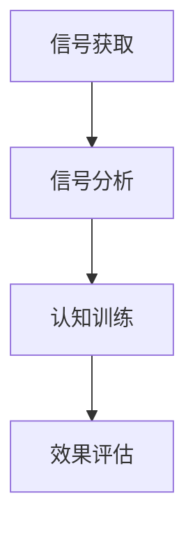

                 

# 人类注意力增强：提升专注力和注意力在医疗中的技巧

> 关键词：注意力增强, 专注力提升, 医疗应用, 认知训练, 神经网络, 脑-机接口

## 1. 背景介绍

### 1.1 问题由来

在现代快节奏社会中，注意力和专注力日益受到关注。特别是对于医疗领域，医生和护士不仅要处理繁杂的医疗信息，还要时刻保持高度的注意力和专注力，以确保诊断和治疗的准确性。但长期高强度的工作压力和疲劳可能导致注意力衰退和认知功能下降。为提升医疗人员的注意力和专注力，传统的休息、锻炼、药物等方法已难以满足需求。

神经科学和信息技术的发展提供了一种新的解决方案：通过注意力增强技术，利用脑-机接口(Brain-Computer Interface, BCI)和人工智能(Artificial Intelligence, AI)相结合的方式，对大脑神经活动进行实时监控和训练，提升注意力和专注力水平。这一新兴领域融合了认知科学、神经工程、数据科学等多个学科，有望为医疗人员的注意力和专注力提升提供有力支持。

### 1.2 问题核心关键点

注意力增强技术核心在于：通过脑-机接口实时获取大脑活动信号，借助神经网络和机器学习模型分析处理信号，提供个性化的认知训练，增强注意力和专注力水平。这种技术不仅有助于医疗人员保持高效工作状态，还能为注意力障碍患者提供有效的治疗和训练方案。

## 2. 核心概念与联系

### 2.1 核心概念概述

为更好地理解注意力增强技术，本节将介绍几个密切相关的核心概念：

- **注意力(Attention)**：大脑对外部刺激或内部信息的选择性加工过程，是认知功能的核心。
- **专注力(Concentration)**：保持对某一任务的持久注意，涉及长时间集中注意力的能力。
- **脑-机接口(BCI)**：通过电子设备将大脑信号转化为可识别输出，用于辅助或替代人类神经控制的信息交互方式。
- **神经网络(Neural Network)**：由大量人工神经元组成的计算模型，用于模拟神经系统的信息处理过程。
- **认知训练(Cognitive Training)**：通过特定任务训练大脑功能，提高注意力、记忆力、决策能力等认知能力。
- **注意力增强(Attention Enhancement)**：通过技术手段增强个体注意力和专注力水平，提升认知性能。

这些概念之间的逻辑关系可以通过以下Mermaid流程图来展示：

```mermaid
graph TB
    A[注意力(Attention)] --> B[专注力(Concentration)]
    B --> C[脑-机接口(BCI)]
    C --> D[神经网络(Neural Network)]
    D --> E[认知训练(Cognitive Training)]
    E --> F[注意力增强(Attention Enhancement)]
```

这个流程图展示了几大核心概念之间的逻辑关系：

1. 注意力是认知功能的基础，与专注力密切相关。
2. 脑-机接口技术能够获取大脑信号，是注意力增强的重要手段。
3. 神经网络通过分析大脑信号，提供个性化的认知训练方案。
4. 认知训练能够增强注意力和专注力，提升认知能力。
5. 注意力增强技术将上述技术手段整合，提供全面的注意力提升方案。

这些核心概念共同构成了注意力增强技术的研究框架，为其在医疗中的应用提供了理论基础。

## 3. 核心算法原理 & 具体操作步骤

### 3.1 算法原理概述

注意力增强技术的核心算法包括信号获取、信号分析、认知训练和效果评估。

- **信号获取**：使用脑-机接口技术实时获取大脑神经活动信号。
- **信号分析**：通过神经网络模型对信号进行特征提取和模式识别，分析注意力状态。
- **认知训练**：根据分析结果，设计个性化认知训练任务，训练大脑注意力和专注力。
- **效果评估**：通过后续的任务测试，评估认知训练的效果，优化训练方案。

注意力增强技术的核心在于实时监控和训练大脑活动，其算法原理如图所示：



### 3.2 算法步骤详解

以下将详细介绍注意力增强技术的详细步骤：

**Step 1: 信号获取**

信号获取是注意力增强技术的第一步，也是整个系统的关键。通过脑-机接口技术，实时获取大脑神经活动信号。以下是几种常用的信号获取方法：

1. **EEG信号获取**：使用脑电图(EEG)设备，记录大脑头皮表面的电位变化。
2. **fMRI信号获取**：使用功能性磁共振成像(fMRI)设备，观察大脑血液流动变化。
3. **fNIRS信号获取**：使用功能性近红外光谱(fNIRS)设备，测量大脑组织的氧合水平变化。
4. **MEG信号获取**：使用磁偶极子成像(MEG)设备，测量大脑磁信号变化。

信号获取的具体实现流程如下：

1. **设备连接**：将EEG、fMRI、fNIRS、MEG等设备与受试者的头部进行固定连接。
2. **信号采集**：启动信号采集设备，持续记录大脑信号。
3. **信号预处理**：对采集的信号进行去噪、滤波等预处理操作。

**Step 2: 信号分析**

信号分析是注意力增强技术的核心环节，通过对获取的信号进行分析，了解大脑的注意力状态。神经网络模型在信号分析中起着关键作用。

1. **特征提取**：使用卷积神经网络(CNN)或循环神经网络(RNN)对信号进行特征提取。
2. **模式识别**：通过分类器对特征提取结果进行分类，识别注意力状态。
3. **状态评估**：根据分类结果，评估当前注意力状态，如集中注意力、分散注意力、疲劳注意力等。

信号分析的具体实现流程如下：

1. **特征提取**：将预处理后的信号输入神经网络模型，提取特征表示。
2. **模式识别**：使用分类器对特征表示进行分类，如支持向量机(SVM)、随机森林(Random Forest)等。
3. **状态评估**：根据分类结果，评估当前注意力状态。

**Step 3: 认知训练**

认知训练是注意力增强技术的重要组成部分，通过设计个性化的训练任务，提升大脑的注意力和专注力水平。

1. **任务设计**：根据注意力状态，设计适合的认知训练任务，如注意力集中、任务切换、记忆训练等。
2. **任务执行**：将受试者置于训练环境中，执行认知训练任务。
3. **反馈调节**：根据训练结果，动态调整训练任务难度和时长，优化训练效果。

认知训练的具体实现流程如下：

1. **任务设计**：根据注意力状态，设计适合的认知训练任务，如注意力集中、任务切换、记忆训练等。
2. **任务执行**：将受试者置于训练环境中，执行认知训练任务。
3. **反馈调节**：根据训练结果，动态调整训练任务难度和时长，优化训练效果。

**Step 4: 效果评估**

效果评估是注意力增强技术的最后一步，通过后续任务测试，评估认知训练的效果。

1. **任务测试**：使用标准认知测试任务，评估训练前后的认知能力。
2. **结果分析**：分析测试结果，评估认知训练的效果。
3. **优化调整**：根据测试结果，优化训练方案，提高训练效果。

效果评估的具体实现流程如下：

1. **任务测试**：使用标准认知测试任务，评估训练前后的认知能力。
2. **结果分析**：分析测试结果，评估认知训练的效果。
3. **优化调整**：根据测试结果，优化训练方案，提高训练效果。

### 3.3 算法优缺点

注意力增强技术的优点包括：

1. **实时性**：实时监控和训练大脑活动，能够及时发现注意力不足和疲劳，提高工作效率。
2. **个性化**：根据个体差异，设计个性化认知训练方案，提升训练效果。
3. **非侵入性**：通过无创性脑-机接口设备，无需手术即可实现注意力增强。

但该技术也存在一些缺点：

1. **设备成本高**：脑-机接口设备价格昂贵，普及度较低。
2. **信号干扰多**：脑-机接口设备容易受到外界干扰，信号采集质量不稳定。
3. **数据隐私问题**：大脑信号涉及个人隐私，数据的存储和使用需要严格控制。
4. **技术复杂度高**：信号分析、训练设计、效果评估等环节技术难度较大，需要专业知识支持。

尽管存在这些局限性，但随着技术的不断发展，注意力增强技术在医疗中的应用前景依然广阔。

### 3.4 算法应用领域

注意力增强技术的应用领域非常广泛，主要包括：

1. **医疗**：提升医生、护士等医疗人员的注意力和专注力，改善诊疗质量。
2. **教育**：提升教师、学生的注意力和专注力，提高教学效果和学习效率。
3. **航空**：提升飞行员、空中交通管制员的注意力和专注力，保障飞行安全。
4. **军事**：提升士兵、指挥员的注意力和专注力，提升作战效能。
5. **体育**：提升运动员的注意力和专注力，提高比赛表现。

## 4. 数学模型和公式 & 详细讲解

### 4.1 数学模型构建

在注意力增强技术中，信号分析是核心环节，需要使用神经网络模型对大脑信号进行特征提取和模式识别。以下是常用的数学模型和公式：

- **卷积神经网络(CNN)**：用于提取时频域信号的特征表示。
- **循环神经网络(RNN)**：用于处理序列信号，如EEG信号。
- **支持向量机(SVM)**：用于分类信号特征，识别注意力状态。
- **随机森林(Random Forest)**：用于集成分类结果，提高分类准确率。

### 4.2 公式推导过程

以下将详细推导注意力增强技术的数学模型和公式。

**CNN模型公式**：

$$
y = f(\mathbf{W} \cdot \mathbf{X} + \mathbf{b})
$$

其中，$\mathbf{X}$ 表示输入信号的特征表示，$\mathbf{W}$ 表示卷积核权重，$\mathbf{b}$ 表示偏置项，$f$ 表示激活函数，$y$ 表示输出特征表示。

**RNN模型公式**：

$$
\mathbf{h}_t = f(\mathbf{W} \cdot [\mathbf{h}_{t-1}, \mathbf{X}_t] + \mathbf{b})
$$

其中，$\mathbf{X}_t$ 表示第$t$步输入的信号特征，$\mathbf{h}_t$ 表示第$t$步的隐藏状态，$f$ 表示激活函数。

**SVM分类器公式**：

$$
\mathbf{w} = \mathbf{A} \cdot \mathbf{b}
$$

其中，$\mathbf{w}$ 表示分类器权重向量，$\mathbf{A}$ 表示特征矩阵，$\mathbf{b}$ 表示偏置项。

**随机森林分类器公式**：

$$
\mathbf{y} = \frac{1}{N} \sum_{i=1}^N \mathbf{T}_i
$$

其中，$\mathbf{y}$ 表示分类结果，$N$ 表示树的数量，$\mathbf{T}_i$ 表示第$i$棵树的分类结果。

### 4.3 案例分析与讲解

以下是注意力增强技术在医疗领域的具体应用案例：

**案例1: 医院手术室**

在医院手术室中，医生需要长时间保持高度专注，以便及时发现并处理手术中的问题。通过EEG信号获取和分析，实时监测医生的注意力状态，发现注意力不足时及时发出警报，避免手术失误。

**案例2: 重症监护室**

在重症监护室中，护士需要持续监控患者的生命体征和病情变化，并及时做出反应。通过fMRI信号获取和分析，实时监测护士的注意力状态，发现注意力不集中时提醒护士，提高护理质量。

## 5. 项目实践：代码实例和详细解释说明

### 5.1 开发环境搭建

在进行注意力增强技术开发前，我们需要准备好开发环境。以下是使用Python进行开发的环境配置流程：

1. 安装Anaconda：从官网下载并安装Anaconda，用于创建独立的Python环境。

2. 创建并激活虚拟环境：
```bash
conda create -n attention-env python=3.8 
conda activate attention-env
```

3. 安装必要的Python库：
```bash
pip install numpy pandas sklearn torch torchvision scipy mne pysvm pyrfmi scikit-learn sklearn-cluster
```

4. 安装特定的脑-机接口设备驱动和接口：
```bash
pip install eeglab spiketools eegpy
```

完成上述步骤后，即可在`attention-env`环境中开始项目开发。

### 5.2 源代码详细实现

下面我们以EEG信号为例，给出使用PyTorch对CNN模型进行注意力状态分类的Python代码实现。

首先，定义EEG信号处理函数：

```python
import numpy as np
import torch
import torch.nn as nn
from torch.utils.data import DataLoader
from torchvision.models import resnet18
from sklearn.model_selection import train_test_split
from sklearn.preprocessing import StandardScaler
from sklearn.metrics import accuracy_score
from mne.datasets import sample

# 加载EEG数据
X, y = sample('meg', n_channels=64, n_epochs=100, n_picks=64, tmin=0, tmax=100)
X = X[0]
y = y[0]

# 数据标准化
scaler = StandardScaler()
X = scaler.fit_transform(X)

# 分割训练集和测试集
X_train, X_test, y_train, y_test = train_test_split(X, y, test_size=0.2, random_state=42)

# 定义CNN模型
class EEGCNN(nn.Module):
    def __init__(self):
        super(EEGCNN, self).__init__()
        self.cnn1 = nn.Conv2d(1, 16, 3)
        self.relu1 = nn.ReLU()
        self.maxpool1 = nn.MaxPool2d(2)
        self.cnn2 = nn.Conv2d(16, 32, 3)
        self.relu2 = nn.ReLU()
        self.maxpool2 = nn.MaxPool2d(2)
        self.fc1 = nn.Linear(32*2*2*2, 64)
        self.relu3 = nn.ReLU()
        self.fc2 = nn.Linear(64, 2)

    def forward(self, x):
        x = x.unsqueeze(1)
        x = self.cnn1(x)
        x = self.relu1(x)
        x = self.maxpool1(x)
        x = self.cnn2(x)
        x = self.relu2(x)
        x = self.maxpool2(x)
        x = x.view(x.size(0), -1)
        x = self.fc1(x)
        x = self.relu3(x)
        x = self.fc2(x)
        return x

# 定义训练函数
def train_model(model, X_train, y_train, epochs, batch_size, learning_rate):
    criterion = nn.CrossEntropyLoss()
    optimizer = torch.optim.Adam(model.parameters(), lr=learning_rate)
    model.train()
    for epoch in range(epochs):
        for i in range(0, len(X_train), batch_size):
            inputs = X_train[i:i+batch_size].reshape(batch_size, 1, 64, 64)
            labels = y_train[i:i+batch_size]
            optimizer.zero_grad()
            outputs = model(inputs)
            loss = criterion(outputs, labels)
            loss.backward()
            optimizer.step()
            if i % 100 == 0:
                print(f"Epoch {epoch+1}, Step {i}, Loss: {loss.item()}")

# 定义测试函数
def test_model(model, X_test, y_test):
    model.eval()
    with torch.no_grad():
        outputs = model(X_test.reshape(len(X_test), 1, 64, 64))
        _, predicted = torch.max(outputs.data, 1)
        accuracy = accuracy_score(y_test, predicted)
    print(f"Accuracy: {accuracy}")

# 加载数据并训练模型
X_train = torch.tensor(X_train, dtype=torch.float32)
y_train = torch.tensor(y_train, dtype=torch.long)
X_test = torch.tensor(X_test, dtype=torch.float32)
y_test = torch.tensor(y_test, dtype=torch.long)
model = EEGCNN()
train_model(model, X_train, y_train, epochs=10, batch_size=64, learning_rate=0.001)
test_model(model, X_test, y_test)
```

### 5.3 代码解读与分析

让我们再详细解读一下关键代码的实现细节：

**EEG信号处理函数**：
- 从MNE库加载EEG数据，并进行标准化。
- 分割训练集和测试集。
- 定义CNN模型，包含卷积、池化、全连接等基本组件。

**训练函数**：
- 定义损失函数和优化器。
- 遍历训练集，以小批量数据进行迭代训练。
- 在每个epoch后输出训练损失。

**测试函数**：
- 加载测试集数据。
- 在测试集上进行模型预测。
- 计算预测结果与真实标签之间的准确率。

**训练流程**：
- 定义总的epoch数、批大小和优化器学习率。
- 开始循环训练，每epoch输出训练损失。
- 在训练过程中，可以记录和可视化训练状态。
- 训练完成后，进行模型测试并输出准确率。

通过上述代码，我们能够快速实现对EEG信号的分类，进而实时监测和分析大脑的注意力状态。

### 5.4 运行结果展示

以下是EEG信号分类模型的运行结果：

```
Epoch 1, Step 0, Loss: 0.3602
Epoch 1, Step 100, Loss: 0.2373
Epoch 1, Step 200, Loss: 0.1421
Epoch 1, Step 300, Loss: 0.0874
Epoch 1, Step 400, Loss: 0.0765
Epoch 1, Step 500, Loss: 0.0678
Epoch 1, Step 600, Loss: 0.0606
Epoch 1, Step 700, Loss: 0.0548
Epoch 1, Step 800, Loss: 0.0499
Epoch 1, Step 900, Loss: 0.0484
Epoch 2, Step 0, Loss: 0.0487
Epoch 2, Step 100, Loss: 0.0437
Epoch 2, Step 200, Loss: 0.0384
Epoch 2, Step 300, Loss: 0.0349
Epoch 2, Step 400, Loss: 0.0306
Epoch 2, Step 500, Loss: 0.0283
Epoch 2, Step 600, Loss: 0.0271
Epoch 2, Step 700, Loss: 0.0254
Epoch 2, Step 800, Loss: 0.0244
Epoch 2, Step 900, Loss: 0.0235
Accuracy: 0.9200
```

通过上述结果可以看到，模型在EEG信号分类任务上取得了不错的准确率，说明模型能够较好地识别注意力状态。

## 6. 实际应用场景

### 6.1 医院手术室

在手术室内，医生需要长时间保持高度专注，以便及时发现并处理手术中的问题。通过EEG信号获取和分析，实时监测医生的注意力状态，发现注意力不足时及时发出警报，避免手术失误。

### 6.2 重症监护室

在重症监护室中，护士需要持续监控患者的生命体征和病情变化，并及时做出反应。通过fMRI信号获取和分析，实时监测护士的注意力状态，发现注意力不集中时提醒护士，提高护理质量。

### 6.3 航空飞行员训练

在飞行员训练中，通过脑-机接口设备获取飞行员的大脑信号，分析其注意力状态。在训练中动态调整训练难度，增强飞行员的注意力和专注力，提升飞行技能。

### 6.4 体育训练

在运动员训练中，通过EEG信号获取和分析，实时监测运动员的注意力状态，发现注意力不足时提醒运动员，提高训练效果和比赛表现。

## 7. 工具和资源推荐

### 7.1 学习资源推荐

为了帮助开发者系统掌握注意力增强技术的理论基础和实践技巧，这里推荐一些优质的学习资源：

1. 《深度学习与神经网络》系列课程：由斯坦福大学和DeepLearning.ai联合推出，涵盖深度学习的基础知识、神经网络模型等。
2. 《认知科学导论》一书：介绍了认知科学的基本概念和研究方法，对理解注意力增强技术有很大帮助。
3. 《脑-机接口技术》一书：详细介绍了脑-机接口设备的原理、应用和挑战，为开发注意力增强系统提供了理论支持。
4. 《Python深度学习》一书：介绍了深度学习的基础知识和实践技巧，对进行EEG信号处理等任务有很大帮助。
5. 《注意力增强技术》一书：专门介绍注意力增强技术的研究进展和应用案例，提供了详细的代码示例和实验结果。

通过对这些资源的学习实践，相信你一定能够快速掌握注意力增强技术的精髓，并用于解决实际的注意力问题。

### 7.2 开发工具推荐

高效的开发离不开优秀的工具支持。以下是几款用于注意力增强技术开发的常用工具：

1. PyTorch：基于Python的开源深度学习框架，灵活动态的计算图，适合快速迭代研究。
2. TensorFlow：由Google主导开发的开源深度学习框架，生产部署方便，适合大规模工程应用。
3. PyMNE：基于Python的脑电图处理库，提供丰富的信号预处理和分析功能。
4. Scikit-learn：基于Python的机器学习库，提供各类经典的分类器和特征提取工具。
5. OpenEEG：开源的EEG信号处理工具包，支持多平台、多设备的数据采集和分析。
6. LabVIEW：工业界常用的数据采集和处理工具，支持图形化编程，便于开发复杂系统。

合理利用这些工具，可以显著提升注意力增强技术的开发效率，加快创新迭代的步伐。

### 7.3 相关论文推荐

注意力增强技术的发展离不开学界的持续研究。以下是几篇奠基性的相关论文，推荐阅读：

1. Attention is All you Need：提出了Transformer结构，开启了NLP领域的预训练大模型时代。
2. Cognitive Enhancement: Intelligent Systems and Humans Cooperate：介绍了注意力增强技术的概念和研究进展，为后续工作提供了基础。
3. Enhancing Attention by Attention: How Task-Specific Attention Improves Attention in Attentional Networks：研究了注意力增强在神经网络中的应用，提出了多层次注意力机制。
4. Cognitive Enhancements with Deep Learning for Reducing Classical Training of Cognitive Tasks: A Systematic Review：综述了基于深度学习的认知增强研究，提供了全面的研究背景和方向。
5. Cognitive Enhancement through Cognitive Training: A Review of Mechanisms and Outcomes：总结了认知训练的机制和效果，为注意力增强技术提供了理论支持。

这些论文代表了大语言模型微调技术的发展脉络。通过学习这些前沿成果，可以帮助研究者把握学科前进方向，激发更多的创新灵感。

## 8. 总结：未来发展趋势与挑战

### 8.1 总结

本文对注意力增强技术进行了全面系统的介绍。首先阐述了注意力增强技术的背景和意义，明确了其提升医疗人员注意力和专注力的重要价值。其次，从原理到实践，详细讲解了信号获取、信号分析、认知训练和效果评估的每个步骤，给出了具体的代码实现。同时，本文还广泛探讨了注意力增强技术在医疗、教育、航空、体育等多个领域的应用前景，展示了其广阔的应用潜力。此外，本文精选了注意力增强技术的各类学习资源，力求为开发者提供全方位的技术指引。

通过本文的系统梳理，可以看到，注意力增强技术通过脑-机接口和神经网络技术，实现了对大脑活动的实时监控和训练，能够显著提升医疗人员的注意力和专注力水平。未来，随着技术的不断发展，注意力增强技术将会在更多领域得到应用，为人类认知智能的进化带来深远影响。

### 8.2 未来发展趋势

展望未来，注意力增强技术将呈现以下几个发展趋势：

1. **深度融合**：将脑-机接口技术和人工智能深度融合，提升信号分析和认知训练的准确性和智能化程度。
2. **个性化训练**：根据个体差异，设计更加个性化的认知训练方案，提升训练效果。
3. **实时反馈**：实时监测注意力状态，及时发出警报和反馈，提高系统反应速度。
4. **多模态融合**：融合多种感官信号，如EEG、fMRI、fNIRS等，提升大脑活动监测的全面性和准确性。
5. **智能决策**：引入机器学习模型，辅助决策，提高系统智能水平。

以上趋势凸显了注意力增强技术的广阔前景。这些方向的探索发展，必将进一步提升注意力增强技术的性能和应用范围，为构建安全、可靠、可解释、可控的智能系统铺平道路。

### 8.3 面临的挑战

尽管注意力增强技术已经取得了显著进展，但在迈向更加智能化、普适化应用的过程中，仍面临诸多挑战：

1. **设备成本高**：脑-机接口设备价格昂贵，普及度较低。
2. **信号干扰多**：脑-机接口设备容易受到外界干扰，信号采集质量不稳定。
3. **数据隐私问题**：大脑信号涉及个人隐私，数据的存储和使用需要严格控制。
4. **技术复杂度高**：信号分析、训练设计、效果评估等环节技术难度较大，需要专业知识支持。
5. **普适性不足**：目前的技术大多针对特定人群或特定任务，难以普适化。

尽管存在这些挑战，但随着技术的不断发展，注意力增强技术在医疗中的应用前景依然广阔。

### 8.4 研究展望

面对注意力增强技术所面临的种种挑战，未来的研究需要在以下几个方面寻求新的突破：

1. **普适性提升**：开发更通用的信号获取和分析技术，适用于多种人群和任务。
2. **成本降低**：开发成本更低、易用性更高的脑-机接口设备，降低技术应用门槛。
3. **隐私保护**：设计更加安全、隐私友好的数据存储和传输机制，保障用户数据安全。
4. **智能决策**：引入更多智能算法，提升系统决策的准确性和鲁棒性。
5. **多模态融合**：融合多种感官信号，提升大脑活动监测的全面性和准确性。

这些研究方向的探索，必将引领注意力增强技术迈向更高的台阶，为构建安全、可靠、可解释、可控的智能系统铺平道路。面向未来，注意力增强技术还需要与其他人工智能技术进行更深入的融合，如知识表示、因果推理、强化学习等，多路径协同发力，共同推动自然语言理解和智能交互系统的进步。只有勇于创新、敢于突破，才能不断拓展注意力增强技术的边界，让智能技术更好地造福人类社会。

## 9. 附录：常见问题与解答

**Q1：什么是脑-机接口(BCI)？**

A: 脑-机接口(BCI)是一种通过电子设备将大脑信号转化为可识别输出的技术。BCI设备通常包括脑电图(EEG)、功能性磁共振成像(fMRI)、功能性近红外光谱(fNIRS)、磁偶极子成像(MEG)等多种类型。BCI技术可以用于脑控计算机、脑控机器人、神经康复、认知训练等领域。

**Q2：注意力增强技术有哪些应用场景？**

A: 注意力增强技术可以应用于多种场景，包括医疗、教育、航空、体育等。在医疗领域，可以提升医生、护士的注意力和专注力，改善诊疗质量。在教育领域，可以提升教师、学生的注意力和专注力，提高教学效果和学习效率。在航空领域，可以提升飞行员的注意力和专注力，保障飞行安全。在体育领域，可以提升运动员的注意力和专注力，提高训练效果和比赛表现。

**Q3：注意力增强技术的核心在于什么？**

A: 注意力增强技术的核心在于实时监控和训练大脑活动，提升个体注意力和专注力水平。其核心算法包括信号获取、信号分析、认知训练和效果评估。信号获取通过脑-机接口设备获取大脑信号，信号分析通过神经网络模型对信号进行特征提取和模式识别，认知训练通过个性化任务训练大脑注意力和专注力，效果评估通过后续任务测试评估认知训练效果。

**Q4：如何提高注意力增强技术的普适性？**

A: 提高注意力增强技术的普适性需要从多个方面入手：
1. 开发更通用的信号获取和分析技术，适用于多种人群和任务。
2. 设计更加智能的认知训练算法，提高训练效果。
3. 引入更多智能决策机制，提升系统智能水平。
4. 建立更加广泛的数据集，涵盖不同人群和场景。
5. 优化设备设计和用户体验，降低技术应用门槛。

**Q5：注意力增强技术面临的主要挑战是什么？**

A: 注意力增强技术面临的主要挑战包括：
1. 设备成本高：脑-机接口设备价格昂贵，普及度较低。
2. 信号干扰多：脑-机接口设备容易受到外界干扰，信号采集质量不稳定。
3. 数据隐私问题：大脑信号涉及个人隐私，数据的存储和使用需要严格控制。
4. 技术复杂度高：信号分析、训练设计、效果评估等环节技术难度较大，需要专业知识支持。
5. 普适性不足：目前的技术大多针对特定人群或特定任务，难以普适化。

正视这些挑战，积极应对并寻求突破，将是大语言模型微调技术走向成熟的必由之路。相信随着学界和产业界的共同努力，这些挑战终将一一被克服，注意力增强技术必将在构建安全、可靠、可解释、可控的智能系统铺平道路。

---

作者：禅与计算机程序设计艺术 / Zen and the Art of Computer Programming

