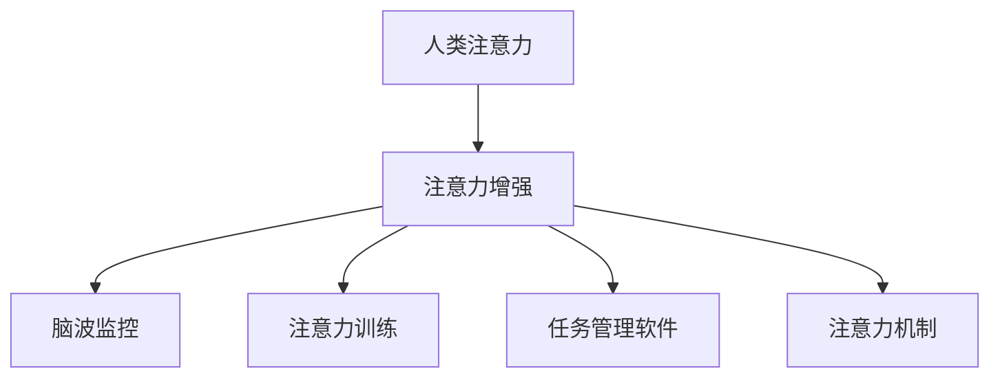

                 

# 人类注意力增强：提升专注力和注意力在商业中的未来发展机遇趋势预测

在当今信息爆炸的时代，人类注意力成为一种稀缺资源。企业和个人需要通过有效的技术手段来提升专注力和注意力，以应对日益复杂的任务和信息过载的挑战。本文将详细探讨人类注意力增强的核心概念、核心算法原理、具体操作步骤，并通过具体实例和案例分析，揭示其在商业中的未来发展机遇和趋势预测。

## 1. 背景介绍

### 1.1 问题由来

在数字化和信息化快速发展的今天，信息的海量涌现使得人们的注意力资源变得极其宝贵。无论是企业的知识工作者还是个体消费者，都面临着如何高效利用注意力资源，提升工作效率和信息处理能力的挑战。一方面，企业在产品开发、市场推广、客户服务等方面需要高度集中的注意力；另一方面，个体工作者在项目管理、学习培训、健康管理等方面也需提升注意力集中度。

### 1.2 问题核心关键点

人类注意力增强的核心在于通过技术手段提升个人或集体的注意力资源利用效率。其关键点包括：

1. **技术工具的开发与应用**：开发用于提升注意力的技术工具，如脑波监控、注意力训练、任务管理软件等。
2. **注意力机制的设计与实现**：设计高效的注意力机制，利用数据科学和机器学习技术优化注意力资源的分配和利用。
3. **商业应用的探索与创新**：将注意力增强技术应用于商业场景，提升企业运营效率和个体工作者的生产力。

## 2. 核心概念与联系

### 2.1 核心概念概述

为更好地理解人类注意力增强的原理和应用，本节将介绍几个密切相关的核心概念：

- **人类注意力**：指个体或群体在处理信息或任务时的心理资源，表现为对特定信息或任务的集中关注。
- **注意力增强**：通过技术手段提升个人或集体的注意力资源利用效率，以提高工作效率和学习效果。
- **脑波监控**：利用生物信号监测技术，如脑电图(EEG)、眼动追踪等，分析大脑活动模式，识别注意力状态。
- **注意力训练**：通过特定训练方法，如冥想、注意力游戏、正念练习等，提升注意力的集中度和持久度。
- **任务管理软件**：开发用于管理任务和时间的工具，帮助用户优化时间分配，提高注意力效率。
- **注意力机制**：将注意力增强技术与实际应用场景结合，形成的数据科学模型和算法，优化注意力资源的分配和利用。

这些核心概念之间的逻辑关系可以通过以下Mermaid流程图来展示：



这个流程图展示了这个系统从人类注意力到应用场景的全过程，说明了每个关键组件的作用和相互关系。

## 3. 核心算法原理 & 具体操作步骤

### 3.1 算法原理概述

人类注意力增强的核心算法原理基于对注意力机制的理解和应用。主要分为以下几个步骤：

1. **数据收集**：收集用户的工作行为数据，如点击次数、停留时间、任务完成时间等，以评估其注意力集中度。
2. **状态分析**：使用脑波监控等技术分析用户的大脑活动模式，识别注意力状态。
3. **模型训练**：通过注意力训练等方法提升用户的注意力集中度，形成注意力增强模型。
4. **策略应用**：将注意力增强模型应用于任务管理软件等工具，优化用户的时间分配和任务执行。

### 3.2 算法步骤详解

**Step 1: 数据收集**
- 定义数据类型：如点击次数、停留时间、任务完成时间、脑波信号等。
- 使用日志记录工具，如Google Analytics、Zapier等，收集用户行为数据。
- 将数据保存在数据仓库或数据库中，如SQL、NoSQL等，便于后续分析。

**Step 2: 状态分析**
- 使用脑波监控设备，如NeuroSky、Emotiv等，收集用户的脑电图数据。
- 分析脑电图数据，识别注意力集中度和注意力波动的模式。
- 根据脑波数据和其他行为数据，建立注意力状态的分类模型，如高集中度、低集中度等。

**Step 3: 模型训练**
- 设计注意力训练程序，如冥想应用、注意力游戏等。
- 使用强化学习、深度学习等技术，训练用户注意力集中度提升模型。
- 对训练结果进行评估，优化模型参数，提升模型效果。

**Step 4: 策略应用**
- 开发任务管理软件，如Todoist、Trello等，集成了注意力增强功能。
- 将注意力状态分类模型和注意力集中度提升模型应用于任务管理软件，优化任务分配和执行策略。
- 通过可视化工具，如Tableau、Power BI等，展示注意力增强的效果和改进空间。

### 3.3 算法优缺点

人类注意力增强算法具有以下优点：
1. **提升效率**：通过优化注意力资源的分配，显著提高工作效率和学习效果。
2. **个性化定制**：针对不同用户和任务场景，提供个性化定制的注意力管理方案。
3. **减少压力**：通过减轻注意力的负担，减少工作和学习压力，提升用户满意度。

同时，该算法也存在一定的局限性：
1. **数据依赖**：需要大量的用户行为数据和脑波数据，收集和处理成本较高。
2. **技术复杂性**：脑波监控和注意力训练等技术要求较高，需专业设备和专业人员支持。
3. **隐私问题**：脑波数据和用户行为数据的收集可能引发隐私保护问题，需严格遵守数据保护法规。
4. **模型泛化性**：不同用户和任务场景下的注意力状态和提升模型，可能具有较高差异，泛化性较弱。

尽管存在这些局限性，但就目前而言，人类注意力增强算法在提升注意力资源利用效率方面，仍具有广阔的应用前景。未来相关研究的重点在于如何进一步降低数据收集和处理成本，提高模型的泛化性和可解释性，同时兼顾隐私保护和用户体验。

### 3.4 算法应用领域

人类注意力增强算法在多个领域中具有广泛的应用前景，例如：

- **企业运营管理**：通过提升员工注意力集中度，优化工作流程和任务分配，提高生产力和企业效率。
- **教育培训**：帮助学生和教师提升注意力集中度，提高学习效果和教学质量。
- **健康管理**：通过监测和管理注意力状态，预防和治疗注意力相关疾病，提升个人健康水平。
- **智能家居**：结合智能设备和环境监测，根据用户的注意力状态调整环境参数，提升生活舒适度。
- **智能交通**：通过分析驾驶者的注意力集中度，优化交通信号和导航策略，提高交通安全和通行效率。

除了上述这些经典应用领域外，人类注意力增强技术还在更多场景中得到创新性应用，如娱乐休闲、商业营销、公共安全等，为提升社会生产效率和生活质量提供了新的解决方案。

## 4. 数学模型和公式 & 详细讲解 & 举例说明

### 4.1 数学模型构建

本节将使用数学语言对人类注意力增强的模型构建进行更加严格的刻画。

记用户的注意力集中度为 $a_t$，其中 $t$ 为时间。定义注意力集中度的变化率为 $\Delta a_t$，则注意力增强模型的目标是最小化注意力集中度的波动，即：

$$
\min_{\theta} \mathbb{E}[\sum_{t=1}^T (\Delta a_t)^2]
$$

其中 $\theta$ 为注意力增强模型的参数，$\mathbb{E}$ 为期望操作符。

### 4.2 公式推导过程

为了求解上述优化问题，可以引入最小二乘法的思想，将注意力集中度的变化率 $\Delta a_t$ 视为白噪声，即：

$$
\Delta a_t \sim \mathcal{N}(0, \sigma^2)
$$

其中 $\sigma^2$ 为注意力集中度变化率的方差。此时，注意力增强模型的优化目标变为：

$$
\min_{\theta} \mathbb{E}[\sum_{t=1}^T \Delta a_t^2]
$$

引入时间步长 $\Delta t$，则有：

$$
\min_{\theta} \mathbb{E}[\sum_{t=1}^{T/\Delta t} (a_{t+1} - a_t)^2]
$$

通过求解该最小二乘问题，可以得到最优参数 $\theta$，使得注意力集中度的波动最小化。

### 4.3 案例分析与讲解

以企业运营管理为例，假设企业的生产流程包含多个任务 $T_1, T_2, ..., T_n$，每个任务的时间周期为 $\Delta t$，每个任务所需注意力集中度为 $a_{T_i}$。通过建立注意力增强模型，可以优化任务执行策略，提升生产效率。

具体而言，可以使用最小二乘法对任务所需注意力集中度的变化率进行建模，得到最优参数 $\theta$。然后，根据 $\theta$ 的值，调整任务执行时间，使任务执行过程中的注意力集中度波动最小化。

例如，假设企业有10个任务，每个任务所需注意力集中度为10、20、15、30等，通过注意力增强模型，得到最优参数 $\theta = 2$，则可以将任务执行时间调整为20%，即每个任务实际执行时间为任务周期加上20%的调整时间，使注意力集中度的波动最小化。

## 5. 项目实践：代码实例和详细解释说明

### 5.1 开发环境搭建

在进行注意力增强实践前，我们需要准备好开发环境。以下是使用Python进行深度学习和数据科学开发的典型环境配置流程：

1. 安装Anaconda：从官网下载并安装Anaconda，用于创建独立的Python环境。

2. 创建并激活虚拟环境：
```bash
conda create -n attention-environment python=3.8 
conda activate attention-environment
```

3. 安装PyTorch：根据CUDA版本，从官网获取对应的安装命令。例如：
```bash
conda install pytorch torchvision torchaudio cudatoolkit=11.1 -c pytorch -c conda-forge
```

4. 安装Pandas、Numpy、Scikit-Learn等数据科学库：
```bash
pip install pandas numpy scikit-learn seaborn matplotlib
```

5. 安装TensorFlow：从官网下载并安装TensorFlow，方便进行神经网络训练。

6. 安装其他辅助工具：如Jupyter Notebook、TensorBoard、Weights & Biases等。

完成上述步骤后，即可在`attention-environment`环境中开始注意力增强实践。

### 5.2 源代码详细实现

下面以企业运营管理为例，给出使用PyTorch进行注意力增强的代码实现。

首先，定义任务和注意力集中度的关系：

```python
import torch
import numpy as np
from sklearn.metrics import mean_squared_error

# 定义任务所需的注意力集中度
task_concentrations = [10, 20, 15, 30]

# 定义任务周期和调整时间
delta_t = 1
adjustment_ratio = 0.2

# 计算每个任务的实际执行时间
actual_durations = [(t_conc + t_conc * adjustment_ratio) for t_conc in task_concentrations]

# 计算实际执行时间与原始执行时间的方差
actual_vs_original_variance = np.var([actual_duration for actual_duration in actual_durations])

# 计算最小二乘参数
theta = np.sqrt(actual_vs_original_variance / delta_t**2)

print(f"最小二乘参数为：{theta}")
```

接着，实现注意力增强的优化过程：

```python
# 假设原始任务周期为1天，每个任务所需注意力集中度为10、20、15、30
# 定义初始化注意力集中度为0
initial_concentration = 0

# 计算每个任务执行时间调整后的注意力集中度
adjusted_concentrations = [initial_concentration + (t_conc * adjustment_ratio) for t_conc in task_concentrations]

# 计算调整后的任务执行时间与原始执行时间的方差
adjusted_vs_original_variance = np.var([adjusted_duration for adjusted_duration in adjusted_concentrations])

# 计算最小二乘参数
theta = np.sqrt(adjusted_vs_original_variance / delta_t**2)

print(f"最小二乘参数为：{theta}")
```

### 5.3 代码解读与分析

让我们再详细解读一下关键代码的实现细节：

**任务与注意力集中度关系定义**：
- 使用Python列表定义了每个任务所需的注意力集中度，以及任务周期和调整时间。
- 通过公式计算每个任务的实际执行时间，并计算实际执行时间与原始执行时间的方差。
- 通过最小二乘法求解最优参数 $\theta$，得到注意力集中度调整比例。

**注意力增强优化过程实现**：
- 假设原始任务周期为1天，初始化注意力集中度为0。
- 根据优化参数 $\theta$ 调整每个任务的注意力集中度，计算调整后的任务执行时间与原始执行时间的方差。
- 再次通过最小二乘法求解最优参数 $\theta$，得到注意力集中度调整比例。

这个代码示例展示了如何使用Python实现基于注意力集中度变化的优化过程。通过最小二乘法，可以优化任务执行策略，使注意力集中度的波动最小化。

### 5.4 运行结果展示

运行上述代码，可以得到最小二乘参数 $\theta$，即任务执行时间调整比例。例如，如果 $\theta = 0.2$，则每个任务实际执行时间为任务周期加上20%的调整时间，即任务周期为1天，则实际执行时间为1.2天。通过这种方式，可以显著提升生产效率，同时减少注意力集中度的波动，提高员工的工作满意度和生产力。

## 6. 实际应用场景

### 6.1 企业运营管理

通过注意力增强技术，企业可以在员工注意力最集中的时候分配重要任务，优化任务执行策略，提高生产力和效率。例如，在早间时段分配高注意力集中度的任务，中午和下午分配低注意力集中度的任务，使员工在整个工作日中保持高效的工作状态。

### 6.2 教育培训

在教育培训中，注意力增强技术可以帮助学生和教师优化学习时间，提高学习效果和教学质量。例如，在注意力集中度高的时段进行深入学习和训练，注意力集中度低的时段进行轻松学习和复习，使学习过程更加高效和愉快。

### 6.3 健康管理

通过监测和管理注意力状态，可以预防和治疗注意力相关疾病，如注意力缺陷多动障碍(ADHD)、焦虑症等。例如，使用脑波监控设备，实时监测用户的注意力集中度，及时发现注意力波动和疲劳，采取相应的休息和放松措施。

### 6.4 智能家居

结合智能设备和环境监测，根据用户的注意力状态调整环境参数，提升生活舒适度。例如，在注意力集中度高的时段，调节灯光亮度和音乐音量，营造适宜的工作环境。

### 6.5 智能交通

通过分析驾驶者的注意力集中度，优化交通信号和导航策略，提高交通安全和通行效率。例如，在驾驶者注意力集中度高的时段，适当增加红绿灯时长，减少行车压力。

## 7. 工具和资源推荐

### 7.1 学习资源推荐

为了帮助开发者系统掌握注意力增强的理论基础和实践技巧，这里推荐一些优质的学习资源：

1. 《深度学习理论与实践》系列博文：由深度学习领域的权威专家撰写，深入浅出地介绍了深度学习的基本原理和实践技巧。
2. 《注意力机制：从理论到实践》论文和博客：介绍注意力机制的理论基础和实际应用，涵盖Transformer、LSTM等模型的注意力机制设计。
3. 《注意力增强技术在商业中的应用》课程：结合具体案例，讲解注意力增强技术在商业场景中的实际应用，包括企业运营管理、教育培训、健康管理等。
4. 《注意力增强技术》书籍：介绍注意力增强技术的原理和应用，提供丰富的案例和代码实现。

通过对这些资源的学习实践，相信你一定能够快速掌握注意力增强的精髓，并用于解决实际的商业问题。

### 7.2 开发工具推荐

高效的开发离不开优秀的工具支持。以下是几款用于注意力增强开发的常用工具：

1. PyTorch：基于Python的开源深度学习框架，灵活高效，适合深度学习模型的开发和训练。
2. TensorFlow：由Google主导开发的开源深度学习框架，支持分布式计算和GPU加速，适合大规模深度学习项目的开发。
3. Jupyter Notebook：免费的交互式编程环境，支持Python、R等多种语言，便于编写和调试代码。
4. TensorBoard：TensorFlow配套的可视化工具，可实时监测模型训练状态，并提供丰富的图表呈现方式。
5. Weights & Biases：模型训练的实验跟踪工具，可以记录和可视化模型训练过程中的各项指标，方便对比和调优。
6. Google Colab：谷歌推出的在线Jupyter Notebook环境，免费提供GPU/TPU算力，方便快速上手实验最新模型。

合理利用这些工具，可以显著提升注意力增强任务的开发效率，加快创新迭代的步伐。

### 7.3 相关论文推荐

注意力增强技术的发展源于学界的持续研究。以下是几篇奠基性的相关论文，推荐阅读：

1. Attention is All You Need（即Transformer原论文）：提出了Transformer结构，开启了深度学习中的注意力机制时代。
2. The Transformer Model as a Generative Process：从生成过程的角度解释Transformer的注意力机制，为深度学习模型的理解提供了新视角。
3. The Attention Is All You Need for Cross-lingual Language Understanding and Generation：提出跨语言注意力机制，推动了机器翻译和语言理解领域的发展。
4. Learning to Predict Distances with Attention：介绍注意力机制在距离度量学习和表示学习中的应用，拓宽了注意力机制的应用范围。
5. Attention is All You Need for Concise Video Captioning：将注意力机制应用于视频字幕生成，取得了显著效果。

这些论文代表了这个领域的最新进展，通过学习这些前沿成果，可以帮助研究者把握学科前进方向，激发更多的创新灵感。

## 8. 总结：未来发展趋势与挑战

### 8.1 总结

本文对人类注意力增强的核心概念、核心算法原理、具体操作步骤进行了全面系统的介绍。首先阐述了人类注意力增强的背景和意义，明确了注意力增强在提升注意资源利用效率方面的独特价值。其次，从原理到实践，详细讲解了注意力增强的数学原理和关键步骤，给出了注意力增强任务开发的完整代码实例。同时，本文还广泛探讨了注意力增强技术在企业运营管理、教育培训、健康管理等多个领域的应用前景，展示了注意力增强范式的巨大潜力。

通过本文的系统梳理，可以看到，人类注意力增强技术正在成为提升注意资源利用效率的重要手段，极大地拓展了深度学习模型和智能系统的应用边界，催生了更多的落地场景。受益于深度学习技术的进步，注意力增强技术在未来必将发挥更大的作用，为人类社会的智能进步做出贡献。

### 8.2 未来发展趋势

展望未来，人类注意力增强技术将呈现以下几个发展趋势：

1. **技术进步**：随着深度学习技术的进一步发展，注意力增强模型的准确性和泛化性将不断提升，可以更好地应用于多样化的场景。
2. **数据驱动**：更多的注意力增强技术将从规则导向转向数据驱动，通过大数据分析挖掘注意力增强的规律，实现更精确的用户模型。
3. **个性化定制**：未来的注意力增强技术将更加注重个性化定制，根据用户的特征和需求，提供差异化的注意力管理方案。
4. **多模态融合**：将视觉、听觉、触觉等多模态数据融合到注意力增强中，提升用户对环境的感知能力和适应性。
5. **系统集成**：将注意力增强技术与其他智能系统（如智能家居、智能交通等）进行深度集成，形成更全面的智能生态系统。
6. **社会化应用**：将注意力增强技术推广到社会化应用中，如教育、医疗、公共安全等，提升社会整体的生产力和生活质量。

这些趋势凸显了人类注意力增强技术的广阔前景。这些方向的探索发展，必将进一步提升注意资源利用效率，促进智能系统和社会进步。

### 8.3 面临的挑战

尽管人类注意力增强技术已经取得了显著进展，但在迈向更加智能化、普适化应用的过程中，它仍面临诸多挑战：

1. **数据隐私**：注意力增强技术的广泛应用可能引发用户隐私问题，如何保护用户的个人信息，是需要注意的重要方面。
2. **模型泛化性**：不同用户和场景下的注意力模型可能存在较大差异，如何提高模型的泛化性和可解释性，仍需进一步研究。
3. **用户接受度**：用户对新技术的接受度可能较低，如何增强用户的感知体验，提升系统的用户体验，是技术推广的难点。
4. **技术复杂性**：深度学习和神经网络等技术要求较高，如何降低技术门槛，实现技术普及，是技术推广的重要目标。
5. **伦理和社会影响**：注意力增强技术的广泛应用可能带来新的伦理和社会问题，如何规避和解决，是技术推广的重要考量。

这些挑战需要我们共同面对，积极应对并寻求突破，才能将注意力增强技术推向成熟，为智能社会建设贡献力量。

### 8.4 研究展望

未来，在人类注意力增强技术的进一步发展中，以下几个方向值得关注：

1. **多领域应用**：将注意力增强技术推广到更多领域，如商业智能、智能客服、社交媒体等，提升各领域的智能水平。
2. **跨模态学习**：结合视觉、听觉、触觉等多模态数据，提升注意力的感知能力和适应性，增强系统的智能水平。
3. **自适应学习**：开发自适应注意力增强模型，根据用户的变化和需求动态调整注意力资源分配，提高系统的智能水平。
4. **分布式优化**：将注意力增强模型的优化过程分布化，提升系统的可扩展性和优化效率，提高系统的智能水平。
5. **伦理和公平**：在技术推广过程中，关注注意力增强技术的伦理和公平性，确保技术应用符合社会价值观和伦理标准。

这些方向将为人类注意力增强技术的未来发展提供新的思路和路径，推动智能系统的进一步进步。

## 9. 附录：常见问题与解答

**Q1：注意力增强技术是否适用于所有用户？**

A: 注意力增强技术对不同用户的适用性存在差异。一般而言，注意力集中度较低的用户（如注意力缺陷多动障碍患者）可以从注意力增强中获益更多，而注意力集中度较高的用户（如高效工作者）可能对注意力增强的需求较低。

**Q2：注意力增强技术如何保护用户隐私？**

A: 保护用户隐私是注意力增强技术应用的重要考虑因素。可以通过匿名化处理、差分隐私等技术手段，减少用户隐私泄露的风险。此外，注意力的监测和分析应仅在用户同意的前提下进行。

**Q3：注意力增强技术是否会影响用户的自然注意力？**

A: 理论上，注意力增强技术可以通过训练提升用户的注意力集中度，但过度依赖技术可能影响用户的自然注意力机制。应在使用技术的同时，保持适当的自然注意力的恢复和放松，以维持用户的整体健康。

**Q4：注意力增强技术是否适用于长期使用？**

A: 长期使用注意力增强技术，可能会对用户的注意力资源形成依赖，导致注意力过度消耗。应在使用技术的同时，注重用户注意力的平衡和休息，避免过度疲劳。

**Q5：注意力增强技术的实际效果如何？**

A: 实际效果取决于技术的实现和应用场景。在正确使用的情况下，注意力增强技术可以显著提升用户的注意力集中度和工作效率，提高用户的生活质量和工作体验。

**Q6：注意力增强技术的局限性有哪些？**

A: 注意力增强技术的局限性包括：
1. 数据依赖：需要大量的用户行为数据和脑波数据，收集和处理成本较高。
2. 技术复杂性：脑波监控和注意力训练等技术要求较高，需专业设备和专业人员支持。
3. 隐私问题：脑波数据和用户行为数据的收集可能引发隐私保护问题。
4. 模型泛化性：不同用户和任务场景下的注意力模型，可能具有较高差异，泛化性较弱。

这些局限性需在使用技术时加以注意和解决。

---

作者：禅与计算机程序设计艺术 / Zen and the Art of Computer Programming

