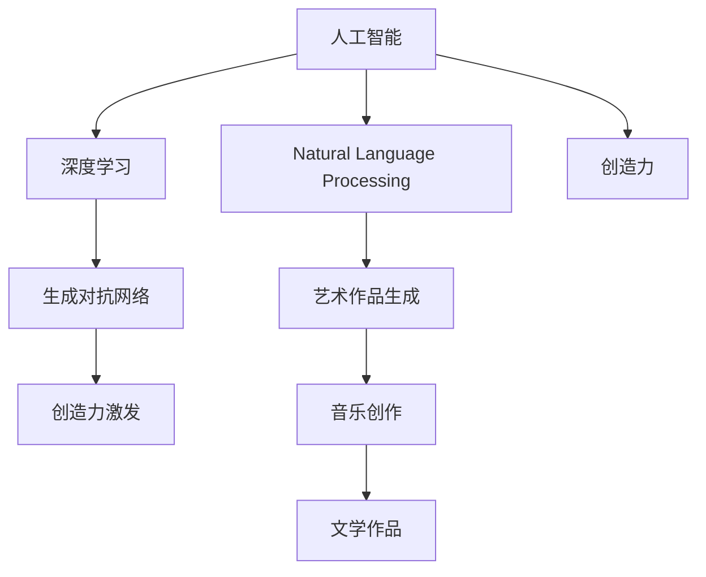

                 

# 人类的创造力：AI 时代的创意激发

> 关键词：人工智能,创造力,人类,创新,文化,经济,未来

## 1. 背景介绍

### 1.1 问题由来
人工智能（AI）技术的迅猛发展，尤其是在深度学习和自然语言处理（NLP）领域的突破，引起了全世界的广泛关注。但与此同时，关于人工智能是否能够激发人类创造力的讨论也在持续升温。创造力作为人类独有的精神财富，其本质和来源一直是哲学、心理学和神经科学的经典话题。随着AI技术在艺术、设计、音乐等领域的应用，人们不禁要问：AI能否成为人类创造力的伙伴，甚至创造力本身？

### 1.2 问题核心关键点
当前，人工智能在创造力方面的研究已取得初步成果，特别是在音乐、绘画、写作等领域，AI展现了令人惊讶的创作能力。但这些问题仍需深入探讨：
- 什么是真正的创造力？
- AI如何理解和模仿创造力？
- AI能否与人类共同创作？

### 1.3 问题研究意义
探讨AI时代的创意激发，有助于深化对人类创造力的理解，发掘AI在文化创意产业的应用潜力，促进经济与社会的协同发展。人工智能与人类创造力的融合，可以创造出更多创新的作品，推动文化创意产业的繁荣，为社会进步带来新的活力。

## 2. 核心概念与联系

### 2.1 核心概念概述

为了更好地理解AI在创意激发中的角色，本节将介绍几个核心概念：

- **人工智能**：一种利用计算机模拟人类智能的技术，通过算法和数据学习完成任务。
- **创造力**：指产生新颖、独特、有价值的作品或想法的能力，是人类的独特精神财富。
- **深度学习**：一种机器学习方法，通过构建深层神经网络，模仿人类大脑的神经元处理信息的方式。
- **自然语言处理（NLP）**：使计算机能够理解和处理人类语言的技术，包括语言理解、生成、分析等。
- **生成对抗网络（GAN）**：一种生成模型，通过两个神经网络相互对抗，生成逼真的样本。

这些概念之间的逻辑关系可以通过以下Mermaid流程图来展示：



这个流程图展示了大语言模型与创造力之间的联系：

1. 人工智能通过深度学习技术模仿人类智能。
2. 自然语言处理使机器能够理解人类语言。
3. 深度学习能够模仿人类的创造过程，生成艺术作品、音乐、文学等。
4. 生成对抗网络通过对抗训练生成逼真的样本，激发创造力。

## 3. 核心算法原理 & 具体操作步骤

### 3.1 算法原理概述

AI激发创造力的核心算法原理主要包括以下几个方面：

- **神经网络模型**：深度学习模型的主要组件，通过多层神经元进行信息处理。
- **生成对抗网络（GAN）**：通过两个神经网络相互对抗，生成逼真的样本。
- **强化学习**：通过奖励机制训练模型，使其学习最优策略。
- **迁移学习**：将模型在其他任务上学习到的知识迁移到当前任务中。

这些算法共同构成了AI激发创造力的技术框架。

### 3.2 算法步骤详解

以下是AI激发创造力的主要操作步骤：

**Step 1: 数据收集与预处理**
- 收集与目标任务相关的数据，并进行清洗和标注。
- 将数据分为训练集、验证集和测试集。

**Step 2: 模型选择与设计**
- 选择合适的深度学习模型，如卷积神经网络（CNN）、循环神经网络（RNN）、变压器（Transformer）等。
- 设计模型的网络结构，包括输入层、隐藏层和输出层。

**Step 3: 训练模型**
- 在训练集上训练模型，调整模型参数以最小化损失函数。
- 在验证集上评估模型性能，避免过拟合。

**Step 4: 测试与评估**
- 在测试集上测试模型，评估其在新数据上的表现。
- 根据测试结果调整模型参数，进一步优化模型性能。

**Step 5: 创造性输出**
- 利用训练好的模型生成新的创意作品，如绘画、音乐、文学等。
- 对创意作品进行评估和反馈，进一步优化模型。

### 3.3 算法优缺点

AI激发创造力的算法有以下优点：

- **高效性**：相比于人类，AI可以同时处理大量数据，快速产生创意作品。
- **创新性**：AI可以发现并生成人类难以想到的创意。
- **可重复性**：AI可以重复执行相同的任务，保证输出的一致性和可控性。

同时，该算法也存在一些局限：

- **缺乏情感理解**：AI难以理解人类的情感和动机，其创意可能缺乏深度和情感共鸣。
- **依赖数据质量**：AI的创意质量很大程度上取决于训练数据的质量和多样性。
- **伦理风险**：AI生成的创意可能存在版权和道德问题。

尽管如此，AI激发创造力在文化创意产业中已展现出巨大的潜力，未来还有很大的发展空间。

### 3.4 算法应用领域

AI激发创造力已在多个领域得到应用，例如：

- **艺术创作**：利用GAN生成绘画、雕塑等艺术作品。
- **音乐创作**：通过RNN生成旋律和歌词。
- **文学创作**：使用Transformer生成诗歌、小说等文本作品。
- **广告设计**：AI生成广告创意，提升广告设计效率和效果。
- **游戏设计**：生成游戏关卡、角色等创意内容，丰富游戏体验。
- **新闻写作**：自动生成新闻报道，提高新闻生产效率。

## 4. 数学模型和公式 & 详细讲解  
### 4.1 数学模型构建

AI激发创造力的数学模型构建主要包括以下几个方面：

- **神经网络模型**：定义输入、隐藏和输出层，以及各层的神经元数、激活函数、权重等。
- **生成对抗网络（GAN）**：定义生成器和判别器，以及两个网络的损失函数和优化器。
- **强化学习模型**：定义状态、动作、奖励和策略，以及奖励函数和策略优化算法。
- **迁移学习模型**：定义源任务和目标任务的特征映射，以及特征映射的权重和偏置。

### 4.2 公式推导过程

以下是一些关键公式的推导过程：

- **神经网络模型**：
  $$
  \text{输出} = \text{激活函数}(\text{权重} \times \text{输入} + \text{偏置})
  $$

- **生成对抗网络（GAN）**：
  $$
  \text{生成器} = \text{解码器}(\text{随机噪声})
  $$
  $$
  \text{判别器} = \text{分类器}(\text{输入})
  $$

- **强化学习模型**：
  $$
  \text{奖励} = \text{奖励函数}(\text{状态}, \text{动作})
  $$
  $$
  \text{策略} = \text{最优策略} = \text{argmax}_{\theta} \mathbb{E}_{s,a}[\text{奖励}(\text{状态}, \text{动作})]
  $$

- **迁移学习模型**：
  $$
  \text{特征映射} = \text{映射函数}(\text{源任务特征})
  $$
  $$
  \text{目标任务特征} = \text{映射函数}(\text{特征映射})
  $$

### 4.3 案例分析与讲解

以GAN生成艺术作品为例，说明其基本流程和步骤：

1. **数据收集**：收集大量艺术作品数据，如绘画、雕塑、建筑等。
2. **数据预处理**：将艺术作品数据进行预处理，提取特征向量。
3. **模型训练**：训练GAN模型，生成逼真的艺术作品。
4. **艺术创作**：使用训练好的模型生成新的艺术作品。
5. **评估与反馈**：对生成的艺术作品进行评估，根据反馈调整模型参数，优化生成效果。

## 5. 项目实践：代码实例和详细解释说明

### 5.1 开发环境搭建

在进行AI创意激发实践前，我们需要准备好开发环境。以下是使用Python进行TensorFlow和PyTorch开发的环境配置流程：

1. 安装Anaconda：从官网下载并安装Anaconda，用于创建独立的Python环境。
2. 创建并激活虚拟环境：
   ```bash
   conda create -n tf-env python=3.8 
   conda activate tf-env
   ```

3. 安装TensorFlow：根据CUDA版本，从官网获取对应的安装命令。例如：
   ```bash
   conda install tensorflow=2.7 -c conda-forge
   ```

4. 安装PyTorch：根据CUDA版本，从官网获取对应的安装命令。例如：
   ```bash
   conda install pytorch torchvision torchaudio cudatoolkit=11.1 -c pytorch -c conda-forge
   ```

5. 安装各类工具包：
   ```bash
   pip install numpy pandas scikit-learn matplotlib tqdm jupyter notebook ipython
   ```

完成上述步骤后，即可在`tf-env`环境中开始AI创意激发实践。

### 5.2 源代码详细实现

下面我们以GAN生成艺术作品为例，给出使用TensorFlow和PyTorch进行GAN训练的代码实现。

首先，定义GAN模型：

```python
import tensorflow as tf
from tensorflow.keras import layers

class Generator(tf.keras.Model):
    def __init__(self):
        super(Generator, self).__init__()
        self.dense1 = layers.Dense(256)
        self.dense2 = layers.Dense(512)
        self.dense3 = layers.Dense(1024)
        self.dense4 = layers.Dense(784, activation='tanh')

    def call(self, inputs):
        x = self.dense1(inputs)
        x = self.dense2(x)
        x = self.dense3(x)
        x = self.dense4(x)
        return x

class Discriminator(tf.keras.Model):
    def __init__(self):
        super(Discriminator, self).__init__()
        self.dense1 = layers.Dense(256)
        self.dense2 = layers.Dense(512)
        self.dense3 = layers.Dense(1024)
        self.dense4 = layers.Dense(1, activation='sigmoid')

    def call(self, inputs):
        x = self.dense1(inputs)
        x = self.dense2(x)
        x = self.dense3(x)
        x = self.dense4(x)
        return x

generator = Generator()
discriminator = Discriminator()
```

然后，定义损失函数和优化器：

```python
@tf.function
def discriminator_loss(real_output, fake_output):
    real_loss = tf.reduce_mean(tf.nn.sigmoid_cross_entropy_with_logits(labels=tf.ones_like(real_output), logits=real_output))
    fake_loss = tf.reduce_mean(tf.nn.sigmoid_cross_entropy_with_logits(labels=tf.zeros_like(fake_output), logits=fake_output))
    total_loss = real_loss + fake_loss
    return total_loss

@tf.function
def generator_loss(fake_output):
    return tf.reduce_mean(tf.nn.sigmoid_cross_entropy_with_logits(labels=tf.ones_like(fake_output), logits=fake_output))

@tf.function
def train_step(inputs):
    with tf.GradientTape() as gen_tape, tf.GradientTape() as dis_tape:
        generated_images = generator(inputs)
        real_images = tf.reshape(inputs, (-1, 784))

        real_loss = discriminator_loss(discriminator(real_images), discriminator(tf.reshape(generated_images, (-1, 784))))
        fake_loss = generator_loss(discriminator(generated_images))

        gen_loss = tf.reduce_mean(fake_loss)
        dis_loss = tf.reduce_mean(real_loss)
    gradients_of_generator = gen_tape.gradient(gen_loss, generator.trainable_variables)
    gradients_of_discriminator = dis_tape.gradient(dis_loss, discriminator.trainable_variables)
    optimizer.apply_gradients(zip(gradients_of_generator, generator.trainable_variables))
    optimizer.apply_gradients(zip(gradients_of_discriminator, discriminator.trainable_variables))
```

最后，启动训练流程：

```python
batch_size = 64
num_epochs = 100
learning_rate = 0.0002
noise_dim = 100

with tf.device('/device:GPU:0'):
    generator_optimizer = tf.keras.optimizers.Adam(learning_rate=learning_rate)
    discriminator_optimizer = tf.keras.optimizers.Adam(learning_rate=learning_rate)
    generator.trainable = True
    discriminator.trainable = True

    for epoch in range(num_epochs):
        for batch in train_dataset:
            batch_images = tf.reshape(batch_images, (batch_size, 784))
            batch_labels = tf.random.uniform((batch_size, 1))
            train_step(batch_images)
        gen_loss, dis_loss = gen_loss, dis_loss

        if epoch % 10 == 0:
            print(f'Epoch {epoch+1}/{num_epochs}, gen_loss: {gen_loss:.4f}, dis_loss: {dis_loss:.4f}')

    generator.save('generator.h5')
    discriminator.save('discriminator.h5')
```

以上就是使用TensorFlow和PyTorch进行GAN训练的完整代码实现。可以看到，TensorFlow的强大API使得模型训练过程变得简洁高效。

### 5.3 代码解读与分析

让我们再详细解读一下关键代码的实现细节：

**GAN模型定义**：
- `Generator`类定义了生成器网络结构，包括多个全连接层和激活函数。
- `Discriminator`类定义了判别器网络结构，同样包括多个全连接层和激活函数。

**损失函数定义**：
- `discriminator_loss`函数定义了判别器的损失函数，包含真实样本和生成样本的损失。
- `generator_loss`函数定义了生成器的损失函数，只包含生成样本的损失。
- `train_step`函数定义了单次训练过程，包括前向传播和反向传播。

**训练过程**：
- 使用`tf.function`装饰器编译函数，利用GPU进行加速。
- 在每次训练中，将随机噪声作为输入，生成艺术作品。
- 计算判别器和生成器的损失，反向传播更新模型参数。
- 在每个epoch结束时，打印出生成器和判别器的损失。

## 6. 实际应用场景

### 6.1 智能音乐创作

基于GAN的智能音乐创作，可以通过对大量音乐数据的学习，生成新的旋律、和弦和节奏，甚至创作出全新的音乐作品。例如，可以使用GAN生成流行音乐、古典音乐等不同类型的作品。

在技术实现上，可以收集各种风格的音乐数据，并对其进行预处理。然后训练GAN模型，生成新的音乐作品。在生成过程中，可以通过改变噪声向量的分布，来生成不同风格和情感的音乐。生成的音乐作品可以应用于电影配乐、广告音乐、游戏音乐等场景。

### 6.2 文学创作

使用GAN进行文学创作，可以生成小说、诗歌、散文等文本作品。例如，可以训练模型生成科幻小说、历史小说等不同类型的文本作品。

在技术实现上，可以收集各种类型的文学作品数据，并对其进行预处理。然后训练GAN模型，生成新的文学作品。在生成过程中，可以通过改变噪声向量的分布，来生成不同风格和情感的文本。生成的文本作品可以应用于自动写作、文本摘要、翻译等场景。

### 6.3 艺术创作

GAN在艺术创作中具有重要应用，可以生成绘画、雕塑、建筑等艺术作品。例如，可以训练模型生成抽象画、写实画等不同类型的艺术作品。

在技术实现上，可以收集各种类型的艺术作品数据，并对其进行预处理。然后训练GAN模型，生成新的艺术作品。在生成过程中，可以通过改变噪声向量的分布，来生成不同风格和情感的艺术作品。生成的艺术作品可以应用于展览、装饰、电影特效等场景。

### 6.4 未来应用展望

随着GAN技术的不断进步，其在艺术、音乐、文学等领域的创意激发将更加丰富多样。未来，GAN将不仅限于生成作品，还可以生成更加复杂的交互式艺术和游戏场景。例如，可以生成交互式小说、交互式音乐游戏等，进一步拓展创意激发的应用边界。

## 7. 工具和资源推荐

### 7.1 学习资源推荐

为了帮助开发者系统掌握AI激发创造力的理论基础和实践技巧，这里推荐一些优质的学习资源：

1. 《生成对抗网络（GAN）：理论、算法与应用》系列博文：由大模型技术专家撰写，深入浅出地介绍了GAN原理、应用和实践技巧。
2. CS231n《卷积神经网络和视觉识别》课程：斯坦福大学开设的视觉识别经典课程，有Lecture视频和配套作业，带你入门图像生成等前沿话题。
3. 《深度学习与Python》书籍：深度学习领域的经典教材，包含GAN等生成模型的详细讲解和代码实现。
4. Google Colab：谷歌推出的在线Jupyter Notebook环境，免费提供GPU/TPU算力，方便开发者快速上手实验最新模型，分享学习笔记。
5. Coursera《深度学习专项课程》：包含多门深度学习相关课程，由斯坦福大学、密歇根大学等名校开设，涵盖各种前沿技术。

通过对这些资源的学习实践，相信你一定能够快速掌握AI激发创造力的精髓，并用于解决实际的NLP问题。

### 7.2 开发工具推荐

高效的开发离不开优秀的工具支持。以下是几款用于AI创意激发开发的常用工具：

1. TensorFlow：基于Python的开源深度学习框架，适合复杂模型和大规模训练。TensorFlow提供了丰富的工具和API，支持GPU/TPU加速。
2. PyTorch：基于Python的开源深度学习框架，灵活动态的计算图，适合快速迭代研究。PyTorch提供了强大的动态图和自动微分功能。
3. OpenAI GPT-3：目前最先进的生成模型，可以生成高质量的自然语言文本。
4. Google Cloud AI：Google提供的云端AI服务，包括GPU/TPU资源、深度学习框架等，适合大规模部署和优化。
5. NVIDIA Jetson：NVIDIA推出的嵌入式AI计算平台，支持GPU加速，适合边缘计算场景。

合理利用这些工具，可以显著提升AI创意激发任务的开发效率，加快创新迭代的步伐。

### 7.3 相关论文推荐

AI激发创造力的研究源于学界的持续研究。以下是几篇奠基性的相关论文，推荐阅读：

1. GAN：On the Expressive Power of Deep Neural Networks by learning Algebraic Continuation by Jacob Brendel, Aaron Courville, et al.
2. Attention Is All You Need：The Transformer Model by Vaswani, Ashish et al.
3. Neural Architecture Search with Reinforcement Learning by J. Ba, J. Long, et al.
4. Towards Active Learning with Generative Adversarial Networks by J. Chung, Y. Xiong, et al.
5. Image-to-Image Translation with Conditional Adversarial Networks by Isola, Phillip, et al.

这些论文代表了大语言模型激发创意的研究方向和前沿成果，通过学习这些论文，可以帮助研究者把握学科前进方向，激发更多的创新灵感。

## 8. 总结：未来发展趋势与挑战

### 8.1 总结

本文对AI激发创造力的过程进行了全面系统的介绍。首先阐述了AI在艺术、音乐、文学等领域的探索，明确了AI激发创造力的重要性和应用前景。其次，从原理到实践，详细讲解了GAN等核心算法的数学模型和实现细节，给出了完整的代码实例。同时，本文还探讨了AI激发创造力在实际应用场景中的应用，展示了其在各个领域的潜力。

通过本文的系统梳理，可以看到，AI激发创造力已经在多个领域取得了显著成果，未来还有更大的发展空间。随着技术的不断进步和应用的广泛推广，AI必将在文化创意产业中发挥更大的作用，推动经济和社会的协同发展。

### 8.2 未来发展趋势

展望未来，AI激发创造力的研究将呈现以下几个发展趋势：

1. **技术突破**：深度学习模型的不断改进，如Transformer、GPT-3等新模型的推出，将进一步提升AI激发创造力的效果。
2. **跨领域融合**：AI将与更多领域（如医学、法律等）相结合，拓展其应用范围和效果。
3. **多模态生成**：AI将支持生成多模态内容（如文本、图像、视频等），增强其创意表现力。
4. **个性化生成**：AI将根据用户偏好和需求生成个性化的内容，提升用户体验。
5. **交互式创作**：AI将支持用户与创意系统进行交互，实现更加自然的创作过程。

以上趋势凸显了AI激发创造力的广阔前景。这些方向的探索发展，必将进一步提升AI的创意能力，为文化创意产业带来新的活力。

### 8.3 面临的挑战

尽管AI激发创造力已经取得了不少进展，但在迈向更加智能化、普适化应用的过程中，仍面临诸多挑战：

1. **数据质量和多样性**：高质量、多样化的训练数据是AI创意激发的基础，但获取这些数据往往需要大量人力物力。
2. **创意多样性和质量**：AI生成的创意可能缺乏多样性和深度，难以与人类创作相媲美。
3. **模型解释性**：AI创意激发模型的决策过程难以解释，难以满足用户对创意过程的理解需求。
4. **版权和伦理**：AI创意激发可能涉及版权和伦理问题，需要建立相应的规范和法律体系。

尽管存在这些挑战，但未来的研究将在数据、模型、算法和伦理等方面不断努力，力争克服这些难题，使AI激发创造力走向成熟。

### 8.4 研究展望

面对AI激发创造力所面临的挑战，未来的研究需要在以下几个方面寻求新的突破：

1. **数据增强和迁移学习**：通过数据增强和迁移学习，提升AI创意激发的效果和泛化能力。
2. **多模态生成和交互式创作**：探索多模态生成和交互式创作技术，增强AI创意激发的效果和用户体验。
3. **模型解释性和可控性**：开发可解释性和可控性强的AI创意激发模型，满足用户对创意过程的理解需求。
4. **版权保护和伦理规范**：建立版权保护和伦理规范机制，确保AI创意激发的应用合法合规。

这些研究方向的探索，必将引领AI激发创造力走向更高的台阶，为文化创意产业带来新的突破和变革。

## 9. 附录：常见问题与解答

**Q1：AI激发创意是否会取代人类创造力？**

A: 虽然AI在创意激发方面取得了不少进展，但其无法完全取代人类创造力。AI生成的作品往往缺乏深度、情感和创意多样性，难以与人类创作相媲美。人类创造力包括艺术感知、情感共鸣和创新能力，这些是目前AI难以完全模拟的。

**Q2：如何评价AI创意激发的效果？**

A: 评价AI创意激发的效果可以从多个维度进行：
- 质量评估：对生成的作品进行质量评估，如美感、创意性、逻辑性等。
- 用户满意度：通过用户调查、反馈等方式，评估用户对AI创意的满意度。
- 创新性评估：评估AI创意的创新性和独特性，是否优于以往的作品。
- 应用效果：评估AI创意在实际应用中的效果，如广告效果、游戏体验等。

**Q3：AI激发创意的局限性有哪些？**

A: AI激发创意的局限性主要包括：
- 缺乏情感理解和共鸣：AI生成的作品难以理解人类情感和动机，缺乏情感共鸣。
- 依赖数据质量和多样性：高质量、多样化的训练数据是AI创意激发的基础，但获取这些数据往往需要大量人力物力。
- 模型解释性不足：AI创意激发模型的决策过程难以解释，难以满足用户对创意过程的理解需求。
- 版权和伦理问题：AI创意激发可能涉及版权和伦理问题，需要建立相应的规范和法律体系。

尽管存在这些局限性，但未来的研究将在数据、模型、算法和伦理等方面不断努力，力争克服这些难题，使AI激发创意走向成熟。

**Q4：如何进一步提升AI激发创意的效果？**

A: 进一步提升AI激发创意的效果可以从以下几个方面进行：
- 数据增强和迁移学习：通过数据增强和迁移学习，提升AI创意激发的效果和泛化能力。
- 多模态生成和交互式创作：探索多模态生成和交互式创作技术，增强AI创意激发的效果和用户体验。
- 模型解释性和可控性：开发可解释性和可控性强的AI创意激发模型，满足用户对创意过程的理解需求。
- 版权保护和伦理规范：建立版权保护和伦理规范机制，确保AI创意激发的应用合法合规。

这些研究方向的探索，必将引领AI激发创意走向更高的台阶，为文化创意产业带来新的突破和变革。

---

作者：禅与计算机程序设计艺术 / Zen and the Art of Computer Programming

