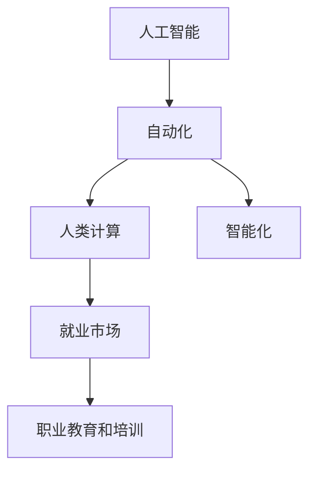

                 

# 人类计算：AI时代的未来就业市场趋势分析

> 关键词：人类计算,人工智能,就业市场,未来趋势

## 1. 背景介绍

### 1.1 问题由来

随着人工智能技术的飞速发展，越来越多的人工劳动被机器取代，这在引发社会广泛关注的同时，也引发了关于未来就业市场的深度思考。人类计算，即通过人工智能技术实现替代人类进行计算任务的自动化过程，是当前AI技术发展的重要方向之一。然而，这种变革将对未来的就业市场产生怎样的影响，如何应对AI时代的就业挑战，成为亟待探讨的重要课题。

### 1.2 问题核心关键点

本研究聚焦于人类计算对未来就业市场的影响。主要问题包括：
1. AI技术的普及将如何改变劳动力的构成，哪些岗位可能被替代？
2. AI技术的发展对就业市场的整体结构有何影响，包括新增岗位、岗位转移和岗位消失等？
3. 面对AI时代，如何规划职业教育和人才培养，以适应未来就业市场的变化？

## 2. 核心概念与联系

### 2.1 核心概念概述

为更全面地理解人类计算对就业市场的影响，需梳理以下核心概念及其相互关系：

- **人工智能(AI)**：通过计算机模拟人类智能行为的技术。主要应用包括机器学习、深度学习、自然语言处理等。
- **人类计算(Human Compute)**：指利用AI技术替代人类进行计算、分析和决策的任务，旨在提高生产效率和创造性。
- **自动化(Automation)**：指通过机器自动化执行人类原本需要手工完成的任务。自动化是实现人类计算的重要手段。
- **智能化(Intelligence)**：指机器能理解和执行复杂的任务，如问题解决、情感识别、创造性工作等。智能化是AI技术发展的高级阶段。
- **就业市场**：指劳动力与就业岗位之间的匹配关系，影响因素包括劳动者的技能、职业教育和市场需求等。
- **职业教育和培训**：旨在提升劳动者的技能和知识水平，适应未来就业市场的变化。

这些概念之间的关系可以通过以下Mermaid流程图进行展示：



该流程图展示了AI技术通过自动化实现人类计算，进而影响就业市场的总体结构。职业教育和培训则在这一过程中发挥着调整和适应作用。

## 3. 核心算法原理 & 具体操作步骤
### 3.1 算法原理概述

人类计算的实现主要依赖于AI技术的自动化和智能化。其核心算法原理主要包括：

- **自动化算法**：如机器视觉、自然语言处理、自动驾驶等。通过算法实现对特定任务的自动化处理，减少人力需求。
- **强化学习算法**：通过反复试错和奖励机制，使机器在复杂环境中不断优化决策策略，提升智能化水平。
- **生成对抗网络(GAN)**：通过两个神经网络的对抗训练，生成高质量的数据和图像，用于增强AI模型的泛化能力。

### 3.2 算法步骤详解

人类计算的实施通常分为以下几个步骤：

1. **需求分析**：明确需要自动化的任务，如数据处理、图像识别、语音识别等。
2. **数据准备**：收集和预处理相关数据，确保数据质量和多样性。
3. **模型训练**：选择合适的AI模型，并在大规模数据集上进行训练，优化模型参数。
4. **模型部署**：将训练好的模型部署到实际应用中，执行自动化任务。
5. **性能评估**：对模型在实际场景中的表现进行评估，持续优化模型性能。

### 3.3 算法优缺点

人类计算的主要优点包括：
- **提高效率**：自动化和智能化可以大幅提高生产效率，减少人工错误。
- **降低成本**：自动化技术减少了人力需求，降低运营成本。
- **增强创造性**：智能化技术可以拓展人类计算的边界，支持复杂的创新工作。

然而，人类计算也存在以下缺点：
- **失业风险**：自动化和智能化可能替代大量人类劳动，导致失业率上升。
- **技能转型挑战**：劳动者需要重新学习新技能以适应自动化和智能化环境。
- **伦理和隐私问题**：自动化和智能化可能引发数据隐私和安全问题，需加强监管。

### 3.4 算法应用领域

人类计算技术已广泛应用于各个领域，如制造、医疗、金融、教育等。具体应用包括：

- **制造业**：通过机器人和自动化设备替代人工操作，提高生产效率和产品质量。
- **医疗行业**：利用AI技术进行图像分析、病历处理、个性化治疗等，提升医疗服务的质量和效率。
- **金融行业**：自动化处理财务报表、客户服务、风险评估等，提高金融服务的精准性和可靠性。
- **教育领域**：开发智能教育平台，提供个性化学习体验，优化教学资源配置。
- **交通领域**：自动驾驶和智能交通管理，提升交通效率和安全。

## 4. 数学模型和公式 & 详细讲解 & 举例说明

### 4.1 数学模型构建

为理解人类计算对就业市场的影响，构建以下数学模型：

设当前劳动力总数为 $L$，自动化技术替代劳动力的比例为 $\alpha$，则替代后的劳动力总数为 $L'(1-\alpha)$。设当前岗位总数为 $J$，其中易被自动化的岗位为 $J_A$，不易被自动化的岗位为 $J_N$。则岗位总数变为 $J' = J_A' + J_N'$。设易被自动化的岗位占总岗位的比例为 $\beta$，则有：

$$
J_A' = J_A(1-\alpha)
$$

$$
J_N' = J_N
$$

设岗位转移比例为 $\gamma$，则新增岗位总数为 $J_N'$。则最终岗位总数为：

$$
J' = J_A' + \gamma J_A
$$

### 4.2 公式推导过程

根据上述模型，推导岗位总数和新增岗位的关系：

1. **自动化替代**：
   $$
   J' = J_A(1-\alpha) + \gamma J_A
   $$

2. **岗位转移**：
   $$
   J' = J(1-\alpha + \gamma)
   $$

3. **岗位变化**：
   $$
   J' = J(1-\alpha + \gamma)
   $$

$$
\alpha + \gamma = 1
$$

因此，最终岗位总数 $J'$ 等于当前岗位总数 $J$ 减去被自动化替代的岗位数 $J_A(1-\alpha)$，再加上新增的岗位数 $\gamma J_A$。

### 4.3 案例分析与讲解

以医疗行业为例，分析AI技术对就业市场的影响：

- **自动化替代**：AI在医疗影像分析、病历处理、医疗咨询等方面有广泛应用。假设自动化技术替代了30%的岗位，则被替代的岗位数为 $J_A \times 0.3$。
- **岗位转移**：AI技术同时引入了新的岗位，如数据标注、模型维护、AI研究等。假设岗位转移比例为20%，则新增岗位数为 $J_A \times 0.2$。
- **岗位变化**：最终岗位总数为 $J(1-0.3 + 0.2) = 0.7J$。

分析结果显示，AI技术在医疗行业的普及导致岗位数量减少，但对整体就业市场的影响有限。

## 5. 项目实践：代码实例和详细解释说明
### 5.1 开发环境搭建

为进行人类计算项目开发，需要以下开发环境：

1. **Python编程环境**：安装Python 3.x，建议使用Anaconda或Miniconda，便于环境管理。
2. **深度学习框架**：选择TensorFlow或PyTorch，具体安装命令如下：
   - TensorFlow：`pip install tensorflow`
   - PyTorch：`pip install torch torchvision`

3. **数据处理工具**：安装NumPy、Pandas、Scikit-learn等，用于数据预处理和模型训练。
4. **模型评估工具**：安装TensorBoard，用于可视化模型训练过程和性能评估。

### 5.2 源代码详细实现

以下是一个使用TensorFlow实现图像识别的Python代码示例：

```python
import tensorflow as tf
import numpy as np
import matplotlib.pyplot as plt

# 定义模型
model = tf.keras.Sequential([
  tf.keras.layers.Conv2D(32, (3, 3), activation='relu', input_shape=(28, 28, 1)),
  tf.keras.layers.MaxPooling2D((2, 2)),
  tf.keras.layers.Flatten(),
  tf.keras.layers.Dense(10, activation='softmax')
])

# 加载数据
(x_train, y_train), (x_test, y_test) = tf.keras.datasets.mnist.load_data()

# 数据预处理
x_train = x_train / 255.0
x_test = x_test / 255.0

# 模型训练
model.compile(optimizer='adam', loss='sparse_categorical_crossentropy', metrics=['accuracy'])
model.fit(x_train, y_train, epochs=10, validation_data=(x_test, y_test))

# 评估模型
test_loss, test_acc = model.evaluate(x_test, y_test)
print('Test accuracy:', test_acc)
```

### 5.3 代码解读与分析

以上代码展示了使用TensorFlow构建和训练一个简单的图像分类模型。主要步骤包括：

- **模型定义**：使用Sequential模型定义卷积层、池化层、全连接层等，构建基本的图像分类模型。
- **数据加载**：使用Keras内置的MNIST数据集，加载训练集和测试集。
- **数据预处理**：将像素值归一化到[0,1]范围内。
- **模型训练**：使用Adam优化器进行模型训练，训练10个epoch。
- **模型评估**：在测试集上评估模型性能，输出准确率。

### 5.4 运行结果展示

在模型训练和评估后，使用TensorBoard可视化训练过程和模型性能。例如，可以使用以下代码启动TensorBoard：

```bash
tensorboard --logdir=logs --port=6006
```

在终端打开6006端口，使用浏览器访问http://localhost:6006，查看模型训练过程中的损失和准确率变化。

## 6. 实际应用场景
### 6.1 制造业

在制造业中，机器人自动化技术已广泛应用于生产线，显著提升了生产效率和质量。例如，汽车制造、电子装配等行业的生产线已大量采用机器人操作。AI技术在质量检测、故障诊断、生产调度等方面也有应用，进一步优化了生产流程。

### 6.2 医疗行业

AI在医疗影像分析、病历处理、个性化治疗等方面有广泛应用。例如，Google Health开发的AI系统已能自动分析X光片，辅助医生诊断疾病。IBM Watson Health提供的大数据分析服务，帮助医院优化治疗方案，提升医疗服务质量。

### 6.3 金融行业

AI技术在金融行业的应用包括自动化风险评估、智能投顾、高频交易等。例如，JPMorgan Chase开发了AI平台COIN，通过自动化处理海量交易数据，显著提升了交易效率和准确性。高盛的AI算法已能自动化处理客户咨询，提升客户服务质量。

### 6.4 教育领域

AI技术在教育领域的应用包括智能辅导、自动批改作业、个性化学习等。例如，Coursera的智能教学系统已能根据学生的学习行为，提供个性化的学习建议。Khan Academy使用AI技术分析学生的学习数据，推荐最适合的学习路径。

### 6.5 交通领域

自动驾驶技术和智能交通管理在交通领域的应用日益普及。例如，特斯拉的自动驾驶系统Autopilot通过摄像头和传感器实现自动驾驶，显著提高了行车安全性和效率。Google的Waymo也在测试自动驾驶技术，期望在未来实现完全自动驾驶。

## 7. 工具和资源推荐
### 7.1 学习资源推荐

为帮助读者深入理解人类计算对就业市场的影响，推荐以下学习资源：

1. **《人工智能与未来就业》（Artificial Intelligence and the Future of Employment）**：由斯坦福大学撰写，详细分析了AI技术对各行业就业市场的影响。
2. **《AI时代的就业革命》（The Age of AI: And Our Human Future）**：麦肯锡全球研究院出版的书籍，探讨了AI技术对劳动力市场和就业机会的影响。
3. **《未来工作：人工智能时代的就业和技能》（Future of Work: Automation, AI, and the Future of Careers）**：由世界经济论坛发布，分析了未来就业市场的发展趋势和应对策略。
4. **《AI时代的职业教育和培训》（AI and Future Skills）**：由联合国教科文组织发布，探讨了AI技术对职业教育的影响和应对措施。
5. **《AI与未来职业》（Artificial Intelligence and Future Careers）**：由TED Talks出版的视频课程，汇集了多位专家的观点和案例，深入探讨了AI对未来职业的影响。

### 7.2 开发工具推荐

为提高人类计算项目的开发效率，推荐以下开发工具：

1. **Jupyter Notebook**：交互式编程环境，便于开发和共享代码。
2. **GitHub**：代码版本控制平台，支持团队协作和代码托管。
3. **Google Colab**：谷歌提供的免费Jupyter Notebook环境，支持GPU计算，便于快速实验和部署。
4. **TensorBoard**：可视化工具，支持模型训练过程的监控和评估。
5. **TF-Slim**：TensorFlow的高级API，提供便捷的模型构建和训练功能。

### 7.3 相关论文推荐

为深入理解人类计算对就业市场的影响，推荐以下相关论文：

1. **《人工智能对就业市场的影响》（Impact of Artificial Intelligence on Employment）**：NBER的工作论文，详细分析了AI技术对各行业就业市场的影响。
2. **《自动化对就业的长期影响》（Long-Term Effects of Automation on Employment）**：World Bank的研究报告，探讨了自动化技术对全球就业市场的长期影响。
3. **《智能技术与未来就业》（Smart Machines, Smart Jobs: The AI Revolution in Global Employment）**：World Economic Forum的研究报告，探讨了AI技术对未来就业市场的影响和应对策略。
4. **《自动化和智能化对劳动力市场的影响》（The Impacts of Automation and AI on the U.S. Labor Market）**：Labor Dynamics Institute的研究报告，详细分析了自动化和智能化对美国劳动力市场的影响。
5. **《未来就业市场：人工智能时代的技能需求》（Future of Work: Skills in the AI Economy）**：McKinsey & Company的研究报告，探讨了未来就业市场对技能需求的变化。

## 8. 总结：未来发展趋势与挑战
### 8.1 研究成果总结

人类计算对未来就业市场的影响是复杂且多维的。总体而言，AI技术的发展带来了劳动力市场的深刻变革，其影响包括岗位转移、技能需求变化、失业风险增加等。未来就业市场将呈现出以下趋势：

- **劳动力结构变化**：传统的基于体力和手工技能的岗位将逐渐减少，而基于知识、创造性和技术技能的工作将增加。
- **技能需求变化**：未来就业市场对技术、数据科学、AI应用等高技能岗位的需求将大幅增加。
- **职业教育和培训**：职业教育和培训将更加注重技能提升和终身学习，帮助劳动者适应新的就业环境。
- **政策制定**：政府需出台相关政策，推动职业教育和培训，缓解就业市场中的结构性矛盾。

### 8.2 未来发展趋势

未来人类计算将呈现以下发展趋势：

1. **AI技术的普及**：AI技术将进一步普及，渗透到更多行业和岗位，改变现有的劳动力结构。
2. **新岗位的涌现**：自动化和智能化将带来大量新岗位，如数据分析师、AI工程师、机器学习专家等。
3. **跨界融合**：AI技术将与其他技术（如物联网、区块链、生物技术等）深度融合，带来更多创新应用。
4. **智能协作**：人类与AI技术的协作将更加紧密，实现智能辅助决策和创新工作。
5. **伦理和隐私**：AI技术的应用需重视伦理和隐私问题，确保数据安全和社会公平。

### 8.3 面临的挑战

人类计算的发展面临着以下挑战：

1. **技能转型困难**：劳动者需要重新学习新技能，适应自动化和智能化环境，这将是一个长期且艰巨的任务。
2. **就业市场的不确定性**：新岗位的涌现和新旧岗位的交替将带来就业市场的波动，难以预测。
3. **伦理和隐私问题**：AI技术的应用需确保数据隐私和伦理安全，防止数据滥用和偏见。
4. **政策制定滞后**：政府需出台相关政策，推动职业教育和培训，缓解就业市场中的结构性矛盾。
5. **技术局限性**：AI技术的性能和稳定性仍需提升，解决实际应用中的诸多难题。

### 8.4 研究展望

未来需进一步探索以下研究方向：

1. **AI技术的普及和应用**：加速AI技术的普及和应用，推动各行业劳动力市场的变革。
2. **职业教育和培训**：加强职业教育和培训，提升劳动者的技术水平和适应能力。
3. **伦理和隐私保护**：确保AI技术应用中的数据隐私和伦理安全，构建透明和可信的AI系统。
4. **跨界融合创新**：推动AI技术与其他技术的深度融合，探索更多创新应用场景。
5. **政策和监管**：出台相关政策和监管措施，确保AI技术的应用对社会产生积极影响。

## 9. 附录：常见问题与解答

### 9.1 Q1：人类计算将如何影响就业市场？

A: 人类计算通过自动化和智能化技术，替代人类进行计算和分析任务，将带来以下影响：
- **岗位转移**：传统基于手工和体力的岗位将逐渐减少，基于技术、数据和创造性的岗位将增加。
- **技能需求变化**：未来就业市场对高技能岗位的需求将大幅增加，如数据科学家、AI工程师、机器学习专家等。
- **失业风险**：部分岗位将被自动化替代，失业率可能上升。

### 9.2 Q2：面对人类计算，劳动者如何适应新环境？

A: 劳动者需进行以下适应：
- **技能提升**：重新学习新技能，提升技术水平和数据处理能力。
- **终身学习**：不断学习新知识和新技术，适应快速变化的就业市场。
- **跨界融合**：学习跨界知识和技能，提升综合竞争力。

### 9.3 Q3：如何确保AI技术应用中的数据隐私和伦理安全？

A: 需从多个方面确保数据隐私和伦理安全：
- **数据保护**：严格遵守数据保护法规，确保数据隐私不被滥用。
- **透明度**：确保AI系统透明，公开算法和数据处理流程。
- **伦理审查**：设立伦理审查机制，评估AI系统的社会影响和伦理问题。
- **社会监督**：鼓励社会监督，确保AI系统公正、公平和无偏见。

### 9.4 Q4：未来就业市场将如何变化？

A: 未来就业市场将呈现以下变化：
- **新岗位涌现**：自动化和智能化将带来大量新岗位，如数据分析师、AI工程师、机器学习专家等。
- **岗位结构变化**：传统的基于手工和体力的岗位将减少，基于技术、数据和创造性的岗位将增加。
- **技能需求变化**：未来就业市场对高技能岗位的需求将大幅增加，如技术、数据科学、AI应用等。

作者：禅与计算机程序设计艺术 / Zen and the Art of Computer Programming

