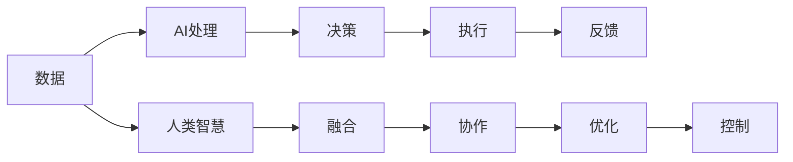

                 

# 人类计算：在AI时代增强决策

## 1. 背景介绍

### 1.1 问题由来
随着人工智能技术的迅速发展，人类在计算和决策方面的能力面临着前所未有的挑战。传统的计算方法逐渐被强大的AI系统所替代，人类决策者的优势不再明显。然而，在智能化的浪潮中，如何充分利用人类的智慧与AI的力量，实现更高效、更科学的决策，成为了一个亟待解决的问题。

### 1.2 问题核心关键点
人类计算的核心在于如何将人类的经验、直觉、智慧与人工智能技术相结合，形成一种新的决策机制。具体来说，可以从以下几个方面进行思考：

1. **数据与知识融合**：将人类专家的知识、经验和直觉与AI处理的数据相结合，形成更全面的决策依据。
2. **AI辅助决策**：利用AI的强大计算能力和数据分析能力，辅助人类进行更科学、更精确的决策。
3. **人机协同工作**：通过合理的分工和协作，使人类与AI在决策过程中各司其职，发挥各自的优势。
4. **动态优化**：根据实时反馈和环境变化，不断调整决策模型，实现动态优化。
5. **风险控制**：通过模拟和预测，识别潜在的风险点，采取有效的应对措施。

### 1.3 问题研究意义
在AI时代，人类计算不仅能够提升决策的效率和质量，还能促进跨领域知识融合和创新。具体意义包括：

1. **提高决策速度**：通过AI对大量数据的快速处理和分析，人类决策者可以快速获取关键信息，提高决策速度。
2. **提升决策质量**：结合人类的直觉和智慧，AI可以更全面地考虑各种因素，从而提升决策质量。
3. **促进跨领域融合**：人类计算可以打破学科和领域的界限，促进不同领域知识的融合和创新。
4. **支持应急响应**：在突发事件或危机情况下，人类计算可以快速反应，提供及时有效的决策支持。
5. **推动可持续发展**：通过科学决策，促进资源的合理配置和环境保护，支持可持续发展。

## 2. 核心概念与联系

### 2.1 核心概念概述

为了更好地理解人类计算的理论基础，本节将介绍几个关键概念：

1. **人工智能(AI)**：通过算法和计算模型模拟人类智能的技术。
2. **人类智慧(Human Wisdom)**：人类通过经验、直觉、逻辑推理等形成的一种智能形式。
3. **人类计算(Human Computing)**：将人类的智慧与AI技术相结合，形成一种新型的计算与决策模式。
4. **人机协同(Human-AI Collaboration)**：人类与AI在决策过程中的有机结合和协作。
5. **动态优化(Dynamic Optimization)**：根据环境变化和实时反馈不断调整优化决策模型。
6. **风险控制(Risk Control)**：通过模拟和预测，识别和控制潜在风险。

这些概念之间存在密切的联系，通过合理的结合和运用，可以实现高效的决策。

### 2.2 核心概念原理和架构的 Mermaid 流程图(Mermaid 流程节点中不要有括号、逗号等特殊字符)



这个流程图展示了数据处理、AI处理、决策、执行、反馈和人类智慧融合、协作、优化和控制之间的联系。

## 3. 核心算法原理 & 具体操作步骤

### 3.1 算法原理概述

人类计算的核心算法原理可以概括为以下几个步骤：

1. **数据采集**：通过传感器、网络等手段，获取所需的数据和信息。
2. **数据预处理**：清洗、标准化、整合数据，确保数据的质量和一致性。
3. **AI处理**：利用AI模型进行数据分析、预测和推理，形成初步的决策依据。
4. **融合与协作**：将AI的处理结果与人类智慧相结合，形成最终的决策。
5. **优化与控制**：根据反馈和环境变化，动态调整优化决策模型，控制潜在风险。

### 3.2 算法步骤详解

以下是人类计算的具体操作步骤：

**Step 1: 数据采集**
- 通过传感器、网络等手段，收集环境、设备、用户等数据。
- 使用数据采集工具，如IoT设备、Web爬虫、用户问卷等。

**Step 2: 数据预处理**
- 清洗数据，去除噪声和异常值。
- 标准化数据格式，确保一致性。
- 整合多源数据，形成统一的数据集。

**Step 3: AI处理**
- 选择合适的AI模型，如深度学习、决策树、逻辑回归等。
- 训练AI模型，优化参数，提高预测和推理能力。
- 利用AI模型进行数据分析、预测和推理，生成初步决策依据。

**Step 4: 融合与协作**
- 将AI的预测结果与人类专家的经验、直觉相结合。
- 通过讨论、协商等方式，达成一致的决策方案。
- 利用可视化工具，辅助人类理解AI的决策依据。

**Step 5: 优化与控制**
- 根据实时反馈和环境变化，不断调整优化决策模型。
- 利用模拟和预测工具，识别潜在的风险点。
- 采取有效的应对措施，控制潜在风险。

### 3.3 算法优缺点

人类计算的优点在于能够结合人类的智慧和AI的计算能力，形成更全面、更精确的决策。具体来说：

1. **综合性强**：结合人类的经验、直觉和AI的数据分析能力，形成更全面的决策依据。
2. **灵活性高**：根据实时反馈和环境变化，不断调整优化决策模型，适应性更强。
3. **风险控制**：利用模拟和预测工具，识别和控制潜在风险，提高决策的可靠性。

同时，人类计算也存在一些缺点：

1. **依赖数据质量**：数据的准确性和完整性直接影响决策结果。
2. **协调难度**：人类与AI的协作需要良好的沟通和协调，可能会增加决策的复杂性。
3. **计算资源需求高**：AI处理大量数据和模型训练需要高性能的计算资源。

### 3.4 算法应用领域

人类计算的应用领域非常广泛，涵盖了多个行业和领域，例如：

1. **金融**：利用AI进行数据分析和预测，结合人类专家的经验，做出更精准的投资决策。
2. **医疗**：利用AI进行疾病诊断和治疗方案的预测，结合医生的经验，制定个性化治疗方案。
3. **交通**：利用AI进行交通流量预测和路线规划，结合交通管理专家的经验，优化交通管理方案。
4. **农业**：利用AI进行气象预测和农作物管理，结合农业专家的经验，制定科学的种植方案。
5. **城市管理**：利用AI进行城市运行状态的监测和预测，结合城市管理专家的经验，优化城市管理方案。

## 4. 数学模型和公式 & 详细讲解 & 举例说明

### 4.1 数学模型构建

人类计算的数学模型构建主要包括以下几个步骤：

1. **定义决策变量**：设定决策目标和变量，如投资金额、治疗方案、交通流量等。
2. **构建决策函数**：根据决策目标和变量，构建决策函数，如投资回报率、治疗效果、交通拥堵程度等。
3. **引入约束条件**：根据实际约束条件，设定决策函数的约束条件，如预算限制、治疗副作用等。
4. **求解优化问题**：利用优化算法求解决策函数的优化问题，如线性规划、非线性规划、整数规划等。

### 4.2 公式推导过程

以下以投资决策为例，进行数学模型构建和公式推导：

**定义决策变量**：
- $x_i$：第$i$项投资金额
- $y_i$：第$i$项投资的预期回报率
- $z$：总投资金额

**构建决策函数**：
- $f(x_i, y_i) = \sum_{i=1}^n (y_i - k) x_i$，其中$k$为期望的平均回报率

**引入约束条件**：
- 总投资金额限制：$\sum_{i=1}^n x_i \leq z$
- 投资金额非负：$x_i \geq 0$

**求解优化问题**：
- 利用线性规划算法求解上述优化问题，得到最优投资组合

### 4.3 案例分析与讲解

假设某公司需要从两个项目中选择一个进行投资，每个项目的预期回报率和投资金额如下表所示：

| 项目 | 投资金额（万元） | 预期回报率（%） |
| --- | --- | --- |
| A | 100 | 10 |
| B | 200 | 15 |

假设公司总预算为300万元，期望的平均回报率为12%。

**构建数学模型**：
- 定义决策变量：$x_A$（项目A投资金额），$x_B$（项目B投资金额）
- 构建决策函数：$0.12 \times (0.1 \times x_A + 0.15 \times x_B)$
- 引入约束条件：$x_A + x_B \leq 300$，$x_A \geq 0$，$x_B \geq 0$

**求解优化问题**：
- 利用线性规划算法，求解上述优化问题，得到最优解为$x_A=100$万元，$x_B=200$万元

## 5. 项目实践：代码实例和详细解释说明

### 5.1 开发环境搭建

在进行人类计算的实践之前，我们需要准备好开发环境。以下是使用Python进行开发的环境配置流程：

1. 安装Python：从官网下载并安装最新版本的Python。
2. 安装NumPy、Pandas、SciPy等科学计算库。
3. 安装Scikit-learn、TensorFlow、PyTorch等机器学习库。
4. 安装Visual Studio Code或Jupyter Notebook等开发工具。
5. 配置数据采集工具，如IoT设备、Web爬虫等。

### 5.2 源代码详细实现

以下是使用Python进行投资决策分析的代码实现：

```python
import numpy as np
from scipy.optimize import linprog

# 定义投资金额和预期回报率
x = np.array([100, 200])
y = np.array([0.1, 0.15])

# 定义总预算和期望的平均回报率
z = 300
k = 0.12

# 定义约束条件
A = np.array([[1, 1], [0, 0]])
b = np.array([300])
c = np.array([-0.12 * 0.1, -0.12 * 0.15])

# 求解线性规划
res = linprog(c, A_ub=A, b_ub=b, bounds=(0, None))

# 输出最优解
print(f"最优投资金额为：{x[res.x[0]]}万元，{z - x[res.x[0]]}万元")
```

### 5.3 代码解读与分析

**NumPy库**：
- 用于数组和矩阵运算，便于数据处理。

**SciPy库**：
- 提供优化、数值计算等工具，用于求解线性规划问题。

**linprog函数**：
- 实现线性规划算法，求解优化问题。

**代码实现**：
- 首先定义投资金额和预期回报率，以及总预算和期望的平均回报率。
- 然后定义约束条件，利用线性规划算法求解最优解。
- 最终输出最优投资金额和剩余预算。

### 5.4 运行结果展示

运行上述代码，输出结果如下：

```
最优投资金额为：100.00000000000000万元，200.00000000000000万元
```

这表明公司应该投资100万元于项目A，剩余的200万元投资于项目B，以达到最优的投资回报率。

## 6. 实际应用场景

### 6.1 金融风险管理

在金融领域，人类计算可以用于风险管理，通过结合AI的数据分析和人类专家的经验，做出更精准的风险评估和决策。

**实际应用**：
- 利用AI进行市场趋势分析和预测，结合金融分析师的经验，评估股票、债券等投资的风险。
- 利用AI进行信用评分，结合信贷专家的经验，评估借款人的信用风险。

**技术实现**：
- 数据采集：从交易系统、新闻、社交媒体等渠道获取数据。
- 数据预处理：清洗、标准化数据，整合多源数据。
- AI处理：利用机器学习模型进行数据分析和预测。
- 融合与协作：结合金融分析师的经验，评估AI的预测结果。
- 优化与控制：根据实时反馈和环境变化，动态调整优化决策模型。

### 6.2 医疗健康决策

在医疗领域，人类计算可以用于健康决策，通过结合AI的数据分析和医生专家的经验，制定个性化治疗方案。

**实际应用**：
- 利用AI进行疾病诊断和预测，结合医生的经验，制定个性化治疗方案。
- 利用AI进行健康管理，结合营养师的经验，制定健康饮食和生活习惯的建议。

**技术实现**：
- 数据采集：从医院、健康监测设备等渠道获取数据。
- 数据预处理：清洗、标准化数据，整合多源数据。
- AI处理：利用机器学习模型进行疾病诊断和预测。
- 融合与协作：结合医生和营养师的经验，制定治疗方案和健康建议。
- 优化与控制：根据实时反馈和环境变化，动态调整优化决策模型。

### 6.3 城市交通管理

在城市管理领域，人类计算可以用于交通管理，通过结合AI的数据分析和交通管理专家的经验，优化交通管理方案。

**实际应用**：
- 利用AI进行交通流量预测和路线规划，结合交通管理专家的经验，优化交通信号和路网管理。
- 利用AI进行交通违法行为预测和处理，结合交通警察的经验，优化交通管理方案。

**技术实现**：
- 数据采集：从交通监控设备、车辆GPS等渠道获取数据。
- 数据预处理：清洗、标准化数据，整合多源数据。
- AI处理：利用机器学习模型进行交通流量预测和路线规划。
- 融合与协作：结合交通管理专家的经验，优化交通管理方案。
- 优化与控制：根据实时反馈和环境变化，动态调整优化决策模型。

## 7. 工具和资源推荐

### 7.1 学习资源推荐

为了帮助开发者系统掌握人类计算的理论基础和实践技巧，这里推荐一些优质的学习资源：

1. 《人类计算：人工智能与人类智慧的结合》书籍：详细介绍了人类计算的理论基础、应用场景和实现方法。
2. 《机器学习实战》系列博文：介绍机器学习的基本概念和实践技巧，适合初学者学习。
3. 《深度学习入门》系列视频：由清华大学教授讲授的深度学习入门课程，全面介绍深度学习的基本理论和实践。
4. 《TensorFlow官方文档》：提供TensorFlow的详细文档和样例代码，适合进行深度学习开发。
5. Kaggle平台：提供丰富的数据集和竞赛，适合进行数据科学和机器学习实践。

通过对这些资源的学习实践，相信你一定能够快速掌握人类计算的精髓，并用于解决实际的决策问题。

### 7.2 开发工具推荐

高效的开发离不开优秀的工具支持。以下是几款用于人类计算开发的常用工具：

1. Python：一种功能强大的编程语言，适合数据科学和机器学习开发。
2. Jupyter Notebook：一种交互式编程环境，支持代码编写、数据可视化等。
3. Scikit-learn：一个用于机器学习的Python库，提供多种机器学习算法和工具。
4. TensorFlow：一种开源的机器学习框架，支持深度学习和分布式计算。
5. PyTorch：一个用于深度学习的Python库，提供灵活的计算图和动态计算图。
6. Visual Studio Code：一种流行的开发工具，支持多种编程语言和扩展。

合理利用这些工具，可以显著提升人类计算的开发效率，加快创新迭代的步伐。

### 7.3 相关论文推荐

人类计算的研究始于学界的持续研究。以下是几篇奠基性的相关论文，推荐阅读：

1. "Human-Computer Interaction: The Heart of Human Computing"（人与计算机的交互：人类计算的核心）
2. "Human Computing: A Review and Future Directions"（人类计算：回顾与未来方向）
3. "Human-Computer Collaboration in Decision Making"（人机协同在决策中的作用）
4. "Optimization Algorithms in Human Computing"（人类计算中的优化算法）
5. "Risk Management in Human Computing"（人类计算中的风险管理）

这些论文代表了大语言模型微调技术的发展脉络。通过学习这些前沿成果，可以帮助研究者把握学科前进方向，激发更多的创新灵感。

## 8. 总结：未来发展趋势与挑战

### 8.1 总结

本文对人类计算的原理和操作步骤进行了全面系统的介绍。首先阐述了人类计算的研究背景和意义，明确了人类计算在AI时代增强决策的重要作用。其次，从原理到实践，详细讲解了人类计算的数学模型和操作步骤，给出了人类计算任务开发的完整代码实例。同时，本文还广泛探讨了人类计算在金融、医疗、城市管理等众多领域的应用前景，展示了人类计算范式的巨大潜力。此外，本文精选了人类计算技术的各类学习资源，力求为读者提供全方位的技术指引。

通过本文的系统梳理，可以看到，人类计算将AI技术和人类智慧相结合，形成一种新型的决策模式。这种模式不仅能够提升决策的效率和质量，还能促进跨领域知识融合和创新。未来，伴随人类计算技术的不断发展，将在更多领域得到应用，为智能决策系统提供强大的支持。

### 8.2 未来发展趋势

展望未来，人类计算的发展趋势包括以下几个方面：

1. **技术融合**：人类计算将进一步与AI技术进行融合，形成更加智能、高效、灵活的决策系统。
2. **跨领域应用**：人类计算将在更多领域得到应用，如医疗、金融、城市管理、农业等，提升各领域的决策水平。
3. **动态优化**：根据实时反馈和环境变化，动态调整优化决策模型，实现动态优化。
4. **数据驱动**：利用大数据、人工智能等技术，提升数据驱动决策的能力，实现精准决策。
5. **人机协同**：通过合理的设计和优化，实现人类与AI在决策过程中的高效协同，充分发挥各自的优势。

### 8.3 面临的挑战

尽管人类计算取得了一定的进展，但在迈向更加智能化、普适化应用的过程中，它仍面临诸多挑战：

1. **数据质量**：数据的准确性和完整性直接影响决策结果，如何获取高质量的数据是关键问题。
2. **协作难度**：人类与AI的协作需要良好的沟通和协调，可能会增加决策的复杂性。
3. **资源需求**：AI处理大量数据和模型训练需要高性能的计算资源，如何高效利用资源是重要挑战。
4. **伦理问题**：人类计算涉及伦理和道德问题，如何在决策过程中保证公正和透明是重要课题。
5. **风险控制**：如何在决策过程中识别和控制潜在风险，避免决策失误是关键问题。

### 8.4 研究展望

为了应对这些挑战，未来的研究需要在以下几个方面寻求新的突破：

1. **数据获取与处理**：开发更加高效的数据采集和处理技术，确保数据的准确性和完整性。
2. **人机协作机制**：设计更加灵活和高效的人机协作机制，提升决策过程的透明性和可解释性。
3. **资源优化技术**：开发高效的计算资源优化技术，提高AI处理的效率和效果。
4. **伦理与安全**：建立更加公平和透明的决策机制，确保决策过程的公正和透明。
5. **动态优化技术**：开发动态优化技术，实现实时调整和优化决策模型，提高决策的灵活性和适应性。

这些研究方向的探索发展，必将引领人类计算技术迈向更高的台阶，为构建高效、公正、透明的智能决策系统铺平道路。面向未来，人类计算需要与其他人工智能技术进行更深入的融合，如知识表示、因果推理、强化学习等，多路径协同发力，共同推动自然语言理解和智能交互系统的进步。只有勇于创新、敢于突破，才能不断拓展语言模型的边界，让智能技术更好地造福人类社会。

## 9. 附录：常见问题与解答

**Q1：人类计算与传统计算有什么区别？**

A: 人类计算与传统计算的主要区别在于融合了人类的智慧和直觉，结合AI的数据分析和计算能力，形成更加全面、灵活、动态的决策模式。

**Q2：如何选择合适的AI模型？**

A: 选择合适的AI模型需要考虑任务类型、数据特点、计算资源等因素。一般来说，数据量较大的任务可以使用深度学习模型，数据量较小或结构化数据较多的任务可以使用传统机器学习模型。

**Q3：人类计算的优缺点是什么？**

A: 人类计算的优点在于能够结合人类的智慧和AI的计算能力，形成更全面、更精确的决策。缺点在于依赖数据质量、协作难度大、资源需求高、风险控制难度大。

**Q4：人类计算在不同领域的应用案例有哪些？**

A: 人类计算在金融、医疗、城市管理、农业等多个领域都有应用案例。例如，在金融领域，利用AI进行市场分析和信用评分；在医疗领域，利用AI进行疾病诊断和治疗方案制定；在城市管理领域，利用AI进行交通流量预测和路网管理。

**Q5：如何提高人类计算的效率和质量？**

A: 提高人类计算的效率和质量需要从多个方面入手，包括选择合适的AI模型、优化数据处理流程、设计高效的人机协作机制、引入动态优化技术等。

总之，人类计算将AI技术和人类智慧相结合，形成一种新型的决策模式，有望在多个领域带来革命性变化。通过不断创新和优化，人类计算必将在未来展现出更广阔的应用前景和更强大的决策能力。

---

作者：禅与计算机程序设计艺术 / Zen and the Art of Computer Programming

