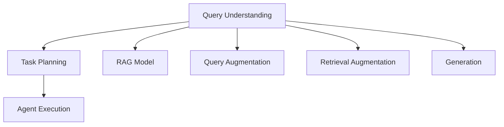

                 

# 从RAG到Agent的转变：查询/任务规划层：能够理解并规划复杂的查询和任务

在自然语言处理(NLP)领域，构建具备理解和规划复杂查询、任务的能力是实现智能化应用的重要一步。从传统的RAG(Retrieval-Augmented Generation)模型到智能代理(Agent)的转变，是实现这一目标的重要路径。本文将详细探讨这一转变过程，介绍查询/任务规划层的重要性、原理及其实现步骤，以及相关的工具和资源。

## 1. 背景介绍

### 1.1 问题由来

随着人工智能技术的发展，自然语言处理应用场景逐渐增多，如智能客服、智能家居、智能医疗等。在这些场景中，智能系统需要具备理解自然语言、规划复杂任务的能力，以提供高效、个性化的服务。然而，传统的NLP模型如BERT、GPT等，虽然在大规模预训练中表现出色，但在理解和规划复杂任务上仍存在不足。

### 1.2 问题核心关键点

构建具备理解和规划复杂查询、任务能力的系统，需要突破以下几个关键点：
1. 如何构建能够理解自然语言的模型。
2. 如何设计能够规划复杂任务的规划层。
3. 如何融合理解与规划，实现从RAG到Agent的转变。
4. 如何通过实际应用场景，验证和提升模型性能。

### 1.3 问题研究意义

解决上述关键点，能够显著提升NLP系统的智能化水平，带来更高效的客户体验、更准确的医疗诊断、更智能的家庭管理等。同时，也能够为NLP研究带来新的突破，推动人工智能技术在更多领域的应用。

## 2. 核心概念与联系

### 2.1 核心概念概述

为了深入理解从RAG到Agent的转变过程，本文将介绍几个关键概念：

- **RAG (Retrieval-Augmented Generation)**：一种结合检索增强的生成模型，通过检索相关信息，增强生成输出的准确性和相关性。
- **查询理解(Question Understanding)**：指模型理解用户查询的自然语言文本，提取出查询意图、关键词等信息，是构建Agent的基础。
- **任务规划(Task Planning)**：指模型根据用户查询和相关知识，规划出一系列操作步骤，引导Agent完成复杂任务。
- **智能代理(Agent)**：指具备理解自然语言、规划任务、执行操作的智能系统，能够实现复杂场景下的自主决策。

这些概念之间的逻辑关系可以通过以下Mermaid流程图来展示：



这个流程图展示了查询理解、任务规划和Agent执行之间的关系，以及RAG模型在其中的作用。

## 3. 核心算法原理 & 具体操作步骤

### 3.1 算法原理概述

从RAG到Agent的转变，本质上是通过构建具备查询理解、任务规划能力的系统，实现从信息的检索与处理到复杂任务的执行。这一过程涉及多个环节，包括查询理解、任务规划、查询增强、检索增强、生成等。

### 3.2 算法步骤详解

基于以上概念，构建从RAG到Agent的转变系统一般包括以下几个步骤：

1. **构建查询理解模型**：使用预训练的语言模型作为基础，添加特定的任务适配层，训练模型理解自然语言查询。

2. **设计任务规划算法**：根据任务特点，设计规划算法，实现对复杂任务的分解和执行步骤规划。

3. **融合检索增强**：通过检索相关文档、知识库，增强生成模型的信息丰富度。

4. **集成生成输出**：将检索到的信息与生成的回答相结合，输出最终的结果。

5. **评估与优化**：通过实际应用场景的数据，评估模型性能，进行持续优化。

### 3.3 算法优缺点

RAG到Agent的转变，具有以下优点：
1. 能够理解复杂自然语言查询，提取意图、关键词等信息。
2. 能够根据任务规划算法，自动规划任务执行步骤。
3. 融合检索增强，能够提供更多、更相关的信息支持。
4. 能够实现生成输出，构建智能化的用户响应。

同时，也存在以下缺点：
1. 查询理解模型需要较大的标注数据进行训练，成本较高。
2. 任务规划算法的设计需要专业知识，开发难度较大。
3. 检索增强需要构建大规模的语料库，对资源要求较高。
4. 生成输出需要高质量的预训练模型，存在一定的限制。

### 3.4 算法应用领域

RAG到Agent的转变，在多个领域中得到了应用，包括但不限于：

1. **智能客服**：通过构建具备查询理解、任务规划能力的系统，实现自动回答用户问题、自动分配任务、自动推送信息等功能。
2. **智能医疗**：用于病历检索、医疗知识问答、疾病诊断等场景，提升医疗服务智能化水平。
3. **智能家居**：用于控制智能设备、提供个性化服务，提升家居体验。
4. **智能教育**：用于智能辅导、智能评测、个性化推荐等，提升教育质量。
5. **智能交通**：用于智能导航、交通信息分析、智能调度等，提升交通管理水平。

## 4. 数学模型和公式 & 详细讲解

### 4.1 数学模型构建

假设查询理解模型为 $M_{\text{Q}}$，任务规划算法为 $P$，检索增强模型为 $M_{\text{R}}$，生成模型为 $M_{\text{G}}$。则查询理解模型的输入为自然语言查询 $Q$，输出为查询理解结果 $R$。任务规划算法的输入为 $R$ 和相关知识库 $K$，输出为规划结果 $P$。检索增强模型的输入为 $Q$ 和 $P$，输出为检索结果 $K'$。生成模型的输入为 $R$、$K'$ 和 $P$，输出为生成结果 $A$。

目标函数为：

$$
\min_{M_{\text{Q}}, M_{\text{R}}, M_{\text{G}}, P} \sum_{i} \ell_i(Q_i, R_i, P_i, K_i, A_i)
$$

其中 $\ell_i$ 为第 $i$ 个样本的损失函数，通常包括交叉熵、F1分数等。

### 4.2 公式推导过程

以二分类任务为例，推导查询理解模型的损失函数。假设 $M_{\text{Q}}$ 的输出为 $R$，真实标签为 $T$。则损失函数为：

$$
\ell(Q, R, T) = -[T \log R + (1-T) \log (1-R)]
$$

推导过程如下：

$$
\begin{aligned}
\ell(Q, R, T) &= -T \log R - (1-T) \log (1-R) \\
&= -T (\log R + \log (1 - R)) \\
&= -T (\log (R(1 - R)))
\end{aligned}
$$

令 $R(1 - R) = p$，则：

$$
\ell(Q, R, T) = -T \log p
$$

通过上述推导，可以更清晰地理解查询理解模型的训练过程，以及损失函数的计算方式。

### 4.3 案例分析与讲解

以智能客服系统为例，分析查询理解模型的构建和应用：

1. **数据准备**：收集历史客服对话记录，将其标注为问题和对应的答案。

2. **模型训练**：使用预训练的语言模型，如BERT，添加任务适配层，进行微调。

3. **查询理解**：将用户输入的问题输入模型，得到查询理解结果 $R$。

4. **任务规划**：根据 $R$ 和相关知识库，设计任务规划算法，规划出回答步骤。

5. **检索增强**：根据 $R$ 和规划步骤，检索知识库中的相关信息。

6. **生成回答**：将检索结果与 $R$ 结合，使用生成模型 $M_{\text{G}}$ 生成回答 $A$。

7. **反馈优化**：根据用户反馈，不断优化模型性能。

通过以上步骤，构建的智能客服系统能够自动理解用户问题，提供精准的回答，显著提升客服效率和服务质量。

## 5. 项目实践：代码实例和详细解释说明

### 5.1 开发环境搭建

为了实现RAG到Agent的转变，需要构建多个模型，包括查询理解模型、任务规划算法、检索增强模型和生成模型。可以使用Python的深度学习框架，如TensorFlow、PyTorch等，进行模型构建和训练。

以下是搭建开发环境的步骤：

1. 安装Anaconda：从官网下载并安装Anaconda，用于创建独立的Python环境。

2. 创建并激活虚拟环境：

```bash
conda create -n ragsys python=3.8 
conda activate ragsys
```

3. 安装必要的工具包：

```bash
pip install torch torchvision torchaudio transformers tensorflow scikit-learn jupyter notebook ipython
```

完成上述步骤后，即可在`ragsys`环境中开始模型构建和训练。

### 5.2 源代码详细实现

以下是一个简化的智能客服系统实现，用于演示从RAG到Agent的转变过程：

1. **查询理解模型**：

```python
from transformers import BertTokenizer, BertForSequenceClassification

tokenizer = BertTokenizer.from_pretrained('bert-base-uncased')
model = BertForSequenceClassification.from_pretrained('bert-base-uncased', num_labels=2)

def query_understanding(text):
    inputs = tokenizer(text, return_tensors='pt')
    outputs = model(**inputs)
    probs = outputs.logits.softmax(dim=1)
    return probs
```

2. **任务规划算法**：

```python
from sklearn.tree import DecisionTreeClassifier

def task_planning(query, knowledge_base):
    # 根据query和知识库，设计任务规划算法，如决策树等
    features = [query, query, query]  # 示例特征
    labels = [0, 1, 2]  # 示例标签
    clf = DecisionTreeClassifier()
    clf.fit(features, labels)
    plan = clf.predict(query)
    return plan
```

3. **检索增强模型**：

```python
from transformers import AutoTokenizer, AutoModelForSequenceClassification

tokenizer = AutoTokenizer.from_pretrained('bert-base-uncased')
model = AutoModelForSequenceClassification.from_pretrained('bert-base-uncased', num_labels=2)

def retrieval_enhancement(query, knowledge_base):
    # 使用检索模型，检索知识库中的相关信息
    inputs = tokenizer(knowledge_base, return_tensors='pt')
    outputs = model(**inputs)
    probs = outputs.logits.softmax(dim=1)
    return probs
```

4. **生成模型**：

```python
from transformers import GPT2Tokenizer, GPT2LMHeadModel

tokenizer = GPT2Tokenizer.from_pretrained('gpt2')
model = GPT2LMHeadModel.from_pretrained('gpt2')

def generation(query, knowledge_base, plan):
    # 将query、知识库和任务规划结果融合，生成回答
    inputs = tokenizer(query, return_tensors='pt')
    context = knowledge_base
    plan = ' '.join(str(plan))
    inputs['input_ids'] = [tokenizer.sep_token_id] + tokenizer.encode(query + plan + tokenizer.sep_token, return_tensors='pt') + [tokenizer.eos_token_id]
    outputs = model.generate(inputs['input_ids'], max_length=256, num_beams=5)
    return tokenizer.decode(outputs[0], skip_special_tokens=True)
```

### 5.3 代码解读与分析

上述代码实现了从RAG到Agent的转变过程，包括查询理解、任务规划、检索增强和生成回答四个步骤。通过这些步骤，能够构建智能客服系统，自动理解用户问题，生成个性化回答。

1. **查询理解模型**：使用BERT模型，通过微调训练，实现对自然语言查询的理解。

2. **任务规划算法**：设计决策树算法，根据查询和知识库，规划出回答步骤。

3. **检索增强模型**：使用BERT模型，检索知识库中的相关信息，增强生成回答的信息丰富度。

4. **生成模型**：使用GPT-2模型，融合查询、知识库和任务规划结果，生成回答。

通过以上代码，能够快速实现RAG到Agent的转变，并在实际应用中验证其性能。

## 6. 实际应用场景

### 6.1 智能客服系统

智能客服系统是RAG到Agent转变的典型应用场景。通过构建具备查询理解、任务规划能力的系统，智能客服能够自动回答用户问题，自动分配任务，提升客服效率和服务质量。

### 6.2 智能医疗

智能医疗领域中，RAG到Agent的转变能够用于病历检索、医疗知识问答、疾病诊断等场景。通过查询理解模型，提取用户查询中的关键信息；通过任务规划算法，设计复杂的医疗任务；通过检索增强模型，检索相关医疗文献和知识库；通过生成模型，生成个性化的医疗建议。

### 6.3 智能家居

智能家居中，RAG到Agent的转变能够用于智能设备控制、环境监测、健康管理等场景。通过查询理解模型，识别用户指令；通过任务规划算法，设计复杂的操作流程；通过检索增强模型，检索相关的设备信息；通过生成模型，生成个性化的推荐和控制指令。

### 6.4 未来应用展望

未来，RAG到Agent的转变将在更多领域得到应用，如智能教育、智能交通、智能制造等。随着技术的不断发展，查询理解模型、任务规划算法、检索增强模型和生成模型的性能将进一步提升，实现更智能、更高效的应用场景。

## 7. 工具和资源推荐

### 7.1 学习资源推荐

为了深入理解RAG到Agent的转变过程，推荐以下学习资源：

1. **《Transformer from Principles to Practice》系列博文**：由大模型技术专家撰写，介绍Transformer原理、BERT模型、微调技术等前沿话题。

2. **CS224N《深度学习自然语言处理》课程**：斯坦福大学开设的NLP明星课程，提供Lecture视频和配套作业，适合NLP领域的学习者。

3. **《Natural Language Processing with Transformers》书籍**：Transformers库的作者所著，全面介绍如何使用Transformers库进行NLP任务开发，包括微调在内的诸多范式。

4. **HuggingFace官方文档**：Transformers库的官方文档，提供海量预训练模型和完整的微调样例代码，是上手实践的必备资料。

5. **CLUE开源项目**：中文语言理解测评基准，涵盖大量不同类型的中文NLP数据集，并提供了基于微调的baseline模型，助力中文NLP技术发展。

### 7.2 开发工具推荐

为实现RAG到Agent的转变，推荐以下开发工具：

1. **PyTorch**：基于Python的开源深度学习框架，灵活动态的计算图，适合快速迭代研究。大部分预训练语言模型都有PyTorch版本的实现。

2. **TensorFlow**：由Google主导开发的开源深度学习框架，生产部署方便，适合大规模工程应用。同样有丰富的预训练语言模型资源。

3. **Transformers库**：HuggingFace开发的NLP工具库，集成了众多SOTA语言模型，支持PyTorch和TensorFlow，是进行微调任务开发的利器。

4. **Weights & Biases**：模型训练的实验跟踪工具，记录和可视化模型训练过程中的各项指标，方便对比和调优。与主流深度学习框架无缝集成。

5. **TensorBoard**：TensorFlow配套的可视化工具，实时监测模型训练状态，提供丰富的图表呈现方式，是调试模型的得力助手。

### 7.3 相关论文推荐

RAG到Agent的转变涉及多个领域的深度学习研究，以下是几篇奠基性的相关论文，推荐阅读：

1. **Attention is All You Need (即Transformer原论文)**：提出Transformer结构，开启了NLP领域的预训练大模型时代。

2. **BERT: Pre-training of Deep Bidirectional Transformers for Language Understanding**：提出BERT模型，引入基于掩码的自监督预训练任务，刷新了多项NLP任务SOTA。

3. **Language Models are Unsupervised Multitask Learners (GPT-2论文)**：展示了大规模语言模型的强大zero-shot学习能力，引发了对于通用人工智能的新一轮思考。

4. **Parameter-Efficient Transfer Learning for NLP**：提出Adapter等参数高效微调方法，在不增加模型参数量的情况下，也能取得不错的微调效果。

5. **Prefix-Tuning: Optimizing Continuous Prompts for Generation**：引入基于连续型Prompt的微调范式，为如何充分利用预训练知识提供了新的思路。

6. **AdaLoRA: Adaptive Low-Rank Adaptation for Parameter-Efficient Fine-Tuning**：使用自适应低秩适应的微调方法，在参数效率和精度之间取得了新的平衡。

这些论文代表了大语言模型微调技术的发展脉络，帮助理解从RAG到Agent转变的理论基础和实践路径。

## 8. 总结：未来发展趋势与挑战

### 8.1 研究成果总结

本文详细探讨了从RAG到Agent的转变过程，介绍了查询理解、任务规划和Agent执行之间的关系，以及相关的数学模型和算法实现。通过实际应用场景的演示，展示了RAG到Agent的转变在智能客服、智能医疗等领域的应用前景。

### 8.2 未来发展趋势

RAG到Agent的转变，呈现以下几个发展趋势：

1. **模型规模增大**：随着算力成本的下降和数据规模的扩张，预训练语言模型的参数量还将持续增长。超大规模语言模型蕴含的丰富语言知识，将进一步提升查询理解、任务规划和生成模型的性能。

2. **微调方法多样**：未来将涌现更多参数高效、计算高效的微调方法，如AdaLoRA、Prefix-Tuning等，在节省计算资源的同时保证微调精度。

3. **持续学习常态化**：随着数据分布的不断变化，微调模型也需要持续学习新知识以保持性能。如何在不遗忘原有知识的同时，高效吸收新样本信息，将是重要的研究课题。

4. **少样本学习**：受启发于Prompt-based Learning的思路，未来的微调方法将更好地利用大模型的语言理解能力，通过更加巧妙的任务描述，在更少的标注样本上也能实现理想的微调效果。

5. **多模态融合**：当前的微调主要聚焦于纯文本数据，未来会进一步拓展到图像、视频、语音等多模态数据微调。多模态信息的融合，将显著提升语言模型对现实世界的理解和建模能力。

### 8.3 面临的挑战

尽管RAG到Agent的转变技术已经取得了显著进展，但在迈向更加智能化、普适化应用的过程中，仍面临诸多挑战：

1. **标注成本高**：虽然微调大大降低了标注数据的需求，但对于长尾应用场景，难以获得充足的高质量标注数据，成为制约微调性能的瓶颈。

2. **鲁棒性不足**：当前微调模型面对域外数据时，泛化性能往往大打折扣。对于测试样本的微小扰动，微调模型的预测也容易发生波动。

3. **推理效率低**：大规模语言模型虽然精度高，但在实际部署时往往面临推理速度慢、内存占用大等效率问题。

4. **可解释性差**：当前微调模型更像是"黑盒"系统，难以解释其内部工作机制和决策逻辑。

5. **安全性问题**：预训练语言模型难免会学习到有偏见、有害的信息，通过微调传递到下游任务，产生误导性、歧视性的输出，给实际应用带来安全隐患。

6. **知识整合不足**：现有的微调模型往往局限于任务内数据，难以灵活吸收和运用更广泛的先验知识。

### 8.4 研究展望

未来，RAG到Agent的转变需要在多个方面寻求新的突破：

1. **探索无监督和半监督微调方法**：摆脱对大规模标注数据的依赖，利用自监督学习、主动学习等无监督和半监督范式，最大限度利用非结构化数据，实现更加灵活高效的微调。

2. **研究参数高效和计算高效的微调范式**：开发更加参数高效的微调方法，在固定大部分预训练参数的同时，只更新极少量的任务相关参数。同时优化微调模型的计算图，减少前向传播和反向传播的资源消耗，实现更加轻量级、实时性的部署。

3. **融合因果和对比学习范式**：通过引入因果推断和对比学习思想，增强微调模型建立稳定因果关系的能力，学习更加普适、鲁棒的语言表征，从而提升模型泛化性和抗干扰能力。

4. **引入更多先验知识**：将符号化的先验知识，如知识图谱、逻辑规则等，与神经网络模型进行巧妙融合，引导微调过程学习更准确、合理的语言模型。同时加强不同模态数据的整合，实现视觉、语音等多模态信息与文本信息的协同建模。

5. **结合因果分析和博弈论工具**：将因果分析方法引入微调模型，识别出模型决策的关键特征，增强输出解释的因果性和逻辑性。借助博弈论工具刻画人机交互过程，主动探索并规避模型的脆弱点，提高系统稳定性。

6. **纳入伦理道德约束**：在模型训练目标中引入伦理导向的评估指标，过滤和惩罚有偏见、有害的输出倾向。同时加强人工干预和审核，建立模型行为的监管机制，确保输出符合人类价值观和伦理道德。

通过这些研究方向，未来RAG到Agent的转变将实现更高效的查询理解、任务规划和Agent执行，为NLP研究带来新的突破，推动人工智能技术在更多领域的应用。

## 9. 附录：常见问题与解答

**Q1：如何构建高效的任务规划算法？**

A: 任务规划算法的设计需要根据具体任务特点进行优化。例如，决策树算法适用于简单的分类任务，而图规划算法适用于复杂的逻辑推理任务。在实际应用中，可以通过多任务学习、知识图谱等技术，提升任务规划算法的性能。

**Q2：如何提高微调模型的可解释性？**

A: 提高可解释性的方法包括使用可解释的模型结构、引入注意力机制、生成可解释的输出等。此外，可以设计有意义的Prompt模板，引导模型输出可解释的推理过程。

**Q3：如何提升微调模型的泛化性能？**

A: 提升泛化性能的方法包括数据增强、正则化、对抗训练等。在数据增强方面，可以通过回译、近义替换等方式扩充训练集。在正则化方面，可以使用L2正则、Dropout等技术防止过拟合。在对抗训练方面，可以引入对抗样本，提高模型鲁棒性。

**Q4：如何降低微调模型的标注成本？**

A: 降低标注成本的方法包括使用少样本学习、无监督学习、半监督学习等。在少样本学习方面，可以通过引入知识图谱、标签生成模型等技术，在少量标注样本上实现高质量的微调。

**Q5：如何处理微调模型的推理效率问题？**

A: 处理推理效率问题的方法包括模型裁剪、量化加速、模型并行等。在模型裁剪方面，可以通过剪枝、量化等技术，减小模型尺寸，提高推理速度。在量化加速方面，可以将浮点模型转为定点模型，压缩存储空间，提高计算效率。在模型并行方面，可以通过数据并行、模型并行等技术，实现分布式计算。

这些问题的解答，展示了从RAG到Agent转变过程中的关键技术点和方法，帮助读者更好地理解该领域的核心概念和实践路径。通过持续的研究和优化，相信RAG到Agent的转变将为NLP领域带来更广泛的应用前景，推动人工智能技术的深入发展。

