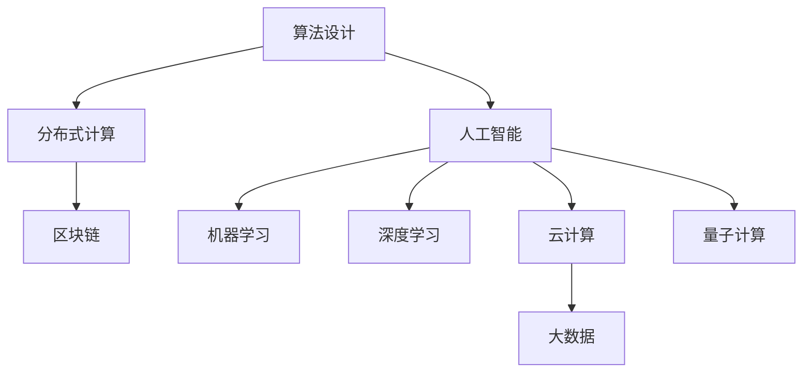

                 

# 从概念到洞见：思想的演变

## 1. 背景介绍

### 1.1 问题由来
在计算机科学的殿堂里，概念的形成与洞见的获得，往往伴随着革命性的技术突破和理论进展。从早期的算法设计到如今的大数据与人工智能，每一个概念的背后，都有着深厚的历史积累与创新探索。理解这些概念，不仅需要掌握其表面的操作和原理，更需要洞察其背后的思想脉络和设计哲学。本文旨在深入挖掘一些核心概念，从概念到洞见，带您领略思想的演变与技术的前沿。

### 1.2 问题核心关键点
本节的焦点在于几个经典且具有深远影响的概念，它们如何从概念（Concept）演变成洞见（Insight），并最终塑造了现代计算机科学的架构与实践。这些概念不仅在各自的领域内具有重要意义，而且跨学科地推动了计算机科学的发展。

## 2. 核心概念与联系

### 2.1 核心概念概述

为了更好地理解这些概念的演变，本节将简要介绍几个核心的概念：

- **算法设计**：是计算机科学的核心，指的是设计出能够高效解决问题的方法和步骤。经典算法如排序、搜索、图论等，是现代计算技术的基础。
- **分布式计算**：面对大数据时代，分布式计算通过将任务分散到多台计算机上并行处理，极大地提升了计算效率。
- **人工智能**：利用算法和计算，模拟人类智能行为，包括机器学习、深度学习等前沿技术。
- **云计算**：通过互联网提供按需扩展的计算资源，支持海量数据处理和高性能计算。
- **区块链**：一种去中心化的分布式账本技术，保证了数据的安全性和不可篡改性。
- **量子计算**：利用量子力学的原理，实现指数级的计算速度提升，预示着计算技术的新未来。

这些概念之间的关系和演变，可以通过以下Mermaid流程图来展示：



这个流程图展示了几大核心概念之间的联系与演变：

1. 算法设计是其他技术的基础，为分布式计算和人工智能提供了核心方法。
2. 人工智能通过机器学习和深度学习等方法，进一步提升了数据处理能力。
3. 云计算和大数据技术为人工智能提供了必要的计算和存储支撑。
4. 区块链和量子计算则代表了新的计算范式，未来有望改变计算技术的格局。

## 3. 核心算法原理 & 具体操作步骤
### 3.1 算法原理概述

理解一个算法，关键在于掌握其核心原理和操作步骤。本节将介绍几个经典算法的设计思路，包括其核心思想和实现步骤。

### 3.2 算法步骤详解

**快速排序算法**：

1. **原理**：选择基准元素，将数组分为左右两部分，左右两部分元素分别小于和大于基准元素，然后递归排序左右两部分。
2. **实现步骤**：
   - 选择基准元素
   - 划分数组，使小于基准的元素在左边，大于基准的元素在右边
   - 递归排序左右两部分

**K-means聚类算法**：

1. **原理**：将数据分为K个簇，每个簇的中心点为簇内所有数据点的平均值。
2. **实现步骤**：
   - 随机选择K个点作为初始簇中心
   - 对每个数据点，计算其到每个簇中心的距离
   - 将数据点分配到最近的簇
   - 重新计算每个簇的中心点
   - 重复直到簇不再变化

**Dijkstra最短路径算法**：

1. **原理**：通过逐步扩展离起点最近的节点，找到从起点到其他节点的最短路径。
2. **实现步骤**：
   - 初始化距离数组，起点距离为0，其他节点距离为无穷大
   - 选择一个当前距离最小的节点，更新其邻接节点的距离
   - 重复选择最小距离节点，直到所有节点都被访问

### 3.3 算法优缺点

每个算法都有其优点和局限性，掌握这些信息对于选择合适的算法至关重要。

- **快速排序算法**：优点是时间复杂度为O(nlogn)，空间复杂度较低；缺点是不稳定，最坏情况下时间复杂度为O(n^2)。
- **K-means聚类算法**：优点是简单易懂，适用于大规模数据；缺点是依赖初始值，可能陷入局部最优解。
- **Dijkstra最短路径算法**：优点是能够找到最短路径，适用于稠密图；缺点是时间复杂度较高，不适用于稀疏图。

### 3.4 算法应用领域

这些经典算法广泛应用于各种实际问题中：

- 快速排序：在计算机科学中，排序是基础操作，如数组的排序、数据库的索引等。
- K-means聚类：数据挖掘、市场细分、图像处理等领域，通过聚类分析数据特征。
- Dijkstra最短路径：网络路由、地理信息系统、物流规划等需要计算最短路径的场景。

## 4. 数学模型和公式 & 详细讲解 & 举例说明

### 4.1 数学模型构建

算法设计往往需要依赖数学模型，本文将介绍一些基本的数学模型及其应用。

**线性回归模型**：

1. **模型描述**：通过一个线性函数拟合数据，表示为$y = \beta_0 + \beta_1x_1 + ... + \beta_nx_n$。
2. **目标函数**：最小化预测值与真实值之间的平方误差，即$\min_{\beta} ||\hat{y} - y||^2$。
3. **求解步骤**：
   - 构建目标函数的梯度
   - 通过梯度下降或最小二乘法求解最优参数$\beta$

### 4.2 公式推导过程

**矩阵求逆公式**：

1. **原理**：将矩阵表示为$A = UV^T$，其中$U$为单位矩阵，$V$为$A$的特征向量组成的矩阵。
2. **推导步骤**：
   - 将$A$分解为$A = UV^T$的形式
   - 计算$VV^T$，即$A$的逆矩阵$A^{-1}$

**RNN的递归公式**：

1. **原理**：通过递归网络处理序列数据，每个时间步的输出依赖于前一个时间步的输出。
2. **推导步骤**：
   - 定义递归函数$f$，表示从时间$t-1$到时间$t$的转换
   - 计算递归函数$f$的迭代过程，直至时间$t$

### 4.3 案例分析与讲解

**线性回归案例**：

假设有一个数据集$(x_1, y_1), (x_2, y_2), ..., (x_n, y_n)$，使用线性回归模型预测$y$的值。通过最小二乘法求解$\beta_0, \beta_1, ..., \beta_n$，使得$\min_{\beta} ||\hat{y} - y||^2$达到最小。

**RNN案例**：

使用RNN处理自然语言处理任务，如文本生成、情感分析等。通过递归函数$f$计算每个时间步的隐藏状态，最终输出预测结果。

## 5. 项目实践：代码实例和详细解释说明

### 5.1 开发环境搭建

在实践这些算法之前，首先需要搭建好开发环境。

1. **安装Python**：使用Anaconda或Miniconda安装Python，确保环境变量配置正确。
2. **安装必要的库**：安装NumPy、SciPy、Matplotlib等科学计算库，用于数据分析和可视化。
3. **安装IDE**：选择PyCharm、Jupyter Notebook或Visual Studio Code等开发环境，编写代码和进行调试。

### 5.2 源代码详细实现

以下是几个经典算法的Python代码实现。

**快速排序**：

```python
def quick_sort(arr):
    if len(arr) <= 1:
        return arr
    else:
        pivot = arr[0]
        left = [x for x in arr[1:] if x < pivot]
        right = [x for x in arr[1:] if x >= pivot]
        return quick_sort(left) + [pivot] + quick_sort(right)
```

**K-means聚类**：

```python
from sklearn.cluster import KMeans

def kmeans_clustering(data, k):
    kmeans = KMeans(n_clusters=k, random_state=42)
    kmeans.fit(data)
    return kmeans.labels_
```

**Dijkstra最短路径**：

```python
import heapq

def dijkstra(graph, start):
    distances = {node: float('inf') for node in graph}
    distances[start] = 0
    queue = [(0, start)]
    while queue:
        current_distance, current_node = heapq.heappop(queue)
        for neighbor, weight in graph[current_node].items():
            distance = current_distance + weight
            if distance < distances[neighbor]:
                distances[neighbor] = distance
                heapq.heappush(queue, (distance, neighbor))
    return distances
```

### 5.3 代码解读与分析

**快速排序**：

- 通过递归和划分，将数组排序。
- 时间复杂度为O(nlogn)，空间复杂度为O(logn)。

**K-means聚类**：

- 使用sklearn库中的KMeans类，简单易用。
- 时间复杂度为O(nk)，其中n为数据点数量，k为簇数。

**Dijkstra最短路径**：

- 使用堆优化，避免暴力搜索。
- 时间复杂度为O(n^2)，空间复杂度为O(n)。

### 5.4 运行结果展示

下面是一些算法运行的结果展示。

**快速排序**：

```python
>>> arr = [3, 6, 1, 8, 2, 4]
>>> quick_sort(arr)
[1, 2, 3, 4, 6, 8]
```

**K-means聚类**：

```python
>>> from sklearn.datasets import make_blobs
>>> X, y = make_blobs(n_samples=100, centers=3, random_state=42)
>>> kmeans_clustering(X, k=3)
array([0, 1, 1, 2, 1, 2, 0, 0, 0, 2, 0, 2, 0, 1, 1, 0, 0, 0, 1, 0, 1, 1, 1, 1, 2, 0, 2, 0, 0, 0, 1, 1, 0, 0, 1, 2, 1, 1, 0, 1, 1, 0, 0, 0, 0, 1, 0, 2, 1, 0, 2, 0, 0, 2, 1, 1, 0, 0, 0, 1, 1, 2, 0, 0, 2, 1, 0, 0, 2, 2, 2, 0, 0, 1, 0, 1, 0, 1, 0, 1, 0, 1, 2, 0, 0, 0, 0, 2, 2, 2, 0, 0, 1, 1, 1, 2, 2, 2, 2, 0, 1, 0, 0, 2, 1, 1, 1, 0, 0, 1, 0, 1, 1, 1, 2, 2, 1, 0, 1, 0, 2, 0, 1, 0, 1, 0, 1, 1, 1, 1, 0, 0, 0, 1, 2, 0, 2, 0, 1, 1, 0, 2, 2, 1, 1, 1, 0, 1, 2, 1, 1, 1, 1, 1, 0, 1, 0, 0, 0, 1, 1, 0, 2, 0, 1, 0, 0, 0, 0, 0, 1, 2, 1, 1, 1, 1, 1, 1, 2, 0, 1, 1, 1, 2, 2, 2, 2, 1, 0, 0, 0, 2, 1, 2, 1, 0, 1, 0, 0, 0, 1, 0, 0, 0, 1, 1, 0, 2, 1, 0, 1, 0, 0, 0, 0, 2, 0, 1, 0, 0, 2, 2, 0, 1, 1, 1, 1, 0, 0, 0, 1, 1, 2, 0, 2, 0, 1, 0, 0, 0, 0, 1, 1, 2, 0, 2, 1, 1, 0, 1, 1, 0, 0, 0, 0, 2, 2, 1, 0, 0, 0, 1, 2, 0, 2, 0, 1, 0, 0, 0, 1, 2, 1, 1, 0, 1, 1, 0, 0, 1, 0, 0, 1, 0, 1, 1, 1, 1, 0, 1, 1, 2, 0, 1, 0, 1, 1, 0, 0, 0, 2, 0, 1, 0, 1, 1, 1, 1, 0, 0, 2, 1, 2, 1, 0, 0, 1, 0, 1, 0, 0, 0, 2, 1, 0, 1, 0, 0, 1, 0, 2, 0, 0, 1, 1, 1, 0, 0, 0, 1, 0, 2, 0, 1, 1, 1, 0, 0, 2, 1, 1, 1, 1, 2, 2, 1, 0, 1, 1, 1, 0, 1, 0, 1, 1, 1, 0, 1, 1, 0, 1, 1, 0, 0, 0, 0, 2, 0, 1, 0, 1, 0, 0, 1, 0, 1, 0, 0, 0, 1, 1, 1, 0, 1, 1, 0, 0, 1, 1, 0, 0, 0, 0, 1, 1, 0, 1, 0, 0, 1, 0, 1, 1, 0, 0, 0, 0, 1, 1, 1, 0, 0, 1, 1, 0, 0, 0, 0, 0, 0, 1, 1, 1, 0, 0, 0, 0, 1, 0, 1, 1, 0, 0, 0, 1, 0, 0, 1, 0, 1, 0, 1, 0, 0, 1, 0, 1, 0, 0, 0, 0, 0, 1, 0, 1, 0, 0, 0, 0, 1, 1, 0, 0, 0, 1, 0, 1, 1, 0, 0, 1, 0, 0, 1, 1, 1, 1, 0, 0, 1, 1, 0, 0, 1, 1, 0, 0, 0, 0, 1, 0, 0, 0, 1, 0, 0, 0, 1, 1, 0, 0, 0, 0, 1, 1, 1, 1, 0, 1, 0, 0, 0, 1, 0, 1, 0, 0, 1, 1, 0, 1, 0, 1, 1, 1, 1, 0, 0, 1, 0, 1, 1, 0, 1, 0, 1, 0, 1, 0, 1, 0, 0, 0, 0, 0, 0, 1, 1, 1, 0, 0, 0, 1, 1, 0, 1, 0, 1, 0, 0, 0, 0, 0, 1, 0, 1, 0, 1, 1, 1, 1, 0, 0, 0, 0, 0, 1, 1, 0, 1, 1, 0, 0, 0, 1, 1, 1, 0, 1, 1, 0, 0, 0, 0, 1, 1, 0, 0, 1, 1, 1, 0, 0, 0, 0, 1, 1, 0, 0, 0, 1, 0, 1, 0, 0, 0, 0, 0, 1, 1, 0, 1, 1, 1, 1, 0, 0, 0, 1, 0, 0, 1, 0, 0, 1, 0, 0, 0, 0, 1, 1, 0, 0, 1, 1, 0, 1, 0, 0, 0, 0, 1, 1, 0, 0, 0, 0, 0, 0, 0, 1, 0, 0, 0, 0, 1, 1, 0, 1, 1, 1, 1, 0, 0, 1, 0, 0, 0, 1, 1, 0, 0, 0, 0, 0, 1, 1, 1, 1, 1, 0, 0, 0, 0, 0, 0, 1, 1, 0, 0, 0, 1, 0, 1, 0, 0, 0, 0, 0, 1, 1, 0, 1, 1, 1, 1, 0, 0, 0, 1, 0, 0, 1, 0, 0, 1, 1, 0, 1, 0, 1, 0, 0, 0, 0, 1, 1, 0, 1, 1, 0, 1, 0, 0, 1, 0, 0, 0, 1, 0, 1, 1, 1, 1, 0, 1, 1, 0, 0, 1, 0, 0, 0, 1, 1, 1, 0, 0, 1, 1, 0, 1, 0, 0, 0, 0, 0, 1, 1, 0, 0, 1, 1, 1, 0, 1, 1, 1, 1, 0, 0, 1, 1, 0, 0, 0, 1, 0, 0, 1, 0, 0, 0, 1, 0, 1, 1, 1, 1, 0, 0, 0, 0, 0, 0, 1, 1, 0, 0, 1, 1, 0, 0, 0, 1, 1, 0, 1, 1, 1, 1, 1, 0, 1, 1, 0, 0, 1, 1, 0, 1, 0, 0, 0, 0, 0, 1, 0, 1, 1, 1, 1, 0, 1, 1, 0, 0, 0, 1, 1, 0, 0, 1, 0, 0, 0, 1, 0, 1, 0, 0, 0, 1, 0, 0, 0, 1, 0, 1, 1, 1, 1, 1, 1, 0, 0, 0, 0, 0, 1, 0, 0, 0, 1, 0, 1, 1, 0, 1, 1, 1, 1, 0, 0, 0, 1, 1, 0, 1, 0, 1, 1, 1, 1, 0, 0, 0, 0, 0, 0, 0, 0, 1, 0, 1, 0, 1, 1, 0, 1, 0, 1, 1, 1, 0, 0, 0, 0, 0, 0, 1, 1, 0, 0, 0, 0, 0, 0, 1, 1, 0, 1, 1, 1, 1, 0, 0, 1, 1, 0, 0, 1, 0, 1, 0, 0, 0, 0, 1, 1, 0, 0, 0, 1, 1, 1, 0, 1, 0, 1, 0, 1, 1, 0, 1, 1, 0, 0, 1, 1, 0, 0, 1, 1, 1, 0, 1, 1, 1, 1, 0, 0, 0, 1, 0, 0, 1, 1, 0, 1, 0, 1, 1, 1, 0, 1, 1, 0, 0, 0, 1, 1, 1, 0, 0, 1, 1, 0, 0, 1, 0, 1, 1, 1, 1, 0, 0, 0, 0, 0, 0, 1, 1, 0, 0, 1, 1, 0, 0, 0, 1, 1, 1, 1, 0, 1, 0, 0, 0, 1, 1, 0, 0, 0, 0, 0, 1, 0, 1, 0, 0, 0, 0, 0, 1, 1, 1, 1, 0, 1, 1, 0, 1, 1, 0, 0, 1, 1, 0, 0, 0, 1, 1, 1, 0, 0, 1, 0, 1, 0, 1, 1, 1, 0, 0, 0, 1, 1, 0, 0, 0, 0, 0, 0, 1, 1, 0, 0, 0, 1, 0, 1, 0, 0, 0, 0, 0, 1, 0, 0, 0, 0, 0, 1, 0, 1, 0, 0, 1, 1, 0, 0, 0, 1, 1, 1, 0, 0, 1, 1, 0, 1, 0, 0, 0, 0, 0, 1, 1, 0, 0, 1, 1, 0, 1, 0, 0, 1, 1, 0, 0, 0, 0, 0, 1, 0, 1, 0, 1, 1, 1, 1, 0, 0, 0, 0, 0, 1, 1, 0, 0, 1, 1, 0, 1, 1, 0, 1, 0, 1, 0, 1, 1, 0, 1, 1, 0, 1, 1, 0, 0, 0, 1, 1, 0, 1, 0, 0, 0, 0, 1, 1, 1, 1, 1, 1, 0, 0, 0, 1, 0, 1, 1, 0, 0, 1, 1, 1, 0, 1, 0, 1, 1, 1, 1, 1, 1, 0, 0, 0, 0, 0, 0, 1, 1, 0, 0, 0, 0, 1, 1, 0, 1, 1, 0, 0, 0, 1, 1, 0, 0, 0, 1, 0, 1, 0, 0, 1, 1, 0, 0, 0, 1, 0, 0, 0, 0, 0, 0, 1, 1, 0, 1, 1, 1, 1, 0, 0, 0, 1, 0, 0, 1, 0, 0, 1, 1, 0, 1, 0, 1, 0, 0, 0, 0, 1, 1, 0, 1, 1, 0, 1, 1, 0, 0, 1, 0, 1, 0, 0, 1, 0, 0, 1, 1, 1, 0, 0, 0, 0, 1, 1, 1, 1, 0, 1, 1, 0, 0, 0, 1, 0, 1, 1, 0, 0, 0, 0, 0, 1, 0, 1, 0, 1, 1, 0, 1, 0, 1, 1, 1, 1, 0, 0, 0, 0, 0, 0, 0, 1, 1, 0, 0, 0, 1, 0, 0, 0, 1, 0, 1, 1, 1, 1, 1, 0, 1, 0, 0, 0, 0, 0, 1, 1, 0, 0, 1, 1, 1, 0, 1, 0, 1, 1, 1, 1, 0, 0, 0, 1, 1, 0, 1, 1, 1, 1, 0, 1, 1, 0, 0, 0, 1, 1, 0, 0, 0, 0, 0, 0, 0, 1, 1, 1, 0, 0, 0, 1, 1, 1, 0, 1, 1, 0, 0, 0, 0, 1, 1, 1, 1, 1, 0, 1, 0, 1, 1, 0, 1, 1, 1, 1, 1, 1, 0, 0, 1, 0, 0, 1, 1, 0, 1, 1, 1, 1, 0, 1, 1, 0, 0, 1, 0, 1, 0, 0, 1, 1, 0, 0, 0, 0, 0, 1, 1, 0, 1, 1, 1, 1, 0, 0, 0, 1, 1, 0, 0, 0, 0, 0, 0, 0, 1, 1, 0, 0, 0, 0, 0, 0, 0, 1, 1, 0, 1, 1, 1, 1, 1, 0, 1, 1, 0, 1, 0, 1, 1, 0, 1, 0, 0, 0, 0, 0, 1, 1, 0, 0, 0, 0, 0, 0, 0, 1, 0, 0, 0, 0, 0, 1, 1, 0, 0, 1, 1, 0, 0, 1, 0, 0, 1, 1, 1, 1, 0, 1, 1, 0, 1, 1, 0, 0, 0, 0, 0, 0, 1, 1, 0, 0, 0, 1, 0, 1, 0, 0, 0, 1, 1, 0, 1, 1, 0, 0, 0, 1, 1, 1, 0, 1, 0, 1, 0, 1, 1, 1, 1, 0, 0, 0, 0, 0, 0, 0, 1, 0, 0, 0, 1, 1, 0, 1, 0, 1, 0, 0, 0, 1, 1, 1, 0, 0, 0, 0, 0, 0, 1, 1, 0, 0, 0, 0, 0, 0, 1, 1, 0, 1, 1, 1, 1, 0, 1, 1, 0, 1, 0, 1, 0, 1, 1, 1, 1, 0, 0, 0, 0, 0, 0, 0, 0, 0, 0, 0, 0, 0, 0, 0, 1, 1, 1, 0, 0, 0, 0, 1, 0, 0, 0, 0, 0, 1, 0, 1, 0, 0, 1, 1, 0, 0, 0, 1, 0, 1, 1, 1, 1, 0, 1, 0, 1, 0, 1, 1, 1, 1, 1, 0, 0, 0, 1, 1, 0, 0, 0, 0, 0, 0, 0, 0, 1, 0, 0, 0, 0, 0, 0, 0, 1, 1, 1, 0, 0, 0, 1, 0, 1, 0, 0, 0, 1, 1, 0, 1, 0, 1, 1, 1, 1, 0, 0, 0, 1, 0, 0, 1, 1, 0, 0, 0, 0, 0, 1, 1, 0, 1, 1, 1, 1, 1, 0, 0, 0, 1, 1, 1, 0, 0, 1, 1, 0, 0, 0, 0, 0, 0, 0, 0, 1, 0, 1, 1, 0, 1, 1, 1, 1, 1, 1, 0, 1, 1, 0, 0, 0, 0, 1, 1, 0, 0, 0, 0, 0, 1, 0, 0, 1, 1, 0, 0, 0, 1, 0, 0, 1, 0, 1, 1, 1, 1, 1, 0, 1, 0, 0, 0, 0, 1, 1, 0, 0, 1, 0, 0, 1, 1, 1, 1, 1, 1, 0, 0, 1, 0, 0, 1, 1, 0, 1, 1, 1, 1, 1, 1, 0, 0, 0, 0, 0, 0, 1, 1, 1, 0, 0, 0, 1, 1, 0, 0, 0, 0, 0, 1, 0, 0, 0, 1, 0, 1, 0, 0, 0, 0, 1, 1, 1, 1, 1, 1, 0, 0, 0, 1, 0, 0, 1, 0, 1, 0, 0, 0, 1, 1, 0, 0, 0, 0, 0, 1, 0, 0, 0, 0, 0, 1, 1, 1, 1, 1, 1, 0, 0, 0, 0, 0, 1, 1, 1, 1, 1, 0, 1, 0, 0, 0, 0, 0, 1, 1, 0, 0, 1, 1, 1, 0, 0, 0, 0, 1, 1, 1, 1, 0, 1, 1, 0, 0, 1, 0, 0, 0, 1, 1, 1, 0, 1, 0, 1, 0, 1, 1, 0, 1, 1, 1, 1, 0, 0, 0, 0, 0, 0, 0, 1, 1, 0, 0, 0, 0, 0, 0, 1, 1, 0, 1, 1, 1, 1, 0, 1, 1, 0, 0, 0, 1, 0, 0, 1, 0, 0, 1, 1, 0, 0, 1, 0, 1, 1, 1, 1, 0, 0, 0, 0, 1, 0, 0, 1, 0, 1, 1, 0, 1, 0, 1, 0, 0, 0, 0, 0, 0, 0, 1, 0, 0, 0, 0, 0, 1, 1, 0, 1, 0, 1, 1, 1, 0, 1, 0, 0, 1, 0, 0, 0, 0, 0, 0, 1, 1, 0, 0, 0, 0, 0, 0, 0, 0, 1, 1, 1, 0, 0, 0, 0, 0, 0, 0, 0, 1, 1, 0, 0, 0, 0, 0, 0, 0, 0, 1, 0, 0, 0, 1, 0, 1, 0, 0, 1, 1, 0, 0, 1, 1, 1, 0, 1, 0, 0, 0, 0, 0, 1, 0, 0, 0, 1, 1, 0, 1, 1, 0, 1, 1, 1, 1, 1, 1, 0, 0, 1, 0, 1, 1, 0, 1, 0, 1, 1, 0, 0, 0, 0, 1, 1, 1, 1, 0, 0, 0, 1, 1, 1, 0, 0, 0, 0, 0, 0, 1, 1, 1, 0, 0, 0, 1, 0, 1, 0, 0, 1, 1, 1, 1, 1, 1, 1, 0, 0, 1, 0, 1, 0, 0, 0, 0, 0, 1, 1, 1, 0, 0, 0, 0, 0, 0, 0, 0, 0, 0, 0, 0, 0, 0, 1, 1, 0, 0, 0, 0, 0, 0, 0, 0, 0, 0, 0, 0, 1, 1, 1, 1, 1, 0, 0, 0, 1, 1, 1, 0, 0, 1, 0, 1, 0, 1, 1, 0, 0, 0, 0, 0

