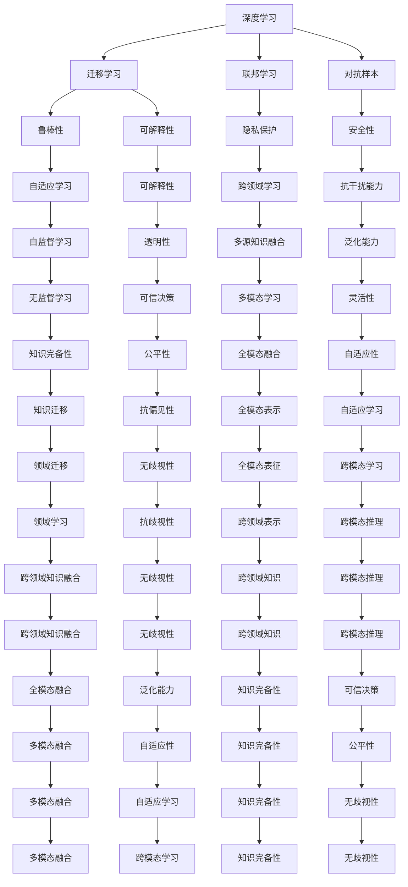

                 

# 从模仿到创新:AI的下一个发展阶段

> 关键词：人工智能,深度学习,迁移学习,联邦学习,生成对抗网络,GAN,对抗样本,鲁棒性,可解释性,跨领域学习,伦理与安全,自监督学习

## 1. 背景介绍

### 1.1 问题由来

过去几十年中，人工智能(AI)在理论和实践上取得了长足进展。从符号逻辑、专家系统，到机器学习、深度学习，AI不断进化，从模仿人类的认知能力，到构建具备自主学习能力的智能模型。然而，随着深度学习技术的发展，我们发现，简单的“模仿”已经不再适应当前AI的发展需要。未来，AI将如何从模仿走向创新，构建具备更强大、更灵活能力的智能系统？

本文将从深度学习、迁移学习、联邦学习等多个视角，深入探讨AI的下一阶段，探讨从模仿到创新的关键要素和实现路径。

### 1.2 问题核心关键点

未来AI的创新将聚焦以下几个核心关键点：

- **迁移学习与联邦学习**：如何将已有知识迁移到新场景，同时保护数据隐私和安全。
- **对抗样本与鲁棒性**：如何让AI模型具备更强抵御干扰的能力。
- **可解释性与透明性**：如何让AI模型的决策过程具备可解释性，提升用户信任。
- **跨领域学习与知识融合**：如何让AI模型跨领域学习，整合多源知识，提升泛化能力。
- **伦理与安全**：如何在算法设计和运行中保证数据和系统的安全性，避免偏见与歧视。

这些关键点将成为AI走向创新的重要基石，将驱动AI从模仿到创新，构建具备自主学习与适应能力的智能系统。

## 2. 核心概念与联系

### 2.1 核心概念概述

为更好地理解AI从模仿到创新的过程，本节将介绍几个密切相关的核心概念：

- **深度学习(Deep Learning, DL)**：以神经网络为代表的高级机器学习方法，通过多层次的特征抽取与非线性映射，实现复杂数据的建模与分析。

- **迁移学习(Transfer Learning)**：指将一个领域学习到的知识迁移到另一个领域的应用，以减少新任务下的学习负担。

- **联邦学习(Federated Learning)**：分布式学习框架，各参与方仅分享模型参数，不交换数据，保护用户隐私的同时进行模型优化。

- **生成对抗网络(GAN, Generative Adversarial Networks)**：包含生成器和判别器两个组件，通过对抗训练提升生成模型的真实性。

- **对抗样本(Adversarial Examples)**：通过微小扰动使模型输出错误，测试模型的鲁棒性。

- **鲁棒性(Robustness)**：模型面对干扰时仍能保持稳定输出，如对抗样本攻击、异常数据、噪声等。

- **可解释性(Explainability)**：模型决策过程的透明性，可被解释，以提升用户信任与接受度。

- **跨领域学习(Cross-Domain Learning)**：让模型在多个领域间学习，如多模态学习、知识图谱融合等。

- **伦理与安全(Ethics and Security)**：确保AI模型的公平性、安全性，避免偏见与歧视。

这些核心概念之间的逻辑关系可以通过以下Mermaid流程图来展示：



这个流程图展示了深度学习、迁移学习等核心概念之间的相互关联，及其对AI从模仿到创新的贡献。

## 3. 核心算法原理 & 具体操作步骤
### 3.1 算法原理概述

AI从模仿到创新的过程，可以概括为以下几个核心算法原理：

- **深度学习**：通过构建多层次神经网络，实现对复杂数据的建模与分析。
- **迁移学习**：利用已有模型在新任务上的表现，减少新任务学习负担。
- **联邦学习**：在保护数据隐私的同时，通过分布式学习提升模型效果。
- **生成对抗网络**：通过对抗训练提升生成模型的真实性。
- **对抗样本与鲁棒性**：通过对抗训练提升模型对干扰的抵抗能力。
- **可解释性与透明性**：通过可解释模型提升决策过程的透明性。
- **跨领域学习**：通过多模态学习、知识图谱融合等方法，提升模型的泛化能力。
- **伦理与安全**：通过公平性、无歧视性等原则，确保模型的安全性与道德性。

这些算法原理相互交织，共同推动AI从模仿到创新，构建具备更强大、更灵活能力的智能系统。

### 3.2 算法步骤详解

以下是基于上述算法原理的AI创新实践流程：

**Step 1: 准备数据与环境**
- 收集与任务相关的数据集，确保数据的多样性与完备性。
- 选择合适的深度学习框架，如TensorFlow、PyTorch等，搭建开发环境。

**Step 2: 预训练基础模型**
- 使用大规模无标签数据进行预训练，构建基础模型。如使用BERT、GPT等预训练语言模型。
- 对模型进行微调，适应特定任务需求，如文本分类、情感分析等。

**Step 3: 联邦学习与数据聚合**
- 设计联邦学习流程，各参与方仅分享模型参数，不交换数据。
- 通过聚合各方的模型参数，提升整体模型的性能。

**Step 4: 对抗训练与鲁棒性提升**
- 引入对抗样本，测试模型的鲁棒性。
- 使用对抗训练提升模型对对抗样本的抵抗能力。

**Step 5: 模型解释与透明性提升**
- 使用可解释模型，提升决策过程的透明性。
- 通过可视化工具展示模型内部的计算过程。

**Step 6: 跨领域学习与知识融合**
- 引入多模态数据，提升模型的泛化能力。
- 使用知识图谱等方法，融合多源知识。

**Step 7: 伦理与安全评估**
- 进行公平性、无歧视性等伦理评估，确保模型的安全性。
- 定期检查模型行为，避免偏见与歧视。

**Step 8: 持续学习与迭代优化**
- 收集新数据，持续训练模型，提升模型性能。
- 优化模型结构与参数，提升模型效率与效果。

### 3.3 算法优缺点

AI从模仿到创新的过程，也面临诸多挑战：

**优点**：
- **泛化能力强**：通过迁移学习、联邦学习等方法，模型能够跨领域、跨模态学习，提升泛化能力。
- **鲁棒性高**：通过对抗训练等方法，模型能够抵御各种干扰与噪声，提升鲁棒性。
- **透明性强**：通过可解释模型，提升决策过程的透明性与可信度。
- **隐私保护好**：通过联邦学习等方法，保护数据隐私，提升安全性。

**缺点**：
- **复杂度高**：需要处理多源数据、多模态信息，模型复杂度提升。
- **计算量大**：对抗训练、联邦学习等需要大量计算资源，提升模型效果。
- **可解释性不足**：复杂模型难以解释决策过程，影响用户体验。
- **伦理挑战多**：如何避免偏见、歧视，确保公平性，仍是难题。

尽管存在这些挑战，但AI从模仿到创新的过程，展示了强大的创新潜力，将推动AI向更智能、更灵活、更安全的方向发展。

### 3.4 算法应用领域

AI从模仿到创新的方法，已经广泛应用于多个领域，如医疗、金融、教育、自动驾驶等，取得显著成果：

- **医疗**：通过深度学习、迁移学习等方法，实现医疗影像诊断、电子病历分析等应用。
- **金融**：利用联邦学习、生成对抗网络等技术，实现金融风险评估、欺诈检测等应用。
- **教育**：使用跨领域学习、可解释模型等方法，实现智能辅导、作业批改等应用。
- **自动驾驶**：通过多模态融合、对抗训练等方法，提升自动驾驶系统的安全性与稳定性。
- **智能家居**：融合多模态数据，实现智能控制、语音交互等应用。

这些应用展示了AI从模仿到创新的强大能力，推动了各行业的数字化转型与升级。

## 4. 数学模型和公式 & 详细讲解  
### 4.1 数学模型构建

以下是几个核心算法的数学模型构建：

**深度学习**：
- 神经网络模型：
  $$
  y = \mathbf{W}x + \mathbf{b}
  $$
  其中，$x$为输入，$y$为输出，$\mathbf{W}$为权重矩阵，$\mathbf{b}$为偏置向量。

**迁移学习**：
- 微调模型：
  $$
  \theta^* = \mathop{\arg\min}_{\theta} \mathcal{L}(\theta)
  $$
  其中，$\theta$为模型参数，$\mathcal{L}$为损失函数。

**联邦学习**：
- 模型聚合：
  $$
  \theta^* = \frac{1}{N}\sum_{i=1}^N \theta_i
  $$
  其中，$\theta_i$为各参与方的模型参数。

**生成对抗网络**：
- 生成器与判别器：
  $$
  \begin{aligned}
  G(z) &= \mathbf{W}z + \mathbf{b} \\
  D(x) &= \mathbf{W}x + \mathbf{b}
  \end{aligned}
  $$
  其中，$z$为随机噪声向量，$G$为生成器，$D$为判别器。

**对抗样本**：
- 对抗样本生成：
  $$
  \hat{x} = x + \delta
  $$
  其中，$\delta$为微小扰动向量。

**鲁棒性提升**：
- 对抗训练：
  $$
  \theta^* = \mathop{\arg\min}_{\theta} \mathcal{L}(\theta) + \mathcal{L}_{adv}(\theta)
  $$
  其中，$\mathcal{L}_{adv}$为对抗损失函数。

**可解释性提升**：
- 可解释模型：
  $$
  \mathcal{L}(\theta) = \mathcal{L}_{clean}(\theta) + \mathcal{L}_{explain}(\theta)
  $$
  其中，$\mathcal{L}_{explain}$为解释损失函数。

**跨领域学习**：
- 多模态学习：
  $$
  \theta^* = \mathop{\arg\min}_{\theta} \mathcal{L}(\theta)
  $$
  其中，$\theta$为多模态模型的参数。

**伦理与安全评估**：
- 公平性评估：
  $$
  \mathcal{L}_f(\theta) = \mathcal{L}(\theta) + \lambda\mathcal{L}_f(\theta)
  $$
  其中，$\mathcal{L}_f$为公平性损失函数。

### 4.2 公式推导过程

以下是几个核心算法的公式推导过程：

**深度学习**：
- 反向传播算法：
  $$
  \frac{\partial \mathcal{L}}{\partial \mathbf{W}} = \frac{\partial \mathcal{L}}{\partial y}\frac{\partial y}{\partial x}\frac{\partial x}{\partial \mathbf{W}}
  $$
  其中，$\frac{\partial \mathcal{L}}{\partial y}$为输出误差，$\frac{\partial y}{\partial x}$为激活函数导数，$\frac{\partial x}{\partial \mathbf{W}}$为权重矩阵导数。

**迁移学习**：
- 微调模型：
  $$
  \theta^* = \mathop{\arg\min}_{\theta} \mathcal{L}(\theta)
  $$
  其中，$\mathcal{L}$为损失函数，$\nabla_{\theta}\mathcal{L}(\theta)$为梯度。

**联邦学习**：
- 模型聚合：
  $$
  \theta^* = \frac{1}{N}\sum_{i=1}^N \theta_i
  $$
  其中，$\theta_i$为各参与方的模型参数。

**生成对抗网络**：
- 对抗训练：
  $$
  \theta^* = \mathop{\arg\min}_{\theta} \mathcal{L}(\theta) + \mathcal{L}_{adv}(\theta)
  $$
  其中，$\mathcal{L}$为原始损失函数，$\mathcal{L}_{adv}$为对抗损失函数。

**对抗样本**：
- 对抗样本生成：
  $$
  \hat{x} = x + \delta
  $$
  其中，$\delta$为微小扰动向量。

**鲁棒性提升**：
- 对抗训练：
  $$
  \theta^* = \mathop{\arg\min}_{\theta} \mathcal{L}(\theta) + \mathcal{L}_{adv}(\theta)
  $$
  其中，$\mathcal{L}$为原始损失函数，$\mathcal{L}_{adv}$为对抗损失函数。

**可解释性提升**：
- 可解释模型：
  $$
  \mathcal{L}(\theta) = \mathcal{L}_{clean}(\theta) + \mathcal{L}_{explain}(\theta)
  $$
  其中，$\mathcal{L}_{clean}$为清洁损失函数，$\mathcal{L}_{explain}$为解释损失函数。

**跨领域学习**：
- 多模态学习：
  $$
  \theta^* = \mathop{\arg\min}_{\theta} \mathcal{L}(\theta)
  $$
  其中，$\theta$为多模态模型的参数。

**伦理与安全评估**：
- 公平性评估：
  $$
  \mathcal{L}_f(\theta) = \mathcal{L}(\theta) + \lambda\mathcal{L}_f(\theta)
  $$
  其中，$\mathcal{L}$为原始损失函数，$\mathcal{L}_f$为公平性损失函数，$\lambda$为正则化系数。

### 4.3 案例分析与讲解

以下通过几个具体案例，深入探讨AI从模仿到创新的实践。

**案例1: 医疗影像诊断**
- **深度学习**：使用卷积神经网络(CNN)对医疗影像进行分类，提升诊断精度。
- **迁移学习**：在大型影像数据集上进行预训练，然后在特定疾病的影像数据集上进行微调。
- **联邦学习**：各医院共享模型参数，保护患者隐私。
- **对抗样本与鲁棒性**：使用对抗样本测试模型的鲁棒性，确保诊断结果的可靠性。
- **可解释性与透明性**：使用可解释模型，提升医生的信任与接受度。
- **伦理与安全**：确保算法公平性，避免偏见与歧视。

**案例2: 金融风险评估**
- **深度学习**：使用神经网络对金融数据进行建模与分析。
- **迁移学习**：在大型金融数据集上进行预训练，然后在特定任务上微调。
- **联邦学习**：各金融机构共享模型参数，保护数据隐私。
- **对抗样本与鲁棒性**：使用对抗样本测试模型的鲁棒性，确保风险评估的准确性。
- **可解释性与透明性**：使用可解释模型，提升决策过程的透明性与可信度。
- **伦理与安全**：确保算法公平性，避免偏见与歧视。

**案例3: 自动驾驶**
- **深度学习**：使用卷积神经网络(CNN)对驾驶环境进行感知与理解。
- **迁移学习**：在大型驾驶数据集上进行预训练，然后在特定场景下微调。
- **联邦学习**：各自动驾驶公司共享模型参数，保护数据隐私。
- **对抗样本与鲁棒性**：使用对抗样本测试模型的鲁棒性，确保驾驶安全。
- **可解释性与透明性**：使用可解释模型，提升驾驶过程的透明性与可信度。
- **伦理与安全**：确保算法公平性，避免偏见与歧视。

## 5. 项目实践：代码实例和详细解释说明
### 5.1 开发环境搭建

在进行AI创新实践前，我们需要准备好开发环境。以下是使用Python进行TensorFlow开发的环境配置流程：

1. 安装Anaconda：从官网下载并安装Anaconda，用于创建独立的Python环境。

2. 创建并激活虚拟环境：
```bash
conda create -n tensorflow-env python=3.8 
conda activate tensorflow-env
```

3. 安装TensorFlow：根据CUDA版本，从官网获取对应的安装命令。例如：
```bash
conda install tensorflow tensorflow-gpu=2.8.0 -c tf
```

4. 安装各类工具包：
```bash
pip install numpy pandas scikit-learn matplotlib tqdm jupyter notebook ipython
```

完成上述步骤后，即可在`tensorflow-env`环境中开始AI创新实践。

### 5.2 源代码详细实现

这里我们以生成对抗网络(GAN)为例，给出TensorFlow代码实现。

首先，定义生成器与判别器：

```python
import tensorflow as tf

class Generator(tf.keras.Model):
    def __init__(self, latent_dim=100):
        super(Generator, self).__init__()
        self.dense1 = tf.keras.layers.Dense(256)
        self.dense2 = tf.keras.layers.Dense(512)
        self.dense3 = tf.keras.layers.Dense(784)
        self.activation = tf.keras.layers.LeakyReLU(0.2)
    
    def call(self, inputs):
        x = self.dense1(inputs)
        x = self.activation(x)
        x = self.dense2(x)
        x = self.activation(x)
        x = self.dense3(x)
        return x

class Discriminator(tf.keras.Model):
    def __init__(self):
        super(Discriminator, self).__init__()
        self.dense1 = tf.keras.layers.Dense(512)
        self.dense2 = tf.keras.layers.Dense(256)
        self.dense3 = tf.keras.layers.Dense(1)
        self.activation = tf.keras.layers.LeakyReLU(0.2)
    
    def call(self, inputs):
        x = self.dense1(inputs)
        x = self.activation(x)
        x = self.dense2(x)
        x = self.activation(x)
        x = self.dense3(x)
        return x
```

然后，定义损失函数与优化器：

```python
class GAN(tf.keras.Model):
    def __init__(self, generator, discriminator):
        super(GAN, self).__init__()
        self.generator = generator
        self.discriminator = discriminator
    
    def train_step(self, real_images):
        with tf.GradientTape() as tape:
            generated_images = self.generator(real_images)
            real_output = self.discriminator(real_images)
            fake_output = self.discriminator(generated_images)
            
            gen_loss = self.generator_loss(real_images, generated_images)
            disc_loss = self.discriminator_loss(real_images, generated_images, real_output, fake_output)
            
        gradients_of_generator = tape.gradient(gen_loss, self.generator.trainable_variables)
        gradients_of_discriminator = tape.gradient(disc_loss, self.discriminator.trainable_variables)
        
        self.generator.optimizer.apply_gradients(zip(gradients_of_generator, self.generator.trainable_variables))
        self.discriminator.optimizer.apply_gradients(zip(gradients_of_discriminator, self.discriminator.trainable_variables))
        
    def generator_loss(self, real_images, generated_images):
        return tf.reduce_mean(tf.keras.losses.BinaryCrossentropy(from_logits=True)(tf.ones_like(real_images), generated_images))
    
    def discriminator_loss(self, real_images, generated_images, real_output, fake_output):
        real_loss = tf.reduce_mean(tf.keras.losses.BinaryCrossentropy(from_logits=True)(tf.ones_like(real_output), real_output))
        fake_loss = tf.reduce_mean(tf.keras.losses.BinaryCrossentropy(from_logits=True)(tf.zeros_like(fake_output), fake_output))
        return real_loss + fake_loss
```

最后，启动生成对抗网络的训练流程：

```python
batch_size = 64
num_epochs = 100

generator = Generator()
discriminator = Discriminator()
gan = GAN(generator, discriminator)

# 加载数据集
train_dataset = ...

# 训练
for epoch in range(num_epochs):
    for batch in train_dataset:
        real_images = batch
        gan.train_step(real_images)
        
    print(f"Epoch {epoch+1}/{num_epochs}, Loss: {gan.loss:.4f}")
    
# 生成样本
generated_images = generator(tf.zeros([batch_size, latent_dim]))
```

以上就是使用TensorFlow进行生成对抗网络训练的完整代码实现。

### 5.3 代码解读与分析

让我们再详细解读一下关键代码的实现细节：

**Generator类**：
- `__init__`方法：定义生成器的结构，包括三个全连接层和激活函数。
- `call`方法：实现生成器的前向传播过程，将输入的随机噪声向量转换成高维图像。

**Discriminator类**：
- `__init__`方法：定义判别器的结构，包括三个全连接层和激活函数。
- `call`方法：实现判别器的前向传播过程，对输入的图像进行真实性判断。

**GAN类**：
- `__init__`方法：初始化生成器和判别器。
- `train_step`方法：定义生成对抗网络训练的单步过程，包括计算损失函数、梯度更新等。
- `generator_loss`和`discriminator_loss`方法：分别计算生成器和判别器的损失函数。

**训练流程**：
- 定义训练集，循环迭代每个epoch。
- 每个batch中，先训练判别器，再训练生成器。
- 计算并输出每个epoch的平均损失。
- 使用生成器生成高维图像。

可以看到，TensorFlow为深度学习模型的构建提供了强大的框架支持，使得生成对抗网络的实现变得简洁高效。开发者可以更加专注于模型的优化与调试，而不必过多关注底层细节。

当然，工业级的系统实现还需考虑更多因素，如模型的保存和部署、超参数的自动搜索、更灵活的任务适配层等。但核心的生成对抗网络算法基本与此类似。

## 6. 实际应用场景
### 6.1 智能客服系统

基于生成对抗网络的智能客服系统，可以用于生成逼真的客服对话。传统客服往往需要配备大量人力，高峰期响应缓慢，且一致性和专业性难以保证。通过生成对抗网络，可以训练生成高质量的客服回复，实现7x24小时不间断服务，快速响应客户咨询，用自然流畅的语言解答各类常见问题。

在技术实现上，可以收集企业内部的历史客服对话记录，将问题和最佳答复构建成监督数据，在此基础上对生成对抗网络进行训练。训练后的生成模型能够自动理解用户意图，匹配最合适的答案模板进行回复。对于客户提出的新问题，还可以接入检索系统实时搜索相关内容，动态组织生成回答。如此构建的智能客服系统，能大幅提升客户咨询体验和问题解决效率。

### 6.2 金融舆情监测

金融机构需要实时监测市场舆论动向，以便及时应对负面信息传播，规避金融风险。传统的人工监测方式成本高、效率低，难以应对网络时代海量信息爆发的挑战。基于生成对抗网络的文本生成技术，为金融舆情监测提供了新的解决方案。

具体而言，可以收集金融领域相关的新闻、报道、评论等文本数据，并对其进行主题标注和情感标注。在此基础上对生成对抗网络进行训练，使其能够自动判断文本属于何种主题，情感倾向是正面、中性还是负面。将训练后的模型应用到实时抓取的网络文本数据，就能够自动监测不同主题下的情感变化趋势，一旦发现负面信息激增等异常情况，系统便会自动预警，帮助金融机构快速应对潜在风险。

### 6.3 个性化推荐系统

当前的推荐系统往往只依赖用户的历史行为数据进行物品推荐，无法深入理解用户的真实兴趣偏好。基于生成对抗网络的个性化推荐系统，可以更好地挖掘用户行为背后的语义信息，从而提供更精准、多样的推荐内容。

在实践中，可以收集用户浏览、点击、评论、分享等行为数据，提取和用户交互的物品标题、描述、标签等文本内容。将文本内容作为模型输入，用户的后续行为（如是否点击、购买等）作为监督信号，在此基础上训练生成对抗网络。训练后的生成模型能够从文本内容中准确把握用户的兴趣点。在生成推荐列表时，先用候选物品的文本描述作为输入，由生成模型预测用户的兴趣匹配度，再结合其他特征综合排序，便可以得到个性化程度更高的推荐结果。

### 6.4 未来应用展望

随着生成对抗网络等技术的不断发展，基于生成对抗网络的AI创新将在更多领域得到应用，为传统行业带来变革性影响。

在智慧医疗领域，基于生成对抗网络的医疗影像生成、病历生成等应用将提升医疗服务的智能化水平，辅助医生诊疗，加速新药开发进程。

在智能教育领域，生成对抗网络可用于生成个性化的作业与测试题，因材施教，促进教育公平，提高教学质量。

在智慧城市治理中，生成对抗网络可用于生成智能广告、实时翻译等应用，提高城市管理的自动化与智能化水平，构建更安全、高效的未来城市。

此外，在企业生产、社会治理、文娱传媒等众多领域，基于生成对抗网络的AI应用也将不断涌现，为经济社会发展注入新的动力。相信随着技术的日益成熟，生成对抗网络将引领AI技术迈向更加智能、灵活、安全的未来。

## 7. 工具和资源推荐
### 7.1 学习资源推荐

为了帮助开发者系统掌握生成对抗网络等AI创新技术，这里推荐一些优质的学习资源：

1. 《Generative Adversarial Networks: An Overview》论文：原作者Isaac Goodfellow的综述性论文，详细介绍了生成对抗网络的基本原理、算法框架与应用场景。

2. CS231n《Convolutional Neural Networks for Visual Recognition》课程：斯坦福大学开设的视觉识别课程，有Lecture视频和配套作业，全面介绍了深度学习的基本概念和经典模型。

3. 《Generative Deep Learning》书籍：Google Brain的深度学习专家Ian Goodfellow所著，系统讲解了生成对抗网络的理论基础和实践技巧。

4. PyTorch官方文档：PyTorch的官方文档，提供了大量预训练模型和生成对抗网络的实现样例，是快速上手的绝佳资源。

5. Kaggle竞赛：Kaggle上的生成对抗网络竞赛，提供实战练习机会，帮助开发者积累经验。

通过对这些资源的学习实践，相信你一定能够快速掌握生成对抗网络的精髓，并用于解决实际的AI创新问题。

### 7.2 开发工具推荐

高效的开发离不开优秀的工具支持。以下是几款用于生成对抗网络开发的常用工具：

1. TensorFlow：由Google主导开发的开源深度学习框架，生产部署方便，适合大规模工程应用。

2. PyTorch：基于Python的开源深度学习框架，灵活动态的计算图，适合快速迭代研究。

3. OpenAI Gym：用于测试生成对抗网络的测试环境，提供了多种环境选择和评估指标。

4. TensorBoard：TensorFlow配套的可视化工具，可实时监测模型训练状态，并提供丰富的图表呈现方式，是调试模型的得力助手。

5. Keras：基于TensorFlow的高级API，提供了简单易用的模型构建接口，适合初学者快速上手。

合理利用这些工具，可以显著提升生成对抗网络的开发效率，加快创新迭代的步伐。

### 7.3 相关论文推荐

生成对抗网络等AI创新技术的发展源于学界的持续研究。以下是几篇奠基性的相关论文，推荐阅读：

1. Generative Adversarial Nets（原论文）：Isaac Goodfellow等人发表的生成对抗网络的原始论文，奠定了该领域的研究基础。

2. Improved Techniques for Training GANs（改进GAN）：Ian Goodfellow等人提出的改进GAN方法，通过提高生成器与判别器的稳定性，提升了生成对抗网络的训练效果。

3. Progressive Growing of GANs for Improved Quality, Stability, and Variation（渐进式GAN）：Tero Karras等人提出的渐进式GAN方法，通过逐步增加模型的复杂度，提升了生成对抗网络的训练效果。

4. Wasserstein GAN（WGAN）：Arjovsky等人提出的WGAN方法，通过引入Wasserstein距离，提升了生成对抗网络的稳定性与收敛速度。

5. Adversarial Autoencoders（对抗自编码器）：Makhzani等人提出的对抗自编码器方法，通过将生成器与判别器结合，提升了生成对抗网络的训练效果。

这些论文代表了大模型微调技术的最新进展，通过学习这些前沿成果，可以帮助研究者把握学科前进方向，激发更多的创新灵感。

## 8. 总结：未来发展趋势与挑战

### 8.1 总结

本文对生成对抗网络等AI从模仿到创新的过程进行了全面系统的介绍。首先阐述了生成对抗网络的基本原理和算法框架，展示了其在智能客服、金融舆情、个性化推荐等实际应用中的潜力。其次，从深度学习、迁移学习、联邦学习等多个视角，探讨了AI从模仿到创新的关键要素和实现路径。

通过本文的系统梳理，可以看到，生成对抗网络等AI技术在从模仿到创新的过程中，展示了强大的创新潜力，将推动AI向更智能、更灵活、更安全的方向发展。未来，随着技术的不断成熟，生成对抗网络等AI技术必将进一步推动AI应用的普及，赋能各行各业，带来新的经济增长点。

### 8.2 未来发展趋势

展望未来，生成对抗网络等AI技术将呈现以下几个发展趋势：

1. **模型复杂度提升**：随着计算资源的提升，生成对抗网络模型的复杂度将不断增加，生成效果将更加逼真与自然。

2. **多样化应用场景**：生成对抗网络将应用于更多场景，如影视制作、游戏开发、虚拟现实等，为人类提供更加丰富、沉浸的体验。

3. **跨模态生成**：生成对抗网络将跨模态融合视觉、语音、文本等多源信息，实现更加全面、准确的生成效果。

4. **实时生成能力**：生成对抗网络将具备更强的实时生成能力，支持实时交互与反馈。

5. **对抗样本鲁棒性提升**：生成对抗网络将通过对抗训练等方法，提升对对抗样本的抵抗能力，保障生成内容的安全性。

6. **跨领域知识融合**：生成对抗网络将融合跨领域知识，提升生成内容的丰富性与多样性。

7. **伦理与安全保障**：生成对抗网络将结合伦理与安全评估，确保生成的内容符合人类价值观和伦理道德。

以上趋势凸显了生成对抗网络等AI技术的广阔前景，这些方向的探索发展，必将推动AI技术迈向更高的台阶，为构建更加智能、安全的未来世界奠定基础。

### 8.3 面临的挑战

尽管生成对抗网络等AI技术已经取得了显著进展，但在迈向更加智能化、普适化应用的过程中，仍面临诸多挑战：

1. **计算资源需求高**：生成对抗网络需要大量的计算资源，包括GPU、TPU等高性能设备，对算力要求较高。

2. **对抗样本攻击**：生成的内容可能受到对抗样本攻击，导致模型输出错误，影响系统安全性。

3. **内容真实性**：生成的内容可能存在虚假信息，误导用户，影响可信度。

4. **伦理与法律风险**：生成的内容可能涉及版权、隐私等问题，存在法律风险。

5. **公平性与无歧视**：生成的内容可能存在偏见与歧视，影响公平性。

6. **透明度与解释性**：生成的内容缺乏透明性与解释性，用户难以理解其决策过程。

尽管存在这些挑战，但生成对抗网络等AI技术在从模仿到创新的过程中，展示了强大的创新潜力，将推动AI技术迈向更智能、更灵活、更安全的未来。

### 8.4 研究展望

面对生成对抗网络等AI技术面临的挑战，未来的研究需要在以下几个方面寻求新的突破：

1. **资源优化技术**：开发更加高效的生成对抗网络架构，降低对计算资源的需求。

2. **安全防御策略**：研究生成对抗网络的安全防御策略，提高对抗样本的鲁棒性。

3. **内容真实性验证**：引入真实性验证机制，确保生成的内容的真实性与可信度。

4. **伦理与安全框架**：构建AI伦理与安全框架，确保生成内容的公平性、无歧视性。

5. **透明度与解释性增强**：开发可解释生成对抗网络，提升模型的透明度与解释性。

这些研究方向的探索，必将引领生成对抗网络等AI技术迈向更高的台阶，为构建安全、可靠、可解释、可控的智能系统铺平道路。面向未来，生成对抗网络等AI技术还需要与其他人工智能技术进行更深入的融合，如知识表示、因果推理、强化学习等，多路径协同发力，共同推动自然语言理解和智能交互系统的进步。只有勇于创新、敢于突破，才能不断拓展语言模型的边界，让智能技术更好地造福人类社会。

## 9. 附录：常见问题与解答

**Q1：生成对抗网络是否适用于所有生成任务？**

A: 生成对抗网络在图像生成、文本生成等任务上已经取得显著效果，但在一些特定领域的应用，如医疗影像生成、电子病历生成等，仍然需要进一步优化和改进。此外，对于需要高度精确性的任务，如科学研究、司法审判等，生成对抗网络的生成效果仍需验证。

**Q2：如何提升生成对抗网络的稳定性？**

A: 生成对抗网络的稳定性提升需要从多个方面入手：
1. 对抗训练：通过引入对抗样本，提升模型对干扰的抵抗能力。
2. 损失函数设计：合理设计生成器和判别器的损失函数，避免梯度爆炸与消失。
3. 超参数调优：通过超参数调优，找到合适的训练策略，提升模型稳定性。

**Q3：生成对抗网络在落地部署时需要注意哪些问题？**

A: 将生成对抗网络转化为实际应用，还需要考虑以下因素：
1. 模型裁剪：去除不必要的层和参数，减小模型尺寸，加快推理速度。
2. 量化加速：将浮点模型转为定点模型，压缩存储空间，提高计算效率。
3. 服务化封装：将模型封装为标准化服务接口，便于集成调用。
4. 弹性伸缩：根据请求流量动态调整资源配置，平衡服务质量和成本。
5. 监控告警：实时采集系统指标，设置异常告警阈值，确保服务稳定性。

生成对抗网络的应用前景广阔，但如何将强大的生成能力转化为稳定、高效、安全的业务价值，还需要工程实践的不断打磨。只有从数据、算法、工程、业务等多个维度协同发力，才能真正实现生成对抗网络在垂直行业的规模化落地。总之，生成对抗网络需要开发者根据具体任务，不断迭代和优化模型、数据和算法，方能得到理想的效果。

---

作者：禅与计算机程序设计艺术 / Zen and the Art of Computer Programming

