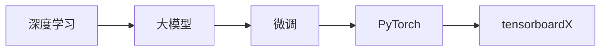

                 

# 从零开始大模型开发与微调：可视化组件tensorboardX的简介与安装

> 关键词：深度学习,大模型,微调,PyTorch,tensorboardX,可视化

## 1. 背景介绍

随着深度学习技术的不断发展，大模型在各个领域的应用越来越广泛，包括自然语言处理、计算机视觉、语音识别等。大模型通常包含大量参数，训练复杂度高，需要大量的计算资源。为了更好地管理和调试这些大模型，可视化技术成为了一个重要工具。本文章将介绍tensorboardX，这是一个基于tensorboard的Python可视化组件，可以帮助开发人员更直观地查看模型训练过程中的参数变化、损失函数变化、模型权重变化等，从而更好地理解模型的训练状态和优化效果。

## 2. 核心概念与联系

### 2.1 核心概念概述

- **深度学习**：一种基于多层神经网络的机器学习技术，能够处理复杂的数据结构，如图像、语音、自然语言等。
- **大模型**：指具有大量参数的神经网络模型，如BERT、GPT等，能够在多个任务上表现出色。
- **微调**：指在预训练模型的基础上，通过有监督学习优化模型在特定任务上的性能。
- **PyTorch**：一种基于Python的深度学习框架，提供了丰富的工具和接口，方便开发深度学习模型。
- **tensorboardX**：基于tensorboard的Python可视化组件，能够将模型训练过程中的数据可视化，帮助开发人员更好地理解模型训练状态和优化效果。

### 2.2 核心概念原理和架构的 Mermaid 流程图



在上述流程图中，深度学习是构建大模型的基础，微调是在大模型基础上针对特定任务进行优化，PyTorch是深度学习的框架，而tensorboardX则是在PyTorch上进行模型训练和可视化的工具。

## 3. 核心算法原理 & 具体操作步骤

### 3.1 算法原理概述

在大模型的微调过程中，我们需要不断地更新模型参数，以适应特定任务的需求。为了更好地了解模型训练状态和优化效果，可以使用tensorboardX进行可视化。tensorboardX可以帮助开发人员在训练过程中实时查看模型的损失函数、参数变化等，从而更好地指导模型训练和优化。

### 3.2 算法步骤详解

#### 3.2.1 安装tensorboardX

首先，需要在PyTorch环境中安装tensorboardX。在命令行中运行以下命令：

```bash
pip install tensorboardX
```

#### 3.2.2 启动可视化服务器

在安装完成后，使用以下命令启动可视化服务器：

```bash
tensorboard --logdir <log_dir>
```

其中，`<log_dir>` 是存放模型日志的目录。在模型训练过程中，所有模型的损失函数、参数变化等都会被记录在该目录下，并且会被tensorboard自动收集和展示。

#### 3.2.3 查看可视化效果

启动可视化服务器后，打开浏览器，输入 `http://localhost:6006/`，即可访问可视化界面。在界面上，可以查看模型的参数变化、损失函数变化等，从而更好地指导模型训练和优化。

### 3.3 算法优缺点

#### 3.3.1 优点

- **实时可视化**：tensorboardX可以在训练过程中实时展示模型的参数变化、损失函数变化等，帮助开发人员更好地理解模型训练状态和优化效果。
- **丰富功能**：tensorboardX提供了丰富的可视化功能，如参数变化、损失函数变化、梯度变化等，可以全面展示模型训练状态。
- **简单易用**：tensorboardX使用简单，只需在PyTorch环境中安装并启动即可使用，不需要额外的配置。

#### 3.3.2 缺点

- **资源消耗大**：tensorboardX的可视化功能非常丰富，因此在训练过程中需要消耗大量的计算资源。
- **依赖性强**：tensorboardX依赖于tensorboard，需要确保tensorboard正常工作。

### 3.4 算法应用领域

tensorboardX可以应用于深度学习模型的训练和优化过程中，适用于各种大模型的微调。例如，在自然语言处理领域，可以使用tensorboardX进行BERT、GPT等模型的微调，从而在情感分析、文本分类、机器翻译等任务上获得更好的性能。

## 4. 数学模型和公式 & 详细讲解 & 举例说明

### 4.1 数学模型构建

在大模型的微调过程中，我们需要对模型的损失函数进行优化。假设模型为 $f(x;w)$，输入为 $x$，输出为 $f(x;w)$，目标函数为 $L(w)$，优化目标为最小化 $L(w)$。

### 4.2 公式推导过程

在微调过程中，我们通常使用梯度下降算法对模型进行优化。梯度下降算法的更新公式为：

$$
w_{new} = w_{old} - \alpha \nabla_{w}L(w_{old})
$$

其中，$\alpha$ 为学习率，$\nabla_{w}L(w_{old})$ 为损失函数对模型参数的梯度。

### 4.3 案例分析与讲解

以BERT模型的微调为例，假设我们需要在情感分析任务上进行微调。我们可以将数据集分为训练集和验证集，使用BERT作为预训练模型，通过有监督学习的方式在训练集上进行微调，并使用验证集进行评估。在微调过程中，可以使用tensorboardX对模型的损失函数、参数变化等进行可视化。

## 5. 项目实践：代码实例和详细解释说明

### 5.1 开发环境搭建

在安装tensorboardX之前，需要确保已经安装了PyTorch和numpy等依赖库。在命令行中运行以下命令：

```bash
pip install torch numpy tensorboardX
```

### 5.2 源代码详细实现

以下是一个使用tensorboardX进行BERT模型微调的示例代码：

```python
import torch
from transformers import BertTokenizer, BertForSequenceClassification
from tensorboardX import SummaryWriter

# 初始化模型和分词器
model = BertForSequenceClassification.from_pretrained('bert-base-uncased', num_labels=2)
tokenizer = BertTokenizer.from_pretrained('bert-base-uncased')

# 初始化可视化记录器
writer = SummaryWriter()

# 定义损失函数和优化器
criterion = torch.nn.CrossEntropyLoss()
optimizer = torch.optim.Adam(model.parameters(), lr=1e-5)

# 加载数据集
train_data = ...
val_data = ...

# 训练模型
for epoch in range(10):
    model.train()
    for batch in train_data:
        inputs, labels = batch
        outputs = model(inputs)
        loss = criterion(outputs, labels)
        optimizer.zero_grad()
        loss.backward()
        optimizer.step()
        writer.add_scalar('loss/train', loss.item(), epoch)
        writer.add_histogram('weights/bert/layer.0', model.bert.weight.data, epoch)

    model.eval()
    with torch.no_grad():
        for batch in val_data:
            inputs, labels = batch
            outputs = model(inputs)
            loss = criterion(outputs, labels)
            writer.add_scalar('loss/val', loss.item(), epoch)
            writer.add_histogram('weights/bert/layer.0', model.bert.weight.data, epoch)

    print(f'Epoch {epoch+1}/{10}, Loss: {writer.add_scalar('loss/train', loss.item(), epoch)}')
```

### 5.3 代码解读与分析

在上述代码中，我们使用了BertForSequenceClassification模型和BertTokenizer进行BERT模型的微调。在模型训练过程中，我们使用了tensorboardX的SummaryWriter记录了损失函数和模型参数的变化。通过在训练过程中不断更新记录器的数据，可以在训练结束后使用tensorboard查看这些变化，从而更好地指导模型训练和优化。

### 5.4 运行结果展示

在训练结束后，可以使用tensorboard查看可视化效果。打开浏览器，输入 `http://localhost:6006/`，进入可视化界面，选择“Scalars”视图，可以看到训练过程中的损失函数变化情况；选择“Histogram”视图，可以看到模型参数的变化情况。这些可视化结果可以帮助开发人员更好地理解模型训练状态和优化效果。

## 6. 实际应用场景

### 6.1 自然语言处理

在自然语言处理领域，tensorboardX可以帮助开发人员在BERT、GPT等大模型的微调过程中，实时展示模型的损失函数、参数变化等，从而更好地指导模型训练和优化。例如，在情感分析任务上进行微调时，可以使用tensorboardX可视化模型的损失函数和参数变化，从而更好地理解模型训练状态和优化效果。

### 6.2 计算机视觉

在计算机视觉领域，tensorboardX也可以应用于大模型的微调过程中。例如，在图像分类任务上进行微调时，可以使用tensorboardX可视化模型的损失函数和参数变化，从而更好地指导模型训练和优化。

### 6.3 语音识别

在语音识别领域，tensorboardX同样可以应用于大模型的微调过程中。例如，在语音识别任务上进行微调时，可以使用tensorboardX可视化模型的损失函数和参数变化，从而更好地指导模型训练和优化。

## 7. 工具和资源推荐

### 7.1 学习资源推荐

- **TensorFlow官方文档**：TensorFlow是一种流行的深度学习框架，官方文档提供了丰富的教程和示例，可以帮助开发人员快速上手。
- **PyTorch官方文档**：PyTorch是另一种流行的深度学习框架，官方文档提供了丰富的教程和示例，可以帮助开发人员快速上手。
- **tensorboardX官方文档**：tensorboardX是Tensorboard的Python可视化组件，官方文档提供了详细的教程和示例，可以帮助开发人员快速上手。

### 7.2 开发工具推荐

- **PyTorch**：一种基于Python的深度学习框架，提供了丰富的工具和接口，方便开发深度学习模型。
- **TensorFlow**：一种流行的深度学习框架，提供了丰富的工具和接口，方便开发深度学习模型。
- **tensorboardX**：基于tensorboard的Python可视化组件，可以帮助开发人员更直观地查看模型训练过程中的参数变化、损失函数变化等，从而更好地理解模型的训练状态和优化效果。

### 7.3 相关论文推荐

- **PyTorch官方博客**：PyTorch官方博客提供了丰富的教程和示例，可以帮助开发人员快速上手。
- **TensorFlow官方博客**：TensorFlow官方博客提供了丰富的教程和示例，可以帮助开发人员快速上手。
- **tensorboardX官方文档**：tensorboardX官方文档提供了详细的教程和示例，可以帮助开发人员快速上手。

## 8. 总结：未来发展趋势与挑战

### 8.1 研究成果总结

在深度学习领域，大模型的微调和可视化技术已经取得了一定的进展，但也面临诸多挑战。通过使用tensorboardX，开发人员可以更直观地查看模型训练过程中的参数变化、损失函数变化等，从而更好地理解模型的训练状态和优化效果。未来，tensorboardX将继续发挥其在深度学习模型微调和可视化中的重要作用，推动深度学习技术的发展。

### 8.2 未来发展趋势

未来的深度学习技术将继续向大模型方向发展，模型规模将越来越大，复杂度将越来越高。为了更好地管理和调试这些大模型，可视化技术将继续发挥重要作用。tensorboardX将不断更新和改进，提供更加丰富和直观的可视化效果，帮助开发人员更好地理解和优化模型。

### 8.3 面临的挑战

尽管tensorboardX在深度学习模型的微调和可视化中发挥了重要作用，但也面临诸多挑战。例如，在训练大模型时，需要消耗大量的计算资源，如何在不增加计算成本的前提下提高可视化效果，是一个重要的研究方向。另外，如何更好地融合深度学习模型和可视化技术，提供更加丰富和直观的可视化效果，也是一个重要的研究方向。

### 8.4 研究展望

未来，可视化技术将继续在深度学习模型微调中发挥重要作用。tensorboardX将不断更新和改进，提供更加丰富和直观的可视化效果，帮助开发人员更好地理解和优化模型。同时，可视化技术也将与其他深度学习技术进行更深入的融合，如知识表示、因果推理、强化学习等，推动深度学习技术的发展。

## 9. 附录：常见问题与解答

**Q1：tensorboardX的可视化效果如何？**

A：tensorboardX提供了丰富的可视化功能，可以实时展示模型的损失函数、参数变化等。例如，在情感分析任务上进行微调时，可以使用tensorboardX可视化模型的损失函数和参数变化，从而更好地指导模型训练和优化。

**Q2：如何使用tensorboardX进行可视化？**

A：在使用tensorboardX进行可视化时，需要先安装tensorboardX和PyTorch等依赖库。然后，在模型训练过程中，使用SummaryWriter记录模型的损失函数、参数变化等，训练结束后，可以使用tensorboard查看可视化效果。打开浏览器，输入 `http://localhost:6006/`，进入可视化界面，选择“Scalars”视图和“Histogram”视图，可以分别查看模型的损失函数变化和参数变化情况。

**Q3：tensorboardX的局限性有哪些？**

A：tensorboardX的局限性包括：

- 需要消耗大量的计算资源，尤其是在训练大模型时。
- 可视化效果过于复杂，开发人员需要花费大量时间进行解读和分析。

**Q4：如何提升tensorboardX的可视化效果？**

A：为了提升tensorboardX的可视化效果，可以采用以下策略：

- 采用更先进的可视化算法和技术，提高可视化效果的质量和准确性。
- 将可视化效果与深度学习模型的优化过程进行结合，提供更加直观和易于理解的可视化效果。

**Q5：tensorboardX适用于哪些深度学习框架？**

A：tensorboardX适用于PyTorch和TensorFlow等深度学习框架，可以帮助开发人员更直观地查看模型训练过程中的参数变化、损失函数变化等，从而更好地理解模型的训练状态和优化效果。

---

作者：禅与计算机程序设计艺术 / Zen and the Art of Computer Programming

