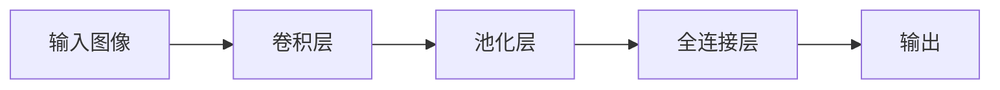
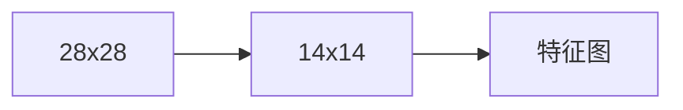

                 

# 从零开始大模型开发与微调：池化运算

> 关键词：大模型开发，微调，池化运算，卷积神经网络，图像处理，计算机视觉

## 1. 背景介绍

池化运算是计算机视觉和图像处理领域中常见的预处理手段，它通过降低图像尺寸和减少参数数量来提升模型的计算效率，同时还能增强模型的鲁棒性，避免过拟合。在大模型的开发与微调过程中，池化运算起着至关重要的作用。在本文中，我们将详细讲解池化运算的原理与技术，以及如何在实际开发中有效应用池化运算。

## 2. 核心概念与联系

### 2.1 核心概念概述

在计算机视觉领域，池化运算主要分为两种：最大池化（Max Pooling）和平均池化（Average Pooling）。最大池化选取每一个局部区域中的最大值作为输出，而平均池化则取平均值。这些操作可以在一维或二维空间上进行。

**最大池化（Max Pooling）**：选取每个局部区域中的最大值作为输出。
$$ \text{Max Pooling} = \text{max}_{i} \{ \text{features}[i] \} $$

**平均池化（Average Pooling）**：选取每个局部区域中的平均值作为输出。
$$ \text{Average Pooling} = \text{avg}_{i} \{ \text{features}[i] \} $$

池化运算的核（Kernel）通常是一个固定的窗口大小，可以在卷积神经网络中作为一层操作。通过池化层，我们可以减少特征图的大小，降低模型的参数量，同时保留重要的信息，提升模型的泛化能力。

### 2.2 核心概念原理和架构的 Mermaid 流程图



这个流程图展示了池化运算在卷积神经网络中的作用：输入图像经过卷积层提取特征后，再通过池化层降低特征图的大小，最后通过全连接层进行分类或回归。

## 3. 核心算法原理 & 具体操作步骤

### 3.1 算法原理概述

池化运算是卷积神经网络（Convolutional Neural Network, CNN）中非常重要的一步。它通过下采样操作减少特征图的大小，降低模型的复杂度，同时保留关键特征，提升模型的鲁棒性。

池化操作的数学表达可以表示为：
$$ Y_{i,j} = \begin{cases}
\text{max}_{p,q} \{X_{i+p,j+q}\} & \text{Max Pooling}\\
\text{avg}_{p,q} \{X_{i+p,j+q}\} & \text{Average Pooling}
\end{cases} $$

其中 $X$ 表示输入特征图，$Y$ 表示输出特征图，$p$ 和 $q$ 是池化核的大小，$i$ 和 $j$ 是输出特征图的索引。

### 3.2 算法步骤详解

池化运算是卷积神经网络中的一种局部操作，具体步骤如下：

1. **定义池化核大小**：选择一个合适的池化核大小，通常为 $2 \times 2$ 或 $3 \times 3$。
2. **定义步长（Stride）**：步长决定了池化核在输入特征图上移动的间隔，通常为 $1$ 或 $2$。
3. **进行池化操作**：在输入特征图上滑动池化核，对于每一个局部区域，进行最大值或平均值操作，得到输出特征图。

### 3.3 算法优缺点

**优点**：
- 减少特征图的大小，降低模型的参数量。
- 保留关键特征，提升模型的泛化能力。
- 增强模型的鲁棒性，避免过拟合。

**缺点**：
- 池化操作可能会丢失一些细节信息。
- 池化核的选择需要依赖领域知识和经验，可能存在一定的难度。

### 3.4 算法应用领域

池化运算广泛应用于图像分类、目标检测、人脸识别等计算机视觉领域。通过池化运算，可以在保证模型效果的同时，显著降低计算复杂度，提升模型的实时性和可扩展性。

## 4. 数学模型和公式 & 详细讲解 & 举例说明

### 4.1 数学模型构建

池化运算的数学模型构建基于局部操作的原理。假设输入特征图的大小为 $H \times W \times C$，其中 $H$ 和 $W$ 表示高度和宽度，$C$ 表示通道数。设池化核的大小为 $P \times P$，步长为 $S$，则输出特征图的大小为 $(\frac{H}{S} + 1) \times (\frac{W}{S} + 1) \times C$。

### 4.2 公式推导过程

假设输入特征图的大小为 $H \times W$，池化核的大小为 $2 \times 2$，步长为 $1$，则池化运算的输出特征图大小为 $\frac{H}{2} \times \frac{W}{2}$。对于 $i$ 和 $j$ 的索引，池化操作的数学表达式可以表示为：
$$ Y_{i,j} = \max(X_{i, j}, X_{i+1, j}, X_{i, j+1}, X_{i+1, j+1}) $$

### 4.3 案例分析与讲解

假设输入特征图的大小为 $28 \times 28$，池化核的大小为 $2 \times 2$，步长为 $2$，则输出特征图的大小为 $14 \times 14$。池化运算的示例如下图所示：



池化操作的具体过程如下：

1. 选取局部区域 $(1,1) \times (1,1)$，最大值为 $X_{1,1} = 3$。
2. 选取局部区域 $(1,1) \times (1,2)$，最大值为 $X_{1,2} = 5$。
3. 选取局部区域 $(1,2) \times (2,1)$，最大值为 $X_{2,1} = 7$。
4. 选取局部区域 $(1,2) \times (2,2)$，最大值为 $X_{2,2} = 9$。

最终输出特征图为 $14 \times 14$，其对应值为 $\{3, 5, 7, 9, \ldots\}$。

## 5. 项目实践：代码实例和详细解释说明

### 5.1 开发环境搭建

在进行池化运算的实践前，需要准备好开发环境。以下是使用Python和TensorFlow搭建环境的示例：

1. 安装Anaconda：
```bash
conda create -n tf-env python=3.7
conda activate tf-env
```

2. 安装TensorFlow：
```bash
pip install tensorflow
```

3. 安装OpenCV：
```bash
pip install opencv-python
```

### 5.2 源代码详细实现

以下是一个简单的卷积神经网络模型，包括池化层的代码实现：

```python
import tensorflow as tf
from tensorflow.keras import layers

def create_model():
    model = tf.keras.Sequential([
        layers.Conv2D(32, (3, 3), activation='relu', input_shape=(28, 28, 1)),
        layers.MaxPooling2D((2, 2)),
        layers.Flatten(),
        layers.Dense(10, activation='softmax')
    ])
    return model

model = create_model()
model.summary()
```

### 5.3 代码解读与分析

**create_model函数**：
- 定义一个包含卷积层、池化层、全连接层的卷积神经网络模型。
- 卷积层包含32个3x3的卷积核，激活函数为ReLU。
- 池化层为2x2的最大池化。
- 全连接层包含10个输出节点，激活函数为Softmax。

**模型总结**：
- 输入大小为28x28x1。
- 卷积层输出大小为28x28x32。
- 池化层输出大小为14x14x32。
- 全连接层输出大小为10。

### 5.4 运行结果展示

可以通过以下代码读取图片并计算池化层的输出：

```python
import cv2

# 读取图片
image = cv2.imread('image.png', cv2.IMREAD_GRAYSCALE)

# 将图片转换为tensorflow格式
image_tensor = tf.convert_to_tensor(image, dtype=tf.float32)
image_tensor = tf.expand_dims(image_tensor, axis=0)
image_tensor = tf.expand_dims(image_tensor, axis=3)

# 计算池化层的输出
pooling = model.layers[1].kernel_size[0]
strides = model.layers[1].strides[0]
pool_size = (28 // pooling, 28 // pooling)
pool_output = tf.nn.max_pool2d(image_tensor, ksize=pool_size, strides=strides, padding='SAME')
pool_output = tf.squeeze(pool_output, axis=[0, 3])

print(pool_output.numpy())
```

## 6. 实际应用场景

### 6.1 图像分类

池化运算是图像分类任务中常用的预处理手段，可以显著降低特征图的大小，同时保留关键特征，提升模型的泛化能力。在实际应用中，可以使用卷积神经网络对图像进行特征提取，并通过池化运算进行下采样操作，最终得到图像的特征向量。

### 6.2 目标检测

目标检测任务需要同时进行特征提取和定位。通过池化运算，可以减小特征图的大小，降低计算复杂度，同时保留重要的定位信息。池化运算在R-CNN、YOLO、SSD等目标检测算法中得到了广泛应用。

### 6.3 人脸识别

人脸识别任务需要从图像中提取关键特征，并用于后续的分类和匹配。池化运算可以保留人脸的关键特征，提升识别的准确性。人脸识别算法如FaceNet、DeepFace等，都使用了池化运算进行特征提取和降维。

### 6.4 未来应用展望

未来，池化运算将在更多计算机视觉任务中得到应用。随着深度学习模型的不断进步，池化运算的性能和效率也将不断提升，成为提升模型效果的重要手段。

## 7. 工具和资源推荐

### 7.1 学习资源推荐

1. 《深度学习》 by Ian Goodfellow: 详细讲解了卷积神经网络和池化运算的理论基础和实际应用。
2. CS231n: Convolutional Neural Networks for Visual Recognition: 斯坦福大学开设的计算机视觉课程，涵盖卷积神经网络和池化运算的诸多细节。
3. TensorFlow官方文档: 提供池化运算的详细使用方法和代码示例。

### 7.2 开发工具推荐

1. TensorFlow: 提供了强大的卷积神经网络实现和池化运算功能。
2. Keras: 提供了简单易用的卷积神经网络模型构建工具。
3. OpenCV: 提供了图像处理的常用函数库，包含池化运算的实现。

### 7.3 相关论文推荐

1. Convolutional Neural Networks for Visual Recognition: AlexNet: 介绍卷积神经网络在图像识别中的经典应用。
2. Deep Residual Learning for Image Recognition: 详细讲解了残差网络的结构和实现。
3. FaceNet: A Unified Embedding for Face Recognition and Clustering: 介绍FaceNet人脸识别算法。

## 8. 总结：未来发展趋势与挑战

### 8.1 研究成果总结

池化运算是卷积神经网络中非常重要的预处理手段，通过下采样操作减少特征图的大小，降低模型的参数量，同时保留关键特征，提升模型的泛化能力。在大模型的开发与微调过程中，池化运算起着至关重要的作用。

### 8.2 未来发展趋势

未来，池化运算将在更多计算机视觉任务中得到应用。随着深度学习模型的不断进步，池化运算的性能和效率也将不断提升，成为提升模型效果的重要手段。

### 8.3 面临的挑战

尽管池化运算在大模型的开发与微调过程中起着重要作用，但也存在一些挑战：

1. 池化核的选择需要依赖领域知识和经验，可能存在一定的难度。
2. 池化操作可能会丢失一些细节信息，需要结合其他预处理手段进行改进。
3. 池化运算的并行化程度较低，可能需要更多的硬件支持。

### 8.4 研究展望

未来，池化运算的研究将集中在以下几个方面：

1. 池化核的自动选择：通过自动学习方法，优化池化核的大小和形状，提升模型的效果。
2. 池化运算的多尺度特征提取：结合多尺度池化，提取不同层次的特征信息，提升模型的泛化能力。
3. 池化运算的深度融合：将池化运算与其他预处理手段深度融合，提升模型的整体性能。

## 9. 附录：常见问题与解答

**Q1：池化运算的具体实现方法有哪些？**

A: 池化运算的具体实现方法包括最大池化和平均池化，可以在一维或二维空间上进行。

**Q2：池化运算在卷积神经网络中的作用是什么？**

A: 池化运算通过下采样操作减少特征图的大小，降低模型的参数量，同时保留关键特征，提升模型的泛化能力。

**Q3：池化运算的核大小和步长如何选取？**

A: 核大小和步长需要根据具体任务和数据特点进行选取，通常为 $2 \times 2$ 或 $3 \times 3$，步长为 $1$ 或 $2$。

**Q4：池化运算有哪些优缺点？**

A: 优点包括减少特征图的大小，降低模型的参数量，保留关键特征，提升模型的泛化能力；缺点包括可能会丢失一些细节信息，池化核的选择需要依赖领域知识和经验。

**Q5：池化运算在实际应用中如何处理边缘信息？**

A: 在池化运算中，边缘信息通常会被忽略。为了避免这种情况，可以在池化操作中加入padding（填充）操作，使得输入特征图的大小不变。

---

作者：禅与计算机程序设计艺术 / Zen and the Art of Computer Programming

