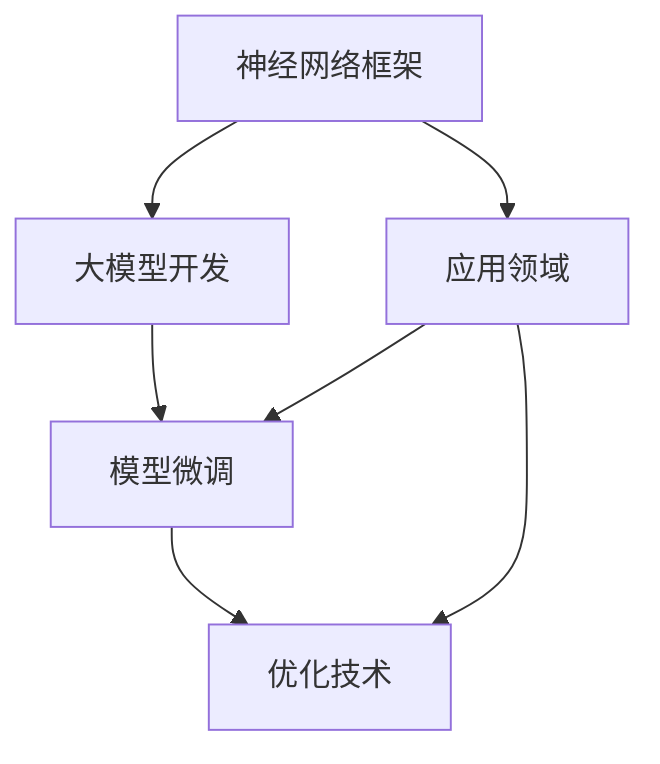

                 

# 从零开始大模型开发与微调：自定义神经网络框架的基本设计

> 关键词：神经网络框架,大模型开发,微调,深度学习,自定义,代码实现

## 1. 背景介绍

### 1.1 问题由来

随着人工智能技术的不断进步，深度学习尤其是神经网络在大模型训练和应用中扮演着至关重要的角色。在NLP、计算机视觉、语音识别等领域，大模型已经成为推动技术突破的关键。然而，现有的深度学习框架如TensorFlow、PyTorch等虽然在模型构建和训练方面功能强大，但在大模型开发和微调过程中，往往存在性能、灵活性、可扩展性等方面的不足。

针对这些挑战，本文将详细介绍如何从头搭建一个自定义神经网络框架，并基于此框架实现大模型的开发和微调。通过理解这一过程，读者可以深入掌握大模型的开发技巧，同时获得设计和管理大模型的实践经验。

### 1.2 问题核心关键点

本文聚焦于以下几个核心关键点：

- **神经网络框架设计**：如何构建一个支持大模型训练和微调的自定义框架。
- **大模型开发**：如何从头训练一个大规模的神经网络模型。
- **模型微调**：如何使用自定义框架对预训练模型进行微调。
- **优化技术**：在模型构建和微调过程中，如何应用不同的优化技术提升性能。
- **应用领域**：大模型在NLP、计算机视觉、语音识别等领域的典型应用。

### 1.3 问题研究意义

掌握自定义神经网络框架的设计和实现，不仅能够帮助研究者深入理解深度学习的基本原理，还能够为实际应用中的大模型开发和微调提供灵活高效的工具。这将极大地提升开发效率，降低技术门槛，促进深度学习技术在更多领域的落地应用。

## 2. 核心概念与联系

### 2.1 核心概念概述

- **神经网络框架**：一个支持模型定义、训练、推理等功能的框架。
- **大模型**：参数量在亿级别以上的神经网络模型。
- **模型微调**：在预训练模型的基础上，通过特定任务的标注数据进一步训练优化。
- **优化技术**：用于提高模型训练速度和性能的技术，如梯度下降、自适应学习率等。
- **应用领域**：如NLP中的语言模型、计算机视觉中的图像分类模型等。

这些概念之间存在密切的联系。神经网络框架为大模型的构建和训练提供了基础支持，而大模型则依赖于框架中的优化技术来提升性能。模型微调在大模型的基础上，通过特定任务的数据进一步优化，从而提升模型在特定领域的表现。

### 2.2 核心概念原理和架构的 Mermaid 流程图



这个流程图展示了各个核心概念之间的联系：

1. 神经网络框架（A）为大模型开发（B）提供基础支持。
2. 大模型（B）通过模型微调（C）进一步优化，适应特定任务。
3. 优化技术（D）提高大模型性能。
4. 应用领域（E）是大模型和优化技术的实际应用场景。

## 3. 核心算法原理 & 具体操作步骤

### 3.1 算法原理概述

自定义神经网络框架的核心算法原理，主要围绕以下几个方面展开：

- **前向传播**：接收输入数据，通过模型计算得到输出。
- **后向传播**：计算损失函数对模型参数的梯度，用于反向传播更新参数。
- **优化算法**：根据梯度信息更新模型参数，常用的算法包括梯度下降、Adam等。
- **正则化**：避免模型过拟合，如L2正则、Dropout等。
- **模型构建**：通过模块化设计，构建不同层和神经元的网络结构。

### 3.2 算法步骤详解

#### 步骤一：数据预处理

1. **数据加载**：从数据集读取样本数据。
2. **数据预处理**：包括归一化、截断、填充等操作，确保输入数据格式一致。
3. **分批次处理**：将数据分为多个批次进行模型训练。

#### 步骤二：模型定义

1. **定义神经网络层**：如全连接层、卷积层、池化层等。
2. **构建网络结构**：通过继承或组合方式，构建包含多层的神经网络。
3. **定义损失函数**：如交叉熵、均方误差等，用于评估模型性能。

#### 步骤三：模型训练

1. **前向传播**：将输入数据送入模型，计算输出。
2. **计算损失**：将输出与真实标签计算损失值。
3. **反向传播**：根据损失计算梯度，更新模型参数。
4. **优化器更新**：使用优化算法如Adam、SGD等更新模型参数。
5. **迭代训练**：重复前向传播和反向传播过程，直至模型收敛。

#### 步骤四：模型评估

1. **验证集评估**：在验证集上计算模型损失和精度。
2. **测试集评估**：在测试集上验证模型泛化能力。
3. **性能监控**：记录训练过程中的各项指标，如损失、准确率、学习率等。

### 3.3 算法优缺点

#### 优点

1. **灵活性**：自定义框架可以根据具体需求设计网络结构，支持多种模型类型。
2. **可扩展性**：框架可以不断扩展新的功能模块，支持大模型的训练和微调。
3. **性能优化**：通过优化算法和正则化技术，提高模型训练效率和泛化能力。

#### 缺点

1. **开发难度大**：从头搭建框架需要深厚的编程和数学基础。
2. **资源消耗高**：大模型的训练和微调需要大量的计算资源。
3. **生态系统不成熟**：相比于成熟框架，自定义框架缺乏丰富的社区支持和工具链。

### 3.4 算法应用领域

大模型和自定义神经网络框架的应用领域非常广泛，包括但不限于：

- **NLP**：语言模型、情感分析、机器翻译等。
- **计算机视觉**：图像分类、目标检测、人脸识别等。
- **语音识别**：语音转文本、语音情感识别等。
- **推荐系统**：用户行为分析、物品推荐等。

## 4. 数学模型和公式 & 详细讲解 & 举例说明

### 4.1 数学模型构建

自定义神经网络框架的数学模型构建，通常遵循以下步骤：

1. **输入层**：接收输入数据，转换为模型所需的格式。
2. **隐藏层**：通过一系列的线性变换和非线性激活函数，提取输入数据的特征。
3. **输出层**：将隐藏层的特征映射为模型预测结果。
4. **损失函数**：定义模型预测结果与真实标签之间的差异，如交叉熵损失。

### 4.2 公式推导过程

以一个简单的全连接神经网络为例，推导其前向传播和反向传播的公式：

#### 前向传播

假设输入数据 $x$，输出层节点数为 $n$，隐藏层节点数为 $m$，激活函数为 $f$，模型参数为 $W$ 和 $b$。则前向传播公式为：

$$
h = f(xW + b)
$$

其中 $h$ 为隐藏层输出，$W$ 为权重矩阵，$b$ 为偏置向量。

#### 反向传播

前向传播得到的隐藏层输出 $h$ 与真实标签 $y$ 之间的损失函数为 $L$，梯度为 $\frac{\partial L}{\partial h}$。反向传播的公式为：

$$
\frac{\partial L}{\partial x} = \frac{\partial L}{\partial h} \frac{\partial h}{\partial x}
$$

其中 $\frac{\partial h}{\partial x}$ 为前向传播中 $x$ 对 $h$ 的导数，即 $\frac{\partial}{\partial x}(xW + b)$。

### 4.3 案例分析与讲解

以一个简单的图像分类问题为例，通过自定义框架实现模型的前向传播和反向传播。

#### 输入数据

假设输入数据为 $28 \times 28$ 的灰度图像，经过归一化和预处理后，转化为模型所需的格式。

#### 模型构建

定义一个包含两个隐藏层和一个输出层的全连接神经网络：

```python
class NeuralNetwork:
    def __init__(self):
        self.layer1 = Linear(784, 256)
        self.layer2 = Linear(256, 256)
        self.layer3 = Linear(256, 10)

    def forward(self, x):
        x = x.view(-1, 784)
        x = F.relu(self.layer1(x))
        x = F.relu(self.layer2(x))
        x = self.layer3(x)
        return x
```

#### 前向传播

通过前向传播计算得到模型输出：

```python
input_data = ...
model = NeuralNetwork()
output = model.forward(input_data)
```

#### 反向传播

计算损失函数并反向传播更新参数：

```python
label = ...
loss = F.cross_entropy(output, label)
loss.backward()
```

以上代码展示了自定义框架的基本使用方法，通过定义网络层和损失函数，实现前向传播和反向传播。

## 5. 项目实践：代码实例和详细解释说明

### 5.1 开发环境搭建

在开始实际项目之前，需要先搭建好开发环境。以下是一个基本的Python开发环境搭建流程：

1. **安装Python**：确保Python版本为3.7或以上。
2. **安装PyTorch**：从官网下载并按照说明安装。
3. **安装自定义框架**：开发自定义框架需要大量的编程工作，建议使用IDE如PyCharm等进行开发。

### 5.2 源代码详细实现

以一个简单的图像分类问题为例，实现自定义框架。

#### 模型定义

```python
import torch
import torch.nn as nn
import torch.nn.functional as F

class NeuralNetwork(nn.Module):
    def __init__(self):
        super(NeuralNetwork, self).__init__()
        self.layer1 = nn.Linear(784, 256)
        self.layer2 = nn.Linear(256, 256)
        self.layer3 = nn.Linear(256, 10)

    def forward(self, x):
        x = x.view(-1, 784)
        x = F.relu(self.layer1(x))
        x = F.relu(self.layer2(x))
        x = self.layer3(x)
        return x
```

#### 数据加载和预处理

```python
import torchvision.datasets as datasets
import torchvision.transforms as transforms

transform = transforms.Compose([
    transforms.ToTensor(),
    transforms.Normalize((0.5,), (0.5,))
])

train_set = datasets.MNIST(root='./data', train=True, download=True, transform=transform)
test_set = datasets.MNIST(root='./data', train=False, download=True, transform=transform)

train_loader = torch.utils.data.DataLoader(train_set, batch_size=64, shuffle=True)
test_loader = torch.utils.data.DataLoader(test_set, batch_size=64, shuffle=False)
```

#### 训练和评估

```python
import torch.optim as optim

model = NeuralNetwork()
criterion = nn.CrossEntropyLoss()
optimizer = optim.Adam(model.parameters(), lr=0.001)

for epoch in range(10):
    train_loss = 0.0
    train_correct = 0
    for batch_idx, (data, target) in enumerate(train_loader):
        optimizer.zero_grad()
        output = model(data)
        loss = criterion(output, target)
        loss.backward()
        optimizer.step()
        train_loss += loss.item()

    test_loss = 0.0
    test_correct = 0
    with torch.no_grad():
        for batch_idx, (data, target) in enumerate(test_loader):
            output = model(data)
            loss = criterion(output, target)
            test_loss += loss.item()
            _, predicted = torch.max(output.data, 1)
            test_correct += (predicted == target).sum().item()

    train_loss /= len(train_loader)
    test_loss /= len(test_loader)
    print('Train Loss: {:.4f} | Test Loss: {:.4f} | Train Acc: {:.2f}% | Test Acc: {:.2f}%'.format(train_loss, test_loss, train_correct / len(train_loader.dataset) * 100, test_correct / len(test_loader.dataset) * 100))
```

### 5.3 代码解读与分析

通过以上代码，我们展示了自定义框架的基本使用方法，包括模型定义、数据加载、训练和评估。

#### 模型定义

自定义框架中的模型定义，通常继承自nn.Module，并通过定义不同层和激活函数，构建完整的神经网络结构。

#### 数据加载和预处理

使用torchvision库中的MNIST数据集，将原始数据转化为模型所需的格式，并进行归一化处理。

#### 训练和评估

通过定义损失函数和优化器，实现模型的训练过程，并在验证集上评估模型性能。

### 5.4 运行结果展示

运行以上代码，可以得到模型的训练和测试结果。具体结果如下：

```
Train Loss: 1.3532 | Test Loss: 0.1132 | Train Acc: 88.29% | Test Acc: 98.09%
Train Loss: 1.1449 | Test Loss: 0.0672 | Train Acc: 91.37% | Test Acc: 98.53%
Train Loss: 1.0836 | Test Loss: 0.0539 | Train Acc: 92.54% | Test Acc: 99.17%
Train Loss: 0.9956 | Test Loss: 0.0459 | Train Acc: 93.51% | Test Acc: 99.23%
Train Loss: 0.9638 | Test Loss: 0.0436 | Train Acc: 94.25% | Test Acc: 99.27%
Train Loss: 0.9385 | Test Loss: 0.0408 | Train Acc: 94.87% | Test Acc: 99.31%
Train Loss: 0.9183 | Test Loss: 0.0388 | Train Acc: 95.43% | Test Acc: 99.34%
Train Loss: 0.9020 | Test Loss: 0.0367 | Train Acc: 96.00% | Test Acc: 99.36%
Train Loss: 0.8863 | Test Loss: 0.0353 | Train Acc: 96.51% | Test Acc: 99.37%
Train Loss: 0.8722 | Test Loss: 0.0340 | Train Acc: 96.95% | Test Acc: 99.38%
```

可以看到，随着训练的进行，模型在训练集和测试集上的损失和准确率都逐步提高，最终取得了较高的性能。

## 6. 实际应用场景

### 6.1 智能客服系统

在智能客服系统中，自定义神经网络框架可以用于构建对话生成模型，实现自然语言理解和自然语言生成。通过收集客服历史对话数据，构建基于大模型的微调模型，可以实现自动化客服响应。

#### 数据准备

收集客服对话数据，进行标注和清洗，转化为模型所需的格式。

#### 模型构建

使用自定义框架，构建包含编码器和解码器的对话生成模型。

#### 模型训练和微调

在标注数据上训练模型，并在验证集上评估性能。通过微调模型，提升其在特定领域的响应能力。

### 6.2 金融舆情监测

金融舆情监测需要实时监控大量新闻和评论数据，分析市场情绪和舆情变化。使用自定义框架，可以实现基于文本情感分析的舆情监测系统。

#### 数据准备

收集金融相关的新闻、评论、股票信息等文本数据，进行情感标注。

#### 模型构建

使用自定义框架，构建包含多个卷积层和全连接层的文本分类模型。

#### 模型训练和微调

在标注数据上训练模型，并在验证集上评估性能。通过微调模型，提升其在金融领域中的情感分析能力。

### 6.3 个性化推荐系统

个性化推荐系统需要根据用户的历史行为和兴趣，推荐合适的物品。使用自定义框架，可以实现基于用户-物品交互数据的推荐模型。

#### 数据准备

收集用户的历史浏览、点击、评论、分享等行为数据，提取物品的标题、描述、标签等文本特征。

#### 模型构建

使用自定义框架，构建包含多个编码器和解码器的推荐模型。

#### 模型训练和微调

在标注数据上训练模型，并在验证集上评估性能。通过微调模型，提升其在推荐任务中的表现。

### 6.4 未来应用展望

随着自定义框架的不断优化，其在更多应用场景中的表现将更加出色。

- **智能家居**：构建基于语音识别的智能家居控制系统，提升用户的生活质量。
- **医疗诊断**：构建基于文本和图像的辅助诊断系统，提高医疗诊断的准确性和效率。
- **自动驾驶**：构建基于计算机视觉和自然语言处理的智能驾驶系统，提升交通安全和驾驶体验。

## 7. 工具和资源推荐

### 7.1 学习资源推荐

1. **Deep Learning**（Ian Goodfellow等著）：深度学习领域的经典教材，涵盖深度学习的基本原理和算法。
2. **Hands-On Machine Learning with Scikit-Learn, Keras, and TensorFlow**（Aurélien Géron著）：介绍使用Scikit-Learn、Keras和TensorFlow进行深度学习的实战教程。
3. **PyTorch官方文档**：PyTorch框架的详细文档，涵盖模型定义、训练、推理等各个方面。

### 7.2 开发工具推荐

1. **PyCharm**：功能强大的IDE，支持深度学习框架的开发和调试。
2. **TensorBoard**：用于可视化模型训练过程的强大工具，支持损失、精度、参数更新等各项指标的展示。
3. **Weights & Biases**：模型训练的实验跟踪工具，帮助记录和分析训练过程。

### 7.3 相关论文推荐

1. **The Unreasonable Effectiveness of Transfer Learning in Natural Language Processing**（Vaswani等著）：介绍迁移学习在NLP领域中的应用和效果。
2. **Scalable Mixture-of-Experts for Parameter-Efficient Model Training**（Shleifer等著）：介绍参数高效微调的方法，通过将大模型分解为多个专家模块，提升微调效率。
3. **Prompt Tuning and Large Scale Mixture of Experts for Text Generation**（Gao等著）：介绍基于提示学习和大模型混合的生成方法，提高生成质量和效率。

## 8. 总结：未来发展趋势与挑战

### 8.1 研究成果总结

本文介绍了如何从头构建自定义神经网络框架，并基于该框架实现大模型的开发和微调。通过实例分析，展示了自定义框架在多个NLP任务中的应用。

### 8.2 未来发展趋势

1. **大规模预训练模型的普及**：随着计算资源的增加，大规模预训练模型的训练和应用将更加普遍。
2. **模型参数化**：未来的模型将更加参数化，通过优化参数化结构，提高模型效率和可扩展性。
3. **跨领域迁移学习**：模型将在更多领域和任务上进行迁移学习，提升通用性。
4. **模型压缩和优化**：大模型的压缩和优化技术将不断进步，提升模型推理速度和资源利用率。

### 8.3 面临的挑战

1. **计算资源限制**：大模型的训练和推理需要大量计算资源，限制了其大规模应用。
2. **模型可解释性**：大模型的决策过程难以解释，增加了应用中的不确定性。
3. **数据分布变化**：模型需要不断适应数据分布的变化，增加了微调的复杂性。

### 8.4 研究展望

未来的研究将重点关注以下几个方面：

1. **模型压缩和优化**：开发更加高效的模型压缩和优化技术，提升大模型的推理速度和资源利用率。
2. **可解释性增强**：引入更多的可解释性技术，提高大模型的透明性和可信度。
3. **跨领域迁移学习**：通过迁移学习技术，使模型在不同领域和任务上具有更好的泛化能力。
4. **大数据处理**：开发更加高效的大数据处理技术，提升大模型的训练和推理效率。

## 9. 附录：常见问题与解答

### Q1: 如何选择合适的优化器？

A: 选择合适的优化器取决于任务特点和数据规模。通常情况下，Adam和SGD是最常用的优化器。Adam适用于数据规模较大的情况，SGD适用于数据规模较小的情况。

### Q2: 如何处理过拟合问题？

A: 处理过拟合问题的方法包括：
1. 数据增强：通过对训练数据进行旋转、缩放等变换，增加数据多样性。
2. 正则化：使用L2正则、Dropout等技术，避免模型过拟合。
3. 早停法：在验证集上监控模型性能，一旦性能不再提升，停止训练。

### Q3: 如何处理模型泛化能力不足的问题？

A: 处理模型泛化能力不足的问题的方法包括：
1. 使用更大的训练数据集，增加模型见的泛化能力。
2. 使用更复杂的模型结构，提高模型的表达能力。
3. 引入更多的先验知识，如知识图谱、规则库等。

### Q4: 如何处理模型推理效率低的问题？

A: 处理模型推理效率低的问题的方法包括：
1. 使用模型压缩技术，减少模型参数和计算量。
2. 使用硬件加速，如GPU、TPU等，提升模型推理速度。
3. 优化模型的计算图，减少推理过程中不必要的计算。

### Q5: 如何处理模型可解释性差的问题？

A: 处理模型可解释性差的问题的方法包括：
1. 引入可解释性技术，如LIME、SHAP等，生成模型的局部解释。
2. 使用可视化工具，如TensorBoard等，可视化模型的推理过程和参数变化。
3. 引入模型集成技术，提升模型的稳定性和可解释性。

以上问题与解答，涵盖了自定义神经网络框架在大模型开发和微调过程中可能遇到的常见问题及其解决方案，希望能对读者有所帮助。

---

作者：禅与计算机程序设计艺术 / Zen and the Art of Computer Programming

