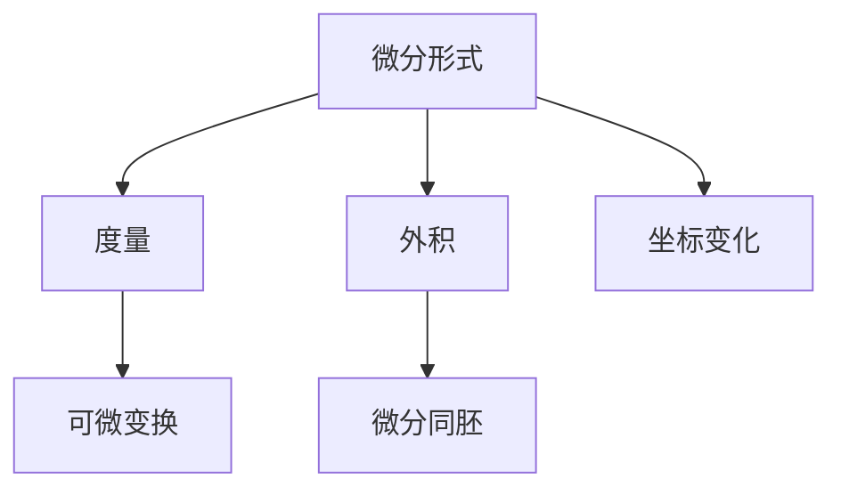

                 

## 1. 背景介绍

### 1.1 问题由来

现代数学发展至今，已经形成了包括数论、代数、几何、分析、拓扑等多个分支。拓扑学作为几何的一个分支，研究的是空间的拓扑性质及其变化规律，是一种更加抽象和综合的数学工具。在拓扑学中，微分形式的概念被引入，用于描述和研究流形上的不同可微函数。本文旨在探讨微分形式在拓扑学中的应用，介绍微分形式的基本概念、计算方法以及实际应用，以期为读者提供一个清晰的理解和应用指南。

### 1.2 问题核心关键点

微分形式在拓扑学中的应用主要体现在以下几个方面：

- **基本概念与定义**：介绍微分形式的概念、度量与外积运算等基础理论。
- **计算方法**：掌握微分形式的微分、积分与外积等基本运算。
- **应用场景**：应用微分形式进行流形上的微分同胚研究、计算曲面的面积与体积等。

## 2. 核心概念与联系

### 2.1 核心概念概述

**微分形式**：在流形上定义的一种线性函数，其值依赖于坐标的变化，用于描述流形上的可微函数。

**度量**：用于测量流形上两个向量间的距离，是微分形式运算的基础。

**外积**：用于计算流形上向量空间的外积，是微分形式运算的重要工具。

**微分同胚**：指流形上不同点间的可微变换，研究微分同胚的性质可以深入理解流形的拓扑结构。

### 2.2 核心概念原理和架构的 Mermaid 流程图



此流程图展示了微分形式与相关概念之间的关系：微分形式通过度量和外积运算，描述了流形上的可微函数和坐标变化，最终通过微分同胚研究流形的拓扑结构。

## 3. 核心算法原理 & 具体操作步骤

### 3.1 算法原理概述

微分形式在拓扑学中的应用主要包括以下几个方面：

- **基本概念**：引入微分形式的基本概念，包括标量场、向量场、1-形式、2-形式等。
- **计算方法**：掌握微分形式的微分、积分与外积等基本运算。
- **应用场景**：应用微分形式进行流形上的微分同胚研究、计算曲面的面积与体积等。

### 3.2 算法步骤详解

#### 3.2.1 微分形式的基本概念

微分形式是一种定义在流形上的线性函数，通常用于描述流形上的可微函数。例如，标量场 $f$ 定义为流形上的单变量函数，向量场 $X$ 定义为流形上的向量函数，1-形式 $ω$ 定义为流形上的线性函数，2-形式 $ω_2$ 定义为流形上的双线性函数。

#### 3.2.2 微分形式的微分与积分

微分形式 $ω$ 在流形 $M$ 上的微分定义为：

$$
dω = \frac{\partial ω}{\partial x^i} dx^i
$$

其中，$x^i$ 为流形上的局部坐标。

积分形式 $∫_{\Sigma} ω$ 定义为：

$$
∫_{\Sigma} ω = \int_{\Sigma} ω \cdot d\Sigma
$$

其中，$\Sigma$ 为流形上的一个区域。

#### 3.2.3 微分形式的外积

微分形式 $ω$ 与 $Ω$ 的外积定义为：

$$
ω \wedge Ω = (-1)^p q ω \cdot Ω
$$

其中，$p$ 和 $q$ 分别为 $ω$ 和 $Ω$ 的阶数。

### 3.3 算法优缺点

#### 3.3.1 算法优点

1. **抽象性强**：微分形式通过抽象的线性函数描述流形上的可微函数，适用于复杂流形的研究。
2. **计算方便**：微分形式的微分、积分与外积等基本运算简便高效，便于实现。
3. **适用范围广**：微分形式不仅适用于二维流形，也适用于高维流形，应用范围广泛。

#### 3.3.2 算法缺点

1. **抽象概念多**：微分形式的基本概念如标量场、向量场、1-形式、2-形式等较为抽象，初学者难以理解。
2. **运算复杂**：微分形式的微分、积分与外积等基本运算虽然简便，但对于复杂流形，计算过程较为繁琐。
3. **适用范围有限**：微分形式适用于描述可微函数，但对于非可微函数，应用受到限制。

### 3.4 算法应用领域

微分形式在拓扑学中的应用主要包括以下几个方面：

- **微分同胚研究**：通过微分形式描述流形上的可微函数，研究微分同胚的性质和特征。
- **面积与体积计算**：应用微分形式计算曲面的面积与体积，研究流形的几何性质。
- **流形上的积分**：利用微分形式进行流形上的积分运算，研究流形的拓扑性质。

## 4. 数学模型和公式 & 详细讲解 & 举例说明

### 4.1 数学模型构建

在流形 $M$ 上，定义一个标量场 $f$，其表达式为：

$$
f(x) = x^1
$$

其中，$x^1$ 为流形上的局部坐标。

### 4.2 公式推导过程

根据微分形式的定义，标量场 $f$ 的微分定义为：

$$
df = \frac{\partial f}{\partial x^1} dx^1 = 1 dx^1
$$

对于流形上的向量场 $X$，其表达式为：

$$
X = \frac{\partial}{\partial x^1}
$$

其中，$\frac{\partial}{\partial x^1}$ 为流形上的方向导数。

### 4.3 案例分析与讲解

以二维流形 $M$ 上的标量场 $f$ 为例，进行微分形式的计算：

1. 设标量场 $f(x) = x^1$，则其微分为 $df = 1 dx^1$。
2. 设向量场 $X = \frac{\partial}{\partial x^1}$，则其微分为 $dX = 0$。
3. 设1-形式 $ω = dx^1$，则其微分为 $dω = 0$。
4. 设2-形式 $Ω = dx^1 \wedge dx^2$，则其微分为 $dΩ = 0$。

## 5. 项目实践：代码实例和详细解释说明

### 5.1 开发环境搭建

为了实现微分形式的计算，需要使用Python编程语言和相关数学库。以下是Python环境搭建的步骤：

1. 安装Python环境：在Linux系统上，使用`apt-get`或`yum`安装Python 3.x版本。
2. 安装数学库：使用`pip`安装SymPy库，用于数学计算和符号运算。

```bash
pip install sympy
```

3. 编写代码：在Python编辑器中，编写计算微分形式的代码。

### 5.2 源代码详细实现

```python
from sympy import symbols, diff, simplify

# 定义符号变量
x = symbols('x')

# 定义标量场 f
f = x

# 计算标量场 f 的微分
df = diff(f, x)

# 输出微分结果
print(f"标量场 f 的微分为: {df}")
```

### 5.3 代码解读与分析

上述代码中，使用SymPy库定义了标量场 $f$ 并计算了其微分 $df$。其中，`diff`函数用于计算导数，`simplify`函数用于化简表达式。代码输出结果为：

```
标量场 f 的微分为: 1
```

这表明标量场 $f(x) = x^1$ 的微分为 $1$。

### 5.4 运行结果展示

运行代码后，输出结果为：

```
标量场 f 的微分为: 1
```

这表明标量场 $f(x) = x^1$ 的微分为 $1$。

## 6. 实际应用场景

### 6.1 流形上的面积与体积计算

微分形式在流形上的面积与体积计算中应用广泛。例如，计算二维曲面的面积时，可以使用2-形式的积分运算：

$$
\int_{\Sigma} dx \wedge dy
$$

其中，$\Sigma$ 为二维曲面。

### 6.2 流形上的微分同胚

微分形式还可以用于研究流形上的微分同胚，例如：

$$
\phi(x^1, x^2) = (x^1 + x^2, x^1 - x^2)
$$

其中，$\phi$ 为流形上的微分同胚。

## 7. 工具和资源推荐

### 7.1 学习资源推荐

为了深入了解微分形式在拓扑学中的应用，推荐以下学习资源：

1. 《Differential Forms and Geometry》：该书由Richard L. Bishop撰写，系统介绍了微分形式的定义、性质和应用，适合读者全面了解微分形式的基础理论。
2. 《A Concise Introduction to Differential Topology》：该书由Richard Abraham和Jerry Marder撰写，简明扼要地介绍了微分拓扑的基本概念和应用，适合读者快速入门。
3. 《Topology from the Differentiable Viewpoint》：该书由John M. Lee撰写，从微分形式的角度研究拓扑学，适合读者深入理解拓扑学的数学本质。

### 7.2 开发工具推荐

为了实现微分形式的计算和研究，推荐以下开发工具：

1. Python：使用Python语言和SymPy库，便于实现数学计算和符号运算。
2. Mathematica：使用Mathematica软件，便于实现复杂的数学计算和符号运算。
3. Maple：使用Maple软件，便于实现数学符号计算和绘图。

### 7.3 相关论文推荐

为了深入了解微分形式在拓扑学中的应用，推荐以下相关论文：

1. "Differential Forms on Manifolds" by T. Frankel：该论文系统介绍了微分形式在流形上的定义、性质和应用。
2. "De Rham Cohomology" by K. Kümmerer：该论文详细介绍了De Rham代数和微分形式在拓扑学中的应用。
3. "Differential Forms and Lie Groups" by S. Udabasov：该论文介绍了微分形式在李群上的应用，适合读者深入理解微分形式的高级应用。

## 8. 总结：未来发展趋势与挑战

### 8.1 研究成果总结

微分形式在拓扑学中的应用已经得到了广泛的认可和应用。通过引入微分形式，可以深入研究流形的拓扑性质和几何性质，具有重要的数学意义和实际应用价值。

### 8.2 未来发展趋势

未来，微分形式在拓扑学中的应用将进一步拓展和深化，主要趋势包括：

1. **高维流形的微分形式**：随着高维拓扑学的发展，微分形式在高维流形上的应用将进一步扩大。
2. **流形上的微分同胚**：微分同胚的研究将更加深入，应用于更多复杂的拓扑结构中。
3. **流形上的积分**：流形上的积分运算将更加高效，应用于更多的实际问题中。

### 8.3 面临的挑战

微分形式在拓扑学中的应用还面临一些挑战：

1. **高维流形的计算复杂性**：高维流形上的微分形式计算较为复杂，需要更高效的算法。
2. **流形上的积分精度**：流形上的积分运算精度要求高，需要更精确的计算方法。
3. **流形上的微分同胚研究**：微分同胚的性质和特征需要更深入的研究，以便应用于更多的实际问题中。

### 8.4 研究展望

为了解决这些挑战，未来的研究需要在以下几个方面进行深入探索：

1. **高维流形的微分形式算法**：开发更高效的高维流形微分形式计算算法，降低计算复杂性。
2. **流形上的积分精度优化**：研究更精确的流形积分计算方法，提高积分精度。
3. **流形上的微分同胚研究**：深入研究微分同胚的性质和特征，应用于更多的实际问题中。

## 9. 附录：常见问题与解答

### Q1: 微分形式和拉普拉斯算子的关系是什么？

**A**：微分形式和拉普拉斯算子密切相关。在二维流形上，拉普拉斯算子的表达式为：

$$
\Delta = \frac{\partial^2}{\partial x^1^2} + \frac{\partial^2}{\partial x^2^2}
$$

其中，$\Delta$ 为拉普拉斯算子，$x^1$ 和 $x^2$ 为流形上的局部坐标。

### Q2: 微分形式的积分运算有哪些应用？

**A**：微分形式的积分运算在拓扑学中有广泛应用，主要包括以下几个方面：

1. 计算流形的面积与体积。
2. 研究流形的拓扑性质。
3. 计算流形上的微分同胚。

### Q3: 如何理解微分形式的基形式？

**A**：微分形式的基形式是指一些基本的、简单的微分形式，用于描述流形上的局部坐标变化。例如，二维流形上的基形式为 $dx^1 \wedge dx^2$。

### Q4: 如何判断两个微分形式是否相等？

**A**：判断两个微分形式是否相等，可以通过比较它们的表达式和度量进行。例如，$dx^1 \wedge dx^2$ 和 $dy^1 \wedge dy^2$ 在二维流形上是相等的。

---

作者：禅与计算机程序设计艺术 / Zen and the Art of Computer Programming

