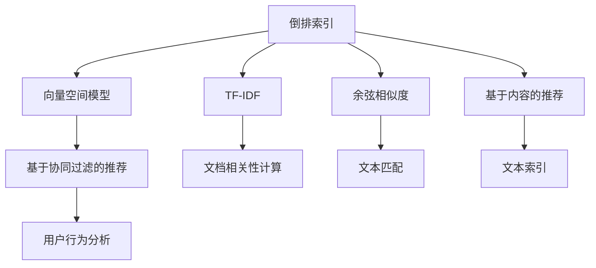

                 

# 传统搜索推荐系统的索引和匹配算法

> 关键词：索引算法,匹配算法,搜索推荐系统,倒排索引,向量空间模型,VSM,TF-IDF,向量夹角,余弦相似度,基于内容推荐,协同过滤,用户行为分析,系统性能优化

## 1. 背景介绍

### 1.1 问题由来

随着互联网的迅猛发展和普及，搜索引擎和个性化推荐系统已成为人们日常生活中不可或缺的工具。搜索引擎通过索引网页内容，让用户快速定位到所需信息；推荐系统则根据用户的历史行为和偏好，为用户推荐感兴趣的内容，提升用户体验和满意度。

然而，传统的搜索推荐系统面临着诸多挑战。随着数据量的指数级增长，索引和匹配算法需要快速高效地处理海量数据，同时保证准确率和召回率。此外，推荐系统还面临着冷启动问题、长尾效应、模型泛化能力不足等难题，这些问题亟需新的技术和算法来解决。

### 1.2 问题核心关键点

本文将重点探讨传统搜索推荐系统的索引和匹配算法，包括倒排索引、向量空间模型、TF-IDF、余弦相似度等核心概念，并结合实际应用场景，探讨如何优化算法性能，提升搜索推荐系统的效果。

## 2. 核心概念与联系

### 2.1 核心概念概述

在传统搜索推荐系统中，索引和匹配算法起着至关重要的作用。为了更好地理解这些算法的原理和架构，本节将介绍几个核心概念：

- **倒排索引(Inverted Index)**：用于快速定位包含特定关键词的文档集合，通过将关键词映射到包含该关键词的文档列表，实现高效的文档检索。
- **向量空间模型(Vector Space Model, VSM)**：将文本转换为向量形式，通过计算向量间的相似度来度量文本之间的相关性。
- **TF-IDF (Term Frequency-Inverse Document Frequency)**：一种用于评估文本中单词重要性的统计方法，通过计算单词在文档和整个语料库中的频率和逆文档频率，反映单词的重要性。
- **余弦相似度(Cosine Similarity)**：用于计算两个向量之间的相似度，常用于向量空间模型中，衡量文本之间的相关性。

这些核心概念之间的逻辑关系可以通过以下Mermaid流程图来展示：



这个流程图展示了一些核心概念及其之间的关系：

1. 倒排索引和向量空间模型共同构成了传统的文本检索基础，通过关键词和文本向量的匹配实现高效的检索。
2. TF-IDF用于计算单词重要性，常与向量空间模型结合，提升文本匹配的准确性。
3. 余弦相似度用于衡量文本之间的相关性，常用于向量空间模型中。
4. 基于内容的推荐和协同过滤推荐是两种主要的推荐算法，它们都依赖于文本匹配和用户行为分析。

这些概念共同构成了传统搜索推荐系统的核心，使得系统能够在海量的文本数据中高效检索信息，并为用户推荐感兴趣的内容。

## 3. 核心算法原理 & 具体操作步骤

### 3.1 算法原理概述

在传统的搜索推荐系统中，索引和匹配算法通常采用倒排索引和向量空间模型。具体流程如下：

1. **构建倒排索引**：对所有文本进行预处理，包括分词、去除停用词、提取关键词等。将关键词与包含该关键词的文档列表关联，形成倒排索引。
2. **文本表示与匹配**：将用户查询和文档转换为向量形式，通过余弦相似度等方法计算文本间的相似度，找出最相关的文档。
3. **推荐系统调用**：根据用户的行为数据和文本匹配结果，调用推荐算法推荐文档。

### 3.2 算法步骤详解

以下是倒排索引和向量空间模型算法的详细步骤：

**Step 1: 预处理文本**
- 对所有文本进行预处理，包括分词、去除停用词、提取关键词等。
- 例如，可以使用NLTK、jieba等分词工具对中文文本进行分词。

**Step 2: 构建倒排索引**
- 遍历所有文档，对每个文档提取关键词。
- 将每个关键词与其出现的文档列表关联，形成倒排索引。
- 倒排索引通常采用字典结构实现，快速定位到包含特定关键词的文档。

**Step 3: 文本表示**
- 将用户查询和文档转换为向量形式。
- 例如，可以使用TF-IDF对每个单词进行加权，将其转换为向量。

**Step 4: 计算相似度**
- 计算用户查询向量与每个文档向量之间的余弦相似度。
- 余弦相似度的计算公式为：
$$
\cos(\theta) = \frac{\vec{u} \cdot \vec{d}}{\lVert \vec{u} \rVert \cdot \lVert \vec{d} \rVert}
$$
其中 $\vec{u}$ 和 $\vec{d}$ 分别为用户查询向量和文档向量。

**Step 5: 匹配和推荐**
- 根据余弦相似度排序，选择相似度最高的文档。
- 结合用户行为数据和推荐算法，为用户推荐最相关的文档。

### 3.3 算法优缺点

倒排索引和向量空间模型的算法具有以下优点：

- **高效检索**：倒排索引可以快速定位包含特定关键词的文档，向量空间模型可以快速计算文本之间的相似度。
- **灵活扩展**：可处理大规模文本数据，适用于各种文本检索和推荐任务。
- **可解释性强**：用户可以直观地看到查询和文档之间的相关性。

同时，这些算法也存在一定的局限性：

- **高维度问题**：向量空间模型中的高维度问题可能导致稀疏性和计算效率问题。
- **模型泛化能力不足**：依赖于预处理步骤和模型参数，可能对新文档的适应性较差。
- **冷启动问题**：对于新用户和新文档，需要更多的数据和预处理来构建准确的倒排索引和向量空间模型。

尽管存在这些局限性，但倒排索引和向量空间模型仍然是传统搜索推荐系统的核心技术，具有广泛的应用前景。

### 3.4 算法应用领域

倒排索引和向量空间模型广泛应用于各种文本检索和推荐任务中，例如：

- 搜索引擎：如Google、Bing等，通过倒排索引和向量空间模型实现高效的文本检索。
- 个性化推荐系统：如Amazon、Netflix等，通过向量空间模型推荐用户感兴趣的商品或内容。
- 信息检索系统：如Elasticsearch、Solr等，通过倒排索引实现高效的文本检索和查询。
- 文本分类系统：如文本摘要、情感分析等，通过向量空间模型分类文本。

这些应用场景展示了倒排索引和向量空间模型的强大功能，使得它们成为文本处理和信息检索领域的标准技术。

## 4. 数学模型和公式 & 详细讲解 & 举例说明

### 4.1 数学模型构建

在向量空间模型中，文本被表示为一个向量，其中每个维度对应一个单词，向量的值反映了单词在文本中的重要性。例如，对于文本 "This is a good book"，可以将其表示为：

$$
\vec{t} = (1, 1, 1, 1, 0, 0, \dots)
$$

其中第1、2、3、4个维度分别对应单词 "This"、"is"、"a"、"good"，其值1表示单词在文本中出现了1次。

### 4.2 公式推导过程

向量空间模型中，文本向量 $\vec{t}$ 和用户查询向量 $\vec{q}$ 之间的余弦相似度可以表示为：

$$
\cos(\theta) = \frac{\vec{t} \cdot \vec{q}}{\lVert \vec{t} \rVert \cdot \lVert \vec{q} \rVert}
$$

其中 $\cdot$ 表示向量点积，$\lVert \cdot \rVert$ 表示向量的模长。

将 $\vec{t} = (t_1, t_2, \dots, t_n)$ 和 $\vec{q} = (q_1, q_2, \dots, q_n)$ 带入公式，得到：

$$
\cos(\theta) = \frac{\sum_{i=1}^n t_iq_i}{\sqrt{\sum_{i=1}^n t_i^2} \sqrt{\sum_{i=1}^n q_i^2}}
$$

这就是余弦相似度的计算公式。

### 4.3 案例分析与讲解

以推荐系统为例，假设用户 $u$ 对电影 "Inception" 有很高的评分，表示用户喜欢这类科幻电影。系统通过倒排索引和向量空间模型，将 "Inception" 与包含该关键词的文档列表关联，计算其向量表示。然后，对于其他电影，系统计算其与用户喜好的向量相似度，选择相似度最高的电影进行推荐。

例如，电影 "Interstellar" 的向量表示为 $(1, 0, 1, 0, \dots)$，其中前两个维度分别对应 "Inception" 和 "Interstellar"。系统计算用户喜好的向量 $(1, 1, 1, 0, 0, \dots)$ 与 "Interstellar" 的向量 $(1, 0, 1, 0, \dots)$ 的余弦相似度为：

$$
\cos(\theta) = \frac{1 \cdot 1 + 0 \cdot 0 + 1 \cdot 1 + 0 \cdot 0 + 0 \cdot 0 + \dots}{\sqrt{1^2 + 1^2 + 1^2 + 0^2 + 0^2} \sqrt{1^2 + 0^2 + 1^2 + 0^2 + 0^2 + \dots}} = \frac{2}{\sqrt{3} \cdot \sqrt{2}} = \frac{\sqrt{2}}{\sqrt{3}} \approx 0.471
$$

根据余弦相似度排序，"Interstellar" 与用户喜好的电影相似度较高，因此系统推荐该电影给用户。

## 5. 项目实践：代码实例和详细解释说明

### 5.1 开发环境搭建

在进行文本检索和推荐系统的开发前，我们需要准备好开发环境。以下是使用Python进行搜索引擎和推荐系统开发的常见环境配置流程：

1. 安装Python：从官网下载并安装Python，建议使用3.6或更高版本。
2. 安装依赖包：使用pip安装必要的Python包，如NLTK、scikit-learn、pandas等。
3. 配置IDE：推荐使用PyCharm、Jupyter Notebook等IDE进行开发。
4. 构建倒排索引：使用Python编写代码，对文本进行预处理和倒排索引构建。

### 5.2 源代码详细实现

以下是一个简单的Python代码实现，用于构建倒排索引和计算文本相似度：

```python
import nltk
from collections import defaultdict
from sklearn.feature_extraction.text import TfidfVectorizer

# 预处理函数
def preprocess(text):
    tokens = nltk.word_tokenize(text.lower())
    tokens = [token for token in tokens if token.isalpha()]
    return " ".join(tokens)

# 构建倒排索引
def build_inverted_index(texts):
    inverted_index = defaultdict(list)
    tfidf = TfidfVectorizer()
    
    for text in texts:
        text = preprocess(text)
        features = tfidf.fit_transform([text])
        index = features.toarray().argmax(axis=1)[0]
        for i in index:
            inverted_index[i].append(text)
    
    return inverted_index, tfidf

# 计算相似度
def cosine_similarity(query, index, tfidf):
    features = tfidf.transform([query])
    index = index[features.toarray().argmax(axis=1)[0]]
    query = tfidf.transform([query])
    similarity = (query * index.T).A[0] / (query.T.dot(query) * index.T.dot(index))
    return similarity

# 测试代码
texts = ["This is a good book", "The Matrix is a great movie", "Inception is a mind-blowing film"]
query = "Inception is great"
inverted_index, tfidf = build_inverted_index(texts)
similarity = cosine_similarity(query, inverted_index, tfidf)
print(similarity)
```

这段代码实现了对文本进行预处理、构建倒排索引和计算文本相似度。在实际应用中，可以进一步扩展和优化代码，例如引入TF-IDF权重、使用向量化表示、多维度相似度计算等。

### 5.3 代码解读与分析

让我们再详细解读一下关键代码的实现细节：

**preprocess函数**：
- 对文本进行分词、去除停用词等预处理。
- 返回处理后的文本字符串。

**build_inverted_index函数**：
- 遍历所有文本，提取关键词，构建倒排索引。
- 使用TfidfVectorizer计算文本向量化表示。
- 将关键词与包含该关键词的文档列表关联，形成倒排索引。

**cosine_similarity函数**：
- 计算用户查询与每个文档之间的余弦相似度。
- 使用TfidfVectorizer将查询和文档向量化为稀疏矩阵。
- 计算向量点积和模长，得到余弦相似度。

**测试代码**：
- 输入文本和查询，调用build_inverted_index和cosine_similarity函数计算相似度。

这段代码展示了如何使用Python实现基本的文本检索和相似度计算。实际应用中，可以通过增加更多的特征提取和模型优化来提升性能。

## 6. 实际应用场景

### 6.1 搜索引擎

搜索引擎是倒排索引和向量空间模型应用最广泛的场景之一。以Google搜索引擎为例，它通过倒排索引快速定位包含特定关键词的网页，使用向量空间模型计算查询与网页的相似度，从而实现高效的文本检索。

在实际应用中，Google还引入了更多高级技术，如PageRank算法、TF-IDF权重调整、自动补全等，进一步提升搜索结果的相关性和用户体验。

### 6.2 个性化推荐系统

个性化推荐系统是向量空间模型在推荐算法中的典型应用。以Amazon推荐系统为例，它通过构建用户-商品向量化表示，计算用户查询和商品之间的相似度，推荐用户可能感兴趣的商品。

Amazon还引入了基于协同过滤的推荐算法，利用用户行为数据，推荐与用户历史偏好相似的商品。此外，Amazon还引入了更多高级技术，如深度学习模型、实时流处理、实时更新等，提升推荐系统的实时性和精准性。

### 6.3 信息检索系统

信息检索系统如Elasticsearch、Solr等，通过倒排索引实现高效的文本检索。它们提供丰富的API和插件，支持复杂的查询语句、实时索引、分布式部署等功能，广泛应用于企业级搜索和信息管理。

### 6.4 文本分类系统

文本分类系统如文本摘要、情感分析等，通过向量空间模型分类文本。例如，可以使用TF-IDF计算每个单词的重要性，将文本表示为向量形式，使用KNN或SVM等算法分类文本。

## 7. 工具和资源推荐

### 7.1 学习资源推荐

为了帮助开发者系统掌握传统搜索推荐系统的索引和匹配算法，这里推荐一些优质的学习资源：

1. 《信息检索基础》课程：斯坦福大学开设的课程，讲解信息检索的基本原理和算法。
2. 《推荐系统实践》书籍：介绍推荐系统的算法和实现方法，涵盖协同过滤、基于内容的推荐等。
3. 《深度学习与推荐系统》书籍：介绍深度学习在推荐系统中的应用，涵盖神经网络、深度学习框架等。
4. CS224N《自然语言处理》课程：斯坦福大学开设的课程，讲解自然语言处理的基本概念和算法。
5. Coursera《搜索引擎》课程：由斯坦福大学和谷歌联合开设的课程，讲解搜索引擎的核心技术和实现方法。

通过对这些资源的学习实践，相信你一定能够全面掌握传统搜索推荐系统的索引和匹配算法，并用于解决实际的文本检索和推荐问题。

### 7.2 开发工具推荐

高效的开发离不开优秀的工具支持。以下是几款用于搜索引擎和推荐系统开发的常用工具：

1. NLTK：自然语言处理工具包，支持文本预处理、分词、特征提取等。
2. scikit-learn：机器学习库，支持TF-IDF、余弦相似度等算法实现。
3. Elasticsearch：企业级搜索引擎，支持倒排索引和高级查询。
4. TfidfVectorizer：sklearn库中的TF-IDF实现，用于文本向量化。
5. PyTorch：深度学习框架，支持神经网络模型实现。

合理利用这些工具，可以显著提升搜索引擎和推荐系统的开发效率，加快创新迭代的步伐。

### 7.3 相关论文推荐

传统搜索推荐系统的索引和匹配算法的发展源于学界的持续研究。以下是几篇奠基性的相关论文，推荐阅读：

1. Okapi《Okapi》：一种基于TF-IDF的搜索引擎评分算法，广泛应用于现代搜索引擎中。
2. A Gentle Introduction to the Infroretion Retrieval Modeling：介绍向量空间模型的基本原理和实现方法。
3. Semantic Search：一种基于语义的搜索引擎，通过语义相似度提升检索效果。
4. Dive Into Meerkat：介绍信息检索系统Elasticsearch的核心技术和实现方法。

这些论文代表了大语言模型微调技术的发展脉络。通过学习这些前沿成果，可以帮助研究者把握学科前进方向，激发更多的创新灵感。

## 8. 总结：未来发展趋势与挑战

### 8.1 总结

本文对传统搜索推荐系统的索引和匹配算法进行了全面系统的介绍。首先阐述了倒排索引和向量空间模型的基本原理和实现方法，明确了这些算法在搜索引擎、个性化推荐系统等应用场景中的重要价值。其次，从原理到实践，详细讲解了算法的数学模型和代码实现，给出了搜索引擎和推荐系统的完整代码实例。同时，本文还探讨了算法的优缺点和实际应用场景，展示了算法的强大功能和广泛应用。

通过本文的系统梳理，可以看到，传统的索引和匹配算法在搜索引擎和推荐系统中发挥着重要的作用，显著提升了信息检索和推荐的效果。未来，随着算法的不断优化和扩展，这些技术将更加高效、灵活地服务于用户，推动搜索引擎和推荐系统的持续进步。

### 8.2 未来发展趋势

展望未来，传统的搜索推荐系统将呈现以下几个发展趋势：

1. **更高效的数据索引**：随着数据量的不断增加，高效的数据索引技术将成为重要研究方向。例如，分布式索引、实时索引等技术将进一步提升系统性能。
2. **更精准的相似度计算**：未来的相似度计算将结合更多语义信息，例如使用预训练语言模型计算文本相似度，提升检索和推荐的精准度。
3. **更智能的推荐算法**：基于深度学习的推荐算法将逐步取代传统的协同过滤和基于内容的推荐算法，实现更精准、更个性化的推荐。
4. **更高效的多维度检索**：未来的检索系统将支持多维度、多模态的数据处理，例如结合图像、视频等多模态信息，提升检索系统的表现。
5. **更灵活的个性化推荐**：未来的推荐系统将更加灵活，支持更广泛的推荐策略，例如基于序列预测、实时动态调整等。

以上趋势展示了传统搜索推荐系统的发展方向，这些方向的探索将进一步提升系统性能和用户体验。

### 8.3 面临的挑战

尽管传统的搜索推荐系统已经取得了显著成果，但在迈向更加智能化、普适化应用的过程中，它仍面临着诸多挑战：

1. **数据稀疏性**：随着数据量的增加，长尾数据和稀疏数据的处理将成为重要问题，如何高效处理这些数据将是一大难题。
2. **模型泛化能力**：现有算法往往依赖于数据分布，对于新数据的适应性较差，如何提升模型的泛化能力将成为研究重点。
3. **计算效率**：大规模数据和高维度特征的计算效率将成为制约系统性能的因素，如何优化计算过程将是重要研究方向。
4. **冷启动问题**：对于新用户和新文档，如何高效构建准确的索引和模型，提供满意的推荐和检索服务，将是挑战之一。
5. **系统安全性**：推荐系统可能被恶意用户利用，例如通过伪造数据进行推荐，如何保障系统安全性将是重要课题。

### 8.4 研究展望

面对传统搜索推荐系统面临的挑战，未来的研究需要在以下几个方面寻求新的突破：

1. **优化索引算法**：开发更加高效、灵活的数据索引算法，如分布式索引、实时索引等，提升系统性能。
2. **改进相似度计算**：结合预训练语言模型、多模态信息等，提升文本相似度的计算精度，增强系统表现。
3. **引入深度学习**：结合深度学习模型，提升推荐系统的精准度和个性化水平，探索更多推荐策略。
4. **引入专家知识**：将专家知识与算法结合，提升系统的智能水平，例如引入语义分析、知识图谱等。
5. **保障系统安全**：加强系统安全性保障，例如通过数据验证、异常检测等手段，防止恶意攻击和数据滥用。

这些研究方向将引领传统搜索推荐系统迈向更高的台阶，为搜索引擎、推荐系统等应用场景带来新的突破和发展。相信随着研究的不断深入和技术的不断进步，传统的搜索推荐系统将继续发挥重要作用，为人类社会带来更多的便利和智慧。

## 9. 附录：常见问题与解答

**Q1：传统的搜索推荐系统与现代的推荐系统有何不同？**

A: 传统的搜索推荐系统主要依赖于倒排索引和向量空间模型，适用于信息检索和基于内容的推荐。现代的推荐系统则引入了更多高级技术，例如深度学习、协同过滤、实时流处理等，支持更精准、更个性化的推荐，例如电商推荐、音乐推荐等。

**Q2：传统的文本检索算法有哪些优缺点？**

A: 传统的文本检索算法具有高效检索、可解释性强等优点。但是，它们依赖于预处理步骤和模型参数，对于新文档的适应性较差。此外，高维度问题和计算效率问题也是传统算法面临的挑战。

**Q3：如何优化倒排索引和向量空间模型的性能？**

A: 可以采用分布式索引、实时索引等技术，提高索引的效率。同时，结合TF-IDF权重调整、多维相似度计算等方法，提升相似度计算的精度。此外，可以使用深度学习模型等技术，进一步提升系统的表现。

**Q4：推荐系统如何处理冷启动问题？**

A: 可以通过引入用户行为数据、利用领域知识、使用深度学习模型等方式解决冷启动问题。例如，可以通过在线学习、贝叶斯推理等方法，逐步构建准确的模型。

**Q5：推荐系统如何保障系统安全性？**

A: 可以通过数据验证、异常检测、访问控制等手段保障系统安全性。例如，对于电商推荐系统，可以通过验证用户行为数据、监控异常交易等方式，防止恶意攻击和数据滥用。

总之，传统的搜索推荐系统在文本检索和推荐算法中仍然发挥着重要作用，未来将结合更多先进技术和算法，实现更高效、更智能的推荐和检索服务。通过不断优化和创新，这些技术将为搜索引擎、推荐系统等领域带来更大的突破和发展。

