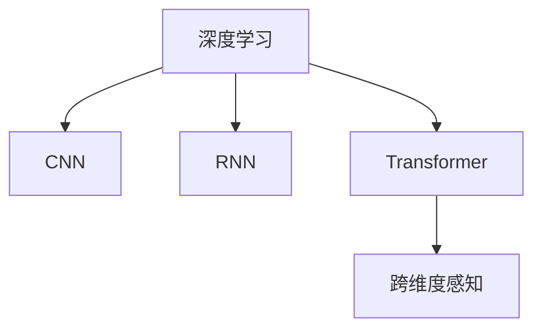

                 

## 1. 背景介绍

### 1.1 问题由来

科技的进步已经使我们能够在一定程度上跨越时空，通过互联网、卫星通信等技术，人们能够即时连接全球各地。但这种连接方式仍然是线性的，信息传输速度仍然受限于物理极限。

如何进一步提升信息的传输速度和深度，使得人类能够以更高维度的视角来理解和处理信息？人工智能（AI）在这方面的探索已经取得了显著的进展，尤其是通过深度学习（Deep Learning）的突破，我们正逐渐迈向一种全新的“时空穿越”状态，即**跨维度感知**。

### 1.2 问题核心关键点

跨维度感知是指通过高维数据（如图像、音频、文本等）的深度学习和处理，使得机器能够理解并表达信息的更深层次含义，从而实现跨维度的信息传输和处理。这种技术在自动驾驶、自然语言处理、语音识别、医学影像分析等领域已经得到了广泛应用。

目前，深度学习模型如卷积神经网络（CNN）、循环神经网络（RNN）、Transformer等在跨维度感知中扮演了重要角色。它们通过层层的特征提取、编码、解码等操作，从原始数据中提取出高层次的特征，进而实现复杂的分类、生成、预测等任务。

### 1.3 问题研究意义

研究跨维度感知，对于拓展人类对信息的理解和处理能力，推动技术革新和社会进步，具有重要意义：

1. **信息处理效率提升**：通过高维数据的学习，AI能够自动提取出信息的关键特征，加速信息处理速度。
2. **跨领域应用拓展**：跨维度感知技术可以跨越不同领域，提升各个行业的智能化水平。
3. **跨维度信息传输**：通过多模态数据的融合，实现不同领域信息的高效传输和共享。
4. **数据智能分析**：通过深度学习，可以从海量数据中挖掘出有价值的信息，提高决策的科学性和准确性。
5. **智能交互体验**：跨维度感知技术可以实现更加自然、智能的人机交互体验，如语音助手、智能家居等。

## 2. 核心概念与联系

### 2.1 核心概念概述

要深入理解跨维度感知，我们需要了解几个核心概念：

- **深度学习**：基于多层神经网络模型的学习范式，通过层级结构从数据中自动提取特征，实现复杂模式的识别和处理。
- **卷积神经网络（CNN）**：主要用于图像处理，通过卷积层、池化层、全连接层等操作，实现图像的特征提取和分类。
- **循环神经网络（RNN）**：主要用于序列数据处理，通过循环结构捕捉数据的时序关系，实现语音识别、自然语言处理等任务。
- **Transformer**：一种基于自注意力机制的神经网络结构，用于处理序列数据，已经在机器翻译、语音识别、图像描述生成等任务中取得显著成果。
- **跨维度感知**：通过高维数据的深度学习，实现不同模态（如文本、图像、音频等）信息的融合和理解，提升信息处理的深度和广度。

这些核心概念之间的逻辑关系可以通过以下Mermaid流程图来展示：



这个流程图展示出深度学习如何通过不同类型的神经网络，实现跨维度感知的能力。

## 3. 核心算法原理 & 具体操作步骤

### 3.1 算法原理概述

跨维度感知的核心算法原理在于，通过深度学习模型，对高维数据进行特征提取和融合，实现信息的跨维度理解和处理。具体而言，深度学习模型通过对数据的逐层抽象，提取其中的关键特征，进而实现信息的编码和解码，最终完成信息的分类、生成、预测等任务。

### 3.2 算法步骤详解

以下是一般的跨维度感知算法步骤：

**Step 1: 数据预处理**

对原始数据进行预处理，包括数据清洗、归一化、标准化等操作，将数据转换为深度学习模型所需的格式。

**Step 2: 模型搭建**

根据任务类型选择合适的深度学习模型结构，如CNN、RNN、Transformer等。调整模型的超参数，如层数、节点数、激活函数等，以适应特定的任务需求。

**Step 3: 模型训练**

使用训练集数据对模型进行训练，最小化损失函数。通常使用随机梯度下降（SGD）、Adam等优化算法，调整模型参数，使其能够准确地预测标签。

**Step 4: 模型评估**

使用验证集对训练好的模型进行评估，计算模型在验证集上的性能指标，如准确率、召回率、F1值等，以确定模型的泛化能力。

**Step 5: 模型部署**

将训练好的模型部署到实际应用中，使用测试集对模型进行最终评估，确保模型能够在实际环境中正常工作。

### 3.3 算法优缺点

跨维度感知的深度学习模型具有以下优点：

1. **自动特征提取**：通过逐层抽象，自动提取数据的高层次特征，无需人工设计特征。
2. **跨模态融合**：能够处理不同模态的数据，实现信息的高维融合。
3. **鲁棒性强**：对噪声和缺失数据具有较强的鲁棒性，能够处理多种复杂场景。

但同时也存在一些缺点：

1. **计算资源需求高**：深度学习模型需要大量的计算资源和存储空间，训练和推理时间较长。
2. **过拟合风险**：模型容易过拟合训练集，泛化性能不足。
3. **模型复杂度高**：模型结构复杂，难以理解和调试。
4. **数据需求量大**：需要大量的标注数据，数据获取成本高。

### 3.4 算法应用领域

跨维度感知技术已经在多个领域得到广泛应用，包括：

- **自动驾驶**：通过摄像头、雷达、GPS等传感器采集的多模态数据，实现对环境的高维感知和决策。
- **医学影像分析**：利用CT、MRI等影像数据，对病变区域进行检测和分析。
- **自然语言处理（NLP）**：通过文本数据的深度学习，实现情感分析、机器翻译、语音识别等任务。
- **计算机视觉**：对图像和视频数据进行处理，实现图像分类、目标检测、人脸识别等任务。
- **机器人学**：通过多模态数据的融合，实现机器人的感知、决策和控制。

## 4. 数学模型和公式 & 详细讲解 & 举例说明

### 4.1 数学模型构建

假设我们有一组图像数据集 $\{(x_i, y_i)\}_{i=1}^N$，其中 $x_i$ 为图像数据， $y_i$ 为标签。我们的目标是训练一个卷积神经网络（CNN）模型，将输入图像分类到不同的类别。

模型由多个卷积层、池化层和全连接层构成，结构如下：

```
输入层（图像数据） --> 卷积层1 --> ReLU激活函数 --> 池化层1 --> 卷积层2 --> ReLU激活函数 --> 池化层2 --> 全连接层 --> Softmax激活函数 --> 输出层（类别标签）
```

在训练过程中，模型的损失函数通常使用交叉熵损失函数，定义为：

$$
\mathcal{L} = -\frac{1}{N}\sum_{i=1}^N \sum_{c=1}^C y_{ic}\log(\hat{y}_{ic})
$$

其中 $y_{ic}$ 为第 $i$ 个样本的第 $c$ 个类别的真实标签，$\hat{y}_{ic}$ 为模型预测的概率。

### 4.2 公式推导过程

以卷积神经网络为例，其核心操作包括卷积、池化、全连接等。下面以卷积层为例，推导其基本公式。

卷积层的公式为：

$$
h_{i,j} = g\left(\sum_{m,n}w_{m,n}x_{i-m,j-n}+b\right)
$$

其中 $h_{i,j}$ 为输出特征图在位置 $(i,j)$ 的值，$x_{i-m,j-n}$ 为输入特征图在位置 $(i-m,j-n)$ 的值，$w_{m,n}$ 为卷积核权重，$b$ 为偏置项，$g$ 为激活函数。

池化层的公式为：

$$
h_{i,j} = max(\{f_{i,j}(x_{i',j'})\}_{i'=i-m,j'=j-n})
$$

其中 $h_{i,j}$ 为输出特征图在位置 $(i,j)$ 的值，$f_{i,j}(x_{i',j'})$ 为池化函数在位置 $(i',j')$ 的计算结果。

### 4.3 案例分析与讲解

假设我们有一组手写数字图像数据集，包含 $M$ 张图像和对应的标签。我们的目标是将这些图像分类为0-9共10个数字类别。

- **数据预处理**：将图像数据进行归一化处理，将像素值缩放到 $[0,1]$ 区间。
- **模型搭建**：选择LeNet-5作为模型结构，包含卷积层、池化层和全连接层。调整模型参数，如卷积核大小、池化大小、节点数等。
- **模型训练**：使用训练集对模型进行训练，最小化交叉熵损失函数。使用随机梯度下降（SGD）优化算法，调整模型参数。
- **模型评估**：使用验证集对模型进行评估，计算准确率、召回率等指标。调整模型超参数，确保模型泛化能力。
- **模型部署**：将训练好的模型部署到实际应用中，使用测试集对模型进行最终评估，确保模型在实际环境中正常工作。

## 5. 项目实践：代码实例和详细解释说明

### 5.1 开发环境搭建

在进行跨维度感知实践前，我们需要准备好开发环境。以下是使用Python进行TensorFlow开发的环境配置流程：

1. 安装Anaconda：从官网下载并安装Anaconda，用于创建独立的Python环境。

2. 创建并激活虚拟环境：
```bash
conda create -n tf-env python=3.8 
conda activate tf-env
```

3. 安装TensorFlow：根据CUDA版本，从官网获取对应的安装命令。例如：
```bash
conda install tensorflow -c pytorch -c conda-forge
```

4. 安装各类工具包：
```bash
pip install numpy pandas scikit-learn matplotlib tqdm jupyter notebook ipython
```

完成上述步骤后，即可在`tf-env`环境中开始跨维度感知实践。

### 5.2 源代码详细实现

下面我们以手写数字图像分类为例，给出使用TensorFlow对LeNet-5模型进行深度学习的PyTorch代码实现。

首先，定义手写数字数据集的加载函数：

```python
import tensorflow as tf
from tensorflow.keras.datasets import mnist
from tensorflow.keras.utils import to_categorical

def load_data(batch_size=128):
    (x_train, y_train), (x_test, y_test) = mnist.load_data()
    x_train = x_train.reshape(-1, 28, 28, 1) / 255.0
    x_test = x_test.reshape(-1, 28, 28, 1) / 255.0
    y_train = to_categorical(y_train)
    y_test = to_categorical(y_test)
    train_dataset = tf.data.Dataset.from_tensor_slices((x_train, y_train))
    test_dataset = tf.data.Dataset.from_tensor_slices((x_test, y_test))
    train_dataset = train_dataset.batch(batch_size).shuffle(10000)
    test_dataset = test_dataset.batch(batch_size)
    return train_dataset, test_dataset
```

然后，定义LeNet-5模型结构：

```python
class LeNet(tf.keras.Model):
    def __init__(self):
        super(LeNet, self).__init__()
        self.conv1 = tf.keras.layers.Conv2D(6, (5, 5), padding='same', activation=tf.nn.relu)
        self.pool1 = tf.keras.layers.MaxPooling2D((2, 2), padding='same')
        self.conv2 = tf.keras.layers.Conv2D(16, (5, 5), padding='same', activation=tf.nn.relu)
        self.pool2 = tf.keras.layers.MaxPooling2D((2, 2), padding='same')
        self.flatten = tf.keras.layers.Flatten()
        self.fc1 = tf.keras.layers.Dense(120, activation=tf.nn.relu)
        self.fc2 = tf.keras.layers.Dense(84, activation=tf.nn.relu)
        self.fc3 = tf.keras.layers.Dense(10, activation=tf.nn.softmax)

    def call(self, inputs):
        x = self.conv1(inputs)
        x = self.pool1(x)
        x = self.conv2(x)
        x = self.pool2(x)
        x = self.flatten(x)
        x = self.fc1(x)
        x = self.fc2(x)
        return self.fc3(x)
```

接下来，定义训练和评估函数：

```python
import numpy as np

def train(model, train_dataset, test_dataset, epochs=10, batch_size=128):
    with tf.device('/cpu:0'):
        train_loss = tf.keras.metrics.Mean(name='train_loss')
        train_acc = tf.keras.metrics.SparseCategoricalAccuracy(name='train_acc')
        test_loss = tf.keras.metrics.Mean(name='test_loss')
        test_acc = tf.keras.metrics.SparseCategoricalAccuracy(name='test_acc')
    
    for epoch in range(epochs):
        for inputs, labels in train_dataset:
            with tf.GradientTape() as tape:
                predictions = model(inputs)
                loss = tf.keras.losses.sparse_categorical_crossentropy(labels, predictions)
            gradients = tape.gradient(loss, model.trainable_variables)
            optimizer.apply_gradients(zip(gradients, model.trainable_variables))
            train_loss.update_state(loss)
            train_acc.update_state(labels, predictions)
        
        with tf.device('/cpu:0'):
            for inputs, labels in test_dataset:
                predictions = model(inputs)
                test_loss.update_state(tf.keras.losses.sparse_categorical_crossentropy(labels, predictions))
                test_acc.update_state(labels, predictions)
        
        print(f'Epoch {epoch+1}, Loss: {train_loss.result().numpy():.4f}, Accuracy: {train_acc.result().numpy():.4f}')
        print(f'Test Loss: {test_loss.result().numpy():.4f}, Test Accuracy: {test_acc.result().numpy():.4f}')
    
    return model
```

最后，启动训练流程并在测试集上评估：

```python
train_dataset, test_dataset = load_data()
model = LeNet()
optimizer = tf.keras.optimizers.Adam()
model = train(model, train_dataset, test_dataset, epochs=10, batch_size=128)
```

以上就是使用TensorFlow对LeNet-5模型进行手写数字图像分类的完整代码实现。可以看到，通过TensorFlow，我们可以很方便地搭建和训练深度学习模型，进行跨维度感知任务的实践。

### 5.3 代码解读与分析

让我们再详细解读一下关键代码的实现细节：

**LeNet-5类定义**：
- 定义了LeNet-5模型结构，包括卷积层、池化层、全连接层等。
- 使用`super(LeNet, self).__init__()`调用父类初始化方法，确保模型结构的正确性。

**train函数**：
- 定义了训练和评估函数，包括损失计算、梯度更新、模型评估等操作。
- 使用`tf.GradientTape`计算梯度，`optimizer.apply_gradients`更新模型参数。
- 使用`tf.keras.metrics.Mean`和`tf.keras.metrics.SparseCategoricalAccuracy`计算损失和准确率。
- 在训练过程中，记录并输出训练和测试集上的损失和准确率。

**训练流程**：
- 在CPU上定义损失和准确率计算指标。
- 在每个epoch内，对训练集和测试集数据进行迭代训练和评估。
- 使用`optimizer.apply_gradients`更新模型参数。
- 在训练过程中，及时输出训练和测试集上的损失和准确率，以便监控训练过程。

通过TensorFlow的强大功能，我们能够快速实现和部署深度学习模型，进行跨维度感知任务的开发和实践。

## 6. 实际应用场景

### 6.1 智能家居

跨维度感知技术可以应用于智能家居系统中，实现环境感知和智能决策。通过摄像头、传感器等设备采集多模态数据（如图像、声音、温度等），构建高维数据集，训练跨维度感知模型，实现对环境的深度理解。例如，通过图像识别和语音识别技术，智能家居系统可以自动识别人物动作、语言指令，并做出相应的智能响应。

### 6.2 自动驾驶

自动驾驶系统依赖于跨维度感知技术，通过摄像头、雷达、GPS等传感器采集的多模态数据，构建高维数据集，训练跨维度感知模型，实现对环境的深度理解和智能决策。例如，通过图像识别和雷达感知技术，自动驾驶系统可以识别交通标志、道路条件、行人等，并做出相应的驾驶决策。

### 6.3 医学影像分析

在医学影像分析中，跨维度感知技术可以用于图像分类、病变检测、手术模拟等任务。通过构建包含CT、MRI等影像数据的高维数据集，训练跨维度感知模型，实现对医学影像的深度理解和分析。例如，通过图像分类技术，自动识别影像中的病变区域，提高诊断的准确性和效率。

### 6.4 未来应用展望

未来，跨维度感知技术将进一步拓展其应用范围，推动更多的行业智能化发展。

1. **工业制造**：通过跨维度感知技术，实现对生产设备的智能监控和故障预测，提高生产效率和产品质量。
2. **农业**：通过跨维度感知技术，实现对农作物的智能监测和生长预测，优化种植管理。
3. **能源管理**：通过跨维度感知技术，实现对能源系统的智能监控和优化，提高能源利用效率。
4. **交通管理**：通过跨维度感知技术，实现对交通流量的智能监测和分析，优化交通管理。
5. **金融分析**：通过跨维度感知技术，实现对市场数据的智能分析和预测，提高投资决策的准确性。

## 7. 工具和资源推荐

### 7.1 学习资源推荐

为了帮助开发者系统掌握跨维度感知技术，以下是一些优质的学习资源：

1. **TensorFlow官方文档**：详细介绍了TensorFlow的使用方法和实践案例，涵盖深度学习模型的搭建、训练、评估等各个环节。
2. **Keras官方文档**：提供了高层次的API接口，简化模型搭建和训练过程。
3. **《深度学习》一书**：由Ian Goodfellow等知名专家编写，全面介绍了深度学习的基本原理和实现技术。
4. **Coursera深度学习课程**：斯坦福大学开设的深度学习课程，包含视频讲解、编程作业和案例分析，适合初学者和进阶者。
5. **Kaggle数据科学竞赛**：提供大量公开数据集和模型竞赛，帮助开发者实践和提升跨维度感知技能。

### 7.2 开发工具推荐

高效的开发离不开优秀的工具支持。以下是几款用于跨维度感知开发的常用工具：

1. **TensorFlow**：由Google主导开发的深度学习框架，支持大规模分布式计算，适合复杂模型训练。
2. **Keras**：提供高层次API，简化深度学习模型搭建和训练过程。
3. **PyTorch**：由Facebook开发，支持动态图和静态图模式，灵活高效。
4. **MXNet**：由Amazon开发，支持分布式计算和高效内存管理。
5. **Caffe**：用于图像处理和计算机视觉任务，具有高效的卷积操作支持。

### 7.3 相关论文推荐

跨维度感知技术的发展离不开学界的持续研究。以下是几篇奠基性的相关论文，推荐阅读：

1. **ImageNet Classification with Deep Convolutional Neural Networks**：AlexNet论文，提出了卷积神经网络在图像分类任务中的有效性。
2. **The ImageNet Large Scale Visual Recognition Challenge**：ImageNet数据集和比赛，推动了深度学习在图像识别领域的突破。
3. **Speech and Language Processing with Neural Networks**：深度学习在语音识别和自然语言处理领域的经典论文。
4. **Attention Is All You Need**：Transformer论文，提出自注意力机制在序列数据处理中的高效性。
5. **Convolutional Neural Networks for Sentence Classification**：利用卷积神经网络进行文本分类任务的研究。

这些论文代表了大跨维度感知技术的发展脉络。通过学习这些前沿成果，可以帮助研究者把握学科前进方向，激发更多的创新灵感。

## 8. 总结：未来发展趋势与挑战

### 8.1 研究成果总结

本文对跨维度感知技术进行了全面系统的介绍。首先阐述了跨维度感知技术的研究背景和意义，明确了其在自动驾驶、医学影像分析、智能家居等领域的独特价值。其次，从原理到实践，详细讲解了跨维度感知技术的数学原理和关键步骤，给出了跨维度感知任务开发的完整代码实例。同时，本文还广泛探讨了跨维度感知技术在各个行业领域的应用前景，展示了其巨大的潜力。

### 8.2 未来发展趋势

展望未来，跨维度感知技术将呈现以下几个发展趋势：

1. **模型规模持续增大**：随着算力成本的下降和数据规模的扩张，深度学习模型参数量还将持续增长。超大规模模型蕴含的丰富特征，有望支撑更加复杂多变的任务。
2. **跨模态融合能力增强**：未来深度学习模型将能够处理更多模态的数据，实现信息的高维融合和理解。
3. **计算效率提升**：通过模型优化和算法改进，提高深度学习模型的计算效率，降低资源消耗。
4. **端到端应用拓展**：跨维度感知技术将与物联网、边缘计算等技术结合，实现端到端的智能应用。
5. **模型可解释性加强**：通过模型压缩和解释技术，提高深度学习模型的可解释性和透明度。

### 8.3 面临的挑战

尽管跨维度感知技术已经取得了瞩目成就，但在迈向更加智能化、普适化应用的过程中，它仍面临诸多挑战：

1. **数据获取成本高**：获取高质量标注数据成本较高，尤其是对于一些长尾应用场景。如何降低数据需求，减少标注工作，成为一大难题。
2. **模型复杂度**：深度学习模型结构复杂，难以理解和调试。如何简化模型结构，提高可解释性，是未来研究的重要方向。
3. **计算资源需求高**：深度学习模型需要大量的计算资源和存储空间，训练和推理时间较长。如何优化计算效率，实现快速部署，成为关键问题。
4. **模型泛化能力不足**：深度学习模型容易过拟合训练集，泛化性能不足。如何提高模型泛化能力，确保模型在实际环境中表现良好，是重要课题。
5. **伦理和安全问题**：深度学习模型可能学习到有害信息，导致模型输出偏见或歧视。如何从数据和算法层面消除模型偏见，确保输出的安全性和伦理性，将是未来研究的重要方向。

### 8.4 研究展望

面对跨维度感知面临的种种挑战，未来的研究需要在以下几个方面寻求新的突破：

1. **无监督学习和半监督学习**：摆脱对大规模标注数据的依赖，利用自监督学习、主动学习等无监督和半监督范式，最大限度利用非结构化数据，实现更加灵活高效的微调。
2. **参数高效和计算高效**：开发更加参数高效和计算高效的深度学习模型，在固定大部分预训练参数的同时，只更新极少量的任务相关参数，实现更高效的微调。
3. **跨模态数据融合**：融合不同模态的数据，实现多模态信息的整合和理解，提升信息处理的深度和广度。
4. **可解释性和鲁棒性**：引入因果分析和博弈论工具，提高模型的可解释性和鲁棒性，增强模型的决策透明度和抗干扰能力。
5. **伦理道德约束**：在模型训练目标中引入伦理导向的评估指标，过滤和惩罚有害输出倾向，确保模型输出的安全性和伦理性。

这些研究方向的探索，必将引领跨维度感知技术迈向更高的台阶，为构建安全、可靠、可解释、可控的智能系统铺平道路。面向未来，跨维度感知技术还需要与其他人工智能技术进行更深入的融合，如知识表示、因果推理、强化学习等，多路径协同发力，共同推动自然语言理解和智能交互系统的进步。只有勇于创新、敢于突破，才能不断拓展跨维度感知技术的边界，让智能技术更好地造福人类社会。

## 9. 附录：常见问题与解答

**Q1：跨维度感知技术在实际应用中面临哪些挑战？**

A: 跨维度感知技术在实际应用中面临以下挑战：
1. **数据获取成本高**：获取高质量标注数据成本较高，尤其是对于一些长尾应用场景。
2. **模型复杂度**：深度学习模型结构复杂，难以理解和调试。
3. **计算资源需求高**：深度学习模型需要大量的计算资源和存储空间，训练和推理时间较长。
4. **模型泛化能力不足**：深度学习模型容易过拟合训练集，泛化性能不足。
5. **伦理和安全问题**：深度学习模型可能学习到有害信息，导致模型输出偏见或歧视。

**Q2：如何降低跨维度感知技术的计算资源需求？**

A: 降低计算资源需求可以通过以下几种方式：
1. **模型压缩**：通过模型剪枝、量化等方法，减少模型参数和计算量。
2. **分布式计算**：利用多机分布式计算，加速模型训练和推理。
3. **模型并行**：通过模型并行技术，加速模型前向传播和反向传播。
4. **硬件优化**：使用GPU、TPU等高性能硬件设备，提升计算效率。
5. **算法优化**：优化深度学习算法，减少计算量和存储需求。

**Q3：跨维度感知技术在哪些领域有应用？**

A: 跨维度感知技术已经在以下领域得到广泛应用：
1. **自动驾驶**：通过摄像头、雷达、GPS等传感器采集的多模态数据，实现对环境的深度理解和智能决策。
2. **医学影像分析**：利用CT、MRI等影像数据，对病变区域进行检测和分析。
3. **自然语言处理（NLP）**：通过文本数据的深度学习，实现情感分析、机器翻译、语音识别等任务。
4. **计算机视觉**：对图像和视频数据进行处理，实现图像分类、目标检测、人脸识别等任务。
5. **智能家居**：通过摄像头、传感器等设备采集多模态数据，构建高维数据集，训练跨维度感知模型，实现对环境的深度理解和智能决策。
6. **工业制造**：通过跨维度感知技术，实现对生产设备的智能监控和故障预测，提高生产效率和产品质量。

这些领域的应用展示了跨维度感知技术的广泛价值，未来还将拓展到更多领域，推动各行各业的智能化发展。

---

作者：禅与计算机程序设计艺术 / Zen and the Art of Computer Programming

