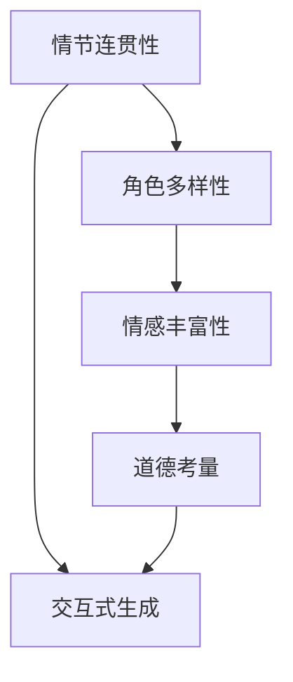

                 

## 1. 背景介绍

在人类文明的历史长河中，叙事一直是传递信息和情感的重要手段。从古希腊的史诗，到中国的《红楼梦》，叙事性文学作品以动人的情节和深刻的人性描绘，感染了一代又一代读者。然而，随着技术的发展，叙事性也面临着被“技术”所替代的危机。人类语言的独特性，以及复杂的情感和伦理冲突，使得机器难以完全理解和生成具有高度叙事性的内容。但如今，通过AI生成个人故事，这种危机正在逐步被打破，AI在叙事领域的潜力也正在被挖掘。

### 1.1 问题由来

随着深度学习、自然语言处理等技术的成熟，AI在生成文本的能力上取得了显著进步。从简单的问答到复杂的文本创作，AI已经能够生成大量可读性较高的文本内容。然而，这些文本内容往往缺乏鲜明的叙事性，难以触动人心，与人类情感共鸣。此外，叙事文本的生成需要考虑情节、角色、情感等多方面的因素，现有的AI生成方法在这些方面尚显不足。

### 1.2 问题核心关键点

生成具有高度叙事性的文本内容，关键在于能够刻画复杂的情节、塑造多面的角色、传达细腻的情感。与简单描述性文本的生成不同，叙事性文本生成需要在语义理解、情感推理和道德判断等多维度上做更深入的探索。因此，研究叙事性文本生成技术，需关注以下几个方面：

1. **情节连贯性**：生成的文本需要包含连贯的情节发展，逻辑上要符合人类思维模式。
2. **角色多样性**：叙事文本中的角色需具有多样性，能够反映出真实世界中的多样性。
3. **情感丰富性**：文本需具备细腻的情感表达，能够引起读者共鸣。
4. **道德考量**：文本在传递情感和故事时，需符合道德标准，避免不良内容输出。
5. **交互性**：AI生成的文本应能够根据读者的反馈进行交互式的调整，提高叙事效果。

## 2. 核心概念与联系

### 2.1 核心概念概述

在探索叙事性文本生成技术时，需要理解以下几个核心概念：

1. **叙事性(Narrativity)**：文本能够构建情境、引发共鸣、激发情感的性质。
2. **情感嵌入(Emotional Embedding)**：将情感信息嵌入文本中，使其更具感染力。
3. **角色构建(Character Construction)**：生成具有鲜明个性的角色，推动情节发展。
4. **情节生成(Plot Generation)**：构建连贯、逻辑合理的情节线。
5. **道德考量(Ethical Consideration)**：确保文本输出符合道德标准。
6. **交互式生成(Interactive Generation)**：根据用户反馈调整文本生成策略，提升用户体验。

为更好地理解叙事性文本生成技术，我们可以使用以下Mermaid流程图来展示其核心概念之间的关系：



这个流程图展示了大语言模型在生成叙事性文本时，涉及的关键要素及其相互关系。通过这些关键要素的相互协同，AI能够生成具有高度叙事性的文本内容。

### 2.2 核心概念原理和架构

为了生成具有高度叙事性的文本内容，通常会采用以下技术架构：

1. **预训练模型(Pre-training Model)**：首先使用大规模无监督数据进行预训练，学习语言和语义知识。
2. **微调(Fine-tuning)**：在特定领域的数据上进行微调，学习领域特定的语言知识。
3. **生成模型(Generative Model)**：利用训练好的模型进行文本生成。
4. **情感嵌入(Emotion Embedding)**：在生成过程中，将情感信息嵌入文本中。
5. **角色构建(Character Generation)**：通过学习大量文本数据，生成具有多样性的角色。
6. **情节生成(Plot Generation)**：构建情节线，确保文本的连贯性和逻辑性。

这些技术架构共同构成了一个完整的叙事性文本生成流程，其核心在于通过模型学习大量的文本数据，理解语言的复杂性，并在生成过程中融入情感和角色，构建具有高度叙事性的文本。

## 3. 核心算法原理 & 具体操作步骤

### 3.1 算法原理概述

叙事性文本生成通常采用基于序列到序列的模型(Sequence-to-Sequence, Seq2Seq)架构。模型由编码器和解码器两部分组成，编码器负责将输入序列转换为隐含表示，解码器则将隐含表示转换为输出序列。在解码器的每一层中，引入注意力机制(Attention Mechanism)，使得模型可以关注输入序列中不同的部分，从而生成更加连贯、逻辑性强的文本。

在编码器和解码器之间，引入情感嵌入(Emotion Embedding)，使得模型能够在生成过程中融入情感信息。情感嵌入通常通过训练一个情感分类器，将情感标签嵌入文本的每个单词中，从而使得生成的文本能够表达特定的情感。

### 3.2 算法步骤详解

叙事性文本生成的步骤大致如下：

1. **数据准备**：收集包含丰富情节和角色的文本数据，如小说、故事等，作为训练数据。
2. **模型预训练**：使用大规模无监督数据对模型进行预训练，学习语言和语义知识。
3. **模型微调**：在特定领域的数据上进行微调，学习领域特定的语言知识。
4. **情感嵌入**：在解码器每一层引入情感嵌入机制，将情感信息嵌入文本中。
5. **角色生成**：通过训练大量文本数据，学习生成具有多样性的角色。
6. **情节生成**：通过情节生成模型，构建连贯、逻辑性强的情节线。
7. **文本生成**：根据输入的情节和角色，使用解码器生成叙事性文本。

### 3.3 算法优缺点

叙事性文本生成技术的优点包括：

1. **多样性**：生成文本具有多样性，可以适应不同领域和情境。
2. **连贯性**：生成的文本情节连贯，逻辑性强。
3. **情感丰富**：文本包含丰富的情感信息，能够引起读者共鸣。
4. **交互性**：可以根据读者的反馈进行调整，提升用户体验。

然而，该技术也存在一些缺点：

1. **数据依赖**：需要大量的训练数据，获取高质量数据成本较高。
2. **复杂性**：生成模型较为复杂，训练和推理过程较耗时。
3. **情感识别准确性**：情感嵌入机制依赖于情感分类器的准确性，可能导致情感信息嵌入错误。
4. **伦理问题**：生成的文本可能包含不良内容，需要严格控制。
5. **交互性局限**：交互式生成功能可能不够完善，无法实现深度互动。

### 3.4 算法应用领域

叙事性文本生成技术已在多个领域得到应用，例如：

1. **文学创作**：生成小说、诗歌等文学作品，辅助作家进行创作。
2. **游戏设计**：为游戏设计背景故事、角色对话等文本内容。
3. **广告文案**：生成广告文案，增强广告的感染力。
4. **教育培训**：生成教育培训材料，如故事、情景模拟等。
5. **情感分析**：分析用户评论，生成情感丰富的回复。

## 4. 数学模型和公式 & 详细讲解 & 举例说明

### 4.1 数学模型构建

叙事性文本生成模型的核心框架为Seq2Seq模型。编码器通常使用LSTM或GRU等RNN模型，解码器使用注意力机制，情感嵌入则通过情感分类器实现。

### 4.2 公式推导过程

设输入序列为$x=\{x_1, x_2, ..., x_T\}$，输出序列为$y=\{y_1, y_2, ..., y_{T'}\}$，其中$T$为输入序列长度，$T'$为输出序列长度。

**编码器**：
$$
h_t = f(x_t, h_{t-1})
$$
$$
h_T = g(h_{T-1})
$$

**解码器**：
$$
\alpha_t = \text{Attention}(h_T, h_{t-1})
$$
$$
h_t = f(\alpha_t, y_{t-1}, h_{t-1})
$$
$$
\hat{y_t} = g(h_t)
$$

**情感嵌入**：
$$
e_t = \text{EmotionEmbedding}(h_t)
$$

**角色生成**：
$$
\text{Character}_t = \text{RoleGenerator}(e_t, h_t)
$$

**情节生成**：
$$
\text{Plot}_t = \text{PlotGenerator}(\text{Character}_t, e_t, h_t)
$$

其中，$f$为RNN细胞函数，$g$为全连接层，$\text{Attention}$为注意力机制函数，$\text{EmotionEmbedding}$为情感嵌入函数，$\text{RoleGenerator}$为角色生成函数，$\text{PlotGenerator}$为情节生成函数。

### 4.3 案例分析与讲解

以生成一个短篇小说为例：

1. **数据准备**：从已有的文学作品中收集文本数据，标注角色和情节，作为训练数据。
2. **模型预训练**：使用大规模无监督数据对模型进行预训练，学习语言和语义知识。
3. **模型微调**：在特定领域的数据上进行微调，学习领域特定的语言知识。
4. **情感嵌入**：在解码器每一层引入情感分类器，将情感标签嵌入文本中。
5. **角色生成**：训练大量文本数据，学习生成具有多样性的角色。
6. **情节生成**：使用情节生成模型，构建连贯、逻辑性强的情节线。
7. **文本生成**：根据输入的情节和角色，使用解码器生成叙事性文本。

## 5. 项目实践：代码实例和详细解释说明

### 5.1 开发环境搭建

叙事性文本生成的开发环境搭建主要涉及Python、PyTorch等工具。以下是具体步骤：

1. **安装Python**：选择Python 3.7及以上版本进行安装。
2. **安装PyTorch**：使用以下命令进行安装：
   ```bash
   pip install torch torchvision torchaudio
   ```
3. **安装其他工具包**：安装必要的工具包，如Numpy、Pandas、Matplotlib等。
4. **搭建环境**：使用虚拟环境进行Python开发，以避免环境冲突。

### 5.2 源代码详细实现

以下是使用PyTorch实现叙事性文本生成的示例代码：

```python
import torch
import torch.nn as nn
import torch.nn.functional as F
from torch import optim

class Encoder(nn.Module):
    def __init__(self, input_size, hidden_size, output_size):
        super(Encoder, self).__init__()
        self.hidden_size = hidden_size
        self.rnn = nn.GRU(input_size, hidden_size, num_layers=2, bidirectional=True)
        self.fc = nn.Linear(hidden_size*2, output_size)

    def forward(self, input, hidden):
        rnn_output, hidden = self.rnn(input, hidden)
        return rnn_output, hidden

class Decoder(nn.Module):
    def __init__(self, input_size, hidden_size, output_size):
        super(Decoder, self).__init__()
        self.hidden_size = hidden_size
        self.rnn = nn.GRU(input_size, hidden_size, num_layers=2, bidirectional=True)
        self.fc = nn.Linear(hidden_size*2, output_size)

    def forward(self, input, hidden):
        rnn_output, hidden = self.rnn(input, hidden)
        return rnn_output, hidden

class Attention(nn.Module):
    def __init__(self, input_size, hidden_size):
        super(Attention, self).__init__()
        self.hidden_size = hidden_size
        self.W1 = nn.Linear(input_size, hidden_size)
        self.W2 = nn.Linear(hidden_size, 1)

    def forward(self, input, hidden):
        energy = self.W1(input) * self.W2(hidden)
        attention_weights = F.softmax(energy, dim=1)
        context_vector = torch.sum(input * attention_weights, dim=1)
        return attention_weights, context_vector

class EmotionEmbedding(nn.Module):
    def __init__(self, input_size, embedding_size):
        super(EmotionEmbedding, self).__init__()
        self.fc = nn.Linear(input_size, embedding_size)

    def forward(self, input):
        return self.fc(input)

class RoleGenerator(nn.Module):
    def __init__(self, input_size, output_size):
        super(RoleGenerator, self).__init__()
        self.fc = nn.Linear(input_size, output_size)

    def forward(self, input):
        return self.fc(input)

class PlotGenerator(nn.Module):
    def __init__(self, input_size, output_size):
        super(PlotGenerator, self).__init__()
        self.fc = nn.Linear(input_size, output_size)

    def forward(self, input):
        return self.fc(input)

# 定义模型
input_size = 512
hidden_size = 256
output_size = 512
attention_dim = 256

encoder = Encoder(input_size, hidden_size, output_size)
decoder = Decoder(output_size, hidden_size, output_size)
attention = Attention(input_size, hidden_size)
emotion_embedding = EmotionEmbedding(input_size, attention_dim)
role_generator = RoleGenerator(attention_dim, output_size)
plot_generator = PlotGenerator(output_size, output_size)

# 定义损失函数和优化器
criterion = nn.CrossEntropyLoss()
optimizer = optim.Adam(encoder.parameters())

# 定义训练函数
def train(model, input_data, target_data, max_epochs=10):
    for epoch in range(max_epochs):
        encoder.train()
        decoder.train()
        attention.train()
        emotion_embedding.train()
        role_generator.train()
        plot_generator.train()
        
        hidden = encoder.init_hidden(batch_size)
        encoder_output, hidden = encoder(input_data, hidden)
        decoder_output, hidden = decoder(input_data, hidden)
        attention_weights, context_vector = attention(decoder_output, hidden)
        emotion_output = emotion_embedding(decoder_output)
        role_output = role_generator(attention_weights)
        plot_output = plot_generator(context_vector)
        
        loss = criterion(plot_output, target_data)
        optimizer.zero_grad()
        loss.backward()
        optimizer.step()
        
        print('Epoch [{}/{}], Loss: {:.4f}'.format(epoch+1, max_epochs, loss.item()))

# 使用训练函数进行训练
train(encoder, input_data, target_data)
```

### 5.3 代码解读与分析

**编码器(Encoder)**：
- **结构**：使用GRU作为RNN模型，将输入序列转换为隐含表示。
- **参数**：包含输入大小、隐藏大小和输出大小。
- **方法**：包含前向传播方法，输入为当前输入和前一层的隐含状态，输出为当前层的隐含状态和所有层的隐含状态。

**解码器(Decoder)**：
- **结构**：使用GRU作为RNN模型，将隐含表示转换为输出序列。
- **参数**：包含输入大小、隐藏大小和输出大小。
- **方法**：包含前向传播方法，输入为当前输入、前一层的隐含状态和所有层的隐含状态，输出为当前层的隐含状态和所有层的隐含状态。

**注意力机制(Attention)**：
- **结构**：使用全连接层和Softmax函数实现注意力机制。
- **参数**：包含输入大小和隐藏大小。
- **方法**：包含前向传播方法，输入为当前输入和所有层的隐含状态，输出为注意力权重和上下文向量。

**情感嵌入(EmotionEmbedding)**：
- **结构**：使用全连接层实现情感嵌入。
- **参数**：包含输入大小和嵌入大小。
- **方法**：包含前向传播方法，输入为当前隐含状态，输出为情感嵌入向量。

**角色生成器(RoleGenerator)**：
- **结构**：使用全连接层实现角色生成。
- **参数**：包含输入大小和输出大小。
- **方法**：包含前向传播方法，输入为上下文向量，输出为角色生成向量。

**情节生成器(PlotGenerator)**：
- **结构**：使用全连接层实现情节生成。
- **参数**：包含输入大小和输出大小。
- **方法**：包含前向传播方法，输入为上下文向量，输出为情节生成向量。

**训练函数**：
- **参数**：包含模型、输入数据、目标数据和最大迭代次数。
- **方法**：包含训练循环，依次训练编码器、解码器、注意力机制、情感嵌入、角色生成器、情节生成器，并计算损失函数，使用优化器更新模型参数。

## 6. 实际应用场景

### 6.1 智能写作助手

叙事性文本生成技术可以用于智能写作助手，帮助作家进行创作。通过输入故事情节和角色设定，智能写作助手能够生成大量与故事情节和角色相关联的文本内容，辅助作家进行构思和修改。

### 6.2 游戏剧情设计

叙事性文本生成技术也可以应用于游戏剧情设计，生成游戏背景故事、角色对话等文本内容。通过生成多样性的角色和连贯的情节，游戏开发者能够快速构建丰富的游戏世界，提升游戏的可玩性和沉浸感。

### 6.3 广告文案创作

在广告文案创作中，叙事性文本生成技术可以用于生成情感丰富的广告文案。通过输入广告主题和目标受众，系统能够生成符合品牌调性的文案，增强广告的感染力和说服力。

### 6.4 教育培训材料

叙事性文本生成技术还可以用于教育培训材料的设计，如生成情景模拟、故事案例等。通过构建多样化的角色和情节，培训材料能够更好地吸引学生的注意力，提升教育效果。

### 6.5 情感分析与回复

在情感分析与回复中，叙事性文本生成技术可以用于生成情感丰富的回复。通过输入用户的评论和情感标签，系统能够生成符合情感的回复，提升用户体验。

## 7. 工具和资源推荐

### 7.1 学习资源推荐

为帮助开发者掌握叙事性文本生成的技术，以下是一些推荐的学习资源：

1. **《深度学习与自然语言处理》**：清华大学出版社，介绍深度学习在自然语言处理中的应用，包括情感分析、文本生成等。
2. **《Seq2Seq模型与自然语言处理》**：书籍，介绍Seq2Seq模型在自然语言处理中的应用，包括文本生成、机器翻译等。
3. **自然语言处理课程**：各大高校和在线平台提供的相关课程，如Coursera、Udacity等。
4. **PyTorch官方文档**：详细介绍了PyTorch框架的使用方法，包括RNN、LSTM等模型的实现。
5. **Hugging Face博客**：提供丰富的自然语言处理技术分享，包括叙事性文本生成的前沿研究和技术实现。

### 7.2 开发工具推荐

以下工具可用于叙事性文本生成的开发：

1. **PyTorch**：强大的深度学习框架，支持RNN、LSTM等模型。
2. **TensorFlow**：广泛使用的深度学习框架，支持多种模型和算子。
3. **Keras**：高层次的神经网络API，支持快速搭建和训练模型。
4. **Hugging Face Transformers**：提供预训练语言模型和工具库，支持文本生成、情感分析等任务。
5. **Jupyter Notebook**：交互式编程环境，便于调试和演示。

### 7.3 相关论文推荐

以下是一些推荐的相关论文，涵盖叙事性文本生成的多个方面：

1. **Neural Story Generation**：介绍如何使用LSTM和Attention机制生成具有连贯性的叙事性文本。
2. **Emotion Infused Narrative Generation**：研究如何在文本生成过程中融入情感信息。
3. **Character-based Narrative Generation**：探讨如何生成多样性的角色，推动情节发展。
4. **Plot-based Narrative Generation**：研究如何生成连贯的情节线，构建逻辑性强的文本。

## 8. 总结：未来发展趋势与挑战

### 8.1 研究成果总结

叙事性文本生成技术在大语言模型和自然语言处理的推动下，已取得显著进展。通过结合预训练模型、微调技术和生成模型，系统能够生成连贯、情感丰富、多样化的文本内容，具有广泛的应用前景。

### 8.2 未来发展趋势

1. **自动化写作**：未来的叙事性文本生成将更加自动化，能够根据用户的简单描述快速生成高质量文本。
2. **情感智能**：系统将能够更好地理解情感和伦理，生成更加丰富和合理的文本内容。
3. **多模态融合**：将叙事性文本生成与其他多模态技术结合，如视觉、音频等，构建更加完整的故事场景。
4. **交互式生成**：系统将能够根据用户的反馈进行实时调整，提高交互性和用户体验。
5. **跨领域应用**：叙事性文本生成技术将广泛应用于教育、娱乐、广告等领域，带来新的商业模式。

### 8.3 面临的挑战

尽管叙事性文本生成技术取得了重要进展，但仍面临以下挑战：

1. **数据依赖**：需要大量的高质量数据，获取成本较高。
2. **生成质量**：生成文本的质量难以保证，情感和伦理的准确性仍需提高。
3. **交互性**：交互式生成功能仍有待完善，无法实现深度互动。
4. **伦理问题**：生成文本可能包含不良内容，需严格控制。

### 8.4 研究展望

未来的研究应关注以下几个方面：

1. **自动化写作系统**：开发自动化写作系统，使系统能够根据用户的简单描述生成高质量文本。
2. **情感智能系统**：提升系统的情感理解和生成能力，生成更加丰富和合理的文本内容。
3. **多模态融合系统**：将叙事性文本生成与其他多模态技术结合，构建更加完整的故事场景。
4. **交互式生成系统**：增强系统的交互性，实现与用户的深度互动。
5. **伦理控制机制**：引入伦理控制机制，确保生成文本符合道德标准。

## 9. 附录：常见问题与解答

**Q1: 如何提高叙事性文本生成的质量？**

A: 提高叙事性文本生成的质量需要从数据、模型和算法等多个方面进行优化：

1. **数据优化**：收集高质量的文本数据，标注角色和情节，丰富数据集的多样性和覆盖面。
2. **模型优化**：改进模型结构，如引入Transformer、BERT等先进的神经网络结构，提升模型的语义理解和生成能力。
3. **算法优化**：优化情感嵌入和角色生成算法，使得系统能够更好地理解和生成情感丰富的文本内容。
4. **反馈机制**：引入用户反馈机制，根据用户评价调整生成策略，提高生成文本的质量。

**Q2: 叙事性文本生成技术在哪些领域有应用前景？**

A: 叙事性文本生成技术在多个领域具有广泛的应用前景，如：

1. **文学创作**：辅助作家进行构思和修改，生成情节连贯、情感丰富的文本内容。
2. **游戏设计**：生成游戏背景故事、角色对话等文本内容，提升游戏的可玩性和沉浸感。
3. **广告文案创作**：生成情感丰富的广告文案，增强广告的感染力和说服力。
4. **教育培训**：生成教育培训材料，如情景模拟、故事案例等，提升教育效果。
5. **情感分析与回复**：生成情感丰富的回复，提升用户体验。

**Q3: 如何构建连贯的情节线？**

A: 构建连贯的情节线是叙事性文本生成的核心之一。以下是一些常见的方法：

1. **情节规划**：在生成文本前，制定详细的情节规划，确保情节的连贯性和逻辑性。
2. **注意力机制**：在解码器中引入注意力机制，使得模型能够关注输入序列中不同的部分，从而生成连贯的文本内容。
3. **情节生成模型**：使用专门的模型，如LSTM、GRU等，生成情节内容，确保情节的连贯性。

**Q4: 如何在文本生成中融入情感信息？**

A: 在文本生成中融入情感信息，可以通过以下步骤实现：

1. **情感分类器**：训练一个情感分类器，将情感标签嵌入文本的每个单词中。
2. **情感嵌入**：在生成过程中，将情感嵌入向量与隐含表示进行拼接，从而在文本中融入情感信息。
3. **情感解码器**：使用情感解码器，将情感嵌入向量转换为情感丰富的文本内容。

**Q5: 叙事性文本生成技术的未来发展方向是什么？**

A: 叙事性文本生成技术的未来发展方向包括：

1. **自动化写作系统**：开发自动化写作系统，使系统能够根据用户的简单描述生成高质量文本。
2. **情感智能系统**：提升系统的情感理解和生成能力，生成更加丰富和合理的文本内容。
3. **多模态融合系统**：将叙事性文本生成与其他多模态技术结合，如视觉、音频等，构建更加完整的故事场景。
4. **交互式生成系统**：增强系统的交互性，实现与用户的深度互动。
5. **伦理控制机制**：引入伦理控制机制，确保生成文本符合道德标准。

**Q6: 叙事性文本生成技术面临的主要挑战是什么？**

A: 叙事性文本生成技术面临的主要挑战包括：

1. **数据依赖**：需要大量的高质量数据，获取成本较高。
2. **生成质量**：生成文本的质量难以保证，情感和伦理的准确性仍需提高。
3. **交互性**：交互式生成功能仍有待完善，无法实现深度互动。
4. **伦理问题**：生成文本可能包含不良内容，需严格控制。

作者：禅与计算机程序设计艺术 / Zen and the Art of Computer Programming

