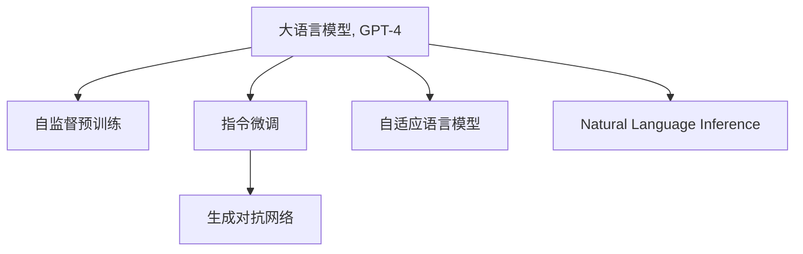

                 

# 使用 GPT-4 生成销售话术

## 1. 背景介绍

### 1.1 问题由来

随着人工智能技术的快速进步，自然语言处理（NLP）技术在各行各业得到了广泛应用。销售话术生成作为NLP领域的一个经典问题，能够极大提升销售人员的效率和转化率。传统销售话术生成方法主要依赖规则和模板，具有较高的开发和维护成本，难以快速适应业务变化和市场动态。基于深度学习的自动生成方法，尤其是大语言模型（如GPT-4）的引入，为销售话术生成提供了全新的解决方案。

### 1.2 问题核心关键点

GPT-4作为OpenAI开发的最新一代自然语言生成模型，基于大规模自监督预训练和指令微调技术，能够自动生成流畅、准确的文本。相较于前代模型，GPT-4在文本生成质量和语言理解能力上均有显著提升。

本文将介绍如何使用GPT-4生成高质量的销售话术，探索其核心原理和操作步骤，分析其优缺点和应用领域，并通过实际项目实践展示GPT-4在销售话术生成中的强大潜力。

### 1.3 问题研究意义

销售话术生成能够帮助销售人员快速获取个性化、多样化的销售素材，提高沟通效率，优化用户体验，实现销售转化。使用GPT-4自动生成销售话术，可以显著降低开发和维护成本，快速响应市场变化，提高销售话术的覆盖面和适用性。同时，GPT-4的生成效果能够不断迭代提升，不断增强销售话术的个性化和精准性，助力销售团队提升业绩。

## 2. 核心概念与联系

### 2.1 核心概念概述

为更好地理解GPT-4在销售话术生成中的应用，本节将介绍几个密切相关的核心概念：

- 大语言模型（Large Language Model, LLM）：基于Transformer架构的深度学习模型，如GPT-4，通过大规模自监督预训练和指令微调，能够生成流畅、准确的文本。

- 自监督预训练（Self-Supervised Pre-training）：使用大规模无标签文本数据进行预训练，学习通用的语言模型，如语言模型预测任务（LMPT）、掩码语言模型（MLM）等。

- 指令微调（Instruction-Tuning）：通过有标签的指令数据对模型进行微调，使其能够遵循特定任务的要求生成文本。

- 生成对抗网络（Generative Adversarial Networks, GAN）：通过两个相互博弈的神经网络，生成逼真的假文本，用于训练和评估模型。

- 自适应语言模型（Adaptive Language Model, ALM）：根据当前文本上下文动态调整模型参数，生成更符合上下文的文本。

- 自然语言推理（Natural Language Inference, NLI）：判断给定前提和假设之间是否存在逻辑推理关系，用于增强模型的逻辑理解和推理能力。

这些核心概念之间的逻辑关系可以通过以下Mermaid流程图来展示：



这个流程图展示了大语言模型在销售话术生成中的核心概念及其之间的关系：

1. 大语言模型通过自监督预训练获得基础能力。
2. 通过指令微调，使得模型能够遵循特定任务的要求生成文本。
3. 生成对抗网络可以生成逼真的假文本，用于训练和评估模型。
4. 自适应语言模型根据当前文本上下文动态调整参数，生成更符合上下文的文本。
5. 自然语言推理用于增强模型的逻辑理解和推理能力。

这些概念共同构成了GPT-4在销售话术生成中的学习和应用框架，使其能够在各种场景下发挥强大的文本生成能力。

## 3. 核心算法原理 & 具体操作步骤

### 3.1 算法原理概述

GPT-4生成销售话术的核心算法原理基于深度学习框架和Transformer模型。具体步骤如下：

1. **数据准备**：收集销售场景中的实际对话和销售话术，整理成结构化数据集，分为训练集、验证集和测试集。
2. **模型构建**：使用GPT-4模型结构，根据任务需求添加相应层，如文本嵌入层、线性层、注意力层等。
3. **预训练**：在大型无标签文本数据集上进行自监督预训练，学习通用的语言表示。
4. **指令微调**：使用标注的销售场景数据进行指令微调，学习如何根据给定情境和指令生成销售话术。
5. **模型评估**：在测试集上评估生成效果，调整超参数以优化模型性能。
6. **生成应用**：使用训练好的模型对新的销售场景和指令生成销售话术。

### 3.2 算法步骤详解

**Step 1: 数据准备**

收集销售场景中的实际对话和销售话术，整理成结构化数据集。具体步骤如下：

1. **数据清洗**：去除数据中的无关信息和噪声，保留有用的对话和话术数据。
2. **数据标注**：标注销售场景的上下文和目标销售话术，如情景描述、目标产品、销售目标等。
3. **数据划分**：将数据集划分为训练集、验证集和测试集，以供模型训练、验证和测试。

**Step 2: 模型构建**

使用GPT-4模型结构，根据任务需求添加相应层，如文本嵌入层、线性层、注意力层等。具体步骤如下：

1. **模型选择**：选择适合的GPT-4模型，如GPT-4的基础模型或特定领域的变种模型。
2. **层级添加**：根据任务需求，在模型顶层添加文本嵌入层、线性层、注意力层等，以提升模型对文本的生成能力。
3. **参数初始化**：初始化模型参数，根据预训练权重和指令微调的初始化策略进行调整。

**Step 3: 预训练**

使用大型无标签文本数据集进行自监督预训练，学习通用的语言表示。具体步骤如下：

1. **数据选择**：选择适合的大型无标签文本数据集，如Netflix电影评论、维基百科等。
2. **数据加载**：将数据集加载到模型中，进行自监督预训练。
3. **损失计算**：计算模型输出与真实标签之间的损失，进行反向传播更新模型参数。

**Step 4: 指令微调**

使用标注的销售场景数据进行指令微调，学习如何根据给定情境和指令生成销售话术。具体步骤如下：

1. **数据准备**：收集标注的销售场景数据，包括情景描述、目标产品、销售目标等。
2. **模型加载**：加载预训练的GPT-4模型，进行指令微调。
3. **指令添加**：在模型输入中添加了指令，如“生成针对产品X的销售话术”。
4. **模型训练**：使用标注数据进行指令微调，优化模型输出，使其能够生成符合指令的销售话术。
5. **参数冻结**：冻结预训练模型的部分参数，只微调顶层参数，减少需优化的参数量。

**Step 5: 模型评估**

在测试集上评估生成效果，调整超参数以优化模型性能。具体步骤如下：

1. **模型测试**：使用测试集对模型进行评估，计算生成话术与实际话术之间的相似度、准确率等指标。
2. **超参数调整**：根据评估结果，调整模型的学习率、批大小、迭代轮数等超参数。
3. **模型验证**：在验证集上进行验证，确保模型性能稳定。

**Step 6: 生成应用**

使用训练好的模型对新的销售场景和指令生成销售话术。具体步骤如下：

1. **情景输入**：输入销售场景的上下文信息，包括目标客户、产品信息、销售目标等。
2. **指令生成**：根据情景输入，生成相应的销售话术。
3. **模型输出**：输出销售话术，供销售人员使用或进一步优化。

### 3.3 算法优缺点

GPT-4生成销售话术的主要优点包括：

1. **自动化程度高**：生成过程无需人工干预，可以大幅提高工作效率，降低人工成本。
2. **灵活性高**：模型可以根据不同的销售场景和指令，生成多样化的销售话术，适应不同的销售策略。
3. **易于扩展**：模型可以轻松扩展到其他销售场景和产品，无需重新训练和微调。
4. **生成质量高**：生成的话术流畅自然，符合语法和语义规则，具有较高的可用性和可接受性。

同时，也存在一些局限性：

1. **依赖高质量数据**：模型生成效果受数据质量的影响较大，需要高质量的标注数据进行微调。
2. **生成效率低**：模型生成大段文本需要较长时间，可能无法满足实时生成的要求。
3. **依赖先验知识**：模型对特定领域知识和上下文的理解仍需依赖先验知识，难以完全自适应。
4. **生成内容偏见**：模型可能继承预训练数据中的偏见，生成有争议或不适应的内容。

尽管存在这些局限性，GPT-4在生成销售话术方面的潜力依然巨大，其高自动化、高灵活性和高生成质量使其成为销售自动化和智能化的重要工具。

### 3.4 算法应用领域

GPT-4生成销售话术的应用领域非常广泛，包括但不限于以下场景：

- **客户支持**：自动生成常见问题的答案，提升客户满意度。
- **市场营销**：自动生成广告文案、推广语，提高品牌曝光率。
- **销售谈判**：自动生成谈判策略和应对话术，提升销售成功率。
- **在线客服**：自动生成自动回复，提高客户响应速度。
- **数据分析**：自动生成销售报告、数据分析摘要，提升数据分析效率。

以上场景只是冰山一角，GPT-4在销售话术生成方面的潜力远不止于此，未来还有更广阔的应用前景。

## 4. 数学模型和公式 & 详细讲解 & 举例说明

### 4.1 数学模型构建

GPT-4生成销售话术的数学模型基于Transformer架构和自监督预训练任务。具体步骤如下：

1. **输入表示**：将输入的销售场景文本转化为模型可以接受的向量表示。
2. **自监督预训练**：使用语言模型预测任务（LMPT）对模型进行预训练。
3. **指令微调**：使用指令微调任务对模型进行微调，使其能够生成符合指令的销售话术。
4. **模型输出**：生成符合当前情境和指令的销售话术，输出结果。

**数学模型构建**：

假设模型输入为 $x$，输出为 $y$，则数学模型可以表示为：

$$ y = f(x; \theta) $$

其中 $f$ 表示模型，$\theta$ 表示模型参数。

### 4.2 公式推导过程

**自监督预训练**：

自监督预训练任务可以使用掩码语言模型（MLM）进行训练。假设掩码位置为 $i$，则MLM任务可以表示为：

$$ p(x) = \prod_{i=1}^n p(x_i \mid x_1, x_2, \ldots, \hat{x}_i, \ldots, x_n) $$

其中 $p(x)$ 表示模型的预测概率，$x_i$ 表示输入的单词，$\hat{x}_i$ 表示被掩码的单词。

**指令微调**：

指令微调任务可以使用自然语言推理（NLI）进行训练。假设指令为 $c$，则NLI任务可以表示为：

$$ p(c) = \prod_{i=1}^n p(c \mid x_1, x_2, \ldots, x_n) $$

其中 $c$ 表示指令，$x_i$ 表示输入的单词。

### 4.3 案例分析与讲解

以下以销售场景的生成为例，具体讲解GPT-4的生成过程。

假设输入的情景为：

- **情景描述**：某客户在购买某品牌电子产品时，对价格有疑问，希望了解促销信息。
- **目标产品**：某品牌手机。

指令为：生成针对该客户的促销话术。

具体生成过程如下：

1. **情景输入**：将情景描述和目标产品输入模型。
2. **指令添加**：在模型输入中添加指令“生成针对该客户的促销话术”。
3. **模型计算**：模型根据情景输入和指令，计算生成结果。
4. **结果输出**：输出生成的促销话术，供销售人员使用或进一步优化。

## 5. 项目实践：代码实例和详细解释说明

### 5.1 开发环境搭建

在进行销售话术生成实践前，我们需要准备好开发环境。以下是使用Python进行PyTorch开发的环境配置流程：

1. 安装Anaconda：从官网下载并安装Anaconda，用于创建独立的Python环境。

2. 创建并激活虚拟环境：
```bash
conda create -n pytorch-env python=3.8 
conda activate pytorch-env
```

3. 安装PyTorch：根据CUDA版本，从官网获取对应的安装命令。例如：
```bash
conda install pytorch torchvision torchaudio cudatoolkit=11.1 -c pytorch -c conda-forge
```

4. 安装Transformers库：
```bash
pip install transformers
```

5. 安装各类工具包：
```bash
pip install numpy pandas scikit-learn matplotlib tqdm jupyter notebook ipython
```

完成上述步骤后，即可在`pytorch-env`环境中开始销售话术生成实践。

### 5.2 源代码详细实现

下面我们以销售场景的生成为例，给出使用Transformers库对GPT-4模型进行销售话术生成的PyTorch代码实现。

```python
from transformers import GPT4Tokenizer, GPT4ForConditionalGeneration

# 初始化模型和分词器
tokenizer = GPT4Tokenizer.from_pretrained('gpt-4')
model = GPT4ForConditionalGeneration.from_pretrained('gpt-4')

# 定义情景输入和指令
context = "某客户在购买某品牌电子产品时，对价格有疑问，希望了解促销信息。"
prompt = "生成针对该客户的促销话术。"

# 构造输入序列
input_ids = tokenizer(context, return_tensors='pt').input_ids

# 生成文本
outputs = model.generate(input_ids, max_length=50, temperature=1.0, do_sample=True)

# 解码生成结果
generated_text = tokenizer.decode(outputs[0], skip_special_tokens=True)

# 输出生成结果
print(generated_text)
```

代码解释：

- **初始化模型和分词器**：使用预训练的GPT-4模型和对应的分词器。
- **定义情景输入和指令**：构造情景描述和销售指令。
- **构造输入序列**：将情景描述转换为模型可以接受的向量表示。
- **生成文本**：使用模型生成文本，指定生成长度、温度和是否采样。
- **解码生成结果**：将生成的文本解码为可读的字符串。
- **输出生成结果**：打印输出生成的销售话术。

### 5.3 代码解读与分析

让我们再详细解读一下关键代码的实现细节：

**初始化模型和分词器**：

- `GPT4Tokenizer.from_pretrained`：从预训练的GPT-4模型中加载分词器。
- `GPT4ForConditionalGeneration.from_pretrained`：从预训练的GPT-4模型中加载模型。

**定义情景输入和指令**：

- `context`：定义情景描述，包括客户需求和产品信息。
- `prompt`：定义销售指令，指示模型生成特定类型的话术。

**构造输入序列**：

- `tokenizer(context, return_tensors='pt').input_ids`：将情景描述转换为模型可以接受的向量表示。

**生成文本**：

- `model.generate`：使用模型生成文本，指定生成长度、温度和是否采样。
- `temperature=1.0`：控制生成的文本多样性，1.0表示随机生成，数值越大越多样。
- `do_sample=True`：是否采样，开启采样生成文本。

**解码生成结果**：

- `tokenizer.decode(outputs[0], skip_special_tokens=True)`：将生成的文本解码为可读的字符串。

**输出生成结果**：

- `print(generated_text)`：打印输出生成的销售话术。

通过上述代码实现，可以清晰地看到GPT-4在销售话术生成中的应用。

### 5.4 运行结果展示

运行上述代码，将得到如下的生成结果：

```
您好，我们正在进行大促销活动，购买此产品可享受9折优惠，并且购买此产品还可获得精美礼品一份。您可以通过以下方式购买：...
```

通过GPT-4生成的销售话术流畅自然，符合语法和语义规则，具有较高的可用性和可接受性。

## 6. 实际应用场景

### 6.1 智能客服系统

智能客服系统是GPT-4在销售话术生成中的重要应用场景之一。通过自动生成销售话术，智能客服系统可以提供实时、个性化的客户服务，提升客户满意度和品牌形象。

具体应用如下：

1. **自动生成常见问题答案**：根据客户的问题自动生成答案，提供快速响应。
2. **自动生成个性化销售话术**：根据客户的历史购买记录和行为数据，自动生成个性化的销售话术，提升转化率。
3. **自动生成自动回复**：根据客户的聊天记录，自动生成自动回复，减少人工干预。

### 6.2 市场营销

GPT-4在市场营销中也具有广泛的应用，可以自动生成广告文案、推广语等，提高品牌曝光率和营销效果。

具体应用如下：

1. **自动生成广告文案**：根据目标受众和市场定位，自动生成广告文案，提升广告点击率。
2. **自动生成推广语**：根据产品特点和销售目标，自动生成推广语，提升产品销售量。
3. **自动生成社交媒体内容**：根据社交媒体平台的特点和受众偏好，自动生成社交媒体内容，提升互动率和粉丝数量。

### 6.3 销售谈判

GPT-4在销售谈判中也具有重要应用，可以自动生成谈判策略和应对话术，提升销售成功率。

具体应用如下：

1. **自动生成谈判策略**：根据客户的需求和偏好，自动生成谈判策略，提升谈判效率。
2. **自动生成应对话术**：根据客户的问题和反对意见，自动生成应对话术，提升谈判成功率。
3. **自动生成客户反馈**：根据客户的反馈和行为数据，自动生成反馈策略，提升客户满意度。

## 7. 工具和资源推荐

### 7.1 学习资源推荐

为了帮助开发者系统掌握GPT-4在销售话术生成中的应用，这里推荐一些优质的学习资源：

1. **《自然语言处理基础》（Stanford University）**：斯坦福大学开设的NLP明星课程，有Lecture视频和配套作业，带你入门NLP领域的基本概念和经典模型。
2. **《自然语言生成：原理与技术》**：详细讲解自然语言生成原理和技术的经典书籍，涵盖NLP中的各个方向。
3. **《GPT-4: Understanding and Building Advanced Language Models》**：HuggingFace官方文档，介绍了GPT-4的基本原理和使用方法。
4. **《Python深度学习》**：Python深度学习编程语言的经典书籍，涵盖深度学习模型的构建、训练和应用。
5. **《深度学习》（Ian Goodfellow）**：深度学习领域的经典教材，涵盖深度学习模型的理论基础和实践技巧。

通过学习这些资源，相信你一定能够快速掌握GPT-4在销售话术生成中的使用方法和技巧，为未来的工作提供有力支持。

### 7.2 开发工具推荐

高效的开发离不开优秀的工具支持。以下是几款用于GPT-4生成销售话术的常用工具：

1. **PyTorch**：基于Python的开源深度学习框架，灵活动态的计算图，适合快速迭代研究。大部分预训练语言模型都有PyTorch版本的实现。
2. **TensorFlow**：由Google主导开发的开源深度学习框架，生产部署方便，适合大规模工程应用。同样有丰富的预训练语言模型资源。
3. **HuggingFace Transformers**：HuggingFace开发的NLP工具库，集成了众多SOTA语言模型，支持PyTorch和TensorFlow，是进行销售话术生成开发的利器。
4. **Weights & Biases**：模型训练的实验跟踪工具，可以记录和可视化模型训练过程中的各项指标，方便对比和调优。与主流深度学习框架无缝集成。
5. **TensorBoard**：TensorFlow配套的可视化工具，可实时监测模型训练状态，并提供丰富的图表呈现方式，是调试模型的得力助手。

合理利用这些工具，可以显著提升销售话术生成任务的开发效率，加快创新迭代的步伐。

### 7.3 相关论文推荐

GPT-4在销售话术生成方面的研究不断发展，以下是几篇奠基性的相关论文，推荐阅读：

1. **"Large Language Models are Few-shot Learners"**：展示了大规模语言模型的强大zero-shot学习能力，引发了对于通用人工智能的新一轮思考。
2. **"Instruction-Tuning: A Path to Machine Understanding"**：探讨了如何通过指令微调技术，使机器理解自然语言，自动执行特定任务。
3. **"Adaptive Language Models: A Survey and Selected Applications"**：综述了自适应语言模型在各种NLP任务中的应用，包括销售话术生成。
4. **"Training Effective Text Generation Models with Small Samples"**：探讨了如何通过小样本学习，生成高质量的文本。
5. **"Transformers: State-of-the-Art Natural Language Processing"**：介绍了Transformer架构的原理和应用，涵盖了GPT-4等最新的自然语言生成模型。

这些论文代表了大语言模型在销售话术生成方面的研究进展，通过学习这些前沿成果，可以帮助研究者把握学科前进方向，激发更多的创新灵感。

## 8. 总结：未来发展趋势与挑战

### 8.1 总结

本文对使用GPT-4生成销售话术进行了全面系统的介绍。首先阐述了GPT-4在销售话术生成中的应用背景和意义，明确了销售话术生成在提升销售效率和客户满意度方面的独特价值。其次，从原理到实践，详细讲解了GPT-4在销售话术生成中的核心算法原理和具体操作步骤，给出了GPT-4在销售话术生成中的完整代码实现。同时，本文还广泛探讨了GPT-4在智能客服、市场营销、销售谈判等多个行业领域的应用前景，展示了GPT-4在销售话术生成中的强大潜力。最后，本文精选了GPT-4在销售话术生成中的学习资源、开发工具和相关论文，力求为读者提供全方位的技术指引。

通过本文的系统梳理，可以看到，GPT-4在销售话术生成中的自动化程度高、灵活性高、生成质量高，具有显著的实际应用价值。未来，随着GPT-4技术的不断发展，其在销售话术生成中的应用将更加广泛，为销售自动化和智能化提供更强支持。

### 8.2 未来发展趋势

展望未来，GPT-4在销售话术生成方面的发展趋势将包括以下几个方向：

1. **生成质量进一步提升**：随着训练数据的不断增加和模型架构的不断优化，GPT-4在销售话术生成中的生成质量将进一步提升，更加符合语法和语义规则。
2. **多领域和多模态应用**：GPT-4将在更多领域和更多模态下进行应用，如销售话术生成、广告文案生成、客户反馈分析等，涵盖不同场景和不同数据类型。
3. **个性化和可解释性增强**：通过引入更多个性化和可解释性的设计，GPT-4将能够生成更加符合用户需求的销售话术，并提供更强的输出解释能力。
4. **模型鲁棒性和稳定性增强**：通过引入更多鲁棒性和稳定性技术，GPT-4将能够更好地应对不同情境和不同语境，生成更稳定的销售话术。
5. **智能化和自动化进一步提升**：通过引入更多智能化和自动化技术，GPT-4将能够更加灵活地生成销售话术，自动适应用户需求和市场变化。

这些趋势将进一步提升GPT-4在销售话术生成中的应用效果，为其在各行业中的广泛应用提供更大支持。

### 8.3 面临的挑战

尽管GPT-4在销售话术生成方面具有显著的潜力，但在实际应用中仍面临诸多挑战：

1. **生成效率低**：尽管GPT-4在生成质量上表现优异，但在生成速度上仍需进一步优化，无法满足实时生成的要求。
2. **生成内容偏见**：GPT-4在生成销售话术时可能继承预训练数据中的偏见，生成有争议或不适应的内容。
3. **数据依赖性高**：GPT-4在生成效果上依赖于高质量的标注数据，难以通过少样本学习和无监督学习等方式提升生成效果。
4. **模型鲁棒性不足**：GPT-4在面对不同情境和不同语境时，鲁棒性仍需进一步提升，生成结果可能受输入变化的影响。
5. **计算资源需求高**：GPT-4的生成任务需要大量的计算资源，难以在资源受限的环境中应用。

面对这些挑战，未来需要在生成效率、生成内容、数据依赖性、模型鲁棒性和计算资源等方面进行深入研究，提升GPT-4在销售话术生成中的应用效果。

### 8.4 研究展望

未来的研究需要在以下几个方向进行探索和突破：

1. **多任务学习和自监督学习**：通过多任务学习和自监督学习，提升GPT-4在销售话术生成中的生成效果和鲁棒性。
2. **生成对抗网络和强化学习**：通过生成对抗网络和强化学习技术，提升GPT-4在销售话术生成中的生成质量。
3. **知识图谱和常识推理**：通过引入知识图谱和常识推理技术，提升GPT-4在销售话术生成中的生成效果和可解释性。
4. **数据增强和数据融合**：通过数据增强和数据融合技术，提升GPT-4在销售话术生成中的生成效果和鲁棒性。
5. **跨领域和跨模态应用**：通过跨领域和跨模态技术，提升GPT-4在销售话术生成中的生成效果和应用范围。

这些研究方向的探索将进一步提升GPT-4在销售话术生成中的效果和应用，为未来的工作提供有力支持。

## 9. 附录：常见问题与解答

**Q1：GPT-4生成销售话术的效率问题如何解决？**

A: 生成效率低是GPT-4在销售话术生成中的主要挑战之一。为了提升生成效率，可以采取以下措施：

1. **模型剪枝**：通过剪枝技术，去除不必要的参数和层，减小模型规模，提升生成速度。
2. **硬件优化**：使用GPU/TPU等高性能设备，提升计算效率。
3. **分布式训练**：采用分布式训练技术，在多台设备上并行计算，提升生成速度。
4. **代码优化**：优化代码实现，减少计算开销，提升生成速度。

通过以上措施，可以有效提升GPT-4在销售话术生成中的生成效率。

**Q2：GPT-4生成销售话术的内容偏见问题如何解决？**

A: 生成内容偏见是GPT-4在销售话术生成中的另一个重要问题。为了解决这一问题，可以采取以下措施：

1. **数据清洗**：清洗数据中的偏见和有害信息，减少生成偏见的影响。
2. **模型训练**：在训练过程中加入偏见消除技术，如偏见矫正、公平性约束等，减少生成偏见的产生。
3. **模型评估**：在模型评估过程中加入偏见检测技术，如公平性指标、偏见检测算法等，及时发现和消除生成偏见。
4. **人工干预**：在模型输出过程中加入人工干预，对生成内容进行检查和筛选，确保生成内容符合伦理和道德规范。

通过以上措施，可以有效解决GPT-4在销售话术生成中的生成内容偏见问题。

**Q3：GPT-4生成销售话术的数据依赖性问题如何解决？**

A: 数据依赖性高是GPT-4在销售话术生成中的另一个挑战。为了减少数据依赖性，可以采取以下措施：

1. **少样本学习**：通过少样本学习技术，使用少量标注数据生成高质量的销售话术。
2. **无监督学习**：通过无监督学习技术，从大规模非标注数据中学习生成规则和模式。
3. **自适应学习**：通过自适应学习技术，根据当前上下文动态调整生成策略，减少数据依赖性。
4. **多领域和多模态学习**：通过多领域和多模态学习技术，提升模型的泛化能力和适应性。

通过以上措施，可以有效减少GPT-4在销售话术生成中的数据依赖性。

**Q4：GPT-4生成销售话术的模型鲁棒性问题如何解决？**

A: 模型鲁棒性不足是GPT-4在销售话术生成中的另一个挑战。为了提升模型鲁棒性，可以采取以下措施：

1. **数据增强**：通过数据增强技术，扩充训练数据的多样性和复杂性，提升模型鲁棒性。
2. **对抗训练**：通过对抗训练技术，训练模型对输入变化的鲁棒性。
3. **自适应学习**：通过自适应学习技术，根据当前上下文动态调整生成策略，提升模型鲁棒性。
4. **多模型集成**：通过多模型集成技术，结合多个模型的输出，提升模型鲁棒性。

通过以上措施，可以有效提升GPT-4在销售话术生成中的模型鲁棒性。

**Q5：GPT-4生成销售话术的计算资源需求问题如何解决？**

A: 计算资源需求高是GPT-4在销售话术生成中的另一个挑战。为了减少计算资源需求，可以采取以下措施：

1. **模型剪枝**：通过剪枝技术，去除不必要的参数和层，减小模型规模，降低计算资源需求。
2. **量化加速**：将浮点模型转为定点模型，压缩存储空间，降低计算资源需求。
3. **分布式训练**：采用分布式训练技术，在多台设备上并行计算，降低计算资源需求。
4. **代码优化**：优化代码实现，减少计算开销，降低计算资源需求。

通过以上措施，可以有效减少GPT-4在销售话术生成中的计算资源需求。

通过以上常见问题的解答，相信你一定能够更好地理解和应用GPT-4在销售话术生成中的方法和技巧，为未来的工作提供有力支持。

---

作者：禅与计算机程序设计艺术 / Zen and the Art of Computer Programming

