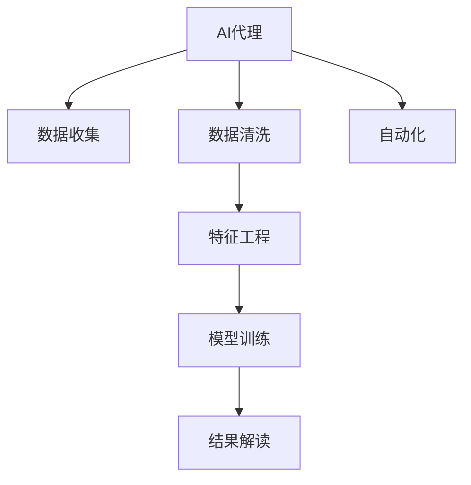

                 

# 使用AI代理进行市场分析：工作流程与数据解读

> 关键词：AI代理,市场分析,数据解读,自动化,机器学习,数据挖掘,自然语言处理

## 1. 背景介绍

### 1.1 问题由来

在当今快速变化的市场环境中，企业需要及时、准确地获取和分析市场信息，以做出明智的商业决策。传统的数据分析方法往往耗时费力，且容易受到人工偏见的影响。而随着人工智能(AI)技术的进步，利用AI代理进行市场分析成为了一种高效、客观的新方式。AI代理可以通过自动化和智能化的手段，从海量的数据中提取有价值的信息，为企业的市场策略制定提供有力的支撑。

### 1.2 问题核心关键点

利用AI代理进行市场分析的核心关键点包括：

- **自动化数据采集**：通过爬虫等技术自动化获取市场数据，减少人工干预，提升效率。
- **数据清洗与预处理**：对采集到的数据进行清洗和预处理，去除噪声和异常值，保证数据质量。
- **特征工程**：构建有效的数据特征，提高模型的预测准确性。
- **模型训练与优化**：选择合适的机器学习模型，通过大量训练数据进行模型训练和参数优化。
- **结果解读**：将模型输出结果进行解读，形成可行的市场策略。

这些关键点构成了使用AI代理进行市场分析的基本框架，有助于企业在激烈的市场竞争中占据先机。

## 2. 核心概念与联系

### 2.1 核心概念概述

为更好地理解基于AI代理的市场分析方法，本节将介绍几个密切相关的核心概念：

- **AI代理(AI Agent)**：指能够自主进行市场数据收集、分析和策略推荐的智能系统。AI代理通常包括数据收集模块、数据处理模块、模型训练模块和策略生成模块等。
- **市场分析(Market Analysis)**：指通过收集、分析和解读市场数据，识别市场趋势、评估竞争态势、预测未来走势，为企业决策提供依据。
- **数据解读(Data Interpretation)**：指将模型输出结果转换为易于理解和利用的市场策略，如产品定价、促销活动、营销渠道等。
- **自动化(Automation)**：指利用机器人和程序进行自动化的任务执行，减少人工操作，提高效率。
- **特征工程(Feature Engineering)**：指通过数据变换、特征选择和特征构建等方法，提高模型的泛化能力和预测准确性。
- **模型训练(Model Training)**：指使用历史数据对模型进行训练，优化模型参数，使其能够准确预测未来数据。

这些核心概念之间的逻辑关系可以通过以下Mermaid流程图来展示：



这个流程图展示了大语言模型的核心概念及其之间的关系：

1. AI代理通过数据收集模块获取市场数据。
2. 数据清洗模块对原始数据进行处理，去除噪声和异常值。
3. 特征工程模块构建有效的数据特征，提高模型的预测准确性。
4. 模型训练模块选择合适的机器学习模型，进行大量训练数据训练和参数优化。
5. 结果解读模块将模型输出结果进行解读，形成可行的市场策略。
6. 自动化模块通过程序实现上述各个环节的自动执行，提升效率。

这些概念共同构成了AI代理进行市场分析的基础，使得企业能够在市场竞争中更加灵活、准确地制定决策。

## 3. 核心算法原理 & 具体操作步骤

### 3.1 算法原理概述

基于AI代理的市场分析方法，本质上是一种基于数据驱动的决策支持系统。其核心思想是：利用机器学习技术，从市场数据中提取特征，构建模型，并通过大量的历史数据训练模型，使其能够准确预测未来的市场走势。

具体而言，市场分析过程可以分为以下几个步骤：

1. **数据收集**：通过爬虫、API接口等方式，自动获取市场数据，如产品价格、销售量、竞争对手动态等。
2. **数据清洗与预处理**：对采集到的数据进行清洗和预处理，去除噪声和异常值，保证数据质量。
3. **特征工程**：通过数据变换、特征选择和特征构建等方法，提高模型的泛化能力和预测准确性。
4. **模型训练与优化**：选择合适的机器学习模型，通过大量训练数据进行模型训练和参数优化。
5. **结果解读**：将模型输出结果进行解读，形成可行的市场策略。

### 3.2 算法步骤详解

#### 3.2.1 数据收集

数据收集是AI代理市场分析的第一步，其核心目标是获取全面的市场数据，以便后续的分析。常用的数据收集方法包括：

- **爬虫技术**：通过编写爬虫程序，从各大电商平台、社交媒体、新闻网站等渠道自动抓取相关数据。
- **API接口**：利用各大电商平台提供的API接口，获取详细的产品信息和销售数据。
- **公开数据源**：利用政府公开数据、行业报告等，获取宏观市场数据和行业趋势。

#### 3.2.2 数据清洗与预处理

数据清洗与预处理是保证数据质量的重要步骤，主要包括：

- **缺失值处理**：通过插值、删除等方法处理缺失数据，保证数据完整性。
- **噪声过滤**：识别并去除数据中的异常值和噪声，保证数据准确性。
- **标准化与归一化**：对数据进行标准化和归一化处理，保证不同特征之间的可比性。

#### 3.2.3 特征工程

特征工程是提高模型预测准确性的关键步骤，主要包括：

- **特征选择**：选择与目标变量高度相关的特征，去除冗余特征。
- **特征变换**：对特征进行变换，如对数变换、指数变换等，提高模型的表达能力。
- **特征构建**：通过计算、组合等方式构建新的特征，提高模型的泛化能力。

#### 3.2.4 模型训练与优化

模型训练与优化是市场分析的核心环节，主要包括以下步骤：

- **选择合适的模型**：根据任务需求，选择合适的机器学习模型，如线性回归、逻辑回归、决策树、随机森林等。
- **数据划分**：将数据划分为训练集、验证集和测试集，保证模型训练的公正性和泛化能力。
- **模型训练**：使用训练集数据对模型进行训练，优化模型参数。
- **模型评估**：在验证集上评估模型的性能，选择最优模型。
- **模型优化**：通过超参数调优、正则化等技术，进一步提升模型性能。

#### 3.2.5 结果解读

结果解读是将模型输出转化为市场策略的最后一步，主要包括以下步骤：

- **可视化分析**：通过绘制图表、生成报告等方式，将模型输出结果可视化展示，帮助企业理解市场趋势。
- **策略生成**：根据模型输出结果，制定可行的市场策略，如调整产品定价、优化营销渠道、制定促销活动等。
- **持续监控**：对市场策略进行持续监控，根据市场变化及时调整策略。

### 3.3 算法优缺点

基于AI代理的市场分析方法具有以下优点：

- **高效性**：通过自动化和智能化的手段，大大减少了人工干预，提高了效率。
- **客观性**：减少了人工偏见的影响，提高了决策的客观性和准确性。
- **可扩展性**：可以处理海量数据，支持大规模市场分析。
- **灵活性**：可以根据不同的市场任务和需求，灵活选择和调整模型和特征工程方法。

同时，该方法也存在以下局限性：

- **数据质量依赖**：数据收集和预处理的质量直接影响分析结果。
- **模型复杂度**：模型训练和优化的复杂度较高，需要专业知识。
- **结果可解释性**：模型输出结果可能难以直接解读，需要专业知识进行解释。
- **模型过拟合**：在训练集上表现良好，但泛化能力可能不足，需要谨慎选择和调整模型。

尽管存在这些局限性，但就目前而言，基于AI代理的市场分析方法仍是一种高效、客观、灵活的市场决策支持手段。未来相关研究的重点在于如何进一步提升数据质量，降低模型复杂度，提高结果的可解释性，避免模型过拟合等。

### 3.4 算法应用领域

基于AI代理的市场分析方法，在多个领域得到了广泛的应用，包括但不限于：

- **电商行业**：通过分析电商平台的销售数据，预测产品趋势，优化库存和定价策略。
- **金融行业**：通过分析金融市场数据，预测股票价格、汇率走势，制定投资策略。
- **零售行业**：通过分析零售终端的销售数据，预测销售趋势，优化促销活动。
- **旅游行业**：通过分析旅游需求数据，预测旅游趋势，制定营销策略。
- **医疗行业**：通过分析医疗数据，预测疾病流行趋势，制定预防措施。

这些应用场景展示了AI代理在市场分析中的广泛潜力，为企业决策提供了强有力的支持。

## 4. 数学模型和公式 & 详细讲解 & 举例说明

### 4.1 数学模型构建

基于AI代理的市场分析方法，其数学模型可以概括为如下形式：

设市场数据集为 $\mathcal{D} = \{(x_i, y_i)\}_{i=1}^N$，其中 $x_i$ 为市场特征向量，$y_i$ 为目标变量（如销售量、价格等）。市场分析的目标是构建模型 $f: \mathcal{X} \rightarrow \mathcal{Y}$，使其能够准确预测目标变量 $y$。

常用的模型包括线性回归、逻辑回归、决策树、随机森林等，其基本形式为：

$$
f(x) = \sum_{i=1}^d \theta_i x_i + \theta_0
$$

其中 $\theta$ 为模型参数，$d$ 为特征维度。

### 4.2 公式推导过程

以线性回归为例，其基本推导过程如下：

1. **模型形式**：
   $$
   f(x) = \theta_0 + \theta_1 x_1 + \theta_2 x_2 + \ldots + \theta_d x_d
   $$

2. **损失函数**：
   $$
   \mathcal{L}(\theta) = \frac{1}{N} \sum_{i=1}^N (y_i - f(x_i))^2
   $$

3. **梯度下降**：
   $$
   \theta_k \leftarrow \theta_k - \eta \frac{\partial \mathcal{L}(\theta)}{\partial \theta_k}
   $$

4. **求解过程**：
   通过反向传播算法计算梯度，使用梯度下降算法优化模型参数，直至收敛。

### 4.3 案例分析与讲解

#### 案例：电商平台销售数据分析

某电商平台希望通过AI代理分析销售数据，预测未来销售趋势。假设销售数据集为 $\mathcal{D} = \{(x_i, y_i)\}_{i=1}^N$，其中 $x_i$ 包括时间、产品类别、广告投放等信息，$y_i$ 为销售量。

1. **数据收集**：通过爬虫自动获取电商平台的销售数据。
2. **数据清洗与预处理**：去除缺失值和异常值，对销售数据进行标准化处理。
3. **特征工程**：选择时间、产品类别、广告投放等特征，构建新特征如时间窗口平均销售量、广告投放数量等。
4. **模型训练与优化**：使用线性回归模型对数据进行训练，优化模型参数。
5. **结果解读**：绘制销售趋势图，生成预测报告，制定库存和定价策略。

通过以上步骤，电商平台能够快速准确地预测销售趋势，优化库存和定价策略，提升市场竞争力。

## 5. 项目实践：代码实例和详细解释说明

### 5.1 开发环境搭建

在进行市场分析实践前，我们需要准备好开发环境。以下是使用Python进行市场分析开发的常见环境配置流程：

1. 安装Python：下载并安装Python 3.8，推荐使用Anaconda。

2. 创建并激活虚拟环境：
```bash
conda create -n market-analysis python=3.8 
conda activate market-analysis
```

3. 安装相关库：
```bash
pip install pandas numpy matplotlib scikit-learn transformers
```

4. 安装爬虫工具：
```bash
pip install beautifulsoup4 requests
```

5. 配置可视化环境：
```bash
pip install matplotlib
```

完成上述步骤后，即可在`market-analysis`环境中开始市场分析实践。

### 5.2 源代码详细实现

下面以电商平台销售数据分析为例，给出使用Pandas和Scikit-learn库进行市场分析的Python代码实现。

首先，导入必要的库和数据：

```python
import pandas as pd
import numpy as np
from sklearn.linear_model import LinearRegression
from sklearn.metrics import mean_squared_error
from sklearn.model_selection import train_test_split

# 导入数据
data = pd.read_csv('sales_data.csv')
```

然后，进行数据预处理和特征构建：

```python
# 数据清洗
data = data.dropna()
data = data.drop(['product_id', 'ad_spent'], axis=1)

# 特征工程
features = ['month', 'category', 'avg_sales']
X = data[features]
y = data['sales']
```

接着，进行模型训练和评估：

```python
# 划分数据集
X_train, X_test, y_train, y_test = train_test_split(X, y, test_size=0.2, random_state=42)

# 模型训练
model = LinearRegression()
model.fit(X_train, y_train)

# 模型评估
y_pred = model.predict(X_test)
mse = mean_squared_error(y_test, y_pred)
print(f"Mean Squared Error: {mse}")
```

最后，绘制销售趋势图并生成预测报告：

```python
import matplotlib.pyplot as plt

# 绘制销售趋势图
plt.plot(X_test, y_test, label='Actual Sales')
plt.plot(X_test, y_pred, label='Predicted Sales')
plt.xlabel('Time')
plt.ylabel('Sales')
plt.legend()
plt.show()

# 生成预测报告
predictions = model.predict(X_test)
with open('predictions.csv', 'w') as f:
    f.write('Month,Category,Avg Sales,Predicted Sales\n')
    for i in range(len(predictions)):
        f.write(f"{i+1},{features[i]},{data[features][i]},{predictions[i]}\n")
```

以上就是使用Pandas和Scikit-learn库进行市场分析的完整代码实现。可以看到，借助Python的强大库函数，市场分析任务变得简洁高效。

### 5.3 代码解读与分析

让我们再详细解读一下关键代码的实现细节：

**数据导入与清洗**：
- `pd.read_csv('sales_data.csv')`：从CSV文件中读取数据。
- `data = data.dropna()`：去除缺失值。
- `data = data.drop(['product_id', 'ad_spent'], axis=1)`：删除不必要的特征。

**特征选择与构建**：
- `features = ['month', 'category', 'avg_sales']`：选择特征。
- `X = data[features]`：构建特征矩阵。
- `y = data['sales']`：构建目标变量向量。

**模型训练与评估**：
- `train_test_split(X, y, test_size=0.2, random_state=42)`：划分训练集和测试集。
- `LinearRegression()`：初始化线性回归模型。
- `model.fit(X_train, y_train)`：训练模型。
- `y_pred = model.predict(X_test)`：预测测试集结果。
- `mean_squared_error(y_test, y_pred)`：计算均方误差。

**结果可视化**：
- `plt.plot(X_test, y_test, label='Actual Sales')`：绘制实际销售数据。
- `plt.plot(X_test, y_pred, label='Predicted Sales')`：绘制预测销售数据。
- `plt.xlabel('Time')`：设置x轴标签。
- `plt.ylabel('Sales')`：设置y轴标签。
- `plt.legend()`：显示图例。
- `plt.show()`：显示图表。

**预测报告生成**：
- `predictions = model.predict(X_test)`：生成预测结果。
- `with open('predictions.csv', 'w') as f:`：创建CSV文件。
- `f.write('Month,Category,Avg Sales,Predicted Sales\n')`：写入标题。
- `f.write(f"{i+1},{features[i]},{data[features][i]},{predictions[i]}\n")`：写入每行数据。

可以看到，Python的强大库函数极大地简化了市场分析的代码实现，使开发者能够更加专注于算法设计和数据分析。

## 6. 实际应用场景

### 6.1 电商平台销售预测

在电商平台中，销售预测是一项至关重要的任务。通过使用AI代理进行市场分析，电商平台可以实时预测未来销售趋势，优化库存和定价策略，提升用户体验和收益。

在技术实现上，可以收集电商平台的销售数据，构建基于时间、产品类别、广告投放等特征的线性回归模型，对未来销售趋势进行预测。此外，还可以引入时间序列分析和神经网络等先进技术，进一步提升预测准确性。

### 6.2 金融市场分析

金融市场分析是AI代理的重要应用场景之一。通过收集和分析股票价格、交易量、新闻报道等数据，AI代理可以预测股票走势，帮助投资者制定更科学的投资策略。

在技术实现上，可以使用随机森林、梯度提升树等算法，构建多层次的金融市场分析模型，涵盖基本面分析、技术分析、情绪分析等多个维度。同时，引入自然语言处理(NLP)技术，对新闻报道进行情感分析，进一步提升模型的预测准确性。

### 6.3 零售行业库存管理

零售行业需要及时、准确地掌握库存情况，以避免过剩或缺货。通过使用AI代理进行市场分析，零售企业可以实时预测产品需求，优化库存管理，减少库存成本。

在技术实现上，可以收集历史销售数据、市场趋势、季节性因素等数据，构建基于时间序列分析的库存预测模型。同时，引入神经网络等先进技术，进一步提升模型的预测准确性。

### 6.4 旅游行业需求预测

旅游行业需要及时掌握游客需求情况，以制定合理的营销策略。通过使用AI代理进行市场分析，旅游企业可以预测未来的游客需求，优化旅游产品和定价策略。

在技术实现上，可以收集历史游客数据、天气预报、节假日等数据，构建基于时间序列分析的需求预测模型。同时，引入机器学习算法，进一步提升模型的预测准确性。

### 6.5 医疗行业疾病预测

医疗行业需要及时掌握疾病流行趋势，以制定预防措施。通过使用AI代理进行市场分析，医疗机构可以预测未来的疾病流行趋势，制定科学的预防措施。

在技术实现上，可以收集历史疾病数据、天气预报、环境污染等数据，构建基于时间序列分析的疾病预测模型。同时，引入机器学习算法，进一步提升模型的预测准确性。

## 7. 工具和资源推荐

### 7.1 学习资源推荐

为了帮助开发者系统掌握AI代理市场分析的理论基础和实践技巧，这里推荐一些优质的学习资源：

1. 《Python数据分析与机器学习实战》：介绍了Python在数据分析和机器学习中的应用，包括Pandas、NumPy、Scikit-learn等库的使用。
2. 《深度学习与Python编程》：介绍了深度学习的基本概念和应用，涵盖神经网络、卷积神经网络、循环神经网络等。
3. 《机器学习实战》：介绍了常用的机器学习算法和应用，涵盖线性回归、逻辑回归、随机森林、梯度提升树等。
4. Coursera的《机器学习基础》课程：由斯坦福大学开设，系统介绍了机器学习的基本概念和算法。
5. Udacity的《深度学习专项课程》：涵盖了深度学习的基础知识和应用，包括神经网络、卷积神经网络、循环神经网络等。

通过这些资源的学习实践，相信你一定能够快速掌握AI代理市场分析的理论基础和实践技巧，并用于解决实际的NLP问题。

### 7.2 开发工具推荐

高效的开发离不开优秀的工具支持。以下是几款用于AI代理市场分析开发的常用工具：

1. Jupyter Notebook：提供了交互式编程环境，支持Python、R等多种语言，非常适合进行数据分析和机器学习开发。
2. PyTorch：基于Python的深度学习框架，支持动态计算图，灵活性高，适用于深度学习模型的开发和优化。
3. TensorFlow：由Google开发的深度学习框架，支持静态计算图和动态计算图，适用于大规模模型训练和部署。
4. Scikit-learn：基于Python的机器学习库，提供了丰富的机器学习算法和工具，非常适合进行数据分析和模型训练。
5. Pandas：基于Python的数据分析库，支持大规模数据处理和数据清洗，非常适合进行数据预处理。

合理利用这些工具，可以显著提升AI代理市场分析的开发效率，加快创新迭代的步伐。

### 7.3 相关论文推荐

AI代理市场分析技术的发展源于学界的持续研究。以下是几篇奠基性的相关论文，推荐阅读：

1. "Gated Recurrent Unit"：提出了Gated Recurrent Unit (GRU)神经网络，用于时间序列分析和自然语言处理。
2. "A Survey on Big Data Analytics"：综述了大数据分析技术的最新进展，包括数据清洗、特征工程、模型训练等多个方面。
3. "Machine Learning in Marketing"：介绍了机器学习在市场营销中的应用，包括销售预测、客户细分、营销效果评估等多个方面。
4. "Deep Learning for Time Series Analysis"：介绍了深度学习在时间序列分析中的应用，包括RNN、LSTM、GRU等算法。
5. "A Survey on Market Analysis Techniques"：综述了市场分析技术的最新进展，包括数据收集、数据清洗、模型训练等多个方面。

这些论文代表了大语言模型微调技术的发展脉络。通过学习这些前沿成果，可以帮助研究者把握学科前进方向，激发更多的创新灵感。

## 8. 总结：未来发展趋势与挑战

### 8.1 总结

本文对基于AI代理的市场分析方法进行了全面系统的介绍。首先阐述了AI代理市场分析的研究背景和意义，明确了市场分析在企业决策中的重要作用。其次，从原理到实践，详细讲解了市场分析的数学原理和关键步骤，给出了市场分析任务开发的完整代码实例。同时，本文还广泛探讨了AI代理在电商、金融、零售等多个行业领域的应用前景，展示了市场分析范式的巨大潜力。此外，本文精选了市场分析技术的各类学习资源，力求为读者提供全方位的技术指引。

通过本文的系统梳理，可以看到，基于AI代理的市场分析方法正在成为市场营销决策的重要工具，极大地提升了企业的数据处理和决策能力。未来，伴随AI代理技术的不断演进，市场分析将更加高效、精准、智能，为市场营销和业务决策提供更全面的支持。

### 8.2 未来发展趋势

展望未来，AI代理市场分析技术将呈现以下几个发展趋势：

1. **自动化程度提升**：随着自动学习技术的发展，AI代理将更加智能和自动化，能够自主进行特征工程和模型训练。
2. **跨领域融合**：AI代理将与自然语言处理(NLP)、时间序列分析、图像识别等多种技术进行融合，构建更加全面、智能的市场分析系统。
3. **模型多样性**：引入更多先进机器学习算法，如神经网络、深度学习、集成学习等，提升模型预测准确性。
4. **数据多样化**：利用多模态数据，包括文本、图像、音频等，构建更加全面的市场分析模型。
5. **实时性增强**：引入实时数据流处理技术，实现市场分析的实时化，及时响应市场变化。

以上趋势凸显了AI代理市场分析技术的广阔前景，为企业提供了更加智能、高效的市场决策支持。

### 8.3 面临的挑战

尽管AI代理市场分析技术已经取得了显著进展，但在迈向更加智能化、普适化应用的过程中，仍面临以下挑战：

1. **数据质量问题**：数据清洗和预处理的质量直接影响模型性能，数据质量问题需进一步提升。
2. **模型复杂性**：模型训练和优化的复杂性较高，需要专业知识，如何降低模型复杂性是重要研究方向。
3. **结果可解释性**：模型输出结果可能难以直接解读，需进一步提升结果的可解释性，以便企业理解和使用。
4. **实时性问题**：实时市场分析需高效处理大规模数据流，实时性问题需进一步提升。
5. **跨领域应用**：不同领域的数据和业务需求差异较大，如何实现跨领域应用的泛化是重要研究方向。

正视这些挑战，积极应对并寻求突破，将是大语言模型微调技术迈向成熟的必由之路。相信随着学界和产业界的共同努力，这些挑战终将一一被克服，AI代理市场分析技术必将迎来更大的发展机遇。

### 8.4 研究展望

面对AI代理市场分析所面临的种种挑战，未来的研究需要在以下几个方面寻求新的突破：

1. **自动化特征工程**：利用自动学习技术，自主进行特征选择和构建，提升特征工程效率。
2. **模型简化与优化**：引入模型简化与优化技术，降低模型复杂度，提升模型效率和可解释性。
3. **跨领域融合**：引入跨领域知识，构建更加全面、智能的市场分析系统，提升模型泛化能力。
4. **实时数据处理**：引入实时数据流处理技术，实现市场分析的实时化，及时响应市场变化。
5. **跨模态数据融合**：利用多模态数据，提升市场分析的全面性和准确性。

这些研究方向的探索，必将引领AI代理市场分析技术迈向更高的台阶，为构建智能、高效、实时的市场分析系统铺平道路。面向未来，AI代理市场分析技术还需要与其他人工智能技术进行更深入的融合，如知识表示、因果推理、强化学习等，多路径协同发力，共同推动市场分析技术的进步。只有勇于创新、敢于突破，才能不断拓展市场分析的边界，让市场分析技术更好地服务于企业决策。

## 9. 附录：常见问题与解答

**Q1：如何构建有效的市场分析模型？**

A: 构建有效的市场分析模型需要从数据收集、数据清洗、特征工程、模型训练等多个环节进行全面优化。具体步骤如下：

1. **数据收集**：通过爬虫、API接口等方式，自动获取市场数据。
2. **数据清洗与预处理**：去除缺失值和噪声，对数据进行标准化和归一化处理。
3. **特征工程**：选择与目标变量高度相关的特征，构建新特征，如时间窗口平均销售量、广告投放数量等。
4. **模型训练与优化**：选择合适的机器学习模型，如线性回归、随机森林等，使用历史数据进行训练和参数优化。
5. **结果解读**：将模型输出结果进行可视化展示，制定可行的市场策略。

**Q2：如何提高市场分析模型的预测准确性？**

A: 提高市场分析模型的预测准确性，需要从数据质量、模型选择、特征工程等多个方面进行优化：

1. **数据质量**：确保数据收集和预处理的质量，去除噪声和异常值，保证数据完整性和准确性。
2. **模型选择**：根据任务需求，选择合适的机器学习模型，如线性回归、随机森林、神经网络等。
3. **特征工程**：构建有效的数据特征，如时间窗口平均销售量、广告投放数量等，提升模型的表达能力。
4. **模型优化**：通过超参数调优、正则化等技术，进一步提升模型性能。
5. **多模型集成**：引入多个模型进行集成预测，提高预测准确性。

**Q3：市场分析模型在实际应用中需要注意哪些问题？**

A: 市场分析模型在实际应用中需要注意以下问题：

1. **数据隐私**：保护用户数据隐私，避免数据泄露和滥用。
2. **模型解释性**：模型输出结果需具有可解释性，以便企业理解和使用。
3. **模型鲁棒性**：模型需具备鲁棒性，避免因数据变化导致性能下降。
4. **实时性**：市场分析需实时响应市场变化，及时调整策略。
5. **跨领域应用**：模型需具备跨领域泛化能力，适应不同行业的需求。

这些问题的妥善解决，将有助于市场分析模型在实际应用中发挥更大的作用。

**Q4：市场分析模型在实际应用中的难点是什么？**

A: 市场分析模型在实际应用中的难点主要包括：

1. **数据质量**：数据收集和预处理的质量直接影响模型性能，数据质量问题需进一步提升。
2. **模型复杂性**：模型训练和优化的复杂性较高，需要专业知识，如何降低模型复杂性是重要研究方向。
3. **结果可解释性**：模型输出结果可能难以直接解读，需进一步提升结果的可解释性，以便企业理解和使用。
4. **实时性**：实时市场分析需高效处理大规模数据流，实时性问题需进一步提升。
5. **跨领域应用**：不同领域的数据和业务需求差异较大，如何实现跨领域应用的泛化是重要研究方向。

这些难点需通过持续的技术改进和创新来解决，以提升市场分析模型的性能和实用性。

**Q5：市场分析模型如何实现实时化？**

A: 实现市场分析模型的实时化，需从数据流处理、模型架构等多个方面进行优化：

1. **数据流处理**：引入实时数据流处理技术，如Apache Kafka、Apache Flink等，高效处理大规模数据流。
2. **模型架构**：采用分布式计算架构，如Spark、Hadoop等，实现模型的高效计算。
3. **算法优化**：引入高效的算法，如增量学习、在线学习等，提升模型的实时响应能力。
4. **硬件优化**：引入高性能计算设备，如GPU、TPU等，提升模型计算效率。

通过以上优化措施，可以实现市场分析模型的实时化，及时响应市场变化。

**Q6：如何提高市场分析模型的可解释性？**

A: 提高市场分析模型的可解释性，需从模型设计和结果展示等多个方面进行优化：

1. **模型设计**：选择可解释性强的模型，如线性回归、逻辑回归等，避免过于复杂。
2. **结果展示**：使用可视化工具，如Matplotlib、Seaborn等，将模型输出结果进行可视化展示。
3. **特征解释**：解释每个特征的贡献，帮助企业理解模型的决策逻辑。
4. **结果解读**：将模型输出结果进行详细解读，形成可行的市场策略。

通过以上措施，可以提高市场分析模型的可解释性，帮助企业更好地理解和使用模型。

作者：禅与计算机程序设计艺术 / Zen and the Art of Computer Programming

