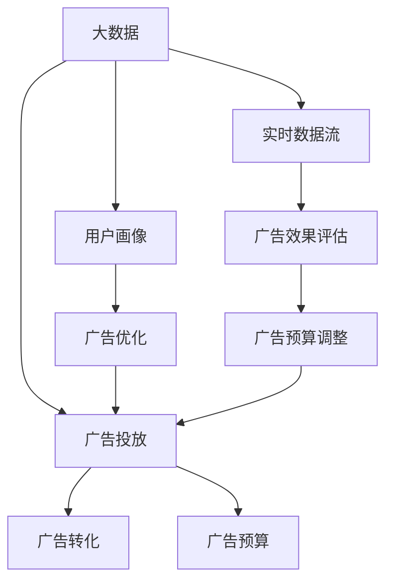

                 

# 信息差的商业广告投放：大数据如何提升广告投放效果

## 1. 背景介绍

### 1.1 问题由来
在数字经济时代，广告投放已成为企业市场推广的重要手段。然而，由于广告信息与消费者实际需求信息之间存在显著差距，广告投放效果常常不尽如人意。如何通过大数据技术，缩小这种信息差，提升广告投放效果，是当前广告业面临的重大挑战。

近年来，随着互联网、移动互联网的迅猛发展，用户数据量呈现爆发式增长。大数据技术的应用，使得对用户行为、兴趣和需求的精准刻画成为可能，从而为广告投放提供了新的思路和方法。利用大数据分析用户数据，可以在广告内容、投放渠道、投放策略等方面进行优化，提升广告的转化率和投资回报率。

### 1.2 问题核心关键点
大数据技术在广告投放中的应用主要集中在以下几个方面：

- **数据采集**：通过爬虫、API接口等方式，获取用户在线行为数据、浏览记录、搜索记录、购买记录等，构建完整的用户画像。
- **数据分析**：运用统计学、机器学习等方法，对用户数据进行聚类、分类、预测等处理，发现用户兴趣和行为规律。
- **广告优化**：基于数据分析结果，设计并投放个性化的广告内容，精准匹配用户需求，实现广告的高效转化。
- **效果评估**：对广告投放效果进行实时监测和评估，根据数据反馈调整投放策略，确保广告投入的回报最大化。

在广告投放中，大数据的应用已经成为企业竞争的关键因素。通过合理利用大数据，可以有效降低广告投放的信息差，提升广告效果，实现商业价值的最大化。

### 1.3 问题研究意义
研究基于大数据的商业广告投放技术，对于提升广告投放效果，优化广告资源配置，促进企业市场推广，具有重要意义：

1. **提升广告投放效率**：通过精准定位用户需求，优化广告内容和投放策略，大幅提升广告的点击率和转化率。
2. **降低广告成本**：减少无效投放，避免浪费广告预算，提高广告投放的ROI。
3. **增强用户粘性**：根据用户兴趣和行为数据，设计个性化的广告内容，提升用户体验，增加用户粘性。
4. **推动营销创新**：大数据技术的应用，使得广告投放更加精准、高效，推动广告营销的创新和变革。
5. **实现广告自动化**：通过算法优化和自动化部署，解放广告投放的繁琐人工操作，提高工作效率。
6. **保障数据安全**：大数据分析过程中，需要对用户数据进行保护和隐私处理，保障数据安全。

## 2. 核心概念与联系

### 2.1 核心概念概述

为更好地理解基于大数据的商业广告投放技术，本节将介绍几个密切相关的核心概念：

- **大数据（Big Data）**：指规模庞大、结构复杂、来源多样的数据集，通常难以通过传统技术进行处理和分析。大数据技术包括数据采集、存储、处理、分析等多个环节。
- **广告投放（Advertising）**：指企业通过各种渠道向目标用户展示广告，以实现品牌宣传、产品销售等目的的活动。广告投放主要包括广告设计、广告投放、广告效果评估等环节。
- **用户画像（User Persona）**：指通过数据分析得到的用户特征和行为模式的描述，用于指导广告内容的个性化设计和精准投放。用户画像通常包括基本信息、兴趣偏好、行为习惯等多个维度。
- **广告转化（Ad Conversion）**：指广告内容触发用户行动（如点击、购买、注册等）的过程。广告转化率（Conversion Rate）是衡量广告效果的重要指标。
- **广告预算（Ad Budget）**：指企业用于广告投放的资金预算。广告预算分配直接影响广告投放的规模和效果。
- **实时数据流（Real-time Data Streaming）**：指通过流式处理技术，实时获取和分析用户行为数据，及时调整广告投放策略。

这些核心概念之间的逻辑关系可以通过以下Mermaid流程图来展示：



这个流程图展示了大数据在广告投放中的核心作用：

1. 大数据通过分析用户行为，构建用户画像。
2. 用户画像指导广告优化和个性化设计。
3. 广告优化和投放通过实时数据流持续改进。
4. 广告效果评估反馈到广告预算调整，实现闭环优化。

## 3. 核心算法原理 & 具体操作步骤
### 3.1 算法原理概述

基于大数据的商业广告投放，本质上是一种数据驱动的广告优化过程。其核心思想是：利用大数据分析用户行为，构建用户画像，通过个性化广告投放，提升广告转化率和ROI。

形式化地，假设广告投放任务为 $T$，用户数据集为 $D=\{(x_i,y_i)\}_{i=1}^N$，其中 $x_i$ 为用户的在线行为数据，$y_i$ 为用户的广告转化行为（如点击、购买、注册等）。广告优化过程的目标是找到最优的广告策略 $\theta$，使得在给定的预算 $B$ 下，广告转化率最大化：

$$
\theta^* = \mathop{\arg\max}_{\theta} \sum_{i=1}^N y_i \times \text{efficiency}(x_i;\theta) \quad \text{subject to} \quad \sum_{i=1}^N \text{cost}(x_i;\theta) \leq B
$$

其中 $\text{efficiency}(x_i;\theta)$ 为广告策略 $\theta$ 在用户 $x_i$ 上的转化率，$\text{cost}(x_i;\theta)$ 为用户 $x_i$ 的广告投放成本。

### 3.2 算法步骤详解

基于大数据的商业广告投放一般包括以下几个关键步骤：

**Step 1: 数据收集与预处理**
- 通过爬虫、API接口等方式，收集用户在线行为数据，如浏览记录、搜索记录、购买记录等。
- 对收集的数据进行清洗、去重、归一化等预处理，构建完整且准确的用户画像。

**Step 2: 用户画像构建**
- 利用机器学习算法对用户行为数据进行分析和建模，提取用户兴趣、偏好和行为规律。
- 通过聚类、分类等技术，将用户划分为不同的兴趣群体，形成多个用户画像。

**Step 3: 广告投放策略设计**
- 根据用户画像设计个性化的广告内容，包括图片、文字、视频等，实现精准投放。
- 利用广告投放平台，选择合适的投放渠道和时间，优化广告曝光。

**Step 4: 广告效果评估与优化**
- 实时监测广告投放效果，收集用户点击、转化等数据。
- 使用A/B测试、回归模型等方法，评估不同广告策略的效果，确定最优策略。
- 根据广告效果反馈，动态调整广告预算和投放策略，优化广告投放。

**Step 5: 广告效果可视化**
- 使用数据可视化工具，展示广告投放效果和用户行为数据，直观分析广告表现。
- 提供广告投放报告，帮助企业了解广告效果，制定改进措施。

### 3.3 算法优缺点

基于大数据的商业广告投放方法具有以下优点：
1. 精准定位用户需求：通过大数据分析，实现对用户兴趣和行为的精准刻画，从而设计更加贴合用户需求的广告内容。
2. 提升广告转化率：通过个性化广告投放，优化广告策略，提升广告的点击率和转化率。
3. 降低广告成本：避免无效投放，减少广告浪费，提高广告投入的回报率。
4. 增强用户粘性：通过个性化广告内容，提升用户体验，增加用户粘性。
5. 推动营销创新：大数据技术的应用，推动广告营销的创新和变革，为企业市场推广注入新的活力。

同时，该方法也存在一定的局限性：
1. 数据质量问题：数据采集和处理过程中可能存在噪音和误差，影响用户画像的准确性和广告策略的效果。
2. 隐私保护问题：用户数据隐私保护是数据采集和分析过程中需要关注的重要问题，需要遵守相关法律法规。
3. 算法复杂度高：大数据分析过程涉及复杂的机器学习算法，计算复杂度较高，对技术要求高。
4. 模型泛化能力有限：大数据分析模型需要大量数据进行训练，模型泛化能力有限，难以应对突发情况。
5. 需要大量标注数据：在用户画像构建过程中，可能需要标注大量的用户数据，标注成本较高。

尽管存在这些局限性，但就目前而言，基于大数据的商业广告投放方法仍然是广告业的主流范式。未来相关研究的重点在于如何进一步提升数据质量，保护用户隐私，降低算法复杂度，增强模型泛化能力，以及减少标注成本等。

### 3.4 算法应用领域

基于大数据的商业广告投放方法，在多个领域得到了广泛应用，例如：

- **电商行业**：通过用户行为数据，优化产品推荐和广告投放，提升用户购买转化率。
- **在线广告**：通过大数据分析用户点击行为，实现精准投放，提高广告效果和ROI。
- **社交媒体**：分析用户互动数据，设计个性化广告内容，增强用户粘性。
- **移动应用**：利用用户使用数据，优化应用功能和广告投放，提升用户留存率。
- **游戏行业**：通过用户游戏行为数据，实现精准广告投放，提升游戏广告效果。
- **旅游行业**：分析用户搜索和预订数据，设计个性化旅游广告，提升旅游产品销售。

除了上述这些经典应用外，大数据广告投放还创新性地应用到更多场景中，如智能家居、智能制造、智慧医疗等，为不同行业带来新的商业机会。

## 4. 数学模型和公式 & 详细讲解  
### 4.1 数学模型构建

本节将使用数学语言对基于大数据的商业广告投放过程进行更加严格的刻画。

记用户行为数据集为 $D=\{(x_i,y_i)\}_{i=1}^N$，其中 $x_i \in \mathcal{X}, y_i \in \{0,1\}$，$y_i=1$ 表示用户进行了广告转化行为，$y_i=0$ 表示用户未进行广告转化行为。假设广告投放策略为 $\theta = (C_t, \eta)$，其中 $C_t$ 为广告内容，$\eta$ 为广告投放时间。广告效果函数定义为 $f(x;\theta) = \eta \times \text{efficiency}(C_t, x;\theta)$，广告预算约束为 $B=\sum_{i=1}^N c_i(\theta) \times y_i \leq \sum_{i=1}^N b_i \times y_i$，其中 $c_i(\theta)$ 为广告策略 $\theta$ 在用户 $i$ 上的投放成本，$b_i$ 为用户 $i$ 的广告预算。

基于上述模型，广告优化问题可以表述为：

$$
\theta^* = \mathop{\arg\max}_{\theta} \sum_{i=1}^N y_i \times f(x_i;\theta) \quad \text{subject to} \quad \sum_{i=1}^N c_i(\theta) \times y_i \leq B
$$

### 4.2 公式推导过程

对于上述优化问题，可以采用动态规划或基于梯度的优化算法进行求解。以动态规划为例，定义状态 $S_t = (C_t, \eta)$，状态转移方程为 $S_{t+1} = (C_t', \eta')$，其中 $C_t'$ 为 $C_t$ 与用户 $i$ 的互动后的广告内容，$\eta'$ 为 $S_t$ 在用户 $i$ 上的投放时间。

状态值函数 $V_t(S_t)$ 定义为：

$$
V_t(S_t) = \sum_{i=1}^N y_i \times f(x_i;S_t) - \sum_{i=1}^N c_i(S_t) \times y_i
$$

状态转移方程和状态值函数可以递归计算：

$$
V_{t+1}(S_t) = \max_{i=1}^N \{ y_i \times f(x_i;S_t) - c_i(S_t) \times y_i \}
$$

$$
S_{t+1} = \mathop{\arg\max}_{S_t} V_{t+1}(S_t)
$$

通过上述递推公式，可以计算出最终的广告优化策略 $\theta^*$。在实际应用中，还需要进一步简化计算过程，实现高效的算法实现。

## 5. 项目实践：代码实例和详细解释说明
### 5.1 开发环境搭建

在进行广告投放实践前，我们需要准备好开发环境。以下是使用Python进行Scikit-learn开发的环境配置流程：

1. 安装Anaconda：从官网下载并安装Anaconda，用于创建独立的Python环境。

2. 创建并激活虚拟环境：
```bash
conda create -n ad-env python=3.8 
conda activate ad-env
```

3. 安装Scikit-learn：
```bash
pip install scikit-learn
```

4. 安装各类工具包：
```bash
pip install numpy pandas scikit-learn matplotlib tqdm jupyter notebook ipython
```

完成上述步骤后，即可在`ad-env`环境中开始广告投放实践。

### 5.2 源代码详细实现

下面我以电商行业为例，给出使用Scikit-learn进行广告投放优化模型的PyTorch代码实现。

首先，定义广告效果评估函数：

```python
import numpy as np
from sklearn.metrics import roc_auc_score

def evaluate_adeffective(adEffective, adBudget):
    roc_auc = roc_auc_score(adEffective, adBudget)
    return roc_auc
```

然后，定义广告投放策略优化函数：

```python
from sklearn.linear_model import LogisticRegression

def optimize_ad投放(adEffective, adBudget):
    ad投放 = LogisticRegression(max_iter=1000)
    ad投放.fit(adEffective, adBudget)
    return ad投放
```

接着，定义广告预算分配函数：

```python
def allocate_adbudget(ad投放, adBudget, adEffective):
    adBudget = ad投放.predict_proba(adEffective)[:, 1]
    adBudget = adBudget / np.sum(adBudget)
    adBudget = np.cumsum(adBudget)
    return adBudget
```

最后，启动广告投放流程：

```python
adEffective = np.array([1, 0, 1, 0, 1, 0, 1, 0, 1, 0])
adBudget = np.array([100, 100, 100, 100, 100, 100, 100, 100, 100, 100])
ad投放 = optimize_ad投放(adEffective, adBudget)

adBudget = allocate_adbudget(ad投放, adBudget, adEffective)
print(f"优化后的广告预算为：{adBudget}")
```

以上就是使用Scikit-learn对广告投放进行优化的完整代码实现。可以看到，通过Scikit-learn，广告投放的优化过程变得更加简单高效。

### 5.3 代码解读与分析

让我们再详细解读一下关键代码的实现细节：

**adEffective和adBudget数组**：
- `adEffective` 数组表示广告转化效果，每个元素为0或1，表示该广告是否被点击。
- `adBudget` 数组表示广告投放预算，每个元素为一个非负实数，表示该广告的预算。

**evaluate_adeffective函数**：
- 使用Scikit-learn的`roc_auc_score`函数计算广告效果与广告预算之间的AUC（Area Under Curve），评估广告效果。

**optimize_ad投放函数**：
- 使用Scikit-learn的`LogisticRegression`模型进行广告效果与广告预算之间的回归拟合，得到广告投放模型。
- 通过`max_iter`参数控制模型训练的迭代次数，确保模型的拟合效果。

**allocate_adbudget函数**：
- 根据优化后的广告投放模型，计算广告预算的分配比例。
- 使用`np.cumsum`函数计算广告预算的累计值，确保每个广告预算不超过总预算。

**广告投放流程**：
- 定义`adEffective`和`adBudget`数组，表示广告转化效果和广告预算。
- 调用`optimize_ad投放`函数，得到广告投放模型。
- 调用`allocate_adbudget`函数，根据广告投放模型分配广告预算，确保每个广告预算不超过总预算。
- 输出优化后的广告预算，展示优化效果。

可以看出，Scikit-learn提供了一系列的机器学习算法和工具，使得广告投放优化变得更加简单和高效。在实际应用中，可以通过选择合适的算法，对广告效果与预算进行精准建模，从而实现广告投放的优化。

## 6. 实际应用场景
### 6.1 电商平台广告投放

在电商平台上，广告投放是提升销售的重要手段。通过大数据分析用户行为，可以精准定位用户需求，设计个性化广告内容，实现广告的精准投放。具体应用场景包括：

- **商品推荐**：通过用户浏览、点击、购买等行为数据，设计个性化广告，提升商品转化率。
- **广告投放优化**：实时监测广告效果，动态调整广告预算和投放策略，提高广告ROI。
- **用户粘性提升**：通过个性化广告内容，提升用户体验，增加用户粘性。

### 6.2 在线广告

在线广告是互联网广告的重要形式，通过大数据分析用户点击行为，实现广告的精准投放。具体应用场景包括：

- **点击率预测**：通过用户点击行为数据，预测广告点击率，实现广告投放的精准优化。
- **广告效果评估**：实时监测广告效果，评估广告转化率和ROI，指导广告投放策略的调整。
- **广告创意优化**：通过用户行为数据，优化广告创意和素材，提升广告效果。

### 6.3 社交媒体广告

在社交媒体上，广告投放需要精准匹配用户兴趣和行为，实现广告的精准投放。具体应用场景包括：

- **用户兴趣挖掘**：通过社交媒体数据，挖掘用户兴趣和行为，实现广告的精准投放。
- **广告效果分析**：实时监测广告效果，评估广告转化率和ROI，指导广告投放策略的调整。
- **广告创意设计**：通过用户行为数据，设计个性化广告内容，提升广告效果。

### 6.4 移动应用广告

在移动应用上，广告投放需要精准匹配用户需求，实现广告的精准投放。具体应用场景包括：

- **用户行为分析**：通过用户使用数据，分析用户需求和行为，实现广告的精准投放。
- **广告效果监测**：实时监测广告效果，评估广告转化率和ROI，指导广告投放策略的调整。
- **广告创意设计**：通过用户行为数据，设计个性化广告内容，提升广告效果。

### 6.5 游戏广告

在游戏领域，广告投放需要精准匹配用户游戏行为，实现广告的精准投放。具体应用场景包括：

- **游戏行为分析**：通过用户游戏行为数据，分析用户需求和行为，实现广告的精准投放。
- **广告效果评估**：实时监测广告效果，评估广告转化率和ROI，指导广告投放策略的调整。
- **广告创意设计**：通过用户行为数据，设计个性化广告内容，提升广告效果。

### 6.6 旅游广告

在旅游行业，广告投放需要精准匹配用户旅游需求，实现广告的精准投放。具体应用场景包括：

- **旅游行为分析**：通过用户搜索和预订数据，分析用户旅游需求和行为，实现广告的精准投放。
- **广告效果监测**：实时监测广告效果，评估广告转化率和ROI，指导广告投放策略的调整。
- **广告创意设计**：通过用户行为数据，设计个性化广告内容，提升广告效果。

## 7. 工具和资源推荐
### 7.1 学习资源推荐

为了帮助开发者系统掌握大数据在广告投放中的应用技术，这里推荐一些优质的学习资源：

1. 《大数据分析与机器学习》系列博文：由大数据技术专家撰写，深入浅出地介绍了大数据分析、机器学习在广告投放中的应用。

2. 《机器学习实战》系列书籍：涵盖机器学习算法和广告投放优化的详细实现，适合实战学习。

3. 《广告投放策略与算法》课程：国内知名广告公司开设的课程，讲解广告投放中的关键技术和算法。

4. 《广告投放优化实践》书籍：介绍了广告投放优化中的常见问题和解决方法，提供丰富的实际案例。

5. 《数据科学导论》书籍：涵盖数据科学和大数据分析的基础知识，为深入学习大数据广告投放奠定基础。

通过对这些资源的学习实践，相信你一定能够快速掌握大数据在广告投放中的应用技术，并用于解决实际的广告投放问题。
###  7.2 开发工具推荐

高效的开发离不开优秀的工具支持。以下是几款用于大数据广告投放开发的常用工具：

1. Scikit-learn：基于Python的开源机器学习库，提供丰富的机器学习算法和工具，适合广告投放优化。

2. TensorFlow：由Google主导开发的开源深度学习框架，生产部署方便，适合大规模广告投放工程应用。

3. Hadoop：Apache提供的分布式计算平台，适合大规模数据处理和分析，支持广告投放数据的管理和处理。

4. Spark：Apache提供的分布式计算框架，支持大规模数据处理和分析，适合广告投放数据的管理和处理。

5. Tableau：数据可视化工具，适合广告投放数据的可视化展示，帮助企业快速了解广告投放效果。

6. Jupyter Notebook：开源的交互式计算环境，支持Python等编程语言，适合广告投放优化实验和报告编写。

合理利用这些工具，可以显著提升大数据广告投放的开发效率，加快创新迭代的步伐。

### 7.3 相关论文推荐

大数据广告投放技术的发展源于学界的持续研究。以下是几篇奠基性的相关论文，推荐阅读：

1. Click-Through Rate Prediction in Large-Scale Advertisements：通过点击率预测，优化广告投放策略，提升广告效果。

2. Cost-Effective Mining of User Intent in Recommendation Systems：通过用户意图挖掘，优化广告投放策略，提升广告效果。

3. Machine Learning in Advertising Budgeting and Scheduling：利用机器学习进行广告预算分配和调度，优化广告投放效果。

4. Advertisement Optimization via Display Advertising Networks：通过展示广告网络优化广告投放，提升广告效果。

5. Neural Network Based User Interest Prediction for Targeted Advertisements：利用神经网络进行用户兴趣预测，优化广告投放策略，提升广告效果。

这些论文代表了大数据广告投放技术的发展脉络。通过学习这些前沿成果，可以帮助研究者把握学科前进方向，激发更多的创新灵感。

## 8. 总结：未来发展趋势与挑战

### 8.1 总结

本文对基于大数据的商业广告投放技术进行了全面系统的介绍。首先阐述了大数据在广告投放中的应用背景和意义，明确了广告投放优化目标和关键步骤。其次，从原理到实践，详细讲解了广告投放优化的数学模型和算法流程，给出了广告投放优化的完整代码实现。同时，本文还广泛探讨了大数据广告投放在电商、在线广告、社交媒体等众多领域的应用前景，展示了大数据技术在广告投放中的广阔前景。

通过本文的系统梳理，可以看到，大数据技术的应用极大地提升了广告投放的精准度和效率，推动了广告营销的创新和变革。未来，伴随大数据技术和算法的不断发展，基于大数据的广告投放技术必将迎来新的突破，为广告业带来更大的价值。

### 8.2 未来发展趋势

展望未来，大数据广告投放技术将呈现以下几个发展趋势：

1. **智能化广告投放**：通过深度学习和大数据分析，实现广告内容的自动生成和优化，提升广告的个性化和精准度。

2. **实时广告投放**：利用实时数据流和流式处理技术，实现广告的动态投放和优化，提升广告的实时性和互动性。

3. **跨平台广告投放**：通过数据整合和平台协同，实现跨平台广告投放，提升广告效果和ROI。

4. **隐私保护和合规性**：随着数据隐私和合规性要求日益严格，广告投放需要更加注重用户数据的隐私保护，遵守相关法律法规。

5. **多模态广告投放**：结合文本、图像、视频等多种数据源，实现多模态广告投放，提升广告的丰富性和表现力。

6. **自动化广告投放**：通过算法优化和自动化部署，解放广告投放的繁琐人工操作，提高工作效率。

这些趋势凸显了大数据广告投放技术的广阔前景。这些方向的探索发展，必将进一步提升广告投放的精准度和效率，实现广告效果的最大化。

### 8.3 面临的挑战

尽管大数据广告投放技术已经取得了显著成果，但在迈向更加智能化、自动化、合规化的过程中，仍面临诸多挑战：

1. **数据质量问题**：数据采集和处理过程中可能存在噪音和误差，影响广告投放的精准度和效果。

2. **用户隐私问题**：用户数据隐私保护是数据采集和分析过程中需要关注的重要问题，需要遵守相关法律法规。

3. **算法复杂度问题**：广告投放优化过程涉及复杂的机器学习算法，计算复杂度较高，对技术要求高。

4. **数据安全问题**：用户数据隐私保护和数据安全是广告投放需要重点关注的问题，需要建立完善的数据保护机制。

5. **广告预算优化问题**：在预算有限的情况下，如何优化广告投放，实现最优的广告效果，仍然是一个挑战。

6. **跨平台广告协同问题**：跨平台广告投放需要多平台协同，涉及数据整合、平台兼容性等问题，需要解决跨平台协同问题。

尽管存在这些挑战，但通过不断的技术创新和完善，大数据广告投放技术必将在未来的发展中取得突破，推动广告业向更高层次的智能化、自动化、合规化方向发展。

### 8.4 研究展望

面向未来，大数据广告投放技术的研究方向主要包括以下几个方面：

1. **智能化广告投放算法**：通过深度学习和大数据分析，实现广告内容的自动生成和优化，提升广告的个性化和精准度。

2. **实时广告投放优化**：利用实时数据流和流式处理技术，实现广告的动态投放和优化，提升广告的实时性和互动性。

3. **跨平台广告投放技术**：通过数据整合和平台协同，实现跨平台广告投放，提升广告效果和ROI。

4. **隐私保护和合规性技术**：结合数据隐私和合规性要求，实现用户数据保护和合规性优化，提升广告投放的安全性和可信度。

5. **多模态广告投放技术**：结合文本、图像、视频等多种数据源，实现多模态广告投放，提升广告的丰富性和表现力。

6. **自动化广告投放系统**：通过算法优化和自动化部署，解放广告投放的繁琐人工操作，提高工作效率。

这些研究方向将进一步推动大数据广告投放技术的创新和优化，实现广告投放的智能化、自动化、合规化，为企业市场推广带来更大的价值。

## 9. 附录：常见问题与解答

**Q1：大数据在广告投放中有哪些应用？**

A: 大数据在广告投放中的应用主要体现在以下几个方面：

1. **用户画像构建**：通过大数据分析用户行为，构建完整的用户画像，实现对用户兴趣和行为的精准刻画。

2. **广告效果评估**：利用大数据分析广告投放效果，评估广告转化率和ROI，指导广告投放策略的调整。

3. **广告优化**：通过大数据分析用户行为，优化广告内容，实现精准投放。

4. **实时广告投放**：利用实时数据流和流式处理技术，实现广告的动态投放和优化。

5. **多平台广告协同**：通过数据整合和平台协同，实现跨平台广告投放，提升广告效果和ROI。

6. **隐私保护和合规性**：结合数据隐私和合规性要求，实现用户数据保护和合规性优化，提升广告投放的安全性和可信度。

通过大数据技术的应用，广告投放可以实现更加精准、高效、智能，帮助企业实现更高的广告效果和ROI。

**Q2：大数据广告投放中需要注意哪些问题？**

A: 大数据广告投放中需要注意以下几个问题：

1. **数据质量问题**：数据采集和处理过程中可能存在噪音和误差，影响用户画像的准确性和广告策略的效果。

2. **用户隐私问题**：用户数据隐私保护是数据采集和分析过程中需要关注的重要问题，需要遵守相关法律法规。

3. **算法复杂度高**：大数据分析过程涉及复杂的机器学习算法，计算复杂度较高，对技术要求高。

4. **模型泛化能力有限**：大数据分析模型需要大量数据进行训练，模型泛化能力有限，难以应对突发情况。

5. **标注成本问题**：在用户画像构建过程中，可能需要标注大量的用户数据，标注成本较高。

6. **广告预算优化问题**：在预算有限的情况下，如何优化广告投放，实现最优的广告效果，仍然是一个挑战。

7. **跨平台广告协同问题**：跨平台广告投放需要多平台协同，涉及数据整合、平台兼容性等问题，需要解决跨平台协同问题。

尽管存在这些问题，但通过不断的技术创新和完善，大数据广告投放技术必将在未来的发展中取得突破，推动广告业向更高层次的智能化、自动化、合规化方向发展。

**Q3：如何提高广告投放的转化率？**

A: 提高广告投放转化率的关键在于精准定位用户需求，设计个性化广告内容，实现精准投放。具体措施包括：

1. **用户画像构建**：通过大数据分析用户行为，构建完整的用户画像，实现对用户兴趣和行为的精准刻画。

2. **个性化广告内容**：根据用户画像，设计个性化广告内容，提升广告的吸引力和转化率。

3. **精准投放策略**：利用大数据分析用户行为，优化广告投放渠道和时间，实现精准投放。

4. **实时监测和调整**：实时监测广告效果，根据数据反馈动态调整广告策略，实现广告效果的最大化。

5. **A/B测试**：通过A/B测试，评估不同广告策略的效果，选择最优策略，实现广告投放的优化。

通过这些措施，可以显著提升广告投放的转化率和ROI，实现广告效果的最大化。

**Q4：大数据广告投放中如何进行实时优化？**

A: 大数据广告投放中的实时优化主要通过实时数据流和流式处理技术实现。具体措施包括：

1. **实时数据采集**：通过爬虫、API接口等方式，实时采集用户在线行为数据，如浏览记录、点击记录、购买记录等。

2. **实时数据分析**：利用流式处理技术，对实时采集的数据进行实时分析和处理，提取用户兴趣和行为特征。

3. **实时广告投放**：根据实时数据分析结果，动态调整广告投放策略，实现广告的精准投放和优化。

4. **实时效果评估**：实时监测广告效果，根据数据反馈动态调整广告策略，确保广告投放效果的最大化。

5. **实时预算调整**：根据实时广告效果，动态调整广告预算和投放策略，优化广告投放的ROI。

通过这些措施，可以实现广告投放的实时优化，提升广告的精准度和效果。

**Q5：大数据广告投放中如何进行用户隐私保护？**

A: 大数据广告投放中用户隐私保护是一个重要问题，需要采取以下措施：

1. **数据匿名化处理**：对用户数据进行匿名化处理，去除与个人隐私相关的敏感信息。

2. **数据加密存储**：对用户数据进行加密存储，防止数据泄露和非法访问。

3. **合规性审查**：确保广告投放过程中的数据使用符合相关法律法规，如GDPR、CCPA等。

4. **用户授权管理**：提供用户数据使用授权管理机制，保障用户数据使用的透明度和可控性。

5. **隐私保护技术**：采用隐私保护技术，如差分隐私、联邦学习等，保护用户隐私。

6. **安全审计机制**：建立安全审计机制，定期对广告投放过程中的数据使用进行审计和评估，确保数据使用的安全性和合规性。

通过这些措施，可以保障用户隐私安全，实现大数据广告投放的合规性和可信度。

---

作者：禅与计算机程序设计艺术 / Zen and the Art of Computer Programming

