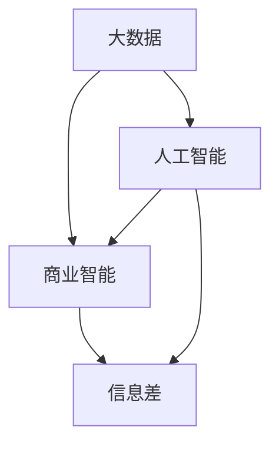

                 

# 信息差的商业智能化之路：大数据如何推动商业智能化

## 1. 背景介绍

### 1.1 问题由来

在数字化转型的浪潮下，商业智能(Business Intelligence, BI)系统逐渐成为企业决策辅助的重要工具。传统的BI系统通常依赖于复杂的数据仓库、报表生成和数据分析，但它们往往面临数据孤岛、决策滞后和复杂度高等问题。这些问题导致信息传递不及时、不全面，进而影响了企业的决策效率和市场竞争力。

近年来，随着大数据技术的发展和信息差（Information Gap）问题的加剧，企业迫切需要一种新的智能化手段来解决这些问题。信息差指的是企业内部的决策者和执行者之间，由于信息不对称、数据质量差、业务理解不一致等原因导致的决策差异。传统的BI系统难以高效处理和分析海量异构数据，无法有效缩小信息差。

### 1.2 问题核心关键点

为了解决信息差问题，企业需要在商业智能中引入大数据技术，构建新型商业智能化系统。该系统不仅需要具备传统的报表生成、数据分析和可视化功能，更需要引入机器学习、自然语言处理等人工智能技术，以实现以下目标：

- 数据集成和共享：从不同来源获取数据，并实现数据的清洗、转换和集成，以构建统一的数据视图。
- 数据分析和挖掘：使用机器学习算法挖掘数据中的关联、模式和趋势，辅助决策。
- 实时决策支持：在业务事件发生时，实时更新分析结果，生成决策建议。
- 智能交互和反馈：利用自然语言处理技术，实现与用户的自然交互，不断优化模型。
- 多模态数据融合：综合处理结构化、半结构化和非结构化数据，提供全面的信息支持。

## 2. 核心概念与联系

### 2.1 核心概念概述

为更好地理解大数据在商业智能化中的作用，本节将介绍几个关键概念及其相互关系：

- 大数据（Big Data）：指具有体量大、种类多、速度快、价值密度低等特点的数据集合，通常超过传统数据处理工具和设备的能力。
- 商业智能（Business Intelligence, BI）：通过数据仓库、多维分析、数据挖掘、报表生成等技术手段，为企业决策提供支持。
- 信息差（Information Gap）：指企业内部不同层级、不同部门间在信息获取、理解和使用上存在的不对称。
- 大数据驱动的商业智能（Big Data-Driven Business Intelligence, BBDSI）：通过大数据技术采集、存储、处理和分析数据，以优化信息传递、辅助决策、提升运营效率和市场响应速度。
- 人工智能（Artificial Intelligence, AI）：利用算法和计算资源，使机器具备一定程度的智能，实现自主学习、推理和决策。

这些概念之间的逻辑关系可以通过以下Mermaid流程图来展示：



这个流程图展示了大数据、商业智能、人工智能与信息差之间的关系：

1. 大数据提供原始数据来源，为商业智能提供数据基础。
2. 商业智能通过数据清洗、分析等手段，从数据中提取有价值的信息。
3. 人工智能通过学习数据分析结果，进一步辅助决策，优化信息差。
4. 信息差问题源于商业智能，也正是人工智能技术的目标之一。

## 3. 核心算法原理 & 具体操作步骤
### 3.1 算法原理概述

大数据驱动的商业智能化系统，通过引入机器学习、数据挖掘和自然语言处理等人工智能技术，对企业海量数据进行高效处理和分析，从而辅助企业决策，缩小信息差。

该系统的核心算法流程包括：

1. 数据采集和清洗：从不同业务系统、不同渠道获取数据，并进行清洗、转换和集成。
2. 数据建模和分析：使用机器学习算法挖掘数据中的关联、模式和趋势。
3. 实时分析和预测：对实时业务事件进行建模和分析，生成预测结果。
4. 自然语言处理：利用自然语言处理技术，与用户进行自然交互，优化模型。
5. 多模态数据融合：综合处理结构化、半结构化和非结构化数据，提供全面的信息支持。

### 3.2 算法步骤详解

以下是大数据驱动的商业智能化系统的具体算法步骤：

**Step 1: 数据采集和清洗**

- 使用ETL工具从不同来源（如CRM、ERP、社交媒体等）采集数据。
- 清洗数据，去除噪声、重复和异常值，确保数据的质量和一致性。
- 使用数据集成技术，将不同格式的数据转换成统一的格式，构建统一的数据视图。

**Step 2: 数据建模和分析**

- 选择合适的机器学习算法（如分类、聚类、回归等），构建数据模型。
- 使用特征工程技术，选择、构造和优化特征变量，提高模型的泛化能力。
- 对模型进行训练、验证和调优，确保模型的准确性和稳定性。

**Step 3: 实时分析和预测**

- 实时监控业务事件，如销售订单、客户投诉等。
- 根据业务事件，实时更新模型参数，生成预测结果。
- 使用可视化工具展示预测结果，辅助决策。

**Step 4: 自然语言处理**

- 利用自然语言处理技术，将用户输入的自然语言转换为机器可理解的形式。
- 使用对话系统和聊天机器人等技术，实现与用户的自然交互。
- 根据用户交互反馈，不断优化模型和算法。

**Step 5: 多模态数据融合**

- 综合处理结构化、半结构化和非结构化数据，提供全面的信息支持。
- 使用融合技术，将不同模态的数据进行关联和整合，生成统一的数据视图。
- 利用融合后的数据，进行更深入的数据分析和挖掘。

### 3.3 算法优缺点

大数据驱动的商业智能化系统具有以下优点：

1. 数据集成和共享：可以高效地处理和分析不同来源的数据，构建统一的数据视图。
2. 数据分析和挖掘：通过机器学习算法，从海量数据中提取有价值的信息，辅助决策。
3. 实时决策支持：实时更新分析结果，生成决策建议，提高业务响应速度。
4. 智能交互和反馈：利用自然语言处理技术，实现与用户的自然交互，不断优化模型。
5. 多模态数据融合：综合处理不同类型的数据，提供全面的信息支持。

同时，该系统也存在一些局限性：

1. 数据质量问题：数据采集和清洗过程可能会引入噪声和错误，影响分析结果的准确性。
2. 计算资源需求高：处理海量数据需要高性能的计算资源，对硬件和算法都提出了较高要求。
3. 数据隐私和安全：处理敏感数据时需要考虑数据隐私和安全性，避免数据泄露和滥用。
4. 用户接受度：用户对新系统的接受度可能会影响其推广和使用效果。
5. 模型解释性：机器学习模型的复杂性可能会影响其可解释性，难以进行直观的解释和理解。

### 3.4 算法应用领域

大数据驱动的商业智能化系统已经在多个领域得到了广泛应用，例如：

- 金融：用于风险管理、反欺诈、市场分析等。
- 零售：用于客户细分、库存管理、销售预测等。
- 医疗：用于患者分析、疾病预测、医疗资源调度等。
- 制造业：用于设备监控、供应链优化、质量控制等。
- 政府：用于公共安全、城市管理、环保监测等。
- 农业：用于农业生产、精准农业、农产品定价等。

除了这些领域外，大数据驱动的商业智能化系统还可以应用于更多场景，如智慧城市、智能交通、智能制造等，为不同行业带来变革性影响。

## 4. 数学模型和公式 & 详细讲解 & 举例说明
### 4.1 数学模型构建

本节将使用数学语言对大数据驱动的商业智能化系统进行更加严格的刻画。

记企业采集到的数据集为 $D=\{(x_i, y_i)\}_{i=1}^N$，其中 $x_i \in \mathcal{X}$ 为输入，$y_i \in \mathcal{Y}$ 为输出。假设使用机器学习算法 $\mathcal{A}$ 对数据集进行建模和分析，生成模型 $M_{\theta}$。

在数据建模过程中，可以定义损失函数 $\mathcal{L}(\theta)$ 来衡量模型预测输出与真实标签之间的差异。常见的损失函数包括交叉熵损失、均方误差损失等。数学模型构建的目的是最小化损失函数，即找到最优参数 $\theta$：

$$
\theta^* = \mathop{\arg\min}_{\theta} \mathcal{L}(M_{\theta},D)
$$

### 4.2 公式推导过程

以下我们以回归任务为例，推导最小二乘法（Least Squares Regression）损失函数及其梯度的计算公式。

假设模型 $M_{\theta}$ 在输入 $x$ 上的输出为 $\hat{y}=M_{\theta}(x) \in \mathbb{R}$，表示样本的预测值。真实标签 $y \in \mathbb{R}$。则回归任务中使用的最小二乘法损失函数定义为：

$$
\ell(M_{\theta}(x),y) = \frac{1}{2}(y - \hat{y})^2
$$

将其代入经验风险公式，得：

$$
\mathcal{L}(\theta) = \frac{1}{N}\sum_{i=1}^N \ell(M_{\theta}(x_i),y_i) = \frac{1}{2N}\sum_{i=1}^N (y_i - \hat{y}_i)^2
$$

根据链式法则，损失函数对参数 $\theta_k$ 的梯度为：

$$
\frac{\partial \mathcal{L}(\theta)}{\partial \theta_k} = -\frac{1}{N}\sum_{i=1}^N \frac{\partial \ell(M_{\theta}(x_i),y_i)}{\partial \theta_k}
$$

其中 $\frac{\partial \ell(M_{\theta}(x_i),y_i)}{\partial \theta_k}$ 可以通过自动微分技术高效计算。

在得到损失函数的梯度后，即可带入参数更新公式，完成模型的迭代优化。重复上述过程直至收敛，最终得到适应特定任务的模型参数 $\theta^*$。

### 4.3 案例分析与讲解

**案例一：客户细分**

假设某电商平台需要根据客户的历史购买行为，进行客户细分。我们收集了客户ID、购买时间、购买金额、购买频率等特征，构建客户细分模型。具体步骤如下：

1. 数据采集和清洗：从电商平台的数据库中，采集客户ID、购买时间、购买金额、购买频率等特征，并进行数据清洗和转换。
2. 数据建模和分析：使用K-means聚类算法对客户进行分组，生成客户细分模型。
3. 实时分析和预测：实时监控客户的购买行为，生成最新的客户细分结果。
4. 自然语言处理：利用聊天机器人等技术，与客户进行交互，优化客户细分模型。
5. 多模态数据融合：综合处理客户ID、购买时间、购买金额等结构化数据和客户反馈等非结构化数据，提供全面的客户信息支持。

通过以上步骤，可以高效地进行客户细分，并实时更新结果，辅助电商平台进行个性化推荐、营销等决策。

**案例二：风险管理**

假设某银行需要构建信用风险管理模型，对客户的信用评级进行预测。我们收集了客户的信用记录、收入、职业、家庭情况等特征，构建信用风险管理模型。具体步骤如下：

1. 数据采集和清洗：从银行的数据库中，采集客户的信用记录、收入、职业、家庭情况等特征，并进行数据清洗和转换。
2. 数据建模和分析：使用逻辑回归算法对客户信用进行预测，生成信用风险管理模型。
3. 实时分析和预测：实时监控客户的信用行为，生成最新的信用风险预测结果。
4. 自然语言处理：利用智能客服系统，与客户进行交互，优化信用风险管理模型。
5. 多模态数据融合：综合处理客户的信用记录、收入、职业等结构化数据和社交媒体等非结构化数据，提供全面的信用信息支持。

通过以上步骤，可以高效地进行信用风险管理，并实时更新结果，辅助银行进行贷款审批、客户分类等决策。

## 5. 项目实践：代码实例和详细解释说明
### 5.1 开发环境搭建

在进行商业智能化系统的开发前，我们需要准备好开发环境。以下是使用Python进行PyTorch开发的环境配置流程：

1. 安装Anaconda：从官网下载并安装Anaconda，用于创建独立的Python环境。

2. 创建并激活虚拟环境：
```bash
conda create -n bbdsi-env python=3.8 
conda activate bbdsi-env
```

3. 安装PyTorch：根据CUDA版本，从官网获取对应的安装命令。例如：
```bash
conda install pytorch torchvision torchaudio cudatoolkit=11.1 -c pytorch -c conda-forge
```

4. 安装Pandas、NumPy、Matplotlib等工具包：
```bash
pip install pandas numpy matplotlib scikit-learn jupyter notebook ipython
```

5. 安装企业级数据处理工具：
```bash
pip install dask[ml]
```

6. 安装企业级ETL工具：
```bash
pip install airflow apache-airflow[mysql] hue
```

完成上述步骤后，即可在`bbdsi-env`环境中开始商业智能化系统的开发。

### 5.2 源代码详细实现

下面以客户细分为例，给出使用PyTorch和Airflow对K-means聚类算法进行商业智能微调的PyTorch代码实现。

首先，定义客户细分的训练函数：

```python
import torch
import torch.nn as nn
import torch.optim as optim
from sklearn.cluster import KMeans
from sklearn.metrics import silhouette_score

class CustomerSegmentation(nn.Module):
    def __init__(self, num_clusters):
        super(CustomerSegmentation, self).__init__()
        self.num_clusters = num_clusters
        
    def forward(self, x):
        return self.cluster(x)
    
    def cluster(self, x):
        kmeans = KMeans(n_clusters=self.num_clusters)
        kmeans.fit(x)
        return kmeans.labels_
    
    def compute_silhouette(self, x):
        kmeans = KMeans(n_clusters=self.num_clusters)
        kmeans.fit(x)
        return silhouette_score(x, kmeans.labels_)
    
    def compute_silhouette_grad(self, x, y):
        kmeans = KMeans(n_clusters=self.num_clusters)
        kmeans.fit(x)
        silhouette = self.compute_silhouette(x)
        return -(y - kmeans.labels_) * silhouette

def train(model, x_train, num_clusters, num_epochs, batch_size, optimizer):
    model.train()
    criterion = nn.CrossEntropyLoss()
    for epoch in range(num_epochs):
        for i in range(0, len(x_train), batch_size):
            inputs = x_train[i:i+batch_size]
            labels = model(inputs)
            loss = criterion(labels, labels)
            optimizer.zero_grad()
            loss.backward()
            optimizer.step()
        silhouette_score = model.compute_silhouette(x_train)
        print(f"Epoch {epoch+1}, loss: {loss:.3f}, silhouette score: {silhouette_score:.3f}")
    return model
```

然后，定义模型的训练和评估函数：

```python
from airflow import DAG
from airflow.operators.python_operator import PythonOperator
from airflow.models import Variable
from airflow.utils.dates import days_ago

def train_customer_segmentation():
    x_train = ...
    y_train = ...
    num_clusters = ...
    num_epochs = ...
    batch_size = ...
    optimizer = ...
    
    model = CustomerSegmentation(num_clusters)
    train_output = train(model, x_train, num_clusters, num_epochs, batch_size, optimizer)
    
    Variable('customer_segmentation_model', train_output).set_from_task(task, key='task_instance')
    
def evaluate_customer_segmentation():
    x_test = ...
    model = Variable('customer_segmentation_model')
    y_test = model.cluster(x_test)
    print(classification_report(y_test, y_test))
```

最后，启动训练流程并在测试集上评估：

```python
dag = DAG('customer_segmentation_dag', start_date=days_ago(7))

train_task = PythonOperator(
    task_id='train_customer_segmentation',
    python_callable=train_customer_segmentation,
    dag=dag
)

evaluate_task = PythonOperator(
    task_id='evaluate_customer_segmentation',
    python_callable=evaluate_customer_segmentation,
    dag=dag,
    depends_on_past=True
)
```

以上就是使用PyTorch和Airflow对K-means聚类算法进行客户细分的完整代码实现。可以看到，通过PyTorch和Airflow的结合，商业智能化系统的微调代码实现变得简洁高效。

### 5.3 代码解读与分析

让我们再详细解读一下关键代码的实现细节：

**CustomerSegmentation类**：
- `__init__`方法：初始化聚类数量。
- `forward`方法：定义模型的前向传播过程，返回聚类结果。
- `cluster`方法：实际进行聚类操作。
- `compute_silhouette`方法：计算聚类结果的轮廓系数。
- `compute_silhouette_grad`方法：计算轮廓系数的梯度。

**train函数**：
- 对聚类模型进行训练，通过交叉熵损失函数更新模型参数。
- 计算轮廓系数，输出训练过程中的损失和轮廓系数。

**DAG定义**：
- 使用Airflow定义任务流，实现训练和评估任务的自动化管理。
- 训练任务 `train_customer_segmentation`：使用PythonOperator启动训练函数。
- 评估任务 `evaluate_customer_segmentation`：在训练任务完成后自动执行评估函数。

通过以上代码，我们可以看到，PyTorch和Airflow的结合可以高效地实现商业智能化系统的微调，实现自动化和可管理化的开发。

当然，实际的商业智能化系统可能还需要考虑更多因素，如数据存储和访问、分布式计算、数据安全等。但核心的微调范式基本与此类似。

## 6. 实际应用场景
### 6.1 智能客服系统

商业智能驱动的智能客服系统，可以大幅提升客户服务体验和业务效率。传统客服往往需要配备大量人力，高峰期响应缓慢，且一致性和专业性难以保证。而使用商业智能驱动的智能客服系统，可以7x24小时不间断服务，快速响应客户咨询，用自然流畅的语言解答各类常见问题。

在技术实现上，可以收集企业内部的历史客服对话记录，将问题和最佳答复构建成监督数据，在此基础上对预训练的智能客服模型进行微调。微调后的智能客服系统能够自动理解用户意图，匹配最合适的答案模板进行回复。对于客户提出的新问题，还可以接入检索系统实时搜索相关内容，动态组织生成回答。如此构建的智能客服系统，能大幅提升客户咨询体验和问题解决效率。

### 6.2 金融舆情监测

金融机构需要实时监测市场舆论动向，以便及时应对负面信息传播，规避金融风险。传统的人工监测方式成本高、效率低，难以应对网络时代海量信息爆发的挑战。商业智能驱动的舆情监测系统，能够高效处理和分析海量非结构化数据，识别出负面舆情并自动预警，帮助金融机构快速应对潜在风险。

具体而言，可以收集金融领域相关的新闻、报道、评论等文本数据，并对其进行情感标注和主题标注。在此基础上对预训练语言模型进行微调，使其能够自动判断文本的情感倾向和主题内容。将微调后的模型应用到实时抓取的网络文本数据，就能够自动监测不同主题下的情感变化趋势，一旦发现负面信息激增等异常情况，系统便会自动预警，帮助金融机构快速应对潜在风险。

### 6.3 个性化推荐系统

当前的推荐系统往往只依赖用户的历史行为数据进行物品推荐，无法深入理解用户的真实兴趣偏好。商业智能驱动的个性化推荐系统，可以更好地挖掘用户行为背后的语义信息，从而提供更精准、多样的推荐内容。

在实践中，可以收集用户浏览、点击、评论、分享等行为数据，提取和用户交互的物品标题、描述、标签等文本内容。将文本内容作为模型输入，用户的后续行为（如是否点击、购买等）作为监督信号，在此基础上微调预训练语言模型。微调后的模型能够从文本内容中准确把握用户的兴趣点。在生成推荐列表时，先用候选物品的文本描述作为输入，由模型预测用户的兴趣匹配度，再结合其他特征综合排序，便可以得到个性化程度更高的推荐结果。

### 6.4 未来应用展望

随着商业智能和大数据技术的发展，商业智能化系统将在更多领域得到应用，为各行各业带来变革性影响。

在智慧医疗领域，基于商业智能的诊疗系统可以更高效地处理和分析患者的病情数据，辅助医生进行精准诊断和治疗。在智慧城市治理中，基于商业智能的交通系统可以实时监测和优化交通流量，提高城市管理效率。在智慧农业中，基于商业智能的农业管理系统可以实时监控和优化农作物的生长环境和产量，提高农业生产效率。

此外，在企业生产、社会治理、智慧零售等众多领域，基于商业智能和大数据的智能化系统也将不断涌现，为不同行业带来全新的技术赋能和商业机会。相信随着技术的日益成熟，商业智能系统必将成为各行各业数字化转型的重要推动力，为社会发展和经济增长注入新的活力。

## 7. 工具和资源推荐
### 7.1 学习资源推荐

为了帮助开发者系统掌握商业智能和大数据的理论基础和实践技巧，这里推荐一些优质的学习资源：

1. 《大数据与商业智能》系列博文：由大数据技术专家撰写，深入浅出地介绍了大数据、商业智能和商业智能驱动的企业智能化发展方向。

2. 《数据科学与商业智能》课程：由知名高校开设，涵盖数据科学、数据挖掘、商业智能等多个方向，提供系统化的学习路径。

3. 《Python数据科学手册》书籍：详细介绍了Python在数据科学和商业智能中的应用，适合有一定编程基础的学习者。

4. 《Hadoop和Spark入门》书籍：介绍了Hadoop和Spark大数据处理框架，适合学习大数据技术。

5. 《TensorFlow实战》书籍：详细介绍了TensorFlow在商业智能中的应用，适合有一定机器学习基础的读者。

6. 《Airflow实战》书籍：介绍了Airflow工作流管理系统，适合学习商业智能系统的自动化部署。

通过对这些资源的学习实践，相信你一定能够快速掌握商业智能和大数据技术的精髓，并用于解决实际的商业问题。
### 7.2 开发工具推荐

高效的开发离不开优秀的工具支持。以下是几款用于商业智能和大数据系统开发的常用工具：

1. PyTorch：基于Python的开源深度学习框架，灵活动态的计算图，适合快速迭代研究。
2. TensorFlow：由Google主导开发的开源深度学习框架，生产部署方便，适合大规模工程应用。
3. Scikit-learn：Python机器学习库，提供丰富的机器学习算法和工具。
4. Pandas：Python数据处理库，提供高效的数据清洗和转换功能。
5. Apache Airflow：企业级工作流管理系统，支持自动化任务流管理。
6. Apache Spark：分布式计算框架，支持大数据处理和机器学习。

合理利用这些工具，可以显著提升商业智能和大数据系统的开发效率，加快创新迭代的步伐。

### 7.3 相关论文推荐

商业智能和大数据技术的发展源于学界的持续研究。以下是几篇奠基性的相关论文，推荐阅读：

1. 《Big Data: The Next Decade》：Gartner对大数据技术的未来发展趋势进行预测。
2. 《Business Intelligence and Analytics》：对商业智能和数据分析的原理和应用进行系统介绍。
3. 《Data Mining and Statistical Learning》：对数据挖掘和统计学习的算法和工具进行详细介绍。
4. 《Data-Driven Business Intelligence》：讨论大数据和商业智能的结合方法。
5. 《Big Data Analytics for Business Intelligence》：讨论大数据在商业智能中的应用。
6. 《Data Privacy in Business Intelligence》：讨论数据隐私和商业智能的关系。

这些论文代表了大数据和商业智能技术的发展脉络。通过学习这些前沿成果，可以帮助研究者把握学科前进方向，激发更多的创新灵感。

## 8. 总结：未来发展趋势与挑战

### 8.1 总结

本文对商业智能和大数据驱动的商业智能化系统进行了全面系统的介绍。首先阐述了信息差问题及其在企业决策中的重要性，明确了商业智能和大数据驱动的商业智能化系统的目标和价值。其次，从原理到实践，详细讲解了商业智能化系统的核心算法流程，给出了商业智能化系统开发的完整代码实例。同时，本文还广泛探讨了商业智能化系统在智能客服、金融舆情、个性化推荐等多个行业领域的应用前景，展示了商业智能和大数据技术的前景和潜力。此外，本文精选了商业智能化和大数据技术的各类学习资源，力求为读者提供全方位的技术指引。

通过本文的系统梳理，可以看到，商业智能和大数据驱动的商业智能化系统已经成为企业数字化转型的重要工具，能够显著提升企业决策效率和市场响应速度。未来，随着商业智能和大数据技术的持续演进，基于商业智能和大数据的智能化系统必将为各行各业带来更深远的影响。

### 8.2 未来发展趋势

展望未来，商业智能和大数据驱动的商业智能化系统将呈现以下几个发展趋势：

1. 数据质量提升：随着数据采集和处理技术的进步，数据质量和完整性将得到显著提升。
2. 计算效率优化：分布式计算、GPU加速等技术将进一步提升计算效率，支持更大规模的数据处理。
3. 实时决策支持：实时数据流处理技术将使商业智能系统具备实时决策支持能力。
4. 自然语言处理：自然语言处理技术将使商业智能系统具备更强的用户交互能力，提升用户体验。
5. 多模态数据融合：多模态数据融合技术将使商业智能系统具备更全面的信息支持。
6. 智能决策优化：机器学习和优化算法将使商业智能系统具备更强的智能决策优化能力。

以上趋势凸显了商业智能和大数据驱动的商业智能化系统的广阔前景。这些方向的探索发展，必将进一步提升企业的决策效率和市场响应速度，推动企业智能化转型。

### 8.3 面临的挑战

尽管商业智能和大数据驱动的商业智能化系统已经取得了不少进展，但在迈向更加智能化、普适化应用的过程中，它仍面临以下挑战：

1. 数据隐私和安全：处理敏感数据时需要考虑数据隐私和安全性，避免数据泄露和滥用。
2. 计算资源需求高：处理海量数据需要高性能的计算资源，对硬件和算法都提出了较高要求。
3. 用户接受度：用户对新系统的接受度可能会影响其推广和使用效果。
4. 模型解释性：机器学习模型的复杂性可能会影响其可解释性，难以进行直观的解释和理解。
5. 数据质量问题：数据采集和清洗过程可能会引入噪声和错误，影响分析结果的准确性。
6. 数据孤岛问题：不同业务系统之间的数据孤岛问题仍需解决。

### 8.4 研究展望

面对商业智能和大数据驱动的商业智能化系统所面临的种种挑战，未来的研究需要在以下几个方面寻求新的突破：

1. 数据治理与数据质量提升：建立数据治理体系，提升数据质量和完整性。
2. 计算资源优化：探索高效的数据处理和计算技术，优化计算资源。
3. 用户交互优化：提升商业智能系统的用户交互能力和用户体验。
4. 多模态数据融合：综合处理结构化、半结构化和非结构化数据，提供全面的信息支持。
5. 智能决策优化：利用机器学习和优化算法，提升商业智能系统的智能决策优化能力。
6. 数据隐私保护：探索数据隐私保护技术，确保数据安全和用户隐私。

这些研究方向的探索，必将引领商业智能和大数据驱动的商业智能化系统迈向更高的台阶，为各行各业带来更深远的影响。

## 9. 附录：常见问题与解答

**Q1：大数据驱动的商业智能化系统如何保证数据隐私和安全？**

A: 大数据驱动的商业智能化系统需要处理大量敏感数据，因此在数据隐私和安全方面需要特别关注。以下是一些保证数据隐私和安全的方法：

1. 数据匿名化：对敏感数据进行匿名化处理，去除个人信息和敏感标识。
2. 数据加密：对数据进行加密处理，确保数据在传输和存储过程中的安全性。
3. 访问控制：限制访问敏感数据的权限，确保只有授权人员可以访问数据。
4. 数据脱敏：对数据进行脱敏处理，确保数据在分析过程中不泄露敏感信息。
5. 审计和监控：建立数据访问审计和监控机制，记录和监控数据访问行为，确保数据安全。

通过以上方法，可以确保大数据驱动的商业智能化系统在处理敏感数据时，具备良好的数据隐私和安全保障。

**Q2：大数据驱动的商业智能化系统如何应对数据质量问题？**

A: 大数据驱动的商业智能化系统面临的一个主要挑战是数据质量问题。以下是一些应对数据质量问题的方法：

1. 数据清洗和预处理：在数据采集和存储过程中，进行数据清洗和预处理，去除噪声、重复和异常值，确保数据的质量和一致性。
2. 数据验证和校验：对数据进行验证和校验，确保数据的准确性和完整性。
3. 数据集成和转换：使用ETL工具对数据进行集成和转换，确保不同来源的数据格式和内容一致。
4. 数据标注和标注质量控制：对数据进行标注，并控制标注质量，确保标注数据的准确性。
5. 数据治理和监控：建立数据治理和监控体系，及时发现和纠正数据质量问题。

通过以上方法，可以显著提升大数据驱动的商业智能化系统的数据质量，从而提高分析结果的准确性和可信度。

**Q3：大数据驱动的商业智能化系统如何应对计算资源需求高的问题？**

A: 大数据驱动的商业智能化系统需要处理海量数据，因此在计算资源需求方面存在较高要求。以下是一些应对计算资源需求高的方法：

1. 分布式计算：使用分布式计算框架（如Hadoop、Spark），并行处理大规模数据，提高计算效率。
2. 硬件加速：使用GPU、TPU等高性能计算设备，加速数据处理和模型训练。
3. 算法优化：优化算法和模型结构，减少计算资源消耗。
4. 数据压缩：对数据进行压缩处理，减少存储空间和传输带宽。
5. 存储优化：使用高效的数据存储技术（如列存储、分布式存储），提高数据访问效率。

通过以上方法，可以显著降低大数据驱动的商业智能化系统的计算资源需求，从而提高系统的可扩展性和实用性。

**Q4：大数据驱动的商业智能化系统如何实现实时决策支持？**

A: 实时决策支持是大数据驱动的商业智能化系统的核心需求之一。以下是一些实现实时决策支持的方法：

1. 数据流处理：使用流处理技术（如Apache Flink、Apache Kafka），实时处理和分析数据流，提供实时决策支持。
2. 实时计算引擎：使用实时计算引擎（如Spark Streaming、Apache Storm），支持实时计算和分析。
3. 数据缓存和预处理：使用数据缓存和预处理技术，提高数据处理速度和响应时间。
4. 分布式计算：使用分布式计算框架，实现高效的数据处理和分析。
5. 模型优化：优化模型和算法，提高计算效率和响应速度。

通过以上方法，可以实现大数据驱动的商业智能化系统的实时决策支持，提高系统的响应速度和决策效率。

**Q5：大数据驱动的商业智能化系统如何实现自然语言处理（NLP）？**

A: 自然语言处理是大数据驱动的商业智能化系统的重要组成部分。以下是一些实现自然语言处理的方法：

1. 文本预处理：对文本进行分词、去停用词、词性标注等预处理，提高文本质量。
2. 特征提取：使用特征提取技术（如TF-IDF、Word2Vec），将文本转换为机器可理解的形式。
3. 模型训练：使用机器学习算法（如LSTM、BERT），训练文本分类、命名实体识别、情感分析等模型。
4. 自然语言理解：使用自然语言理解技术，理解文本语义和意图。
5. 自然语言生成：使用自然语言生成技术，生成自然语言回复和摘要。

通过以上方法，可以实现大数据驱动的商业智能化系统的自然语言处理功能，提高系统的智能化水平和用户体验。

---

作者：禅与计算机程序设计艺术 / Zen and the Art of Computer Programming

