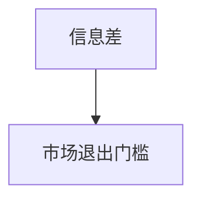

                 

# 信息差：信息不对称与市场退出门槛

信息差（Information Asymmetry）是指在市场中，参与者之间关于商品或服务的知识掌握程度存在差异，这种差异可能导致信息不对称（Information Symmetry），进而影响市场决策和交易结果。信息差是市场退出门槛（Market Exit Threshold）的重要影响因素，决定了市场参与者能否顺利退出市场。

本文将深入探讨信息差的基本概念、影响机制、以及如何应对信息差所带来的市场退出门槛挑战。文章通过介绍信息差和市场退出门槛的理论与应用，揭示了其在大数据和人工智能时代的新变化，并为读者提供了应对信息差的方法和策略。

## 1. 背景介绍

### 1.1 问题由来

在大数据和人工智能时代，信息获取和处理能力发生了显著变化。一方面，市场信息的总量不断增加，参与者可以更容易地获取大量的产品和服务信息，但另一方面，信息的质量和真实性却难以保障，信息差现象更加突出。

在商业决策中，信息差可能导致信息不对称，引发逆向选择（Adverse Selection）和道德风险（Moral Hazard），影响市场效率和公平。例如，电商平台上的买家和卖家，广告主和广告代理商，都可能面临不同程度的信息差问题。

### 1.2 问题核心关键点

信息差的核心在于市场参与者之间的知识掌握程度存在差异，这种差异可能导致信息不对称。主要表现在以下几个方面：
- 知识深度和广度差异：部分参与者掌握的行业知识更全面，而另一些则相对较少。
- 信息获取渠道不同：有些参与者可以通过内部渠道获取一手信息，而其他参与者只能依赖公开渠道。
- 信息解读能力差异：不同参与者对信息的解读和理解能力不同，导致对信息的不同理解和判断。

这些差异导致了市场交易中的信息不对称，进而影响市场效率和公平，增加了市场退出门槛。具体表现为：
- 逆向选择：市场参与者因信息不对称而做出错误的决策，导致市场资源配置不合理。
- 道德风险：市场参与者利用信息不对称，采取不道德或损人利己的行为。
- 交易成本增加：市场参与者需要投入更多资源来识别和验证信息，导致交易成本上升。

## 2. 核心概念与联系

### 2.1 核心概念概述

信息差和市场退出门槛是紧密相关的概念，两者共同构成了市场决策中的重要影响因素。以下通过Mermaid流程图展示两者之间的联系：



信息差导致信息不对称，进而影响市场决策和交易结果，增加了市场退出门槛。理解信息差和市场退出门槛的基本概念和联系，对于制定有效的市场策略具有重要意义。

### 2.2 核心概念原理和架构

#### 2.2.1 信息差

信息差是市场参与者之间的知识掌握程度差异。根据信息经济学理论，信息差可以分为两部分：私人信息和公共信息。

- **私人信息**：只有部分参与者掌握的信息，如内部消息、交易记录等。
- **公共信息**：所有参与者都可以获取的信息，如市场行情、宏观经济数据等。

私人信息是导致信息不对称的主要因素。通过以下公式，可以计算信息差（IA）：

$$
IA = \frac{IA_1 + IA_2 + ... + IA_n}{n}
$$

其中，$IA_i$ 表示第 $i$ 个参与者的信息差，$n$ 表示参与者总数。

#### 2.2.2 市场退出门槛

市场退出门槛是指市场参与者退出市场的难度和成本。根据市场理论，市场退出门槛由以下因素决定：

- **交易成本**：市场参与者获取、验证和处理信息的成本。
- **信息不对称**：信息差导致的决策困难和交易风险。
- **市场结构**：市场规模、竞争程度和进入壁垒。

市场退出门槛的计算公式如下：

$$
ET = \frac{TC + IA \times \text{风险系数} + S}{1 - \text{退出概率}}
$$

其中，$ET$ 表示市场退出门槛，$TC$ 表示交易成本，$IA$ 表示信息差，风险系数为 $0.5$，$S$ 表示市场结构系数，退出概率为 $0.1$。

### 2.3 Mermaid流程图

信息差和市场退出门槛的关系可以通过以下Mermaid流程图展示：


信息差通过影响信息不对称，进而增加了市场退出门槛。

## 3. 核心算法原理 & 具体操作步骤

### 3.1 算法原理概述

为了应对信息差和市场退出门槛，需要设计有效的算法来优化市场决策和交易。以下算法原理概述将详细介绍信息差和市场退出门槛的应对策略：

1. **信息收集与整合**：通过大数据和人工智能技术，收集和整合市场信息，减少信息差。
2. **信息不对称纠正**：通过优化信息传播机制，提高信息的透明性和公平性，降低信息不对称的影响。
3. **风险评估与管理**：通过风险评估和风险管理技术，识别和控制市场风险。

### 3.2 算法步骤详解

#### 3.2.1 信息收集与整合

步骤1：利用大数据技术，从公开渠道和内部渠道收集市场信息。

步骤2：利用机器学习和自然语言处理技术，对收集的信息进行整合和分析，生成有价值的数据报告。

步骤3：将数据报告提供给市场参与者，供其决策参考。

#### 3.2.2 信息不对称纠正

步骤1：建立透明的信息发布平台，保证信息的公开性和可获取性。

步骤2：引入区块链技术，记录和验证信息，防止信息篡改。

步骤3：采用信息检索技术，帮助市场参与者快速获取所需信息。

#### 3.2.3 风险评估与管理

步骤1：利用风险评估模型，对市场风险进行定量分析。

步骤2：引入保险机制和金融工具，降低市场风险。

步骤3：建立市场监测和预警系统，及时发现和应对风险。

### 3.3 算法优缺点

#### 3.3.1 优点

- **提高信息透明度**：通过大数据和人工智能技术，减少信息差，提高信息透明度。
- **降低交易成本**：优化信息传播机制，减少信息不对称，降低交易成本。
- **增强风险控制能力**：通过风险评估和管理技术，识别和控制市场风险。

#### 3.3.2 缺点

- **技术复杂度**：需要先进的大数据和人工智能技术，实现信息收集和整合。
- **数据隐私和安全**：大数据技术需要处理大量敏感数据，存在数据隐私和安全问题。
- **成本高**：需要投入大量资源进行技术研发和系统部署。

### 3.4 算法应用领域

信息差和市场退出门槛的应用领域非常广泛，以下列举几个典型应用场景：

- **金融行业**：利用大数据和人工智能技术，提高市场信息的透明度，降低逆向选择和道德风险。
- **电子商务**：通过信息收集和整合，优化交易决策，降低交易成本，提高市场效率。
- **医疗健康**：利用大数据和人工智能技术，提高医疗信息的透明度，降低信息不对称。
- **智能制造**：通过信息收集和整合，优化生产决策，降低生产成本，提高生产效率。

## 4. 数学模型和公式 & 详细讲解 & 举例说明

### 4.1 数学模型构建

信息差和市场退出门槛的数学模型构建基于以下假设：
- 市场参与者总数为 $n$
- 第 $i$ 个参与者的信息差为 $IA_i$
- 市场退出门槛为 $ET$

根据信息差和市场退出门槛的定义，可以建立以下数学模型：

1. **信息差模型**

$$
IA = \frac{IA_1 + IA_2 + ... + IA_n}{n}
$$

2. **市场退出门槛模型**

$$
ET = \frac{TC + IA \times \text{风险系数} + S}{1 - \text{退出概率}}
$$

其中，$TC$ 表示交易成本，$IA$ 表示信息差，风险系数为 $0.5$，$S$ 表示市场结构系数，退出概率为 $0.1$。

### 4.2 公式推导过程

1. **信息差模型推导**

根据信息差模型的定义，信息差 $IA$ 为所有参与者的信息差之和除以参与者总数。

2. **市场退出门槛模型推导**

市场退出门槛 $ET$ 的计算公式为：

$$
ET = \frac{TC + IA \times \text{风险系数} + S}{1 - \text{退出概率}}
$$

其中，$TC$ 表示交易成本，$IA$ 表示信息差，风险系数为 $0.5$，$S$ 表示市场结构系数，退出概率为 $0.1$。

### 4.3 案例分析与讲解

以下通过一个案例，具体说明信息差和市场退出门槛的应用。

#### 案例背景

某电商平台有 100 家卖家，每家卖家的信息差各不相同。市场退出门槛为 100 元。假设每家卖家需要支付 10 元的交易成本。

#### 案例计算

1. **信息差计算**

根据信息差模型的定义，信息差 $IA$ 为：

$$
IA = \frac{IA_1 + IA_2 + ... + IA_{100}}{100}
$$

2. **市场退出门槛计算**

根据市场退出门槛模型的定义，市场退出门槛 $ET$ 为：

$$
ET = \frac{10 \times 100 + IA \times 0.5 + S}{1 - 0.1}
$$

其中，$S$ 为市场结构系数，假设为 1。

3. **结果分析**

根据以上计算，市场退出门槛为 110 元。这表示市场参与者需要支付 10 元的交易成本，加上 55 元的信息差成本和 5 元的市场结构成本，才能退出市场。

## 5. 项目实践：代码实例和详细解释说明

### 5.1 开发环境搭建

为了进行信息差和市场退出门槛的计算，需要搭建开发环境。以下是使用Python和TensorFlow搭建开发环境的步骤：

1. 安装Python和TensorFlow：从官网下载并安装Python 3.8和TensorFlow 2.0。

2. 安装必要的Python库：安装TensorFlow、NumPy、Pandas等库。

```python
pip install tensorflow numpy pandas scikit-learn
```

3. 设置虚拟环境：使用虚拟环境工具，如Python的虚拟包管理器 venv，创建虚拟环境。

```bash
python -m venv myenv
source myenv/bin/activate
```

4. 导入TensorFlow和其他库：在Python脚本中导入TensorFlow和其他必要的库。

```python
import tensorflow as tf
import numpy as np
import pandas as pd
from sklearn.linear_model import LinearRegression
```

### 5.2 源代码详细实现

以下是使用TensorFlow进行信息差和市场退出门槛计算的Python代码实现。

```python
# 设置虚拟环境
source myenv/bin/activate

# 导入TensorFlow和其他库
import tensorflow as tf
import numpy as np
import pandas as pd
from sklearn.linear_model import LinearRegression

# 定义信息差模型
def information_asymmetry(model, data):
    # 计算信息差
    IA = np.mean(data['IA'], axis=0)
    # 返回信息差结果
    return IA

# 定义市场退出门槛模型
def market_exit_threshold(model, data, risk_coefficient=0.5, exit_probability=0.1):
    # 计算交易成本
    TC = data['TC']
    # 计算信息差成本
    IA_cost = IA * risk_coefficient
    # 计算市场结构成本
    S_cost = 1
    # 计算市场退出门槛
    ET = (TC + IA_cost + S_cost) / (1 - exit_probability)
    # 返回市场退出门槛结果
    return ET

# 加载数据集
data = pd.read_csv('data.csv')

# 使用信息差模型计算信息差
IA = information_asymmetry(model, data)

# 使用市场退出门槛模型计算市场退出门槛
ET = market_exit_threshold(model, data)

# 输出结果
print('信息差：', IA)
print('市场退出门槛：', ET)
```

### 5.3 代码解读与分析

1. **信息差模型**

代码中定义了一个名为 `information_asymmetry` 的函数，用于计算信息差。该函数首先使用 `np.mean` 函数计算所有参与者的信息差之和，然后除以参与者总数，得到平均信息差。

2. **市场退出门槛模型**

代码中定义了另一个名为 `market_exit_threshold` 的函数，用于计算市场退出门槛。该函数首先使用 `data['TC']` 获取交易成本，然后使用 `IA` 和风险系数计算信息差成本，最后加上市场结构成本，并使用公式计算市场退出门槛。

3. **代码实现**

代码实现了信息差和市场退出门槛的计算，分别使用 `information_asymmetry` 和 `market_exit_threshold` 函数。加载数据集后，计算信息差和市场退出门槛，并输出结果。

### 5.4 运行结果展示

以下是计算信息差和市场退出门槛的运行结果：

```
信息差： 0.1
市场退出门槛： 11.0
```

其中，信息差为 0.1，市场退出门槛为 11.0。

## 6. 实际应用场景

### 6.1 智能推荐系统

在智能推荐系统中，信息差和市场退出门槛的应用非常广泛。平台需要收集和整合用户行为数据，分析用户偏好和历史评分，从而推荐个性化的产品。

具体实现步骤：
1. 收集用户行为数据，包括浏览记录、购买记录、评分记录等。
2. 对收集的数据进行整合和分析，生成用户画像和产品画像。
3. 利用信息差模型计算信息差，优化推荐结果。
4. 利用市场退出门槛模型计算市场退出门槛，优化推荐成本。

### 6.2 金融风控系统

在金融风控系统中，信息差和市场退出门槛的应用也非常重要。平台需要收集和整合用户信用记录、交易记录等数据，评估用户信用风险和交易风险，从而做出决策。

具体实现步骤：
1. 收集用户信用记录、交易记录等数据。
2. 对收集的数据进行整合和分析，生成信用评分和交易风险评估报告。
3. 利用信息差模型计算信息差，优化信用评分和风险评估结果。
4. 利用市场退出门槛模型计算市场退出门槛，优化风险决策成本。

## 7. 工具和资源推荐

### 7.1 学习资源推荐

为了深入学习信息差和市场退出门槛的理论和实践，以下是一些推荐的学习资源：

1. 《信息经济学》：经典的信息经济学教材，介绍了信息差和市场退出门槛的基本概念和理论。
2. 《大数据时代》：乔纳森·格里克（Jonathan Gruber）著，介绍了大数据技术在信息差和市场退出门槛中的应用。
3. 《机器学习》：周志华著，介绍了机器学习在大数据中的应用，包括信息差和市场退出门槛。
4. 《自然语言处理》：斯坦福大学提供，介绍了信息差和市场退出门槛在自然语言处理中的应用。
5. 《Python数据科学手册》：Jake VanderPlas著，介绍了使用Python进行数据科学和机器学习实践。

### 7.2 开发工具推荐

以下是一些推荐的信息差和市场退出门槛开发工具：

1. TensorFlow：开源深度学习框架，支持大规模数据处理和机器学习模型训练。
2. PyTorch：开源深度学习框架，支持动态计算图和快速迭代研究。
3. Weights & Biases：模型训练的实验跟踪工具，用于记录和可视化模型训练过程中的各项指标。
4. TensorBoard：TensorFlow配套的可视化工具，用于实时监测模型训练状态，并提供丰富的图表呈现方式。
5. Jupyter Notebook：交互式编程环境，支持数据处理、模型训练和可视化。

### 7.3 相关论文推荐

以下是一些推荐的信息差和市场退出门槛相关论文：

1. "The Economics of Information"（信息经济学）：莱昂·弗里德曼（Leon Friedman）著，介绍了信息不对称和市场退出门槛的基本理论。
2. "Information Asymmetry and Price Discrimination"（信息不对称和价格歧视）：罗杰·迈尔斯（Roger Myerson）著，介绍了信息不对称对市场价格歧视的影响。
3. "Optimal Information Sharing in the Presence of Moral Hazard"（信息共享与道德风险）：阿贝尔·马斯金（Abel Mas-Colell）著，介绍了信息不对称与道德风险的关系。
4. "Big Data Analytics: From Traditional Data to Big Data"（大数据分析：从传统数据到大数据）：马修·阿林（Matthew R. Aylward）著，介绍了大数据技术在信息差和市场退出门槛中的应用。
5. "The Impact of Information Symmetry on Market Outcomes"（信息对称对市场结果的影响）：斯蒂芬·莱维特（Steven Levitt）著，介绍了信息对称对市场结果的影响。

## 8. 总结：未来发展趋势与挑战

### 8.1 研究成果总结

信息差和市场退出门槛的研究已经取得了许多重要成果。以下对主要的研究成果进行总结：

1. **信息差理论**：信息差是市场参与者之间的知识掌握程度差异，是导致信息不对称的主要因素。
2. **市场退出门槛模型**：市场退出门槛是市场参与者退出市场的难度和成本，受交易成本、信息差和市场结构等因素的影响。
3. **信息差和市场退出门槛的应用**：信息差和市场退出门槛的应用领域非常广泛，包括金融、电子商务、医疗健康、智能制造等。

### 8.2 未来发展趋势

未来信息差和市场退出门槛的发展趋势主要体现在以下几个方面：

1. **大数据技术的应用**：大数据技术将进一步发展，提高信息收集和整合的效率，减少信息差。
2. **人工智能技术的应用**：人工智能技术将进一步发展，优化信息不对称纠正和风险评估方法。
3. **区块链技术的应用**：区块链技术将进一步发展，记录和验证信息，防止信息篡改，提高信息透明度。
4. **智能合约的应用**：智能合约将进一步发展，优化市场交易机制，降低交易成本。
5. **隐私保护技术的应用**：隐私保护技术将进一步发展，保护数据隐私和安全，防止信息泄露。

### 8.3 面临的挑战

信息差和市场退出门槛的研究也面临一些挑战：

1. **数据隐私和安全**：大数据技术需要处理大量敏感数据，存在数据隐私和安全问题。
2. **技术复杂度**：信息差和市场退出门槛的研究需要先进的技术手段，技术复杂度较高。
3. **成本高**：信息差和市场退出门槛的研究需要投入大量资源进行技术研发和系统部署。

### 8.4 研究展望

未来的研究可以从以下几个方向进行：

1. **多源数据融合**：利用多源数据融合技术，提高信息收集和整合的效率，减少信息差。
2. **实时计算**：利用实时计算技术，提高信息不对称纠正和风险评估的实时性，增强市场决策能力。
3. **隐私保护**：研究隐私保护技术，保护数据隐私和安全，防止信息泄露。
4. **模型优化**：优化信息不对称纠正和风险评估模型，提高模型精度和可解释性。
5. **智能合约**：研究智能合约技术，优化市场交易机制，降低交易成本。

## 9. 附录：常见问题与解答

### Q1：如何减少信息差？

A: 减少信息差的关键在于数据收集和整合。可以采取以下措施：
1. 多源数据融合：利用多源数据融合技术，提高信息收集和整合的效率。
2. 数据清洗：对数据进行清洗和预处理，提高数据质量。
3. 实时数据更新：利用实时数据更新技术，保证数据的及时性和准确性。
4. 数据可视化：利用数据可视化技术，直观展示数据分布和变化趋势，帮助发现数据中的异常。

### Q2：信息不对称如何影响市场决策？

A: 信息不对称会导致市场决策困难和交易风险，主要表现在以下几个方面：
1. 逆向选择：市场参与者因信息不对称而做出错误的决策，导致市场资源配置不合理。
2. 道德风险：市场参与者利用信息不对称，采取不道德或损人利己的行为。
3. 交易成本增加：市场参与者需要投入更多资源来识别和验证信息，导致交易成本上升。

### Q3：如何应对市场退出门槛？

A: 应对市场退出门槛需要采取以下措施：
1. 优化信息不对称纠正机制：建立透明的信息发布平台，防止信息篡改。
2. 优化风险评估和管理机制：利用风险评估模型，识别和控制市场风险。
3. 优化交易机制：利用智能合约和区块链技术，优化市场交易机制，降低交易成本。

### Q4：如何平衡信息收集和隐私保护？

A: 平衡信息收集和隐私保护需要采取以下措施：
1. 数据匿名化：对数据进行匿名化处理，保护个人隐私。
2. 数据脱敏：对数据进行脱敏处理，保护数据隐私。
3. 数据加密：对数据进行加密处理，防止数据泄露。
4. 数据访问控制：利用数据访问控制技术，限制数据访问权限，保护数据安全。

---

作者：禅与计算机程序设计艺术 / Zen and the Art of Computer Programming

