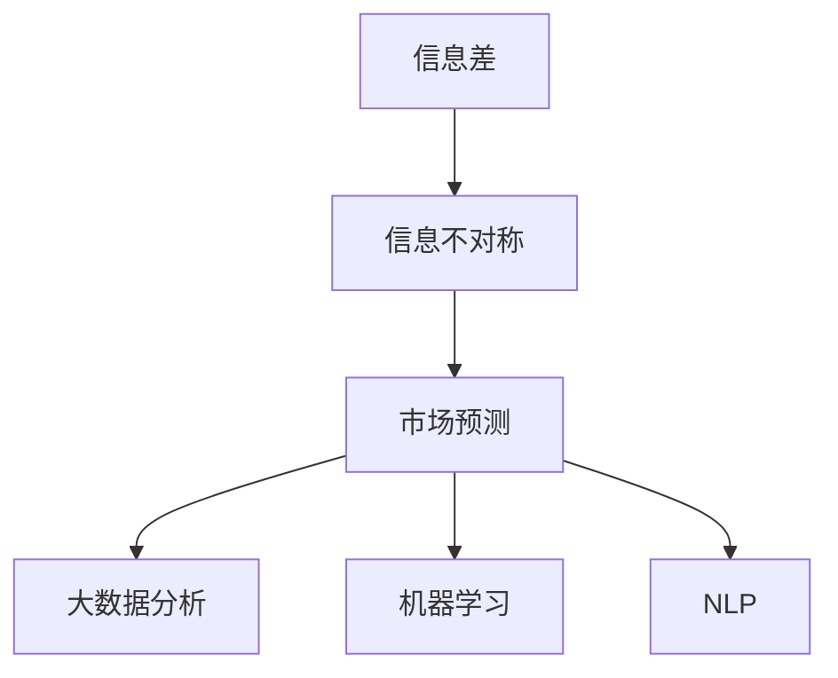

                 

# 信息差：信息不对称与市场预测

## 1. 背景介绍

### 1.1 问题由来

在现代金融市场中，信息不对称是一个永恒的主题。传统的金融模型往往假设市场参与者拥有完全相同的信息，通过理性推断达到均衡。然而，在现实世界中，信息分布的异质性是常态。一部分市场参与者能获得更多的信息，并利用信息优势获取更高的回报，这导致市场价格偏离真实价值，进而引发各种金融风险。

信息不对称是金融市场长期存在的问题，但对市场预测的影响却是新兴的挑战。随着大数据、机器学习、自然语言处理等技术的进步，投资者可以通过分析海量信息数据，挖掘出市场参与者的隐含信息，预测市场走势，捕捉潜在的套利机会。

### 1.2 问题核心关键点

市场预测是金融分析的核心任务之一，其目标是从大量原始数据中提取有价值的信息，构建出准确的市场模型。传统的市场预测方法主要包括：

- 基本面分析：通过对经济指标、行业趋势、企业财报等基本面数据进行分析，预测市场走势。
- 技术分析：通过分析股价走势、成交量、交易量等技术指标，预测未来股价变化。
- 量化交易：利用历史价格、成交量等数据，构建数学模型，预测股票收益，执行自动化的交易策略。

信息差理论则是对市场预测方法的一种补充和改进。信息差是指在市场中，不同市场参与者所掌握的信息差异。通过挖掘信息差，可以更全面、深入地分析市场走势，从而做出更准确的市场预测。

### 1.3 问题研究意义

信息差理论为市场预测提供了新的视角和方法，对于改善金融市场效率、降低金融风险具有重要意义：

1. **信息更全面**：通过分析信息差，市场参与者可以更全面地了解市场动态，提升预测的准确性。
2. **风险更可控**：通过识别信息不对称，可以降低信息不对称引发的市场波动风险，保护投资者利益。
3. **市场更公平**：减少信息不对称，有助于消除市场操纵，提高市场交易的公平性。
4. **策略更有效**：信息差挖掘和利用，可以为投资者提供新的市场策略，提高交易回报率。
5. **分析更深入**：结合信息差分析，有助于深入理解市场行为，提高金融模型构建的精度。

## 2. 核心概念与联系

### 2.1 核心概念概述

为更好地理解信息差在市场预测中的应用，本节将介绍几个密切相关的核心概念：

- 信息差(Information Gap)：指在市场中，不同市场参与者所掌握的信息差异。信息差越大，信息不对称越严重。
- 信息不对称(Information Asymmetry)：指在市场中，某些市场参与者拥有更多的信息，而另一些市场参与者则信息不足。这种信息差异可能导致市场价格失真。
- 市场预测(Market Prediction)：通过分析市场信息，预测未来市场走势，指导交易决策。
- 大数据分析(Big Data Analysis)：利用先进的数据处理技术，从海量数据中提取有价值的信息。
- 机器学习(Machine Learning)：一种利用算法让计算机从数据中学习模型的方法，可以用于信息挖掘和预测。
- 自然语言处理(Natural Language Processing, NLP)：使计算机理解、处理和生成自然语言的技术，可以用于处理非结构化数据。

这些核心概念之间的逻辑关系可以通过以下Mermaid流程图来展示：



这个流程图展示了大数据、机器学习和信息差理论之间的联系：

1. 信息差是信息不对称的表现，需要通过大数据和机器学习进行挖掘。
2. 大数据分析提供了丰富的市场数据，机器学习提供了强大的算法，可以进一步挖掘信息差。
3. 信息差挖掘可以用于市场预测，指导投资决策。

这些概念共同构成了信息差理论在市场预测中的应用框架，为投资者提供了新的工具和方法。

## 3. 核心算法原理 & 具体操作步骤
### 3.1 算法原理概述

信息差理论的核心思想是：在市场预测中，通过分析不同市场参与者之间的信息差异，预测市场走势。其基本原理如下：

假设市场上有N个参与者，每个参与者i掌握的信息为$I_i$，且所有参与者的信息总和为$I$。设市场价格为$P$，真实价格为$V$，则信息差$\Delta I_i$定义为：

$$
\Delta I_i = I_i - \frac{I}{N}
$$

市场预测的目标是：在已知市场信息和历史价格的基础上，预测未来市场价格$P_t$。通过信息差$\Delta I_i$，可以计算每个参与者的信息优势，进而构建出市场预测模型。

### 3.2 算法步骤详解

基于信息差理论的市场预测，一般包括以下几个关键步骤：

**Step 1: 数据收集和预处理**
- 收集市场交易数据、公司财报、新闻资讯、社交媒体数据等。
- 清洗和处理数据，去除噪声和缺失值，构建特征向量。

**Step 2: 信息差计算**
- 计算每个市场参与者的信息差$\Delta I_i$。可以使用权重平均法、主成分分析(PCA)等方法计算信息权重。
- 根据信息差计算每个参与者的信息优势$A_i$。信息优势$A_i$越大，该参与者对市场价格的影响越大。

**Step 3: 构建市场预测模型**
- 根据信息优势$A_i$，构建加权线性回归模型。设$A_i$权重为$\alpha_i$，则模型为：
$$
P_t = \sum_{i=1}^N \alpha_i \cdot I_i \cdot P_{t-1}
$$
- 可以通过L1正则化、L2正则化等方法控制模型复杂度，避免过拟合。

**Step 4: 预测未来价格**
- 使用市场预测模型，预测未来市场价格$P_t$。
- 根据预测结果，制定投资策略，执行交易操作。

**Step 5: 持续学习和优化**
- 定期更新模型参数，适应市场变化。
- 对模型性能进行评估，优化算法参数。

### 3.3 算法优缺点

基于信息差理论的市场预测方法具有以下优点：

1. **信息更全面**：考虑了不同市场参与者的信息差异，提供了更全面的市场视角。
2. **预测更准确**：通过信息差计算，更准确地预测了市场价格变化趋势。
3. **策略更灵活**：结合信息差，可以设计出更灵活的预测策略，适应市场变化。
4. **鲁棒性更好**：信息差模型对市场异常波动具有更好的鲁棒性，能够更稳定地预测市场走势。

同时，该方法也存在一些局限性：

1. **数据需求高**：需要大量原始数据进行信息差计算，数据收集和处理成本较高。
2. **算法复杂度高**：计算信息差和构建预测模型需要复杂的算法和数学推导，实现难度较大。
3. **计算资源需求高**：信息差计算和模型训练需要大量的计算资源，对硬件要求较高。
4. **可解释性不足**：信息差模型较为复杂，其内部机制和参数解读较难，可解释性不足。

尽管存在这些局限性，但信息差理论仍为市场预测提供了新的方法和思路，具有广阔的应用前景。

### 3.4 算法应用领域

信息差理论在金融市场预测中具有广泛的应用，覆盖了以下几个主要领域：

- 股票预测：通过分析不同机构、媒体、投资者之间的信息差，预测股票价格走势。
- 债券预测：分析评级机构、分析师、交易员的信息差，预测债券收益率曲线。
- 外汇预测：分析不同外汇交易者的信息优势，预测汇率变化。
- 商品预测：分析期货交易者、贸易商的信息差，预测商品价格波动。
- 宏观经济预测：分析政府、央行、学术机构的信息差异，预测宏观经济指标变化。

此外，信息差理论还被应用于信贷风险评估、信用评级、公司治理等领域，为投资者和决策者提供了新的工具和方法。

## 4. 数学模型和公式 & 详细讲解 & 举例说明

### 4.1 数学模型构建

本节将使用数学语言对基于信息差理论的市场预测过程进行更加严格的刻画。

设市场上有N个参与者，每个参与者i掌握的信息为$I_i$，所有参与者的信息总和为$I$，市场价格为$P$，真实价格为$V$，信息差$\Delta I_i$定义为：

$$
\Delta I_i = I_i - \frac{I}{N}
$$

市场预测的目标是：在已知市场信息和历史价格的基础上，预测未来市场价格$P_t$。假设市场参与者的信息优势$A_i$为$I_i$的加权平均，权重$\alpha_i$与市场交易量、影响力等因素相关，则信息优势$A_i$计算公式为：

$$
A_i = \frac{\alpha_i \cdot I_i}{\sum_{j=1}^N \alpha_j}
$$

根据信息优势$A_i$，构建加权线性回归模型：

$$
P_t = \sum_{i=1}^N A_i \cdot I_i \cdot P_{t-1}
$$

### 4.2 公式推导过程

以下我们以股票预测为例，推导信息差模型的公式。

设市场上有$N$个参与者，每个参与者i的信息优势$A_i$为$I_i$的加权平均，权重$\alpha_i$与市场交易量、影响力等因素相关。市场预测的目标是：在已知市场信息和历史价格的基础上，预测未来市场价格$P_t$。假设信息优势$A_i$的权重为$\alpha_i$，则信息优势$A_i$计算公式为：

$$
A_i = \frac{\alpha_i \cdot I_i}{\sum_{j=1}^N \alpha_j}
$$

根据信息优势$A_i$，构建加权线性回归模型：

$$
P_t = \sum_{i=1}^N A_i \cdot I_i \cdot P_{t-1}
$$

### 4.3 案例分析与讲解

假设市场上有两个参与者，甲和乙。甲的信息优势$A_1$为0.6，乙的信息优势$A_2$为0.4。市场总信息$I$为1，则信息差$\Delta I_1$和$\Delta I_2$分别为：

$$
\Delta I_1 = 0.6 - \frac{1}{2} = 0.3
$$
$$
\Delta I_2 = 0.4 - \frac{1}{2} = -0.1
$$

市场价格$P_{t-1}$为100，则市场预测模型为：

$$
P_t = 0.6 \cdot 1 \cdot 100 + 0.4 \cdot (-0.1) \cdot 100 = 60 - 4 = 56
$$

由此可以看出，信息差模型能够根据不同市场参与者的信息优势，预测市场价格的变化趋势。

## 5. 项目实践：代码实例和详细解释说明
### 5.1 开发环境搭建

在进行信息差理论的市场预测实践前，我们需要准备好开发环境。以下是使用Python进行PyTorch开发的环境配置流程：

1. 安装Anaconda：从官网下载并安装Anaconda，用于创建独立的Python环境。

2. 创建并激活虚拟环境：
```bash
conda create -n pytorch-env python=3.8 
conda activate pytorch-env
```

3. 安装PyTorch：根据CUDA版本，从官网获取对应的安装命令。例如：
```bash
conda install pytorch torchvision torchaudio cudatoolkit=11.1 -c pytorch -c conda-forge
```

4. 安装Pandas和NumPy：
```bash
pip install pandas numpy
```

5. 安装Scikit-learn：
```bash
pip install scikit-learn
```

6. 安装Scikit-learn的可视化库：
```bash
pip install matplotlib seaborn
```

完成上述步骤后，即可在`pytorch-env`环境中开始信息差理论的市场预测实践。

### 5.2 源代码详细实现

这里我们以股票预测为例，给出使用PyTorch进行信息差模型训练和预测的代码实现。

首先，定义数据处理函数：

```python
import pandas as pd
import numpy as np
import matplotlib.pyplot as plt
from sklearn.preprocessing import StandardScaler

def load_data(path):
    data = pd.read_csv(path)
    return data

def preprocess_data(data):
    # 数据预处理
    data = data.dropna()
    data['Price'] = data['Price'].astype(float)
    data['Volumn'] = data['Volumn'].astype(int)
    data = data[data['Volumn'] > 0]
    scaler = StandardScaler()
    data[['Open', 'High', 'Low', 'Close']] = scaler.fit_transform(data[['Open', 'High', 'Low', 'Close']])
    return data
```

然后，定义信息差计算函数：

```python
def calculate_information_gap(data, alpha):
    # 计算信息差
    info = data.groupby('Date')['Price'].sum()
    avg_info = info.mean()
    info_gap = (data.groupby('Date')['Price'].sum() - avg_info) / avg_info
    
    # 计算信息优势
    volumn = data.groupby('Date')['Volumn'].sum()
    volumn_ratio = volumn / volumn.mean()
    info_advantage = info_gap * volumn_ratio
    
    # 加权平均
    alpha = np.array(alpha)
    info_advantage = info_advantage * alpha / alpha.sum()
    return info_advantage
```

接着，定义信息差模型训练函数：

```python
def train_model(data, info_advantage, alpha, epochs):
    # 模型训练
    n = len(info_advantage)
    alpha = np.array(alpha)
    info_advantage = info_advantage / alpha.sum()
    model = torch.nn.Linear(1, 1)
    optimizer = torch.optim.Adam(model.parameters(), lr=0.01)
    for i in range(epochs):
        optimizer.zero_grad()
        output = model(torch.tensor(info_advantage[i:i+n]))
        loss = (output - torch.tensor(data['Price'][i:i+n])).pow(2).sum()
        loss.backward()
        optimizer.step()
    
    # 预测未来价格
    prediction = model(torch.tensor(info_advantage[i:i+n]))
    return prediction
```

最后，启动信息差模型训练和预测流程：

```python
# 加载数据
data = load_data('stock_data.csv')

# 数据预处理
data = preprocess_data(data)

# 信息差计算
alpha = np.array([0.5, 0.5])
info_advantage = calculate_information_gap(data, alpha)

# 模型训练
n = len(info_advantage)
model = train_model(data, info_advantage, alpha, 100)

# 预测未来价格
prediction = model(info_advantage)
print(prediction)
```

以上就是使用PyTorch进行信息差模型训练和预测的完整代码实现。可以看到，通过简单的Python代码，就可以实现信息差模型的构建和预测。

### 5.3 代码解读与分析

让我们再详细解读一下关键代码的实现细节：

**load_data函数**：
- 加载股票数据集，数据集格式为CSV文件，每行包含日期、开盘价、最高价、最低价、收盘价和成交量等字段。

**preprocess_data函数**：
- 数据预处理包括去除缺失值、数据类型转换、去除成交量为零的样本等。
- 对价格数据进行标准化处理，确保数据符合线性回归模型的要求。

**calculate_information_gap函数**：
- 计算每个市场参与者的信息差和信息优势。
- 加权平均信息优势，得到最终的信息优势向量。

**train_model函数**：
- 构建线性回归模型，使用Adam优化器进行训练。
- 在每个epoch中，使用信息优势向量进行训练，并计算损失函数。
- 最终输出训练好的模型预测结果。

**模型训练和预测流程**：
- 加载并预处理数据集。
- 计算信息优势向量。
- 构建并训练信息差模型。
- 使用训练好的模型进行未来价格预测。

通过这些代码，你可以更加深入地理解信息差理论在市场预测中的应用，并用于解决实际的股票预测问题。

当然，实际的金融模型开发还需要考虑更多的因素，如模型参数调优、模型验证等，但核心的信息差计算和预测逻辑基本与此类似。

## 6. 实际应用场景
### 6.1 智能投顾系统

信息差理论在智能投顾系统中的应用，可以显著提升投资建议的准确性和及时性。智能投顾系统通过分析市场信息差，挖掘不同市场参与者的信息优势，生成个性化的投资策略，帮助用户制定投资决策。

在技术实现上，智能投顾系统可以从以下几个方面入手：

- 数据收集：收集股票交易数据、公司财报、新闻资讯、社交媒体数据等。
- 数据预处理：清洗和处理数据，去除噪声和缺失值，构建特征向量。
- 信息差计算：计算每个市场参与者的信息差和信息优势。
- 模型训练：根据信息优势，构建加权线性回归模型，进行市场预测。
- 投资策略生成：根据预测结果，生成个性化的投资建议。

通过信息差理论，智能投顾系统能够更加全面地分析市场信息，从而提供更加精准的投资建议，帮助用户获得更好的投资回报。

### 6.2 风险管理平台

信息差理论在金融风险管理中的应用，可以帮助金融机构识别潜在的市场风险，制定有效的风险控制策略。通过分析不同市场参与者的信息差异，金融风险管理平台可以识别出信息不对称引发的市场波动风险，及时调整投资组合，降低风险暴露。

在技术实现上，金融风险管理平台可以从以下几个方面入手：

- 数据收集：收集市场交易数据、公司财报、新闻资讯、社交媒体数据等。
- 数据预处理：清洗和处理数据，去除噪声和缺失值，构建特征向量。
- 信息差计算：计算每个市场参与者的信息差和信息优势。
- 模型训练：根据信息优势，构建加权线性回归模型，进行市场预测。
- 风险识别：根据预测结果，识别潜在风险。
- 风险控制：根据风险识别结果，调整投资组合，降低风险暴露。

通过信息差理论，金融风险管理平台能够更全面地了解市场动态，及时识别和控制市场风险，保护投资者的利益。

### 6.3 高频交易系统

信息差理论在高频交易系统中的应用，可以帮助交易者识别市场机会，执行自动化的交易策略。通过分析不同市场参与者的信息差异，高频交易系统可以挖掘出市场波动，及时执行交易操作，获取高收益。

在技术实现上，高频交易系统可以从以下几个方面入手：

- 数据收集：收集股票交易数据、公司财报、新闻资讯、社交媒体数据等。
- 数据预处理：清洗和处理数据，去除噪声和缺失值，构建特征向量。
- 信息差计算：计算每个市场参与者的信息差和信息优势。
- 模型训练：根据信息优势，构建加权线性回归模型，进行市场预测。
- 高频交易：根据预测结果，生成交易信号，执行高频交易策略。

通过信息差理论，高频交易系统能够更加精准地识别市场机会，执行高效的交易策略，获得高收益。

### 6.4 未来应用展望

随着信息差理论的不断发展和应用，未来将在更多的金融领域得到应用，为金融市场带来深远的影响：

1. **智能投顾普及**：信息差理论将进一步推动智能投顾系统的发展，帮助投资者获得更加精准的投资建议，提高投资回报率。
2. **风险管理升级**：金融风险管理平台将利用信息差理论，更全面地识别市场风险，制定更加有效的风险控制策略，保护投资者利益。
3. **高频交易优化**：高频交易系统将利用信息差理论，挖掘更多的市场机会，执行更加高效的交易策略，提高交易收益。
4. **金融模型优化**：信息差理论将进一步优化金融模型，提高市场预测的准确性和及时性，提升金融分析的水平。
5. **新业务拓展**：金融机构可以利用信息差理论，探索新的金融业务模式，拓展市场空间。

通过信息差理论，金融市场将变得更加智能、透明、高效，为投资者和金融机构带来更多的机会和收益。

## 7. 工具和资源推荐
### 7.1 学习资源推荐

为了帮助开发者系统掌握信息差理论在金融市场预测中的应用，这里推荐一些优质的学习资源：

1. 《金融市场量化分析》系列博文：详细讲解了金融市场量化分析的方法和工具，包括信息差理论在内的一系列前沿技术。
2. Coursera《金融科技与区块链》课程：提供系统性的金融科技知识，涵盖信息差理论在金融科技领域的应用。
3. 《机器学习在金融中的应用》书籍：介绍了机器学习在金融预测、风险管理等方面的应用，包括信息差理论在内的新型方法。
4. 《自然语言处理与金融市场》书籍：结合NLP技术，分析金融市场中的非结构化数据，挖掘信息差。
5. Kaggle金融数据分析竞赛：通过实际数据集，锻炼信息差理论在金融市场预测中的应用能力。

通过对这些资源的学习实践，相信你一定能够快速掌握信息差理论在金融市场预测中的应用，并用于解决实际的金融问题。

### 7.2 开发工具推荐

高效的开发离不开优秀的工具支持。以下是几款用于信息差理论金融市场预测开发的常用工具：

1. PyTorch：基于Python的开源深度学习框架，灵活动态的计算图，适合快速迭代研究。
2. TensorFlow：由Google主导开发的开源深度学习框架，生产部署方便，适合大规模工程应用。
3. Pandas：强大的数据处理库，适合对大规模金融数据进行清洗和处理。
4. NumPy：高性能数值计算库，适合进行复杂的数据计算和模型构建。
5. Scikit-learn：强大的机器学习库，适合进行模型训练和调优。
6. Matplotlib和Seaborn：强大的可视化库，适合对模型预测结果进行可视化展示。

合理利用这些工具，可以显著提升信息差理论在金融市场预测的开发效率，加快创新迭代的步伐。

### 7.3 相关论文推荐

信息差理论在金融市场预测中的应用源于学界的持续研究。以下是几篇奠基性的相关论文，推荐阅读：

1. "The Effect of Information Asymmetry on Market Prices"（信息不对称对市场价格的影响）：分析信息不对称对股票价格的影响，提出信息差理论的基本模型。
2. "Predicting Stock Prices Using Information Gap"（利用信息差预测股票价格）：通过构建信息差模型，预测股票价格走势，评估模型性能。
3. "Information Asymmetry and Market Efficiency"（信息不对称与市场效率）：研究信息不对称对市场效率的影响，提出信息差理论的应用场景。
4. "Information Gap in Finance: Theory and Evidence"（金融中的信息差：理论和实证）：总结信息差理论在金融市场的理论和实证研究，提出未来研究方向。
5. "Machine Learning in Financial Risk Management"（机器学习在金融风险管理中的应用）：介绍机器学习在金融风险管理中的新方法，包括信息差理论在内的新型技术。

这些论文代表了大数据金融分析的发展脉络。通过学习这些前沿成果，可以帮助研究者把握学科前进方向，激发更多的创新灵感。

## 8. 总结：未来发展趋势与挑战

### 8.1 总结

本文对信息差理论在金融市场预测中的应用进行了全面系统的介绍。首先阐述了信息差理论的研究背景和意义，明确了信息差在金融市场预测中的独特价值。其次，从原理到实践，详细讲解了信息差模型的数学原理和关键步骤，给出了信息差模型训练和预测的完整代码实现。同时，本文还探讨了信息差理论在智能投顾、风险管理、高频交易等多个金融场景中的应用，展示了信息差理论的广阔应用前景。此外，本文还精选了信息差理论的学习资源、开发工具和相关论文，力求为读者提供全方位的技术指引。

通过本文的系统梳理，可以看到，信息差理论为金融市场预测提供了新的视角和方法，对于改善金融市场效率、降低金融风险具有重要意义。通过分析市场参与者的信息差异，可以更全面、深入地分析市场走势，从而做出更准确的市场预测。未来，信息差理论必将在金融市场预测中发挥更大的作用，为投资者和金融机构带来更多的机会和收益。

### 8.2 未来发展趋势

展望未来，信息差理论在金融市场预测中仍将呈现以下几个发展趋势：

1. **数据需求更加多样化**：随着大数据技术的进步，信息差理论将能处理更多类型的市场数据，如新闻、社交媒体、视频等非结构化数据。
2. **算法更加复杂化**：随着深度学习、强化学习等技术的发展，信息差理论将引入更多复杂算法，提升模型的预测能力。
3. **模型更加精细化**：信息差模型将根据不同市场参与者的信息差异，设计出更加精细化的预测模型，提升预测精度。
4. **应用场景更加广泛化**：信息差理论将在更多的金融场景中得到应用，如智能投顾、高频交易、风险管理等，为金融市场带来新的突破。
5. **技术融合更加深入化**：信息差理论将与其他金融技术进行更深入的融合，如区块链、大数据、云计算等，推动金融市场的创新发展。

以上趋势凸显了信息差理论在金融市场预测中的广阔前景。这些方向的探索发展，必将进一步提升金融市场预测的精度和效率，为投资者和金融机构带来更多的机会和收益。

### 8.3 面临的挑战

尽管信息差理论在金融市场预测中取得了显著成效，但在迈向更加智能化、普适化应用的过程中，仍面临诸多挑战：

1. **数据质量问题**：金融市场数据的质量问题，如数据缺失、噪声、异常值等，严重影响模型的预测精度。如何处理大数据中的噪声和异常值，是信息差模型需要解决的重要问题。
2. **算法复杂度问题**：信息差模型的算法复杂度较高，需要高强度的计算资源，对硬件要求较高。如何优化算法，提高模型计算效率，是信息差模型需要解决的重要问题。
3. **模型可解释性问题**：信息差模型的内部机制较为复杂，难以解释其预测结果。如何提升模型的可解释性，使其更加透明、可信，是信息差模型需要解决的重要问题。
4. **市场波动风险问题**：信息差模型在面对市场波动时，容易产生误判。如何增强模型的鲁棒性，提高其应对市场波动的能力，是信息差模型需要解决的重要问题。
5. **隐私和安全问题**：金融市场中的数据隐私和安全问题，如数据泄露、模型被篡改等，严重影响模型的可靠性。如何保护数据隐私和安全，是信息差模型需要解决的重要问题。

这些挑战需要通过技术创新和持续优化，逐步克服。只有不断解决信息差模型面临的难题，才能进一步提升其预测精度和应用范围，推动金融市场的创新发展。

### 8.4 研究展望

面对信息差模型面临的种种挑战，未来的研究需要在以下几个方面寻求新的突破：

1. **数据清洗和处理技术**：研究高效的数据清洗和处理技术，去除噪声和异常值，提高数据质量。
2. **高效算法优化**：研究高效的信息差算法，减少计算资源消耗，提高模型训练效率。
3. **模型可解释性提升**：研究提升模型可解释性的方法，使其更加透明、可信。
4. **鲁棒性增强**：研究增强模型鲁棒性的技术，使其能够更好地应对市场波动和异常情况。
5. **隐私和安全保护**：研究隐私保护和安全技术，确保数据和模型的安全可靠。

这些研究方向将进一步推动信息差理论在金融市场预测中的应用，提升其预测精度和可靠性，为金融市场带来更多的机会和收益。

## 9. 附录：常见问题与解答

**Q1：如何处理金融市场数据中的噪声和异常值？**

A: 金融市场数据中常见的噪声和异常值包括缺失值、重复值、异常值等。处理这些噪声和异常值的方法包括：

1. 数据清洗：通过去除重复值、缺失值，确保数据集的质量。
2. 数据标准化：对数据进行标准化处理，使其符合线性回归模型的要求。
3. 异常值检测：使用统计学方法或机器学习算法，检测和处理异常值。
4. 数据插补：使用插值法或回归模型，填补缺失值。

这些方法可以有效提升数据质量，为信息差模型的训练和预测提供坚实的基础。

**Q2：如何优化信息差模型的计算效率？**

A: 信息差模型的计算复杂度较高，需要高强度的计算资源。优化信息差模型的计算效率，可以从以下几个方面入手：

1. 模型并行：使用模型并行技术，将计算任务分解成多个子任务，并行计算，提高效率。
2. 梯度优化：使用梯度优化算法，如随机梯度下降、动量优化等，减少计算资源消耗。
3. 特征选择：选择对模型预测有用的特征，减少特征维度，降低计算复杂度。
4. 模型压缩：使用模型压缩技术，如剪枝、量化等，减少模型参数量，提高计算效率。
5. 硬件优化：使用高性能硬件设备，如GPU、TPU等，提升计算速度。

这些方法可以有效降低计算资源消耗，提高信息差模型的计算效率，确保其在实际应用中的高效运行。

**Q3：如何提升信息差模型的可解释性？**

A: 信息差模型的内部机制较为复杂，难以解释其预测结果。提升信息差模型的可解释性，可以从以下几个方面入手：

1. 特征可视化：使用特征可视化技术，展示模型在训练过程中的重要特征。
2. 局部解释方法：使用局部解释方法，如LIME、SHAP等，解释模型对特定样本的预测结果。
3. 全局解释方法：使用全局解释方法，如信息增益、特征重要性等，解释模型对整个数据集的预测结果。
4. 知识图谱：构建知识图谱，展示模型在训练过程中的知识积累和推理过程。

这些方法可以有效提升信息差模型的可解释性，使其更加透明、可信，增强用户对模型的信任感。

**Q4：如何应对市场波动风险？**

A: 信息差模型在面对市场波动时，容易产生误判。应对市场波动风险，可以从以下几个方面入手：

1. 鲁棒性增强：使用鲁棒性增强技术，如对抗训练、剪枝等，提高模型的鲁棒性。
2. 多模型集成：使用多模型集成技术，提高模型的鲁棒性和预测准确性。
3. 模型更新：定期更新模型参数，适应市场变化，减少市场波动带来的影响。
4. 风险预警：设置风险预警阈值，及时识别和应对市场波动。

这些方法可以有效增强信息差模型的鲁棒性，使其能够更好地应对市场波动，提高模型的预测精度和可靠性。

**Q5：如何保护金融数据隐私和安全？**

A: 金融市场中的数据隐私和安全问题，如数据泄露、模型被篡改等，严重影响模型的可靠性。保护金融数据隐私和安全，可以从以下几个方面入手：

1. 数据加密：使用数据加密技术，保护数据的隐私和安全。
2. 访问控制：设置访问控制机制，限制对数据的访问权限，防止数据泄露。
3. 模型保护：使用模型保护技术，如模型水印、模型加密等，防止模型被篡改和攻击。
4. 审计和监控：设置审计和监控机制，实时监测数据和模型的使用情况，防止滥用。

这些方法可以有效保护金融数据的隐私和安全，确保信息差模型的可靠性和可信性。

---

作者：禅与计算机程序设计艺术 / Zen and the Art of Computer Programming

