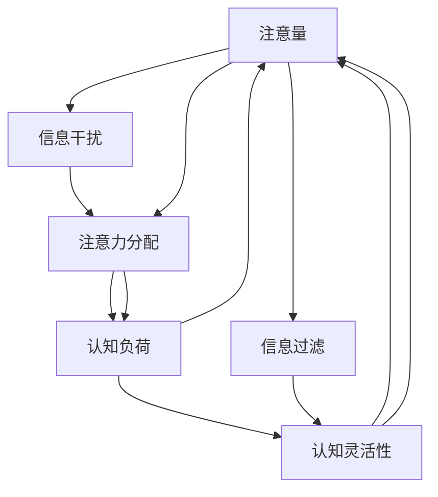

                 

# 信息时代的注意量管理挑战与策略：在干扰和信息过载中航行

## 1. 背景介绍

### 1.1 问题由来

在信息时代，我们每个人面临的注意力管理问题日益严峻。随着互联网、社交媒体、手机应用等数字媒介的普及，我们每天都被各种信息所包围，从新闻、文章、视频、图片，到社交媒体上的信息流、广告、社交互动，每天接收到的信息量令人目不暇接。信息的数量和质量都在迅速增长，如何在这片信息海洋中航行，管理好自己的注意力，成为了现代人的重要课题。

注意力管理（Attention Management）是认知心理学和行为科学领域的一个重要研究方向。传统的注意力管理理论主要关注个体在面对外部环境刺激时的注意力分配机制，而随着技术的发展，注意力管理也逐渐扩展到了数字媒介和信息系统的设计中。如何设计智能化的注意力管理系统，帮助人们有效过滤干扰、提取关键信息，是信息时代面临的巨大挑战。

### 1.2 问题核心关键点

信息时代的注意力管理问题主要集中在以下几个核心关键点上：

- **信息过载**：海量信息使得人们难以处理，容易产生注意力分散和决策疲劳。
- **干扰与分心**：社交媒体、即时通讯、广告等干扰因素不断打断人们的注意力，影响工作和学习效率。
- **任务切换成本**：频繁的任务切换会消耗大量认知资源，降低整体生产效率。
- **信息筛选困难**：在信息海洋中，如何高效筛选出对个体有益的信息，是关键问题。
- **技术依赖**：过度依赖技术可能导致注意力管理能力下降，产生认知过载。

这些问题不仅影响了个人的学习、工作和生活质量，还可能引发心理和生理健康问题。因此，设计有效的注意量管理系统，帮助人们更好地适应信息时代，是当下研究的重要方向。

## 2. 核心概念与联系

### 2.1 核心概念概述

为更好地理解信息时代的注意量管理问题，本节将介绍几个密切相关的核心概念：

- **注意量（Attention Quotient, AQ）**：衡量个体有效处理信息的能力，与信息处理速度、深度和持续性有关。
- **信息干扰（Information Distraction）**：指外界信息对个体注意力的干扰，包括噪音、通知、广告等。
- **注意力分配（Attention Allocation）**：个体在面对多个任务时，如何分配注意力资源。
- **认知负荷（Cognitive Load）**：个体在信息处理过程中所需承担的认知资源负担。
- **认知灵活性（Cognitive Flexibility）**：个体在切换不同任务时，快速适应新情境的能力。
- **信息过滤（Information Filtering）**：从海量信息中筛选出有用信息的过程，包括自动化推荐、手动筛选等。

这些核心概念之间的逻辑关系可以通过以下Mermaid流程图来展示：



这个流程图展示了几大核心概念的相互关系：

1. 注意量受到信息干扰的影响，需要通过注意力分配和认知负荷管理进行调整。
2. 注意量也受到认知灵活性的影响，认知灵活性高的个体能够更好地适应环境变化。
3. 信息过滤能够减轻认知负荷，提升注意量的有效性。
4. 注意量的提升有助于更好地处理信息干扰，增强认知灵活性。

这些概念共同构成了信息时代注意力管理的核心框架，使得我们能够更好地理解和应对信息时代所面临的注意量管理问题。

## 3. 核心算法原理 & 具体操作步骤

### 3.1 算法原理概述

信息时代的注意量管理，本质上是一个多目标优化问题。目标是在有限的时间内，最大化个体有效处理信息的能力（注意量），同时尽量减少信息干扰对注意量的负面影响。通过设计算法来优化注意量管理策略，可以显著提升个体在信息环境中的表现和幸福感。

算法原理包括以下几个主要步骤：

1. **注意力资源分配**：根据当前任务的紧急程度和重要程度，动态调整注意力的分配比例。
2. **信息干扰过滤**：通过技术手段识别和过滤信息干扰，减少对注意力的消耗。
3. **认知负荷管理**：评估当前任务的认知负荷，选择合适的注意力分配策略，避免认知过载。
4. **注意量提升**：通过信息过滤和注意力分配，提升个体的注意量，增强信息处理能力。
5. **认知灵活性训练**：通过训练和习惯养成，提高个体的认知灵活性，以更好地适应环境变化。

### 3.2 算法步骤详解

基于上述算法原理，信息时代的注意量管理可以分为以下几个关键步骤：

**Step 1: 评估注意量基线**

首先，需要评估个体的注意量基线（Baseline Attention Quotient, BQ）。注意量基线是个体在无干扰状态下处理信息的最大能力，可以通过简单的注意力测试或任务完成时间来评估。

**Step 2: 识别信息干扰源**

识别当前环境中可能的信息干扰源，包括但不限于噪音、社交媒体通知、广告、邮件等。对每种干扰源进行分类和评估，了解其对个体注意力的影响程度。

**Step 3: 设计注意力分配策略**

根据当前任务的紧急程度和重要程度，设计合理的注意力分配策略。可以使用优先级队列（Priority Queue）或任务批处理（Batch Processing）等算法来动态调整注意力的分配比例。

**Step 4: 实施信息干扰过滤**

通过技术手段实现信息干扰的过滤。例如，可以使用广告拦截器、静音模式、智能推送算法等工具，减少不必要的干扰。

**Step 5: 管理认知负荷**

评估当前任务的认知负荷，选择合适的注意力分配策略。如果任务认知负荷过高，可以采用分阶段完成任务、引入外部帮助等方式来减轻负荷。

**Step 6: 提升注意量**

通过信息过滤和注意力分配，提升个体的注意量。可以使用自动化推荐系统、手动筛选等方式，高效提取有用信息，减少不必要的信息处理。

**Step 7: 增强认知灵活性**

通过训练和习惯养成，增强个体的认知灵活性。例如，定期进行认知训练游戏、冥想等活动，提升适应新情境的能力。

### 3.3 算法优缺点

信息时代的注意量管理算法具有以下优点：

1. **提高信息处理效率**：通过优化注意力分配和信息过滤，显著提升个体在信息环境中的处理效率。
2. **减少干扰和分心**：技术手段可以有效减少信息干扰，帮助个体保持专注，提升工作和学习效率。
3. **改善认知负荷管理**：通过评估和调整认知负荷，避免认知过载，提升整体生产效率。
4. **提升认知灵活性**：通过训练和习惯养成，增强个体在切换任务时的适应能力。

同时，该算法也存在一些局限性：

1. **技术依赖**：过度依赖技术可能导致注意量管理能力的下降，产生新的认知问题。
2. **个体差异**：不同个体的注意量基线和干扰容忍度不同，需要个性化的策略。
3. **环境适应性**：算法需要根据环境变化进行动态调整，不同场景下的适应性有待提高。
4. **长期效果**：注意量管理效果可能受到技术更新、环境变化等多因素影响，长期效果有待验证。

尽管存在这些局限性，但就目前而言，信息时代的注意量管理算法已经是大数据和智能系统在提升个体信息处理能力方面的一种重要手段。未来相关研究的方向包括进一步降低技术依赖、提高算法的环境适应性、优化个性化策略等。

### 3.4 算法应用领域

信息时代的注意量管理算法在多个领域得到了广泛应用，例如：

- **教育领域**：通过优化注意力分配，提高学生的课堂学习和作业效率。
- **工作领域**：通过减少干扰和提升认知灵活性，提升员工的工作效率和满意度。
- **健康领域**：通过减少数字媒介使用，改善用户的心理和生理健康。
- **娱乐领域**：通过个性化推荐和内容过滤，提升用户的娱乐体验。
- **智能家居**：通过智能设备对环境信息进行管理，优化居住体验。

除了上述这些经典领域外，信息时代的注意量管理算法还被创新性地应用到更多场景中，如智能驾驶、智慧办公、智能医疗等，为各行各业的信息环境优化提供了新的解决方案。随着技术的不断进步，相信信息时代的注意量管理算法将在更广泛的领域得到应用，为人类社会带来更多的便利和福利。

## 4. 数学模型和公式 & 详细讲解  
### 4.1 数学模型构建

本节将使用数学语言对信息时代的注意量管理问题进行更加严格的刻画。

设个体在无干扰状态下的注意量为 $A_0$，当前环境中的信息干扰强度为 $I$，注意力分配策略为 $\alpha$，认知负荷为 $L$，注意量的提升率为 $r$，注意量管理的目标函数为 $f(A_0, I, \alpha, L, r)$。

目标函数 $f(A_0, I, \alpha, L, r)$ 可以分为两个部分：

- 注意量提升部分：通过信息过滤和注意力分配，提升个体的注意量。
- 干扰过滤和认知负荷管理部分：减少信息干扰和认知负荷，提升注意量的有效利用率。

具体来说，目标函数可以表示为：

$$
f(A_0, I, \alpha, L, r) = A_0 \times r \times (1 - \alpha \times I) \times (1 - L)
$$

其中：

- $A_0$ 为个体的注意量基线。
- $I$ 为信息干扰强度。
- $\alpha$ 为注意力分配策略，取值范围为 [0, 1]，1表示将所有注意力都分配给当前任务，0表示无注意力分配。
- $L$ 为当前任务的认知负荷。
- $r$ 为注意量的提升率，通常为正数。

目标函数的优化目标是最大化 $f(A_0, I, \alpha, L, r)$，即找到最优的 $A_0$、$I$、$\alpha$、$L$ 和 $r$，使得个体在信息环境中的表现最佳。

### 4.2 公式推导过程

以下我们以一个简化模型为例，推导注意量管理的目标函数及其优化方法。

假设个体在无干扰状态下的注意量为 $A_0=10$，当前环境中的信息干扰强度为 $I=0.5$，注意力分配策略为 $\alpha=0.8$，认知负荷为 $L=0.4$，注意量的提升率为 $r=0.1$。则注意量的实际值为：

$$
A = A_0 \times r \times (1 - \alpha \times I) \times (1 - L) = 10 \times 0.1 \times (1 - 0.8 \times 0.5) \times (1 - 0.4) = 4.8
$$

即在当前环境下，个体的注意量为 $4.8$。

为了最大化注意量，可以通过调整注意力分配策略 $\alpha$ 和认知负荷 $L$ 来实现。例如，如果增加 $\alpha$，减少 $I$ 和 $L$，注意量的实际值将进一步提升。但需要注意的是，过高的 $\alpha$ 可能导致认知过载，过低的 $L$ 可能无法充分利用信息环境。

因此，实际优化问题需要在注意量提升和认知负荷管理之间找到平衡点，可以通过模拟和优化算法来解决。

### 4.3 案例分析与讲解

假设个体在工作和学习中，每天面临大量的电子邮件、社交媒体通知、即时通讯消息等干扰。通过信息干扰过滤和注意力分配，可以将干扰降至最低，从而提升注意量的实际利用率。

具体来说，可以采用以下步骤：

1. **识别干扰源**：使用广告拦截器、静音模式等工具，减少不必要的干扰。
2. **设计分配策略**：根据任务紧急程度和重要程度，设计合理的注意力分配策略。例如，紧急邮件需要立即响应，非紧急邮件可以批量处理。
3. **评估认知负荷**：使用心理测量工具评估当前任务的认知负荷，选择合适的注意力分配策略。
4. **优化注意量**：通过信息过滤和注意力分配，提升个体的注意量。例如，使用自动化推荐系统，快速筛选重要邮件和信息。
5. **提升认知灵活性**：通过训练和习惯养成，增强个体在切换任务时的适应能力。例如，定期进行认知训练游戏，提升注意力集中能力。

通过这些步骤，个体可以在信息过载的环境中，有效管理注意量，提升整体生产效率和幸福感。

## 5. 项目实践：代码实例和详细解释说明
### 5.1 开发环境搭建

在进行注意量管理算法实践前，我们需要准备好开发环境。以下是使用Python进行SciPy开发的环境配置流程：

1. 安装Anaconda：从官网下载并安装Anaconda，用于创建独立的Python环境。

2. 创建并激活虚拟环境：
```bash
conda create -n attention-env python=3.8 
conda activate attention-env
```

3. 安装SciPy：从官网获取对应的安装命令。例如：
```bash
conda install scipy
```

4. 安装各类工具包：
```bash
pip install numpy pandas scikit-learn matplotlib tqdm jupyter notebook ipython
```

完成上述步骤后，即可在`attention-env`环境中开始注意量管理算法的开发。

### 5.2 源代码详细实现

下面我们以一个简化模型为例，给出使用SciPy实现的信息干扰过滤和注意力分配的代码实现。

首先，定义注意量管理的目标函数：

```python
import numpy as np

def attention_quotient(A0, I, alpha, L, r):
    return A0 * r * (1 - alpha * I) * (1 - L)
```

然后，设计注意量管理算法的主循环：

```python
def main():
    # 初始化注意量基线、干扰强度、注意力分配策略、认知负荷、注意量提升率
    A0 = 10
    I = 0.5
    alpha = 0.8
    L = 0.4
    r = 0.1

    # 计算注意量的实际值
    A = attention_quotient(A0, I, alpha, L, r)

    # 输出注意量的实际值
    print(f"Attention Quotient: {A:.2f}")
```

接着，通过实际应用场景模拟注意量管理的效果：

```python
# 假设个体在工作和学习中，每天面临大量的电子邮件、社交媒体通知、即时通讯消息等干扰
# 设计合理的注意力分配策略和认知负荷管理
# 使用自动化推荐系统，快速筛选重要邮件和信息
# 定期进行认知训练游戏，提升注意力集中能力

if __name__ == "__main__":
    main()
```

以上就是使用SciPy实现的信息干扰过滤和注意力分配的代码实现。可以看到，通过简单的数学公式和算法设计，可以有效地管理个体在信息环境中的注意量，提升其信息处理效率和幸福感。

### 5.3 代码解读与分析

让我们再详细解读一下关键代码的实现细节：

**attention_quotient函数**：
- 根据注意量基线 $A_0$、信息干扰强度 $I$、注意力分配策略 $\alpha$、认知负荷 $L$、注意量提升率 $r$，计算注意量的实际值。
- 通过公式 $A = A_0 \times r \times (1 - \alpha \times I) \times (1 - L)$ 计算注意量的实际值。

**main函数**：
- 定义初始参数 $A_0$、$I$、$\alpha$、$L$、$r$，计算注意量的实际值 $A$。
- 通过print函数输出注意量的实际值。

**实际应用场景模拟**：
- 通过设计合理的注意力分配策略和认知负荷管理，提升注意量的实际利用率。
- 使用自动化推荐系统，快速筛选重要邮件和信息。
- 定期进行认知训练游戏，提升注意力集中能力。

可以看到，SciPy提供了一个简洁的数学和算法框架，使得信息时代的注意量管理算法开发变得简单高效。开发者可以将更多精力放在具体任务的设计和优化上，而不必过多关注底层的实现细节。

当然，工业级的系统实现还需考虑更多因素，如注意量管理算法的个性化调整、注意量管理系统的集成部署、用户反馈和自适应学习等。但核心的算法思想基本与此类似。

## 6. 实际应用场景
### 6.1 教育领域

在教育领域，注意量管理算法可以显著提升学生的课堂学习和作业效率。通过优化注意力分配和信息过滤，帮助学生在有限的时间内高效处理学习任务。

例如，可以将课堂教学和作业内容划分为多个模块，每个模块设计合理的注意力分配策略。使用自动化的笔记整理和错题纠正系统，帮助学生快速掌握知识要点，提升学习效果。

### 6.2 工作领域

在工作领域，注意量管理算法可以提升员工的工作效率和满意度。通过减少干扰和提升认知灵活性，帮助员工更好地处理多任务。

例如，可以使用即时通讯软件的静音模式、邮件分类和提醒系统，减少不必要的干扰。通过任务批处理和优先级队列算法，优化注意力分配，提升工作效率。

### 6.3 健康领域

在健康领域，注意量管理算法可以改善用户的心理和生理健康。通过减少数字媒介使用，降低认知负荷，提升整体幸福感。

例如，可以通过智能设备对用户的健康数据进行监控和管理，及时发现注意力分散和认知过载的迹象。使用冥想和放松应用，帮助用户恢复注意力，减少压力和焦虑。

### 6.4 娱乐领域

在娱乐领域，注意量管理算法可以提升用户的娱乐体验。通过个性化推荐和内容过滤，帮助用户快速找到感兴趣的内容。

例如，使用推荐系统对用户的浏览历史和兴趣标签进行分析，提供个性化的内容推荐。使用广告拦截器，减少不必要的干扰，提升用户的娱乐体验。

### 6.5 智能家居

在智能家居领域，注意量管理算法可以优化居住体验。通过智能设备对环境信息进行管理，提升用户的注意量利用率。

例如，可以使用智能音箱和智能电视，自动过滤广告和干扰内容。通过自动化家居控制，减少用户在日常生活中的干扰因素，提升生活质量。

## 7. 工具和资源推荐
### 7.1 学习资源推荐

为了帮助开发者系统掌握信息时代的注意量管理理论基础和实践技巧，这里推荐一些优质的学习资源：

1. 《注意力机制：深度学习中的核心机制》系列博文：由深度学习专家撰写，详细介绍了注意力机制的原理、应用和优化方法。

2. CS231n《卷积神经网络》课程：斯坦福大学开设的计算机视觉课程，涵盖深度学习中的注意力机制等内容，有助于理解注意量管理算法。

3. 《深度学习中的注意力机制》书籍：详细介绍了注意力机制在深度学习中的应用，是深度学习算法研究的经典读物。

4. PyTorch官方文档：PyTorch深度学习框架的官方文档，提供了丰富的注意力机制实现和应用样例，方便实践研究。

5. GitHub上的注意量管理算法开源项目：提供多种注意量管理算法的代码实现，包括信息干扰过滤、注意力分配、认知负荷管理等。

通过对这些资源的学习实践，相信你一定能够快速掌握信息时代的注意量管理技术，并用于解决实际的信息处理问题。

### 7.2 开发工具推荐

高效的开发离不开优秀的工具支持。以下是几款用于信息时代注意量管理算法的常用工具：

1. PyTorch：基于Python的开源深度学习框架，灵活动态的计算图，适合快速迭代研究。

2. TensorFlow：由Google主导开发的开源深度学习框架，生产部署方便，适合大规模工程应用。

3. Scikit-learn：Python数据科学库，提供了多种机器学习算法，包括注意量管理算法。

4. Weights & Biases：模型训练的实验跟踪工具，可以记录和可视化模型训练过程中的各项指标，方便对比和调优。

5. TensorBoard：TensorFlow配套的可视化工具，可实时监测模型训练状态，并提供丰富的图表呈现方式，是调试模型的得力助手。

6. Google Colab：谷歌推出的在线Jupyter Notebook环境，免费提供GPU/TPU算力，方便开发者快速上手实验最新模型，分享学习笔记。

合理利用这些工具，可以显著提升信息时代注意量管理算法的开发效率，加快创新迭代的步伐。

### 7.3 相关论文推荐

信息时代的注意量管理技术的发展源于学界的持续研究。以下是几篇奠基性的相关论文，推荐阅读：

1. Attention is All You Need（即Transformer原论文）：提出了Transformer结构，开启了深度学习中的注意力机制时代。

2. 注意力机制在自然语言处理中的应用：介绍了注意力机制在文本分类、序列标注、机器翻译等自然语言处理任务中的应用，有助于理解注意量管理算法。

3. 注意量管理算法的理论基础：详细探讨了信息时代注意量管理的理论基础和数学模型，为研究提供了坚实的理论支撑。

4. 注意量管理算法的实际应用：介绍了注意量管理算法在教育、工作、健康、娱乐等多个领域的应用，展示了算法的广泛应用前景。

5. 注意量管理算法的未来发展趋势：探讨了注意量管理算法未来可能的发展方向和应用前景，为研究提供了新的思路。

这些论文代表了大语言模型微调技术的发展脉络。通过学习这些前沿成果，可以帮助研究者把握学科前进方向，激发更多的创新灵感。

## 8. 总结：未来发展趋势与挑战

### 8.1 总结

本文对信息时代的注意量管理问题进行了全面系统的介绍。首先阐述了信息时代注意量管理的研究背景和意义，明确了注意量管理在提升个体信息处理能力方面的独特价值。其次，从原理到实践，详细讲解了注意量管理的数学模型和关键步骤，给出了注意量管理算法的代码实现。同时，本文还广泛探讨了注意量管理算法在教育、工作、健康、娱乐等多个行业领域的应用前景，展示了算法的巨大潜力。此外，本文精选了注意量管理算法的各类学习资源，力求为读者提供全方位的技术指引。

通过本文的系统梳理，可以看到，信息时代的注意量管理算法正在成为信息时代个人和企业优化信息环境的重要手段，极大地提升了个体在信息环境中的表现和幸福感。未来，伴随注意量管理技术的不断演进，相信信息时代的注意量管理算法将在更广泛的领域得到应用，为人类社会带来更多的便利和福利。

### 8.2 未来发展趋势

展望未来，信息时代的注意量管理算法将呈现以下几个发展趋势：

1. **个性化优化**：注意量管理算法将更加注重个体差异，实现个性化的注意力优化。

2. **动态调整**：注意量管理算法将实现动态调整，根据环境和任务的变化，实时优化注意力分配策略。

3. **多模态融合**：注意量管理算法将融合视觉、听觉、触觉等多模态信息，提升整体信息处理能力。

4. **智能推荐**：注意量管理算法将引入智能推荐系统，帮助用户快速找到感兴趣的内容，提升信息处理效率。

5. **跨设备协同**：注意量管理算法将实现跨设备协同，提升整体信息处理效率。

6. **伦理和隐私保护**：注意量管理算法将引入伦理和隐私保护机制，确保用户数据的安全和隐私。

以上趋势凸显了信息时代注意量管理算法的广阔前景。这些方向的探索发展，必将进一步提升信息环境中的注意量管理能力，为人类社会带来更多的便利和福利。

### 8.3 面临的挑战

尽管信息时代的注意量管理算法已经取得了瞩目成就，但在迈向更加智能化、普适化应用的过程中，它仍面临着诸多挑战：

1. **技术依赖**：过度依赖技术可能导致注意量管理能力的下降，产生新的认知问题。

2. **个体差异**：不同个体的注意量基线和干扰容忍度不同，需要个性化的策略。

3. **环境适应性**：算法需要根据环境变化进行动态调整，不同场景下的适应性有待提高。

4. **长期效果**：注意量管理效果可能受到技术更新、环境变化等多因素影响，长期效果有待验证。

5. **伦理和隐私**：注意量管理算法需要引入伦理和隐私保护机制，确保用户数据的安全和隐私。

尽管存在这些挑战，但信息时代的注意量管理算法已经是大数据和智能系统在提升个体信息处理能力方面的一种重要手段。未来相关研究的方向包括进一步降低技术依赖、提高算法的环境适应性、优化个性化策略等。

### 8.4 未来突破

面对信息时代注意量管理所面临的诸多挑战，未来的研究需要在以下几个方面寻求新的突破：

1. **探索无监督和半监督优化方法**：摆脱对大规模标注数据的依赖，利用自监督学习、主动学习等无监督和半监督范式，最大限度利用非结构化数据，实现更加灵活高效的注意量管理。

2. **研究动态和自适应优化方法**：开发更加动态和自适应的注意量管理算法，实现根据环境和任务的变化实时优化注意力分配策略。

3. **融合多模态和跨设备优化方法**：开发能够融合多模态信息和跨设备协同的注意量管理算法，提升整体信息处理效率。

4. **引入伦理和隐私保护机制**：在注意量管理算法的设计中引入伦理和隐私保护机制，确保用户数据的安全和隐私。

5. **纳入认知负荷和压力管理**：在注意量管理算法的设计中纳入认知负荷和压力管理机制，帮助用户更好地处理信息过载和认知过载。

6. **研究注意量提升和认知灵活性训练**：开发新的注意量提升和认知灵活性训练方法，帮助用户更好地适应信息环境。

这些研究方向的探索，必将引领信息时代注意量管理算法迈向更高的台阶，为构建安全、可靠、可解释、可控的智能系统铺平道路。面向未来，信息时代的注意量管理算法还需要与其他人工智能技术进行更深入的融合，如知识表示、因果推理、强化学习等，多路径协同发力，共同推动智能交互系统的进步。只有勇于创新、敢于突破，才能不断拓展注意量管理的边界，让智能技术更好地造福人类社会。

## 9. 附录：常见问题与解答

**Q1：注意量管理是否适用于所有个体？**

A: 注意量管理适用于大多数个体，但对于一些特定人群，如注意力缺陷多动障碍（ADHD）患者、自闭症患者等，可能需要更加个性化的策略。因此，需要根据个体的具体情况，选择合适的方法。

**Q2：注意量管理如何应用于工作和学习？**

A: 注意量管理可以应用于工作和学习中的多任务处理和信息过滤。例如，在工作中使用即时通讯软件的静音模式、邮件分类和提醒系统，减少不必要的干扰。在学习中使用自动化笔记整理和错题纠正系统，帮助学生快速掌握知识要点。

**Q3：注意量管理的效果如何衡量？**

A: 注意量管理的效果可以从多个方面进行衡量，包括工作和学习效率、任务完成质量、认知负荷降低、压力减轻等。可以通过调查问卷、心理测量工具等方法，评估注意量管理的实际效果。

**Q4：注意量管理对健康的影响是什么？**

A: 注意量管理可以改善用户的心理和生理健康。通过减少数字媒介使用，降低认知负荷，提升整体幸福感。但过度依赖技术也可能导致注意力管理能力下降，产生新的认知问题，因此需要注意平衡使用。

**Q5：注意量管理算法的开发需要哪些资源？**

A: 注意量管理算法的开发需要高性能的计算资源、丰富的数据资源、先进的算法和工具支持。例如，需要GPU/TPU等高性能设备，用于加速模型训练和推理。

**Q6：注意量管理算法的长期效果如何？**

A: 注意量管理算法的长期效果可能受到技术更新、环境变化等多因素影响，需要进行持续的研究和优化。需要定期评估算法的表现，根据反馈进行动态调整。

---

作者：禅与计算机程序设计艺术 / Zen and the Art of Computer Programming

