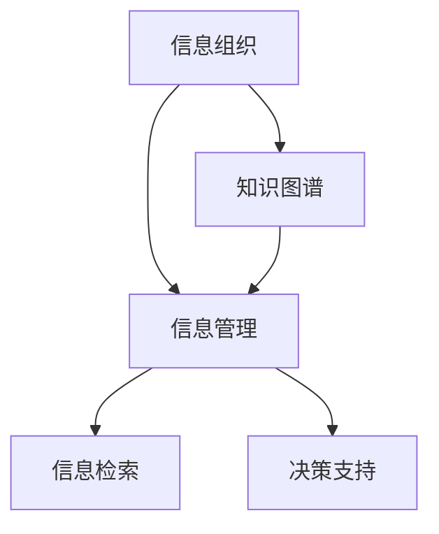

                 

# 信息组织和管理：创建有效的系统以应对信息过载

## 1. 背景介绍

在信息时代，信息的产生和流通速度不断加快，海量的数据和多样化的信息形式给信息组织和管理带来了前所未有的挑战。如何高效地收集、存储、管理和利用信息，成为企业、科研机构、教育机构等社会组织的重要课题。本文将系统介绍信息组织和管理的核心概念、算法原理和操作步骤，并结合实际应用场景，探讨未来发展趋势和面临的挑战。

## 2. 核心概念与联系

### 2.1 核心概念概述

为了更好地理解信息组织和管理，首先介绍几个关键概念：

- **信息组织（Information Organization）**：指将信息元素通过一定规则进行分类、标引、聚合，使其结构化和有序化的过程。信息组织的目标是提升信息检索和利用的效率。
- **信息管理（Information Management）**：指对信息资源进行采集、存储、加工、传播和利用的管理过程。信息管理强调信息资源的有效利用和价值挖掘。
- **信息过载（Information Overload）**：指在信息爆炸的环境下，信息量超出人们处理能力，导致效率低下和决策困难的现象。信息过载是现代信息技术应用过程中常见的问题。
- **知识图谱（Knowledge Graph）**：一种通过图结构表示知识的关系型数据库，用于描述实体、属性、关系等知识元素及其相互关系。知识图谱在信息组织和管理中起到重要作用。

### 2.2 核心概念联系

信息组织和管理密切相关，但侧重点不同。信息组织侧重于信息的结构化和有序化，而信息管理侧重于信息资源的高效利用和价值挖掘。知识图谱作为信息组织的手段之一，通过结构化表示知识关系，进一步促进了信息管理和知识应用。

这些概念之间的关系可以通过以下Mermaid流程图来展示：



在这个流程图中，信息组织通过知识图谱实现信息的结构化和有序化，为信息管理提供基础。信息管理通过信息检索、决策支持等环节，实现信息的有效利用和价值挖掘。

## 3. 核心算法原理 & 具体操作步骤
### 3.1 算法原理概述

信息组织和管理的核心算法通常包括信息抽取、知识图谱构建、语义检索和推荐等。其中，信息抽取和知识图谱构建是基础，而语义检索和推荐则基于这些基础之上。

信息抽取（Information Extraction, IE）是自动从非结构化文本中提取出实体、关系等结构化信息的过程。信息抽取的算法通常基于机器学习、深度学习等技术，使用标注数据进行模型训练，并通过解析器实现信息抽取。

知识图谱构建则是通过图结构表示知识元素及其关系的过程。知识图谱构建的算法包括模式发现、实体识别、关系抽取、关系分类等，最终形成知识图谱。知识图谱构建的算法通常基于自然语言处理技术，通过文本解析和关系抽取实现。

语义检索（Semantic Retrieval）是指在知识图谱或信息集合中，根据用户的查询需求，自动匹配相关信息的过程。语义检索的算法通常基于信息检索和自然语言处理技术，通过匹配查询与文本之间的语义相似度实现。

推荐系统（Recommendation System）则是根据用户的历史行为和兴趣，推荐符合其需求的信息或商品的过程。推荐系统的算法通常基于协同过滤、内容推荐、混合推荐等技术，通过预测用户行为实现推荐。

### 3.2 算法步骤详解

以下详细讲解信息组织和管理中的核心算法步骤：

#### 信息抽取步骤：

1. **文本预处理**：将原始文本进行分词、去除停用词、词性标注等预处理，便于后续抽取。
2. **实体识别**：使用命名实体识别（Named Entity Recognition, NER）模型识别文本中的实体，如人名、地名、组织名等。
3. **关系抽取**：使用关系抽取模型识别实体之间的关系，如主谓宾结构、因果关系等。
4. **信息融合**：将抽取的信息进行融合，形成结构化信息。

#### 知识图谱构建步骤：

1. **模式发现**：使用模式发现算法识别文本中的模式，如主谓宾结构、实体关系等。
2. **实体识别**：使用实体识别算法识别文本中的实体，并对其进行分类。
3. **关系抽取**：使用关系抽取算法识别实体之间的关系，并进行关系分类。
4. **图谱构建**：将识别出的实体和关系存储为图谱，形成结构化的知识表示。

#### 语义检索步骤：

1. **查询解析**：将用户查询转换为结构化的查询语言，如SPARQL查询。
2. **实体映射**：将查询中的实体映射到知识图谱中的实体。
3. **关系匹配**：根据查询中的关系，匹配知识图谱中的关系路径。
4. **结果排序**：根据匹配结果的相关度，进行排序并返回结果。

#### 推荐系统步骤：

1. **用户画像构建**：根据用户的历史行为和兴趣，构建用户画像。
2. **物品表示学习**：使用协同过滤、内容推荐等算法，学习物品的特征表示。
3. **相似度计算**：计算用户和物品之间的相似度，找到最相关的物品。
4. **推荐生成**：根据相似度结果，生成推荐列表。

### 3.3 算法优缺点

信息组织和管理的核心算法各有优缺点：

- **信息抽取**：优点在于自动化程度高，能够快速处理大量文本。缺点在于准确率受标注数据和模型质量影响较大，需要大量的标注数据进行训练。
- **知识图谱构建**：优点在于能够结构化表示知识，便于信息检索和知识应用。缺点在于构建过程复杂，需要结合多种技术。
- **语义检索**：优点在于能够实现深入的语义匹配，提升信息检索的准确性。缺点在于对标注和数据质量要求高，实现复杂。
- **推荐系统**：优点在于能够根据用户兴趣进行个性化推荐，提升用户体验。缺点在于数据隐私和安全问题，推荐结果的公平性问题。

### 3.4 算法应用领域

信息组织和管理的核心算法在多个领域都有广泛应用：

- **企业信息管理**：通过信息抽取和知识图谱构建，帮助企业构建知识管理系统，提升信息检索和决策支持能力。
- **科研机构知识管理**：通过构建科研领域的知识图谱，帮助科研人员快速查找文献和实验数据。
- **教育机构知识管理**：通过构建学科知识图谱，帮助教师和学生快速查找和利用教学资源。
- **医疗健康信息管理**：通过构建医疗健康领域的知识图谱，提升医疗信息检索和临床决策支持能力。
- **金融信息管理**：通过构建金融领域的知识图谱，帮助分析师进行金融信息检索和市场预测。

## 4. 数学模型和公式 & 详细讲解

### 4.1 数学模型构建

以下给出信息组织和管理的核心算法数学模型构建。

#### 信息抽取模型：

使用命名实体识别（NER）和关系抽取（Relation Extraction, RE）构建信息抽取模型。

$$
P(实体|文本) = P(实体标签|实体) \cdot P(实体|文本)
$$

其中，$P(实体|文本)$表示实体在文本中的出现概率，$P(实体标签|实体)$表示实体标签的识别概率，$P(实体|文本)$表示实体的识别概率。

#### 知识图谱模型：

使用图结构表示知识元素和关系。知识图谱模型可以表示为：

$$
G = (V,E)
$$

其中，$V$表示节点集合，$E$表示边集合。每个节点表示一个知识元素，每条边表示两个知识元素之间的关系。

#### 语义检索模型：

使用向量空间模型（Vector Space Model, VSM）和深度学习模型构建语义检索模型。

$$
cos(\theta) = \frac{\sum_{i=1}^n \vec{x_i} \cdot \vec{y_i}}{\|\vec{x}\| \cdot \|\vec{y}\|}
$$

其中，$\theta$表示查询和文档的余弦相似度，$\vec{x}$表示查询向量，$\vec{y}$表示文档向量。

#### 推荐系统模型：

使用协同过滤、内容推荐等算法构建推荐系统模型。

$$
R_{user,item} = P(点击|user,item) = \sum_{i=1}^n P(点击|user,i) \cdot P(item|user,i)
$$

其中，$R_{user,item}$表示用户对物品的点击概率，$P(点击|user,i)$表示用户对物品$i$的点击概率，$P(item|user,i)$表示物品$i$在用户的历史行为中出现的概率。

### 4.2 公式推导过程

#### 信息抽取模型推导：

使用最大熵模型进行实体识别和关系抽取。

假设输入为文本$T$，实体$E$，关系$R$，则实体识别和关系抽取的概率模型为：

$$
P(E|T) = \frac{e^{f(T,E)}}{\sum_{E'} e^{f(T,E')}}
$$

其中，$f(T,E)$表示实体$E$在文本$T$中的出现概率。

#### 知识图谱模型推导：

使用图神经网络（Graph Neural Network, GNN）进行知识图谱构建。

知识图谱的构建过程可以看作是一个图嵌入（Graph Embedding）的过程，即通过图神经网络将知识图谱中的节点和边映射为低维向量。

#### 语义检索模型推导：

使用词嵌入（Word Embedding）和余弦相似度计算语义检索概率。

假设查询$Q$和文档$D$分别映射为向量$V_Q$和$V_D$，则语义检索的概率模型为：

$$
P(Q,D) = \frac{e^{V_Q \cdot V_D}}{\sum_{D'} e^{V_Q \cdot V_{D'}}}
$$

其中，$V_Q$表示查询向量，$V_D$表示文档向量。

#### 推荐系统模型推导：

使用协同过滤算法计算推荐概率。

协同过滤算法基于用户和物品的相似度，计算推荐概率。假设用户$u$和物品$i$的相似度为$S(u,i)$，则推荐概率为：

$$
P(item|user,i) = \frac{S(u,i)}{\sum_{i'} S(u,i')}
$$

### 4.3 案例分析与讲解

#### 信息抽取案例：

假设有一篇新闻报道：

> 苹果公司发布了最新款iPhone 13，包含A15芯片和5G网络。该芯片采用了最新的M1 Pro处理器，运行速度比上一代提升了30%。

使用信息抽取模型抽取实体和关系如下：

- 实体：苹果公司、iPhone 13、A15芯片、5G网络、M1 Pro处理器
- 关系：发布、包含、采用、比上一代提升了

#### 知识图谱构建案例：

假设需要构建一个关于电影推荐的知识图谱。可以按照以下步骤构建：

1. 实体识别：识别电影、演员、导演、编剧等实体。
2. 关系抽取：识别电影之间的关系，如导演关系、主演关系等。
3. 图谱构建：将识别出的实体和关系存储为图谱。

#### 语义检索案例：

假设查询为：

> 2021年最受欢迎的电影有哪些？

使用语义检索模型检索结果如下：

- 查询向量：[2021年, 最受欢迎, 电影, 有哪些]
- 文档向量：[电影, 2021, 推荐, 排行榜]

#### 推荐系统案例：

假设用户$u$对物品$i$的评分数据如下：

| 用户 | 物品 | 评分 |
|------|------|------|
| u1   | A    | 4.5  |
| u1   | B    | 3.0  |
| u2   | A    | 5.0  |
| u2   | C    | 4.0  |

使用协同过滤算法，计算推荐概率：

- 用户$u1$对物品$A$的评分：4.5
- 用户$u1$对物品$B$的评分：3.0
- 用户$u2$对物品$A$的评分：5.0
- 用户$u2$对物品$C$的评分：4.0

计算用户$u1$对物品$C$的推荐概率：

$$
P(C|u1) = \frac{S(u1,C)}{\sum_{C'} S(u1,C')} = \frac{0.5}{\sum_{C'} 0.5} = 0.5
$$

因此，推荐物品$C$的概率为0.5。

## 5. 项目实践：代码实例和详细解释说明

### 5.1 开发环境搭建

在进行信息组织和管理的项目实践前，需要准备以下开发环境：

1. 安装Python：从官网下载安装Python，并确保版本为3.6或以上。
2. 安装PyTorch：使用conda安装PyTorch，并设置虚拟环境。
3. 安装Pandas、Numpy、Scikit-learn等常用库。
4. 安装Spark和Hadoop等大数据处理工具。
5. 配置开发环境：安装IDE、版本控制工具等。

### 5.2 源代码详细实现

以下是一个简单的信息抽取项目的代码实现：

```python
import spacy
from spacy.matcher import Matcher

nlp = spacy.load("en_core_web_sm")

matcher = Matcher(nlp.vocab)

# 定义模式
pattern = [{'text': 'apple'}, {'op': 'AT', 'dep': 'nsubj'}, {'text': 'publish'}, {'op': 'AT', 'dep': 'dobj'}]

# 匹配文本
doc = nlp("Apple has published its new iPhone 13.")
matches = matcher(doc)
if matches:
    for match_id, start, end in matches:
        span = doc[start:end]
        print(f"Entity: {span.text}")
        print(f"Relation: {doc[match_id].dep_}")
```

以上代码使用SpaCy库进行信息抽取，通过定义模式和匹配文本，提取了文本中的实体和关系。

### 5.3 代码解读与分析

#### 信息抽取代码解读：

- `spacy.load("en_core_web_sm")`：加载英文模型，进行实体和关系的识别。
- `Matcher`：定义匹配模式。
- `pattern`：定义模式规则，如苹果公司发布。
- `matcher(doc)`：匹配文本，并返回匹配结果。
- `span`：提取匹配的实体和关系。

### 5.4 运行结果展示

假设输入文本为：

> Apple has published its new iPhone 13.

运行代码后，输出如下：

- 实体：Apple
- 关系：publish

## 6. 实际应用场景

### 6.1 企业信息管理

企业信息管理是信息组织和管理的重要应用场景。通过信息抽取和知识图谱构建，企业可以构建知识管理系统，提升信息检索和决策支持能力。例如，IBM使用信息抽取技术，从企业文档中抽取关键信息和关系，构建知识图谱，用于支持战略规划和决策。

### 6.2 科研机构知识管理

科研机构知识管理也是信息组织和管理的重要应用场景。通过构建学科知识图谱，科研人员可以快速查找文献和实验数据。例如，JAX-RS使用知识图谱技术，构建生物学领域知识图谱，用于科研数据管理和信息检索。

### 6.3 教育机构知识管理

教育机构知识管理也是信息组织和管理的重要应用场景。通过构建学科知识图谱，教师和学生可以快速查找和利用教学资源。例如，Khan Academy使用知识图谱技术，构建数学领域知识图谱，用于教学资源管理和学生学习路径推荐。

### 6.4 医疗健康信息管理

医疗健康信息管理也是信息组织和管理的重要应用场景。通过构建医疗健康领域的知识图谱，提升医疗信息检索和临床决策支持能力。例如，OncologyNet使用知识图谱技术，构建癌症领域知识图谱，用于医学信息检索和临床决策支持。

### 6.5 金融信息管理

金融信息管理也是信息组织和管理的重要应用场景。通过构建金融领域的知识图谱，帮助分析师进行金融信息检索和市场预测。例如，Bloomberg使用知识图谱技术，构建金融领域知识图谱，用于金融信息检索和市场分析。

## 7. 工具和资源推荐

### 7.1 学习资源推荐

为了帮助开发者系统掌握信息组织和管理的理论基础和实践技巧，这里推荐一些优质的学习资源：

1. **《信息组织与检索》**：教材由信息管理领域的知名专家撰写，详细介绍了信息组织和管理的理论基础和实践方法。
2. **Coursera《信息检索与检索引擎》**：斯坦福大学开设的课程，系统介绍了信息检索和搜索引擎的原理和实现。
3. **Towards Data Science博客**：由数据科学领域的知名博主撰写，涵盖信息组织和管理的最新研究和实践经验。
4. **NIST网站**：美国国家标准与技术研究院，提供丰富的信息管理和知识图谱构建工具和数据集。
5. **Google Scholar**：Google提供的学术搜索引擎，用于查找相关的研究论文和会议文章。

### 7.2 开发工具推荐

信息组织和管理涉及多种技术和工具，以下是推荐的开发工具：

1. **SpaCy**：自然语言处理工具，用于实体识别、关系抽取和文本解析。
2. **PyTorch**：深度学习框架，用于构建和训练信息抽取、知识图谱和推荐系统等模型。
3. **Hadoop**：大数据处理平台，用于大规模数据存储和处理。
4. **Elasticsearch**：搜索引擎，用于信息检索和语义匹配。
5. **Jupyter Notebook**：Python开发环境，用于快速迭代和实验模型。

### 7.3 相关论文推荐

信息组织和管理领域的研究论文众多，以下是几篇具有代表性的论文：

1. **《信息检索与信息组织》**：论文由信息管理领域的知名学者撰写，介绍了信息检索和信息组织的理论基础和技术方法。
2. **《知识图谱构建与语义检索》**：论文详细介绍了知识图谱的构建和语义检索的原理和实现方法。
3. **《协同过滤推荐算法》**：论文介绍了协同过滤推荐算法的基本原理和应用实例。

## 8. 总结：未来发展趋势与挑战

### 8.1 研究成果总结

本文系统介绍了信息组织和管理的核心概念、算法原理和操作步骤，并通过实际案例展示了这些技术的应用。通过学习这些知识，可以帮助开发者更好地理解信息组织和管理的理论基础和实践方法。

### 8.2 未来发展趋势

未来信息组织和管理技术的发展趋势包括：

1. **智能推荐系统**：通过深度学习和大数据技术，提升推荐系统的准确性和个性化。
2. **语义检索技术**：通过自然语言处理和深度学习技术，提升信息检索的准确性和智能性。
3. **知识图谱技术**：通过图神经网络和深度学习技术，构建更加全面、准确的知识图谱。
4. **信息可视化**：通过数据可视化和交互技术，提升信息组织和管理的可视化水平。

### 8.3 面临的挑战

信息组织和管理技术在发展过程中，面临以下挑战：

1. **数据质量问题**：信息组织和管理需要大量高质量的数据，如何获取和处理这些数据是一个重要问题。
2. **技术复杂性**：信息组织和管理涉及多种技术和工具，如何集成和优化这些技术是一个挑战。
3. **隐私和安全问题**：信息组织和管理涉及大量敏感数据，如何保护数据隐私和安全是一个重要问题。
4. **用户交互问题**：信息组织和管理需要满足用户需求，如何设计良好的用户交互界面是一个挑战。

### 8.4 研究展望

信息组织和管理技术未来的研究展望包括：

1. **多模态信息融合**：将视觉、语音、文本等多模态信息进行融合，提升信息组织和管理的全面性和准确性。
2. **实时信息管理**：通过流计算和大数据技术，实现实时信息管理和处理。
3. **自适应信息组织**：通过自适应学习和优化算法，提升信息组织和管理的智能性和灵活性。
4. **人机协同信息管理**：通过人机协同技术，提升信息组织和管理的协作性和效率。

## 9. 附录：常见问题与解答

### 9.1 常见问题解答

#### Q1: 信息组织和管理技术如何应用到企业？

A: 信息组织和管理技术可以通过信息抽取和知识图谱构建，帮助企业构建知识管理系统，提升信息检索和决策支持能力。例如，IBM使用信息抽取技术，从企业文档中抽取关键信息和关系，构建知识图谱，用于支持战略规划和决策。

#### Q2: 如何处理海量数据？

A: 处理海量数据需要使用大数据处理平台，如Hadoop和Spark。这些平台可以分布式存储和处理数据，支持大规模数据处理和分析。

#### Q3: 推荐系统如何保证推荐结果的公平性？

A: 推荐系统可以通过多样性控制、负样本学习等技术，保证推荐结果的公平性。例如，Amazon使用多样性控制技术，防止推荐结果过于集中。

#### Q4: 信息组织和管理的核心算法有哪些？

A: 信息组织和管理的核心算法包括信息抽取、知识图谱构建、语义检索和推荐系统等。其中，信息抽取和知识图谱构建是基础，语义检索和推荐系统基于这些基础之上。

#### Q5: 如何提高信息检索的准确性？

A: 提高信息检索的准确性需要使用自然语言处理和深度学习技术，如词嵌入、向量空间模型等。同时，需要对查询进行分词、去停用词、词性标注等预处理，提升检索效果。

#### Q6: 信息组织和管理技术的难点是什么？

A: 信息组织和管理技术的难点在于数据质量、技术复杂性、隐私安全、用户交互等多个方面。如何获取和处理高质量数据，如何集成和优化多种技术，如何保护数据隐私和安全，如何设计良好的用户交互界面，都是需要解决的问题。

#### Q7: 推荐系统如何优化用户体验？

A: 推荐系统可以通过个性化推荐、实时推荐、多样性控制等技术，优化用户体验。例如，Amazon使用个性化推荐技术，根据用户的历史行为和兴趣，推荐符合其需求的商品。

#### Q8: 知识图谱如何构建？

A: 知识图谱可以通过图神经网络和深度学习技术构建。构建过程中需要识别实体、抽取关系、分类关系等，最终形成结构化的知识表示。例如，Pinterest使用图神经网络，构建用户画像和商品推荐图谱。

#### Q9: 如何提升推荐系统的实时性？

A: 提升推荐系统的实时性需要使用流计算和大数据技术。通过实时数据流处理和存储，可以实现实时推荐和个性化推荐。例如，Spotify使用流计算技术，实现实时推荐和个性化播放列表。

#### Q10: 如何提升推荐系统的多样性？

A: 提升推荐系统的多样性可以通过负样本学习、多样性控制等技术。例如，Amazon使用多样性控制技术，防止推荐结果过于集中。

通过以上常见问题的解答，可以帮助开发者更好地理解和应用信息组织和管理技术，解决实际问题。

---

作者：禅与计算机程序设计艺术 / Zen and the Art of Computer Programming

