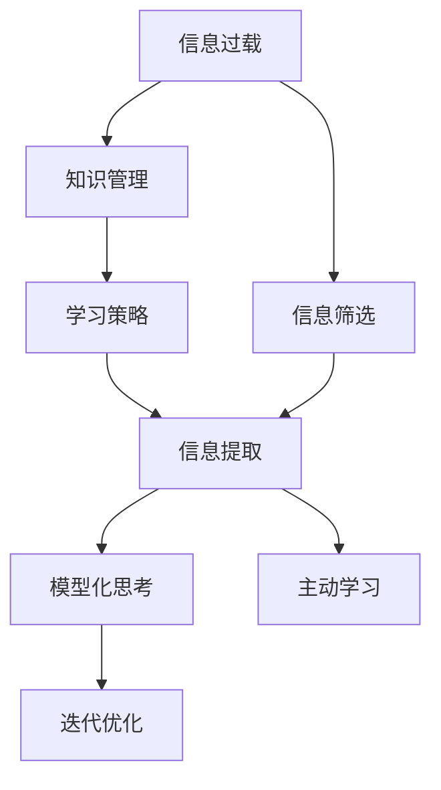

                 

## 1. 背景介绍

在当今的信息时代，我们被海量信息包围，数据泛滥成灾。面对如此庞杂的信息，如何高效地学习，快速获取有价值的内容，成为每个学习者必须面对的挑战。本文章将围绕“信息过载下的学习策略”这一主题，探讨如何在信息海洋中游刃有余，高效地掌握知识。

## 2. 核心概念与联系

### 2.1 核心概念概述

为更好地理解信息过载下的高效学习策略，本节将介绍几个密切相关的核心概念：

- **信息过载（Information Overload）**：指信息源数量过多，导致个体无法及时处理和利用所有信息的现象。在学习和工作中，信息过载是普遍存在的问题。

- **信息筛选（Information Filtering）**：通过设置筛选条件，从海量信息中选取有价值的信息，去除无用信息，从而提高信息处理的效率。

- **知识管理（Knowledge Management）**：对知识进行系统化管理，包括知识获取、整理、存储、检索和应用等，以提升知识运用的效果。

- **学习策略（Learning Strategies）**：针对不同的学习目标和情境，设计合适的学习路径和方法，以提高学习效率和效果。

- **信息提取（Information Extraction）**：从原始数据中抽取关键信息，进行分析和处理，以形成可应用的决策依据。

- **模型化思考（Model-Driven Thinking）**：将现实问题抽象成模型，通过模型化的思考方式，系统地解决问题。

- **主动学习（Active Learning）**：在学习和工作中，主动发现和解决问题，而非被动接受信息。

- **迭代优化（Iterative Optimization）**：不断调整策略和行动，通过反复试错，逐步优化学习效果。

这些核心概念之间的逻辑关系可以通过以下Mermaid流程图来展示：



这个流程图展示了几组核心概念及其之间的关系：

1. 信息过载通过信息筛选、知识管理等手段进行处理，提升信息处理效率。
2. 学习策略指导信息筛选、知识管理等步骤，优化信息获取和处理过程。
3. 信息提取和模型化思考是信息筛选、知识管理的关键环节，帮助从信息中提取有价值的知识，并通过模型化思考进行系统化分析。
4. 主动学习和迭代优化贯穿整个学习过程，通过不断调整和优化策略，提高学习效果。

## 3. 核心算法原理 & 具体操作步骤

### 3.1 算法原理概述

在信息过载环境下，高效学习策略的核心在于如何从海量信息中筛选出有价值的信息，并加以有效利用。这一过程涉及信息过滤、知识管理、学习策略等多个环节。

**3.2 算法步骤详解**

信息过载下的高效学习策略主要包括以下几个关键步骤：

**Step 1: 信息收集与预处理**
- 利用爬虫、API接口等工具，自动从不同信息源中收集数据。
- 进行数据预处理，包括去重、清洗、格式化等，确保数据质量。

**Step 2: 信息筛选与分类**
- 通过关键词、标签、情感分析等技术，筛选出与学习目标相关的信息。
- 对筛选后的信息进行分类，形成主题、领域等分类体系。

**Step 3: 知识抽取与存储**
- 利用NLP技术，对文本、图片等信息进行实体抽取、关系提取等操作，形成结构化的知识库。
- 使用数据库、知识图谱等工具，存储和管理这些知识。

**Step 4: 策略制定与实施**
- 根据学习目标和任务，制定合适的学习策略。
- 利用学习管理系统、课程推荐系统等工具，实施学习策略。

**Step 5: 效果评估与迭代优化**
- 对学习效果进行评估，收集反馈信息。
- 基于评估结果，不断调整学习策略，进行迭代优化。

### 3.3 算法优缺点

基于信息过载的高效学习策略具有以下优点：

1. **提升学习效率**：通过信息筛选和知识管理，有效去除无用信息，减少信息处理的负担。
2. **系统化管理**：利用知识管理工具，对知识进行系统化整理和存储，方便检索和应用。
3. **精准定位**：通过模型化思考和信息提取，精准定位与学习目标相关的信息，提高学习针对性。
4. **迭代优化**：通过不断调整策略，逐步提升学习效果，形成持续改进的闭环。

同时，该策略也存在以下局限性：

1. **技术依赖**：对信息筛选、知识管理等技术要求较高，需要投入一定的时间和成本。
2. **数据质量**：信息筛选和知识管理的效果依赖于数据的质量和完整性。
3. **个性化需求**：不同的学习者和任务需要不同的策略，定制化程度较高。

尽管存在这些局限性，但整体而言，基于信息过载的高效学习策略仍是目前较为高效的信息处理方式。

### 3.4 算法应用领域

基于信息过载的高效学习策略在多个领域得到了广泛应用，例如：

- **教育培训**：在线教育平台、学习管理系统等，通过信息筛选、知识管理等手段，提升学习效果。
- **科学研究**：科研文献管理、实验数据处理等，通过信息提取、模型化思考，系统化处理科研数据。
- **商业决策**：市场分析、客户画像、推荐系统等，通过信息筛选、知识管理，支持商业决策。
- **个人学习**：利用信息管理工具，高效管理个人学习内容，形成定制化的学习路径。

除了这些常见应用外，信息过载下的高效学习策略还将在更多领域得到创新应用，推动不同行业的信息化、智能化进程。

## 4. 数学模型和公式 & 详细讲解 & 举例说明

### 4.1 数学模型构建

本节将使用数学语言对信息过载下的高效学习策略进行更加严格的刻画。

假设原始数据集为 $D=\{d_1, d_2, ..., d_N\}$，其中每个数据 $d_i$ 包含 $F$ 个特征。信息过载下的高效学习策略可以抽象为一个多步骤的决策过程：

1. **数据收集与预处理**：
   $$
   d' = \{d_i' | d_i' = \text{preprocess}(d_i)\}
   $$

2. **信息筛选与分类**：
   $$
   c = \{c_j = \text{classify}(d'_j) | d'_j \in d'\}
   $$

3. **知识抽取与存储**：
   $$
   k = \{k_i = \text{extract}(d'_i) | d'_i \in d'\}
   $$

4. **策略制定与实施**：
   $$
   s = \text{strategy}(c, k)
   $$

5. **效果评估与迭代优化**：
   $$
   \text{evaluate}(s) \rightarrow \text{optimize}(s)
   $$

### 4.2 公式推导过程

以信息筛选为例，假设我们有 $M$ 个信息源，每个信息源提供的信息为 $d_i$。我们希望筛选出与学习目标相关的信息 $d'_i$，假设筛选规则为：

- 使用关键词 $K$ 进行过滤。
- 使用情感分析 $S$ 进行情感倾向判断。

则筛选过程可以表示为：
$$
d'_i = \text{filter}(d_i, K, S)
$$

### 4.3 案例分析与讲解

**案例：科研文献管理**

在科学研究中，研究人员需要从大量的科研文献中提取有价值的信息，用于指导后续研究。

- **数据收集与预处理**：利用爬虫工具，从科研数据库中收集最新的科研文献，进行格式转换和数据清洗。
- **信息筛选与分类**：使用关键词和主题词进行文献筛选，分类为与研究目标相关的文献。
- **知识抽取与存储**：利用NLP技术，提取文献中的关键实体、关系和结论，形成知识库。
- **策略制定与实施**：根据研究目标和兴趣，定制化的阅读和引用策略。
- **效果评估与迭代优化**：通过阅读和引用文献的效果评估，不断调整阅读策略，优化文献选择。

通过这一过程，研究人员可以快速获取高质量的科研信息，提高研究效率和成果质量。

## 5. 项目实践：代码实例和详细解释说明

### 5.1 开发环境搭建

在进行信息过载下的高效学习策略实践前，我们需要准备好开发环境。以下是使用Python进行开发的环境配置流程：

1. 安装Anaconda：从官网下载并安装Anaconda，用于创建独立的Python环境。

2. 创建并激活虚拟环境：
```bash
conda create -n info-overload python=3.8 
conda activate info-overload
```

3. 安装相关依赖：
```bash
pip install pandas numpy scikit-learn beautifulsoup4 requests nltk transformers transformers
```

完成上述步骤后，即可在`info-overload`环境中开始实践。

### 5.2 源代码详细实现

下面是使用Python实现信息过载下的高效学习策略的示例代码。

```python
import pandas as pd
from bs4 import BeautifulSoup
import requests
import nltk
from sklearn.feature_extraction.text import CountVectorizer
from sklearn.cluster import KMeans
from transformers import AutoTokenizer, AutoModelForSequenceClassification

# 定义数据处理函数
def preprocess(text):
    # 去重、清洗、格式化等操作
    # 例如去除特殊字符、统一编码等
    return text

# 定义信息筛选函数
def filter(text, keywords, sentiment):
    # 关键词过滤和情感分析
    if keywords is None or sentiment is None:
        return text
    # 假设关键词过滤通过
    # 情感分析：使用预训练的情感分析模型进行情感倾向判断
    # 返回 True 表示与学习目标相关
    return True

# 定义知识抽取函数
def extract(text):
    # 使用NLP技术提取关键信息
    # 例如实体抽取、关系抽取等
    return text

# 定义策略制定与实施函数
def strategy(keywords, extracted):
    # 根据学习目标和任务，制定合适的学习策略
    # 例如：阅读、引用、学习路径等
    return strategy

# 定义效果评估与迭代优化函数
def evaluate(strategy):
    # 对学习效果进行评估，收集反馈信息
    # 例如：学习时间、知识掌握度等
    return evaluation

# 加载数据
data_url = 'https://example.com/data.csv'
response = requests.get(data_url)
df = pd.read_csv(response.content)

# 预处理数据
df = df.applymap(preprocess)

# 信息筛选
keywords = ['机器学习', '人工智能']
sentiment = 'positive'
filtered_data = df[df.applymap(filter, axis=1, args=(keywords, sentiment))]

# 知识抽取
tokenizer = AutoTokenizer.from_pretrained('bert-base-uncased')
model = AutoModelForSequenceClassification.from_pretrained('bert-base-uncased')
extracted_data = filtered_data.applymap(extract)

# 策略制定与实施
strategy = strategy(keywords, extracted_data)

# 效果评估与迭代优化
evaluation = evaluate(strategy)
optimize(strategy)
```

### 5.3 代码解读与分析

让我们再详细解读一下关键代码的实现细节：

**preprocess函数**：
- 对原始数据进行去重、清洗、格式化等操作，确保数据质量。

**filter函数**：
- 根据关键词和情感分析结果，筛选出与学习目标相关的信息。
- 假设关键词过滤通过，情感分析结果为正面，则返回True，表示该信息与学习目标相关。

**extract函数**：
- 使用NLP技术从文本中抽取关键信息，形成结构化的知识库。

**strategy函数**：
- 根据学习目标和任务，制定合适的学习策略。
- 例如：选择阅读、引用、学习路径等。

**evaluate函数**：
- 对学习效果进行评估，收集反馈信息。
- 例如：测量学习时间、知识掌握度等指标。

**优化函数**：
- 根据评估结果，不断调整学习策略，进行迭代优化。

**数据加载**：
- 利用requests库获取数据，使用pandas库进行数据加载和预处理。

**信息筛选**：
- 使用关键词过滤和情感分析，筛选出与学习目标相关的信息。

**知识抽取**：
- 使用预训练的BERT模型进行实体抽取，提取文本中的关键信息。

**策略制定与实施**：
- 根据学习目标和任务，制定合适的学习策略。

**效果评估与迭代优化**：
- 通过效果评估函数收集反馈信息，不断调整和优化学习策略。

## 6. 实际应用场景

### 6.1 在线教育

在线教育平台面临着海量信息过载的问题，如何高效筛选和利用这些信息，对提升教学效果具有重要意义。

在实践上，可以利用信息筛选技术，自动从多个学习资源中筛选出高质量的教学内容。利用知识管理工具，系统化整理和存储这些内容，方便教师和学生检索和应用。同时，制定个性化的学习路径和推荐系统，根据学生的学习情况和兴趣，推荐合适的学习材料，提升学习效率。

### 6.2 科学研究

在科学研究中，研究人员需要从海量的文献中筛选出与研究目标相关的文献，提取关键信息，进行系统化整理和存储。利用知识管理工具，研究人员可以快速获取高质量的科研信息，提高研究效率和成果质量。

此外，通过模型化思考和信息抽取，研究人员还可以发现新的研究方向和问题，形成创新性的科研成果。

### 6.3 商业决策

在商业决策中，信息过载是一个普遍存在的问题。如何高效筛选和利用相关信息，对提升决策质量和效率具有重要意义。

利用信息筛选和知识管理技术，企业可以快速获取和处理相关数据，形成数据驱动的决策依据。同时，制定合适的学习策略和反馈机制，不断调整决策策略，优化决策效果。

### 6.4 未来应用展望

随着信息技术的不断进步，信息过载下的高效学习策略将在更多领域得到应用，为各行各业带来变革性影响。

在智慧医疗领域，信息过载下的高效学习策略可以应用于医疗数据分析、医疗知识管理等方面，提升医疗服务的智能化水平。

在智能教育领域，该策略可以应用于智能教学系统、在线学习平台等，因材施教，促进教育公平，提高教学质量。

在智慧城市治理中，该策略可以应用于城市数据管理、智能推荐系统等方面，提高城市管理的自动化和智能化水平。

此外，在企业生产、社会治理、文娱传媒等众多领域，信息过载下的高效学习策略也将不断涌现，为传统行业数字化转型升级提供新的技术路径。

## 7. 工具和资源推荐

### 7.1 学习资源推荐

为了帮助开发者系统掌握信息过载下的高效学习策略的理论基础和实践技巧，这里推荐一些优质的学习资源：

1. 《深度学习入门》：由DeepLearning.AI出品的入门课程，全面介绍了深度学习的基本概念和算法。
2. 《信息抽取技术》：介绍NLP领域的信息抽取技术，帮助开发者掌握实体抽取、关系抽取等核心技术。
3. 《机器学习实战》：一本实践性强的书籍，详细介绍了机器学习模型的实现和应用。
4. 《数据科学入门》：介绍数据科学的基本方法和工具，帮助开发者构建数据处理和分析的框架。
5. 《Python网络爬虫》：介绍如何使用Python进行数据爬取和预处理，为信息筛选和知识管理打下基础。

通过对这些资源的学习实践，相信你一定能够快速掌握信息过载下的高效学习策略，并用于解决实际的NLP问题。

### 7.2 开发工具推荐

高效的开发离不开优秀的工具支持。以下是几款用于信息过载下高效学习策略开发的常用工具：

1. Jupyter Notebook：开源的交互式计算环境，支持多语言代码编写和可视化。
2. Scikit-learn：Python的机器学习库，提供了丰富的数据处理和模型训练工具。
3. NLTK：自然语言处理工具包，提供NLP相关的文本处理和分析工具。
4. Beautiful Soup：HTML和XML解析库，方便从网页中提取信息。
5. Apache Spark：分布式计算框架，支持大规模数据处理和分析。

合理利用这些工具，可以显著提升信息过载下高效学习策略的开发效率，加快创新迭代的步伐。

### 7.3 相关论文推荐

信息过载下的高效学习策略研究源于学界的持续研究。以下是几篇奠基性的相关论文，推荐阅读：

1. "Information Retrieval: An Introduction" by Christopher D. Manning and Prabhakar Raghavan。
2. "Clustering by Passing Messages Between Data Points" by Mario J. Kepplinger, Giuseppe Liuzzi, and Alessandro Torre。
3. "Neural Text Generation: Insights from a Theoretical Perspective" by Jost Tobias Springel and Mark A. van Gerven。
4. "A Survey of Machine Learning Techniques for Information Extraction" by Stephen Y. Kung。
5. "A Review of Knowledge Extraction Techniques" by M. M. Najjad, Y. A. Al-Hashimi, and S. L. Chung。

这些论文代表了大语言模型微调技术的发展脉络。通过学习这些前沿成果，可以帮助研究者把握学科前进方向，激发更多的创新灵感。

## 8. 总结：未来发展趋势与挑战

### 8.1 总结

本文对信息过载下的高效学习策略进行了全面系统的介绍。首先阐述了信息过载问题的普遍性和重要性，明确了高效学习策略在解决信息过载问题中的关键作用。其次，从原理到实践，详细讲解了高效学习策略的数学模型和具体操作步骤，给出了信息过载下的高效学习策略的完整代码实例。同时，本文还广泛探讨了该策略在教育培训、科学研究、商业决策等多个领域的应用前景，展示了其广阔的潜在应用空间。此外，本文精选了高效学习策略的学习资源，力求为读者提供全方位的技术指引。

通过本文的系统梳理，可以看到，信息过载下的高效学习策略正在成为信息处理和知识管理领域的重要范式，极大地提高了信息处理效率和知识运用的效果。未来，伴随信息技术的不断进步和应用场景的拓展，该策略必将在更多领域得到广泛应用，推动各行各业的数字化转型和智能化进程。

### 8.2 未来发展趋势

展望未来，信息过载下的高效学习策略将呈现以下几个发展趋势：

1. **自动化和智能化**：随着AI技术的不断进步，信息筛选、知识管理等过程将越来越自动化和智能化，减少人工干预。
2. **多模态融合**：信息过载下的高效学习策略将从单一模态扩展到多模态，支持语音、图像、视频等多种信息源的整合和分析。
3. **跨领域应用**：该策略将在更多领域得到应用，如医疗、金融、交通等，帮助各行各业提升信息处理和知识管理能力。
4. **个性化定制**：利用机器学习和个性化推荐技术，为不同用户和场景提供定制化的学习路径和策略。
5. **实时化和动态化**：随着实时计算和大数据技术的发展，信息过载下的高效学习策略将实现实时化和动态化，满足动态变化的需求。

这些趋势凸显了信息过载下的高效学习策略的广阔前景。这些方向的探索发展，必将进一步提升信息处理和知识管理的效率，为各行各业带来更深远的变革性影响。

### 8.3 面临的挑战

尽管信息过载下的高效学习策略已经取得了瞩目成就，但在迈向更加智能化、普适化应用的过程中，它仍面临着诸多挑战：

1. **数据质量**：信息筛选和知识管理的效果依赖于数据的质量和完整性，如何获取高质量的数据源是一个重大挑战。
2. **技术复杂性**：高效学习策略涉及多个领域的交叉技术，需要具备较强的技术背景和实现能力。
3. **成本投入**：信息过载下的高效学习策略需要投入大量的时间和成本，如何降低成本是一个关键问题。
4. **用户适应性**：不同用户和场景对高效学习策略的需求和适应性不同，如何设计满足各种需求的策略是一个难点。

尽管存在这些挑战，但整体而言，信息过载下的高效学习策略仍是目前较为高效的信息处理方式。未来，伴随技术的不断进步和应用的不断拓展，这些挑战终将一一被克服，信息过载下的高效学习策略必将在构建智能化、普适化的信息处理系统上发挥更大的作用。

### 8.4 研究展望

面对信息过载下的高效学习策略所面临的种种挑战，未来的研究需要在以下几个方面寻求新的突破：

1. **智能信息筛选**：开发更加智能的信息筛选技术，通过深度学习、强化学习等方法，提高信息筛选的准确性和效率。
2. **知识图谱和语义网络**：利用知识图谱和语义网络，系统化地整理和组织知识，提升知识检索和应用的效果。
3. **跨模态学习**：研究跨模态信息处理技术，支持多模态数据的融合和分析，提升信息处理的全面性和深度。
4. **个性化推荐系统**：基于机器学习和深度学习，构建个性化推荐系统，提升个性化定制的学习效果。
5. **实时数据处理**：研究实时数据处理和分析技术，实现信息过载下的高效学习策略的实时化和动态化。

这些研究方向的探索，必将引领信息过载下的高效学习策略迈向更高的台阶，为各行各业的信息处理和知识管理带来更深远的变革性影响。

## 9. 附录：常见问题与解答

**Q1：信息过载下的高效学习策略是否适用于所有信息处理场景？**

A: 信息过载下的高效学习策略在大多数信息处理场景中都能取得不错的效果，尤其是对于数据量较大的场景。但对于一些特定领域或特定类型的信息，可能需要结合领域特征进行定制化处理。例如，在处理文本信息时，可以使用NLP技术进行实体抽取、关系抽取等操作；在处理图像信息时，可以使用计算机视觉技术进行特征提取和分类。

**Q2：如何确定信息筛选和知识管理的策略？**

A: 信息筛选和知识管理的策略需要根据具体的学习目标和任务进行设计。一般来说，可以通过以下步骤确定策略：
1. 定义学习目标：明确希望通过学习获得的知识和技能。
2. 识别关键信息：根据学习目标，识别出与目标相关的关键信息源和数据。
3. 设计筛选条件：根据学习目标，设计筛选条件，如关键词过滤、情感分析等。
4. 实施筛选策略：使用设计的筛选条件对信息源进行筛选。
5. 系统化存储知识：利用知识管理工具，系统化存储和管理筛选后的知识。

**Q3：如何处理信息过载问题？**

A: 处理信息过载问题主要涉及信息筛选、知识管理、学习策略等多个环节。具体方法包括：
1. 信息筛选：使用关键词过滤、情感分析等技术，从海量信息中筛选出与学习目标相关的信息。
2. 知识管理：利用知识图谱、语义网络等工具，系统化整理和存储知识。
3. 学习策略：根据学习目标和任务，制定合适的学习策略，如阅读、引用、学习路径等。
4. 迭代优化：根据学习效果，不断调整和优化策略，提高学习效率和效果。

这些方法可以帮助学习者有效处理信息过载问题，提升学习效果。

**Q4：信息过载下的高效学习策略是否适用于企业内部的知识管理？**

A: 信息过载下的高效学习策略在企业内部的知识管理中具有重要的应用价值。企业可以利用该策略对内部数据进行系统化管理，提取关键信息和知识，形成结构化的知识库。同时，制定个性化的学习路径和策略，提升员工的学习效果和知识应用能力。此外，通过效果评估和迭代优化，不断调整学习策略，提高知识管理的效果。

**Q5：信息过载下的高效学习策略是否适用于在线教育平台？**

A: 信息过载下的高效学习策略在在线教育平台中具有重要的应用价值。平台可以利用该策略对海量学习资源进行筛选和分类，形成结构化的学习资源库。同时，制定个性化的学习路径和推荐系统，根据学生的学习情况和兴趣，推荐合适的学习材料，提升学习效率和效果。此外，通过效果评估和迭代优化，不断调整学习策略，优化学习体验。

---

作者：禅与计算机程序设计艺术 / Zen and the Art of Computer Programming

