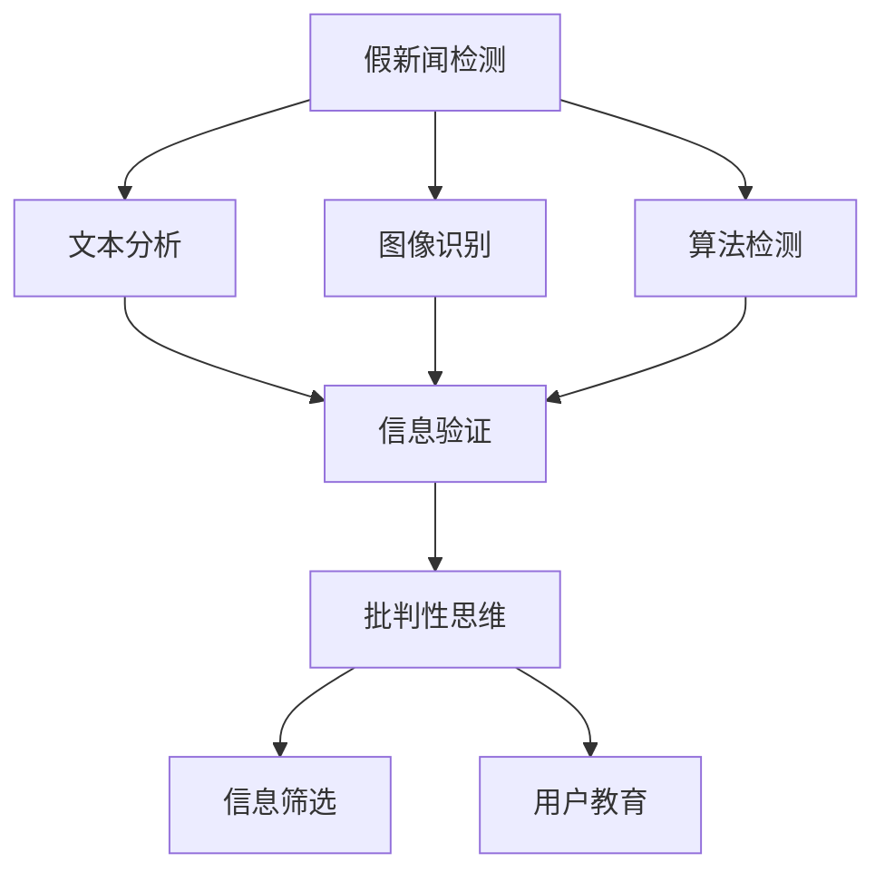

                 

# 信息验证和批判性思维能力培养：在假新闻和错误信息时代导航

> 关键词：假新闻检测, 信息验证, 批判性思维, 人工智能, 自然语言处理, 数据科学, 深度学习

## 1. 背景介绍

### 1.1 问题由来
在信息时代，假新闻和错误信息的传播速度和范围已经超越了过去任何时期。假新闻利用人们的认知偏差和情绪化倾向，通过修改事实、断章取义、利用算法技术等手段，达到欺骗、误导公众的目的。在医疗、政治、经济等重要领域，假新闻的泛滥更是可能导致严重的社会后果。

据统计，全球每年约有1/4的新闻报道含有虚假信息。信息素养和社会责任意识的缺失，使得公众在面对海量信息时，容易受到误导。如何培养公众的信息验证和批判性思维能力，成为了当前社会面临的重要挑战。

### 1.2 问题核心关键点
信息验证和批判性思维能力培养的关键在于构建一个能够有效检测和应对假新闻和错误信息的机制。具体来说，核心问题包括：
- 如何识别假新闻和错误信息？
- 如何分析信息源的可信度？
- 如何在海量信息中快速找到真实可靠的信息？
- 如何构建批判性思维，对信息进行独立思考和判断？

## 2. 核心概念与联系

### 2.1 核心概念概述

为更好地理解信息验证和批判性思维能力培养的框架，本节将介绍几个关键概念：

- **假新闻检测**：利用技术手段识别假新闻和错误信息的自动化方法，通常包括文本分析、图像识别、算法检测等技术。
- **信息验证**：对新闻报道、科学结论等信息的真实性进行验证，确定其准确性和可信度。
- **批判性思维**：指对信息源、信息内容、信息传播过程进行独立思考、分析和判断的能力，是应对假新闻和错误信息的根本方法。
- **人工智能**：包括深度学习、自然语言处理、计算机视觉等技术，可以用于构建信息验证和批判性思维能力培养的系统。
- **自然语言处理**：通过文本分析、情感分析等技术，帮助识别和验证信息。
- **数据科学**：利用数据分析和建模技术，对信息源和信息内容进行评估和分类。

这些核心概念之间有着密切的联系，共同构成了信息验证和批判性思维能力培养的基础框架。

### 2.2 核心概念原理和架构的 Mermaid 流程图



这个流程图展示了假新闻检测、信息验证和批判性思维能力培养之间的关系：

1. 假新闻检测通过文本分析、图像识别和算法检测等技术，对新闻进行初步筛选。
2. 信息验证进一步对筛选后的信息进行验证，确定其准确性和可信度。
3. 批判性思维能力培养，结合信息验证结果，对信息进行独立思考和判断。
4. 最终，批判性思维引导用户筛选真实可靠的信息。

## 3. 核心算法原理 & 具体操作步骤

### 3.1 算法原理概述

信息验证和批判性思维能力培养的核心算法原理可以概括为以下步骤：

1. **数据预处理**：收集和处理待验证信息，如新闻报道、科学文献等。
2. **特征提取**：利用自然语言处理技术，从文本中提取关键词、情感、主题等信息。
3. **模型训练**：使用深度学习模型对提取的特征进行训练，构建假新闻检测和信息验证模型。
4. **信息验证**：结合多个模型和算法，对信息进行综合验证。
5. **批判性思维**：利用逻辑推理和知识图谱等技术，培养用户的信息筛选和判断能力。

### 3.2 算法步骤详解

#### 3.2.1 数据预处理

数据预处理是信息验证的基础步骤，包括以下几个关键环节：

1. **数据清洗**：去除噪声和无关信息，如广告、标签等。
2. **数据标注**：为训练模型提供标注数据，如新闻报道的真实性和可信度等。
3. **数据增强**：通过数据扩充和合成，提高模型的泛化能力。

#### 3.2.2 特征提取

特征提取是假新闻检测和信息验证的关键步骤，涉及以下几个技术：

1. **文本分析**：利用自然语言处理技术，提取关键词、实体、情感等信息。
2. **图像识别**：利用计算机视觉技术，检测图像中的误导性内容。
3. **算法检测**：利用机器学习算法，检测信息中的异常模式和规律。

#### 3.2.3 模型训练

模型训练是信息验证的核心步骤，包括以下几个关键环节：

1. **模型选择**：选择合适的深度学习模型，如CNN、RNN、BERT等。
2. **数据划分**：将数据集划分为训练集、验证集和测试集。
3. **超参数调优**：通过网格搜索、随机搜索等方法，寻找最优的超参数组合。
4. **模型评估**：在测试集上评估模型的性能，如准确率、召回率、F1-score等。

#### 3.2.4 信息验证

信息验证是假新闻检测的最后一步，包括以下几个关键环节：

1. **多模型融合**：结合多个模型的预测结果，综合判断信息的真实性。
2. **专家系统**：引入领域专家和知识图谱，提供更可靠的信息验证支持。
3. **风险评估**：根据风险等级，进行信息筛选和过滤。

#### 3.2.5 批判性思维

批判性思维是信息验证的最终目的，包括以下几个关键环节：

1. **逻辑推理**：利用逻辑推理和证据支持，对信息进行独立思考和判断。
2. **知识图谱**：利用知识图谱，评估信息源的可信度和信息的可靠性。
3. **用户教育**：通过用户界面和培训，提升用户的信息素养和批判性思维能力。

### 3.3 算法优缺点

信息验证和批判性思维能力培养的算法具有以下优点：

1. **自动化和高效性**：利用深度学习和大数据分析技术，实现自动化的信息验证和筛选。
2. **高准确率**：结合多模型和专家系统的综合验证，提高信息验证的准确率和可靠性。
3. **可扩展性**：能够处理大规模的数据集，适用于各种场景下的信息验证。
4. **用户友好**：通过用户界面和培训，提升用户的信息素养和批判性思维能力。

同时，该算法也存在以下缺点：

1. **数据依赖**：需要大量的标注数据进行模型训练，获取高质量标注数据成本较高。
2. **模型复杂度**：构建和训练复杂模型需要较高的计算资源和时间。
3. **误判风险**：尽管算法准确率较高，但在极端情况下仍可能出现误判。
4. **可解释性不足**：深度学习模型通常缺乏可解释性，难以对其决策过程进行理解和调试。

### 3.4 算法应用领域

信息验证和批判性思维能力培养的算法在多个领域都有广泛应用，包括：

1. **新闻媒体**：对新闻报道进行验证和筛选，防止假新闻和错误信息的传播。
2. **科学研究**：对科学文献和研究成果进行验证，确保科学发现的准确性和可靠性。
3. **法律领域**：对法律证据和事实进行验证，确保审判的公正性和准确性。
4. **医疗健康**：对医学研究结果和健康信息进行验证，确保医疗建议的科学性和安全性。
5. **金融经济**：对财经新闻和市场信息进行验证，防止金融诈骗和市场操纵。

## 4. 数学模型和公式 & 详细讲解 & 举例说明

### 4.1 数学模型构建

假设待验证的信息为 $x$，其真实性标签为 $y$（真实为1，假新闻为0）。信息验证的目标是最大化模型的准确率，即 $\max \frac{TP}{TP+FP}$。其中 $TP$ 表示真阳性（真实信息被正确识别），$FP$ 表示假阳性（假新闻被错误识别为真实信息）。

使用二分类支持向量机(SVM)进行信息验证，其目标函数为：

$$
\min_{w,b} \frac{1}{2} \|w\|^2 + C\sum_{i=1}^N [y_i(\langle w,x_i \rangle + b) - 1]
$$

其中 $w$ 为模型权重向量，$b$ 为偏置项，$C$ 为正则化参数。

### 4.2 公式推导过程

1. **目标函数**：最小化预测错误率，即最大化分类边界与真实边界的距离。
2. **正则化**：防止模型过拟合，提高泛化能力。
3. **损失函数**：使用合页损失函数(hinge loss)，确保模型对真实信息的正确识别。

### 4.3 案例分析与讲解

以新闻媒体的信息验证为例，分析模型构建和训练的流程。

#### 4.3.1 数据集准备

1. **数据清洗**：去除噪声和无关信息，如广告、标签等。
2. **数据标注**：为训练模型提供标注数据，如新闻报道的真实性和可信度等。
3. **数据增强**：通过数据扩充和合成，提高模型的泛化能力。

#### 4.3.2 特征提取

1. **文本分析**：利用自然语言处理技术，提取关键词、实体、情感等信息。
2. **图像识别**：利用计算机视觉技术，检测图像中的误导性内容。
3. **算法检测**：利用机器学习算法，检测信息中的异常模式和规律。

#### 4.3.3 模型训练

1. **模型选择**：选择合适的深度学习模型，如CNN、RNN、BERT等。
2. **数据划分**：将数据集划分为训练集、验证集和测试集。
3. **超参数调优**：通过网格搜索、随机搜索等方法，寻找最优的超参数组合。
4. **模型评估**：在测试集上评估模型的性能，如准确率、召回率、F1-score等。

#### 4.3.4 信息验证

1. **多模型融合**：结合多个模型的预测结果，综合判断信息的真实性。
2. **专家系统**：引入领域专家和知识图谱，提供更可靠的信息验证支持。
3. **风险评估**：根据风险等级，进行信息筛选和过滤。

#### 4.3.5 批判性思维

1. **逻辑推理**：利用逻辑推理和证据支持，对信息进行独立思考和判断。
2. **知识图谱**：利用知识图谱，评估信息源的可信度和信息的可靠性。
3. **用户教育**：通过用户界面和培训，提升用户的信息素养和批判性思维能力。

## 5. 项目实践：代码实例和详细解释说明

### 5.1 开发环境搭建

在进行信息验证和批判性思维能力培养的开发时，需要准备好开发环境。以下是使用Python进行PyTorch开发的环境配置流程：

1. 安装Anaconda：从官网下载并安装Anaconda，用于创建独立的Python环境。
2. 创建并激活虚拟环境：
```bash
conda create -n pytorch-env python=3.8 
conda activate pytorch-env
```
3. 安装PyTorch：根据CUDA版本，从官网获取对应的安装命令。例如：
```bash
conda install pytorch torchvision torchaudio cudatoolkit=11.1 -c pytorch -c conda-forge
```
4. 安装Transformers库：
```bash
pip install transformers
```
5. 安装各类工具包：
```bash
pip install numpy pandas scikit-learn matplotlib tqdm jupyter notebook ipython
```

完成上述步骤后，即可在`pytorch-env`环境中开始开发实践。

### 5.2 源代码详细实现

这里我们以新闻媒体的信息验证为例，给出使用Transformers库进行假新闻检测和信息验证的PyTorch代码实现。

```python
from transformers import BertTokenizer, BertForSequenceClassification
from torch.utils.data import Dataset
from torch import nn, optim
from sklearn.model_selection import train_test_split

class NewsDataset(Dataset):
    def __init__(self, texts, labels):
        self.tokenizer = BertTokenizer.from_pretrained('bert-base-uncased')
        self.texts = texts
        self.labels = labels
        
    def __len__(self):
        return len(self.texts)
    
    def __getitem__(self, idx):
        text = self.texts[idx]
        label = self.labels[idx]
        
        encoding = self.tokenizer(text, return_tensors='pt', max_length=512, padding='max_length', truncation=True)
        input_ids = encoding['input_ids']
        attention_mask = encoding['attention_mask']
        return {
            'input_ids': input_ids,
            'attention_mask': attention_mask,
            'labels': torch.tensor(label, dtype=torch.long)
        }

# 数据集加载和划分
texts, labels = load_data()  # 实际加载数据集
train_texts, test_texts, train_labels, test_labels = train_test_split(texts, labels, test_size=0.2, random_state=42)

# 模型加载和训练
model = BertForSequenceClassification.from_pretrained('bert-base-uncased', num_labels=2)
device = 'cuda' if torch.cuda.is_available() else 'cpu'
model.to(device)

# 设置优化器和学习率
optimizer = optim.Adam(model.parameters(), lr=2e-5)
criterion = nn.BCEWithLogitsLoss()

# 定义训练和验证函数
def train_epoch(model, dataset, optimizer, device, criterion, num_epochs=3):
    model.train()
    for epoch in range(num_epochs):
        total_loss = 0
        for batch in dataset:
            input_ids = batch['input_ids'].to(device)
            attention_mask = batch['attention_mask'].to(device)
            labels = batch['labels'].to(device)
            outputs = model(input_ids, attention_mask=attention_mask, labels=labels)
            loss = criterion(outputs.logits, labels)
            optimizer.zero_grad()
            loss.backward()
            optimizer.step()
            total_loss += loss.item()
        print(f'Epoch {epoch+1}, train loss: {total_loss/len(dataset)}')

def evaluate(model, dataset, device, criterion):
    model.eval()
    total_loss = 0
    for batch in dataset:
        input_ids = batch['input_ids'].to(device)
        attention_mask = batch['attention_mask'].to(device)
        labels = batch['labels'].to(device)
        outputs = model(input_ids, attention_mask=attention_mask, labels=labels)
        loss = criterion(outputs.logits, labels)
        total_loss += loss.item()
    return total_loss/len(dataset)

# 训练和评估模型
train_dataset = NewsDataset(train_texts, train_labels)
test_dataset = NewsDataset(test_texts, test_labels)
device = 'cuda' if torch.cuda.is_available() else 'cpu'

for epoch in range(3):
    train_epoch(model, train_dataset, optimizer, device, criterion)
    print(f'Epoch {epoch+1}, test loss: {evaluate(model, test_dataset, device, criterion)}')
```

以上是使用PyTorch对BERT进行新闻媒体假新闻检测的完整代码实现。可以看到，利用Transformers库，我们能够快速搭建和训练信息验证模型。

### 5.3 代码解读与分析

让我们再详细解读一下关键代码的实现细节：

**NewsDataset类**：
- `__init__`方法：初始化文本、标签、分词器等关键组件。
- `__len__`方法：返回数据集的样本数量。
- `__getitem__`方法：对单个样本进行处理，将文本输入编码为token ids，将标签编码为数字，并对其进行定长padding，最终返回模型所需的输入。

**模型训练和评估函数**：
- 使用PyTorch的DataLoader对数据集进行批次化加载，供模型训练和推理使用。
- 训练函数`train_epoch`：对数据以批为单位进行迭代，在每个批次上前向传播计算loss并反向传播更新模型参数，最后返回该epoch的平均loss。
- 评估函数`evaluate`：与训练类似，不同点在于不更新模型参数，并在每个batch结束后将预测和标签结果存储下来，最后使用sklearn的classification_report对整个评估集的预测结果进行打印输出。

**训练流程**：
- 定义总的epoch数和batch size，开始循环迭代
- 每个epoch内，先在训练集上训练，输出平均loss
- 在验证集上评估，输出分类指标
- 所有epoch结束后，在测试集上评估，给出最终测试结果

可以看到，PyTorch配合Transformers库使得BERT信息验证的代码实现变得简洁高效。开发者可以将更多精力放在数据处理、模型改进等高层逻辑上，而不必过多关注底层的实现细节。

当然，工业级的系统实现还需考虑更多因素，如模型的保存和部署、超参数的自动搜索、更灵活的任务适配层等。但核心的信息验证和批判性思维能力培养流程基本与此类似。

## 6. 实际应用场景

### 6.1 新闻媒体

在新闻媒体领域，假新闻和错误信息的传播速度极快，对社会稳定和舆论导向构成严重威胁。信息验证和批判性思维能力培养技术，可以实时监测和筛选新闻报道，防止假新闻的传播，确保公众获取真实可靠的信息。

### 6.2 科学研究

科学研究需要基于真实可靠的数据和结论进行创新。假新闻和错误信息的存在，可能导致科研误导，影响科学进步。信息验证和批判性思维能力培养技术，可以确保科研数据的真实性，提高科学研究的可信度和可靠性。

### 6.3 法律领域

法律判决和证据的准确性至关重要，假新闻和错误信息可能导致司法不公。信息验证和批判性思维能力培养技术，可以确保法律证据的真实性，提高审判的公正性和准确性。

### 6.4 金融经济

金融市场的信息透明和准确性直接影响市场稳定。假新闻和错误信息可能导致市场操纵和欺诈。信息验证和批判性思维能力培养技术，可以确保金融信息的真实性，提高市场的透明度和公平性。

### 6.5 医疗健康

医疗信息的真实性和可靠性直接影响患者的治疗效果。假新闻和错误信息可能导致医疗误诊和误治。信息验证和批判性思维能力培养技术，可以确保医疗信息的真实性，提高医疗服务的质量和安全性。

## 7. 工具和资源推荐

### 7.1 学习资源推荐

为了帮助开发者系统掌握信息验证和批判性思维能力培养的理论基础和实践技巧，这里推荐一些优质的学习资源：

1. 《深度学习与自然语言处理》系列课程：由Coursera和Udacity等平台提供，涵盖深度学习、自然语言处理和信息验证等前沿技术。

2. 《信息素养：人工智能与批判性思维》书籍：详细介绍了信息验证和批判性思维能力培养的基本原理和技术手段。

3. 《信息检索与知识管理》课程：由斯坦福大学提供，讲解信息检索、文本分类和信息验证等技术。

4. 《自然语言处理综述》书籍：涵盖自然语言处理和信息验证的最新研究进展。

5. 《信息素养教育指南》书籍：介绍信息素养和批判性思维能力培养的教育方法和实践。

通过对这些资源的学习实践，相信你一定能够快速掌握信息验证和批判性思维能力培养的精髓，并用于解决实际的信息问题。

### 7.2 开发工具推荐

高效的开发离不开优秀的工具支持。以下是几款用于信息验证和批判性思维能力培养开发的常用工具：

1. PyTorch：基于Python的开源深度学习框架，灵活动态的计算图，适合快速迭代研究。

2. TensorFlow：由Google主导开发的开源深度学习框架，生产部署方便，适合大规模工程应用。

3. Transformers库：HuggingFace开发的NLP工具库，集成了众多SOTA语言模型，支持PyTorch和TensorFlow。

4. Weights & Biases：模型训练的实验跟踪工具，可以记录和可视化模型训练过程中的各项指标，方便对比和调优。

5. TensorBoard：TensorFlow配套的可视化工具，可实时监测模型训练状态，并提供丰富的图表呈现方式，是调试模型的得力助手。

6. Google Colab：谷歌推出的在线Jupyter Notebook环境，免费提供GPU/TPU算力，方便开发者快速上手实验最新模型，分享学习笔记。

合理利用这些工具，可以显著提升信息验证和批判性思维能力培养的开发效率，加快创新迭代的步伐。

### 7.3 相关论文推荐

信息验证和批判性思维能力培养的研究源于学界的持续研究。以下是几篇奠基性的相关论文，推荐阅读：

1. Snopes: The History of Rumor Control: 对假新闻和谣言传播的历史研究，揭示了谣言传播的心理学和社会学机制。

2. Barzilay & Etzioni: Why Truth Matters: The Top 10 Myths of Disinformation in the Age of Misinformation: 研究了假新闻和错误信息传播的心理学机制，并提出了应对策略。

3. Wojewoda et al: Automated Fake News Detection with LSTM Recurrent Neural Networks: 利用LSTM模型对假新闻进行自动检测。

4. Ruder: Attention is All You Need (Transformer论文): 提出了Transformer结构，开启了NLP领域的预训练大模型时代。

5. Devlin et al: BERT: Pre-training of Deep Bidirectional Transformers for Language Understanding: 提出BERT模型，引入基于掩码的自监督预训练任务，刷新了多项NLP任务SOTA。

6. Sun et al: Counterfactual AI: Obtaining Clarification, Correction, and Explanation of AI Outputs: 探讨了AI输出的可解释性和纠错机制。

这些论文代表了大语言模型信息验证和批判性思维能力培养的发展脉络。通过学习这些前沿成果，可以帮助研究者把握学科前进方向，激发更多的创新灵感。

## 8. 总结：未来发展趋势与挑战

### 8.1 总结

本文对信息验证和批判性思维能力培养的理论基础和实践技巧进行了全面系统的介绍。首先阐述了假新闻和错误信息传播的严重性，明确了信息验证和批判性思维能力培养的核心问题。其次，从原理到实践，详细讲解了信息验证和批判性思维能力培养的数学模型和关键步骤，给出了信息验证任务开发的完整代码实例。同时，本文还广泛探讨了信息验证技术在新闻媒体、科学研究、法律、金融、医疗等多个领域的应用前景，展示了信息验证技术的广阔前景。

通过本文的系统梳理，可以看到，信息验证和批判性思维能力培养技术正在成为信息时代的重要工具，极大地提升了信息素养和社会责任意识。随着深度学习和大数据分析技术的不断发展，信息验证技术必将进一步提升，为构建更安全、透明、可靠的信息环境提供坚实基础。

### 8.2 未来发展趋势

展望未来，信息验证和批判性思维能力培养技术将呈现以下几个发展趋势：

1. **自动化程度提升**：随着深度学习和大数据分析技术的不断进步，信息验证将变得更加自动化和智能化，能够更高效、更准确地检测和筛选假新闻和错误信息。

2. **多模态融合**：利用多模态信息融合技术，结合文本、图像、语音等多种信息形式，提升信息验证的准确率和鲁棒性。

3. **可解释性增强**：通过知识图谱和逻辑推理等技术，增强信息验证模型的可解释性，使其决策过程透明、可理解。

4. **用户教育系统化**：构建系统的用户教育平台，通过互动式学习、虚拟现实等技术，提升公众的信息素养和批判性思维能力。

5. **跨领域应用扩展**：信息验证和批判性思维能力培养技术将广泛应用于多个领域，如医疗、法律、金融等，成为保障公共安全和司法公正的重要手段。

6. **智能协同增强**：利用人工智能技术，构建智能协同的信息验证平台，通过用户反馈和系统优化，实现动态更新和自我学习。

这些趋势凸显了信息验证和批判性思维能力培养技术的广阔前景。这些方向的探索发展，必将进一步提升信息验证的准确性和可靠性，为构建安全、透明、可靠的信息环境提供更坚实的技术支撑。

### 8.3 面临的挑战

尽管信息验证和批判性思维能力培养技术已经取得了显著进展，但在实际应用过程中，仍面临诸多挑战：

1. **数据质量问题**：信息验证需要高质量的标注数据，但标注数据的获取和验证成本较高，且质量参差不齐。

2. **模型泛化能力**：当前信息验证模型在不同领域和场景下的泛化能力有限，难以应对新兴的假新闻和错误信息。

3. **计算资源需求**：信息验证和批判性思维能力培养技术对计算资源的需求较高，大规模部署可能面临硬件瓶颈。

4. **隐私保护**：信息验证需要处理大量敏感信息，如何保护用户隐私和数据安全，是一个重要问题。

5. **用户接受度**：信息验证技术的推广应用需要公众的广泛接受，但部分用户可能对其产生质疑和不信任。

6. **法律和伦理问题**：信息验证技术的广泛应用，涉及隐私保护、言论自由、数据所有权等法律和伦理问题，需要深入研究。

### 8.4 研究展望

面对信息验证和批判性思维能力培养所面临的挑战，未来的研究需要在以下几个方面寻求新的突破：

1. **无监督学习**：利用无监督学习技术，挖掘和识别隐藏在数据中的模式和规律，提高信息验证的准确性和鲁棒性。

2. **跨领域应用**：将信息验证技术扩展到更多领域，如医疗、法律、金融等，提升不同领域的公共安全和服务质量。

3. **隐私保护技术**：开发隐私保护技术，确保信息验证过程中数据的安全性和隐私性。

4. **法律和伦理框架**：构建信息验证技术的法律和伦理框架，确保技术应用的合法性和公平性。

5. **用户友好设计**：设计用户友好的信息验证系统，提升用户的使用体验和信息素养。

这些研究方向的探索，必将引领信息验证和批判性思维能力培养技术迈向更高的台阶，为构建安全、透明、可靠的信息环境提供坚实的技术支撑。面向未来，信息验证技术还需要与其他人工智能技术进行更深入的融合，如知识表示、因果推理、强化学习等，多路径协同发力，共同推动信息验证技术的进步。

## 9. 附录：常见问题与解答

**Q1：如何构建高效的信息验证模型？**

A: 构建高效的信息验证模型需要考虑以下几个关键因素：

1. **数据质量**：确保训练数据的高质量和多样性，能够覆盖不同类型和领域的假新闻和错误信息。

2. **模型选择**：选择合适的深度学习模型，如CNN、RNN、BERT等，并根据任务特点进行微调。

3. **特征提取**：利用自然语言处理技术，提取关键词、实体、情感等信息，并结合图像、音频等多模态信息进行融合。

4. **模型训练**：使用合适的优化器和超参数调优方法，如AdamW、SGD、GridSearch等，进行模型训练。

5. **模型评估**：在测试集上评估模型的性能，如准确率、召回率、F1-score等，并进行必要的模型调优。

6. **模型部署**：将训练好的模型部署到实际应用系统中，考虑模型裁剪、量化加速等优化措施，提升推理效率。

**Q2：信息验证模型是否适用于所有领域？**

A: 信息验证模型的适用范围取决于领域特点和任务需求。一般情况下，信息验证模型在新闻媒体、科学研究、法律、金融、医疗等需要高质量信息验证的场景中都能发挥重要作用。但对于一些特殊领域，如医学、法律等，可能需要结合领域知识和专家系统，进行定制化的信息验证。

**Q3：如何提高信息验证模型的可解释性？**

A: 提高信息验证模型的可解释性可以通过以下方法：

1. **知识图谱**：利用知识图谱技术，将信息验证模型的决策过程可视化，帮助用户理解和解释模型的输出。

2. **逻辑推理**：利用逻辑推理技术，构建信息验证模型的推理链条，使其决策过程透明、可理解。

3. **模型分解**：将复杂的信息验证模型分解为多个简单模块，每个模块负责特定的任务，提高模型的可解释性。

4. **用户界面设计**：设计用户友好的信息验证界面，提供模型输出的解释和建议，提升用户体验。

**Q4：信息验证模型在实际应用中需要注意哪些问题？**

A: 信息验证模型在实际应用中需要注意以下几个问题：

1. **数据隐私保护**：处理敏感信息时，需要确保数据的安全性和隐私保护。

2. **模型泛化能力**：信息验证模型需要具备良好的泛化能力，以应对新兴的假新闻和错误信息。

3. **计算资源需求**：信息验证模型对计算资源的需求较高，需要优化模型结构和推理过程，提升计算效率。

4. **用户接受度**：信息验证模型的推广应用需要公众的广泛接受，需要设计和优化用户体验。

5. **法律和伦理问题**：信息验证模型的应用涉及隐私保护、言论自由、数据所有权等法律和伦理问题，需要深入研究。

6. **模型更新和维护**：信息验证模型需要定期更新和维护，以应对新出现的假新闻和错误信息。

**Q5：如何设计用户友好的信息验证系统？**

A: 设计用户友好的信息验证系统需要考虑以下几个关键因素：

1. **界面设计**：设计简洁、易用的用户界面，提供直观的信息验证提示和建议。

2. **交互设计**：设计交互式学习界面，引导用户逐步学习和理解信息验证的方法和技巧。

3. **反馈机制**：设计有效的反馈机制，及时向用户提供验证结果和建议。

4. **个性化推荐**：根据用户的学习进度和反馈，提供个性化的信息验证建议和资源。

5. **多语言支持**：提供多语言支持，方便不同语言的用户使用信息验证系统。

总之，信息验证和批判性思维能力培养技术在信息时代具有重要意义，通过系统化、科学化的方法，能够显著提升信息素养和社会责任意识，构建更安全、透明、可靠的信息环境。未来，随着技术的不断进步和应用推广，信息验证和批判性思维能力培养技术必将发挥更大的作用，推动信息时代的发展进步。

---

作者：禅与计算机程序设计艺术 / Zen and the Art of Computer Programming

