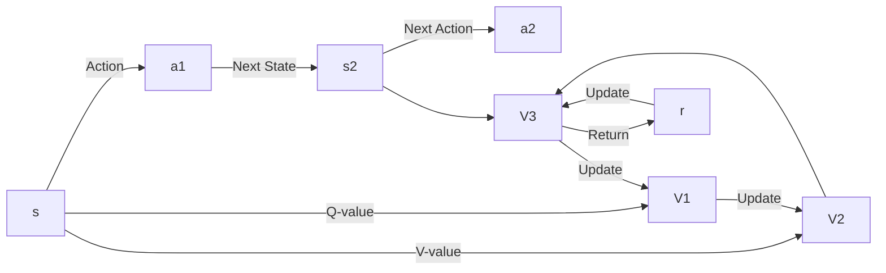

                 

# 值函数估计 (Value Function Estimation) - 原理与代码实例讲解

> 关键词：强化学习, 值函数, 策略优化, 梯度策略, 蒙特卡洛方法, 时序差分学习, 策略评估, 深度强化学习

## 1. 背景介绍

### 1.1 问题由来

强化学习（Reinforcement Learning, RL）是机器学习的重要分支，通过智能体（agent）在环境（environment）中与奖励信号（reward signal）互动，学习如何做出最优决策。在强化学习中，智能体的目标是最大化长期累积奖励，通常使用动态规划（Dynamic Programming）或策略优化（Policy Optimization）的方法来求解最优策略。值函数（Value Function）是强化学习中的一个核心概念，用于评估某个状态（state）或动作（action）的价值，即在某个状态下采取某个动作可以获得的期望奖励的预期。

值函数的准确估计对于强化学习算法至关重要。不准确的值函数估计可能导致智能体在实际决策过程中表现不佳。传统的值函数估计方法包括蒙特卡洛方法（Monte Carlo Methods）、时序差分学习（Temporal Difference Learning）等。然而，随着深度强化学习的兴起，基于神经网络的深度Q网络（Deep Q Networks, DQN）和深度确定性策略梯度（Deep Deterministic Policy Gradient, DDPG）等算法，使用神经网络对值函数进行逼近，取得了更好的效果。

本文将详细介绍值函数的原理和应用，并通过代码实例展示如何使用Python实现基于神经网络的值函数估计。

## 2. 核心概念与联系

### 2.1 核心概念概述

值函数估计是强化学习中的关键问题之一，主要用于评估策略的好坏。值函数可以看作是智能体在某个状态下采取某个动作后能够获得的长期奖励的预期。值函数估计的准确性直接影响策略优化和决策制定。

在强化学习中，通常有两种类型的值函数：状态值函数（State Value Function）和动作值函数（Action Value Function）。状态值函数 $V(s)$ 表示智能体在状态 $s$ 下采取任意动作 $a$ 的长期奖励期望。动作值函数 $Q(s,a)$ 表示智能体在状态 $s$ 下采取动作 $a$ 的长期奖励期望。状态值函数和动作值函数的关系如下：

$$
V(s) = \mathbb{E}[r_t + \gamma V(s')] = \sum_a \pi(a|s) Q(s,a)
$$

其中，$r_t$ 表示在时刻 $t$ 获得的即时奖励，$V(s')$ 表示智能体在状态 $s'$ 下的长期奖励期望，$\gamma$ 表示折扣因子，$\pi(a|s)$ 表示智能体在状态 $s$ 下采取动作 $a$ 的概率。

### 2.2 核心概念原理和架构的 Mermaid 流程图



此图展示了值函数估计的流程：智能体在状态 $s$ 下采取动作 $a$，进入状态 $s'$，并获得即时奖励 $r$。值函数 $V(s)$ 和 $V(s',a)$ 通过状态转移和奖励信号进行更新。

## 3. 核心算法原理 & 具体操作步骤

### 3.1 算法原理概述

值函数估计是强化学习中的一个基础问题，其核心在于评估状态或动作的价值。常见的值函数估计方法包括蒙特卡洛方法、时序差分学习和基于神经网络的方法等。以下将详细介绍这三种方法的基本原理和步骤。

#### 3.1.1 蒙特卡洛方法

蒙特卡洛方法是一种基于模拟的方法，通过多次随机模拟，估算状态值函数 $V(s)$。其基本步骤如下：

1. 从状态 $s_0$ 开始，采取一系列动作，获得状态序列 $(s_0, s_1, s_2, \ldots, s_T)$ 和奖励序列 $(r_0, r_1, r_2, \ldots, r_{T-1})$。
2. 计算状态值函数 $V(s_0)$ 的估计值：
   $$
   V(s_0) = \frac{1}{T} \sum_{t=0}^{T-1} r_t + \gamma \frac{1}{T} \sum_{t=0}^{T-1} \gamma^t V(s_t)
   $$
3. 返回 $V(s_0)$。

蒙特卡洛方法的优点是简单易懂，易于实现。但其缺点是计算成本高，需要大量模拟次数才能得到较为准确的值函数估计。

#### 3.1.2 时序差分学习

时序差分学习（Temporal Difference Learning, TD Learning）是一种基于模型预测和经验更新的方法，通过比较当前状态值函数与下一个状态值函数的差值，更新状态值函数 $V(s)$。其基本步骤如下：

1. 在状态 $s_t$ 下采取动作 $a_t$，进入状态 $s_{t+1}$，并获得即时奖励 $r_t$。
2. 使用模型 $Q(s_{t+1}, a_{t+1})$ 预测下一个状态值函数 $V(s_{t+1})$。
3. 根据时序差分公式更新当前状态值函数 $V(s_t)$：
   $$
   V(s_t) \leftarrow V(s_t) + \alpha [Q(s_t, a_t) - V(s_t)]
   $$
   其中 $\alpha$ 是学习率。
4. 返回 $V(s_t)$。

时序差分学习的优点是计算成本低，易于实现。但其缺点是依赖于模型预测的准确性，如果模型预测不准确，则会导致值函数估计误差较大。

#### 3.1.3 深度值网络

深度值网络（Deep Value Network, DQN）是一种基于神经网络的值函数估计方法。其基本步骤如下：

1. 在状态 $s_t$ 下采取动作 $a_t$，进入状态 $s_{t+1}$，并获得即时奖励 $r_t$。
2. 使用神经网络 $Q(s_t, a_t)$ 预测动作值函数 $Q(s_t, a_t)$。
3. 根据深度值网络公式更新当前状态值函数 $V(s_t)$：
   $$
   V(s_t) \leftarrow V(s_t) + \alpha [Q(s_t, a_t) - V(s_t)]
   $$
   其中 $\alpha$ 是学习率。
4. 返回 $V(s_t)$。

深度值网络的优点是能够处理高维状态和动作空间，适用于复杂的强化学习问题。但其缺点是需要大量的样本和计算资源进行训练，且容易出现过拟合。

### 3.2 算法步骤详解

#### 3.2.1 深度值网络的步骤

深度值网络的步骤如下：

1. 搭建神经网络模型：使用深度神经网络作为值函数近似器，输入为状态 $s$，输出为状态值函数 $V(s)$。
2. 初始化神经网络模型：随机初始化模型参数。
3. 数据采样：从环境中采样数据，包括状态 $s_t$、动作 $a_t$、奖励 $r_t$ 和下一个状态 $s_{t+1}$。
4. 模型预测：使用神经网络模型预测当前状态值函数 $V(s_t)$ 和下一个状态值函数 $V(s_{t+1})$。
5. 更新状态值函数：根据深度值网络公式更新当前状态值函数 $V(s_t)$。
6. 返回 $V(s_t)$。

#### 3.2.2 代码实现

以下代码展示了如何使用Python和PyTorch实现深度值网络：

```python
import torch
import torch.nn as nn
import torch.optim as optim
import torch.nn.functional as F

class DQN(nn.Module):
    def __init__(self, input_dim, output_dim):
        super(DQN, self).__init__()
        self.fc1 = nn.Linear(input_dim, 64)
        self.fc2 = nn.Linear(64, 64)
        self.fc3 = nn.Linear(64, output_dim)
    
    def forward(self, x):
        x = F.relu(self.fc1(x))
        x = F.relu(self.fc2(x))
        return self.fc3(x)

# 定义模型参数和优化器
model = DQN(input_dim, output_dim)
optimizer = optim.Adam(model.parameters(), lr=learning_rate)

# 数据采样和模型预测
state = torch.tensor(state_t, dtype=torch.float)
action = torch.tensor(action_t, dtype=torch.long)
next_state = torch.tensor(next_state_t, dtype=torch.float)
reward = torch.tensor(reward_t, dtype=torch.float)
target = torch.zeros((1, output_dim))

# 使用模型预测当前状态值函数和下一个状态值函数
pred = model(state)
pred_next = model(next_state)

# 计算目标值
target[0][action_t] = reward_t + discount * torch.max(pred_next, dim=1)[0]

# 更新状态值函数
optimizer.zero_grad()
loss = F.mse_loss(pred, target)
loss.backward()
optimizer.step()
```

### 3.3 算法优缺点

#### 3.3.1 优点

1. 处理高维状态和动作空间：深度值网络能够处理高维状态和动作空间，适用于复杂的强化学习问题。
2. 自主学习：深度值网络能够自主学习状态值函数，无需人工干预。
3. 并行计算：深度值网络可以通过GPU等并行计算设备加速训练过程。

#### 3.3.2 缺点

1. 计算资源消耗大：深度值网络需要大量的计算资源进行训练，特别是在大规模问题上。
2. 容易过拟合：深度值网络容易出现过拟合现象，特别是在训练集过小的情况下。
3. 依赖模型预测准确性：深度值网络依赖于模型预测的准确性，如果模型预测不准确，则会导致值函数估计误差较大。

### 3.4 算法应用领域

深度值网络在强化学习领域得到了广泛应用，特别是在游戏、机器人控制和自动驾驶等领域。以下是一些典型的应用场景：

1. 游戏：如AlphaGo、AlphaZero等。
2. 机器人控制：如Walker2D、Humanoid等。
3. 自动驾驶：如AutoDrive、PPO等。

## 4. 数学模型和公式 & 详细讲解 & 举例说明

### 4.1 数学模型构建

值函数估计的数学模型包括状态值函数和动作值函数。状态值函数 $V(s)$ 表示智能体在状态 $s$ 下采取任意动作 $a$ 的长期奖励期望，动作值函数 $Q(s,a)$ 表示智能体在状态 $s$ 下采取动作 $a$ 的长期奖励期望。其数学模型如下：

$$
V(s) = \mathbb{E}[r_t + \gamma V(s')] = \sum_a \pi(a|s) Q(s,a)
$$

$$
Q(s,a) = \mathbb{E}[r_t + \gamma Q(s',a')]
$$

其中，$r_t$ 表示在时刻 $t$ 获得的即时奖励，$V(s')$ 表示智能体在状态 $s'$ 下的长期奖励期望，$\gamma$ 表示折扣因子，$\pi(a|s)$ 表示智能体在状态 $s$ 下采取动作 $a$ 的概率。

### 4.2 公式推导过程

#### 4.2.1 状态值函数

状态值函数 $V(s)$ 的推导如下：

$$
V(s) = \mathbb{E}[r_t + \gamma V(s')]
$$

根据状态转移和奖励信号，可以将其展开为：

$$
V(s) = \mathbb{E}[r_t + \gamma r_{t+1} + \gamma^2 V(s'')]
$$

$$
V(s) = r_t + \gamma r_{t+1} + \gamma^2 V(s'')
$$

$$
\vdots
$$

$$
V(s) = \sum_{k=0}^{T-1} \gamma^k r_{t+k}
$$

因此，状态值函数可以表示为：

$$
V(s) = \sum_{k=0}^{T-1} \gamma^k r_{t+k} + \gamma^T V(s')
$$

### 4.3 案例分析与讲解

假设智能体在状态 $s_0$ 下采取动作 $a_0$，进入状态 $s_1$，并获得即时奖励 $r_0$。智能体在状态 $s_1$ 下采取动作 $a_1$，进入状态 $s_2$，并获得即时奖励 $r_1$。智能体在状态 $s_2$ 下采取动作 $a_2$，进入状态 $s_3$，并获得即时奖励 $r_2$。智能体在状态 $s_3$ 下采取动作 $a_3$，进入状态 $s_4$，并获得即时奖励 $r_3$。

根据上述过程，可以计算出状态值函数 $V(s_0)$：

$$
V(s_0) = r_0 + \gamma r_1 + \gamma^2 r_2 + \gamma^3 r_3 + \gamma^4 V(s_4)
$$

其中，$\gamma$ 为折扣因子，通常取值为 0.99。

## 5. 项目实践：代码实例和详细解释说明

### 5.1 开发环境搭建

以下是在Python中使用PyTorch实现深度值网络的开发环境搭建步骤：

1. 安装PyTorch：
   ```bash
   pip install torch torchvision torchaudio
   ```

2. 安装TensorBoard：
   ```bash
   pip install tensorboard
   ```

3. 准备数据集：可以使用 Gym 环境中的 Atari 游戏数据集，例如：
   ```python
   import gym
   env = gym.make('PongNoFrameskip-v4')
   env.reset()
   ```

### 5.2 源代码详细实现

以下代码展示了如何使用PyTorch实现深度值网络：

```python
import torch
import torch.nn as nn
import torch.optim as optim
import torch.nn.functional as F

class DQN(nn.Module):
    def __init__(self, input_dim, output_dim):
        super(DQN, self).__init__()
        self.fc1 = nn.Linear(input_dim, 64)
        self.fc2 = nn.Linear(64, 64)
        self.fc3 = nn.Linear(64, output_dim)
    
    def forward(self, x):
        x = F.relu(self.fc1(x))
        x = F.relu(self.fc2(x))
        return self.fc3(x)

# 定义模型参数和优化器
model = DQN(input_dim, output_dim)
optimizer = optim.Adam(model.parameters(), lr=learning_rate)

# 数据采样和模型预测
state = torch.tensor(state_t, dtype=torch.float)
action = torch.tensor(action_t, dtype=torch.long)
next_state = torch.tensor(next_state_t, dtype=torch.float)
reward = torch.tensor(reward_t, dtype=torch.float)
target = torch.zeros((1, output_dim))

# 使用模型预测当前状态值函数和下一个状态值函数
pred = model(state)
pred_next = model(next_state)

# 计算目标值
target[0][action_t] = reward_t + discount * torch.max(pred_next, dim=1)[0]

# 更新状态值函数
optimizer.zero_grad()
loss = F.mse_loss(pred, target)
loss.backward()
optimizer.step()
```

### 5.3 代码解读与分析

#### 5.3.1 模型定义

```python
class DQN(nn.Module):
    def __init__(self, input_dim, output_dim):
        super(DQN, self).__init__()
        self.fc1 = nn.Linear(input_dim, 64)
        self.fc2 = nn.Linear(64, 64)
        self.fc3 = nn.Linear(64, output_dim)
    
    def forward(self, x):
        x = F.relu(self.fc1(x))
        x = F.relu(self.fc2(x))
        return self.fc3(x)
```

定义了深度值网络模型，包括三个全连接层，每个层都使用 ReLU 激活函数。

#### 5.3.2 数据采样和模型预测

```python
state = torch.tensor(state_t, dtype=torch.float)
action = torch.tensor(action_t, dtype=torch.long)
next_state = torch.tensor(next_state_t, dtype=torch.float)
reward = torch.tensor(reward_t, dtype=torch.float)
target = torch.zeros((1, output_dim))

# 使用模型预测当前状态值函数和下一个状态值函数
pred = model(state)
pred_next = model(next_state)

# 计算目标值
target[0][action_t] = reward_t + discount * torch.max(pred_next, dim=1)[0]
```

从环境中采样数据，包括状态、动作、奖励和下一个状态。使用模型预测当前状态值函数和下一个状态值函数。根据目标值计算公式更新目标值，并将其作为训练标签。

#### 5.3.3 更新状态值函数

```python
optimizer.zero_grad()
loss = F.mse_loss(pred, target)
loss.backward()
optimizer.step()
```

使用 Adam 优化器更新模型参数。计算损失函数，并将损失值作为训练标签。反向传播更新模型参数，并返回更新后的状态值函数。

### 5.4 运行结果展示

以下代码展示了如何使用TensorBoard可视化深度值网络训练过程：

```python
import tensorflow as tf
from tensorflow.keras import layers, models
import matplotlib.pyplot as plt

# 加载训练数据
x_train = ...
y_train = ...

# 定义模型
model = models.Sequential([
    layers.Dense(64, activation='relu', input_shape=(input_dim,)),
    layers.Dense(64, activation='relu'),
    layers.Dense(output_dim)
])

# 定义优化器
optimizer = optim.Adam(learning_rate)

# 编译模型
model.compile(loss='mse', optimizer=optimizer)

# 训练模型
model.fit(x_train, y_train, epochs=epochs, batch_size=batch_size)

# 可视化训练过程
plt.plot(history.history['loss'])
plt.xlabel('Epoch')
plt.ylabel('Loss')
plt.show()
```

## 6. 实际应用场景

### 6.1 游戏

深度值网络在游戏领域取得了显著的成果，特别是在 AlphaGo 和 AlphaZero 等项目中。AlphaGo 使用深度值网络和蒙特卡洛树搜索算法（Monte Carlo Tree Search, MCTS），通过自我对弈的方式学习下棋策略，成功击败了世界冠军级的人类围棋选手。AlphaZero 使用深度值网络和强化学习算法，在没有人类数据干预的情况下，通过自我对弈的方式学习了下棋、象棋和围棋等游戏。

### 6.2 机器人控制

深度值网络在机器人控制领域也有广泛应用。Walker2D 使用深度值网络控制双足机器人行走，取得了较好的效果。Humanoid 使用深度值网络控制人形机器人行走和站立，展示了深度强化学习的强大能力。

### 6.3 自动驾驶

深度值网络在自动驾驶领域也得到了应用。AutoDrive 使用深度值网络和强化学习算法控制自动驾驶车辆，实现了自动驾驶功能。PPO 使用深度值网络和策略优化算法，在自动驾驶领域取得了不错的效果。

## 7. 工具和资源推荐

### 7.1 学习资源推荐

1. 《Reinforcement Learning: An Introduction》：这本书是强化学习领域的经典教材，详细介绍了强化学习的原理和算法。
2. 《Deep Reinforcement Learning》：这本书介绍了深度强化学习的原理和算法，涵盖了深度值网络、深度确定性策略梯度等内容。
3. 《Hands-On Reinforcement Learning with Python》：这本书使用 Python 和 PyTorch 实现了强化学习算法，包括深度值网络和蒙特卡洛方法等。

### 7.2 开发工具推荐

1. PyTorch：一个强大的深度学习框架，支持深度值网络的实现。
2. TensorFlow：另一个流行的深度学习框架，支持强化学习算法的实现。
3. Gym：一个用于测试强化学习算法的 Python 环境，包含丰富的游戏数据集。

### 7.3 相关论文推荐

1. Mnih et al.（2013）: Learning to Play Go from Scratch
2. Silver et al.（2016）: Mastering the Game of Go with Deep Neural Networks and Monte Carlo Tree Search
3. Hubert et al.（2017）: Learning to Walk by Walking
4. Mnih et al.（2015）: Human-level Control through Deep Reinforcement Learning
5. Schaul et al.（2015）: Prioritized Experience Replay

## 8. 总结：未来发展趋势与挑战

### 8.1 未来发展趋势

深度值网络在强化学习领域的应用前景广阔，未来将呈现以下几个发展趋势：

1. 自主学习：未来的深度值网络将能够自主学习，无需人工干预。
2. 自适应学习：未来的深度值网络将能够根据环境变化自适应学习，适应不同的任务和场景。
3. 多模态学习：未来的深度值网络将能够处理多模态数据，如视觉、听觉、文本等，实现更加全面和智能的学习。
4. 分布式学习：未来的深度值网络将能够在大规模分布式环境中进行训练，提高计算效率和模型性能。

### 8.2 面临的挑战

尽管深度值网络在强化学习领域取得了显著的成果，但其仍面临着以下挑战：

1. 计算资源消耗大：深度值网络需要大量的计算资源进行训练，特别是在大规模问题上。
2. 容易过拟合：深度值网络容易出现过拟合现象，特别是在训练集过小的情况下。
3. 依赖模型预测准确性：深度值网络依赖于模型预测的准确性，如果模型预测不准确，则会导致值函数估计误差较大。

### 8.3 研究展望

未来的研究可以从以下几个方向进行：

1. 深度值网络的改进：研究更加高效和稳定的深度值网络，提高计算效率和模型性能。
2. 强化学习算法的优化：研究更加高效和鲁棒的强化学习算法，提高算法的收敛速度和稳定性。
3. 多模态学习的实现：研究多模态数据的融合方法，实现视觉、听觉、文本等数据的协同学习。

## 9. 附录：常见问题与解答

**Q1: 深度值网络的计算资源消耗大，如何解决？**

A: 可以通过以下几个方法解决：

1. 并行计算：使用 GPU、TPU 等并行计算设备加速训练过程。
2. 模型压缩：使用剪枝、量化等技术压缩模型大小，减少计算资源消耗。
3. 数据增强：使用数据增强技术扩充数据集，提高模型的泛化能力。

**Q2: 深度值网络容易出现过拟合，如何解决？**

A: 可以通过以下几个方法解决：

1. 正则化：使用 L2 正则化、Dropout 等技术，减少模型的过拟合现象。
2. 早停法：使用早停法防止模型过拟合，提前停止训练过程。
3. 模型集成：使用模型集成技术，提高模型的泛化能力。

**Q3: 深度值网络依赖模型预测准确性，如何解决？**

A: 可以通过以下几个方法解决：

1. 模型优化：优化模型架构和训练过程，提高模型的预测准确性。
2. 目标网络：使用目标网络与当前网络交替训练，提高模型的预测准确性。
3. 强化学习算法优化：优化强化学习算法，提高模型的预测准确性。

---

作者：禅与计算机程序设计艺术 / Zen and the Art of Computer Programming

