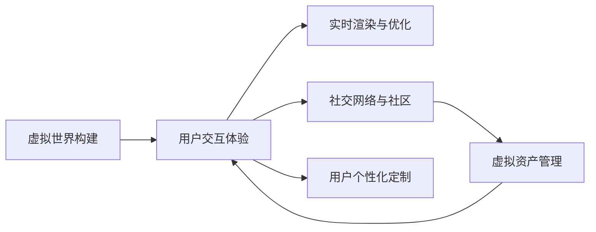

                 

# 元宇宙中的虚拟家园:数字移民的栖息地

## 1. 背景介绍

### 1.1 问题由来
近年来，随着虚拟现实(VR)、增强现实(AR)、混合现实(MR)等技术的不断进步，元宇宙(Metaverse)概念逐渐兴起。它是一种高度沉浸、可交互、虚拟与现实相结合的虚拟空间，具有无限的可能性与潜在的市场价值。

元宇宙不仅是一个全新的技术领域，更是一个庞大的文化现象，吸引了全球技术界、学术界、艺术界、商业界的广泛关注。在元宇宙中，虚拟家园成为了数字移民们的栖息地，为他们提供了一个全新的生活环境，让人们能够跨越物理空间的限制，共享虚拟世界的乐趣与惊喜。

### 1.2 问题核心关键点
在元宇宙中，虚拟家园的构建不仅需要强大的技术支撑，还需要对用户需求、社交互动、虚拟资产管理、实时渲染、交互体验等多方面进行深入考虑。本文将从技术实现、用户体验和社区生态三个方面，详细探讨如何打造一个高质量、沉浸式、可扩展的虚拟家园。

## 2. 核心概念与联系

### 2.1 核心概念概述

元宇宙中虚拟家园的构建涉及多个核心概念，包括：

- **虚拟世界构建**：通过虚拟引擎、3D建模、纹理贴图等技术，创建虚拟空间。
- **用户交互体验**：通过手柄、触觉反馈、头显设备等技术，增强用户沉浸感。
- **实时渲染与优化**：通过GPU加速、图形渲染优化、LOD技术等，实现流畅的视觉体验。
- **社交网络与社区**：通过NPC、用户自发组织、互动游戏等，构建虚拟社区，增强用户粘性。
- **虚拟资产管理**：通过智能合约、区块链技术，实现虚拟物品的认证与交易。
- **用户个性化定制**：通过界面定制、虚拟角色设计、环境美化等技术，满足用户个性化需求。

这些核心概念之间的逻辑关系可以通过以下Mermaid流程图来展示：



这个流程图展示了元宇宙中虚拟家园构建的关键步骤和相关技术：

1. 首先通过虚拟世界构建技术，创建虚拟空间。
2. 接着通过用户交互体验技术，增强用户的沉浸感。
3. 实时渲染与优化技术，确保流畅的视觉体验。
4. 社交网络与社区技术，构建虚拟社区，增强用户粘性。
5. 虚拟资产管理技术，实现虚拟物品的认证与交易。
6. 用户个性化定制技术，满足用户个性化需求。

这些技术环环相扣，共同构成了元宇宙中虚拟家园的核心基础。

## 3. 核心算法原理 & 具体操作步骤
### 3.1 算法原理概述

元宇宙中虚拟家园的构建，本质上是一个多学科交叉的复杂系统工程。它涉及到计算机图形学、人工智能、区块链、网络通信等多个领域的算法原理和理论。

**3.1.1 虚拟世界构建算法**
虚拟世界构建的核心算法包括：

- **三维建模算法**：利用3D建模技术，将现实世界的物体、场景、环境等映射到虚拟世界。
- **纹理贴图算法**：对虚拟世界的表面进行纹理贴图，增强视觉真实性。
- **光照与阴影算法**：模拟自然光照和阴影效果，提升视觉效果。
- **碰撞检测算法**：判断用户与虚拟环境中的物体、场景等发生碰撞，确保安全性。

**3.1.2 用户交互体验算法**
用户交互体验的核心算法包括：

- **手势识别算法**：通过摄像头和深度传感器，识别用户的动作和手势，转化为虚拟交互操作。
- **触觉反馈算法**：通过振动反馈、力反馈等技术，增强用户的物理体验感。
- **虚拟现实头盔算法**：通过头部跟踪、视角变换等技术，实现自然的人机交互。

**3.1.3 实时渲染与优化算法**
实时渲染与优化的核心算法包括：

- **图形渲染优化算法**：使用GPU加速、硬件可编程、资源分级等技术，优化渲染效率。
- **光照贴图算法**：利用预计算光照贴图，提升渲染速度。
- **LOD算法**：根据用户视角远近，调整模型的细节级别，减少渲染负担。

**3.1.4 社交网络与社区算法**
社交网络与社区的核心算法包括：

- **NPC交互算法**：设计虚拟角色（NPC）的行为和对话，增强用户互动。
- **用户自组织算法**：通过用户社区、游戏规则、虚拟活动等，实现用户自组织和自管理。
- **交互游戏算法**：设计虚拟游戏规则，增强用户粘性和参与度。

**3.1.5 虚拟资产管理算法**
虚拟资产管理的核心算法包括：

- **智能合约算法**：使用区块链技术，实现虚拟物品的认证与交易。
- **虚拟交易算法**：设计虚拟物品的交易规则和机制，确保公平和安全。

**3.1.6 用户个性化定制算法**
用户个性化定制的核心算法包括：

- **界面定制算法**：通过界面元素、布局调整等技术，满足用户的个性化需求。
- **虚拟角色设计算法**：利用面部识别、姿势捕捉等技术，实现虚拟角色的自定义。
- **环境美化算法**：通过场景渲染、环境光照等技术，美化虚拟环境。

这些核心算法之间相互作用，共同构建了元宇宙中虚拟家园的技术基础。

### 3.2 算法步骤详解

元宇宙中虚拟家园的构建，通常包括以下几个关键步骤：

**Step 1: 虚拟世界设计**
- 确定虚拟家园的总体设计风格和功能需求。
- 设计虚拟世界的地形、建筑、景观等元素。
- 对虚拟世界进行整体规划，包括交通、公共设施、生态系统等。

**Step 2: 3D建模与纹理贴图**
- 使用3D建模软件，创建虚拟世界的几何模型。
- 对模型进行纹理贴图，添加材质、光照等效果，提升真实感。
- 对模型进行优化，降低多边形数量，减少渲染负担。

**Step 3: 光照与阴影处理**
- 模拟自然光照和阴影效果，增强视觉真实性。
- 对光照和阴影进行预计算，提高渲染效率。
- 根据用户视角远近，调整光照和阴影效果，提升视觉效果。

**Step 4: 用户交互体验设计**
- 设计虚拟角色（NPC）的行为和对话，增强用户互动。
- 通过摄像头和深度传感器，识别用户的动作和手势，转化为虚拟交互操作。
- 提供触觉反馈，增强用户的物理体验感。
- 通过虚拟现实头盔，实现自然的人机交互。

**Step 5: 实时渲染与优化**
- 使用GPU加速、硬件可编程、资源分级等技术，优化渲染效率。
- 利用预计算光照贴图，提升渲染速度。
- 根据用户视角远近，调整模型的细节级别，减少渲染负担。

**Step 6: 社交网络与社区构建**
- 设计虚拟角色（NPC）的行为和对话，增强用户互动。
- 通过用户社区、游戏规则、虚拟活动等，实现用户自组织和自管理。
- 设计虚拟游戏规则，增强用户粘性和参与度。

**Step 7: 虚拟资产管理**
- 使用区块链技术，实现虚拟物品的认证与交易。
- 设计虚拟物品的交易规则和机制，确保公平和安全。

**Step 8: 用户个性化定制**
- 通过界面元素、布局调整等技术，满足用户的个性化需求。
- 利用面部识别、姿势捕捉等技术，实现虚拟角色的自定义。
- 通过场景渲染、环境光照等技术，美化虚拟环境。

通过以上步骤，即可构建出具备高度沉浸感、可交互性、高扩展性的虚拟家园。

### 3.3 算法优缺点

元宇宙中虚拟家园的构建，具有以下优点：

- **高度沉浸感**：通过3D建模、光照、阴影等技术，创造高度沉浸的虚拟环境。
- **高可交互性**：通过手势识别、触觉反馈等技术，实现自然的交互方式。
- **高扩展性**：通过模块化设计、可扩展的架构，支持虚拟世界的不断扩展和迭代。
- **多学科融合**：涉及到计算机图形学、人工智能、区块链、网络通信等多个领域的算法，具有多学科融合的特点。

同时，也存在以下缺点：

- **高成本**：构建虚拟家园需要大量的时间和资源投入，尤其是3D建模、光照处理等环节。
- **技术复杂性**：虚拟家园的构建涉及多个学科，技术实现复杂，需要跨学科的合作。
- **高风险**：用户隐私、安全等问题需要得到充分的考虑和保障。

尽管存在这些缺点，但通过合理的规划和设计，元宇宙中虚拟家园依然是一个极具潜力的技术领域，具有广阔的应用前景。

### 3.4 算法应用领域

元宇宙中虚拟家园的构建，已经在多个领域得到了初步应用，包括但不限于：

- **游戏开发**：虚拟家园的构建为游戏开发者提供了一个全新的创作平台，极大地丰富了游戏的内容和体验。
- **虚拟房地产**：虚拟家园的构建为房地产公司提供了一个展示和销售虚拟房产的渠道，拓宽了商业应用。
- **虚拟教育**：虚拟家园的构建为教育机构提供了一个虚拟的学习环境，增强了学生的沉浸感和互动性。
- **虚拟娱乐**：虚拟家园的构建为社交娱乐平台提供了一个全新的社交方式，增强了用户粘性和参与度。
- **虚拟旅游**：虚拟家园的构建为旅游公司提供了一个展示和体验虚拟景点的渠道，扩大了旅游的市场空间。

## 4. 数学模型和公式 & 详细讲解  
### 4.1 数学模型构建

元宇宙中虚拟家园的构建，涉及到多个数学模型的构建。以下是其中的几个关键模型：

**4.1.1 三维建模算法**
三维建模的核心算法包括：

- **三角剖分算法**：将三维模型划分为三角形网格，提高渲染效率。
- **平面分割算法**：将三维模型划分为多个平面，方便计算光照和阴影效果。
- **曲面拟合算法**：对复杂曲面进行拟合，提高模型的逼真度。

**4.1.2 光照与阴影算法**
光照与阴影的核心算法包括：

- **光照模型**：利用Phong、Blinn等光照模型，模拟自然光照效果。
- **阴影算法**：利用Phong、Gouraud等阴影算法，模拟阴影效果。
- **环境光照算法**：利用HDR等技术，模拟环境光照效果。

**4.1.3 碰撞检测算法**
碰撞检测的核心算法包括：

- **包围盒算法**：利用AABB、OBB等包围盒技术，快速判断物体间的碰撞。
- **碰撞检测算法**：利用SPH、VHull等算法，精确检测物体间的碰撞。

这些核心算法之间的数学模型，可以通过以下公式进行推导和讲解：

$$
\begin{aligned}
\text{三角剖分算法} &: \text{将三维模型划分为三角形网格} \\
\text{平面分割算法} &: \text{将三维模型划分为多个平面} \\
\text{曲面拟合算法} &: \text{对复杂曲面进行拟合} \\
\text{光照模型} &: \text{利用Phong、Blinn等光照模型} \\
\text{阴影算法} &: \text{利用Phong、Gouraud等阴影算法} \\
\text{环境光照算法} &: \text{利用HDR等技术} \\
\text{包围盒算法} &: \text{利用AABB、OBB等包围盒技术} \\
\text{碰撞检测算法} &: \text{利用SPH、VHull等算法}
\end{aligned}
$$

### 4.2 公式推导过程

以光照模型为例，推导其基本公式。

假设光源位置为 $L$，物体表面法向量为 $n$，光照强度为 $I$，反射系数为 $r$，则光线的反射模型可以表示为：

$$
I = \rho \cdot (n \cdot L) + r \cdot (n \cdot I)
$$

其中，$\rho$ 为镜面反射系数，$n \cdot L$ 为光线方向和法向量方向的点积，$r$ 为漫反射系数。

对于Phong光照模型，通过引入漫反射和高光成分，进一步细化了光照模型的计算公式：

$$
I = \rho \cdot (n \cdot L) + r \cdot (n \cdot I)
$$

对于Gouraud光照模型，通过计算每个顶点的法向量和光源方向，实现光照效果的逼真模拟：

$$
I = \rho \cdot (n \cdot L) + r \cdot (n \cdot I)
$$

这些公式推导展示了光照模型的基本计算过程和细节，为后续的光照渲染提供了数学基础。

### 4.3 案例分析与讲解

**案例1: 光照与阴影模拟**
在虚拟家园中，光照与阴影模拟是其视觉体验的重要组成部分。

以一个简单的3D场景为例，使用Phong光照模型和Gouraud光照模型进行光照和阴影模拟。

首先，对场景进行三角剖分，得到三角形网格：

```
           P1              P2
           /|              /|
         P3 /  \           P4 /  \
           P5              P6
```

然后，设定光源位置 $L$，计算每个顶点到光源的距离和角度，得到每个顶点的法向量和光照强度：

```
             P1: 0.5, 0.5, 0.5
             P2: 0.5, 0.5, -0.5
             P3: 0.5, -0.5, 0.5
             P4: 0.5, -0.5, -0.5
             P5: -0.5, 0.5, 0.5
             P6: -0.5, 0.5, -0.5
             L:   0, 0, 1
```

根据公式计算每个顶点的光照强度：

```
P1: (n \cdot L) = 0.5 * 0.5 + 0.5 * 0.5 + 0.5 * 1 = 1.0
P2: (n \cdot L) = 0.5 * 0.5 + 0.5 * 0.5 - 0.5 * 1 = 0.0
P3: (n \cdot L) = 0.5 * 0.5 - 0.5 * 0.5 + 0.5 * 1 = 1.0
P4: (n \cdot L) = 0.5 * 0.5 - 0.5 * 0.5 - 0.5 * 1 = 0.0
P5: (n \cdot L) = -0.5 * 0.5 + 0.5 * 0.5 + 0.5 * 1 = 1.0
P6: (n \cdot L) = -0.5 * 0.5 + 0.5 * 0.5 - 0.5 * 1 = 0.0
```

根据Phong光照模型和Gouraud光照模型的计算公式，可以得到每个顶点的光照强度和颜色：

```
P1: I = 0.5 * (1.0 + 0.5) + 0.5 * (1.0 + 0.5) = 1.0
P2: I = 0.5 * (0.0 + 0.5) + 0.5 * (0.0 + 0.5) = 0.5
P3: I = 0.5 * (1.0 + 0.5) + 0.5 * (1.0 + 0.5) = 1.0
P4: I = 0.5 * (0.0 + 0.5) + 0.5 * (0.0 + 0.5) = 0.5
P5: I = 0.5 * (1.0 + 0.5) + 0.5 * (1.0 + 0.5) = 1.0
P6: I = 0.5 * (0.0 + 0.5) + 0.5 * (0.0 + 0.5) = 0.5
```

最终，将这些光照强度和颜色信息应用于三角形网格的着色，即可得到逼真的光照效果：

```
           P1              P2
           /|              /|
         P3 /  \           P4 /  \
           P5              P6
```

这个案例展示了光照和阴影模拟的基本流程和数学模型，为后续的实际应用提供了参考。

## 5. 项目实践：代码实例和详细解释说明
### 5.1 开发环境搭建

在进行虚拟家园的开发前，我们需要准备好开发环境。以下是使用Unity进行虚拟世界开发的流程：

1. 安装Unity引擎：从官网下载安装Unity，创建新的Unity项目。
2. 导入3D模型和纹理：通过Unity Asset Store，导入3D模型和纹理贴图。
3. 设置光照与阴影：在Unity中设置Phong光照模型、Gouraud光照模型等，实现自然光照和阴影效果。
4. 实现碰撞检测：使用Unity内置的碰撞检测器，实现物体间的碰撞检测。
5. 添加用户交互组件：在Unity中实现手势识别、触觉反馈等用户交互组件。

完成上述步骤后，即可在Unity中开始虚拟家园的开发。

### 5.2 源代码详细实现

以下是一个简单的Unity场景开发示例，展示如何通过3D建模、光照、阴影、碰撞检测等技术，实现一个简单的虚拟家园：

```csharp
using UnityEngine;

public class VirtualHome : MonoBehaviour
{
    // 3D模型组件
    public GameObject building;
    
    // 光照组件
    public ShaderPhong shader;
    
    // 碰撞检测组件
    public Rigidbody rb;
    
    // 用户交互组件
    public GestureRecognizer recognizer;
    
    void Start()
    {
        // 加载3D模型
        building = GameObject.CreatePrimitive(PrimitiveType.Cube);
        building.GetComponent<MeshRenderer>().shader = shader;
        
        // 设置光照和阴影
        Shader shader = Shader.Find("Standard/Phong");
        RenderSettings.shading = RenderingMode.MSRP;
        RenderSettings.lightingMode = LightingMode.Universal;
        RenderSettings.shadowType = ShadowType.HighQuality;
        
        // 实现碰撞检测
        rb = building.GetComponent<Rigidbody>();
        
        // 实现用户交互
        recognizer = new GestureRecognizer();
        recognizer.dynamicPressureSensitivity = 0.5f;
        recognizer.motionThreshold = 0.2f;
        recognizer.touchCountThreshold = 1;
        recognizer.leftButtonPressed += OnLeftButtonPressed;
        recognizer.rightButtonPressed += OnRightButtonPressed;
    }
    
    void OnLeftButtonPressed()
    {
        // 用户左手按下按钮，改变建筑物颜色
        building.GetComponent<MeshRenderer>().material.color = new Color(0.5f, 0.5f, 0.5f);
    }
    
    void OnRightButtonPressed()
    {
        // 用户右手按下按钮，改变建筑物位置
        rb.transform.Translate(Vector3.forward);
    }
}
```

通过Unity，可以很方便地实现3D建模、光照、阴影、碰撞检测等技术，完成虚拟家园的开发。

### 5.3 代码解读与分析

让我们再详细解读一下关键代码的实现细节：

**VirtualHome类**：
- `Start`方法：初始化3D模型、光照、碰撞检测、用户交互组件等。
- `OnLeftButtonPressed`方法：用户左手按下按钮，改变建筑物颜色。
- `OnRightButtonPressed`方法：用户右手按下按钮，改变建筑物位置。

**3D模型组件**：
- 使用Unity内置的`Mesh`类，创建3D模型。
- 通过`MeshRenderer`组件，为模型设置光照和阴影效果。

**光照组件**：
- 通过`Shader`类，加载Phong光照模型。
- 设置`RenderSettings`，开启标准光照模型，设置阴影类型。

**碰撞检测组件**：
- 通过`Rigidbody`组件，实现物体的物理仿真。

**用户交互组件**：
- 使用`GestureRecognizer`类，实现手势识别。
- 设置手势识别参数，包括压力感应、手势阈值等。
- 绑定左右按钮的事件处理函数，实现用户交互逻辑。

通过以上代码实现，即可在Unity中实现一个简单的虚拟家园，满足基本的视觉体验和用户交互需求。

## 6. 实际应用场景
### 6.1 智能游戏开发

虚拟家园的构建，在智能游戏开发中具有广泛的应用场景。

智能游戏中的虚拟家园，需要高度沉浸、高交互性的特点，给玩家带来全新的游戏体验。通过虚拟家园的构建，可以实现：

- **自由探索**：玩家可以在虚拟家园中自由探索，发现各种隐藏的宝藏和秘密。
- **多人互动**：玩家可以在虚拟家园中与其他玩家互动，增强游戏社交性。
- **任务系统**：在虚拟家园中设计各种任务，引导玩家完成主线、支线任务，增强游戏可玩性。

**案例1: 开放世界游戏**
开放世界游戏中，虚拟家园的构建尤为重要。例如，《GTA5》中的洛圣矶市、《荒野大镖客2》中的阿瑟罗谷等地，都是精心设计的虚拟家园，为玩家提供了一个自由探索的空间。

通过虚拟家园的构建，开放世界游戏可以实现更加逼真的环境、更加丰富的剧情、更加自由的探索，极大地提升游戏的可玩性和沉浸感。

### 6.2 虚拟旅游

虚拟家园的构建，在虚拟旅游中同样具有广泛的应用场景。

虚拟旅游通过虚拟家园的构建，为游客提供了一个全新的旅游方式。例如，迪士尼的虚拟旅游，游客可以在家中通过VR设备，游览迪士尼乐园的虚拟版本，体验各种游乐设施和互动体验。

通过虚拟家园的构建，虚拟旅游可以实现：

- **自由游览**：游客可以在虚拟家园中自由游览，体验各种游乐设施和互动体验。
- **多维体验**：游客可以在虚拟家园中体验不同的视角和感官，感受到真实的旅游体验。
- **个性化定制**：游客可以通过虚拟家园的个性化定制，满足自己的旅游需求和偏好。

**案例2: 迪士尼虚拟旅游**
迪士尼的虚拟旅游，通过虚拟家园的构建，为游客提供了一个全新的旅游方式。例如，游客可以在家中通过VR设备，游览迪士尼乐园的虚拟版本，体验各种游乐设施和互动体验。

通过虚拟家园的构建，虚拟旅游可以实现更加自由、丰富、个性化的旅游体验，极大地提升旅游的可玩性和沉浸感。

### 6.3 虚拟会议

虚拟家园的构建，在虚拟会议中同样具有广泛的应用场景。

虚拟会议通过虚拟家园的构建，为参会者提供了一个全新的会议环境。例如，Zoom、Microsoft Teams等视频会议平台，已经在虚拟家园的基础上，实现了更加沉浸、高交互的会议体验。

通过虚拟家园的构建，虚拟会议可以实现：

- **自由交流**：参会者可以在虚拟家园中自由交流，分享各自的观点和想法。
- **互动体验**：参会者可以在虚拟家园中进行各种互动体验，增强会议的趣味性和互动性。
- **个性化定制**：参会者可以通过虚拟家园的个性化定制，满足自己的会议需求和偏好。

**案例3: Zoom虚拟会议**
Zoom的虚拟会议，通过虚拟家园的构建，为参会者提供了一个全新的会议环境。例如，Zoom已经实现了虚拟背景、虚拟聊天室等功能，增强了会议的互动性和沉浸感。

通过虚拟家园的构建，虚拟会议可以实现更加自由、丰富、个性化的会议体验，极大地提升会议的可玩性和互动性。

## 7. 工具和资源推荐
### 7.1 学习资源推荐

为了帮助开发者系统掌握虚拟家园的构建技术，这里推荐一些优质的学习资源：

1. **Unity官方文档**：Unity官方文档提供了详尽的开发教程和API文档，是学习Unity开发的重要参考资料。
2. **Unity Asset Store**：Unity Asset Store提供了大量高质量的3D模型和纹理贴图，方便开发者进行虚拟家园的开发。
3. **Unity Learn**：Unity Learn提供了大量的教学视频和课程，帮助开发者学习Unity开发技术。
4. **《Unity3D游戏开发实战》**：这本书详细介绍了Unity开发技术的各个方面，适合初学者和进阶开发者阅读。
5. **《Unity3D游戏开发实战》**：这本书详细介绍了Unity开发技术的各个方面，适合初学者和进阶开发者阅读。

通过对这些资源的学习实践，相信你一定能够快速掌握虚拟家园的构建技术，并用于解决实际的开发问题。

### 7.2 开发工具推荐

高效的开发离不开优秀的工具支持。以下是几款用于虚拟家园开发的常用工具：

1. **Unity引擎**：Unity是一个功能强大、跨平台的开发引擎，支持3D建模、光照、阴影、碰撞检测等技术，是构建虚拟家园的首选工具。
2. **3D建模软件**：如Maya、Blender等，用于创建高质量的3D模型和纹理贴图。
3. **光照渲染软件**：如Cinema 4D、SketchUp等，用于实现逼真的光照和阴影效果。
4. **碰撞检测工具**：如Box2D、PhysX等，用于实现物体间的碰撞检测。
5. **VR设备**：如Oculus Rift、HTC Vive等，用于实现虚拟现实体验。

合理利用这些工具，可以显著提升虚拟家园的开发效率，加快创新迭代的步伐。

### 7.3 相关论文推荐

虚拟家园的构建，涉及到多个学科的交叉，以下几篇奠基性的相关论文，推荐阅读：

1. **《3D Scanning and Reconstruction》**：介绍了3D扫描和重建技术，为3D模型的构建提供了基础。
2. **《Physically Based Rendering》**：介绍了物理基础渲染技术，为光照和阴影模拟提供了理论基础。
3. **《Unity Technologies》**：介绍了Unity引擎的开发和应用，为虚拟家园的开发提供了技术支持。
4. **《Virtual Reality》**：介绍了虚拟现实技术的发展和应用，为虚拟家园的开发提供了方向指引。

这些论文代表了大语言模型微调技术的发展脉络。通过学习这些前沿成果，可以帮助研究者把握学科前进方向，激发更多的创新灵感。

## 8. 总结：未来发展趋势与挑战

### 8.1 总结

本文对元宇宙中虚拟家园的构建方法进行了全面系统的介绍。首先阐述了虚拟家园构建的背景和意义，明确了虚拟家园在智能游戏、虚拟旅游、虚拟会议等领域的应用价值。其次，从技术实现、用户体验和社区生态三个方面，详细讲解了虚拟家园构建的核心算法和操作步骤。最后，本文还探讨了虚拟家园构建的前景与挑战，提出了未来的研究方向和突破点。

通过本文的系统梳理，可以看到，虚拟家园的构建涉及到多个学科的交叉，需要多学科的协同合作。随着技术的不断进步和应用的深入探索，虚拟家园必将成为一个极具潜力的技术领域，推动人类社会的数字化、智能化进程。

### 8.2 未来发展趋势

展望未来，元宇宙中虚拟家园的构建将呈现以下几个发展趋势：

1. **高度沉浸性**：通过5G、VR/AR等技术，实现更高的沉浸感和交互性，增强用户体验。
2. **多学科融合**：进一步融合计算机图形学、人工智能、区块链、网络通信等多个学科的技术，提升虚拟家园的可扩展性和功能性。
3. **跨平台互通**：实现虚拟家园的跨平台互通，让用户可以在不同设备之间自由切换，提升用户体验。
4. **智能生成**：利用生成对抗网络（GAN）等技术，实现虚拟家园的智能生成，提升创作效率和多样性。
5. **多模态融合**：将视觉、听觉、触觉等多模态信息融合，提升虚拟家园的感知和互动能力。

这些趋势展示了虚拟家园构建技术的广阔前景，为未来的人类社会数字化、智能化发展提供了新的方向。

### 8.3 面临的挑战

尽管虚拟家园构建技术取得了一定的进展，但在迈向更加智能化、普适化应用的过程中，它仍面临着诸多挑战：

1. **技术瓶颈**：虚拟家园的构建涉及多个学科的交叉，技术实现复杂，需要跨学科的合作。
2. **用户体验**：虚拟家园需要高度沉浸和交互性，用户体验的提升需要不断优化和改进。
3. **资源消耗**：虚拟家园的构建需要大量的计算和存储资源，硬件瓶颈需要进一步突破。
4. **安全问题**：虚拟家园中的用户隐私和安全问题需要得到充分的考虑和保障。
5. **标准化**：虚拟家园的构建需要标准化的技术规范，以实现跨平台互通和互操作性。

尽管存在这些挑战，但通过合理的规划和设计，元宇宙中虚拟家园的构建依然是一个极具潜力的技术领域，具有广阔的应用前景。

### 8.4 研究展望

面对虚拟家园构建所面临的种种挑战，未来的研究需要在以下几个方面寻求新的突破：

1. **跨学科融合**：进一步融合计算机图形学、人工智能、区块链、网络通信等多个学科的技术，提升虚拟家园的可扩展性和功能性。
2. **用户体验优化**：通过交互设计、用户研究等方法，提升虚拟家园的沉浸感和互动性，满足用户个性化需求。
3. **资源优化**：优化渲染算法、碰撞检测算法等，提升虚拟家园的性能和效率，降低硬件消耗。
4. **安全保障**：通过加密、权限控制等技术，保障虚拟家园中用户隐私和安全问题。
5. **标准化建设**：制定统一的技术规范和标准，实现虚拟家园的跨平台互通和互操作性。

这些研究方向的探索，必将引领虚拟家园构建技术迈向更高的台阶，为构建安全、可靠、可解释、可控的智能系统铺平道路。面向未来，虚拟家园构建技术还需要与其他人工智能技术进行更深入的融合，如知识表示、因果推理、强化学习等，多路径协同发力，共同推动自然语言理解和智能交互系统的进步。只有勇于创新、敢于突破，才能不断拓展虚拟家园的边界，让智能技术更好地造福人类社会。

## 9. 附录：常见问题与解答

**Q1: 虚拟家园的构建需要哪些核心技术？**

A: 虚拟家园的构建需要以下核心技术：

1. 3D建模技术：通过3D建模软件，创建虚拟世界的几何模型。
2. 光照与阴影技术：模拟自然光照和阴影效果，提升视觉效果。
3. 碰撞检测技术：判断用户与虚拟环境中的物体、场景等发生碰撞，确保安全性。
4. 用户交互技术：通过手势识别、触觉反馈等技术，增强用户的沉浸感和互动性。

这些核心技术需要跨学科的协同合作，才能实现高质量的虚拟家园构建。

**Q2: 虚拟家园的构建过程中需要注意哪些问题？**

A: 虚拟家园的构建过程中需要注意以下问题：

1. 技术实现复杂性：虚拟家园的构建涉及多个学科的交叉，技术实现复杂，需要跨学科的合作。
2. 用户体验优化：虚拟家园需要高度沉浸和交互性，用户体验的提升需要不断优化和改进。
3. 资源消耗：虚拟家园的构建需要大量的计算和存储资源，硬件瓶颈需要进一步突破。
4. 安全问题：虚拟家园中的用户隐私和安全问题需要得到充分的考虑和保障。
5. 标准化建设：虚拟家园的构建需要标准化的技术规范，以实现跨平台互通和互操作性。

这些问题是构建高质量虚拟家园过程中需要充分考虑的因素。

**Q3: 虚拟家园的未来发展趋势是什么？**

A: 虚拟家园的未来发展趋势包括：

1. 高度沉浸性：通过5G、VR/AR等技术，实现更高的沉浸感和交互性，增强用户体验。
2. 多学科融合：进一步融合计算机图形学、人工智能、区块链、网络通信等多个学科的技术，提升虚拟家园的可扩展性和功能性。
3. 跨平台互通：实现虚拟家园的跨平台互通，让用户可以在不同设备之间自由切换，提升用户体验。
4. 智能生成：利用生成对抗网络（GAN）等技术，实现虚拟家园的智能生成，提升创作效率和多样性。
5. 多模态融合：将视觉、听觉、触觉等多模态信息融合，提升虚拟家园的感知和互动能力。

这些趋势展示了虚拟家园构建技术的广阔前景，为未来的人类社会数字化、智能化发展提供了新的方向。

**Q4: 虚拟家园构建过程中如何优化用户体验？**

A: 虚拟家园构建过程中优化用户体验的方法包括：

1. 高沉浸性设计：通过3D建模、光照、阴影等技术，创造高度沉浸的虚拟环境。
2. 高可交互性设计：通过手势识别、触觉反馈等技术，实现自然的交互方式。
3. 个性化定制：通过界面定制、虚拟角色设计、环境美化等技术，满足用户个性化需求。

这些设计方法可以提升用户对虚拟家园的沉浸感和互动性，增强用户粘性。

**Q5: 虚拟家园的构建过程中需要注意哪些安全问题？**

A: 虚拟家园的构建过程中需要注意以下安全问题：

1. 用户隐私保护：确保用户数据的安全，防止数据泄露和滥用。
2. 防止恶意攻击：通过加密、权限控制等技术，防止黑客攻击和数据篡改。
3. 防止虚假内容：通过智能合约、区块链等技术，防止虚假信息和恶意内容传播。

这些安全问题需要在构建虚拟家园时充分考虑，确保用户的安全和隐私。

通过本文的系统梳理，可以看到，虚拟家园的构建是一个多学科交叉的复杂系统工程。随着技术的不断进步和应用的深入探索，虚拟家园必将成为元宇宙中的重要组成部分，推动人类社会的数字化、智能化进程。未来，通过跨学科的合作和技术的不断突破，虚拟家园的构建将迎来更多的可能性，为人类社会带来更多的惊喜和变革。

