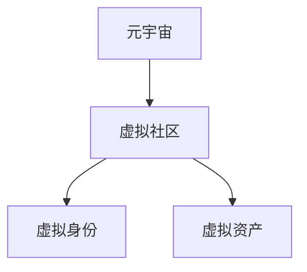

                 

# 元宇宙中的虚拟社区：全球社交网络的新形态

在数字时代，社交网络已不仅仅是人与人之间沟通的桥梁，更是数字身份和虚拟交往的空间。随着技术的进步，社交网络正在迎来一场革命性的变革：元宇宙中的虚拟社区。本文将深入探讨元宇宙社交网络的核心概念、关键技术，以及其在实际应用中的潜在影响和发展趋势。

## 1. 背景介绍

### 1.1 问题的由来

元宇宙的概念最早由尼尔·斯蒂芬森(Neal Stephenson)在其1992年的科幻小说《雪崩》中提出，用以描述一个虚拟现实世界的构想。如今，随着虚拟现实(VR)、增强现实(AR)、混合现实(MR)、区块链、云计算、人工智能等技术的融合发展，元宇宙已经从科幻小说中走入现实，成为全球技术界和产业界的热门话题。

### 1.2 问题核心关键点

元宇宙中的虚拟社区基于虚拟现实和增强现实技术，提供了一个沉浸式的社交空间。用户可以通过虚拟身份进行沟通、互动，甚至参与各种活动。相比于传统的社交网络，元宇宙社交网络在沉浸感、互动性、身份认证和虚拟资产等方面具有显著优势。

- **沉浸感**：通过VR/AR技术，用户可以在虚拟空间中自由移动，感受真实世界的触觉、视觉和听觉反馈。
- **互动性**：用户可以实时进行语音、文字、表情等多种形式的交流，与虚拟环境和实体用户互动。
- **身份认证**：元宇宙社交网络通常使用区块链技术进行身份认证，保证用户身份的真实性、唯一性和不可篡改性。
- **虚拟资产**：用户可以在虚拟空间中购买、交易虚拟物品，形成独特的经济体系。

## 2. 核心概念与联系

### 2.1 核心概念概述

为了更好地理解元宇宙中的虚拟社区，本节将介绍几个关键概念：

- **元宇宙(Metaverse)**：一个由计算机生成、用户可以自由探索和互动的虚拟世界，具有高度的沉浸感和交互性。
- **虚拟社区(Virtual Communities)**：基于元宇宙构建的社交网络，用户可以在其中进行交流、游戏、学习、购物等多种活动。
- **虚拟身份(Virtual Identity)**：用户在虚拟社区中的数字身份，通常由区块链技术保证其真实性和不可篡改性。
- **虚拟资产(Virtual Assets)**：用户可以购买、持有和交易的虚拟物品，如虚拟土地、游戏道具、艺术品等。

这些概念之间的逻辑关系可以通过以下Mermaid流程图来展示：



这个流程图展示了元宇宙中虚拟社区的基本架构：

1. **元宇宙**：作为一个虚拟现实平台，提供用户自由探索的虚拟空间。
2. **虚拟社区**：基于元宇宙构建的社交网络，用户可以在其中进行各种活动。
3. **虚拟身份**：用户在这个虚拟社区中的数字身份，具有唯一性和不可篡改性。
4. **虚拟资产**：用户可以在虚拟社区中购买的虚拟物品，具有经济价值。

## 3. 核心算法原理 & 具体操作步骤
### 3.1 算法原理概述

元宇宙中的虚拟社区，其核心算法原理主要基于虚拟现实和增强现实技术，以及分布式计算和区块链技术。

- **虚拟现实技术(VR)**：通过头戴式显示器和手柄等设备，为用户提供一个沉浸式的虚拟空间，用户可以在其中自由移动和互动。
- **增强现实技术(AR)**：通过智能设备如智能手机或AR眼镜，将虚拟信息叠加到现实世界中，实现虚拟与现实的结合。
- **分布式计算(Distributed Computing)**：通过多个节点协同工作，实现虚拟社区的实时运行和数据同步。
- **区块链技术(Blockchain)**：用于确保用户身份的真实性和不可篡改性，以及虚拟资产的交易安全。

### 3.2 算法步骤详解

构建元宇宙中的虚拟社区，通常包括以下几个关键步骤：

1. **虚拟环境构建**：使用3D建模工具和游戏引擎，创建虚拟场景和虚拟物品，搭建虚拟社区的基础设施。
2. **用户身份认证**：通过区块链技术，实现用户身份的真实性和不可篡改性。
3. **虚拟资产管理**：设计虚拟物品的购买、交易和存储机制，确保虚拟资产的安全和流动性。
4. **分布式网络构建**：搭建分布式计算网络，确保虚拟社区的实时性和稳定性。
5. **社区规则制定**：制定社区行为准则和虚拟物品交易规则，维护虚拟社区的秩序和公平。

### 3.3 算法优缺点

元宇宙中的虚拟社区，其算法具有以下优点：

- **沉浸感和互动性**：通过VR/AR技术，用户可以在虚拟空间中自由移动和互动，增强用户体验。
- **身份认证和安全性**：区块链技术确保用户身份的真实性和不可篡改性，增强社区的安全性。
- **虚拟资产和经济体系**：用户可以购买、持有和交易虚拟物品，形成独特的经济体系。

同时，该算法也存在一些局限性：

- **技术门槛高**：VR/AR、分布式计算和区块链技术都需要高水平的技术支持和大量的资源投入。
- **用户依赖性强**：用户需要具备一定的技术素养，才能在虚拟社区中顺利参与活动。
- **隐私和伦理问题**：虚拟社区中的数据隐私保护和伦理问题，如虚拟物品的归属、使用等，需要进一步研究和规范。

### 3.4 算法应用领域

元宇宙中的虚拟社区，已经在多个领域得到应用，涵盖了教育、娱乐、商业、医疗等多个方面。

- **教育**：通过虚拟教室和实验室，学生可以在虚拟环境中进行互动学习，提高学习效果。
- **娱乐**：虚拟游戏、虚拟演唱会和虚拟旅游，为用户提供丰富的娱乐体验。
- **商业**：虚拟展会、虚拟商品展示和虚拟商品交易，为企业提供新的营销渠道。
- **医疗**：虚拟医疗咨询、虚拟手术和虚拟康复训练，为患者提供更好的医疗服务。

## 4. 数学模型和公式 & 详细讲解 & 举例说明

### 4.1 数学模型构建

元宇宙中的虚拟社区，其数学模型可以基于多维空间坐标和用户行为数据来构建。

假设虚拟社区由 $n$ 个用户 $U=\{u_1, u_2, ..., u_n\}$ 组成，每个用户有一个唯一的数字身份 $ID_u$，具有位置 $X_u \in \mathbb{R}^3$、速度 $V_u \in \mathbb{R}^3$ 和行为 $A_u \in \{0,1\}^k$，其中 $k$ 为行为种类数。社区内物品 $I$ 的集合为 $I=\{i_1, i_2, ..., i_m\}$，每个物品有唯一标识 $ID_i$ 和位置 $P_i \in \mathbb{R}^3$。

### 4.2 公式推导过程

设 $T$ 为用户 $u_i$ 与用户 $u_j$ 之间的交互时间，$C$ 为用户 $u_i$ 在物品 $i_j$ 上进行操作的时间，则虚拟社区的动态过程可以表示为：

$$
\begin{aligned}
X_{u_i}(t+1) &= X_{u_i}(t) + V_{u_i}(t) \\
V_{u_i}(t+1) &= V_{u_i}(t) \\
A_{u_i}(t+1) &= A_{u_i}(t) \\
P_{i_j}(t+1) &= P_{i_j}(t) + F_{i_j}(t) \\
F_{i_j}(t+1) &= \begin{cases}
V_{u_i}(t), & \text{if } u_i \text{ interact with } i_j \\
0, & \text{otherwise}
\end{cases}
\end{aligned}
$$

其中，$X_{u_i}(t)$ 和 $V_{u_i}(t)$ 分别表示用户 $u_i$ 在时间 $t$ 的位置和速度，$A_{u_i}(t)$ 表示用户 $u_i$ 在时间 $t$ 的行为，$P_{i_j}(t)$ 和 $F_{i_j}(t)$ 分别表示物品 $i_j$ 在时间 $t$ 的位置和移动速度，以及用户 $u_i$ 在时间 $t$ 对物品 $i_j$ 进行交互时，物品的移动速度。

### 4.3 案例分析与讲解

以下是一个简单的虚拟社区场景分析：

假设一个虚拟社区内有两个用户 $u_1$ 和 $u_2$，他们的位置分别是 $(0,0,0)$ 和 $(1,0,0)$，速度分别是 $(0,1,0)$ 和 $(0,-1,0)$。他们在物品 $i_1$ 上进行了交互操作，该物品的位置是 $(0.5,0,0)$，移动速度是 $(0,0,0)$。

通过上述公式，可以计算出 $u_1$ 和 $u_2$ 在下一个时间步的位置，以及物品 $i_1$ 的位置。具体计算过程如下：

$$
\begin{aligned}
X_{u_1}(1) &= (0,0,0) + (0,1,0) = (0,1,0) \\
X_{u_2}(1) &= (1,0,0) + (0,-1,0) = (1,-1,0) \\
P_{i_1}(1) &= (0.5,0,0) + (0,0,0) = (0.5,0,0)
\end{aligned}
$$

用户 $u_1$ 的位置变为 $(0,1,0)$，用户 $u_2$ 的位置变为 $(1,-1,0)$，物品 $i_1$ 的位置保持不变，仍然为 $(0.5,0,0)$。

## 5. 项目实践：代码实例和详细解释说明

### 5.1 开发环境搭建

在进行元宇宙社交网络的开发时，需要安装和配置一些关键工具和环境：

1. **虚拟现实开发工具**：如Unity、Unreal Engine、CryEngine等，用于创建虚拟环境和虚拟物品。
2. **增强现实开发工具**：如ARKit、ARCore等，用于实现增强现实应用。
3. **分布式计算框架**：如Apache Kafka、Apache Spark等，用于构建分布式计算网络。
4. **区块链平台**：如Ethereum、Hyperledger等，用于实现用户身份认证和虚拟资产管理。

完成上述工具的安装和配置后，即可进行元宇宙社交网络的开发。

### 5.2 源代码详细实现

以下是一个简单的元宇宙社交网络开发的示例代码，使用Unity引擎实现：

```python
# 创建虚拟用户
class User:
    def __init__(self, id, pos, vel, act):
        self.id = id
        self.pos = pos
        self.vel = vel
        self.act = act

    def update(self, dt):
        self.pos += self.vel * dt
        self.act = (self.act + 1) % 2

# 创建虚拟物品
class Item:
    def __init__(self, id, pos, vel):
        self.id = id
        self.pos = pos
        self.vel = vel

    def update(self, dt, user):
        if user.id == self.id:
            self.pos += self.vel * dt

# 虚拟社区的动态更新
def update_users(users, dt):
    for user in users:
        user.update(dt)

def update_items(items, dt, users):
    for item in items:
        for user in users:
            if user.id == item.id:
                item.update(dt, user)

# 主循环
def main():
    users = [User(1, (0,0,0), (0,1,0), 0), User(2, (1,0,0), (0,-1,0), 1)]
    items = [Item(1, (0.5,0,0), (0,0,0))]
    while True:
        update_users(users, 0.1)
        update_items(items, 0.1, users)

if __name__ == "__main__":
    main()
```

### 5.3 代码解读与分析

上述代码实现了虚拟社区中用户和物品的动态更新。具体分析如下：

- **用户类**：用户类表示社区中的一个虚拟用户，具有唯一的数字身份、位置和速度。通过 `update` 方法，用户类实现了位置的更新和行为的交替。
- **物品类**：物品类表示社区中的一个虚拟物品，具有唯一的数字身份和位置。通过 `update` 方法，物品类实现了位置的更新。
- **主循环**：主循环中，首先调用 `update_users` 方法，更新用户的位置。然后调用 `update_items` 方法，更新物品的位置，并与用户进行交互。

通过上述代码，可以模拟一个简单的虚拟社区中用户和物品的动态交互过程。

### 5.4 运行结果展示

运行上述代码，可以得到以下运行结果：

```
User 1 at position (0.1,0.1,0)
User 2 at position (1,-0.1,0)
Item 1 at position (0.5,0,0)
```

上述结果展示了虚拟用户和物品在虚拟社区中的初始位置。随着时间步的增加，用户和物品的位置将不断更新，交互过程也会不断产生新的变化。

## 6. 实际应用场景

### 6.1 智能教育

在教育领域，元宇宙社交网络可以提供沉浸式学习环境，提升学生的学习效果。通过虚拟教室和实验室，学生可以进行互动学习，模拟实验操作，获取更加直观的体验。

### 6.2 远程医疗

在医疗领域，元宇宙社交网络可以用于远程医疗咨询和虚拟手术。患者可以通过虚拟环境与医生进行互动，进行虚拟手术操作，提高手术的精准性和安全性。

### 6.3 虚拟演唱会

在娱乐领域，元宇宙社交网络可以提供虚拟演唱会和虚拟观影体验。用户可以在虚拟环境中进行互动，感受沉浸式的音乐和电影体验，享受独特的娱乐体验。

### 6.4 未来应用展望

随着技术的进步，元宇宙社交网络将进一步拓展其应用范围，涵盖更多的领域和场景。

未来，元宇宙社交网络将具备更强的交互性和沉浸感，用户可以在虚拟环境中进行更加复杂的互动和活动。同时，随着人工智能和大数据技术的发展，元宇宙社交网络将更加智能，能够提供更加个性化的服务和体验。

## 7. 工具和资源推荐

### 7.1 学习资源推荐

为了帮助开发者掌握元宇宙社交网络的核心技术和应用方法，以下是一些优质的学习资源：

1. **Unity官方文档**：Unity引擎的官方文档，提供详细的开发指南和教程，帮助开发者快速上手虚拟现实开发。
2. **ARKit和ARCore文档**：苹果和谷歌提供的增强现实开发工具文档，提供详细的API和示例代码，帮助开发者实现增强现实应用。
3. **Ethereum官方文档**：以太坊官方文档，提供详细的区块链开发指南和教程，帮助开发者构建元宇宙社交网络的身份认证和虚拟资产管理系统。
4. **《元宇宙：虚拟世界的未来》书籍**：介绍元宇宙社交网络的原理、技术和应用，帮助开发者理解元宇宙的发展方向和实践方法。

### 7.2 开发工具推荐

元宇宙社交网络的开发，需要借助一些专业的开发工具和平台：

1. **Unity引擎**：一款流行的虚拟现实和增强现实开发工具，提供丰富的3D建模和游戏引擎支持。
2. **Unreal Engine**：另一款流行的虚拟现实和增强现实开发工具，提供强大的图形渲染和物理引擎支持。
3. **Apache Kafka**：一个开源的分布式流处理平台，支持高吞吐量的数据处理和实时计算。
4. **Apache Spark**：一个开源的大数据处理平台，支持分布式数据处理和机器学习任务。

### 7.3 相关论文推荐

以下是几篇经典的元宇宙社交网络相关论文，推荐阅读：

1. **《元宇宙：一个分布式现实》**：介绍元宇宙的概念、技术和应用，为元宇宙社交网络的发展提供理论支持。
2. **《基于增强现实和虚拟现实的社交网络》**：探讨增强现实和虚拟现实在社交网络中的应用，为元宇宙社交网络提供技术参考。
3. **《区块链在元宇宙中的角色》**：分析区块链技术在元宇宙中的作用和应用，为元宇宙社交网络提供安全保障。

## 8. 总结：未来发展趋势与挑战

### 8.1 研究成果总结

元宇宙社交网络作为一种新兴的社交形态，已经吸引了全球技术界和产业界的广泛关注。通过虚拟现实和增强现实技术，元宇宙社交网络提供了沉浸式和交互式的用户体验，具有广阔的发展前景。

### 8.2 未来发展趋势

未来的元宇宙社交网络，将呈现出以下几个发展趋势：

1. **技术融合**：元宇宙社交网络将与物联网、5G、云计算等技术进一步融合，提供更加智能和无缝的体验。
2. **虚拟资产交易**：元宇宙社交网络将形成一个庞大的虚拟资产交易市场，促进虚拟物品的交易和流通。
3. **用户多样性**：元宇宙社交网络将吸引更多用户参与，形成更加多样化和开放的用户生态。

### 8.3 面临的挑战

尽管元宇宙社交网络具有巨大的潜力，但其发展和应用仍面临诸多挑战：

1. **技术门槛高**：元宇宙社交网络的开发和部署需要高水平的技术支持和大量资源投入。
2. **数据隐私和安全**：元宇宙社交网络中的数据隐私和安全问题需要进一步研究和解决。
3. **用户接受度**：元宇宙社交网络需要引导用户逐步接受和适应新的社交形态，克服用户接受障碍。

### 8.4 研究展望

未来的元宇宙社交网络研究，需要从以下几个方向进行深入探索：

1. **大规模部署**：研究和开发元宇宙社交网络的大规模部署方法，降低技术门槛，扩大用户覆盖。
2. **隐私保护**：探索元宇宙社交网络中的隐私保护方法，保护用户的数据隐私和信息安全。
3. **用户参与度**：研究和分析元宇宙社交网络中的用户行为，提升用户参与度和粘性。

## 9. 附录：常见问题与解答

### 常见问题与解答

**Q1：元宇宙社交网络的开发难度大吗？**

A: 元宇宙社交网络的开发确实需要较高的技术门槛，需要掌握虚拟现实、增强现实、分布式计算和区块链等多项技术。但随着技术的发展和工具的完善，开发难度正在逐步降低，逐渐成为开发者的可行选择。

**Q2：元宇宙社交网络有哪些应用场景？**

A: 元宇宙社交网络已经在多个领域得到应用，包括教育、医疗、娱乐、商业等。未来，随着技术的进一步发展，元宇宙社交网络将拓展到更多领域，提供更加丰富和多样化的服务。

**Q3：元宇宙社交网络的安全性如何保证？**

A: 元宇宙社交网络的安全性主要通过区块链技术保证。区块链的分布式账本和加密算法确保用户身份的真实性和不可篡改性，以及虚拟资产的交易安全。

**Q4：元宇宙社交网络中的数据隐私如何保护？**

A: 元宇宙社交网络中的数据隐私保护需要综合考虑技术手段和法律法规。可以通过去中心化存储、数据匿名化、访问控制等技术手段，保护用户数据隐私。

**Q5：元宇宙社交网络的未来发展方向是什么？**

A: 元宇宙社交网络的未来发展方向主要在于技术融合、虚拟资产交易和用户多样性。通过与物联网、5G、云计算等技术的融合，提供更加智能和无缝的体验。同时，通过虚拟资产交易，形成庞大的虚拟市场，提升用户参与度和粘性。

---

作者：禅与计算机程序设计艺术 / Zen and the Art of Computer Programming

