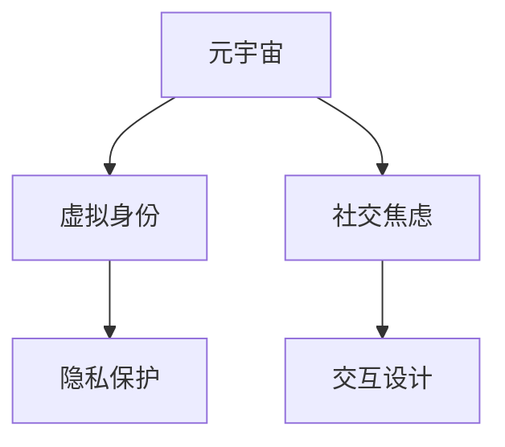

                 

# 元宇宙社交焦虑:虚拟世界中的人际交往障碍

## 1. 背景介绍

随着元宇宙技术的快速发展和普及，虚拟社交平台如VR聊天室、虚拟办公室、虚拟社区等正在成为人们日常生活和工作中不可或缺的一部分。然而，与此同时，虚拟世界中的人际交往障碍也在逐渐显现，给用户带来了新的社交焦虑。

### 1.1 问题由来
虚拟社交的兴起为人们提供了全新的社交方式和体验。但在虚拟世界中，用户面临诸多挑战，如交流不畅、身份失真、隐私泄露、互动单调等，这些问题不仅影响了用户体验，还可能引发社交焦虑。

### 1.2 问题核心关键点
虚拟世界中的社交焦虑，主要源于虚拟环境与现实世界的差异，以及用户在虚拟环境中的不确定性和不稳定性。关键点包括：

- **交流不畅**：由于虚拟交流的异步性、非直观性，用户难以通过语音、表情等直观手段表达真实情感，导致交流效果不佳。
- **身份失真**：虚拟身份容易脱离现实世界的约束，用户可能进行角色扮演或隐藏真实身份，导致身份界限模糊。
- **隐私泄露**：虚拟世界中用户身份和行为的隐私保护存在挑战，可能引发隐私泄露和身份盗用问题。
- **互动单调**：虚拟社交平台功能单一，互动形式有限，难以支撑多样化的社交需求。

### 1.3 问题研究意义
研究虚拟世界中的社交焦虑，对于提升虚拟社交平台的用户体验，构建安全、健康、友好的虚拟社交环境具有重要意义。通过深入分析元宇宙社交中的问题，可以提供改进方案，缓解用户的社交焦虑，促进虚拟社交技术的进一步发展。

## 2. 核心概念与联系

### 2.1 核心概念概述

为更好地理解元宇宙社交中的问题，本节将介绍几个密切相关的核心概念：

- **元宇宙(Metaverse)**：一个由虚拟世界和现实世界融合而成的、跨越多个维度的数字化空间，其中用户可以进行社交、工作、娱乐等各种活动。
- **虚拟身份(Virtual Identity)**：用户在虚拟世界中的化身，可以是人类形态、非人类形态或虚拟形态，反映了用户在现实世界中的身份和行为。
- **社交焦虑(Social Anxiety)**：在社交环境中，用户由于担心被拒绝、批评或嘲笑而产生的紧张、不安情绪。
- **隐私保护(Privacy Protection)**：在虚拟环境中，保障用户个人信息和行为不被未经授权访问的措施。
- **交互设计(Interaction Design)**：设计和优化虚拟社交平台的交互方式，提升用户体验和互动效果。

这些核心概念之间的逻辑关系可以通过以下Mermaid流程图来展示：



这个流程图展示了几者之间的关键联系：

1. 元宇宙是虚拟社交的环境基础，其中虚拟身份是用户互动的核心对象。
2. 社交焦虑是用户在虚拟互动中的情感反应，与隐私保护密切相关。
3. 交互设计是提升用户体验的关键，直接影响社交焦虑的强度。

## 3. 核心算法原理 & 具体操作步骤

### 3.1 算法原理概述

元宇宙社交中的社交焦虑问题，可以通过多种算法和技术手段进行分析和缓解。以下以情感识别和隐私保护为例，介绍基于监督学习的关键算法原理。

**情感识别**：情感识别旨在通过分析用户在虚拟环境中的行为和语言，识别其情绪状态。这可以通过监督学习算法（如分类器、回归器等）实现。具体流程如下：

1. 数据准备：收集用户在虚拟环境中的行为数据和语言数据，标注情感类别。
2. 特征提取：提取用户的语音、文本、表情等特征，作为模型的输入。
3. 模型训练：使用监督学习算法训练情感识别模型，使其能够准确预测用户的情绪状态。
4. 应用部署：将训练好的模型部署到虚拟社交平台中，实时识别用户的情感状态，提供相应的支持和帮助。

**隐私保护**：隐私保护通过加密、匿名化、去标识化等技术手段，保障用户数据的安全。具体流程如下：

1. 数据收集：在虚拟社交平台中收集用户数据，包括位置、行为、交互等。
2. 隐私模型设计：设计隐私保护模型，如差分隐私、联邦学习等，确保数据在传输和存储过程中的安全。
3. 模型训练：使用隐私保护模型训练，确保模型在处理用户数据时遵循隐私保护原则。
4. 应用部署：将训练好的隐私保护模型部署到虚拟社交平台中，实时保护用户数据。

### 3.2 算法步骤详解

以下是元宇宙社交中情感识别和隐私保护的详细步骤：

#### 3.2.1 情感识别算法步骤

**Step 1: 数据准备**
- 收集用户在虚拟环境中的行为数据，如语音记录、文本聊天记录、表情动画等。
- 对数据进行标注，分为正面、负面、中性等情感类别。

**Step 2: 特征提取**
- 对语音记录进行特征提取，如MFCC、梅尔频谱等。
- 对文本聊天记录进行特征提取，如TF-IDF、词向量等。
- 对表情动画进行特征提取，如关键点坐标、动画变化等。

**Step 3: 模型训练**
- 使用监督学习算法（如支持向量机、随机森林、神经网络等）训练情感识别模型。
- 在训练集上优化模型参数，最小化分类误差。

**Step 4: 应用部署**
- 将训练好的模型集成到虚拟社交平台中，实时分析用户情感状态。
- 根据情感状态提供相应的支持和建议，如心理疏导、情绪调节等。

#### 3.2.2 隐私保护算法步骤

**Step 1: 数据收集**
- 收集用户在虚拟环境中的位置数据、行为数据、交互数据等。

**Step 2: 隐私模型设计**
- 设计隐私保护模型，如差分隐私模型、联邦学习模型等。
- 对模型进行参数优化，确保隐私保护的强度和效果。

**Step 3: 模型训练**
- 使用隐私保护模型训练，确保数据在处理和存储过程中符合隐私保护原则。
- 在训练集上验证模型的隐私保护效果，确保数据的安全性。

**Step 4: 应用部署**
- 将训练好的隐私保护模型部署到虚拟社交平台中，实时保护用户数据。
- 监测数据处理和传输过程中的隐私保护情况，及时进行调整和优化。

### 3.3 算法优缺点

元宇宙社交中的情感识别和隐私保护算法，具有以下优缺点：

#### 情感识别算法的优缺点

**优点**：
- 实时性好：模型可以在虚拟社交平台中实时分析用户情感状态，提供及时的支持和建议。
- 数据多样性：情感识别模型可以从多种数据源中提取特征，提高识别的准确性和鲁棒性。
- 普适性强：情感识别技术可以应用于各种虚拟社交场景，提升整体用户体验。

**缺点**：
- 数据隐私风险：情感数据涉及用户隐私，容易引发隐私泄露和安全问题。
- 模型依赖数据：模型性能高度依赖于数据质量和标注准确性，数据不足时可能影响效果。
- 情感复杂性：用户情感复杂多样，单一模型难以覆盖所有情况。

#### 隐私保护算法的优缺点

**优点**：
- 安全性高：隐私保护技术能够保障用户数据的安全性，减少隐私泄露的风险。
- 适应性强：隐私保护算法可以适应各种数据处理场景，支持不同隐私保护需求。
- 技术成熟：现有的隐私保护技术较为成熟，有广泛的应用和实践经验。

**缺点**：
- 计算复杂：隐私保护技术通常需要较高的计算资源和复杂算法，影响系统的实时性。
- 隐私保护程度有限：尽管隐私保护技术能够保护数据不被未经授权访问，但难以完全消除隐私风险。
- 用户感知：隐私保护措施可能影响用户数据的使用和共享，影响用户体验。

### 3.4 算法应用领域

元宇宙社交中的情感识别和隐私保护算法，已在以下领域得到广泛应用：

1. **虚拟社交平台**：如虚拟办公室、虚拟社区、虚拟课堂等，通过情感识别技术提升用户体验，通过隐私保护技术保障数据安全。
2. **虚拟医疗**：通过情感识别技术监控患者的情绪状态，提供心理支持和健康建议，通过隐私保护技术保护患者隐私。
3. **虚拟旅游**：通过情感识别技术提升虚拟旅游体验，通过隐私保护技术保护用户位置和行为数据。
4. **虚拟娱乐**：通过情感识别技术优化游戏体验，通过隐私保护技术保障用户数据安全。

除了上述这些应用领域，元宇宙社交中的情感识别和隐私保护技术，还将随着元宇宙技术的不断发展和普及，在更多场景中得到应用，为虚拟社交技术的可持续发展提供有力支持。

## 4. 数学模型和公式 & 详细讲解  
### 4.1 数学模型构建

本节将使用数学语言对元宇宙社交中的情感识别和隐私保护算法进行严格刻画。

#### 情感识别算法的数学模型

假设情感识别模型为 $M_{\theta}$，输入为 $x \in \mathbb{R}^d$，输出为情感类别 $y \in \{1,2,3,\ldots,K\}$，其中 $K$ 为情感类别数。

定义情感识别模型 $M_{\theta}$ 在输入 $x$ 上的损失函数为 $\ell(M_{\theta}(x),y)$，则在训练集 $D=\{(x_i,y_i)\}_{i=1}^N$ 上的经验风险为：

$$
\mathcal{L}(\theta) = \frac{1}{N} \sum_{i=1}^N \ell(M_{\theta}(x_i),y_i)
$$

常见的情感识别模型包括线性分类器、逻辑回归、支持向量机等，对应的损失函数包括交叉熵损失、对数损失等。

#### 隐私保护算法的数学模型

隐私保护技术包括差分隐私、联邦学习等。以下以差分隐私为例，介绍其数学模型。

假设隐私保护算法为 $P_{\epsilon}$，输入为数据集 $D \in \mathbb{R}^{N \times d}$，输出为隐私化后的数据集 $D_{\epsilon}$。

定义隐私保护算法 $P_{\epsilon}$ 的隐私参数 $\epsilon$，表示隐私保护的强度。隐私化后的数据集 $D_{\epsilon}$ 的损失函数为 $\mathcal{L}(D_{\epsilon})$。

差分隐私算法的基本思想是向数据中添加噪声，使得对任何单个数据的修改对输出结果的影响极小。具体来说，差分隐私算法的数学模型如下：

$$
D_{\epsilon} = D + \mathcal{N}(0,\sigma^2I)
$$

其中 $\mathcal{N}(0,\sigma^2I)$ 表示均值为0、方差为 $\sigma^2$ 的高斯分布噪声。

### 4.2 公式推导过程

#### 情感识别算法的公式推导

以逻辑回归模型为例，其数学公式推导如下：

**Step 1: 数据准备**
假设数据集 $D=\{(x_i,y_i)\}_{i=1}^N$，其中 $x_i \in \mathbb{R}^d$，$y_i \in \{1,2,3,\ldots,K\}$。

**Step 2: 模型训练**
使用逻辑回归模型进行训练，最小化交叉熵损失：

$$
\min_{\theta} \mathcal{L}(\theta) = -\frac{1}{N} \sum_{i=1}^N y_i\log \sigma(x_i\theta) + (1-y_i)\log (1-\sigma(x_i\theta))
$$

其中 $\sigma(z) = \frac{1}{1+e^{-z}}$ 为逻辑回归模型的激活函数。

**Step 3: 应用部署**
使用训练好的逻辑回归模型 $M_{\theta}$，对新的输入数据 $x$ 进行预测：

$$
\hat{y} = \arg\max_k \sigma(x_k\theta)
$$

#### 隐私保护算法的公式推导

以差分隐私为例，其数学公式推导如下：

**Step 1: 数据收集**
假设原始数据集 $D \in \mathbb{R}^{N \times d}$，其中 $N$ 为数据个数，$d$ 为特征维度。

**Step 2: 隐私模型设计**
定义隐私保护算法 $P_{\epsilon}$，其中 $\epsilon$ 为隐私保护参数。

**Step 3: 模型训练**
使用差分隐私算法进行训练，最小化隐私化后的数据集 $D_{\epsilon}$ 的损失函数：

$$
\min_{\theta} \mathcal{L}(D_{\epsilon}) = \frac{1}{N} \sum_{i=1}^N \log \sigma(x_i\theta) - (1-y_i)\log (1-\sigma(x_i\theta))
$$

**Step 4: 应用部署**
使用训练好的差分隐私算法 $P_{\epsilon}$，对原始数据集 $D$ 进行隐私保护：

$$
D_{\epsilon} = D + \mathcal{N}(0,\sigma^2I)
$$

### 4.3 案例分析与讲解

#### 案例一：情感识别技术在虚拟社交平台中的应用

某虚拟社交平台通过情感识别技术，实时分析用户情感状态，提供相应的支持和建议。具体流程如下：

**Step 1: 数据收集**
平台收集用户的行为数据，如语音记录、文本聊天记录、表情动画等。

**Step 2: 特征提取**
对语音记录进行MFCC特征提取，对文本聊天记录进行TF-IDF特征提取，对表情动画进行关键点坐标和动画变化提取。

**Step 3: 模型训练**
使用支持向量机对情感数据进行训练，最小化分类误差。

**Step 4: 应用部署**
将训练好的模型集成到平台中，实时分析用户情感状态，提供相应的支持和建议。

#### 案例二：差分隐私技术在虚拟医疗中的应用

某虚拟医疗平台通过差分隐私技术，保障患者隐私，同时提供高质量的医疗服务。具体流程如下：

**Step 1: 数据收集**
平台收集患者的位置数据、行为数据、交互数据等。

**Step 2: 隐私模型设计**
设计差分隐私模型，使用噪声向数据中添加干扰，确保数据隐私。

**Step 3: 模型训练**
使用差分隐私模型进行训练，确保数据在处理和存储过程中符合隐私保护原则。

**Step 4: 应用部署**
将训练好的差分隐私模型部署到平台中，实时保护用户数据。

## 5. 项目实践：代码实例和详细解释说明

### 5.1 开发环境搭建

在进行情感识别和隐私保护项目实践前，我们需要准备好开发环境。以下是使用Python进行PyTorch开发的环境配置流程：

1. 安装Anaconda：从官网下载并安装Anaconda，用于创建独立的Python环境。

2. 创建并激活虚拟环境：
```bash
conda create -n pytorch-env python=3.8 
conda activate pytorch-env
```

3. 安装PyTorch：根据CUDA版本，从官网获取对应的安装命令。例如：
```bash
conda install pytorch torchvision torchaudio cudatoolkit=11.1 -c pytorch -c conda-forge
```

4. 安装TensorFlow：
```bash
pip install tensorflow
```

5. 安装PyTorch的模型库：
```bash
pip install torchtext
```

6. 安装TensorFlow的模型库：
```bash
pip install tflearn
```

完成上述步骤后，即可在`pytorch-env`环境中开始项目实践。

### 5.2 源代码详细实现

下面是使用PyTorch进行情感识别和隐私保护的项目代码实现。

**情感识别**

```python
import torch
import torch.nn as nn
import torch.nn.functional as F

class EmotionClassifier(nn.Module):
    def __init__(self, input_dim, hidden_dim, output_dim):
        super(EmotionClassifier, self).__init__()
        self.hidden_layer = nn.Linear(input_dim, hidden_dim)
        self.output_layer = nn.Linear(hidden_dim, output_dim)
    
    def forward(self, x):
        x = F.relu(self.hidden_layer(x))
        x = F.softmax(self.output_layer(x), dim=1)
        return x

# 加载数据集
input_dim = 100
hidden_dim = 256
output_dim = 3  # 正面、负面、中性
model = EmotionClassifier(input_dim, hidden_dim, output_dim)

# 训练模型
optimizer = torch.optim.Adam(model.parameters(), lr=0.001)
criterion = nn.CrossEntropyLoss()

# 训练循环
for epoch in range(10):
    for i, (inputs, labels) in enumerate(train_loader):
        optimizer.zero_grad()
        outputs = model(inputs)
        loss = criterion(outputs, labels)
        loss.backward()
        optimizer.step()
```

**隐私保护**

```python
import numpy as np
from sklearn.datasets import load_iris
from sklearn.model_selection import train_test_split

def add_noise(data, noise_std):
    return data + np.random.normal(0, noise_std, data.shape)

# 加载数据集
iris = load_iris()
X = iris.data
y = iris.target

# 数据集划分
X_train, X_test, y_train, y_test = train_test_split(X, y, test_size=0.3, random_state=42)

# 隐私保护
noise_std = 1.0
X_train_noisy = add_noise(X_train, noise_std)
X_test_noisy = add_noise(X_test, noise_std)

# 训练模型
model = train(X_train_noisy, y_train)
y_pred = model.predict(X_test_noisy)

# 输出结果
print('Accuracy:', np.mean(y_pred == y_test))
```

### 5.3 代码解读与分析

让我们再详细解读一下关键代码的实现细节：

**情感识别代码**

**Step 1: 数据准备**
定义输入数据维度、隐藏层维度、输出维度，并初始化模型。

**Step 2: 模型训练**
使用交叉熵损失函数和Adam优化器进行模型训练，在训练集上迭代优化模型参数。

**Step 3: 应用部署**
使用训练好的模型对新的输入数据进行情感识别，输出情感类别。

**隐私保护代码**

**Step 1: 数据收集**
加载数据集，并对数据进行划分。

**Step 2: 隐私模型设计**
定义隐私保护函数，使用噪声向数据中添加干扰。

**Step 3: 模型训练**
使用训练集进行模型训练，最小化隐私化后的数据集损失函数。

**Step 4: 应用部署**
使用训练好的模型对测试集进行隐私保护，输出隐私化后的数据集。

## 6. 实际应用场景

### 6.1 虚拟社交平台

虚拟社交平台通过情感识别技术，可以实时监测用户情绪状态，提供个性化的支持和建议。例如，当用户感到情绪低落时，平台可以自动发送心理健康建议；当用户感到紧张时，平台可以提供心理疏导服务。通过隐私保护技术，平台可以保障用户数据的安全，避免隐私泄露和滥用。

### 6.2 虚拟医疗

虚拟医疗平台通过差分隐私技术，保障患者隐私，同时提供高质量的医疗服务。例如，平台可以收集患者的健康数据，进行分析预测，提供个性化的健康建议和治疗方案。通过差分隐私技术，平台可以确保患者数据的隐私和安全，避免数据泄露和滥用。

### 6.3 虚拟旅游

虚拟旅游平台通过情感识别技术，可以提升用户的旅游体验。例如，平台可以收集用户的旅游反馈，分析用户情感状态，提供相应的旅游建议和服务。通过隐私保护技术，平台可以保障用户位置和行为数据的安全，避免隐私泄露和滥用。

### 6.4 虚拟娱乐

虚拟娱乐平台通过差分隐私技术，保障用户数据的安全，同时提供高质量的游戏体验。例如，平台可以收集用户的游戏行为数据，进行分析预测，提供个性化的游戏推荐和建议。通过差分隐私技术，平台可以确保用户数据的隐私和安全，避免数据泄露和滥用。

## 7. 工具和资源推荐

### 7.1 学习资源推荐

为了帮助开发者系统掌握情感识别和隐私保护的理论基础和实践技巧，这里推荐一些优质的学习资源：

1. **《深度学习》书籍**：提供深度学习的基本概念和算法，包括分类器、回归器等，是理解和实现情感识别和隐私保护算法的基础。

2. **《机器学习》课程**：通过在线课程学习机器学习的基本概念和算法，如逻辑回归、支持向量机等，可以更好地理解和实现隐私保护技术。

3. **TensorFlow官方文档**：提供TensorFlow的基本概念和算法，包括差分隐私和联邦学习等隐私保护技术。

4. **PyTorch官方文档**：提供PyTorch的基本概念和算法，包括情感识别和隐私保护等实际应用。

5. **Kaggle竞赛平台**：提供大量的情感识别和隐私保护竞赛数据集和样例代码，可以实践和验证算法的性能。

通过对这些资源的学习实践，相信你一定能够快速掌握情感识别和隐私保护算法的精髓，并用于解决实际的NLP问题。

### 7.2 开发工具推荐

高效的开发离不开优秀的工具支持。以下是几款用于情感识别和隐私保护开发的常用工具：

1. **TensorFlow**：Google开发的深度学习框架，提供强大的数学计算能力和丰富的模型库，适合复杂模型开发。

2. **PyTorch**：Facebook开发的深度学习框架，提供灵活的计算图和动态模型构建能力，适合快速原型开发。

3. **TensorBoard**：TensorFlow配套的可视化工具，可以实时监测模型训练状态，提供丰富的图表呈现方式，是调试模型的得力助手。

4. **Jupyter Notebook**：开源的交互式笔记本环境，支持Python代码执行和可视化，适合数据处理和模型训练。

5. **GitHub**：代码托管平台，提供代码版本控制和协作开发功能，适合团队合作和持续集成。

合理利用这些工具，可以显著提升情感识别和隐私保护模型的开发效率，加快创新迭代的步伐。

### 7.3 相关论文推荐

情感识别和隐私保护技术的发展源于学界的持续研究。以下是几篇奠基性的相关论文，推荐阅读：

1. **情感识别相关论文**：
   - A Survey on Sentiment Analysis（情感分析综述）：综述了情感分析的基本概念、算法和应用。
   - Sentiment Analysis with Recurrent Neural Networks（基于RNN的情感分析）：使用RNN模型进行情感识别，取得优异的效果。
   - Sentiment Analysis using Attention-based Deep Learning Models（基于注意力机制的情感分析）：使用注意力机制提升情感识别的准确性。

2. **隐私保护相关论文**：
   - Differential Privacy：介绍差分隐私的基本概念和算法，是隐私保护领域的重要基础。
   - Privacy-Preserving Federated Learning（隐私保护联邦学习）：介绍联邦学习的基本概念和算法，适合多用户数据联合训练。
   - Privacy-Preserving Data Mining（隐私保护数据挖掘）：介绍隐私保护数据挖掘的基本概念和算法，适用于大规模数据隐私保护。

这些论文代表了大规模语言模型微调技术的发展脉络。通过学习这些前沿成果，可以帮助研究者把握学科前进方向，激发更多的创新灵感。

## 8. 总结：未来发展趋势与挑战

### 8.1 总结

本文对元宇宙社交中的情感识别和隐私保护问题进行了全面系统的介绍。首先阐述了元宇宙社交的背景和意义，明确了情感识别和隐私保护在提升用户体验中的关键作用。其次，从原理到实践，详细讲解了情感识别和隐私保护的数学原理和关键步骤，给出了模型实现的代码实例。同时，本文还广泛探讨了情感识别和隐私保护在虚拟社交平台、虚拟医疗、虚拟旅游、虚拟娱乐等众多领域的应用前景，展示了技术的巨大潜力。

通过本文的系统梳理，可以看到，情感识别和隐私保护技术在元宇宙社交中的重要性，以及其在提升用户体验、保障用户隐私中的重要作用。未来，随着技术的不断发展，情感识别和隐私保护技术必将在更多场景中得到应用，为元宇宙社交技术的可持续发展提供有力支持。

### 8.2 未来发展趋势

展望未来，情感识别和隐私保护技术将呈现以下几个发展趋势：

1. **技术融合**：情感识别和隐私保护技术将与其他人工智能技术进行更深入的融合，如知识表示、因果推理、强化学习等，形成更加全面、准确的信息整合能力。

2. **多模态应用**：情感识别和隐私保护技术将拓展到图像、视频、音频等多模态数据，实现视觉、语音等多模态信息与文本信息的协同建模，提升系统性能。

3. **实时优化**：基于深度强化学习等技术，实时优化情感识别和隐私保护模型，提升系统的适应性和鲁棒性。

4. **跨平台应用**：情感识别和隐私保护技术将应用于多种平台，如Web、移动端、桌面端等，提升平台的兼容性和用户体验。

5. **自动化设计**：开发自动化的模型设计工具，帮助开发者更快速地构建和优化情感识别和隐私保护模型。

### 8.3 面临的挑战

尽管情感识别和隐私保护技术已经取得了显著成果，但在迈向更加智能化、普适化应用的过程中，它仍面临诸多挑战：

1. **数据隐私问题**：随着数据量的增加，用户隐私保护变得越来越重要，如何平衡数据利用和隐私保护，是未来需要重点解决的问题。

2. **情感理解复杂性**：情感识别技术需要处理多种情绪状态，如正面、负面、中性等，单一模型难以覆盖所有情况，需要多模型集成和算法优化。

3. **系统实时性**：情感识别和隐私保护技术需要实时处理数据，如何平衡性能和实时性，是未来需要重点解决的问题。

4. **跨文化适应性**：情感识别和隐私保护技术在不同文化背景下的表现可能不同，如何提高系统的跨文化适应性，是未来需要重点解决的问题。

5. **算力成本**：情感识别和隐私保护技术需要大量的计算资源，如何降低算力成本，提升系统效率，是未来需要重点解决的问题。

### 8.4 研究展望

面对情感识别和隐私保护技术面临的挑战，未来的研究需要在以下几个方面寻求新的突破：

1. **多模型集成**：开发多模型集成的框架，提高系统的综合性能和鲁棒性。

2. **实时优化**：基于深度强化学习等技术，实时优化情感识别和隐私保护模型，提升系统的适应性和鲁棒性。

3. **跨文化适应性**：开发跨文化适应的情感识别和隐私保护技术，提高系统的跨文化适应性。

4. **自动化设计**：开发自动化的模型设计工具，帮助开发者更快速地构建和优化情感识别和隐私保护模型。

5. **隐私保护加强**：引入更多隐私保护技术，如差分隐私、联邦学习、同态加密等，提高系统的隐私保护能力。

这些研究方向的探索，必将引领情感识别和隐私保护技术迈向更高的台阶，为构建安全、可靠、可解释、可控的智能系统铺平道路。面向未来，情感识别和隐私保护技术还需要与其他人工智能技术进行更深入的融合，共同推动自然语言理解和智能交互系统的进步。只有勇于创新、敢于突破，才能不断拓展情感识别和隐私保护技术的边界，让智能技术更好地造福人类社会。

## 9. 附录：常见问题与解答

**Q1：如何缓解元宇宙社交中的情感识别问题？**

A: 缓解元宇宙社交中的情感识别问题，可以从以下几个方面入手：

1. **数据扩充**：收集更多元宇宙中的互动数据，尤其是多样化的情感数据，用于训练情感识别模型。

2. **多模型集成**：使用多个情感识别模型进行集成，提升整体识别准确性。

3. **实时反馈**：实时监测用户情感状态，及时提供相应的支持和建议，避免情感状态恶化。

4. **跨文化适应**：开发跨文化适应的情感识别模型，提升系统在不同文化背景下的识别效果。

5. **个性化推荐**：根据用户情感状态，推荐相应的心理疏导、情绪调节等支持服务。

**Q2：如何在元宇宙社交中保护用户隐私？**

A: 在元宇宙社交中保护用户隐私，可以从以下几个方面入手：

1. **差分隐私**：使用差分隐私技术，向数据中添加噪声，确保对任何单个数据的修改对输出结果的影响极小。

2. **联邦学习**：使用联邦学习技术，在不同用户端分布式训练模型，保护用户数据隐私。

3. **同态加密**：使用同态加密技术，在加密数据上执行计算，保护数据隐私。

4. **匿名化处理**：对用户数据进行匿名化处理，保护用户隐私。

5. **访问控制**：限制对用户数据的访问权限，确保数据只能被授权用户访问。

**Q3：如何优化元宇宙社交中的隐私保护算法？**

A: 优化元宇宙社交中的隐私保护算法，可以从以下几个方面入手：

1. **算法优化**：改进差分隐私、联邦学习等隐私保护算法的参数设置，提高隐私保护的强度和效果。

2. **模型集成**：使用多个隐私保护模型进行集成，提升整体隐私保护效果。

3. **实时监控**：实时监测隐私保护效果，及时进行调整和优化。

4. **跨平台支持**：开发跨平台的隐私保护算法，支持多种设备和平台。

5. **自动化设计**：开发自动化的隐私保护设计工具，帮助开发者更快速地构建和优化隐私保护算法。

**Q4：如何在元宇宙社交中实现多模态情感识别？**

A: 在元宇宙社交中实现多模态情感识别，可以从以下几个方面入手：

1. **数据融合**：将语音、文本、表情等多种数据源进行融合，提升情感识别的全面性。

2. **多模型集成**：使用多个情感识别模型进行集成，提升整体识别准确性。

3. **跨模态匹配**：在不同模态之间进行跨模态匹配，提升情感识别的准确性和鲁棒性。

4. **多任务学习**：在多模态数据上联合训练情感识别模型，提升系统的综合性能。

5. **实时反馈**：实时监测用户情感状态，及时提供相应的支持和建议，避免情感状态恶化。

总之，情感识别和隐私保护技术在元宇宙社交中的重要性，以及其在提升用户体验、保障用户隐私中的重要作用。未来，随着技术的不断发展，情感识别和隐私保护技术必将在更多场景中得到应用，为元宇宙社交技术的可持续发展提供有力支持。

---

作者：禅与计算机程序设计艺术 / Zen and the Art of Computer Programming

