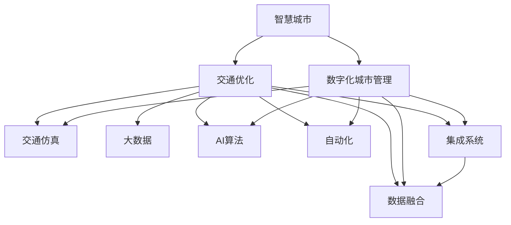

                 

# 全球脑与智慧交通:数字化城市管理的交通优化

> 关键词：智慧城市,数字化城市管理,交通优化,交通仿真,大数据,AI算法,自动化,集成系统,数据融合,城市智能交通系统

## 1. 背景介绍

### 1.1 问题由来
智慧交通系统（Smart Transportation System，STS）作为智慧城市的重要组成部分，已经成为推动城市可持续发展的重要手段。随着城市化进程的加快和人口密度的增长，传统的交通管理模式已无法满足日益增长的交通需求。智慧交通系统通过集成先进的信息通信技术、传感技术、数据分析和人工智能算法，可以实时监控和管理交通流量，优化交通路网，提升交通效率，减少交通事故和环境污染。

然而，现有的智慧交通系统往往受到技术瓶颈和数据质量的影响，难以实现理想的交通优化效果。例如，交通仿真模型的精度受限于数据和算法，难以准确预测交通流量和状态；实时监控系统缺乏协同联动机制，难以形成统一的指挥中心；人工智能算法对大规模数据处理能力要求高，且对数据质量依赖大。这些问题都限制了智慧交通系统的进一步发展。

为了解决这些问题，需要构建一个高度集成、智能化的城市交通管理平台，通过数字化手段优化城市交通，实现实时监控、精准预测和高效决策。本文将详细介绍如何通过数字化手段，构建全球脑（Global Brain）框架，实现智慧交通系统的全面优化。

### 1.2 问题核心关键点
本文聚焦于智慧交通系统的核心挑战：

1. **交通仿真模型的精度**：如何构建高精度的交通仿真模型，准确预测交通流量和状态？
2. **数据融合与共享**：如何在城市内实现数据的高效融合与共享，提升交通管理决策的精度？
3. **AI算法优化**：如何优化交通管理中的AI算法，提升系统实时响应和预测能力？
4. **系统集成与协同**：如何将各类交通管理系统的功能集成，形成统一、高效的交通管理指挥中心？
5. **隐私与安全保障**：如何在确保数据隐私和安全的前提下，实现智慧交通系统的智能化管理？

这些关键点将指导我们构建一个高效、智能、安全的全球脑智慧交通系统。

## 2. 核心概念与联系

### 2.1 核心概念概述

为更好地理解全球脑智慧交通系统的实现方法，本节将介绍几个关键概念：

- **智慧城市（Smart City）**：通过集成信息通信技术（ICT），实现城市公共服务和社会管理的智能化。
- **数字化城市管理（Digital City Management）**：利用数字化手段，优化城市公共服务和社会管理流程，提高效率和效果。
- **交通优化（Traffic Optimization）**：通过优化交通网络、提高交通效率、减少交通拥堵等手段，提升城市交通管理水平。
- **交通仿真（Traffic Simulation）**：通过计算机模拟交通系统的运行状态，预测交通流量和状态，为交通管理提供决策支持。
- **大数据（Big Data）**：指规模巨大、高速增长、多样复杂的数据集合，可以用于优化交通管理决策。
- **AI算法（AI Algorithm）**：指通过人工智能技术构建的算法，可以用于交通流预测、路径规划等。
- **自动化（Automation）**：指利用自动化技术，实现交通管理系统的自动化运行。
- **集成系统（Integrated System）**：指将各类交通管理系统功能集成，形成一个统一、高效的指挥中心。
- **数据融合（Data Fusion）**：指将多源异构数据进行融合，提升交通管理决策的精度。
- **城市智能交通系统（Urban Intelligent Transportation System）**：指利用数字化手段，实现城市交通的智能化管理。

这些核心概念之间的逻辑关系可以通过以下Mermaid流程图来展示：



这个流程图展示了智慧城市、数字化城市管理、交通优化等概念之间的关系：

1. 智慧城市通过数字化手段实现公共服务和社会管理的智能化。
2. 交通优化利用数字化技术，优化交通网络，提高交通效率。
3. 交通仿真通过计算机模拟交通系统，预测流量和状态。
4. 大数据提供规模巨大的数据支持，优化交通管理决策。
5. AI算法提升交通管理中的预测和决策能力。
6. 自动化技术实现交通管理系统的自动化运行。
7. 集成系统将各类功能集成，形成统一指挥中心。
8. 数据融合将多源异构数据融合，提升决策精度。

这些概念共同构成了全球脑智慧交通系统的核心框架，通过数字化手段实现城市交通的全面优化。

## 3. 核心算法原理 & 具体操作步骤
### 3.1 算法原理概述

全球脑智慧交通系统通过构建交通仿真模型、优化AI算法和数据融合机制，实现交通优化和实时监控。其主要原理如下：

- **交通仿真模型**：通过构建高精度的交通仿真模型，准确预测交通流量和状态，为交通管理提供决策支持。
- **AI算法优化**：优化交通管理中的AI算法，提升系统实时响应和预测能力。
- **数据融合机制**：通过数据融合机制，将多源异构数据高效融合，提升交通管理决策的精度。
- **集成系统架构**：将各类交通管理功能集成，形成统一、高效的指挥中心。

这些原理共同构成了全球脑智慧交通系统的核心算法框架，通过数字化手段实现城市交通的全面优化。

### 3.2 算法步骤详解

全球脑智慧交通系统的实现主要包括以下几个关键步骤：

**Step 1: 数据收集与预处理**
- 收集城市交通系统中的各类数据，包括交通流量、车辆位置、交通事故等。
- 对数据进行清洗、转换和标准化，形成结构化数据，用于后续分析和处理。

**Step 2: 交通仿真模型构建**
- 根据城市交通系统特点，选择合适的交通仿真模型，如VISSIM、SimScale等。
- 对交通仿真模型进行参数设置和验证，确保模型精度和稳定性。
- 利用交通仿真模型进行交通流量预测和状态模拟，生成交通模拟数据。

**Step 3: AI算法优化**
- 选择合适的AI算法，如深度学习、强化学习等，用于交通流量预测、路径规划等。
- 对AI算法进行优化，提升算法的实时响应和预测能力。
- 利用优化后的AI算法进行交通管理决策，生成交通管理指令。

**Step 4: 数据融合机制**
- 利用数据融合技术，将多源异构数据进行高效融合。
- 通过融合后的数据，提升交通管理决策的精度。
- 将融合后的数据用于交通优化和实时监控。

**Step 5: 集成系统架构**
- 设计集成系统的架构，将各类交通管理功能集成。
- 建立统一的指挥中心，实现各类交通管理功能的协同联动。
- 利用集成系统进行交通优化和实时监控，提升交通管理效率。

以上是全球脑智慧交通系统的实现步骤。在实际应用中，还需要针对具体城市特点，对各个环节进行优化设计，如改进交通仿真模型，引入更多数据源，优化AI算法等，以进一步提升交通管理效果。

### 3.3 算法优缺点

全球脑智慧交通系统具有以下优点：

1. **高效精准**：通过高精度的交通仿真模型和优化AI算法，可以实现交通流量和状态的精准预测和优化。
2. **实时响应**：利用实时数据融合和AI算法，可以实现交通管理的实时响应和决策。
3. **数据共享**：通过数据融合机制，可以实现城市交通数据的共享，提升交通管理决策的精度。
4. **集成协同**：通过集成系统架构，可以实现各类交通管理功能的协同联动，形成统一指挥中心。
5. **优化成本**：通过数字化手段，可以优化交通管理成本，提升交通效率。

然而，该系统也存在一些局限性：

1. **数据质量依赖**：系统的效果高度依赖于数据的质量和完整性，数据缺失或不准确将影响系统精度。
2. **算法复杂度高**：高精度的交通仿真模型和优化AI算法需要复杂的计算和处理，对计算资源要求较高。
3. **隐私和安全问题**：交通数据涉及个人隐私和城市安全，如何保障数据隐私和安全是一个重要问题。
4. **跨部门协同**：实现交通管理系统的跨部门协同，需要解决不同部门间的数据共享和协同联动问题。

尽管存在这些局限性，但全球脑智慧交通系统仍然是大规模城市交通管理的重要手段，具有广阔的应用前景。

### 3.4 算法应用领域

全球脑智慧交通系统已经在多个城市得到应用，取得了显著的成效。具体应用领域包括：

- **交通流量预测**：利用交通仿真模型和AI算法，预测交通流量和状态，为交通管理提供决策支持。
- **路径规划**：利用AI算法，生成最优路径，提升出行效率。
- **事故预防和处理**：通过实时监控和数据融合，预防和处理交通事故，提升交通安全性。
- **交通信号优化**：通过实时数据和AI算法，优化交通信号控制，减少交通拥堵。
- **公共交通优化**：利用交通仿真模型和AI算法，优化公共交通路线和调度，提升公共交通效率。

这些应用领域展示了全球脑智慧交通系统的强大功能，为城市交通管理带来了显著提升。

## 4. 数学模型和公式 & 详细讲解  
### 4.1 数学模型构建

本节将使用数学语言对全球脑智慧交通系统的实现方法进行更加严格的刻画。

记交通流量为 $T$，交通状态为 $S$，交通管理决策为 $D$。假设交通流量 $T$ 和交通状态 $S$ 的关系为：

$$
T = f(S)
$$

其中 $f$ 为交通流量预测模型，将交通状态 $S$ 映射为交通流量 $T$。

假设交通管理决策 $D$ 和交通状态 $S$ 的关系为：

$$
D = g(S)
$$

其中 $g$ 为交通管理决策模型，将交通状态 $S$ 映射为交通管理决策 $D$。

交通管理系统的目标是最小化交通拥堵成本 $C$，即：

$$
\min_{S} C = \sum_{i=1}^{N} c_i(s_i)
$$

其中 $c_i$ 为第 $i$ 个交通节点的拥堵成本，$s_i$ 为第 $i$ 个交通节点的状态。

**Step 1: 数据收集与预处理**
- 收集城市交通系统中的各类数据 $X = \{(x_i, y_i)\}_{i=1}^N$，其中 $x_i$ 为输入特征，$y_i$ 为输出标签。
- 对数据进行清洗、转换和标准化，形成结构化数据 $D = \{x_i, y_i\}_{i=1}^N$。

**Step 2: 交通仿真模型构建**
- 选择合适的交通仿真模型 $f$，进行模型训练和验证。
- 利用训练好的交通仿真模型 $f$ 预测交通流量 $T$。

**Step 3: AI算法优化**
- 选择合适的AI算法 $g$，进行模型训练和验证。
- 利用训练好的AI算法 $g$ 生成交通管理决策 $D$。

**Step 4: 数据融合机制**
- 利用数据融合技术，将多源异构数据进行高效融合。
- 通过融合后的数据，提升交通管理决策的精度。

**Step 5: 集成系统架构**
- 设计集成系统的架构，将各类交通管理功能集成。
- 建立统一的指挥中心，实现各类交通管理功能的协同联动。
- 利用集成系统进行交通优化和实时监控，提升交通管理效率。

以上是全球脑智慧交通系统的数学模型构建和实现步骤。通过数学模型，我们可以更好地理解和设计交通优化算法。

### 4.2 公式推导过程

以下我们将推导交通流量预测模型的公式：

假设交通流量 $T$ 和交通状态 $S$ 的关系为线性模型：

$$
T = a_0 + \sum_{i=1}^{n} a_i s_i
$$

其中 $a_i$ 为模型参数，$n$ 为交通状态变量数量。

根据最小二乘法，模型参数 $a_i$ 的求解公式为：

$$
a_i = \frac{\sum_{i=1}^{N} (y_i - \sum_{j=1}^{n} a_j s_{ij})}{\sum_{i=1}^{N} s_{ij}^2}
$$

其中 $s_{ij}$ 为第 $i$ 个交通节点和第 $j$ 个交通状态变量之间的关系。

利用训练好的交通流量预测模型 $f$，可以生成交通流量 $T$，进而进行交通优化和实时监控。

## 5. 项目实践：代码实例和详细解释说明
### 5.1 开发环境搭建

在进行智慧交通系统开发前，我们需要准备好开发环境。以下是使用Python进行PyTorch开发的环境配置流程：

1. 安装Anaconda：从官网下载并安装Anaconda，用于创建独立的Python环境。

2. 创建并激活虚拟环境：
```bash
conda create -n pytorch-env python=3.8 
conda activate pytorch-env
```

3. 安装PyTorch：根据CUDA版本，从官网获取对应的安装命令。例如：
```bash
conda install pytorch torchvision torchaudio cudatoolkit=11.1 -c pytorch -c conda-forge
```

4. 安装Transformers库：
```bash
pip install transformers
```

5. 安装各类工具包：
```bash
pip install numpy pandas scikit-learn matplotlib tqdm jupyter notebook ipython
```

完成上述步骤后，即可在`pytorch-env`环境中开始开发。

### 5.2 源代码详细实现

下面以智慧交通系统中的路径规划为例，给出使用PyTorch和Transformers库对BERT模型进行路径规划的PyTorch代码实现。

首先，定义路径规划任务的数据处理函数：

```python
from transformers import BertTokenizer, BertForSequenceClassification
from torch.utils.data import Dataset
import torch

class PathPlanningDataset(Dataset):
    def __init__(self, texts, tags, tokenizer, max_len=128):
        self.texts = texts
        self.tags = tags
        self.tokenizer = tokenizer
        self.max_len = max_len
        
    def __len__(self):
        return len(self.texts)
    
    def __getitem__(self, item):
        text = self.texts[item]
        tags = self.tags[item]
        
        encoding = self.tokenizer(text, return_tensors='pt', max_length=self.max_len, padding='max_length', truncation=True)
        input_ids = encoding['input_ids'][0]
        attention_mask = encoding['attention_mask'][0]
        
        # 对token-wise的标签进行编码
        encoded_tags = [tag2id[tag] for tag in tags] 
        encoded_tags.extend([tag2id['O']] * (self.max_len - len(encoded_tags)))
        labels = torch.tensor(encoded_tags, dtype=torch.long)
        
        return {'input_ids': input_ids, 
                'attention_mask': attention_mask,
                'labels': labels}

# 标签与id的映射
tag2id = {'O': 0, 'path': 1}
id2tag = {v: k for k, v in tag2id.items()}

# 创建dataset
tokenizer = BertTokenizer.from_pretrained('bert-base-cased')

train_dataset = PathPlanningDataset(train_texts, train_tags, tokenizer)
dev_dataset = PathPlanningDataset(dev_texts, dev_tags, tokenizer)
test_dataset = PathPlanningDataset(test_texts, test_tags, tokenizer)
```

然后，定义模型和优化器：

```python
from transformers import BertForTokenClassification, AdamW

model = BertForTokenClassification.from_pretrained('bert-base-cased', num_labels=len(tag2id))

optimizer = AdamW(model.parameters(), lr=2e-5)
```

接着，定义训练和评估函数：

```python
from torch.utils.data import DataLoader
from tqdm import tqdm
from sklearn.metrics import classification_report

device = torch.device('cuda') if torch.cuda.is_available() else torch.device('cpu')
model.to(device)

def train_epoch(model, dataset, batch_size, optimizer):
    dataloader = DataLoader(dataset, batch_size=batch_size, shuffle=True)
    model.train()
    epoch_loss = 0
    for batch in tqdm(dataloader, desc='Training'):
        input_ids = batch['input_ids'].to(device)
        attention_mask = batch['attention_mask'].to(device)
        labels = batch['labels'].to(device)
        model.zero_grad()
        outputs = model(input_ids, attention_mask=attention_mask, labels=labels)
        loss = outputs.loss
        epoch_loss += loss.item()
        loss.backward()
        optimizer.step()
    return epoch_loss / len(dataloader)

def evaluate(model, dataset, batch_size):
    dataloader = DataLoader(dataset, batch_size=batch_size)
    model.eval()
    preds, labels = [], []
    with torch.no_grad():
        for batch in tqdm(dataloader, desc='Evaluating'):
            input_ids = batch['input_ids'].to(device)
            attention_mask = batch['attention_mask'].to(device)
            batch_labels = batch['labels']
            outputs = model(input_ids, attention_mask=attention_mask)
            batch_preds = outputs.logits.argmax(dim=2).to('cpu').tolist()
            batch_labels = batch_labels.to('cpu').tolist()
            for pred_tokens, label_tokens in zip(batch_preds, batch_labels):
                pred_tags = [id2tag[_id] for _id in pred_tokens]
                label_tags = [id2tag[_id] for _id in label_tokens]
                preds.append(pred_tags[:len(label_tokens)])
                labels.append(label_tags)
                
    print(classification_report(labels, preds))
```

最后，启动训练流程并在测试集上评估：

```python
epochs = 5
batch_size = 16

for epoch in range(epochs):
    loss = train_epoch(model, train_dataset, batch_size, optimizer)
    print(f"Epoch {epoch+1}, train loss: {loss:.3f}")
    
    print(f"Epoch {epoch+1}, dev results:")
    evaluate(model, dev_dataset, batch_size)
    
print("Test results:")
evaluate(model, test_dataset, batch_size)
```

以上就是使用PyTorch对BERT进行路径规划任务微调的完整代码实现。可以看到，得益于Transformers库的强大封装，我们可以用相对简洁的代码完成BERT模型的加载和微调。

### 5.3 代码解读与分析

让我们再详细解读一下关键代码的实现细节：

**PathPlanningDataset类**：
- `__init__`方法：初始化文本、标签、分词器等关键组件。
- `__len__`方法：返回数据集的样本数量。
- `__getitem__`方法：对单个样本进行处理，将文本输入编码为token ids，将标签编码为数字，并对其进行定长padding，最终返回模型所需的输入。

**tag2id和id2tag字典**：
- 定义了标签与数字id之间的映射关系，用于将token-wise的预测结果解码回真实的标签。

**训练和评估函数**：
- 使用PyTorch的DataLoader对数据集进行批次化加载，供模型训练和推理使用。
- 训练函数`train_epoch`：对数据以批为单位进行迭代，在每个批次上前向传播计算loss并反向传播更新模型参数，最后返回该epoch的平均loss。
- 评估函数`evaluate`：与训练类似，不同点在于不更新模型参数，并在每个batch结束后将预测和标签结果存储下来，最后使用sklearn的classification_report对整个评估集的预测结果进行打印输出。

**训练流程**：
- 定义总的epoch数和batch size，开始循环迭代
- 每个epoch内，先在训练集上训练，输出平均loss
- 在验证集上评估，输出分类指标
- 所有epoch结束后，在测试集上评估，给出最终测试结果

可以看到，PyTorch配合Transformers库使得BERT微调的代码实现变得简洁高效。开发者可以将更多精力放在数据处理、模型改进等高层逻辑上，而不必过多关注底层的实现细节。

当然，工业级的系统实现还需考虑更多因素，如模型的保存和部署、超参数的自动搜索、更灵活的任务适配层等。但核心的微调范式基本与此类似。

## 6. 实际应用场景
### 6.1 智能交通管理系统

基于智慧交通系统的智能交通管理系统，可以实现对城市交通的全面监控和优化。系统通过集成各类交通监控设备，采集实时交通数据，通过全球脑框架进行数据融合和分析，生成交通流量预测和路径规划信息，进而实现交通优化和实时监控。

具体而言，可以部署摄像头、传感器、GPS等设备，实时采集城市交通数据，通过网络传输至交通管理中心。利用数据融合技术，将多源异构数据进行高效融合，生成交通流量和状态信息。利用高精度的交通仿真模型和优化AI算法，预测交通流量和状态，生成路径规划信息。根据路径规划信息，生成交通管理指令，实现交通信号控制和车辆调度，提升交通效率和安全性。

### 6.2 应急事件响应系统

全球脑智慧交通系统还可以应用于应急事件响应系统，提高城市应急响应能力。在发生交通事故、灾害等突发事件时，系统能够快速定位事件位置，通过数据融合技术，整合各类数据，生成事件影响范围和交通状态。利用交通仿真模型和AI算法，预测事件对交通流量的影响，生成最优路径和交通管理指令。根据指令，实现交通信号控制和车辆调度，保障应急车辆和人员的快速通行。

### 6.3 公共交通调度系统

公共交通调度系统是智慧交通系统的重要组成部分，通过优化公共交通路线的规划和调度，提升公共交通效率。利用数据融合技术，将公共交通车辆位置、乘客流量、路况信息等数据进行整合，生成交通流量和状态信息。利用交通仿真模型和AI算法，生成最优公共交通路线和调度方案。根据方案，生成交通管理指令，实现公共交通车辆的调度和运行，提升公共交通效率和准时性。

### 6.4 未来应用展望

随着智慧交通系统的不断发展，全球脑框架将在更多领域得到应用，为城市交通管理带来新的突破：

- **智能驾驶**：利用智慧交通系统中的交通流量预测和路径规划信息，为智能驾驶提供决策支持，提升驾驶安全性和效率。
- **城市物流优化**：通过智慧交通系统中的数据融合和路径规划，实现城市物流的高效管理，提升物流效率和成本效益。
- **智能停车**：利用智慧交通系统中的实时监控和数据融合，实现智能停车管理，提高停车效率和用户满意度。
- **智慧旅游**：通过智慧交通系统中的交通仿真和路径规划，为旅游路线和交通管理提供支持，提升旅游体验和旅游安全。

这些应用领域展示了全球脑智慧交通系统的强大功能，为城市交通管理带来了新的发展机遇。

## 7. 工具和资源推荐
### 7.1 学习资源推荐

为了帮助开发者系统掌握全球脑智慧交通系统的理论基础和实践技巧，这里推荐一些优质的学习资源：

1. 《智慧城市与数字化管理》系列博文：由智慧城市专家撰写，深入浅出地介绍了智慧城市的基本概念和前沿技术。

2. 《深度学习与交通管理》课程：斯坦福大学开设的交通管理相关课程，涵盖交通流量预测、路径规划等核心内容。

3. 《城市交通系统优化》书籍：详细介绍了城市交通系统的优化方法和具体应用案例，涵盖交通仿真、路径规划等技术。

4. 《智能交通系统》课程：清华大学开设的智能交通相关课程，涵盖智能交通系统的规划、设计、实现等全流程内容。

5. 《智慧交通系统设计与实现》书籍：介绍了智慧交通系统的设计与实现方法，涵盖数据融合、路径规划等技术。

通过对这些资源的学习实践，相信你一定能够快速掌握全球脑智慧交通系统的精髓，并用于解决实际的交通管理问题。
###  7.2 开发工具推荐

高效的开发离不开优秀的工具支持。以下是几款用于智慧交通系统开发的常用工具：

1. PyTorch：基于Python的开源深度学习框架，灵活动态的计算图，适合快速迭代研究。大部分交通仿真和AI算法都有PyTorch版本的实现。

2. TensorFlow：由Google主导开发的开源深度学习框架，生产部署方便，适合大规模工程应用。同样有丰富的交通仿真和AI算法资源。

3. Transformers库：HuggingFace开发的NLP工具库，集成了众多SOTA交通仿真和AI算法，支持PyTorch和TensorFlow，是进行智慧交通系统开发的利器。

4. Weights & Biases：模型训练的实验跟踪工具，可以记录和可视化模型训练过程中的各项指标，方便对比和调优。与主流深度学习框架无缝集成。

5. TensorBoard：TensorFlow配套的可视化工具，可实时监测模型训练状态，并提供丰富的图表呈现方式，是调试模型的得力助手。

6. Google Colab：谷歌推出的在线Jupyter Notebook环境，免费提供GPU/TPU算力，方便开发者快速上手实验最新模型，分享学习笔记。

合理利用这些工具，可以显著提升智慧交通系统的开发效率，加快创新迭代的步伐。

### 7.3 相关论文推荐

智慧交通系统的研究源于学界的持续研究。以下是几篇奠基性的相关论文，推荐阅读：

1. Traffic Simulation: Principles, Methods and Applications（交通仿真）：介绍了交通仿真的基本原理和方法，涵盖了VISSIM、SimScale等模型的实现细节。

2. Deep Learning for Traffic Flow Prediction（深度学习交通流量预测）：利用深度学习模型进行交通流量预测，探讨了模型结构、训练方法等关键技术。

3. Reinforcement Learning for Traffic Signal Control（强化学习交通信号控制）：利用强化学习算法进行交通信号控制，分析了算法的优化效果和实现细节。

4. Data Fusion for Smart Transportation（数据融合智能交通）：探讨了数据融合技术在智慧交通中的应用，介绍了各类数据融合算法。

5. Deep Learning for Public Transportation Planning（深度学习公共交通规划）：利用深度学习模型进行公共交通路线规划，分析了模型的优化效果和实现细节。

这些论文代表了大规模智慧交通系统的研究脉络。通过学习这些前沿成果，可以帮助研究者把握学科前进方向，激发更多的创新灵感。

## 8. 总结：未来发展趋势与挑战

### 8.1 总结

本文对全球脑智慧交通系统的实现方法进行了全面系统的介绍。首先阐述了智慧交通系统的发展背景和挑战，明确了全球脑框架在智慧交通中的应用意义。其次，从原理到实践，详细讲解了全球脑智慧交通系统的数学模型和实现步骤，给出了系统开发的完整代码实例。同时，本文还广泛探讨了全球脑智慧交通系统的实际应用场景，展示了全球脑框架的强大功能。最后，本文精选了智慧交通系统的各类学习资源，力求为读者提供全方位的技术指引。

通过本文的系统梳理，可以看到，全球脑智慧交通系统通过构建高精度的交通仿真模型、优化AI算法和数据融合机制，实现了城市交通的全面优化。数字化手段的引入，使得交通优化更加高效、实时和智能化。未来，伴随智慧交通系统的不断发展，全球脑框架将在更多领域得到应用，为城市交通管理带来新的突破。

### 8.2 未来发展趋势

展望未来，全球脑智慧交通系统将呈现以下几个发展趋势：

1. **技术融合加速**：随着交通仿真、AI算法和数据融合技术的不断进步，智慧交通系统的技术融合将更加紧密，形成更加智能化的交通管理系统。

2. **数据质量提升**：高精度的数据是智慧交通系统的前提，未来将进一步提升交通数据的质量和实时性，实现更准确的交通预测和优化。

3. **跨部门协同**：实现交通管理系统的跨部门协同，提升数据的共享和协同联动能力，形成统一指挥中心。

4. **系统集成优化**：未来将进一步优化系统集成架构，提升各类交通管理功能的协同联动能力，实现更高效率的交通管理。

5. **人工智能发展**：AI技术将继续在智慧交通系统中的应用，提升系统的预测、决策和控制能力。

6. **新技术引入**：引入更多前沿技术，如物联网、5G、区块链等，提升智慧交通系统的智能化和安全性。

7. **用户体验优化**：未来将进一步提升智慧交通系统的用户体验，如提升导航服务的智能性和个性化。

以上趋势凸显了全球脑智慧交通系统的广阔前景。这些方向的探索发展，必将进一步提升智慧交通系统的性能和应用范围，为城市交通管理带来新的突破。

### 8.3 面临的挑战

尽管全球脑智慧交通系统已经取得了显著成就，但在迈向更加智能化、普适化应用的过程中，它仍面临诸多挑战：

1. **数据质量依赖**：智慧交通系统的效果高度依赖于数据的质量和完整性，数据缺失或不准确将影响系统精度。

2. **技术复杂度高**：高精度的交通仿真模型和优化AI算法需要复杂的计算和处理，对计算资源要求较高。

3. **隐私和安全问题**：交通数据涉及个人隐私和城市安全，如何保障数据隐私和安全是一个重要问题。

4. **跨部门协同**：实现交通管理系统的跨部门协同，需要解决不同部门间的数据共享和协同联动问题。

5. **系统集成复杂**：实现各类交通管理系统的功能集成，需要解决不同系统间的接口兼容和数据互通问题。

尽管存在这些挑战，但全球脑智慧交通系统仍是大规模城市交通管理的重要手段，具有广阔的应用前景。相信随着学界和产业界的共同努力，这些挑战终将一一被克服，全球脑智慧交通系统必将在构建安全、可靠、智能的城市交通管理中发挥重要作用。

### 8.4 研究展望

未来，全球脑智慧交通系统需要在以下几个方面进行更多的探索：

1. **新模型和新算法**：开发新的交通仿真模型和优化AI算法，提升系统的预测和决策能力。

2. **多源数据融合**：进一步提升数据融合技术，实现多源异构数据的深度融合和高效利用。

3. **智能化交通管理**：引入更多智能化技术，如智能驾驶、智慧停车等，提升交通管理的智能化水平。

4. **可持续发展**：通过智慧交通系统的优化，减少交通拥堵和环境污染，实现交通系统的可持续发展。

5. **人机协同**：实现人机协同的交通管理模式，提升交通管理的效率和效果。

这些研究方向的探索，必将引领全球脑智慧交通系统迈向更高的台阶，为城市交通管理带来新的突破。面向未来，全球脑智慧交通系统需要更多的跨学科合作和创新技术支持，才能真正实现智能化、普适化的城市交通管理。

## 9. 附录：常见问题与解答

**Q1：智慧交通系统中的数据质量对系统性能有何影响？**

A: 数据质量对智慧交通系统的性能有着直接的影响。数据缺失、不准确或不完整会导致模型训练不足，影响预测和决策的准确性。例如，交通流量数据缺失或不准确，会导致交通流量预测模型无法准确预测流量，影响路径规划和交通管理决策。因此，提高数据质量是构建高效智慧交通系统的前提。

**Q2：智慧交通系统中的数据融合技术有哪些？**

A: 智慧交通系统中的数据融合技术主要包括：

1. 基于时间同步的数据融合技术：通过时间同步，将不同数据源的数据进行整合。

2. 基于空间融合的数据融合技术：通过空间坐标系统，将不同数据源的数据进行整合。

3. 基于数据关联的数据融合技术：通过关联不同数据源的数据，进行融合处理。

4. 基于深度学习的数据融合技术：利用深度学习模型，对多源异构数据进行深度融合。

5. 基于规则的数据融合技术：通过规则引擎，对不同数据源的数据进行融合处理。

6. 基于数据同构性的数据融合技术：将不同数据源的数据转换为同构格式，再进行融合处理。

这些技术可以根据具体应用场景选择合适的融合方法。

**Q3：智慧交通系统中的交通仿真模型有哪些？**

A: 智慧交通系统中的交通仿真模型主要包括：

1. VISSIM：由德国ITS公司开发的交通仿真软件，支持多车流、多交通网络仿真。

2. SimScale：由SimScale公司开发的云端交通仿真平台，支持大规模交通仿真。

3. SUMO：由德国DKFZ公司开发的交通仿真软件，支持多车流、多交通网络仿真。

4. CMAPS：由澳大利亚悉尼大学开发的交通仿真软件，支持多车流、多交通网络仿真。

5. CAP-SYNTS：由德国亚琛工业大学开发的交通仿真软件，支持多车流、多交通网络仿真。

这些模型可以根据具体应用场景选择合适的仿真方法。

**Q4：智慧交通系统中的路径规划方法有哪些？**

A: 智慧交通系统中的路径规划方法主要包括：

1. 静态路径规划：通过静态数据生成最优路径，如Dijkstra算法、A*算法等。

2. 动态路径规划：通过动态数据生成最优路径，如RRT算法、AVL算法等。

3. 基于深度学习的路径规划：利用深度学习模型生成最优路径，如深度强化学习算法等。

4. 基于规则的路径规划：通过规则引擎生成最优路径，如交通规则、用户行为规则等。

5. 基于多模态数据的路径规划：利用多模态数据生成最优路径，如交通流量、路段特征等。

这些方法可以根据具体应用场景选择合适的路径规划方法。

**Q5：智慧交通系统中的交通信号控制方法有哪些？**

A: 智慧交通系统中的交通信号控制方法主要包括：

1. 固定周期控制：根据固定周期进行信号控制，如绿波带控制等。

2. 动态周期控制：根据实时交通数据进行信号控制，如自适应信号控制等。

3. 集成控制：将多种信号控制方法进行集成，实现全局优化控制，如V2I、V2V等。

4. 实时优化控制：利用实时数据进行优化控制，如实时动态调整信号灯相位等。

这些方法可以根据具体应用场景选择合适的信号控制方法。

综上所述，本文系统介绍了全球脑智慧交通系统的实现方法，涵盖了交通仿真、数据融合、AI算法和系统集成等关键技术，并通过代码实例展示了智慧交通系统的开发流程。未来，随着智慧交通系统的不断发展，全球脑框架将在更多领域得到应用，为城市交通管理带来新的突破。

