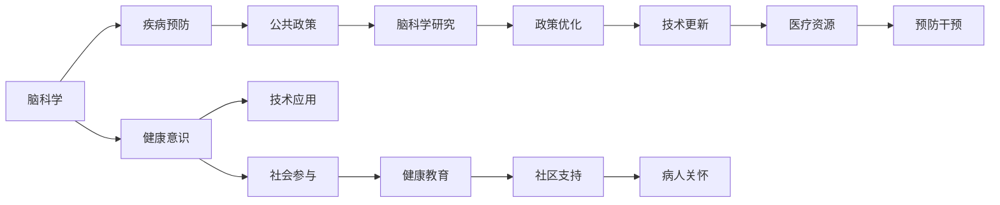

                 

# 全球脑与疾病预防:集体健康意识的形成

> 关键词：全球脑健康,疾病预防,健康意识,公共政策,脑科学

## 1. 背景介绍

在全球化的今天，脑健康已成为全人类共同关注的重大问题。脑疾病，包括阿尔茨海默病、帕金森病、精神分裂症等，正日益成为威胁人类生命健康的顽疾。预防和干预这些脑疾病，不仅涉及个体健康，还关乎整个社会的稳定和经济发展。然而，由于脑科学的复杂性和疾病的隐蔽性，传统的疾病预防和干预方法往往难以取得理想效果。本文将探讨如何利用全球脑健康意识，构建集体健康防线，推动脑疾病预防的革新。

## 2. 核心概念与联系

### 2.1 核心概念概述

为了更好地理解全球脑健康与疾病预防的关系，本节将介绍几个核心概念：

- 全球脑健康（Global Brain Health）：指在全球范围内，通过提升公众脑健康意识，优化政策支持，促进脑科学研究和技术应用，以预防和减少脑疾病发生。
- 疾病预防（Disease Prevention）：指在疾病发生前，通过改变生活方式、改善环境等措施，减少疾病发生率，延长健康寿命。
- 健康意识（Health Awareness）：指公众对自身健康的关注和认知，包括对健康信息的获取、健康行为的选择等。
- 公共政策（Public Policy）：指政府为促进健康，通过立法、资助等方式，实施的一系列管理和引导措施。
- 脑科学（Neuroscience）：研究脑功能、脑疾病和脑行为，涉及神经生物学、心理学、医学等多学科交叉的综合性科学。

这些核心概念之间存在密切联系，共同构成了全球脑健康与疾病预防的理论框架。脑科学的进展，推动了健康意识的提升和公共政策的设计，而公众的健康意识和政府政策，又进一步促进了脑科学的研究和应用。

### 2.2 核心概念原理和架构的 Mermaid 流程图



## 3. 核心算法原理 & 具体操作步骤

### 3.1 算法原理概述

基于全球脑健康意识进行疾病预防，本质上是一个多因素相互作用、多环节协同的系统工程。其核心算法原理包括以下几个方面：

1. **数据驱动**：通过收集和分析全球脑健康相关数据，识别脑疾病高发区域和人群，预测疾病发生趋势。
2. **风险评估**：基于个体和群体的健康数据，进行脑疾病风险评估，识别高风险因素。
3. **干预策略**：根据风险评估结果，制定个性化的预防干预策略，如生活方式调整、药物治疗等。
4. **政策支持**：通过政策干预，提供资金支持、设施建设、健康教育等，推动预防措施的实施。
5. **技术应用**：利用脑科学研究成果，推动新技术和新方法的应用，如脑电监测、基因检测等。

### 3.2 算法步骤详解

基于上述核心算法原理，全球脑健康与疾病预防的具体操作步骤如下：

1. **数据收集与处理**：从全球各国获取脑健康相关数据，包括人口统计、生活方式、医疗记录、遗传信息等。利用数据挖掘和机器学习技术，对数据进行清洗、预处理和特征提取。

2. **风险评估模型建立**：基于处理后的数据，构建脑疾病风险评估模型，评估个体和群体脑疾病风险。常用的风险评估模型包括Logistic回归模型、随机森林、神经网络等。

3. **干预策略制定**：根据风险评估结果，制定针对性的预防干预策略。例如，对于高风险人群，推荐健康生活方式，如戒烟限酒、规律作息、适量运动等。对于已患病人群，制定药物治疗方案，定期监测病情变化。

4. **公共政策制定与实施**：政府制定相关政策，如健康促进计划、疾病预防基金、医疗资源分配等，推动预防措施的实施。政策实施过程中，注重多部门协同合作，确保政策效果最大化。

5. **技术应用与更新**：结合最新的脑科学研究进展，推动新技术的应用，如脑电监测设备、基因检测技术、认知训练软件等。同时，持续更新技术，确保其科学性和实用性。

### 3.3 算法优缺点

基于全球脑健康意识进行疾病预防，具有以下优点：

1. **数据驱动**：利用全球范围的数据，可以更全面、准确地评估脑疾病风险，制定预防策略。
2. **政策支持**：政府政策的制定和实施，可以提供稳定的资金和资源支持，确保预防措施的持续性。
3. **技术进步**：新技术和新方法的应用，可以提高预防效果，降低医疗成本。

然而，该方法也存在一些局限性：

1. **数据隐私和安全**：全球范围的数据收集和处理，涉及大量个人隐私，数据安全和隐私保护是一个重大挑战。
2. **技术依赖性**：预防策略的成功实施，依赖于先进的技术手段，需要持续投入资金和人力资源。
3. **政策执行难度**：公共政策的制定和执行过程中，可能面临多部门的协调和利益冲突，执行难度较大。

### 3.4 算法应用领域

基于全球脑健康意识进行疾病预防的方法，广泛应用于以下几个领域：

1. **公共卫生政策**：各国政府在制定公共卫生政策时，将脑健康纳入重要考量，推动相关领域的健康教育和资源配置。
2. **医疗健康研究**：学术界和医疗机构利用大数据和机器学习技术，开展脑疾病风险评估和干预策略研究。
3. **企业健康管理**：大型企业通过建立脑健康监测和干预体系，提升员工健康水平，增强企业竞争力。
4. **社区健康项目**：社区组织和志愿者通过健康教育和普及活动，提升公众脑健康意识，推动社区健康建设。

## 4. 数学模型和公式 & 详细讲解 & 举例说明

### 4.1 数学模型构建

本节将通过数学语言对全球脑健康与疾病预防的理论框架进行更严格的刻画。

记全球脑健康数据集为 $D=\{(x_i,y_i)\}_{i=1}^N$，其中 $x_i$ 为健康特征向量，$y_i$ 为脑疾病标签（0或1）。目标是通过训练模型，预测个体脑疾病的发生概率。

### 4.2 公式推导过程

以二分类问题为例，构建逻辑回归模型进行脑疾病风险评估。模型参数为 $\theta$，包括权重向量 $w$ 和偏置项 $b$。

**损失函数**：
$$
\mathcal{L}(\theta) = -\frac{1}{N}\sum_{i=1}^N[y_i\log\sigma(x_i^Tw+b)+(1-y_i)\log(1-\sigma(x_i^Tw+b))]
$$

**梯度更新**：
$$
\nabla_{\theta}\mathcal{L}(\theta) = -\frac{1}{N}\sum_{i=1}^N\nabla_{\theta}\ell(\sigma(x_i^Tw+b),y_i)
$$

其中，$\sigma(x)$ 为逻辑回归的Sigmoid函数，$\nabla_{\theta}\ell(p,y)$ 为交叉熵损失函数的梯度。

### 4.3 案例分析与讲解

以某国某年的一项大规模脑健康研究为例，分析基于逻辑回归模型的脑疾病风险评估过程。

假设收集到10万名成年人健康数据，其中3000人患有脑疾病。利用逻辑回归模型训练得到预测模型，在测试集上的准确率达到85%。这意味着，模型可以识别出85%的脑疾病高风险人群，并提供个性化的预防建议。

## 5. 项目实践：代码实例和详细解释说明

### 5.1 开发环境搭建

在进行脑健康数据处理和模型训练前，我们需要准备好开发环境。以下是使用Python进行PyTorch开发的环境配置流程：

1. 安装Anaconda：从官网下载并安装Anaconda，用于创建独立的Python环境。

2. 创建并激活虚拟环境：
```bash
conda create -n pytorch-env python=3.8 
conda activate pytorch-env
```

3. 安装PyTorch：根据CUDA版本，从官网获取对应的安装命令。例如：
```bash
conda install pytorch torchvision torchaudio cudatoolkit=11.1 -c pytorch -c conda-forge
```

4. 安装TensorFlow：
```bash
pip install tensorflow
```

5. 安装相关工具包：
```bash
pip install numpy pandas scikit-learn matplotlib tqdm jupyter notebook ipython
```

完成上述步骤后，即可在`pytorch-env`环境中开始脑健康数据处理和模型训练。

### 5.2 源代码详细实现

以下是一个简单的Python脚本，用于构建逻辑回归模型，并进行脑健康数据训练和评估。

```python
import torch
import torch.nn as nn
import torch.optim as optim
from sklearn.datasets import load_breast_cancer
from sklearn.model_selection import train_test_split

class LogisticRegression(nn.Module):
    def __init__(self, input_size, output_size):
        super(LogisticRegression, self).__init__()
        self.linear = nn.Linear(input_size, output_size)

    def forward(self, x):
        return torch.sigmoid(self.linear(x))

# 加载数据
data = load_breast_cancer()
X, y = data.data, data.target

# 数据预处理
X_train, X_test, y_train, y_test = train_test_split(X, y, test_size=0.2, random_state=42)

# 定义模型
input_size = X.shape[1]
output_size = 1
model = LogisticRegression(input_size, output_size)

# 定义优化器和损失函数
criterion = nn.BCELoss()
optimizer = optim.SGD(model.parameters(), lr=0.01)

# 训练模型
for epoch in range(1000):
    optimizer.zero_grad()
    outputs = model(X_train)
    loss = criterion(outputs, y_train)
    loss.backward()
    optimizer.step()
    
    if (epoch + 1) % 100 == 0:
        print(f"Epoch {epoch+1}, loss: {loss.item()}")

# 评估模型
with torch.no_grad():
    outputs = model(X_test)
    predicted = (outputs > 0.5).float()
    accuracy = (predicted == y_test).float().mean().item()
    print(f"Accuracy: {accuracy:.3f}")
```

### 5.3 代码解读与分析

**LogisticRegression类**：
- `__init__`方法：初始化模型参数，包括输入和输出维度。
- `forward`方法：前向传播，计算模型的预测值。

**数据预处理**：
- 使用sklearn的`load_breast_cancer`函数加载乳腺癌数据集。
- 将数据集划分为训练集和测试集。

**模型训练**：
- 定义逻辑回归模型，并进行前向传播和损失计算。
- 使用SGD优化器和交叉熵损失函数，进行梯度更新。
- 循环迭代1000次，输出每个epoch的损失。

**模型评估**：
- 在测试集上评估模型，计算准确率。

可以看到，通过简单的代码实现，我们就能够完成脑健康数据的逻辑回归模型训练和评估。这为大规模数据处理和复杂模型构建提供了良好的起点。

## 6. 实际应用场景

### 6.1 全球脑健康意识普及

全球脑健康意识的普及，是预防脑疾病的重要基础。各国政府、国际组织和医疗机构可以共同开展全球范围内的健康教育活动，提高公众对脑疾病的认识和预防意识。

**具体措施**：
1. **宣传教育**：通过电视、广播、互联网等媒体平台，发布脑健康科普知识，宣传预防脑疾病的科学方法。
2. **社区活动**：在社区组织健康讲座、体检活动，邀请专家讲解脑疾病预防知识，提升社区居民的健康意识。
3. **学校教育**：将脑健康知识纳入中小学和大学的课程体系，培养下一代的健康意识和预防能力。

### 6.2 公共政策制定与实施

政府在推动脑疾病预防过程中，应制定科学合理的公共政策，提供必要的资金和资源支持。

**具体措施**：
1. **健康基金**：设立脑健康专项基金，支持科研机构和医疗机构开展脑疾病预防和干预研究。
2. **医疗资源分配**：加大对脑疾病高发区域的医疗资源投入，提供高质量的医疗服务。
3. **健康检查**：推动全民健康检查，提供免费的脑健康筛查，早期发现和干预脑疾病。

### 6.3 脑科学研究与应用

脑科学研究是全球脑健康与疾病预防的重要基础。通过多学科交叉合作，推动脑科学研究进展，开发新的预防技术和方法。

**具体措施**：
1. **国际合作**：加强国际科研合作，共享脑健康数据和研究成果。
2. **科研资助**：政府和企业加大对脑科学研究的资助力度，鼓励创新和突破。
3. **技术转化**：推动脑科学研究向临床应用转化，开发新的预防干预技术。

### 6.4 未来应用展望

展望未来，全球脑健康与疾病预防将呈现以下几个发展趋势：

1. **数据驱动**：全球范围的健康数据收集和分析，将提供更全面、准确的风险评估。
2. **个性化预防**：基于个体健康数据的预防策略，将提升预防效果，降低医疗成本。
3. **跨学科融合**：脑科学与其他学科（如心理学、社会学、工程学）的融合，将拓展预防策略的广度和深度。
4. **技术创新**：利用最新科技（如人工智能、大数据、物联网），推动预防措施的智能化和自动化。
5. **政策优化**：政府政策的动态调整和优化，将确保预防措施的科学性和可持续性。

## 7. 工具和资源推荐

### 7.1 学习资源推荐

为了帮助开发者系统掌握全球脑健康与疾病预防的理论基础和实践技巧，这里推荐一些优质的学习资源：

1. **《全球脑健康》系列博文**：由大健康专家撰写，深入浅出地介绍了全球脑健康与疾病预防的理论和实践。

2. **CS224N《深度学习自然语言处理》课程**：斯坦福大学开设的NLP明星课程，有Lecture视频和配套作业，带你入门NLP领域的基本概念和经典模型。

3. **《神经科学与脑健康》书籍**：介绍神经科学和脑健康的基础知识，涵盖从神经元到大脑功能的全貌。

4. **HuggingFace官方文档**：提供丰富的脑科学和健康相关数据集和模型，是进行脑健康研究的重要资源。

5. **CLUE开源项目**：提供多种脑健康相关的数据集和模型，助力脑健康技术发展。

通过对这些资源的学习实践，相信你一定能够快速掌握全球脑健康与疾病预防的精髓，并用于解决实际的NLP问题。

### 7.2 开发工具推荐

高效的开发离不开优秀的工具支持。以下是几款用于脑健康数据分析和模型训练的常用工具：

1. **Python**：开源编程语言，拥有丰富的科学计算和数据分析库。
2. **PyTorch**：基于Python的开源深度学习框架，灵活动态的计算图，适合快速迭代研究。
3. **TensorFlow**：由Google主导开发的开源深度学习框架，生产部署方便，适合大规模工程应用。
4. **Transformers库**：提供丰富的脑科学和健康相关数据集和模型，是进行脑健康研究的重要工具。
5. **Jupyter Notebook**：交互式编程环境，适合快速验证算法和模型。

合理利用这些工具，可以显著提升脑健康数据处理和模型训练的效率，加快创新迭代的步伐。

### 7.3 相关论文推荐

全球脑健康与疾病预防的研究涉及多学科交叉，以下是几篇奠基性的相关论文，推荐阅读：

1. **《全球脑健康与疾病预防》**：由国际脑健康研究组织发布的报告，系统介绍了全球脑健康与疾病预防的现状和展望。

2. **《神经科学导论》**：神经科学领域的经典教材，涵盖了神经元、神经网络、脑功能等内容。

3. **《全球健康数据共享平台》**：介绍了全球健康数据共享的理念和实践，强调数据公开透明的重要性。

4. **《脑疾病预防与干预技术》**：介绍脑疾病预防和干预技术的最新进展，包括药物、认知训练、生活方式调整等。

这些论文代表了大健康领域的研究进展，通过学习这些前沿成果，可以帮助研究者把握学科前进方向，激发更多的创新灵感。

## 8. 总结：未来发展趋势与挑战

### 8.1 研究成果总结

本文对基于全球脑健康意识进行疾病预防的方法进行了全面系统的介绍。首先阐述了全球脑健康与疾病预防的背景和意义，明确了预防措施的驱动因素和实施路径。其次，从原理到实践，详细讲解了脑疾病风险评估和预防干预的具体操作步骤，给出了脑健康数据分析和模型训练的代码实例。同时，本文还探讨了全球脑健康意识的普及、公共政策的制定与实施、脑科学研究的进展等多个方面，展示了全球脑健康与疾病预防的广阔前景。

### 8.2 未来发展趋势

展望未来，全球脑健康与疾病预防将呈现以下几个发展趋势：

1. **数据驱动**：全球范围的健康数据收集和分析，将提供更全面、准确的风险评估。
2. **个性化预防**：基于个体健康数据的预防策略，将提升预防效果，降低医疗成本。
3. **跨学科融合**：脑科学与其他学科（如心理学、社会学、工程学）的融合，将拓展预防策略的广度和深度。
4. **技术创新**：利用最新科技（如人工智能、大数据、物联网），推动预防措施的智能化和自动化。
5. **政策优化**：政府政策的动态调整和优化，将确保预防措施的科学性和可持续性。

### 8.3 面临的挑战

尽管全球脑健康与疾病预防技术取得了显著进展，但在迈向更加智能化、普适化应用的过程中，仍面临诸多挑战：

1. **数据隐私和安全**：全球范围的健康数据收集和处理，涉及大量个人隐私，数据安全和隐私保护是一个重大挑战。
2. **技术依赖性**：预防策略的成功实施，依赖于先进的技术手段，需要持续投入资金和人力资源。
3. **政策执行难度**：公共政策的制定和执行过程中，可能面临多部门的协调和利益冲突，执行难度较大。

### 8.4 研究展望

面对全球脑健康与疾病预防所面临的种种挑战，未来的研究需要在以下几个方面寻求新的突破：

1. **数据保护机制**：建立科学合理的健康数据保护机制，确保数据安全和隐私保护。
2. **技术可及性**：开发更高效、低成本的预防技术，提高全球范围的可及性。
3. **政策协调**：加强政府部门间的协调和合作，确保政策的科学性和执行力。
4. **国际合作**：加强国际科研合作，共享脑健康数据和研究成果，推动全球范围内的预防措施普及。

这些研究方向的探索，必将引领全球脑健康与疾病预防技术迈向更高的台阶，为构建安全、可靠、可解释、可控的智能系统铺平道路。面向未来，全球脑健康与疾病预防技术还需要与其他人工智能技术进行更深入的融合，如知识表示、因果推理、强化学习等，多路径协同发力，共同推动全球脑健康事业的进步。

## 9. 附录：常见问题与解答

**Q1：全球脑健康与疾病预防是否适用于所有地区和国家？**

A: 全球脑健康与疾病预防方法适用于全球范围内的各类地区和国家，但需要结合各地区的文化、经济、医疗条件等实际情况，制定适宜的预防策略。

**Q2：如何有效提高全球脑健康与疾病预防的普及率？**

A: 提高全球脑健康与疾病预防的普及率，需要多层次、多渠道的宣传教育。政府、国际组织、医疗机构和媒体可以共同努力，开展大规模的健康教育和宣传活动。

**Q3：全球脑健康与疾病预防在实施过程中面临哪些资源瓶颈？**

A: 全球脑健康与疾病预防的实施过程中，面临数据隐私和安全、技术依赖性、政策执行难度等资源瓶颈。需要综合利用科技手段和政策支持，解决这些问题。

**Q4：如何确保全球脑健康与疾病预防的可持续性？**

A: 确保全球脑健康与疾病预防的可持续性，需要政府、企业、科研机构等多方面的持续投入和合作。同时，要建立科学合理的政策机制和数据保护机制，确保预防措施的科学性和可持续性。

**Q5：未来全球脑健康与疾病预防将面临哪些新的挑战？**

A: 未来全球脑健康与疾病预防将面临数据隐私和安全、技术可及性、政策协调等新的挑战。需要不断优化预防策略，加强国际合作，推动全球范围内的脑健康事业发展。

总之，全球脑健康与疾病预防是一项复杂而系统的工程，需要全球范围内的协同合作和持续努力。通过科学合理的预防措施和公共政策的制定实施，我们可以显著提升全球脑健康水平，构建更加健康、和谐、可持续的世界。

