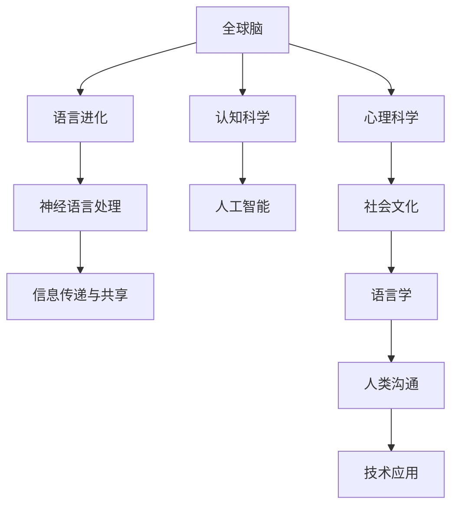

                 

# 全球脑与语言进化:人类沟通方式的新维度

在深入探讨人工智能领域的前沿话题时，我们不得不重新审视人类大脑与语言之间的深刻联系。这一研究领域不仅触及了神经科学的边界，还触及了语言学和人工智能技术的交叉领域，其深远的意义在于揭示了人类沟通方式的新维度，并对未来技术发展提出了诸多启发。

## 1. 背景介绍

### 1.1 问题由来
随着人工智能技术的迅猛发展，尤其是深度学习与自然语言处理（NLP）领域的突破，人们开始对人类大脑如何处理语言有了新的理解。这不仅涉及到语言学的基础理论，还牵涉到神经科学、心理学和计算机科学的交叉应用。语言不仅仅是信息的载体，更是人类认知与社交活动的核心媒介。因此，深入研究语言与大脑的互动过程，对于人工智能的进一步发展有着重要意义。

### 1.2 问题核心关键点
本文的核心理论问题集中在两个方面：一是全球脑与语言进化的关系，二是如何从这一关系中提取新的沟通维度，为人工智能的发展提供借鉴。这两个问题涉及神经科学、认知科学和人工智能的多个层面，其回答将帮助我们更好地理解语言在人工智能中的潜在应用。

## 2. 核心概念与联系

### 2.1 核心概念概述
1. **全球脑（Global Brain）**：全球脑理论由Vladimir Vapnik于20世纪90年代提出，将大脑视为一个全球性的、动态的网络系统，其中各个部分通过神经元间的连接不断交换信息，实现了高度协同的信息处理和复杂行为的执行。
2. **语言进化（Language Evolution）**：语言进化不仅指语言的自然演变过程，更包含人类社会与文化对语言形态、使用习惯和结构的影响。语言是人类智慧的结晶，也是认知与社交的基石。
3. **神经语言处理（Neural Language Processing）**：这是一种将人工智能与神经科学结合的领域，研究大脑如何处理语言，并尝试构建能够模仿人类语言理解与生成能力的算法。
4. **信息传递与共享（Information Transmission and Sharing）**：探讨人类大脑在信息处理、记忆与交流中的机制，以及这些机制如何被不同文化与环境塑造。

### 2.2 核心概念原理和架构的 Mermaid 流程图


此图展示了全球脑、语言进化、神经语言处理、信息传递与共享等多个核心概念之间的联系。这些概念交织在一起，共同构建了人类大脑与语言互动的复杂网络。

## 3. 核心算法原理 & 具体操作步骤

### 3.1 算法原理概述
全球脑与语言进化的研究涉及多学科知识的整合。在此背景下，构建算法原理需要涵盖神经科学、认知科学、语言学等多个领域的知识。核心算法原理大致可以分为以下几个步骤：

1. **数据采集与处理**：收集全球不同文化与环境下的脑成像数据，并对这些数据进行预处理，以去除噪声和误差。
2. **模式识别与分析**：使用机器学习算法，如深度神经网络（DNNs），对脑成像数据进行分析，识别出与语言处理相关的神经活动模式。
3. **进化模型构建**：基于识别出的模式，构建反映语言进化的数学模型，模拟语言在不同文化背景下的演变过程。
4. **模型验证与优化**：将模型应用于不同文化背景的语言样本，验证模型的准确性与泛化能力，并进行必要的调整与优化。

### 3.2 算法步骤详解
以神经语言处理为例，详解其具体步骤：

1. **数据预处理**：
    - 收集全球范围内的脑成像数据，包括fMRI（功能性磁共振成像）和EEG（脑电图）数据。
    - 对数据进行清洗，去除异常值与噪声。
    - 数据标准化处理，确保不同样本间的一致性。

2. **特征提取**：
    - 使用DNNs提取脑成像数据的特征，如脑区活动强度与时间序列。
    - 特征选择与降维，去除无关信息，提高模型效率。

3. **模型训练**：
    - 构建基于DNNs的神经语言处理模型，如递归神经网络（RNNs）或Transformer模型。
    - 在标注数据上训练模型，使用交叉熵损失函数优化模型参数。
    - 应用正则化技术，防止过拟合。

4. **模型评估与优化**：
    - 在测试集上评估模型性能，使用指标如准确率、F1分数等。
    - 根据评估结果，调整模型架构与参数，优化模型性能。

### 3.3 算法优缺点
**优点**：
1. **多学科整合**：将神经科学、语言学与计算机科学结合，提供多维度的分析视角。
2. **数据驱动**：基于大量实证数据，模型具有较高的可靠性和泛化能力。
3. **算法灵活**：神经网络等模型具有高度的灵活性，能够适应不同任务与数据集。

**缺点**：
1. **数据复杂性**：全球脑与语言进化涉及多文化、多环境背景，数据采集与处理复杂。
2. **模型复杂性**：构建复杂的神经网络模型需要大量计算资源与时间。
3. **理论基础薄弱**：当前对全球脑与语言进化的理论基础尚未完全成熟，缺乏统一的理论框架。

### 3.4 算法应用领域
基于全球脑与语言进化的算法原理，可以应用于多个领域，例如：

1. **语言习得研究**：理解语言习得过程中大脑的活动模式，为儿童语言教育提供科学依据。
2. **认知障碍治疗**：通过分析脑成像数据，识别语言障碍的神经机制，提供针对性治疗。
3. **跨文化交流**：研究不同文化背景下语言进化的差异，优化跨文化交流工具与系统。
4. **情感分析与生成**：分析情感与语言之间的关系，开发更人性化的情感生成与识别系统。
5. **机器人与人机交互**：构建能够理解人类语言的智能系统，提升人机交互的自然度与智能性。

## 4. 数学模型和公式 & 详细讲解 & 举例说明

### 4.1 数学模型构建
以神经语言处理为例，构建数学模型：

设大脑活动数据为 $X$，语言特征为 $Y$，神经语言处理模型为 $f$，其数学模型可以表示为：
$$
Y = f(X)
$$

其中，$f$ 是神经网络，$X$ 是输入的脑成像数据，$Y$ 是输出的语言特征。

### 4.2 公式推导过程
以RNN模型为例，其基本公式为：
$$
h_t = tanh(W_{xh}x_{t-1} + W_{hh}h_{t-1} + b_h)
$$
$$
y_t = softmax(W_{hy}h_t + b_y)
$$

其中 $h_t$ 为隐藏状态，$y_t$ 为输出，$x_t$ 为输入序列，$W_{xh}$ 和 $W_{hy}$ 为权重矩阵，$b_h$ 和 $b_y$ 为偏置项。

### 4.3 案例分析与讲解
以情感识别为例，神经语言处理模型可以采用RNNs或Transformer模型。模型在处理语言数据时，通过多层网络结构提取语义特征，并最终输出情感分类结果。

例如，对于一句话 "I am very happy today"，模型将提取情感关键词 "happy"，并基于上下文信息确定情感极性为正面。通过大量数据训练，模型能够学习到情感与语言特征之间的映射关系，从而实现情感识别任务。

## 5. 项目实践：代码实例和详细解释说明

### 5.1 开发环境搭建
以下是使用Python与TensorFlow搭建神经语言处理项目的环境配置步骤：

1. 安装Anaconda：
```bash
conda create -n pytorch-env python=3.8
conda activate pytorch-env
```

2. 安装依赖库：
```bash
pip install numpy pandas scikit-learn tensorflow transformers
```

3. 配置TensorBoard：
```bash
tensorboard --logdir=logs --port=6006
```

### 5.2 源代码详细实现
以情感识别为例，使用RNN模型进行代码实现：

```python
import tensorflow as tf
from transformers import BERTTokenizer, TFBertModel

# 加载预训练模型
tokenizer = BERTTokenizer.from_pretrained('bert-base-cased')
model = TFBertModel.from_pretrained('bert-base-cased')

# 定义模型结构
class RNN(tf.keras.Model):
    def __init__(self):
        super(RNN, self).__init__()
        self.lstm = tf.keras.layers.LSTM(128)
        self.dense = tf.keras.layers.Dense(1, activation='sigmoid')
    
    def call(self, inputs):
        _, hidden = model(inputs)
        outputs = self.dense(hidden)
        return outputs

# 构建模型
model = RNN()

# 编译模型
model.compile(optimizer=tf.keras.optimizers.Adam(learning_rate=1e-3), loss='binary_crossentropy', metrics=['accuracy'])

# 训练模型
model.fit(x_train, y_train, epochs=10, validation_data=(x_val, y_val))
```

### 5.3 代码解读与分析
上述代码实现了基于BERT的情感识别模型，具体步骤包括：

1. **模型加载**：使用Transformers库加载预训练的BERT模型，并使用Tokenizer进行文本预处理。
2. **模型定义**：定义RNN结构，包含LSTM层和输出层。
3. **模型编译**：选择Adam优化器与二元交叉熵损失函数。
4. **模型训练**：使用训练集与验证集进行模型训练。

### 5.4 运行结果展示
模型训练结束后，可以使用以下代码进行情感分类预测：

```python
import pandas as pd

# 加载测试集
test_data = pd.read_csv('test.csv')

# 预处理测试集
test_inputs = tokenizer(test_data['text'], return_tensors='tf', padding=True, truncation=True, max_length=128)

# 进行情感预测
predictions = model.predict(test_inputs)

# 输出预测结果
print(test_data['text'].tolist())
print(predictions)
```

## 6. 实际应用场景

### 6.1 智能客服系统
智能客服系统能够利用神经语言处理技术，理解用户查询并提供智能答复。例如，在智能客服系统中，神经语言处理模型能够分析用户输入的自然语言，识别意图并从知识库中提取相关信息进行回复。这不仅能提高客服效率，还能提供更加个性化的服务体验。

### 6.2 金融舆情监测
金融舆情监测系统通过分析社交媒体、新闻等文本数据，及时发现市场波动与舆情变化。神经语言处理技术能够识别舆情中的关键信息，并进行情感分析，为金融机构提供决策支持。

### 6.3 个性化推荐系统
个性化推荐系统通过分析用户的浏览、点击等行为数据，生成个性化的推荐内容。神经语言处理模型能够理解用户的兴趣偏好，提供更加贴合其需求的内容，提升用户体验。

### 6.4 未来应用展望
随着神经语言处理技术的不断进步，未来将有更多应用场景得以实现。例如，在医疗领域，神经语言处理技术能够帮助医生理解病历，提高诊断准确性。在教育领域，神经语言处理技术能够辅助教学，提供个性化学习资源。

## 7. 工具和资源推荐

### 7.1 学习资源推荐
1. **《深度学习与神经网络》**：介绍了深度学习的基础知识和神经网络架构，适合初学者入门。
2. **Coursera的《自然语言处理》课程**：由斯坦福大学教授讲授，涵盖NLP的各个方面，包括神经语言处理。
3. **《TensorFlow实战》**：介绍了TensorFlow的使用方法与实例，适合动手实践。

### 7.2 开发工具推荐
1. **Anaconda**：用于创建和管理Python环境，方便工具安装与切换。
2. **Jupyter Notebook**：支持交互式编程，方便代码测试与实验记录。
3. **TensorBoard**：可视化工具，帮助调试与优化模型。

### 7.3 相关论文推荐
1. **"Attention is All You Need"**：提出了Transformer模型，标志着自注意力机制在神经语言处理中的应用。
2. **"BERT: Pre-training of Deep Bidirectional Transformers for Language Understanding"**：提出BERT模型，在多项NLP任务中取得了新突破。
3. **"Human Language Processing with Sequence-to-Sequence Models"**：介绍了基于序列到序列的模型在语言生成与处理中的应用。

## 8. 总结：未来发展趋势与挑战

### 8.1 研究成果总结
本文从全球脑与语言进化的角度，探讨了神经语言处理技术的应用潜力与未来发展方向。研究表明，神经语言处理模型能够理解与生成自然语言，具备强大的情感识别与生成能力。未来，该技术将在更多领域得到应用，提升人机交互的自然性与智能化水平。

### 8.2 未来发展趋势
1. **多模态信息融合**：神经语言处理技术将融合视觉、听觉等多模态信息，提升对复杂场景的理解能力。
2. **知识图谱与语义理解**：结合知识图谱与语义分析，提高模型的语义理解与生成能力。
3. **跨文化交流**：针对不同文化背景，构建适应性更强的神经语言处理模型，促进跨文化交流。
4. **情感计算与心理分析**：深入研究情感与语言之间的关系，开发情感计算与心理分析工具。

### 8.3 面临的挑战
1. **数据获取难度**：全球脑与语言进化的研究需要大量高质量数据，获取难度较大。
2. **模型复杂性**：神经语言处理模型结构复杂，训练与优化耗时较多。
3. **理论基础薄弱**：当前对全球脑与语言进化的理论研究尚不成熟，缺乏统一的理论框架。

### 8.4 研究展望
1. **多文化适应性研究**：针对不同文化背景，优化神经语言处理模型，提高跨文化适应性。
2. **情感计算与心理健康**：研究情感与心理健康之间的关系，开发情感计算与心理健康监测工具。
3. **多模态信息处理**：融合视觉、听觉等多模态信息，提升对复杂场景的理解能力。

## 9. 附录：常见问题与解答

**Q1: 神经语言处理模型的训练需要大量数据，如何在数据不足的情况下训练模型？**

A: 可以利用数据增强技术，如回译、近义替换等，扩充训练数据。此外，使用预训练模型（如BERT）进行微调，可以在数据量较少的情况下获得较好的性能。

**Q2: 神经语言处理模型在处理语言时，如何避免过拟合？**

A: 可以使用正则化技术，如L2正则、Dropout等，避免模型过拟合。此外，通过提前终止训练、使用验证集监控模型性能等方式，也可以有效避免过拟合。

**Q3: 神经语言处理模型在实际应用中，如何保证模型的泛化能力？**

A: 在模型训练时，应使用包含不同文化背景与情感表达的数据集，确保模型具有较强的泛化能力。同时，定期评估模型性能，及时调整模型参数，保证模型适应新的数据分布。

**Q4: 神经语言处理模型在处理大规模数据时，如何优化计算效率？**

A: 可以使用分布式计算、并行训练等技术，加速模型训练过程。此外，采用模型压缩、稀疏化存储等方法，优化模型的存储与计算效率。

---

作者：禅与计算机程序设计艺术 / Zen and the Art of Computer Programming

