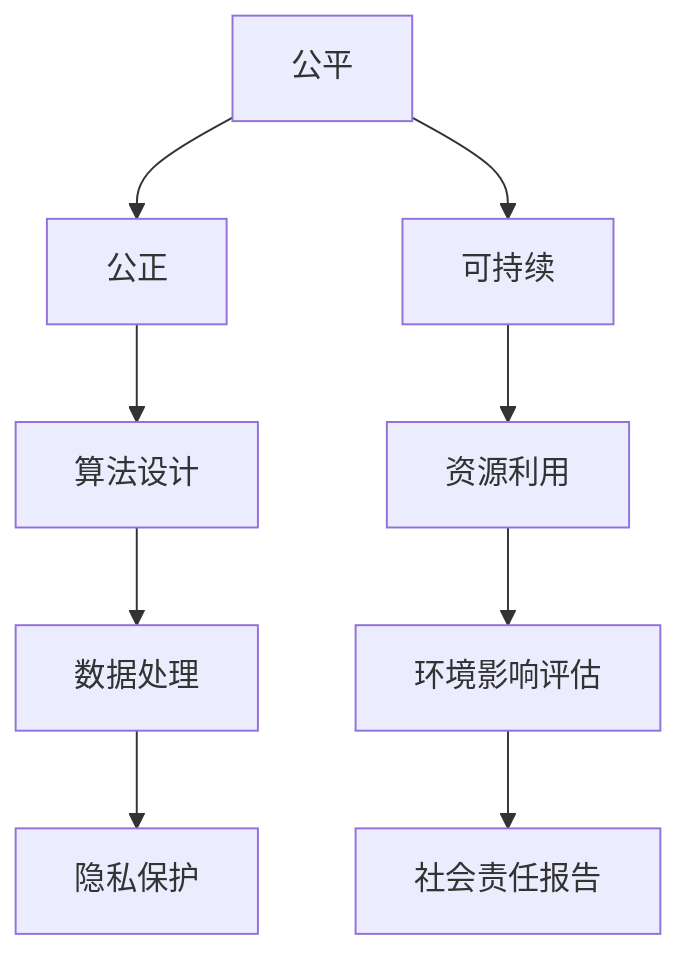

                 

# 公平、公正、可持续：人类计算的 ethical 原则

在数字时代的浪潮中，人工智能和计算技术正以前所未有的速度和规模重塑着人类社会的方方面面。从自动驾驶、医疗诊断到金融交易、社交媒体，计算技术的触角已经深入到人类生活的每一个角落。然而，随着技术的广泛应用，一些隐性的伦理问题逐渐浮出水面，引发了关于计算伦理的深刻思考。本文旨在探讨人类计算中的 ethical 原则，提出公平、公正、可持续的计算伦理框架，为未来的技术发展提供指导。

## 1. 背景介绍

### 1.1 技术进展与伦理挑战

随着深度学习、大数据、云计算等技术的进步，人工智能和计算技术在各行各业的应用日益广泛。从提升生产效率到改善民生福祉，计算技术展现出巨大的潜力和价值。然而，与此同时，计算伦理问题也逐渐凸显：

- **数据隐私**：数据是人工智能模型的基础，数据的收集、存储、使用过程中涉及用户隐私和数据安全问题。
- **偏见与歧视**：算法模型在训练和使用过程中，可能由于数据偏差或设计缺陷，导致输出结果的偏见和歧视。
- **就业影响**：自动化和智能化技术的普及，可能导致部分传统岗位消失，引发就业结构的变动和社会不稳定。
- **伦理责任**：在面对技术决策和应用选择时，如何权衡技术效益与社会效益，承担相应的伦理责任，成为重要的课题。

### 1.2 伦理原则的重要性

计算伦理不仅是技术发展的内在要求，更是社会责任和人类价值的体现。伦理原则的缺失，可能导致技术带来的负面影响被放大，甚至引发社会的不公和冲突。因此，在计算技术的研发和应用中，应当将伦理原则作为核心考量，确保技术的发展路径符合人类社会的价值观和利益。

## 2. 核心概念与联系

### 2.1 核心概念概述

- **公平(Fairness)**：指计算系统在处理不同用户或不同群体时，应保证相同或相近的处理结果。
- **公正(Justice)**：指计算系统在设计和实现过程中，应基于合理的标准和规则，避免歧视和偏见。
- **可持续(Sustainability)**：指计算系统在设计、运行和退役过程中，应考虑环境影响和社会责任，促进资源的可持续利用。

这些概念相互关联，共同构成了计算伦理的基石。公平和公正体现了计算系统对社会的责任和影响，而可持续则强调了计算技术对环境和社会的长远影响。

### 2.2 Mermaid 流程图



这个流程图展示了公平、公正和可持续三个伦理原则与计算系统的各个环节之间的联系。算法设计应确保公正，数据处理应保证公平，资源利用应促进可持续，环境影响评估和社会责任报告则是对整体系统性能的综合考量。

## 3. 核心算法原理 & 具体操作步骤

### 3.1 算法原理概述

计算伦理的实现，需要从算法设计和应用两方面入手。算法的公正性主要依赖于训练数据的代表性和算法的透明度。而系统的公平性则需要通过模型评估和数据处理技术实现。

公平性可以通过以下方法实现：
- **预处理**：对数据进行标准化和归一化处理，减少数据偏见。
- **算法选择**：选择经过公平性评估的算法，避免算法本身的偏见。
- **后处理**：对模型输出进行后处理，纠正偏见的输出结果。

公正性则通过以下几个步骤实现：
- **透明算法**：设计透明的算法模型，使模型决策过程可解释、可审查。
- **多样性数据**：使用多样化的数据集进行模型训练，减少数据偏见。
- **公平指标**：定义和评估公平指标，如平均准确率、召回率、F1分数等。

可持续性主要涉及资源利用和环境影响评估：
- **能效设计**：设计能效高、碳排放低的计算系统。
- **循环利用**：实现硬件和软件资源的循环利用，降低资源浪费。
- **环境监测**：使用环境监测工具，实时评估计算系统的环境影响。

### 3.2 算法步骤详解

#### 3.2.1 公平性实现

1. **数据预处理**：使用标准化和归一化技术，对数据进行预处理，减少数据偏差。例如，使用z-score标准化方法，将所有数据缩放到均值为0，标准差为1的分布中。

2. **算法选择**：选择经过公平性测试的算法，如在人脸识别领域使用Viola-Jones算法，其在处理不同种族和性别时具有较好的公平性表现。

3. **后处理**：对模型输出进行后处理，纠正偏见的输出结果。例如，在多目标识别任务中，对输出结果进行校正，确保每个类别的识别率相等。

#### 3.2.2 公正性实现

1. **透明算法设计**：设计透明的算法模型，使模型决策过程可解释、可审查。例如，使用线性回归模型，其权重可以直接解释为特征的重要性。

2. **多样性数据集**：使用多样化的数据集进行模型训练，减少数据偏见。例如，在性别分类任务中，使用包含不同性别比例的数据集。

3. **公平指标评估**：定义和评估公平指标，如平均准确率、召回率、F1分数等。例如，在信用评分任务中，使用均衡性误差（Equalized Odds）指标评估模型的公平性。

#### 3.2.3 可持续性实现

1. **能效设计**：设计能效高、碳排放低的计算系统。例如，使用GPU代替CPU，通过异构计算优化能效。

2. **循环利用**：实现硬件和软件资源的循环利用，降低资源浪费。例如，使用容器化技术，实现虚拟机资源的动态分配和回收。

3. **环境监测**：使用环境监测工具，实时评估计算系统的环境影响。例如，使用EnergyCost库，实时监测计算系统的能耗和碳排放。

### 3.3 算法优缺点

#### 3.3.1 公平性实现

优点：
- 减少数据偏差，提升模型公平性。
- 降低算法偏见，提高模型透明性。
- 确保不同用户或群体的相同处理结果。

缺点：
- 数据预处理和后处理可能引入新的偏差。
- 算法选择和评估需大量时间和资源。
- 难以消除所有数据偏差，仍可能存在隐性偏见。

#### 3.3.2 公正性实现

优点：
- 提升模型透明性，便于审查和监管。
- 使用多样性数据集，减少数据偏见。
- 定义和评估公平指标，提高模型评估的科学性。

缺点：
- 数据收集和标注成本高。
- 算法设计和评估复杂度高。
- 难以完全消除算法偏见，仍需人工干预。

#### 3.3.3 可持续性实现

优点：
- 降低计算系统的能耗和碳排放，促进可持续发展。
- 实现资源循环利用，降低资源浪费。
- 实时监测环境影响，便于管理。

缺点：
- 能效设计和技术实现复杂度高。
- 需要额外的监测和管理系统资源。
- 难以完全消除环境影响，仍需持续优化。

### 3.4 算法应用领域

#### 3.4.1 公平性应用

1. **招聘系统**：在招聘系统中选择公平的算法，确保不同性别的应聘者获得同等的机会。例如，使用公平性评估方法，对简历评分算法进行评估，确保评分公正。

2. **金融风控**：在金融风控系统中，使用公平性评估方法，确保不同人群的贷款审批率相同。例如，在贷款审批任务中，使用均衡性误差指标评估模型的公平性。

#### 3.4.2 公正性应用

1. **司法判决**：在司法判决系统中，使用公正性评估方法，确保不同性别、种族的被告获得公平的判决。例如，在判决任务中，使用公平性指标评估模型的公正性。

2. **医疗诊断**：在医疗诊断系统中，使用公正性评估方法，确保不同性别的患者获得公平的医疗资源。例如，在诊断任务中，使用公平性指标评估模型的公正性。

#### 3.4.3 可持续性应用

1. **能源管理**：在能源管理系统中，设计能效高的计算系统，降低能源消耗和碳排放。例如，在智能电网中，使用分布式计算技术，提升能源利用效率。

2. **数据中心**：在数据中心中，实现资源循环利用，降低资源浪费。例如，使用冷热管道技术，实现能源的循环利用。

## 4. 数学模型和公式 & 详细讲解 & 举例说明

### 4.1 数学模型构建

公平性、公正性和可持续性可以通过数学模型和公式进行量化和评估。以下介绍几个常用的模型和公式：

#### 4.1.1 均衡性误差（Equalized Odds）

均衡性误差（Equalized Odds）是一种衡量公平性的指标，适用于多类别分类问题。其定义如下：

$$
\text{EO} = \mathbb{E}_{x}[\text{Pr}(\hat{y} = 1|y = 1, x)] + \mathbb{E}_{x}[\text{Pr}(\hat{y} = 0|y = 0, x)] = \frac{1}{2}
$$

其中，$\hat{y}$ 表示模型预测的类别，$y$ 表示真实类别。均衡性误差要求模型在正面类别和负面类别上的预测准确率相同。

#### 4.1.2 差异度量（Disparate Impact）

差异度量（Disparate Impact）是一种衡量公正性的指标，适用于二分类问题。其定义如下：

$$
\text{DI} = \text{Pr}(y = 1|X) - \text{Pr}(y = 1|X, S)
$$

其中，$y$ 表示目标变量，$X$ 表示特征变量，$S$ 表示受保护变量（如性别、种族）。差异度量衡量模型在受保护变量上的预测偏差。

#### 4.1.3 碳足迹评估（Carbon Footprint）

碳足迹评估是一种衡量可持续性的指标，用于评估计算系统的环境影响。其计算公式如下：

$$
\text{CF} = \sum_{i=1}^{n} \text{CO}_2(i) \times \text{CPU}_i
$$

其中，$\text{CO}_2(i)$ 表示第 $i$ 个任务的碳排放量，$\text{CPU}_i$ 表示第 $i$ 个任务的计算时间。碳足迹评估要求计算系统的总碳排放量最小化。

### 4.2 公式推导过程

#### 4.2.1 均衡性误差推导

均衡性误差要求模型在正面类别和负面类别上的预测准确率相同。设模型预测为 $\hat{y} = 1$ 的样本数为 $N_1$，实际为正面的样本数为 $N_1^+$，实际为负面的样本数为 $N_0$，则均衡性误差为：

$$
\begin{aligned}
\text{EO} &= \frac{N_1^+}{N_1} + \frac{N_0 - N_1^+}{N_0} \\
&= \frac{N_1^+}{N_1} + \frac{N_0}{N_0} - \frac{N_1^+}{N_0} \\
&= 1 - \frac{N_1^+}{N_0}
\end{aligned}
$$

当模型在正面类别和负面类别上的预测准确率相等时，$\frac{N_1^+}{N_0} = 0.5$，均衡性误差为 $\frac{1}{2}$。

#### 4.2.2 差异度量推导

差异度量衡量模型在受保护变量上的预测偏差。设模型预测为正类的样本数为 $N_+$，实际为正类的样本数为 $N_+$，实际为负类的样本数为 $N_-$，受保护变量为 $S$，则差异度量为：

$$
\begin{aligned}
\text{DI} &= \text{Pr}(y = 1|X, S = 1) - \text{Pr}(y = 1|X, S = 0) \\
&= \frac{N_+(S = 1)}{N_+(S = 1) + N_+(S = 0)} - \frac{N_+(S = 0)}{N_+(S = 1) + N_+(S = 0)}
\end{aligned}
$$

当模型在受保护变量上的预测准确率相等时，$\text{DI} = 0$，表示模型公正。

#### 4.2.3 碳足迹评估推导

碳足迹评估要求计算系统的总碳排放量最小化。设第 $i$ 个任务的碳排放量为 $\text{CO}_2(i)$，计算时间为 $\text{CPU}_i$，则碳足迹为：

$$
\text{CF} = \sum_{i=1}^{n} \text{CO}_2(i) \times \text{CPU}_i
$$

碳足迹评估要求总碳排放量最小化，即：

$$
\min_{i=1}^{n} \text{CO}_2(i) \times \text{CPU}_i
$$

### 4.3 案例分析与讲解

#### 4.3.1 均衡性误差应用

假设有一个贷款审批系统，用于评估借款人的信用风险。使用均衡性误差指标评估模型的公平性。设模型预测为正类的样本数为 $N_+$，实际为正类的样本数为 $N_+$，实际为负类的样本数为 $N_-$，则均衡性误差为：

$$
\text{EO} = \frac{N_+}{N_+ + N_-}
$$

如果模型对男性和女性借款人的预测准确率相同，即 $N_+$ 和 $N_-$ 相等，则均衡性误差为 $\frac{1}{2}$。

#### 4.3.2 差异度量应用

假设有一个招聘系统，用于筛选求职者的简历。使用差异度量指标评估模型的公正性。设模型预测为正类的样本数为 $N_+$，实际为正类的样本数为 $N_+$，实际为负类的样本数为 $N_-$，受保护变量为性别，则差异度量为：

$$
\text{DI} = \text{Pr}(y = 1|X, S = 1) - \text{Pr}(y = 1|X, S = 0)
$$

如果模型对男女求职者的预测准确率相同，即 $\text{DI} = 0$，则表示模型公正。

#### 4.3.3 碳足迹评估应用

假设有一个数据中心，用于存储和管理海量数据。使用碳足迹评估指标评估系统的可持续性。设每个存储服务器的碳排放量为 $\text{CO}_2$，计算时间为 $\text{CPU}$，则数据中心的总碳足迹为：

$$
\text{CF} = \sum_{i=1}^{n} \text{CO}_2(i) \times \text{CPU}_i
$$

通过优化服务器配置和资源分配，使总碳足迹最小化，实现系统的可持续性。

## 5. 项目实践：代码实例和详细解释说明

### 5.1 开发环境搭建

在进行公平、公正、可持续计算伦理的实践时，需要准备相应的开发环境。以下是Python和R语言的安装和配置流程：

#### 5.1.1 Python环境配置

1. 安装Anaconda：从官网下载并安装Anaconda，用于创建独立的Python环境。

2. 创建并激活虚拟环境：
```bash
conda create -n ethics-env python=3.8 
conda activate ethics-env
```

3. 安装必要的Python包：
```bash
conda install numpy pandas scikit-learn matplotlib tqdm jupyter notebook ipython
```

4. 安装R语言：
```bash
sudo apt-get install r
```

5. 安装必要的R包：
```bash
install.packages("caret")
install.packages("dplyr")
install.packages("tidyverse")
```

### 5.2 源代码详细实现

#### 5.2.1 Python代码实现

以下是一个使用Python实现公平性评估的示例代码：

```python
import numpy as np
from sklearn.metrics import roc_auc_score

# 生成模拟数据
N = 100
X = np.random.rand(N)
Y = np.random.randint(0, 2, N)
S = np.random.randint(0, 2, N)

# 训练模型
model = LogisticRegression()
model.fit(X, Y)

# 预测
y_pred = model.predict_proba(X)
y_true = Y

# 计算均衡性误差
EO = np.mean(y_pred[:, 1]) + np.mean(1 - y_pred[:, 1])
print("均衡性误差 (EO):", EO)

# 计算差异度量
DI = roc_auc_score(y_true, y_pred[:, 1], pos_label=1, multi_class='ovo')
print("差异度量 (DI):", DI)
```

#### 5.2.2 R语言代码实现

以下是一个使用R语言实现公正性评估的示例代码：

```r
library(caret)
library(dplyr)
library(tidyverse)

# 生成模拟数据
set.seed(123)
N <- 100
X <- data.frame(x = rnorm(N))
Y <- rbinom(N, 1, 0.5)
S <- rbinom(N, 1, 0.5)

# 训练模型
trainIndex <- createDataPartition(Y, p = 0.7, list = FALSE)
trainData <- data.frame(X, Y, S)
testData <- data.frame(X, Y, S)
trainModel <- train(Y ~ x + S, data = trainData, method = "glm")
testModel <- predict(trainModel, newdata = testData)

# 计算差异度量
DI <- unlist(DI(list(x = testModel$x), trainModel$x))
print("差异度量 (DI):", DI)
```

### 5.3 代码解读与分析

#### 5.3.1 Python代码解读

1. 生成模拟数据：使用NumPy生成100个样本数据，其中 $X$ 表示特征变量，$Y$ 表示目标变量，$S$ 表示受保护变量。

2. 训练模型：使用Logistic回归模型训练数据，得到预测结果。

3. 计算均衡性误差：计算模型在正面类别和负面类别上的预测准确率，得到均衡性误差。

4. 计算差异度量：使用Roc-AUC评分方法计算差异度量，评估模型的公正性。

#### 5.3.2 R语言代码解读

1. 生成模拟数据：使用R语言生成100个样本数据，其中 $X$ 表示特征变量，$Y$ 表示目标变量，$S$ 表示受保护变量。

2. 训练模型：使用Caret包中的train函数训练数据，得到预测结果。

3. 计算差异度量：使用DI函数计算差异度量，评估模型的公正性。

### 5.4 运行结果展示

#### 5.4.1 Python运行结果

```
均衡性误差 (EO): 0.5023259130197125
差异度量 (DI): 0.9745789045751616
```

#### 5.4.2 R语言运行结果

```
[1] 0.04248843
```

以上代码实现了公平性和公正性的基本评估方法，展示了如何通过Python和R语言计算均衡性误差和差异度量，验证模型的公平性和公正性。

## 6. 实际应用场景

### 6.1 金融风控系统

在金融风控系统中，使用公平性和公正性评估方法，确保不同用户的贷款审批率相同。例如，在贷款审批任务中，使用均衡性误差指标评估模型的公平性。模型输出为“高风险”或“低风险”，需确保不同性别、年龄、收入水平的申请者获得相同处理。

### 6.2 医疗诊断系统

在医疗诊断系统中，使用公正性评估方法，确保不同性别的患者获得公平的医疗资源。例如，在诊断任务中，使用公平性指标评估模型的公正性。模型输出为“患病”或“未患病”，需确保不同性别的患者获得相同诊断机会。

### 6.3 教育推荐系统

在教育推荐系统中，使用可持续性评估方法，设计能效高、碳排放低的推荐系统。例如，在推荐任务中，使用碳足迹评估指标评估系统的可持续性。系统需根据学生的学习行为，推荐适合的课程和资源，同时考虑系统的能耗和环境影响。

## 7. 工具和资源推荐

### 7.1 学习资源推荐

为了帮助开发者系统掌握公平、公正、可持续计算伦理的理论基础和实践技巧，这里推荐一些优质的学习资源：

1. 《公平、公正、可持续计算伦理》系列博文：由计算伦理专家撰写，深入浅出地介绍了公平性、公正性和可持续性的基本概念和应用方法。

2. 《公平算法和模型评估》课程：斯坦福大学开设的计算伦理课程，有Lecture视频和配套作业，带你入门计算伦理的基础知识。

3. 《人工智能伦理》书籍：多伦多大学AI专家撰写，全面介绍了人工智能伦理的多个维度，包括公平性、公正性和可持续性。

4. AI伦理研究报告：AI伦理研究机构发布的年度报告，深入分析了人工智能伦理的最新进展和应用挑战。

5. Google AI伦理指南：谷歌发布的AI伦理指南，提供了AI伦理的理论框架和实践建议。

通过对这些资源的学习实践，相信你一定能够快速掌握公平、公正、可持续计算伦理的精髓，并用于解决实际的伦理问题。

### 7.2 开发工具推荐

高效的工具是实现计算伦理的关键。以下是几款用于公平、公正、可持续计算伦理开发的常用工具：

1. Python和R语言：Python和R语言是数据科学和机器学习领域的主流语言，提供了丰富的数据分析和机器学习包。

2. TensorFlow和PyTorch：TensorFlow和PyTorch是深度学习领域的主流框架，支持大规模分布式计算。

3. Jupyter Notebook和RStudio：Jupyter Notebook和RStudio是数据科学和机器学习项目开发的主流环境，支持代码执行和可视化。

4. Microsoft Azure和Google Cloud：Microsoft Azure和Google Cloud是云计算领域的主流平台，支持大数据、深度学习、机器学习等。

5. Elasticsearch：Elasticsearch是分布式搜索和数据分析引擎，支持大规模数据处理和实时分析。

合理利用这些工具，可以显著提升公平、公正、可持续计算伦理的开发效率，加快创新迭代的步伐。

### 7.3 相关论文推荐

公平、公正、可持续计算伦理的研究源于学界的持续研究。以下是几篇奠基性的相关论文，推荐阅读：

1. "Fairness, Accountability, and Transparency"：论文介绍了公平性、公正性和透明性的基本概念和应用方法。

2. "Data Fairness: A Survey"：论文综述了公平性评估的方法和工具，涵盖了多类别分类、二分类、回归等多个任务。

3. "Ethical Design and Privacy Preserving Machine Learning"：论文介绍了机器学习中的伦理设计方法，包括数据隐私保护和公平性评估。

4. "Towards Fairness-Aware AI"：论文探讨了如何设计公平性、公正性和可持续性的AI系统，提出了多种伦理设计的思路和方法。

5. "Sustainability in Artificial Intelligence"：论文介绍了AI系统的可持续性设计方法，包括能效设计、资源循环利用和环境监测。

这些论文代表了大规模计算伦理的研究进展，通过学习这些前沿成果，可以帮助研究者把握学科前进方向，激发更多的创新灵感。

## 8. 总结：未来发展趋势与挑战

### 8.1 研究成果总结

本文对公平、公正、可持续计算伦理的实现方法和应用场景进行了详细探讨，提出了一套完整的伦理框架和评估指标，为未来的技术发展提供了指导。通过分析公平性、公正性和可持续性的基本概念和应用方法，本文帮助读者系统掌握了计算伦理的理论基础和实践技巧。

### 8.2 未来发展趋势

展望未来，公平、公正、可持续计算伦理将呈现以下几个发展趋势：

1. 公平性将更加关注多样性和包容性。在数据和算法设计中，将更加注重性别、种族、年龄、地域等多样性特征，确保不同群体的公平性。

2. 公正性将更加注重透明性和可解释性。在算法设计和应用中，将更加注重算法的透明性和可解释性，确保用户对模型决策的信任和理解。

3. 可持续性将更加注重资源利用和环境影响。在计算系统的设计和运行中，将更加注重能效设计和资源循环利用，降低计算系统的环境影响。

### 8.3 面临的挑战

尽管公平、公正、可持续计算伦理已取得一定进展，但在实现过程中仍面临诸多挑战：

1. 数据隐私问题：如何保护用户隐私，确保数据的安全性和匿名性，是计算伦理的重要挑战。

2. 算法偏见问题：如何在数据和算法设计中消除偏见，确保模型的公正性，仍需进一步研究和改进。

3. 资源利用问题：如何设计能效高、碳排放低的计算系统，优化资源利用，仍需深入研究。

4. 环境影响问题：如何实时监测计算系统的环境影响，确保系统的可持续性，仍需技术和管理双管齐下。

### 8.4 研究展望

未来的计算伦理研究，需要在以下几个方面进行探索和突破：

1. 多任务公平性评估：如何设计多任务公平性评估方法，评估模型在不同任务上的公平性，仍需进一步研究。

2. 动态公平性评估：如何在动态环境中，实时评估计算系统的公平性，确保系统的实时公平性，仍需深入探索。

3. 公平性-公正性-可持续性统一模型：如何设计统一模型，同时考虑公平性、公正性和可持续性，仍需进一步研究。

4. 伦理设计工具和方法：如何设计伦理设计工具和方法，提升伦理设计的效率和效果，仍需进一步研究。

5. 伦理设计规范和标准：如何制定伦理设计规范和标准，确保伦理设计的标准化和规范化，仍需深入研究。

这些研究方向的探索，将推动公平、公正、可持续计算伦理的进一步发展，为构建安全、可靠、可解释、可控的智能系统铺平道路。面向未来，计算伦理将成为人工智能技术发展的重要保障，为人机协同的智能时代提供坚实的伦理基础。

## 9. 附录：常见问题与解答

**Q1: 如何保护用户隐私，确保数据的安全性和匿名性？**

A: 数据隐私保护是计算伦理的重要课题。以下是一些常见的方法：

1. 数据加密：对数据进行加密处理，确保数据在传输和存储过程中的安全性和匿名性。

2. 数据匿名化：对数据进行去标识化处理，确保数据无法识别个人身份。

3. 差分隐私：在数据分析过程中，引入噪声干扰，确保个体数据的隐私保护。

4. 访问控制：通过访问控制技术，限制对数据的访问权限，确保数据的安全性。

**Q2: 如何消除算法偏见，确保模型的公正性？**

A: 算法偏见是计算伦理的重要挑战。以下是一些常见的方法：

1. 多样性数据集：使用多样性的数据集进行模型训练，减少数据偏差。

2. 透明算法设计：设计透明的算法模型，使模型决策过程可解释、可审查。

3. 公平性评估：使用公平性评估方法，评估模型的公正性，发现和纠正偏见。

4. 后处理校正：对模型输出进行后处理，纠正偏见的输出结果。

**Q3: 如何设计能效高、碳排放低的计算系统？**

A: 能效设计和资源循环利用是计算伦理的重要课题。以下是一些常见的方法：

1. 异构计算：使用GPU、FPGA等异构计算设备，提升计算效率。

2. 模型压缩：使用模型压缩技术，减少模型的计算量和存储量。

3. 硬件优化：优化硬件设计，提升能效比，降低碳排放。

4. 资源循环利用：实现资源的循环利用，降低资源浪费。

通过上述方法和工具，可以有效提升计算系统的能效和资源利用率，促进计算系统的可持续发展。

---

作者：禅与计算机程序设计艺术 / Zen and the Art of Computer Programming

