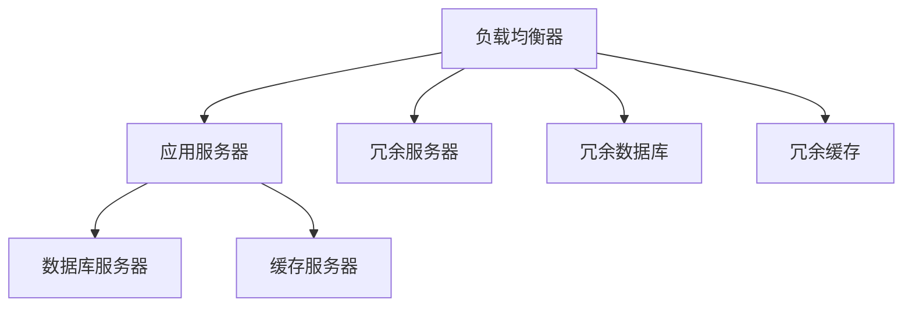

                 

# 冗余设计在实际系统中的应用

## 1. 背景介绍

在当今高度互联且复杂多变的数字化世界中，计算机系统已经成为各种关键领域不可或缺的支柱。然而，这些系统所面临的环境威胁也在不断增长，包括自然灾害、网络攻击、硬件故障等。系统的高可用性和可靠性要求确保关键业务功能在面对这些不确定性时能持续运行。这种需求催生了冗余设计的思想，即在关键组件或系统配置中重复实现某些功能，以应对潜在故障和性能瓶颈。

冗余设计旨在通过在多个节点之间复制功能、数据或资源，构建一个能够容错、自恢复的架构。这种设计不仅增加了系统的鲁棒性和稳定性，还提高了整体性能和可靠性。在实际系统设计中，冗余设计已经成为一种常见且重要的实践，特别是在云服务、分布式系统、数据中心等领域。

## 2. 核心概念与联系

冗余设计涉及多个核心概念，其原理和架构的合理解释可以通过以下Mermaid流程图来展示：



这个流程图展示了冗余设计的基本组件和它们之间的关系：

1. **负载均衡器**：负责分发请求至多个应用服务器。
2. **应用服务器**：提供应用程序的核心功能。
3. **数据库服务器**：存储和管理数据。
4. **缓存服务器**：加速数据访问，减轻数据库压力。
5. **冗余服务器、冗余数据库和冗余缓存**：通过复制功能和资源，提供故障容错和性能优化。

冗余设计的关键在于通过分散和复制关键资源，在部分组件或服务器失效时，其他组件能够继续正常工作，保证系统整体的稳定性和可靠性。

## 3. 核心算法原理 & 具体操作步骤

### 3.1 算法原理概述

冗余设计的核心算法原理是基于容错理论和分布式系统理论，通过在多个节点间复制关键资源和功能，确保系统能够在一个或多个组件失效时依然维持其核心功能。冗余设计通常包括以下几个关键步骤：

1. **资源复制**：在多个节点间复制数据或功能。
2. **负载均衡**：分发请求到多个节点，避免单点故障。
3. **故障检测和切换**：实时监控节点状态，在发现故障时立即切换至备用节点。
4. **同步和冲突解决**：在复制的数据或功能间维持一致性，解决潜在的冲突。

### 3.2 算法步骤详解

冗余设计的具体操作步骤如下：

1. **需求分析**：根据系统的关键业务需求，确定哪些组件需要冗余设计，并设定性能和可用性目标。
2. **资源规划**：选择适当的硬件和软件资源，如服务器、存储、网络设备等，并设计冗余方案。
3. **复制实现**：在多个节点间复制数据或功能，确保数据的完整性和一致性。
4. **负载均衡**：通过负载均衡算法将请求分配至多个节点，实现负载均衡。
5. **故障检测和切换**：实施心跳监测和自动切换机制，确保在发生故障时能够快速响应。
6. **同步和冲突解决**：采用同步算法或冲突解决策略，确保复制的数据或功能在不同节点间的一致性。
7. **测试和优化**：对冗余系统进行全面测试，调整配置和参数，优化性能和稳定性。

### 3.3 算法优缺点

冗余设计在提升系统可靠性和可用性方面具有显著优势：

- **增强的可靠性**：冗余设计能够显著降低单点故障的风险，提高系统的整体可靠性。
- **自恢复能力**：通过自动检测和切换，冗余系统能够在故障发生时自动恢复，减少停机时间。
- **灵活性**：冗余设计允许系统根据业务需求动态调整资源配置，提升资源利用效率。

然而，冗余设计也存在一些缺点：

- **成本高**：冗余系统需要额外硬件和软件投资，成本较高。
- **管理复杂**：冗余设计需要复杂的配置和管理，增加了系统运维的难度。
- **资源浪费**：在部分节点空闲时，冗余资源可能会造成资源浪费。

### 3.4 算法应用领域

冗余设计广泛应用于各种系统和基础设施中，包括但不限于：

- **云服务**：通过冗余设计和负载均衡，确保云服务的高可用性和弹性伸缩能力。
- **数据中心**：在硬件和网络层面上实现冗余设计，提高数据中心运行的稳定性和可靠性。
- **企业网络**：在网络层面上实施冗余设计，保证网络服务的高可用性和性能。
- **分布式系统**：在分布式计算环境中实现冗余设计，提高系统的容错能力和扩展性。
- **关键基础设施**：在电力、交通、通信等关键基础设施中实施冗余设计，保障关键服务的连续性和安全性。

## 4. 数学模型和公式 & 详细讲解 & 举例说明

### 4.1 数学模型构建

冗余设计的数学模型主要涉及系统可靠性计算和资源利用率分析。我们以一个简单的冗余系统为例，构建其数学模型。

假设一个系统有n个节点，每个节点有相同的服务和数据，且节点间通过负载均衡器实现负载分配。当任意一个节点发生故障时，系统能够自动切换到另一个可用的节点，确保服务的连续性。

### 4.2 公式推导过程

冗余系统的可靠性可以用系统的平均故障间隔时间（MTBF）和平均修复时间（MTTR）来表示。假设每个节点故障的平均修复时间为MTTR，系统的MTBF可以通过以下公式计算：

$$
MTBF = n \times (1 - P_{single\_failure}) \times MTTR
$$

其中，$P_{single\_failure}$为单个节点故障的概率。

系统的平均故障时间（MTTF）可以通过以下公式计算：

$$
MTTF = MTBF / (n - 1)
$$

当系统中任何一个节点发生故障时，系统会立即切换到另一个节点，MTTF可以表示为系统在单节点故障后恢复正常服务的时间。

### 4.3 案例分析与讲解

考虑一个有n=3个节点的系统，假设每个节点的故障概率为p。当任意一个节点故障时，系统立即切换到另一个节点，系统的MTTF可以表示为：

$$
MTTF = \frac{1}{3} \times \frac{1}{p} = \frac{1}{3p}
$$

假设每个节点的修复时间为1单位时间，系统的MTTR为1。系统的MTBF为：

$$
MTBF = 3p \times 1 = 3p
$$

如果系统需要满足至少99.999%的可用性（即服务可用时间占总时间的99.999%），可以通过以下公式计算所需的最小故障概率p：

$$
MTTF = \frac{MTBF}{(1 - availability)}
$$

$$
\frac{1}{3p} = \frac{3p}{(1 - 0.99999)}
$$

$$
p = \frac{1}{3} \times (1 - 0.99999) = \frac{1}{3} \times 10^{-7} \approx 3.333 \times 10^{-8}
$$

这意味着，在99.999%的可用性要求下，单个节点的故障概率应小于3.333 x 10^-8。

## 5. 项目实践：代码实例和详细解释说明

### 5.1 开发环境搭建

在实践中，冗余系统通常需要使用云平台或分布式计算框架搭建。以下是一个使用Kubernetes集群搭建冗余系统的基本流程：

1. **安装Kubernetes**：在集群中安装Kubernetes，确保所有节点都处于同一网络环境。
2. **部署应用**：使用Kubernetes部署应用容器，确保应用在多个节点间分布。
3. **实现负载均衡**：使用Kubernetes的Service和Ingress控制器实现负载均衡。
4. **故障检测和切换**：通过Kubernetes的Pod的Liveness和Readiness探针实现故障检测和自动切换。

### 5.2 源代码详细实现

以下是一个使用Kubernetes实现冗余设计的示例代码：

```yaml
apiVersion: v1
kind: Service
metadata:
  name: my-service
spec:
  replicas: 3
  selector:
    app: my-app
  ports:
  - port: 80
    targetPort: 80
```

这段代码定义了一个名为`my-service`的服务，该服务包含了三个相同的应用容器。当其中一个容器故障时，Kubernetes会自动切换到另一个容器，保证服务的连续性。

### 5.3 代码解读与分析

**Kubernetes Service**：定义了一个名为`my-service`的服务，包含三个相同的应用容器。`replicas`字段指定了服务复制的数量。`selector`字段指定了哪些Pod被选择加入该服务。`ports`字段指定了服务的端口和目标端口。

**Kubernetes Deployment**：定义了一个名为`my-deployment`的Deployment，该Deployment包含三个相同的Pod。Pod是Kubernetes中最小的工作单元，能够保证应用在一个节点上的正常运行。

**Pod的Liveness和Readiness Probe**：在Pod定义中，使用`livenessProbe`和`readinessProbe`字段定义Pod的Liveness和Readiness探针。Liveness探针用于检测Pod的存活状态，Readiness探针用于检测Pod的可用状态。当Liveness探针检测到Pod无法存活时，Kubernetes会自动重启该Pod。当Readiness探针检测到Pod不可用时，Kubernetes会将该Pod从服务中移除。

### 5.4 运行结果展示

在运行上述代码后，可以通过以下命令验证服务的可用性和健康状态：

```bash
kubectl get pods
kubectl get services
kubectl get deployment
kubectl describe pod my-pod-0
```

这些命令可以显示Pod的运行状态、服务的健康状态和部署的配置信息。在服务运行期间，如果其中一个Pod发生故障，Kubernetes会自动切换到另一个Pod，确保服务的正常运行。

## 6. 实际应用场景

冗余设计在实际应用中具有广泛的应用场景，以下是几个典型案例：

### 6.1 云服务

云服务提供商如AWS、Azure和Google Cloud使用冗余设计来确保其服务的高可用性和弹性伸缩能力。例如，AWS的EC2服务通过复制数据和应用，确保即使在单个数据中心或区域发生故障时，也能提供稳定的服务。

### 6.2 数据中心

大型数据中心使用冗余设计来保障数据和服务的可靠性。通过在多个节点间复制数据和应用，数据中心能够在故障发生时快速恢复，保障业务连续性。例如，Facebook的数据中心在每个数据中心中都部署了冗余的数据副本。

### 6.3 分布式系统

分布式系统通过冗余设计来提高系统的容错能力和扩展性。例如，Apache Kafka使用冗余设计来确保数据在高可用环境中的可靠性和持久性。

### 6.4 关键基础设施

在电力、交通、通信等关键基础设施中，冗余设计被广泛应用于保障系统的高可用性和安全性。例如，电信运营商使用冗余设计来保障其网络服务的连续性和稳定性。

## 7. 工具和资源推荐

### 7.1 学习资源推荐

为了帮助开发者系统掌握冗余设计的理论基础和实践技巧，这里推荐一些优质的学习资源：

1. **《系统可靠性工程》**：深入讲解了系统可靠性的基本概念和设计方法，是学习冗余设计的经典教材。
2. **《分布式系统原理与设计》**：详细介绍了分布式系统的设计和实现，包括冗余设计的应用。
3. **Kubernetes官方文档**：Kubernetes是实现冗余设计的重要工具之一，其官方文档提供了详细的部署和配置指南。
4. **Google Cloud Platform文档**：提供了Google云平台冗余设计的最佳实践和案例分析。
5. **AWS冗余设计白皮书**：讲解了AWS在冗余设计方面的最佳实践和经验。

通过这些资源的学习实践，相信你一定能够快速掌握冗余设计的精髓，并用于解决实际的系统问题。

### 7.2 开发工具推荐

实现冗余设计需要使用各种工具和框架，以下是几款常用的工具：

1. **Kubernetes**：用于部署和管理容器化应用的分布式系统，提供强大的资源管理和故障恢复功能。
2. **HAProxy**：高可用性负载均衡器，可以自动检测和切换故障节点，确保服务的连续性。
3. **ETCD**：分布式键值存储系统，用于存储和同步冗余系统的配置信息。
4. **Prometheus**：监控系统，用于实时监控系统的健康状态和性能指标。
5. **Grafana**：数据可视化工具，用于分析和展示监控数据。

合理利用这些工具，可以显著提升冗余系统的开发效率，确保系统的稳定性和可靠性。

### 7.3 相关论文推荐

冗余设计的理论研究涉及系统工程、可靠性理论、分布式系统等多个领域，以下是几篇具有代表性的论文：

1. **《Fault-Tolerant Systems》**：详细介绍了冗余设计的原理和应用。
2. **《Designing Distributed Systems》**：讲解了分布式系统设计的核心概念，包括冗余设计。
3. **《High Availability: The Promise and the Peril》**：探讨了冗余设计在高可用性方面的挑战和解决方案。
4. **《Fault-Tolerant Design Patterns》**：提供了冗余设计的多项设计模式和最佳实践。

这些论文代表了冗余设计的研究进展，通过学习这些前沿成果，可以帮助研究者把握学科的前进方向，激发更多的创新灵感。

## 8. 总结：未来发展趋势与挑战

### 8.1 总结

本文对冗余设计在实际系统中的应用进行了全面系统的介绍。首先阐述了冗余设计的背景和意义，明确了其在提高系统可靠性和可用性方面的重要价值。其次，从原理到实践，详细讲解了冗余设计的数学模型和操作步骤，给出了冗余系统开发的完整代码实例。同时，本文还广泛探讨了冗余设计在云服务、数据中心、分布式系统等多个行业领域的应用前景，展示了冗余设计的广泛应用场景。最后，本文精选了冗余设计的各类学习资源，力求为读者提供全方位的技术指引。

通过本文的系统梳理，可以看到，冗余设计已经成为构建高可用性、高稳定性系统的重要手段，其理念和方法已被广泛应用于各个行业。未来，随着技术的发展和市场的进步，冗余设计还将不断演进，以应对更加复杂多变的系统需求。

### 8.2 未来发展趋势

展望未来，冗余设计将呈现以下几个发展趋势：

1. **智能冗余设计**：利用机器学习和人工智能技术，动态调整冗余资源配置，提高资源利用效率。
2. **跨云冗余设计**：在多云环境下实现冗余设计，提高系统的高可用性和弹性伸缩能力。
3. **混合冗余设计**：结合硬件冗余和软件冗余，构建更加灵活和高效的系统架构。
4. **边缘计算冗余**：在边缘计算环境中实现冗余设计，降低延迟，提升响应速度。
5. **跨域冗余设计**：在不同业务域之间实现冗余设计，确保系统的整体稳定性和可靠性。

以上趋势凸显了冗余设计的广阔前景。这些方向的探索发展，必将进一步提升系统的鲁棒性和稳定性，为构建更加安全、可靠的系统提供新的技术手段。

### 8.3 面临的挑战

尽管冗余设计在提高系统可靠性方面具有显著优势，但在其实现和应用过程中仍面临诸多挑战：

1. **成本高**：冗余设计需要额外的硬件和软件投资，增加了系统的总体成本。
2. **管理复杂**：冗余系统需要复杂的配置和管理，增加了系统运维的难度。
3. **资源浪费**：在部分节点空闲时，冗余资源可能会造成资源浪费。
4. **故障检测难度大**：在多节点系统中，故障检测和切换的复杂性增加，需要高效的故障检测机制。
5. **一致性维护难**：在冗余设计中，确保数据和功能在不同节点间的一致性是一个重要的挑战。

### 8.4 研究展望

面对冗余设计面临的这些挑战，未来的研究需要在以下几个方面寻求新的突破：

1. **智能故障检测**：开发更加高效和准确的故障检测算法，实时监控系统状态，快速响应故障。
2. **自适应资源调度**：利用机器学习算法动态调整冗余资源，提高资源利用效率，降低成本。
3. **一致性维护算法**：研究新的一致性维护算法，确保冗余数据和功能在不同节点间的一致性。
4. **边缘计算冗余设计**：在边缘计算环境中，探索新的冗余设计方法和技术。
5. **跨云冗余设计**：研究如何在多云环境中实现高效的冗余设计，提升系统的弹性和扩展性。

这些研究方向的探索，必将引领冗余设计技术迈向更高的台阶，为构建更加安全、可靠的系统提供新的技术手段。面向未来，冗余设计需要与其他技术（如云计算、分布式系统、人工智能等）进行更深入的融合，协同发力，共同推动系统的稳定性和可靠性提升。

## 9. 附录：常见问题与解答

**Q1：冗余设计能否应用于所有系统？**

A: 冗余设计并非适用于所有系统。冗余设计主要应用于需要高可用性和容错能力的系统，如云服务、数据中心、分布式系统等。对于资源需求不高、稳定性要求不严格的系统，冗余设计可能得不偿失。

**Q2：冗余设计如何应对故障检测的复杂性？**

A: 冗余设计需要高效的故障检测机制，以确保在故障发生时能够快速响应。常用的故障检测方法包括：

1. **心跳检测**：通过周期性发送心跳信号，检测节点的健康状态。
2. **Liveness和Readiness探针**：使用Kubernetes等工具定义Liveness和Readiness探针，实时监控节点的运行状态。
3. **分布式监控系统**：如Prometheus和Grafana，实时监控系统的健康状态和性能指标。

**Q3：冗余设计在多云环境中如何应用？**

A: 在多云环境中，冗余设计可以采用跨云冗余设计的方法，确保系统在不同云平台之间的连续性和可靠性。常用的方法包括：

1. **多云数据同步**：在多个云平台之间同步数据，确保数据一致性。
2. **跨云负载均衡**：在多个云平台之间实现负载均衡，提升系统的弹性和扩展性。
3. **跨云故障切换**：在多个云平台之间实现自动故障切换，确保服务的连续性。

**Q4：冗余设计如何提高资源利用效率？**

A: 冗余设计可以通过智能资源调度和自适应算法，提高资源利用效率。具体方法包括：

1. **智能资源调度**：利用机器学习算法动态调整冗余资源，根据负载需求自动分配资源。
2. **自适应负载均衡**：根据系统负载实时调整负载均衡策略，优化资源利用率。
3. **负载预测**：使用预测算法预测系统负载，提前调整资源配置。

**Q5：冗余设计在数据中心中的应用有哪些？**

A: 在数据中心中，冗余设计可以应用于以下方面：

1. **服务器冗余**：在服务器之间实现冗余设计，确保在单个服务器故障时，其他服务器能够继续提供服务。
2. **网络冗余**：在网络层面上实现冗余设计，确保在网络设备故障时，系统能够自动切换至备用网络。
3. **数据冗余**：在存储层面上实现数据冗余，确保在存储设备故障时，数据能够自动复制到其他存储设备中。

以上冗余设计的应用场景展示了其在数据中心中的广泛应用，为数据中心的稳定性和可靠性提供了重要保障。

---

作者：禅与计算机程序设计艺术 / Zen and the Art of Computer Programming

