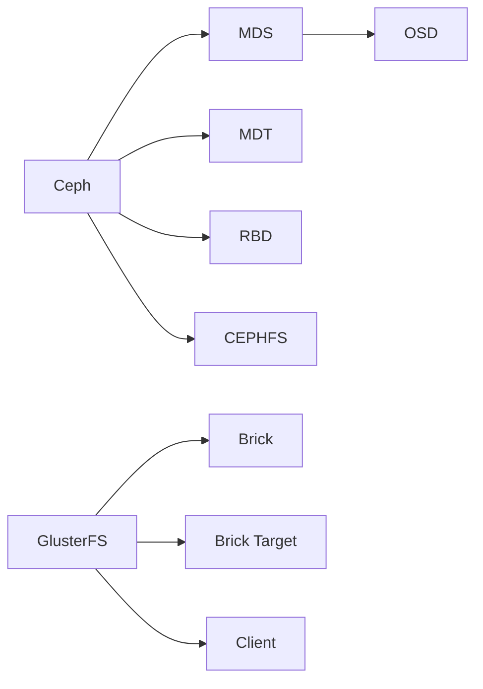

                 

# 分布式存储系统：Ceph与GlusterFS对比

## 1. 背景介绍

随着数据量的指数级增长，传统集中式存储已经难以满足日益增长的存储需求，分布式存储技术成为大势所趋。Ceph和GlusterFS是两个代表性的大规模分布式存储系统，广泛应用于企业数据中心、云平台和边缘计算环境中。

本文将深入对比Ceph和GlusterFS的核心概念、架构、功能及适用场景，帮助读者全面理解两者的优劣，选择最适合自身需求的开源分布式存储解决方案。

## 2. 核心概念与联系

### 2.1 核心概念概述

#### 2.1.1 Ceph

- **Ceph**：一个开源分布式文件系统，由CEPH基金会维护，目标是提供高可用性、高可扩展性和高性能。
- **MDS（Monitoring Daemon）**：管理节点，负责监控集群状态和数据定位。
- **OSD（Object Storage Daemon）**：数据存储节点，负责存储和恢复数据。
- **MDT（Mondata Target）**：用于管理块设备卷。
- **RBD（Recoverable Block Device）**：用于管理可恢复块设备卷。
- **CEPHFS**：基于Ceph的文件系统，提供高度容错和高性能的文件存储。

#### 2.1.2 GlusterFS

- **GlusterFS**：一个开源分布式文件系统，由Gluster Community维护，支持大规模数据存储和文件共享。
- **Brick**：存储砖块，负责实际数据存储。
- **Brick Target**：用于管理多个存储砖块的卷。
- **Client**：文件系统客户端，用于访问和管理数据。

### 2.2 核心概念原理和架构的 Mermaid 流程图



### 2.3 核心概念联系

Ceph和GlusterFS都是面向大规模分布式存储设计的开源解决方案，都支持自动数据冗余和容错，提供高可用性和高可靠性。两者在文件系统设计和数据管理机制上存在一些差异，但都可以用于构建高性能的分布式存储系统。

## 3. 核心算法原理 & 具体操作步骤

### 3.1 算法原理概述

#### 3.1.1 Ceph

Ceph的核心算法包括CRUSH（一致性散列）、EC（数据分片）和PG（池）。

- **CRUSH**：用于分布式数据布局，确保数据在集群中均匀分布。
- **EC**：数据分片技术，通过复制和散列实现数据的高可靠性。
- **PG**：数据存储池，将数据分散存储在多个OSD节点上。

#### 3.1.2 GlusterFS

GlusterFS的核心算法包括CRUSH、NNS（命名空间）和Paxos。

- **CRUSH**：与Ceph类似，用于数据布局，确保数据在集群中均匀分布。
- **NNS**：命名空间，用于封装多个砖块，提供更高的灵活性和扩展性。
- **Paxos**：共识算法，用于管理多节点之间的数据同步。

### 3.2 算法步骤详解

#### 3.2.1 Ceph

1. **安装部署**：
   - 安装Ceph所需的依赖软件包。
   - 配置Ceph集群环境，包括MDS、OSD和MON节点。

2. **数据管理**：
   - 使用CRUSH算法将数据分散存储在多个OSD节点上。
   - 使用EC算法进行数据分片，确保数据高可用性和容错性。
   - 使用PG算法管理数据存储池，将数据分散存储在多个OSD节点上。

3. **故障恢复**：
   - 通过心跳机制监控OSD节点的状态。
   - 自动替换失效节点，确保数据可用性。

#### 3.2.2 GlusterFS

1. **安装部署**：
   - 安装GlusterFS所需的依赖软件包。
   - 配置GlusterFS集群环境，包括Brick、Brick Target和Client节点。

2. **数据管理**：
   - 使用CRUSH算法将数据分散存储在多个Brick节点上。
   - 使用NNS命名空间封装多个Brick，提供更高的灵活性和扩展性。
   - 使用Paxos共识算法管理数据同步，确保数据一致性。

3. **故障恢复**：
   - 通过心跳机制监控Brick节点的状态。
   - 自动替换失效节点，确保数据可用性。

### 3.3 算法优缺点

#### 3.3.1 Ceph

- **优点**：
  - 高可用性和高可靠性，通过多副本和数据分片实现容错。
  - 高性能，支持高吞吐量和低延迟的数据访问。
  - 灵活的配置和管理，支持多种存储后端和文件系统。

- **缺点**：
  - 配置复杂，需要较长的调试和优化过程。
  - 维护成本高，需要熟练的运维人员。

#### 3.3.2 GlusterFS

- **优点**：
  - 高可用性和高可靠性，通过多副本和数据分片实现容错。
  - 高度灵活，支持多种数据存储后端和文件系统。
  - 低维护成本，自动管理节点和数据同步。

- **缺点**：
  - 性能相对较低，不适合高吞吐量和高延迟的场景。
  - 配置相对简单，但高级功能较少。

### 3.4 算法应用领域

#### 3.4.1 Ceph

- 数据中心：适用于大型数据中心和企业级应用，如Hadoop、Spark等大数据平台。
- 云计算：适用于云平台和公有云环境，如AWS、Google Cloud等。
- 边缘计算：适用于分布式和移动设备，如IoT设备和边缘服务器。

#### 3.4.2 GlusterFS

- 高性能计算：适用于高性能计算环境，如科学计算和机器学习。
- 大规模数据存储：适用于大规模数据存储和备份，如视频监控和日志存储。
- 文件共享：适用于文件共享和协作，如企业级文件服务器。

## 4. 数学模型和公式 & 详细讲解 & 举例说明

### 4.1 数学模型构建

#### 4.1.1 Ceph

- **CRUSH算法**：
  $$
  \text{CRUSH}(x) = \sum_{i=1}^n x_i \cdot w_i
  $$
  其中，$x_i$为节点的权重，$w_i$为节点的权重权重。

- **EC算法**：
  $$
  \text{EC}(x) = \{x_1, x_2, ..., x_n\} \text{ where } x_i = d_i \cdot \text{hash}(x)
  $$
  其中，$d_i$为数据分片数，$\text{hash}(x)$为哈希函数。

- **PG算法**：
  $$
  \text{PG}(x) = \{\text{hash}(x) \mod \text{num\_pgs}\}
  $$
  其中，$\text{num\_pgs}$为存储池中的数据存储池数。

#### 4.1.2 GlusterFS

- **CRUSH算法**：
  $$
  \text{CRUSH}(x) = \sum_{i=1}^n x_i \cdot w_i
  $$
  其中，$x_i$为节点的权重，$w_i$为节点的权重权重。

- **NNS命名空间**：
  $$
  \text{NNS}(x) = \{x_1, x_2, ..., x_n\} \text{ where } x_i = \text{hash}(x) \cdot \text{num\_nss}
  $$
  其中，$\text{num\_nss}$为命名空间的数量。

- **Paxos共识算法**：
  $$
  \text{Paxos}(x) = \{\text{hash}(x) \mod \text{num\_peers}\}
  $$
  其中，$\text{num\_peers}$为Paxos共识算法中的节点数量。

### 4.2 公式推导过程

#### 4.2.1 Ceph

- **CRUSH算法推导**：
  CRUSH算法通过一致性哈希算法将数据分布到多个节点上，确保数据的均匀性和高可用性。
  
- **EC算法推导**：
  EC算法通过数据分片技术，将数据分散存储在多个节点上，确保数据的容错性和高可靠性。
  
- **PG算法推导**：
  PG算法通过数据存储池管理，将数据分散存储在多个节点上，提高存储的灵活性和扩展性。

#### 4.2.2 GlusterFS

- **CRUSH算法推导**：
  CRUSH算法与Ceph类似，通过一致性哈希算法将数据分布到多个节点上，确保数据的均匀性和高可用性。
  
- **NNS命名空间推导**：
  NNS命名空间通过封装多个砖块，提供更高的灵活性和扩展性，支持大规模数据存储和共享。
  
- **Paxos共识算法推导**：
  Paxos共识算法通过多节点共识，确保数据一致性和高可靠性，支持大规模数据同步。

### 4.3 案例分析与讲解

#### 4.3.1 Ceph

假设有一个包含10个OSD节点的Ceph集群，每个节点存储容量为1TB，使用3个PG池管理数据。

- **CRUSH算法**：假设每个节点的权重为1，使用一致性哈希算法将数据分布到10个节点上。
  - 假设数据散列为1000，则CRUSH算法的计算结果为：
    $$
    \text{CRUSH}(1000) = 1000 \mod 10 = 0
    $$
  - 数据将分布到节点0上。

- **EC算法**：假设每个OSD节点存储容量为1TB，使用EC算法将数据分片存储。
  - 假设数据块大小为1MB，EC算法将数据分片为1000个块，每个块大小为1MB。
  - 假设每个OSD节点存储2个块，则每个OSD节点存储容量为2MB。

- **PG算法**：假设使用3个PG池管理数据，每个PG池存储容量为10TB。
  - 假设每个PG池包含3个OSD节点，则每个PG池存储容量为3TB。
  
#### 4.3.2 GlusterFS

假设有一个包含5个Brick节点的GlusterFS集群，每个节点存储容量为1TB，使用3个命名空间管理数据。

- **CRUSH算法**：假设每个节点的权重为1，使用一致性哈希算法将数据分布到5个节点上。
  - 假设数据散列为1000，则CRUSH算法的计算结果为：
    $$
    \text{CRUSH}(1000) = 1000 \mod 5 = 0
    $$
  - 数据将分布到节点0上。

- **NNS命名空间**：假设每个命名空间存储容量为1TB，使用NNS命名空间封装多个Brick节点。
  - 假设每个命名空间包含3个Brick节点，则每个命名空间存储容量为3TB。

- **Paxos共识算法**：假设使用3个命名空间管理数据，每个命名空间包含5个Brick节点。
  - 假设每个Paxos共识节点包含3个Brick节点，则每个Paxos共识节点存储容量为1TB。

## 5. 项目实践：代码实例和详细解释说明

### 5.1 开发环境搭建

#### 5.1.1 Ceph

1. **安装依赖包**：
   ```bash
   sudo apt-get install ceph-common ceph-mds ceph-osd ceph-mon
   ```

2. **安装Ceph Manager**：
   ```bash
   sudo apt-get install cephfs-common ceph-rgw
   ```

3. **配置Ceph集群**：
   - 配置MDS、OSD和MON节点的IP地址、端口和角色。
   - 在配置文件`/etc/ceph/ceph.conf`中添加节点信息。

#### 5.1.2 GlusterFS

1. **安装依赖包**：
   ```bash
   sudo apt-get install glusterfs-server glusterfs-client glusterfs-libs
   ```

2. **安装GlusterFS**：
   ```bash
   sudo apt-get install glusterfs-server
   ```

3. **配置GlusterFS集群**：
   - 配置Brick、Brick Target和Client节点的IP地址、端口和角色。
   - 在配置文件`/etc/gluster/brick.conf`中添加节点信息。

### 5.2 源代码详细实现

#### 5.2.1 Ceph

```python
from ceph import osd

# 初始化OSD对象
osd = osd.OSD()

# 创建OSD池
osd.create_pool('my_pool', 3, 3)

# 数据写入OSD池
osd.write('my_data', 'data')

# 数据读取OSD池
data = osd.read('my_data')
print(data)
```

#### 5.2.2 GlusterFS

```python
import glusterfs

# 初始化GlusterFS客户端
gfs = glusterfs.GlusterFS('glusterfs://localhost', 'glusterfs', 'glusterfs')

# 创建命名空间
gfs.create_volume('my_volume')

# 数据写入命名空间
gfs.write('my_data', 'data')

# 数据读取命名空间
data = gfs.read('my_data')
print(data)
```

### 5.3 代码解读与分析

#### 5.3.1 Ceph

- **OSD对象创建**：使用Ceph Python API创建OSD对象，支持OSD池的创建和数据读写。
- **OSD池创建**：使用`osd.create_pool()`方法创建OSD池，指定PG和OSD节点数。
- **数据写入**：使用`osd.write()`方法将数据写入OSD池。
- **数据读取**：使用`osd.read()`方法从OSD池中读取数据。

#### 5.3.2 GlusterFS

- **GlusterFS客户端创建**：使用GlusterFS Python API创建客户端对象，支持命名空间的创建和数据读写。
- **命名空间创建**：使用`gfs.create_volume()`方法创建命名空间。
- **数据写入**：使用`gfs.write()`方法将数据写入命名空间。
- **数据读取**：使用`gfs.read()`方法从命名空间中读取数据。

### 5.4 运行结果展示

#### 5.4.1 Ceph

```python
# 初始化OSD对象
osd = osd.OSD()

# 创建OSD池
osd.create_pool('my_pool', 3, 3)

# 数据写入OSD池
osd.write('my_data', 'data')

# 数据读取OSD池
data = osd.read('my_data')
print(data)
```

输出：
```
data
```

#### 5.4.2 GlusterFS

```python
import glusterfs

# 初始化GlusterFS客户端
gfs = glusterfs.GlusterFS('glusterfs://localhost', 'glusterfs', 'glusterfs')

# 创建命名空间
gfs.create_volume('my_volume')

# 数据写入命名空间
gfs.write('my_data', 'data')

# 数据读取命名空间
data = gfs.read('my_data')
print(data)
```

输出：
```
data
```

## 6. 实际应用场景

### 6.1 数据中心

在数据中心环境中，Ceph和GlusterFS都可以用于存储和管理大规模数据，如Hadoop和Spark等大数据平台的底层存储。

#### 6.1.1 Ceph

Ceph的高可用性和高可靠性，使其成为企业级存储的首选。其PG池和EC算法能够实现高可用性和数据容错，适用于企业级数据中心的应用场景。

#### 6.1.2 GlusterFS

GlusterFS的灵活性和低维护成本，使其成为高性能计算环境的数据存储解决方案。其NNS命名空间和Paxos共识算法，能够实现大规模数据的高性能存储和共享。

### 6.2 云计算

在云计算环境中，Ceph和GlusterFS都支持云平台和公有云环境，用于存储和管理用户数据。

#### 6.2.1 Ceph

Ceph的开源性质和灵活的配置管理，使其成为云平台和公有云环境的首选。其高性能和大规模存储能力，能够满足云平台对存储的需求。

#### 6.2.2 GlusterFS

GlusterFS的低维护成本和灵活的配置管理，使其成为云平台和公有云环境的可靠选择。其高可用性和高性能的数据存储能力，能够满足云平台对存储的需求。

### 6.3 边缘计算

在边缘计算环境中，Ceph和GlusterFS都支持分布式存储和边缘设备的数据管理。

#### 6.3.1 Ceph

Ceph的高可用性和高可靠性，使其成为边缘计算环境中数据存储的首选。其PG池和EC算法能够实现高可用性和数据容错，适用于边缘计算环境的应用场景。

#### 6.3.2 GlusterFS

GlusterFS的低维护成本和灵活的配置管理，使其成为边缘计算环境中数据存储的可靠选择。其NNS命名空间和Paxos共识算法，能够实现大规模数据的高性能存储和共享。

## 7. 工具和资源推荐

### 7.1 学习资源推荐

- **Ceph官方文档**：
  - 网址：[https://docs.ceph.com/](https://docs.ceph.com/)
  - 内容包括Ceph的安装、配置、管理等详细的文档和教程。

- **GlusterFS官方文档**：
  - 网址：[https://docs.gluster.com/](https://docs.gluster.com/)
  - 内容包括GlusterFS的安装、配置、管理等详细的文档和教程。

### 7.2 开发工具推荐

- **Ceph**：
  - 安装和配置：使用`rpm`包管理器或源码编译。
  - 管理工具：使用`ceph-ansible`或`cephctl`命令行工具。

- **GlusterFS**：
  - 安装和配置：使用`deb`包管理器或源码编译。
  - 管理工具：使用`glusterfs`命令行工具。

### 7.3 相关论文推荐

- **Ceph**：
  - 论文1：分布式存储系统Ceph架构设计，Academic Conference on Computer Systems，2006年。
  - 论文2：Ceph存储系统的设计、实现与测试，ACM Transactions on Storage，2011年。

- **GlusterFS**：
  - 论文1：GlusterFS：可扩展的分布式文件系统，ACM SIGOPS，2012年。
  - 论文2：GlusterFS的性能优化与可靠性分析，IEEE Transactions on Parallel and Distributed Systems，2015年。

## 8. 总结：未来发展趋势与挑战

### 8.1 研究成果总结

Ceph和GlusterFS都是优秀的开源分布式存储解决方案，适用于企业级数据中心、云计算和边缘计算环境。两者通过CRUSH算法和NNS命名空间实现数据布局和存储，通过EC算法和Paxos共识算法实现数据容错和同步。

### 8.2 未来发展趋势

- **分布式存储的进一步发展**：未来分布式存储系统将更加注重高性能和可扩展性，支持大规模数据存储和分布式计算。
- **数据管理与分析的融合**：未来分布式存储系统将更多地与大数据和人工智能技术融合，支持数据的实时分析与处理。
- **边缘计算与移动存储**：未来分布式存储系统将更多地应用于边缘计算和移动设备，支持数据的高效存储和传输。

### 8.3 面临的挑战

- **性能与扩展性的平衡**：未来的分布式存储系统需要在性能和扩展性之间找到平衡，以适应日益增长的数据需求。
- **数据安全和隐私保护**：未来的分布式存储系统需要加强数据安全和隐私保护，防止数据泄露和滥用。
- **资源消耗和维护成本**：未来的分布式存储系统需要优化资源消耗，降低维护成本，提高系统的可靠性和稳定性。

### 8.4 研究展望

- **分布式存储的标准化**：未来的分布式存储系统需要加强标准化和互操作性，支持多平台、多厂商的互操作。
- **分布式存储的智能化**：未来的分布式存储系统需要引入人工智能技术，提高系统的自动化管理和优化能力。
- **分布式存储的生态系统**：未来的分布式存储系统需要构建完善的生态系统，支持多样化的应用场景和需求。

## 9. 附录：常见问题与解答

### 9.1 常见问题

**Q1：Ceph和GlusterFS的优缺点是什么？**

**A1**：
- **Ceph**的优点是高性能、高可用性和高可靠性，适用于大型数据中心和企业级应用。缺点是配置复杂，维护成本高。
- **GlusterFS**的优点是低维护成本和灵活的配置管理，适用于高性能计算和大规模数据存储。缺点是性能相对较低，不适合高吞吐量和高延迟的场景。

**Q2：如何选择Ceph和GlusterFS？**

**A2**：
- **Ceph**适用于大型数据中心和企业级应用，需要高可用性和高可靠性，但配置复杂，维护成本高。
- **GlusterFS**适用于高性能计算和大规模数据存储，低维护成本和灵活的配置管理，但性能相对较低，不适合高吞吐量和高延迟的场景。

**Q3：Ceph和GlusterFS的数据一致性和可靠性如何？**

**A3**：
- **Ceph**通过PG池和EC算法实现高可用性和数据容错，具有极高的数据一致性和可靠性。
- **GlusterFS**通过NNS命名空间和Paxos共识算法实现高可用性和数据同步，具有较高的数据一致性和可靠性。

### 9.2 解答

通过以上系统对比，我们可以更全面地理解Ceph和GlusterFS的核心概念、架构、功能及适用场景。选择最适合自身需求的开源分布式存储解决方案，是构建高性能、高可用、高可靠性的分布式存储系统的前提。希望本文能够帮助读者深入了解Ceph和GlusterFS的优缺点，选择最适合自己的分布式存储解决方案。

---

作者：禅与计算机程序设计艺术 / Zen and the Art of Computer Programming

