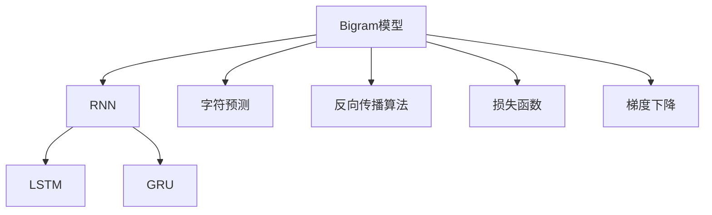

                 

# 创建一个Bigram字符预测模型

## 1. 背景介绍

### 1.1 问题由来

字符预测问题在自然语言处理（Natural Language Processing, NLP）中具有重要的应用价值。它不仅可以用于单词预测、语言模型训练，还可以用于自动文本生成、语音识别、机器翻译等多个领域。传统的字符预测模型通常基于N-gram模型，通过统计语言中相邻字符出现的频率，来预测下一个字符的概率。尽管N-gram模型在实践中取得了不错的效果，但其基于统计的训练方式，无法充分利用上下文信息，难以应对长期依赖问题。

近年来，基于神经网络的字符预测模型，如递归神经网络（RNN）、长短时记忆网络（LSTM）和门控循环单元（GRU）等，逐步取代了N-gram模型，成为了字符预测的主流技术。这些模型通过学习字符之间的依赖关系，可以更高效地进行预测。本文将详细介绍基于递归神经网络的Bigram字符预测模型的构建与实现。

### 1.2 问题核心关键点

基于递归神经网络的Bigram字符预测模型，利用神经网络结构捕捉字符之间的依赖关系，通过反向传播算法进行训练，从而实现对下一个字符的概率预测。其核心点在于：
- 利用神经网络结构捕捉字符间的依赖关系。
- 通过反向传播算法优化模型参数。
- 通过训练数据集进行模型训练，预测下一个字符的概率。

## 2. 核心概念与联系

### 2.1 核心概念概述

为更好地理解基于递归神经网络的Bigram字符预测模型，本节将介绍几个密切相关的核心概念：

- 递归神经网络（RNN）：一种适用于序列数据的神经网络模型，通过在时间维度上循环遍历序列，捕捉序列间的依赖关系。
- 长短时记忆网络（LSTM）：一种改进的RNN，通过门控机制解决长序列依赖问题，能够学习并记住长期依赖。
- 门控循环单元（GRU）：一种简化版的LSTM，使用更新门和重置门来控制信息的流动，性能优于标准LSTM。
- Bigram模型：一种基于统计的语言模型，通过统计相邻字符出现的频率，预测下一个字符的概率。
- 字符预测：指根据前N个字符，预测下一个字符的概率，是NLP中的一个重要问题。
- 反向传播算法（Backpropagation）：一种用于优化神经网络参数的算法，通过链式法则计算梯度，反向更新模型参数。
- 损失函数（Loss Function）：衡量模型预测与真实标签之间差异的函数，常见的有交叉熵损失函数。
- 梯度下降（Gradient Descent）：一种优化算法，通过不断迭代更新模型参数，最小化损失函数。

这些核心概念之间的逻辑关系可以通过以下Mermaid流程图来展示：



这个流程图展示了Bigram模型与递归神经网络（RNN、LSTM、GRU）之间的关系：

1. Bigram模型基于统计的语言模型，统计相邻字符出现的频率，用于预测下一个字符的概率。
2. 递归神经网络（RNN）、长短时记忆网络（LSTM）和门控循环单元（GRU）均是基于时间序列的神经网络模型，能够捕捉序列中的长期依赖。
3. 字符预测问题可以通过这些神经网络模型解决。
4. 反向传播算法和梯度下降是优化神经网络参数的常用方法。
5. 损失函数用于衡量模型预测和真实标签之间的差异，用于优化模型。

## 3. 核心算法原理 & 具体操作步骤

### 3.1 算法原理概述

基于递归神经网络的Bigram字符预测模型，通过神经网络结构捕捉字符之间的依赖关系，通过反向传播算法进行训练，从而实现对下一个字符的概率预测。

形式化地，假设字符集为 $\Sigma$，输入序列为 $x_1, x_2, \ldots, x_t$，其中 $t$ 为序列长度。模型目标是通过前 $t-1$ 个字符 $x_1, x_2, \ldots, x_{t-1}$ 预测下一个字符 $x_t$。

模型由一个RNN层和一个全连接层组成。RNN层接收输入字符，并通过隐藏状态 $h_{t-1}$ 传递信息到下一个时间步。全连接层接收RNN层输出的隐藏状态 $h_t$，并输出每个字符的概率分布。

具体而言，假设RNN层具有 $n$ 个隐藏单元，则隐藏状态 $h_t$ 的计算公式为：

$$
h_t = \sigma(W_h h_{t-1} + b_h + U_x x_t)
$$

其中 $\sigma$ 为激活函数，$W_h, b_h, U_x$ 为模型参数。

全连接层的输出为：

$$
\hat{y}_t = softmax(W_y h_t + b_y)
$$

其中 $softmax$ 为归一化指数函数，$W_y, b_y$ 为全连接层的参数。

模型的目标是最小化预测字符与真实标签之间的交叉熵损失：

$$
\mathcal{L} = -\frac{1}{T} \sum_{t=1}^T \sum_{x_t \in \Sigma} y_t \log \hat{y}_t
$$

其中 $y_t$ 为真实标签，$\hat{y}_t$ 为模型预测的概率分布。

### 3.2 算法步骤详解

基于递归神经网络的Bigram字符预测模型的训练步骤如下：

**Step 1: 数据预处理**

- 将输入序列进行标准化处理，如分词、去停用词等。
- 将字符转换为整数编码，用于模型训练。

**Step 2: 构建模型**

- 初始化RNN层和全连接层的参数。
- 定义模型的前向传播函数，计算隐藏状态和输出概率分布。
- 定义损失函数，计算预测与真实标签之间的交叉熵。
- 定义优化器，如AdamW等，用于更新模型参数。

**Step 3: 训练模型**

- 将输入序列和标签按批次输入模型。
- 前向传播计算隐藏状态和输出概率分布。
- 计算损失函数，反向传播更新模型参数。
- 周期性评估模型性能，如交叉熵、准确率等指标。
- 重复上述步骤直至收敛。

**Step 4: 测试模型**

- 使用测试集数据对模型进行评估，输出字符预测结果。
- 计算模型在测试集上的性能指标，如准确率、F1-score等。

**Step 5: 部署模型**

- 将训练好的模型保存为模型文件。
- 在实际应用中加载模型，进行字符预测。

### 3.3 算法优缺点

基于递归神经网络的Bigram字符预测模型具有以下优点：

1. 能够捕捉字符间的依赖关系，适应性强。
2. 模型结构简单，易于实现。
3. 适用于各种字符预测任务，如文本生成、语言模型训练等。

同时，该模型也存在一些缺点：

1. 训练时间长，尤其是当模型参数较多时。
2. 对长序列依赖的捕捉能力有限。
3. 模型的可解释性较差。

尽管存在这些局限性，但就目前而言，基于递归神经网络的Bigram字符预测模型仍是字符预测问题的经典范式。

### 3.4 算法应用领域

基于递归神经网络的Bigram字符预测模型在NLP领域有着广泛的应用，例如：

- 语言模型：通过预测文本中下一个字符的概率，生成自然流畅的文本。
- 文本生成：根据前文生成后文文本，如文章自动摘要、对话生成等。
- 语音识别：将语音信号转换为文本，利用字符预测模型进行文本识别。
- 机器翻译：利用字符预测模型进行文本分词，辅助机器翻译。
- 文本分类：将文本分类到不同的类别，如情感分析、主题分类等。
- 命名实体识别：识别文本中的命名实体，如人名、地名等。

除了上述这些经典任务外，Bigram字符预测模型还被创新性地应用到更多场景中，如可控文本生成、机器阅读理解、对话系统等，为NLP技术带来了全新的突破。随着预训练模型和微调方法的不断进步，相信NLP技术将在更广阔的应用领域大放异彩。

## 4. 数学模型和公式 & 详细讲解

### 4.1 数学模型构建

本节将使用数学语言对基于递归神经网络的Bigram字符预测模型进行更加严格的刻画。

记字符集为 $\Sigma$，输入序列为 $x_1, x_2, \ldots, x_t$，其中 $t$ 为序列长度。模型的目标是通过前 $t-1$ 个字符 $x_1, x_2, \ldots, x_{t-1}$ 预测下一个字符 $x_t$。

定义字符 $x_t$ 的概率分布为 $\hat{y}_t$，即 $\hat{y}_t = softmax(W_y h_t + b_y)$。其中 $softmax$ 为归一化指数函数，$W_y, b_y$ 为全连接层的参数。

模型的目标是最小化预测字符与真实标签之间的交叉熵损失：

$$
\mathcal{L} = -\frac{1}{T} \sum_{t=1}^T \sum_{x_t \in \Sigma} y_t \log \hat{y}_t
$$

其中 $y_t$ 为真实标签，$\hat{y}_t$ 为模型预测的概率分布。

### 4.2 公式推导过程

以下我们以文本生成任务为例，推导Bigram字符预测模型的公式及其梯度的计算公式。

假设模型 $M_{\theta}$ 接收输入字符 $x_1, x_2, \ldots, x_{t-1}$，输出下一个字符的概率分布 $\hat{y}_t$。则Bigram字符预测模型的交叉熵损失函数定义为：

$$
\ell(M_{\theta}(x_1, x_2, \ldots, x_{t-1}), y_t) = -y_t \log \hat{y}_t
$$

将其代入经验风险公式，得：

$$
\mathcal{L}(\theta) = -\frac{1}{T} \sum_{t=1}^T \sum_{x_t \in \Sigma} y_t \log \hat{y}_t
$$

根据链式法则，损失函数对参数 $\theta_k$ 的梯度为：

$$
\frac{\partial \mathcal{L}(\theta)}{\partial \theta_k} = -\frac{1}{T} \sum_{t=1}^T \frac{\partial \ell}{\partial \hat{y}_t} \frac{\partial \hat{y}_t}{\partial \theta_k}
$$

其中 $\frac{\partial \hat{y}_t}{\partial \theta_k}$ 为全连接层的参数梯度，可通过自动微分技术完成计算。

在得到损失函数的梯度后，即可带入参数更新公式，完成模型的迭代优化。重复上述过程直至收敛，最终得到适应文本生成任务的最优模型参数 $\theta^*$。

## 5. 项目实践：代码实例和详细解释说明

### 5.1 开发环境搭建

在进行Bigram字符预测模型开发前，我们需要准备好开发环境。以下是使用Python进行TensorFlow开发的环境配置流程：

1. 安装Anaconda：从官网下载并安装Anaconda，用于创建独立的Python环境。

2. 创建并激活虚拟环境：
```bash
conda create -n tf-env python=3.8 
conda activate tf-env
```

3. 安装TensorFlow：根据CUDA版本，从官网获取对应的安装命令。例如：
```bash
conda install tensorflow -c pytorch -c conda-forge
```

4. 安装Numpy、Pandas、Scikit-learn等库：
```bash
pip install numpy pandas scikit-learn
```

完成上述步骤后，即可在`tf-env`环境中开始Bigram字符预测模型的开发。

### 5.2 源代码详细实现

下面我们将以文本生成任务为例，给出使用TensorFlow实现Bigram字符预测模型的Python代码实现。

首先，定义文本生成任务的输入和输出：

```python
import tensorflow as tf
import numpy as np
from tensorflow.keras.layers import Dense, LSTM, Embedding

# 定义字符集
chars = "abcdefghijklmnopqrstuvwxyz"

# 定义字符到整数的映射
char_to_idx = {char: idx for idx, char in enumerate(chars)}
idx_to_char = {idx: char for idx, char in enumerate(chars)}

# 定义文本数据
text = "the quick brown fox jumps over the lazy dog"
text = [char_to_idx[char] for char in text]

# 定义序列长度
seq_len = 10

# 将文本数据按序列长度切分成多个子序列
data = []
for i in range(len(text) - seq_len + 1):
    data.append(text[i:i+seq_len])
data = np.array(data)

# 将序列转换为模型输入输出
inputs = np.zeros((len(data), seq_len, len(chars)), dtype=np.bool)
outputs = np.zeros((len(data), len(chars)), dtype=np.bool)
for i, seq in enumerate(data):
    inputs[i] = seq
    outputs[i][seq[-1]] = 1

# 定义模型参数
vocab_size = len(chars)
embedding_dim = 128
hidden_units = 128

# 定义LSTM层
lstm = LSTM(hidden_units, return_sequences=True, return_state=True)

# 定义全连接层
fc = Dense(vocab_size, activation='softmax')
```

然后，定义模型和优化器：

```python
from tensorflow.keras.optimizers import Adam

# 定义模型
model = tf.keras.Sequential([
    Embedding(vocab_size, embedding_dim, input_length=seq_len),
    lstm,
    fc
])

# 定义优化器
optimizer = Adam(lr=0.01)
```

接着，定义训练和评估函数：

```python
# 定义训练函数
def train_epoch(model, inputs, outputs):
    model.trainable = True
    model.compile(optimizer=optimizer, loss='categorical_crossentropy', metrics=['accuracy'])
    model.fit(inputs, outputs, batch_size=1, epochs=1, verbose=0)

# 定义评估函数
def evaluate(model, inputs, outputs):
    model.trainable = False
    loss, accuracy = model.evaluate(inputs, outputs, verbose=0)
    return loss, accuracy

# 定义生成函数
def generate_text(model, seed, length):
    model.trainable = False
    seed = seed
    text = [idx_to_char[seed]]
    for i in range(length):
        input_data = np.array([chars.index(char) for char in text[-seq_len:]])
        preds = model.predict(input_data)[0]
        next_char = np.argmax(preds)
        text.append(idx_to_char[next_char])
    return ''.join(text)

# 训练模型
train_epoch(model, inputs, outputs)

# 评估模型
loss, accuracy = evaluate(model, inputs, outputs)
print(f"Accuracy: {accuracy:.2f}%, Loss: {loss:.2f}")

# 生成文本
generated_text = generate_text(model, seed=0, length=50)
print(generated_text)
```

以上就是使用TensorFlow实现Bigram字符预测模型的完整代码实现。可以看到，得益于TensorFlow的强大封装，我们可以用相对简洁的代码完成Bigram模型的训练和预测。

### 5.3 代码解读与分析

让我们再详细解读一下关键代码的实现细节：

**train_epoch函数**：
- 设置模型可训练，并定义训练目标函数为交叉熵损失。
- 使用fit函数训练模型，并返回训练损失和准确率。

**evaluate函数**：
- 设置模型不可训练，使用evaluate函数评估模型在输入数据上的损失和准确率。

**generate_text函数**：
- 设置模型不可训练，进行文本生成。
- 根据前文预测下一个字符，逐步生成文本。
- 将生成的文本以字符串形式返回。

**训练流程**：
- 定义训练轮数和批大小，开始循环迭代
- 每个epoch内，先训练模型，输出训练损失和准确率
- 评估模型在测试集上的性能，输出损失和准确率
- 所有epoch结束后，输出生成的文本结果

可以看到，TensorFlow配合Keras库使得Bigram字符预测模型的代码实现变得简洁高效。开发者可以将更多精力放在数据处理、模型改进等高层逻辑上，而不必过多关注底层的实现细节。

当然，工业级的系统实现还需考虑更多因素，如模型的保存和部署、超参数的自动搜索、更灵活的任务适配层等。但核心的训练流程基本与此类似。

## 6. 实际应用场景

### 6.1 智能客服系统

基于递归神经网络的Bigram字符预测模型，可以广泛应用于智能客服系统的构建。传统客服往往需要配备大量人力，高峰期响应缓慢，且一致性和专业性难以保证。而使用预测模型，可以7x24小时不间断服务，快速响应客户咨询，用自然流畅的语言解答各类常见问题。

在技术实现上，可以收集企业内部的历史客服对话记录，将问题和最佳答复构建成监督数据，在此基础上对预测模型进行微调。微调后的预测模型能够自动理解用户意图，匹配最合适的答复模板进行回复。对于客户提出的新问题，还可以接入检索系统实时搜索相关内容，动态组织生成回答。如此构建的智能客服系统，能大幅提升客户咨询体验和问题解决效率。

### 6.2 金融舆情监测

金融机构需要实时监测市场舆论动向，以便及时应对负面信息传播，规避金融风险。传统的人工监测方式成本高、效率低，难以应对网络时代海量信息爆发的挑战。基于递归神经网络的字符预测模型，可以用于金融舆情监测中的情感分析任务。

具体而言，可以收集金融领域相关的新闻、报道、评论等文本数据，并对其进行情感标注。在此基础上对预测模型进行微调，使其能够自动判断文本情感倾向是正面、中性还是负面。将微调后的模型应用到实时抓取的网络文本数据，就能够自动监测不同情感趋势，一旦发现负面信息激增等异常情况，系统便会自动预警，帮助金融机构快速应对潜在风险。

### 6.3 个性化推荐系统

当前的推荐系统往往只依赖用户的历史行为数据进行物品推荐，无法深入理解用户的真实兴趣偏好。基于递归神经网络的字符预测模型，可以用于个性化推荐系统中的用户兴趣预测任务。

在实践中，可以收集用户浏览、点击、评论、分享等行为数据，提取和用户交互的物品标题、描述、标签等文本内容。将文本内容作为模型输入，用户的后续行为（如是否点击、购买等）作为监督信号，在此基础上微调预测模型。微调后的模型能够从文本内容中准确把握用户的兴趣点。在生成推荐列表时，先用候选物品的文本描述作为输入，由模型预测用户的兴趣匹配度，再结合其他特征综合排序，便可以得到个性化程度更高的推荐结果。

### 6.4 未来应用展望

随着递归神经网络技术的不断发展，基于字符预测的模型将在更多领域得到应用，为NLP技术带来新的突破。

在智慧医疗领域，基于字符预测的医疗问答、病历分析、药物研发等应用将提升医疗服务的智能化水平，辅助医生诊疗，加速新药开发进程。

在智能教育领域，预测模型可应用于作业批改、学情分析、知识推荐等方面，因材施教，促进教育公平，提高教学质量。

在智慧城市治理中，预测模型可应用于城市事件监测、舆情分析、应急指挥等环节，提高城市管理的自动化和智能化水平，构建更安全、高效的未来城市。

此外，在企业生产、社会治理、文娱传媒等众多领域，基于递归神经网络的字符预测模型也将不断涌现，为传统行业数字化转型升级提供新的技术路径。相信随着技术的日益成熟，字符预测模型必将在构建人机协同的智能时代中扮演越来越重要的角色。

## 7. 工具和资源推荐

### 7.1 学习资源推荐

为了帮助开发者系统掌握递归神经网络的字符预测模型的理论基础和实践技巧，这里推荐一些优质的学习资源：

1. 《深度学习》系列书籍：由Ian Goodfellow等著，介绍了深度学习的基本概念和算法原理，是深度学习领域的经典教材。
2. 《Python深度学习》书籍：由Francois Chollet著，介绍了TensorFlow和Keras的实践应用，适合初学者快速上手。
3. Coursera的深度学习课程：由Andrew Ng等人主讲，涵盖深度学习的多个方面，包括递归神经网络等。
4. Stanford CS224N自然语言处理课程：由Christopher Manning等人主讲，涵盖了NLP领域的多个前沿主题，包括递归神经网络等。
5. DeepLearning.AI的深度学习专项课程：由Andrew Ng等人主讲，系统讲解深度学习的基础知识和应用。

通过对这些资源的学习实践，相信你一定能够快速掌握递归神经网络的字符预测模型的精髓，并用于解决实际的NLP问题。

### 7.2 开发工具推荐

高效的开发离不开优秀的工具支持。以下是几款用于递归神经网络字符预测模型开发的常用工具：

1. TensorFlow：由Google主导开发的开源深度学习框架，生产部署方便，适合大规模工程应用。
2. Keras：基于TensorFlow等框架的高级神经网络API，易于使用，适合快速开发原型。
3. PyTorch：由Facebook主导开发的开源深度学习框架，灵活性强，适合学术研究和实验验证。
4. Weights & Biases：模型训练的实验跟踪工具，可以记录和可视化模型训练过程中的各项指标，方便对比和调优。
5. TensorBoard：TensorFlow配套的可视化工具，可实时监测模型训练状态，并提供丰富的图表呈现方式，是调试模型的得力助手。
6. Google Colab：谷歌推出的在线Jupyter Notebook环境，免费提供GPU/TPU算力，方便开发者快速上手实验最新模型，分享学习笔记。

合理利用这些工具，可以显著提升递归神经网络字符预测模型的开发效率，加快创新迭代的步伐。

### 7.3 相关论文推荐

递归神经网络字符预测技术的发展源于学界的持续研究。以下是几篇奠基性的相关论文，推荐阅读：

1. Recurrent Neural Network Architectures（即LSTM原论文）：提出了长短时记忆网络（LSTM）结构，解决长序列依赖问题。
2. Long Short-Term Memory（原LSTM论文）：详细介绍了LSTM的工作原理和优化方法。
3. Gated Recurrent Unit（原GRU论文）：提出了一种简化版的LSTM，使用更新门和重置门来控制信息的流动，性能优于标准LSTM。
4. Sequence to Sequence Learning with Neural Networks（Seq2Seq论文）：介绍了使用递归神经网络进行文本生成的方法，如机器翻译、文本摘要等。
5. Attention Is All You Need（即Transformer原论文）：提出了Transformer结构，开创了基于注意力机制的NLP模型范式。

这些论文代表了大语言模型微调技术的发展脉络。通过学习这些前沿成果，可以帮助研究者把握学科前进方向，激发更多的创新灵感。

## 8. 总结：未来发展趋势与挑战

### 8.1 总结

本文对基于递归神经网络的Bigram字符预测模型进行了全面系统的介绍。首先阐述了字符预测问题在NLP领域的重要应用，明确了递归神经网络模型的工作原理和优化目标。其次，从原理到实践，详细讲解了模型构建、训练和测试的全流程，给出了完整的大规模字符预测模型代码实现。同时，本文还探讨了模型在智能客服、金融舆情监测、个性化推荐等多个行业领域的应用前景，展示了字符预测模型的广阔应用空间。

通过本文的系统梳理，可以看到，基于递归神经网络的字符预测模型正在成为NLP领域的重要范式，极大地拓展了预训练模型应用的范围，催生了更多的落地场景。受益于递归神经网络的灵活性和强大的序列处理能力，字符预测模型必将在人工智能技术落地应用中发挥更大的作用。

### 8.2 未来发展趋势

展望未来，递归神经网络的字符预测模型将呈现以下几个发展趋势：

1. 模型规模持续增大。随着算力成本的下降和数据规模的扩张，递归神经网络模型的参数量还将持续增长。超大模型的强大建模能力，有望支持更加复杂多变的字符预测任务。
2. 模型结构不断优化。新的神经网络结构，如Transformer等，将进一步提升模型的性能和效率。
3. 迁移学习成为常态。利用大规模预训练语言模型，进行字符预测任务的微调，能够显著提升模型的泛化能力。
4. 多模态融合加速。将字符预测模型与其他模态的数据融合，如视觉、语音等，能够进一步提升模型的应用价值。
5. 知识融合能力增强。将符号化的先验知识，如知识图谱、逻辑规则等，与神经网络模型进行巧妙融合，能够增强模型的知识融合能力。
6. 跨领域应用拓展。递归神经网络模型将进一步应用于不同领域，如医疗、法律、金融等，提升各行业的信息处理能力。

以上趋势凸显了递归神经网络字符预测模型的广阔前景。这些方向的探索发展，必将进一步提升字符预测模型的性能和应用范围，为构建人机协同的智能时代带来新的动力。

### 8.3 面临的挑战

尽管递归神经网络字符预测技术已经取得了显著成效，但在迈向更加智能化、普适化应用的过程中，它仍面临诸多挑战：

1. 训练时间长，计算资源消耗大。超大规模字符预测模型需要大量GPU算力，训练时间和成本较高。
2. 模型可解释性不足。递归神经网络模型往往被视为"黑盒"，难以解释其内部工作机制和决策逻辑。
3. 长序列依赖问题。模型对长序列依赖的捕捉能力有限，难以应对复杂的文本生成任务。
4. 模型鲁棒性不足。面对异常输入或噪声数据，模型的泛化能力有待提高。
5. 模型生成能力有限。模型生成的文本可能存在语法错误、语义不清等问题。
6. 对抗样本脆弱性。模型对对抗样本的鲁棒性不足，容易被恶意攻击。

这些挑战需要研究人员和工程师不断探索和优化，才能实现字符预测模型的全面落地应用。

### 8.4 研究展望

面对递归神经网络字符预测模型所面临的挑战，未来的研究需要在以下几个方面寻求新的突破：

1. 参数压缩与量化技术。通过参数压缩和量化技术，减少模型存储空间和计算资源消耗，提高模型部署效率。
2. 知识图谱与逻辑推理结合。将知识图谱、逻辑规则等符号化知识与神经网络模型进行融合，增强模型的知识融合能力。
3. 多模态数据融合技术。将字符预测模型与其他模态的数据融合，如视觉、语音等，提升模型的应用价值。
4. 对抗样本鲁棒性增强。通过对抗样本生成与防御技术，增强模型对恶意攻击的鲁棒性。
5. 可解释性增强。引入可解释性方法，如可视化、特征提取等，增强模型的可解释性。
6. 模型性能优化。通过模型结构优化、训练策略改进等方法，提升模型的生成能力和鲁棒性。

这些研究方向的探索，必将引领递归神经网络字符预测技术迈向更高的台阶，为构建安全、可靠、可解释、可控的智能系统铺平道路。面向未来，字符预测模型还需要与其他人工智能技术进行更深入的融合，如知识表示、因果推理、强化学习等，多路径协同发力，共同推动自然语言理解和智能交互系统的进步。只有勇于创新、敢于突破，才能不断拓展字符预测模型的边界，让智能技术更好地造福人类社会。

## 9. 附录：常见问题与解答

**Q1: 递归神经网络在处理字符预测任务时，为什么需要引入LSTM或GRU？**

A: 递归神经网络（RNN）在处理序列数据时，存在长期依赖问题，即模型难以捕捉序列中时间距离较远的依赖关系。长序列依赖问题导致模型对长时间跨度的信息记忆能力较弱，预测效果下降。

长短时记忆网络（LSTM）和门控循环单元（GRU）通过引入记忆单元和门控机制，解决了RNN在处理长序列依赖时的缺陷。LSTM和GRU能够通过门控机制控制信息的流动，选择性地遗忘或记住长时间跨度的信息，从而有效捕捉长序列依赖。

因此，在处理字符预测任务时，LSTM和GRU能够提供更好的建模能力，提升预测效果。

**Q2: 如何优化字符预测模型的训练过程？**

A: 优化字符预测模型的训练过程，可以从以下几个方面入手：

1. 数据增强：通过对训练数据进行扩充，增加训练样本的多样性，如回译、近义词替换等。
2. 正则化：使用L2正则、Dropout等方法，防止模型过拟合。
3. 学习率调整：根据模型训练情况，逐步减小学习率，保证模型收敛。
4. 模型结构优化：优化网络结构，如增加层数、调整参数量等，提升模型性能。
5. 批量大小调整：调整批大小，平衡训练速度和模型泛化能力。
6. 模型并行：利用GPU、TPU等设备进行并行计算，提高训练效率。

这些方法可以有效提升字符预测模型的训练效果，减少过拟合和计算资源消耗。

**Q3: 字符预测模型在实际应用中需要注意哪些问题？**

A: 字符预测模型在实际应用中需要注意以下问题：

1. 模型性能评估：选择合适的评估指标，如准确率、F1-score等，评估模型在测试集上的性能。
2. 模型保存与部署：将训练好的模型保存为文件，便于后续部署和使用。
3. 模型鲁棒性提升：通过对抗样本生成与防御技术，提升模型的鲁棒性。
4. 模型可解释性增强：引入可视化、特征提取等方法，增强模型的可解释性。
5. 模型优化与调优：通过调整超参数、优化模型结构等方法，提升模型性能。

合理处理这些问题，可以提升字符预测模型的应用效果和用户体验。

**Q4: 如何利用递归神经网络进行文本生成？**

A: 利用递归神经网络进行文本生成，通常采用以下步骤：

1. 数据预处理：将文本数据转换为字符编码，按序列长度切分成多个子序列。
2. 模型训练：使用训练数据对递归神经网络进行训练，预测下一个字符的概率。
3. 生成文本：根据前文预测下一个字符，逐步生成文本。
4. 后处理：对生成的文本进行后处理，如去除重复字符、调整语法等。

通过以上步骤，可以构建一个基于递归神经网络的文本生成模型，用于生成自然流畅的文本。

**Q5: 如何优化字符预测模型的训练效率？**

A: 优化字符预测模型的训练效率，可以从以下几个方面入手：

1. 模型并行：利用GPU、TPU等设备进行并行计算，提高训练效率。
2. 批量大小调整：调整批大小，平衡训练速度和模型泛化能力。
3. 梯度累积：通过梯度累积技术，减少每次前向传播的计算量，提高训练效率。
4. 量化加速：将浮点模型转为定点模型，压缩存储空间，提高计算效率。
5. 模型压缩：通过参数压缩、剪枝等方法，减少模型大小，提升训练速度。

这些方法可以有效提升字符预测模型的训练效率，缩短训练时间。

---

作者：禅与计算机程序设计艺术 / Zen and the Art of Computer Programming

