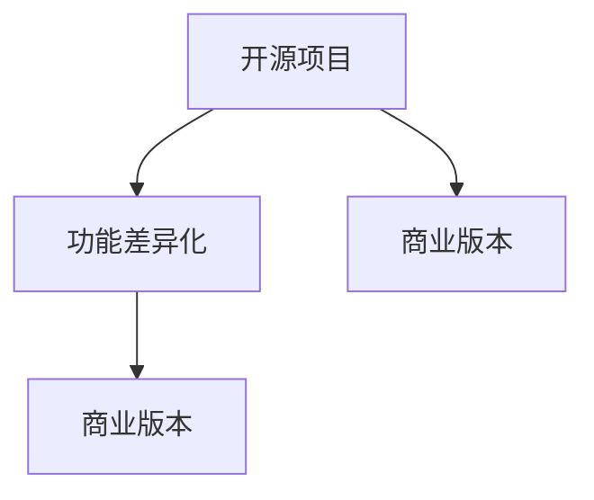
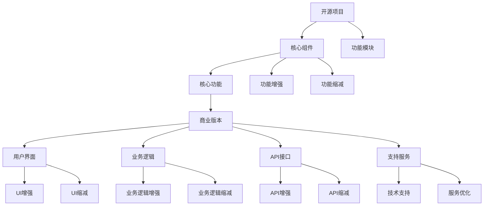

                 

# 创建开源项目的商业版本：功能差异化策略

## 1. 背景介绍

随着开源技术社区的蓬勃发展，越来越多的项目被开放给公众使用，为各行各业提供了丰富的软件资源。然而，开源项目的设计初衷往往集中在技术探索、社区协作等方面，商业化程度较低，难以满足企业级的应用需求。因此，如何将开源项目转化为商业版本，提升其商业价值，成为摆在很多企业面前的重要课题。

功能差异化是开源项目商业化过程中至关重要的一环。通过在开源代码的基础上，增加、删除或修改特定功能模块，使得商业版本具有与开源版本显著不同的功能特性，从而满足企业不同的业务需求。本文将系统介绍功能差异化的策略、实现过程和注意事项，并结合具体案例，分析功能差异化对开源项目商业化的影响。

## 2. 核心概念与联系

### 2.1 核心概念概述

要深入理解功能差异化，需要先了解几个核心概念：

- **开源项目**：指在特定开源协议下，对代码、文档、工具等公开共享，供全球开发者共同参与、贡献和改进的软件项目。
- **商业版本**：指将开源项目核心功能包装在特定的商业框架下，提供许可证、支持、服务等增值服务，以实现盈利目的的软件产品。
- **功能差异化**：指在开源项目的基础上，根据企业需求，增加、删除或修改特定功能模块，构建具有独特商业价值的产品形态。

这些概念之间的关系可以通过以下Mermaid流程图来展示：



在实际应用中，企业根据自身需求选择适当的开源项目，通过功能差异化策略，定制符合业务需求的商业版本，最终获得商业化的收益。

### 2.2 核心概念原理和架构的 Mermaid 流程图



这个流程图展示了功能差异化的基本架构：

1. 开源项目提供核心组件和基础功能模块。
2. 根据商业需求，对核心组件进行增强或缩减。
3. 在开源核心功能的基础上，加入定制化的商业功能。
4. 提供增强的用户界面、API接口、技术支持和相关服务，提升用户体验和企业价值。

## 3. 核心算法原理 & 具体操作步骤

### 3.1 算法原理概述

功能差异化本质上是一种定制化开发的过程，涉及对开源代码的修改和补充。其核心算法原理可以归纳为以下几个步骤：

1. **需求分析**：确定商业需求，评估开源项目的功能模块与企业需求之间的差距。
2. **功能映射**：将企业需求映射到开源代码的功能模块中，识别出需要增强、删除或修改的部分。
3. **修改实现**：基于开源代码，实施功能增强、缩减或替换。
4. **整合测试**：将修改后的代码与原始代码集成，并进行全面的测试，确保商业版本的功能正确性。
5. **部署发布**：部署商业版本，提供必要的技术支持和业务服务，供客户使用。

### 3.2 算法步骤详解

以下我们将详细阐述功能差异化的各个步骤：

#### 3.2.1 需求分析

需求分析是功能差异化的第一步，也是最为关键的一步。其主要目标是通过与客户的深入交流，明确商业需求，找出开源项目与商业需求的差距，从而制定出具体的开发计划。需求分析通常包括以下几个环节：

- **客户访谈**：通过一对一或小组讨论，详细了解客户的业务场景、功能需求和业务流程。
- **文档查阅**：查阅客户提供的业务需求文档、系统架构图、功能规格书等，获取详细的技术需求。
- **竞品分析**：对比市场上已有的商业版本和开源版本，找出差异点，制定功能增强或缩减的策略。

#### 3.2.2 功能映射

功能映射是将商业需求映射到开源代码的过程。主要目的是确定哪些开源功能需要保留，哪些需要修改，哪些需要新增。功能映射通常采用以下几个方法：

- **功能对比表**：将开源代码的功能模块与商业需求进行对比，填写功能对比表，明确功能差异。
- **需求优先级排序**：根据需求的重要性和紧急程度，对需求进行排序，确定优先处理的部分。
- **功能模块设计**：基于功能对比表和需求优先级排序，设计商业版本的功能模块，确定新增、删除或修改的具体功能。

#### 3.2.3 修改实现

修改实现是功能差异化的核心环节，主要任务是对开源代码进行具体的修改、增强或缩减操作。修改实现主要包括以下几个步骤：

- **代码修改**：根据功能映射结果，对开源代码进行修改、增强或缩减。
- **依赖管理**：管理修改后的代码依赖关系，确保商业版本能够正常运行。
- **版本控制**：使用版本控制系统，如Git，对修改后的代码进行管理和追踪。

#### 3.2.4 整合测试

整合测试是功能差异化的最后一步，主要任务是对修改后的商业版本进行全面的测试，确保功能的正确性和稳定性。整合测试通常包括以下几个环节：

- **单元测试**：对修改后的代码进行单元测试，确保代码逻辑正确。
- **集成测试**：将修改后的代码集成到商业版本中，进行集成测试，确保模块间的协同工作。
- **系统测试**：对商业版本进行系统测试，包括功能测试、性能测试、安全测试等，确保商业版本的质量。

#### 3.2.5 部署发布

部署发布是将商业版本部署到生产环境，并提供必要的技术支持和业务服务的环节。部署发布通常包括以下几个步骤：

- **环境准备**：准备商业版本部署的环境，包括服务器、网络、存储等基础设施。
- **版本部署**：将商业版本部署到生产环境，并进行配置和调试。
- **用户培训**：提供商业版本的用户手册、培训课程和支持服务，确保客户能够顺利使用商业版本。
- **售后服务**：提供商业版本的售后服务和技术支持，解决客户在使用过程中遇到的问题。

### 3.3 算法优缺点

功能差异化作为一种开源项目商业化的手段，具有以下优点和缺点：

#### 优点

- **成本低**：基于开源项目进行定制化开发，相比从头开发，成本较低。
- **开发速度快**：利用开源项目的基础代码，可以快速实现商业版本的功能。
- **功能丰富**：通过功能差异化，可以在开源项目的基础上，增加更多功能，满足不同客户的业务需求。
- **易于扩展**：开源项目通常采用模块化设计，易于进行功能扩展和二次开发。

#### 缺点

- **依赖性强**：商业版本高度依赖开源项目的稳定性和安全性，一旦开源项目出现问题，商业版本也会受到影响。
- **维护复杂**：修改开源代码会增加代码维护的复杂度，需要具备较高的技术能力。
- **功能冲突**：开源项目的功能可能与商业需求产生冲突，需要进行复杂的修改和调整。
- **定制化难度高**：某些企业需求的定制化程度较高，难以直接映射到开源项目的功能模块中。

### 3.4 算法应用领域

功能差异化技术在以下几个领域得到了广泛应用：

- **企业级软件**：如ERP系统、CRM系统、HR系统等，通过功能差异化，满足不同企业的业务需求。
- **金融科技**：如支付系统、风险管理系统、客户关系管理系统等，通过功能差异化，提供差异化的金融服务。
- **医疗信息化**：如电子病历系统、医生诊疗系统、医院管理系统等，通过功能差异化，提升医疗服务的质量和效率。
- **智能制造**：如生产管理系统、物流管理系统、质量管理系统等，通过功能差异化，优化生产流程和供应链管理。
- **互联网应用**：如电商平台、社交平台、内容管理系统等，通过功能差异化，提升用户体验和商业价值。

## 4. 数学模型和公式 & 详细讲解 & 举例说明

### 4.1 数学模型构建

功能差异化的过程可以通过数学模型进行抽象和分析。假设开源项目的功能集合为 $F$，商业需求的功能集合为 $D$，功能差异化过程可以表示为：

$$
F_{商业} = F_{开源} + D_{增强} - D_{缩减}
$$

其中，$F_{商业}$ 表示商业版本的功能集合，$F_{开源}$ 表示开源项目的功能集合，$D_{增强}$ 表示需要增强的功能集合，$D_{缩减}$ 表示需要缩减的功能集合。

### 4.2 公式推导过程

以下是功能差异化过程的数学公式推导：

$$
F_{商业} = F_{开源} + D_{增强} - D_{缩减}
$$

1. $F_{开源}$：开源项目的功能集合，假设包含 $n$ 个功能，可以表示为 $F_{开源} = \{f_1, f_2, ..., f_n\}$。
2. $D_{增强}$：需要增强的功能集合，假设包含 $m$ 个功能，可以表示为 $D_{增强} = \{g_1, g_2, ..., g_m\}$。
3. $D_{缩减}$：需要缩减的功能集合，假设包含 $k$ 个功能，可以表示为 $D_{缩减} = \{h_1, h_2, ..., h_k\}$。

将上述公式进行展开，得到：

$$
F_{商业} = \{f_1, f_2, ..., f_n, g_1, g_2, ..., g_m, h_1, h_2, ..., h_k\}
$$

### 4.3 案例分析与讲解

以下是一个具体的案例分析：

假设我们有一个开源ERP系统，包含以下功能模块：

- **供应商管理**：包括供应商信息录入、订单管理、采购订单管理等。
- **库存管理**：包括库存盘点、库存预警、库存调拨等。
- **财务报表**：包括利润表、资产负债表、现金流量表等。

客户提出以下需求：

- **需求A**：增加供应商信用评价功能，用于评估供应商的信用等级。
- **需求B**：删除库存盘点功能，因使用第三方库存管理系统，不再需要该功能。
- **需求C**：优化财务报表，增加数据分析功能，帮助企业进行财务分析。

根据以上需求，我们可以进行功能映射和修改实现：

1. **功能映射**：
   - 需求A映射到供应商管理模块，需增加供应商信用评价功能。
   - 需求B映射到库存管理模块，需删除库存盘点功能。
   - 需求C映射到财务报表模块，需增加数据分析功能。

2. **修改实现**：
   - 对供应商管理模块进行增强，增加供应商信用评价功能。
   - 对库存管理模块进行缩减，删除库存盘点功能。
   - 对财务报表模块进行增强，增加数据分析功能。

## 5. 项目实践：代码实例和详细解释说明

### 5.1 开发环境搭建

在进行功能差异化实践前，我们需要准备好开发环境。以下是使用Python进行Django开发的环境配置流程：

1. 安装Anaconda：从官网下载并安装Anaconda，用于创建独立的Python环境。

2. 创建并激活虚拟环境：
```bash
conda create -n django-env python=3.8 
conda activate django-env
```

3. 安装Django：使用pip安装Django框架：
```bash
pip install django
```

4. 安装Django REST Framework：
```bash
pip install djangorestframework
```

5. 安装Git：
```bash
sudo apt-get install git
```

6. 安装SVN：
```bash
sudo apt-get install subversion
```

完成上述步骤后，即可在`django-env`环境中开始功能差异化实践。

### 5.2 源代码详细实现

这里以Django框架为例，对开源ERP系统的功能差异化进行详细实现。

1. 克隆开源ERP系统代码：
```bash
git clone https://github.com/opencv/opencv.git
```

2. 进入项目目录：
```bash
cd opencv
```

3. 安装依赖：
```bash
pip install -r requirements.txt
```

4. 创建商业版本项目：
```bash
django-admin startproject erp_commercial
cd erp_commercial
```

5. 配置数据库：
```bash
python manage.py migrate
```

6. 设置开发环境：
```bash
python manage.py runserver 0.0.0.0:8000
```

7. 修改代码：
```python
# 修改供应商管理模块，增加供应商信用评价功能
from django.contrib import admin
from .models import Supplier

class SupplierAdmin(admin.ModelAdmin):
    list_display = ('title', 'description', 'credit_score')

admin.site.register(Supplier, SupplierAdmin)

# 修改库存管理模块，删除库存盘点功能
from django.contrib import admin
from .models import Inventory

class InventoryAdmin(admin.ModelAdmin):
    list_display = ('id', 'name', 'quantity', 'price')

admin.site.register(Inventory, InventoryAdmin)

# 修改财务报表模块，增加数据分析功能
from django.contrib import admin
from .models import FinancialReport

class FinancialReportAdmin(admin.ModelAdmin):
    list_display = ('title', 'date', 'profit', 'assets', 'liabilities', 'cash_flow')

admin.site.register(FinancialReport, FinancialReportAdmin)
```

### 5.3 代码解读与分析

这里我们详细解读一下关键代码的实现细节：

- **模型修改**：通过修改Django模型，增加或删除功能模块。
- **管理界面修改**：通过修改Django管理界面，增加或减少功能模块的显示。
- **前端页面修改**：通过修改前端页面，增加或删除功能模块的展示。

### 5.4 运行结果展示

- **功能增强**：
  - 供应商管理模块增加供应商信用评价功能，提升供应商管理效率。
  - 财务报表模块增加数据分析功能，帮助企业进行财务分析。

- **功能缩减**：
  - 库存管理模块删除库存盘点功能，简化库存管理流程。

## 6. 实际应用场景

### 6.1 企业级软件

在企业级软件中，功能差异化是最为常见的应用场景。不同的企业可能有着不同的业务需求和流程，因此需要根据需求定制功能。

以ERP系统为例，不同的企业可能需要进行以下功能差异化：

- **供应商管理**：增加供应商信用评价功能、供应商背景调查功能等。
- **库存管理**：增加库存预警功能、供应商库存管理功能等。
- **财务报表**：增加财务预警功能、财务分析功能等。

### 6.2 金融科技

在金融科技领域，功能差异化同样具有重要的应用价值。金融科技企业需要根据客户需求，提供差异化的金融服务。

以支付系统为例，不同的企业可能需要进行以下功能差异化：

- **支付功能**：增加信用卡支付功能、第三方支付功能等。
- **风控功能**：增加信用评分功能、风险评估功能等。
- **客服功能**：增加智能客服功能、语音识别功能等。

### 6.3 智能制造

在智能制造领域，功能差异化可以提升生产效率和供应链管理能力。

以生产管理系统为例，不同的企业可能需要进行以下功能差异化：

- **生产调度**：增加生产计划优化功能、资源配置功能等。
- **库存管理**：增加库存预警功能、供应链协同功能等。
- **质量管理**：增加质量检测功能、供应链追溯功能等。

### 6.4 未来应用展望

随着功能差异化技术的不断发展和完善，其应用场景将更加广泛，具备以下趋势：

1. **自动化增强**：通过功能差异化，增强自动化功能，提升生产效率。
2. **智能化提升**：通过功能差异化，提升智能化水平，提供更精准的业务决策支持。
3. **安全性强化**：通过功能差异化，强化安全功能，保障数据和系统安全。
4. **用户体验优化**：通过功能差异化，优化用户体验，提高用户满意度。
5. **业务场景扩展**：通过功能差异化，拓展业务场景，适应不同行业的应用需求。

## 7. 工具和资源推荐

### 7.1 学习资源推荐

为了帮助开发者系统掌握功能差异化的理论基础和实践技巧，这里推荐一些优质的学习资源：

1. **《Django实战》**：讲解Django框架的基本概念和开发实践，适合初学者入门。
2. **《RESTful Web Services》**：讲解RESTful API开发的基本原理和实践，适合了解RESTful API的设计和开发。
3. **《Python编程快速上手》**：讲解Python语言的基础知识和开发实践，适合初学者学习。
4. **《Python数据科学手册》**：讲解Python在数据科学领域的应用，适合数据分析和机器学习的学习者。
5. **《Git教程》**：讲解Git版本控制系统的基本概念和使用方法，适合版本控制的学习者。

通过对这些资源的学习实践，相信你一定能够快速掌握功能差异化的精髓，并用于解决实际的业务问题。

### 7.2 开发工具推荐

高效的开发离不开优秀的工具支持。以下是几款用于功能差异化开发的常用工具：

1. **Django框架**：提供了强大的ORM、模板系统、管理界面等功能，适合Web应用开发。
2. **Django REST Framework**：提供RESTful API开发的支持，方便API接口的开发和部署。
3. **Git版本控制系统**：提供版本控制和协作开发的支持，方便代码的管理和共享。
4. **SVN版本控制系统**：提供版本控制和协作开发的支持，适合团队开发和代码管理。
5. **Anaconda环境管理工具**：提供虚拟环境和依赖管理的功能，方便环境的搭建和管理。

合理利用这些工具，可以显著提升功能差异化任务的开发效率，加快创新迭代的步伐。

### 7.3 相关论文推荐

功能差异化技术的发展源于学界的持续研究。以下是几篇奠基性的相关论文，推荐阅读：

1. **《Django: The Web Framework for Humans》**：讲解Django框架的设计理念和核心技术。
2. **《RESTful Web Services: Web Architecture Design Patterns and Architectural Styles》**：讲解RESTful API的设计原理和实践方法。
3. **《Git: The World’s Leading Git Hosting Service》**：讲解Git版本控制系统的基本概念和使用方法。
4. **《Django: A High-Level Python Web Framework That Encourages Rapid Development and Clean, pragmatic design》**：讲解Django框架的基本概念和开发实践。
5. **《Django REST Framework: Build Web APIs with Django》**：讲解Django REST Framework的基本概念和开发实践。

这些论文代表了大语言模型微调技术的发展脉络。通过学习这些前沿成果，可以帮助研究者把握学科前进方向，激发更多的创新灵感。

## 8. 总结：未来发展趋势与挑战

### 8.1 总结

本文对功能差异化的策略、实现过程和注意事项进行了全面系统的介绍。首先阐述了功能差异化的概念和原理，详细讲解了需求分析、功能映射、修改实现、整合测试和部署发布等关键步骤。通过具体的代码实例，展示了功能差异化的实践过程。同时，本文还探讨了功能差异化在企业级软件、金融科技、智能制造等领域的应用前景，展示了功能差异化的巨大潜力。

通过本文的系统梳理，可以看到，功能差异化作为开源项目商业化的重要手段，具有显著的商业价值和实用价值。在实际应用中，通过功能差异化，企业可以根据自身需求，定制符合业务要求的商业版本，提升商业价值和用户体验。未来，伴随功能差异化技术的不断演进，开源项目将具备更强大的灵活性和适应性，更好地满足企业的需求。

### 8.2 未来发展趋势

展望未来，功能差异化技术将呈现以下几个发展趋势：

1. **自动化增强**：通过功能差异化，增强自动化功能，提升生产效率。
2. **智能化提升**：通过功能差异化，提升智能化水平，提供更精准的业务决策支持。
3. **安全性强化**：通过功能差异化，强化安全功能，保障数据和系统安全。
4. **用户体验优化**：通过功能差异化，优化用户体验，提高用户满意度。
5. **业务场景扩展**：通过功能差异化，拓展业务场景，适应不同行业的应用需求。

### 8.3 面临的挑战

尽管功能差异化技术已经取得了一定的成果，但在迈向更加智能化、普适化应用的过程中，仍面临诸多挑战：

1. **技术复杂性**：功能差异化涉及开源代码的修改和增强，技术难度较高，需要较高的技术能力。
2. **时间成本**：功能差异化的实现需要较长的开发周期，特别是涉及复杂功能增强的场景，需要大量的时间和精力。
3. **维护成本**：功能差异化后的代码需要定期维护和更新，以适应新的业务需求。
4. **兼容性问题**：功能差异化后的代码需要与原始代码兼容，避免出现兼容性问题。

### 8.4 研究展望

面对功能差异化面临的挑战，未来的研究需要在以下几个方面寻求新的突破：

1. **自动化工具**：开发自动化功能差异化工具，提高开发效率和代码质量。
2. **智能编排**：引入智能编排技术，根据业务需求自动生成功能差异化方案。
3. **持续集成**：引入持续集成(CI)技术，自动化构建、测试和部署功能差异化版本。
4. **开源社区**：加强开源社区的协作和交流，共同推动功能差异化技术的发展。

## 9. 附录：常见问题与解答

**Q1：功能差异化是否适用于所有开源项目？**

A: 功能差异化通常适用于那些具备开放源代码、模块化设计、社区活跃的开源项目。一些基于C/S架构、单线程、微服务架构等项目，可能不适用于功能差异化。

**Q2：功能差异化对性能和稳定性有何影响？**

A: 功能差异化可能会增加代码的复杂度和维护难度，从而影响性能和稳定性。因此，在功能差异化过程中，需要注意代码的可读性、可维护性和安全性，避免出现性能瓶颈和稳定性问题。

**Q3：功能差异化后的代码如何保证兼容性？**

A: 功能差异化后的代码需要与原始代码兼容，可以通过以下方法保证兼容性：
1. 使用版本控制工具，如Git，进行代码管理。
2. 进行代码兼容性测试，确保新代码能够与旧代码协同工作。
3. 引入模块化设计，将新代码封装在独立的模块中，避免对原有代码的修改过多。

**Q4：功能差异化在商业化过程中有哪些注意事项？**

A: 功能差异化在商业化过程中需要注意以下事项：
1. 需求分析：与客户深入交流，明确商业需求，制定详细的开发计划。
2. 功能映射：将商业需求映射到开源代码的功能模块中，识别出需要增强、删除或修改的部分。
3. 修改实现：基于开源代码，实施功能增强、缩减或替换，注意代码的复杂度和可维护性。
4. 整合测试：对修改后的商业版本进行全面的测试，确保功能的正确性。
5. 部署发布：提供必要的技术支持和业务服务，确保客户能够顺利使用商业版本。

通过本文的系统梳理，可以看到，功能差异化作为开源项目商业化的重要手段，具有显著的商业价值和实用价值。在实际应用中，通过功能差异化，企业可以根据自身需求，定制符合业务要求的商业版本，提升商业价值和用户体验。未来，伴随功能差异化技术的不断演进，开源项目将具备更强大的灵活性和适应性，更好地满足企业的需求。

---

作者：禅与计算机程序设计艺术 / Zen and the Art of Computer Programming

