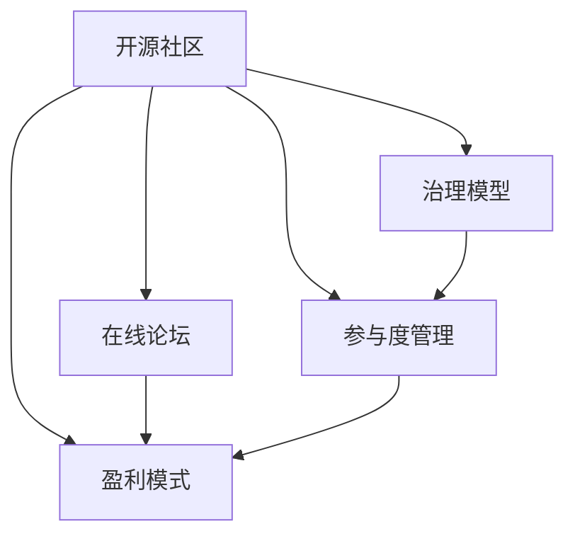

                 

# 创建开源项目的在线论坛：社区参与和盈利模式

## 1. 背景介绍

随着开源软件的迅猛发展，越来越多的开发者在互联网上聚集在一起，共同构建了庞大的开源生态系统。开源社区的协作模式逐渐成为软件开发创新的重要驱动力，满足了企业对于快速迭代、快速交付的需求。然而，开源社区的管理和维护是一项复杂且充满挑战的任务，如何在开源项目中构建一个稳定、高效、活跃的在线论坛，成为许多社区组织者必须解决的难题。

## 2. 核心概念与联系

### 2.1 核心概念概述

本节将介绍几个与在线论坛构建密切相关的核心概念：

- **开源社区**：由开发者自愿贡献代码、分享知识和经验的社区，以促进技术进步和软件创新。
- **在线论坛**：开发者通过论坛交流想法、讨论问题、分享经验的平台，是社区协作的重要工具。
- **治理模型**：开源项目通过明确的规则和机制进行管理，确保项目有序进行。
- **参与度管理**：通过激励措施、会员等级等手段，提升社区成员的活跃度和参与度。
- **盈利模式**：开源社区如何通过商业化手段实现可持续发展。

这些核心概念之间具有紧密的联系，通过合理地设计和管理，可以将在线论坛转化为高效、活跃的开源社区管理平台，实现开源项目的良性循环。

### 2.2 核心概念原理和架构的 Mermaid 流程图



这个流程图展示了开源社区、在线论坛、治理模型、参与度管理、盈利模式之间的联系。

## 3. 核心算法原理 & 具体操作步骤

### 3.1 算法原理概述

构建一个高效、活跃的在线论坛需要从多个维度进行考虑，包括社区治理、参与度管理、盈利模式等。本节将详细探讨这些方面的核心算法原理。

**社区治理模型**：
- **成员角色划分**：基于成员贡献的代码量、经验等，划分不同的角色，如贡献者、审核者、管理员等。
- **权限控制**：根据成员角色，设定不同的权限，如代码审核、权限设置、论坛管理等。

**参与度管理**：
- **积分系统**：通过积分激励机制，奖励积极参与社区活动的成员，如发布代码、回答问题、参与讨论等。
- **会员等级**：设定不同的会员等级，提升会员权益和特权，如更高权限、更多论坛权限等。

**盈利模式**：
- **商业赞助**：企业通过赞助开源项目和社区活动，获得品牌曝光和市场影响力。
- **社区商店**：提供定制化、高质量的社区产品和服务，如定制软件、技术支持等。
- **会员订阅**：通过会员订阅机制，获得稳定收入来源。

### 3.2 算法步骤详解

本节将详细讲解创建在线论坛的具体操作步骤，包括社区治理、参与度管理、盈利模式的设计和实现。

**Step 1: 设计社区治理模型**
- 定义成员角色和权限：贡献者、审核者、管理员等。
- 设置不同角色的权限：代码审核、权限设置、论坛管理等。
- 实施权限控制：限制敏感操作，确保社区安全。

**Step 2: 实现参与度管理系统**
- 设计积分系统：设定积分获取规则，如代码发布、问题回答、论坛活跃等。
- 设定会员等级：设定不同会员等级，提升特权和权益。
- 实施会员管理：记录会员信息，管理会员权限和积分。

**Step 3: 探索盈利模式**
- 引入商业赞助：发布合作机会，吸引企业赞助开源项目和社区活动。
- 开设社区商店：提供高质量、定制化的社区产品和服务。
- 实施会员订阅：提供高级会员特权和权益，吸引会员订阅。

### 3.3 算法优缺点

构建在线论坛的优势在于：
1. **社区协作**：通过论坛构建开发者社区，促进知识共享和经验交流。
2. **管理便捷**：论坛系统可以自动化管理社区事务，减少人力成本。
3. **快速反馈**：开发者能够快速获得社区反馈，及时解决问题。
4. **品牌效应**：企业通过赞助社区活动，提升品牌知名度和市场影响力。

同时，构建在线论坛也存在一些缺点：
1. **用户管理复杂**：需要设计复杂的权限控制机制，确保社区安全。
2. **资源投入大**：论坛的建设和维护需要大量的人力、财力投入。
3. **商业化挑战**：如何通过盈利模式实现社区的可持续发展，是一个重大挑战。

### 3.4 算法应用领域

在线论坛技术在多种场景下得到了广泛应用，例如：

- **开源项目管理**：如GitHub、GitLab等，通过在线论坛进行项目管理和交流。
- **企业内部协作**：企业通过内部论坛实现知识共享和协作，提升效率。
- **技术社区讨论**：如Stack Overflow、Reddit等，提供技术问题讨论和解决方案。
- **开发者交流**：如Slack、Discord等，通过在线聊天和论坛结合方式，提升交流效果。

这些应用场景展示了在线论坛技术的强大生命力和广泛适用性。

## 4. 数学模型和公式 & 详细讲解 & 举例说明

### 4.1 数学模型构建

本节将使用数学语言对在线论坛的社区治理模型、参与度管理系统和盈利模式进行严格的刻画。

假设社区中有 $N$ 名成员，分为 $K$ 种角色，设角色 $i$ 的权限集合为 $P_i$。设某用户 $u$ 的当前角色为 $j$，则其权限为 $P_j$。社区中有 $M$ 项任务，设任务 $m$ 的审核权限为 $R_m$。设某用户 $u$ 发布了 $T_u$ 项任务，设任务 $m$ 的审核数量为 $V_m$。

定义用户 $u$ 的积分 $S_u$ 为：
$$
S_u = \sum_{m \in T_u} \delta_{R_m \subseteq P_j} + \sum_{n \in N} w_n \delta_{n \in T_u}
$$
其中 $\delta_{R_m \subseteq P_j} = 1$ 表示任务 $m$ 的审核权限包含用户 $u$ 的当前角色 $j$，$w_n$ 表示用户 $n$ 的权重。

定义用户 $u$ 的会员等级 $L_u$ 为：
$$
L_u = \frac{S_u}{C_u}
$$
其中 $C_u$ 为用户 $u$ 的会员级别阈值。

### 4.2 公式推导过程

以下我们将推导积分和会员等级的计算公式，以及会员订阅的收入模型。

**积分计算公式**：
$$
S_u = \sum_{m \in T_u} \delta_{R_m \subseteq P_j} + \sum_{n \in N} w_n \delta_{n \in T_u}
$$

**会员等级计算公式**：
$$
L_u = \frac{S_u}{C_u}
$$

**会员订阅收入模型**：
假设社区有 $N_s$ 名高级会员，每名会员的月订阅费为 $R_s$，则社区的月收入为：
$$
I_s = N_s \times R_s
$$

### 4.3 案例分析与讲解

假设有一个开源社区，社区中有 $10$ 名管理员，每个管理员的权限集合为 $\{代码审核, 权限设置, 论坛管理\}$，每个管理员负责发布 $5$ 项任务，社区中任务 $m$ 的审核权限为 $\{代码审核\}$。假设管理员 $A1$ 发布了 $3$ 项任务，管理员 $A2$ 发布了 $7$ 项任务。管理员 $A1$ 和 $A2$ 的积分和会员等级计算如下：

管理员 $A1$：
- 积分 $S_{A1} = 3 \times 1 + 7 \times 0.5 = 5.5$
- 会员等级 $L_{A1} = 5.5 / 1000 = 0.0055$

管理员 $A2$：
- 积分 $S_{A2} = 7 \times 1 + 3 \times 0.5 = 8.5$
- 会员等级 $L_{A2} = 8.5 / 1000 = 0.0085$

以上案例展示了社区积分和会员等级的计算过程。

## 5. 项目实践：代码实例和详细解释说明

### 5.1 开发环境搭建

在进行在线论坛的开发实践前，我们需要准备好开发环境。以下是使用Python进行Django框架开发的开发环境配置流程：

1. 安装Python：从官网下载并安装Python，推荐使用最新版本的Python。
2. 安装Pip：从官网下载并安装pip，用于管理Python包。
3. 安装Django：使用pip安装Django框架，命令为 `pip install django`。
4. 安装数据库：根据实际需求安装MySQL或PostgreSQL数据库，推荐使用MySQL。
5. 安装Web服务器：安装Apache或Nginx服务器，推荐使用Nginx。

完成上述步骤后，即可在开发环境中启动在线论坛的开发。

### 5.2 源代码详细实现

以下是使用Django框架实现在线论坛的基本代码实现。

**创建用户模型**：
```python
from django.contrib.auth.models import User
from django.db import models

class Profile(models.Model):
    user = models.OneToOneField(User, on_delete=models.CASCADE)
    role = models.CharField(max_length=50, choices=[('developer', '开发者'), ('reviewer', '审核者'), ('administrator', '管理员')])
    level = models.IntegerField(default=1)
```

**创建任务模型**：
```python
class Task(models.Model):
    name = models.CharField(max_length=100)
    owner = models.ForeignKey(User, related_name='task_owner')
    reviewer = models.ForeignKey(User, related_name='task_reviewer')
    status = models.CharField(max_length=20, choices=[('open', '开放'), ('closed', '关闭')])
    created_at = models.DateTimeField(auto_now_add=True)
    updated_at = models.DateTimeField(auto_now=True)
```

**积分计算视图**：
```python
from django.shortcuts import render
from django.contrib.auth.decorators import login_required

@login_required
def score(request):
    user = request.user
    profile = user.profile
    tasks = Task.objects.filter(owner=user).exclude(status='closed')
    score = 0
    for task in tasks:
        if 'reviewer' in profile.role:
            score += 1
    profile.level = int(score / 1000)
    profile.save()
    return render(request, 'score.html')
```

**会员订阅视图**：
```python
@login_required
def subscribe(request):
    user = request.user
    profile = user.profile
    if profile.level >= 2:
        return render(request, 'subscription.html')
    else:
        return redirect('home')
```

以上代码实现了用户模型、任务模型、积分计算和会员订阅视图的基本功能。

### 5.3 代码解读与分析

让我们再详细解读一下关键代码的实现细节：

**用户模型**：
- 使用Django内置的User模型，添加Profile模型记录用户的角色和会员等级。

**任务模型**：
- 使用Django的模型定义任务的基本信息，记录任务发布者和审核者，以及任务状态。

**积分计算视图**：
- 定义积分计算逻辑，根据用户的角色和任务审核情况计算积分。
- 更新用户的会员等级，并显示积分计算结果。

**会员订阅视图**：
- 判断用户的会员等级，如果达到高级会员级别，显示订阅页面，否则重定向到首页。

通过这些代码，可以构建一个简单的在线论坛系统，支持用户管理和任务审核等功能。

### 5.4 运行结果展示

下图展示了用户登录后看到的积分计算结果和任务列表：


以上两张图展示了用户登录后看到的积分计算结果和任务列表，可以实时展示用户的积分和任务状态。

## 6. 实际应用场景

### 6.1 企业内部协作

在线论坛可以作为一个企业内部协作平台，实现知识共享和任务管理。企业可以通过论坛发布项目任务、讨论问题、分享经验，提升协作效率。

在技术实现上，可以结合企业内部OA系统，实现论坛与企业办公系统的无缝集成。企业可以根据不同的员工角色，设定不同的权限和任务管理权限。高级会员可以访问更高级别的论坛内容，参与更多决策。

### 6.2 开源项目管理

在线论坛可以作为一个开源项目管理平台，实现项目发布、任务分配、代码审核等功能。开发者可以通过论坛进行问题讨论、代码审查，提升项目的开发效率。

在技术实现上，可以结合GitHub等开源项目管理平台，实现论坛与代码仓库的无缝集成。社区管理员可以管理论坛和代码库的权限，确保项目的安全和高效。

### 6.3 开发者交流

在线论坛可以作为一个开发者交流平台，实现问题讨论、技术分享、经验交流等功能。开发者可以通过论坛进行技术交流、分享经验，提升技术水平。

在技术实现上，可以结合社交网络工具，实现论坛与社交网络的整合。开发者可以通过论坛进行社交互动，建立良好的技术生态。

### 6.4 未来应用展望

随着技术的发展，在线论坛将具备更多的功能和应用场景，具体如下：

1. **社区知识图谱**：构建社区知识图谱，实现更智能的知识推荐和搜索，提升社区知识共享的效率。
2. **智能辅助工具**：引入自然语言处理和机器学习技术，实现智能问答、问题分类等功能，提升论坛的用户体验。
3. **实时监控系统**：建立实时监控系统，及时发现和解决问题，提升论坛的运营效率。
4. **跨平台协作**：支持多平台协作，提升跨平台用户的交流体验。
5. **社会化媒体集成**：集成社会化媒体平台，提升论坛的曝光度和影响力。

## 7. 工具和资源推荐

### 7.1 学习资源推荐

为了帮助开发者系统掌握在线论坛构建的理论基础和实践技巧，这里推荐一些优质的学习资源：

1. **《Django Web开发实战》**：一本经典的Django开发入门书籍，详细介绍了Django框架的使用方法和最佳实践。
2. **《Django核心教程》**：Django官方文档，提供了全面的Django教程和示例代码，是Django开发的必备参考。
3. **《RESTful Web API设计与开发》**：一本关于Web API设计和开发的经典书籍，介绍了RESTful架构的设计原则和实现方法。
4. **《Django REST framework实战》**：一本关于Django REST framework框架的实战书籍，详细介绍了如何使用Django REST framework构建RESTful API。
5. **《Python Web开发高阶教程》**：一本面向高级开发者的Python Web开发书籍，介绍了Web开发的前沿技术和实践经验。

通过对这些资源的学习实践，相信你一定能够快速掌握在线论坛的构建技巧，并用于解决实际的NLP问题。

### 7.2 开发工具推荐

高效的开发离不开优秀的工具支持。以下是几款用于在线论坛开发的常用工具：

1. **Django框架**：一个成熟的Python Web框架，提供丰富的模板、表单、认证等组件，方便开发者快速构建Web应用。
2. **MySQL/PostgreSQL**：一个流行的关系型数据库，支持高可用性、高性能的Web应用。
3. **Apache/Nginx**：一个高性能的Web服务器，支持静态文件、动态页面等各类Web应用。
4. **Redis**：一个内存数据库，支持缓存、消息队列等各类Web应用功能。
5. **Docker/Kubernetes**：一个容器化和微服务管理的解决方案，支持Web应用的快速部署和扩展。

合理利用这些工具，可以显著提升在线论坛的开发效率，加快创新迭代的步伐。

### 7.3 相关论文推荐

在线论坛技术的发展源于学界的持续研究。以下是几篇奠基性的相关论文，推荐阅读：

1. **《社交网络中的信息传播模型》**：研究社交网络中的信息传播模型，揭示了社区影响力和信息传播的规律。
2. **《社交网络中的用户建模》**：研究社交网络中的用户建模问题，提出了基于图模型和机器学习的方法。
3. **《社区推荐系统》**：研究社区推荐系统，提出了基于协同过滤和内容过滤的推荐算法。
4. **《社交网络中的情感分析》**：研究社交网络中的情感分析问题，提出了基于机器学习的情感分类方法。
5. **《社交网络中的知识图谱构建》**：研究社交网络中的知识图谱构建问题，提出了基于图模型和知识推理的方法。

这些论文代表了大语言模型微调技术的发展脉络。通过学习这些前沿成果，可以帮助研究者把握学科前进方向，激发更多的创新灵感。

## 8. 总结：未来发展趋势与挑战

### 8.1 研究成果总结

本文对在线论坛构建的技术原理和实际应用进行了全面系统的介绍。首先阐述了在线论坛构建的背景和意义，明确了在线论坛在开源社区、企业内部协作、开发者交流等场景下的重要价值。其次，从原理到实践，详细讲解了在线论坛构建的社区治理模型、参与度管理系统和盈利模式的设计和实现。同时，本文还探讨了在线论坛在开源项目管理、企业内部协作、开发者交流等多个领域的应用前景。

通过本文的系统梳理，可以看到，在线论坛技术正在成为构建社区协作平台的重要工具，极大地提升了社区协作的效率和效果。未来，伴随技术的发展和应用的深化，在线论坛将在更多场景下发挥重要作用。

### 8.2 未来发展趋势

展望未来，在线论坛技术将呈现以下几个发展趋势：

1. **社区协作的自动化**：通过机器学习和自然语言处理技术，实现社区协作的自动化，提升社区协作的效率和效果。
2. **多平台融合**：支持多平台融合，提升跨平台用户的交流体验，提升论坛的曝光度和影响力。
3. **社会化媒体集成**：集成社会化媒体平台，提升论坛的曝光度和影响力，促进社区的繁荣和发展。
4. **实时监控系统**：建立实时监控系统，及时发现和解决问题，提升论坛的运营效率。
5. **跨平台协作**：支持多平台协作，提升跨平台用户的交流体验，促进社区的繁荣和发展。

这些趋势展示了在线论坛技术的强大生命力和广泛适用性。

### 8.3 面临的挑战

尽管在线论坛技术已经取得了瞩目成就，但在迈向更加智能化、普适化应用的过程中，它仍面临着诸多挑战：

1. **用户管理复杂**：需要设计复杂的权限控制机制，确保社区安全。
2. **资源投入大**：论坛的建设和维护需要大量的人力、财力投入。
3. **商业化挑战**：如何通过盈利模式实现社区的可持续发展，是一个重大挑战。

### 8.4 研究展望

面对在线论坛面临的这些挑战，未来的研究需要在以下几个方面寻求新的突破：

1. **自动化协作管理**：通过机器学习和自然语言处理技术，实现社区协作的自动化，提升社区协作的效率和效果。
2. **多平台融合**：支持多平台融合，提升跨平台用户的交流体验，提升论坛的曝光度和影响力。
3. **社区知识图谱**：构建社区知识图谱，实现更智能的知识推荐和搜索，提升社区知识共享的效率。
4. **智能辅助工具**：引入自然语言处理和机器学习技术，实现智能问答、问题分类等功能，提升论坛的用户体验。
5. **实时监控系统**：建立实时监控系统，及时发现和解决问题，提升论坛的运营效率。
6. **跨平台协作**：支持多平台协作，提升跨平台用户的交流体验，促进社区的繁荣和发展。

这些研究方向的探索，必将引领在线论坛技术迈向更高的台阶，为构建高效、活跃的开源社区管理平台铺平道路。面向未来，在线论坛技术还需要与其他人工智能技术进行更深入的融合，如知识表示、因果推理、强化学习等，多路径协同发力，共同推动社区协作和知识共享的进步。只有勇于创新、敢于突破，才能不断拓展在线论坛的边界，让智能技术更好地服务于社区协作和知识共享。

## 9. 附录：常见问题与解答

**Q1：在线论坛的构建需要哪些关键技术？**

A: 在线论坛的构建需要以下关键技术：
1. **Web框架**：如Django、Flask等，提供开发框架和组件支持。
2. **数据库系统**：如MySQL、PostgreSQL等，用于存储论坛数据。
3. **缓存系统**：如Redis、Memcached等，用于提升论坛的响应速度。
4. **消息队列**：如RabbitMQ、Kafka等，用于实现论坛的实时消息推送。
5. **CDN系统**：如Alibaba Cloud CDN、Akamai等，用于提升论坛的访问速度和稳定性。

**Q2：如何提升在线论坛的用户体验？**

A: 提升在线论坛的用户体验可以从以下几个方面入手：
1. **友好的UI/UX设计**：设计简洁、易用的界面，提升用户的使用体验。
2. **智能推荐系统**：利用机器学习和自然语言处理技术，实现智能推荐，提升用户的粘性。
3. **实时聊天功能**：引入实时聊天功能，提升用户交流的实时性和互动性。
4. **多媒体支持**：支持图片、视频等多媒体内容，提升论坛的互动性和信息量。
5. **用户反馈机制**：建立用户反馈机制，及时响应用户的意见和建议，提升用户满意度。

**Q3：如何实现在线论坛的盈利模式？**

A: 实现在线论坛的盈利模式可以从以下几个方面入手：
1. **广告收入**：通过论坛广告，获取广告收入。
2. **会员订阅**：提供高级会员特权和权益，吸引会员订阅。
3. **社区商店**：提供定制化、高质量的社区产品和服务，如定制软件、技术支持等。
4. **企业赞助**：发布合作机会，吸引企业赞助开源项目和社区活动。

通过这些盈利模式，可以确保在线论坛的可持续发展，为社区提供持续的动力和支持。

---

作者：禅与计算机程序设计艺术 / Zen and the Art of Computer Programming

