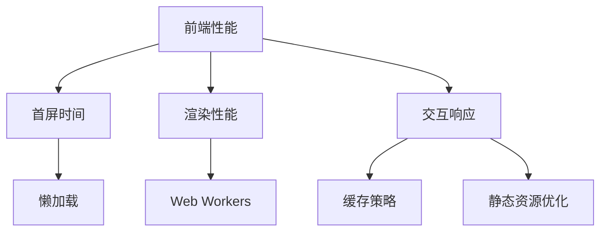

                 

## 1. 背景介绍

在Web应用开发中，前端性能优化始终是一个永恒的主题。随着互联网应用的快速发展，用户对网站的要求也日益提高，从传统的关注内容质量转变为更加注重页面加载速度和交互体验。一个加载缓慢的网站会严重降低用户体验，甚至导致大量用户流失。

### 1.1 问题由来
在Web开发初期，前端页面由简单的HTML和CSS组成，随着功能需求的增加，JavaScript的应用越来越广泛，导致了页面体积的急剧膨胀。与此同时，用户对交互体验的要求也逐渐提升，如何平衡加载速度和用户体验，成为前端开发中的一大难题。

### 1.2 问题核心关键点
前端性能优化旨在通过优化代码、资源、渲染策略等手段，提升页面的加载速度和渲染性能。其核心在于如何减少页面首屏时间，提升页面交互响应性，同时确保用户感知到页面流畅度。

为了实现这一目标，前端开发需要考虑以下几个关键点：

- 加载速度：通过减少HTTP请求、压缩资源、使用CDN等手段，减少页面加载时间。
- 渲染性能：通过优化DOM结构、减少重排重绘、使用Web Workers等手段，提升页面的渲染效率。
- 交互响应：通过懒加载、虚拟DOM、异步加载等手段，提升页面交互的流畅性和响应速度。

## 2. 核心概念与联系

### 2.1 核心概念概述

为更好地理解前端性能优化的原理和实践，本节将介绍几个密切相关的核心概念：

- 前端性能（Frontend Performance）：指网站在加载、渲染和交互过程中的响应速度和稳定性，是用户体验的重要组成部分。
- 首屏时间（First Contentful Paint, FCP）：指页面从请求开始到首次渲染可交互内容的时间。
- 渲染性能（Rendering Performance）：指页面在渲染过程中的响应速度和流畅度，直接关系到用户的使用感受。
- 交互响应（Interactive Performance）：指页面在交互过程中响应时间的稳定性，用户感知最直观的表现。
- 懒加载（Lazy Loading）：指在用户滚动到可视区域内才加载对应的资源，减少初始页面加载时间和带宽消耗。
- Web Workers：浏览器提供的JavaScript多线程机制，可用于异步处理计算密集型任务，提升页面渲染效率。
- 缓存策略（Caching Strategy）：指如何管理和利用浏览器缓存，减少重复资源加载。
- 静态资源优化（Static Resource Optimization）：指通过压缩、合并、压缩图片等手段，减少静态资源的体积和加载时间。

这些核心概念之间的逻辑关系可以通过以下Mermaid流程图来展示：



这个流程图展示前端性能优化的核心概念及其之间的关系：

1. 前端性能包括首屏时间、渲染性能、交互响应等多个维度。
2. 首屏时间受懒加载、静态资源优化等策略影响。
3. 渲染性能受Web Workers等异步技术影响。
4. 交互响应受缓存策略等技术影响。
5. 懒加载、Web Workers、缓存策略和静态资源优化等技术相互配合，共同提升前端性能。

## 3. 核心算法原理 & 具体操作步骤
### 3.1 算法原理概述

前端性能优化涉及多个方面的算法和技术，其核心在于通过减少页面加载时间、提升渲染效率、提高交互响应速度等手段，最大化提升用户体验。

### 3.2 算法步骤详解

前端性能优化的算法步骤主要包括以下几个关键环节：

**Step 1: 评估前端性能**

- 使用工具（如Lighthouse、PageSpeed Insights等）进行页面性能评估，获取加载时间、渲染时间、交互时间等关键指标。
- 分析性能瓶颈，确定需要优化的环节。

**Step 2: 优化静态资源**

- 压缩图片、CSS、JavaScript等静态资源，减小文件体积。
- 合并文件，减少HTTP请求次数。
- 使用CDN加速静态资源的加载。

**Step 3: 优化动态资源**

- 使用懒加载技术，延迟加载非关键资源。
- 使用Web Workers异步处理计算密集型任务。
- 优化DOM结构，减少重排重绘。

**Step 4: 优化缓存策略**

- 合理使用浏览器缓存，减少重复加载资源。
- 设置恰当的缓存有效期，提高加载效率。

**Step 5: 优化前端框架**

- 选择性能优秀的前端框架（如React、Vue等），优化渲染性能。
- 使用虚拟DOM技术，减少DOM操作次数。
- 使用组件化开发，提高代码复用性。

**Step 6: 优化交互体验**

- 使用滚动事件监听、懒加载等技术，提升页面滚动流畅性。
- 使用JavaScript动画库（如GSAP、Anime.js等），提升动画效果。
- 使用响应式设计，适应不同设备和分辨率。

### 3.3 算法优缺点

前端性能优化的算法具有以下优点：

- 提升用户体验。通过减少页面加载时间、提升渲染效率和交互响应速度，显著改善用户体验。
- 提高SEO效果。优化的页面往往加载更快，搜索引擎爬虫的抓取效率也更高，有助于提升网站的SEO排名。
- 节省带宽。通过压缩静态资源和使用CDN，减少页面请求次数，节省带宽资源。
- 增强可维护性。优化后的代码更易于维护和更新，减少bug发生的可能性。

同时，该算法也存在一定的局限性：

- 初期成本高。优化需要投入大量的精力和时间，初期成本较高。
- 受限于技术栈。不同技术栈的优化手段和效果可能存在差异。
- 更新周期快。前端技术发展迅速，新特性和工具不断涌现，需要持续跟踪和更新优化策略。
- 性能瓶颈复杂。前端性能受多种因素影响，分析性能瓶颈往往需要深入排查，才能找到根源。

尽管存在这些局限性，但就目前而言，前端性能优化是提升Web应用性能的重要手段。未来相关研究的重点在于如何更智能化、自动化的进行性能优化，以及如何更好地结合用户行为数据，进行更精细化的优化。

### 3.4 算法应用领域

前端性能优化在Web应用开发中得到了广泛的应用，涵盖了前端渲染、交互、用户体验等多个方面，例如：

- 前端渲染性能优化：通过优化DOM结构、使用Web Workers等手段，提升页面渲染效率。
- 交互性能优化：通过懒加载、虚拟DOM等技术，提升页面交互的流畅性和响应速度。
- 用户体验优化：通过减少页面加载时间、优化滚动体验等手段，提升用户的使用感受。
- 移动端性能优化：针对移动端设备的小屏特性，进行适配和优化，确保在移动设备上的良好表现。
- 多设备适配：通过响应式设计、跨浏览器测试等手段，确保在不同设备和浏览器上的一致性。

除了这些经典应用外，前端性能优化还被创新性地应用到更多场景中，如可访问性（Accessibility）、语义化（Semantic）、数据驱动（Data-Driven）等，为Web应用带来了全新的突破。随着前端技术的不断演进，相信前端性能优化必将在更广阔的应用领域发挥更大的作用。

## 4. 数学模型和公式 & 详细讲解 & 举例说明

### 4.1 数学模型构建

前端性能优化的数学模型主要基于以下关键指标：

- 页面加载时间（Time to First Byte, TTFB）：指页面请求开始到收到第一个字节的时间。
- 首屏时间（First Contentful Paint, FCP）：指页面从请求开始到首次渲染可交互内容的时间。
- 页面渲染时间（Time to Interactive, TTI）：指页面从请求开始到可交互的时间。
- 页面资源加载时间（Total Time）：指页面从请求开始到所有资源加载完成的时间。

这些指标可以通过以下数学公式进行计算：

$$
TTFB = t_1 - t_0
$$

$$
FCP = t_2 - t_0
$$

$$
TTI = t_3 - t_0
$$

$$
Total\ Time = t_4 - t_0
$$

其中，$t_0$ 表示页面请求开始时间，$t_1$ 表示收到第一个字节的时间，$t_2$ 表示首次渲染可交互内容的时间，$t_3$ 表示可交互的时间，$t_4$ 表示所有资源加载完成的时间。

### 4.2 公式推导过程

以首屏时间（FCP）的计算为例，推导其公式：

假设页面请求开始时间为 $t_0$，接收第一个字节的时间为 $t_1$，首屏渲染完成的时间为 $t_2$。则首屏时间（FCP）的计算公式为：

$$
FCP = t_2 - t_0
$$

其中，$t_2$ 可以进一步推导为：

$$
t_2 = \min(t_{parse}, t_{render}, t_{paint})
$$

其中，$t_{parse}$ 表示解析HTML和CSS代码的时间，$t_{render}$ 表示渲染DOM结构的时间，$t_{paint}$ 表示绘制页面的时间。因此，FCP的计算公式为：

$$
FCP = \min(t_{parse}, t_{render}, t_{paint}) - t_0
$$

### 4.3 案例分析与讲解

以下以一个实际的Web应用为例，分析其前端性能优化过程：

**案例背景**：
某电商平台首页包含大量动态内容，如商品列表、活动弹窗等，初期加载时间为2秒左右，用户体验较差。

**优化过程**：

1. **静态资源优化**：
   - 压缩图片、CSS、JavaScript等静态资源，减小文件体积。
   - 合并文件，减少HTTP请求次数。
   - 使用CDN加速静态资源的加载。

2. **动态资源优化**：
   - 使用懒加载技术，延迟加载非关键资源。
   - 使用Web Workers异步处理计算密集型任务。
   - 优化DOM结构，减少重排重绘。

3. **缓存策略优化**：
   - 合理使用浏览器缓存，减少重复加载资源。
   - 设置恰当的缓存有效期，提高加载效率。

4. **前端框架优化**：
   - 选择性能优秀的前端框架（如React、Vue等），优化渲染性能。
   - 使用虚拟DOM技术，减少DOM操作次数。
   - 使用组件化开发，提高代码复用性。

5. **交互体验优化**：
   - 使用滚动事件监听、懒加载等技术，提升页面滚动流畅性。
   - 使用JavaScript动画库（如GSAP、Anime.js等），提升动画效果。
   - 使用响应式设计，适应不同设备和分辨率。

**优化结果**：
优化后，页面首屏时间从2秒降低到0.5秒左右，用户体验显著提升。同时，使用CDN后，静态资源的加载时间也显著降低，减少了带宽消耗。

## 5. 项目实践：代码实例和详细解释说明
### 5.1 开发环境搭建

在进行前端性能优化实践前，我们需要准备好开发环境。以下是使用WebStorm进行前端性能优化环境配置流程：

1. 安装WebStorm：从官网下载并安装WebStorm，免费提供完整的IDE功能，支持前端开发和测试。

2. 安装Node.js：从官网下载安装Node.js，支持JavaScript和npm包管理，方便前端开发。

3. 安装npm工具：通过npm安装一些常用的npm包，如Lighthouse、Webpack等，进行前端性能评估和优化。

4. 配置Webpack：Webpack是常用的前端打包工具，支持模块化开发和资源优化。可以通过配置Webpack的loader和plugins，进行代码压缩、资源优化等操作。

完成上述步骤后，即可在WebStorm中开始前端性能优化实践。

### 5.2 源代码详细实现

这里我们以一个典型的Web应用为例，给出使用Webpack和Lighthouse进行前端性能优化的WebStorm代码实现。

首先，创建一个新的Web应用项目：

```bash
mkdir my-web-app
cd my-web-app
npm init -y
```

然后，安装必要的依赖包：

```bash
npm install lighthouse webpack webpack-cli babel-loader @babel/core @babel/preset-env --save-dev
```

接着，编写Webpack配置文件，进行资源打包和优化：

```javascript
// webpack.config.js
const path = require('path');
const webpack = require('webpack');

module.exports = {
    entry: './src/index.js',
    output: {
        path: path.resolve(__dirname, 'dist'),
        filename: 'bundle.js'
    },
    module: {
        rules: [
            {
                test: /\.js$/,
                exclude: /node_modules/,
                use: {
                    loader: 'babel-loader',
                    options: {
                        presets: ['@babel/preset-env']
                    }
                }
            }
        ]
    },
    optimization: {
        minimize: true,
        minimizer: [
            new webpack.optimize.UglifyJsPlugin()
        ]
    },
    plugins: [
        new webpack.DefinePlugin({
            __DEV__: JSON.stringify(false)
        })
    ]
};
```

然后，使用Webpack打包和优化代码：

```bash
npx webpack
```

在Webpack打包完成后，使用Lighthouse进行性能评估：

```bash
npx lighthouse .
```

Lighthouse会生成一份详细的性能报告，分析页面加载速度、渲染性能、交互响应等各个维度，帮助开发者进行优化。

### 5.3 代码解读与分析

让我们再详细解读一下关键代码的实现细节：

**Webpack配置文件**：
- `entry`：指定入口文件，通常为JavaScript文件的入口。
- `output`：指定打包后的文件路径和名称。
- `module`：配置资源加载规则，这里使用BabelLoader进行JavaScript代码的转换和优化。
- `optimization`：配置优化策略，这里使用UglifyJsPlugin进行代码压缩。
- `plugins`：配置Webpack插件，这里使用DefinePlugin将开发环境标志定义为一个常量，以便在生产环境中关闭一些调试工具。

**Lighthouse报告**：
- Lighthouse会分析页面的各个性能指标，包括TTFB、FCP、TTI、Total Time等。
- 会提供具体的优化建议，如减少HTTP请求、压缩资源、使用CDN等。
- 会给出具体的优化路径，帮助开发者逐一解决问题。

在实际开发中，Webpack和Lighthouse的组合使用可以极大提高前端性能优化的效率和效果。开发者可以根据Lighthouse的优化建议，在Webpack配置文件中进行相应的调整，快速提升页面性能。

## 6. 实际应用场景
### 6.1 智能应用系统

前端性能优化在智能应用系统中具有重要意义。智能应用系统往往涉及大量动态内容，如智能推荐、智能客服等，其性能优化的效果直接影响用户体验和系统响应速度。

在智能推荐系统中，通过前端性能优化，可以显著提升推荐内容的加载速度，使用户快速获取推荐结果。同时，通过优化DOM结构和渲染效率，可以确保推荐内容展示的流畅性，提升用户的交互体验。

在智能客服系统中，通过前端性能优化，可以提升客服页面加载速度，减少用户等待时间。同时，通过优化交互响应和滚动流畅性，可以提升用户的交互体验，增强系统响应性。

### 6.2 移动端应用

移动端应用的前端性能优化尤为重要。移动设备的硬件资源有限，对页面加载速度和渲染性能的要求更高。

在移动端应用中，通过前端性能优化，可以显著减少页面加载时间，提升用户体验。同时，通过优化滚动流畅性和动画效果，可以增强用户的交互体验，提升应用的易用性。

### 6.3 电商应用

电商应用的前端性能优化可以显著提升用户体验，增加转化率。

在电商应用中，通过前端性能优化，可以提升商品列表、商品详情等关键页面的加载速度和渲染性能，使用户快速查看商品信息，提升购物体验。同时，通过优化交互响应和滚动流畅性，可以提升用户的交互体验，增加用户的停留时间和购物转化率。

### 6.4 未来应用展望

随着前端技术的不断演进，前端性能优化将更加智能化和自动化。未来的发展趋势可能包括：

1. 智能化性能优化：通过机器学习和大数据分析，实现自动化的性能优化，智能推荐最优的优化策略。
2. 自动化性能优化：通过工具自动化执行前端性能优化任务，减少手动优化的时间和成本。
3. 数据驱动性能优化：通过收集和分析用户行为数据，实时优化前端性能，提升用户体验。
4. 多端适配性能优化：通过响应式设计和动态加载，优化不同设备和屏幕的性能，提升跨设备的用户体验。

## 7. 工具和资源推荐
### 7.1 学习资源推荐

为了帮助开发者系统掌握前端性能优化的理论基础和实践技巧，这里推荐一些优质的学习资源：

1. 《前端性能优化指南》：一本系统介绍前端性能优化理论和方法的书籍，涵盖加载优化、渲染优化、交互优化等多个方面。

2. 《Web性能权威指南》：一本深入探讨Web性能优化的书籍，从理论到实践，全面讲解了性能优化的方法和技术。

3. 《高性能Web应用构建》：一本经典的前端性能优化书籍，系统讲解了性能优化的各个环节，包括浏览器机制、缓存策略、JavaScript优化等。

4. 《Web开发者手册》：一本全面的Web开发指南，涵盖前端性能优化、Web标准、浏览器兼容性等多个方面。

5. 《Web性能优化实战》：一本实用的Web性能优化实战指南，通过具体案例讲解前端性能优化的技巧和实践。

通过对这些资源的学习实践，相信你一定能够快速掌握前端性能优化的精髓，并用于解决实际的应用问题。

### 7.2 开发工具推荐

高效的开发离不开优秀的工具支持。以下是几款用于前端性能优化开发的常用工具：

1. WebStorm：一款功能强大的Web开发IDE，支持代码编辑、调试、测试、性能优化等多个功能。

2. webpack：一款流行的前端打包工具，支持模块化开发、代码压缩、资源优化等多个功能。

3. Lighthouse：Google开发的前端性能评估工具，可以自动分析页面性能，生成详细的优化报告。

4. PageSpeed Insights：Google提供的前端性能测试工具，可以实时评估页面性能，提供优化建议。

5. GTmetrix：一款综合性的前端性能测试工具，可以分析页面加载速度、缓存策略等多个维度。

6. Chrome DevTools：Chrome浏览器内置的前端开发工具，支持页面性能分析、渲染优化、交互调试等多个功能。

合理利用这些工具，可以显著提升前端性能优化的效率，快速定位和解决性能瓶颈。

### 7.3 相关论文推荐

前端性能优化涉及多个领域的最新研究成果，以下是几篇具有代表性的论文，推荐阅读：

1. "Improving Web Application Performance through Progressive Web Apps"：介绍通过Progressive Web Apps（渐进式Web应用）优化前端性能的方法。

2. "Optimizing the Performance of Large-Scale Web Applications"：讨论如何通过缓存策略、资源优化等手段，提升大规模Web应用的性能。

3. "Improving Web Application Performance through Server-Side Rendering"：介绍通过服务器端渲染（SSR）提升Web应用的性能和用户体验。

4. "Optimizing Web Performance through Lazy Loading"：介绍通过懒加载技术提升前端性能的方法和实践。

5. "Optimizing Web Performance through Responsive Design"：介绍通过响应式设计提升Web应用在不同设备和屏幕上的性能。

这些论文代表了大前端性能优化的最新发展方向，通过学习这些前沿成果，可以帮助研究者把握学科前进方向，激发更多的创新灵感。

## 8. 总结：未来发展趋势与挑战
### 8.1 总结

本文对前端性能优化的方法和实践进行了全面系统的介绍。首先阐述了前端性能优化的研究背景和意义，明确了优化在提升用户体验、提高SEO效果等方面的重要价值。其次，从原理到实践，详细讲解了前端性能优化的数学模型和关键步骤，给出了具体的代码实现和分析。同时，本文还广泛探讨了前端性能优化在智能应用、移动端、电商等领域的应用前景，展示了性能优化范式的广阔前景。此外，本文精选了性能优化技术的各类学习资源，力求为读者提供全方位的技术指引。

通过本文的系统梳理，可以看到，前端性能优化是提升Web应用性能的重要手段。得益于前端技术的不断演进，性能优化方法也在不断推陈出新，从静态资源优化、动态资源优化到交互响应优化，涵盖了前端开发的各个环节。未来的研究将在智能化、自动化、数据驱动等方面取得新的突破，进一步提升前端性能优化的效率和效果。

### 8.2 未来发展趋势

展望未来，前端性能优化技术将呈现以下几个发展趋势：

1. 智能化优化：通过机器学习和大数据分析，实现自动化的性能优化，智能推荐最优的优化策略。
2. 自动化优化：通过工具自动化执行前端性能优化任务，减少手动优化的时间和成本。
3. 数据驱动优化：通过收集和分析用户行为数据，实时优化前端性能，提升用户体验。
4. 多端适配优化：通过响应式设计和动态加载，优化不同设备和屏幕的性能，提升跨设备的用户体验。
5. 跨学科融合：前端性能优化将与Web标准、浏览器兼容性、安全性等多个学科进行更深层次的融合，形成更加全面的优化范式。

这些趋势凸显了前端性能优化技术的广阔前景。这些方向的探索发展，必将进一步提升Web应用的性能和用户体验，为Web开发带来新的突破。

### 8.3 面临的挑战

尽管前端性能优化技术已经取得了显著成就，但在迈向更加智能化、普适化应用的过程中，它仍面临着诸多挑战：

1. 技术栈复杂：前端技术栈日趋复杂，优化过程中需要考虑多个技术栈的兼容性和性能。
2. 资源限制：前端性能优化需要大量的计算资源和时间，初期投入成本较高。
3. 用户需求多样：不同用户对性能的要求各不相同，优化时需要兼顾多个用户群体。
4. 性能瓶颈复杂：前端性能优化受多种因素影响，分析性能瓶颈往往需要深入排查，才能找到根源。
5. 跨设备适配：不同设备的网络环境、硬件性能差异较大，前端性能优化需要考虑跨设备的兼容性。

尽管存在这些挑战，但前端性能优化仍然是提升Web应用性能的关键手段。未来相关研究的重点在于如何更智能化、自动化的进行性能优化，以及如何更好地结合用户行为数据，进行更精细化的优化。

### 8.4 研究展望

面对前端性能优化所面临的种种挑战，未来的研究需要在以下几个方面寻求新的突破：

1. 智能化优化算法：开发更加智能化和自动化的优化算法，减少人为干预，提升优化效率和效果。
2. 数据驱动优化方法：通过大数据分析，实时优化前端性能，提升用户体验。
3. 跨学科融合技术：将前端性能优化与其他学科的技术进行融合，如Web标准、安全性等，提升性能优化的全面性。
4. 多端适配优化策略：针对不同设备和屏幕，进行优化策略的定制化设计，提升跨设备的用户体验。
5. 用户体验优先优化：以用户体验为中心，进行性能优化，提升用户满意度。

这些研究方向的探索，必将引领前端性能优化技术迈向更高的台阶，为Web应用开发带来新的突破。面向未来，前端性能优化技术还需要与其他技术进行更深入的融合，如Web标准、浏览器兼容性、安全性等，多路径协同发力，共同推动Web应用的进步。只有勇于创新、敢于突破，才能不断拓展前端性能优化的边界，让Web应用更好地服务于用户。

## 9. 附录：常见问题与解答
----------------------------------------------------------------

**Q1: 前端性能优化为什么这么重要？**

A: 前端性能优化之所以重要，是因为用户对Web应用的使用体验和响应速度要求越来越高。加载速度慢、渲染不流畅、交互响应慢等问题，都会导致用户流失，降低转化率和用户满意度。通过优化前端性能，可以显著提升用户体验，增加用户粘性和留存率。

**Q2: 前端性能优化的主要指标有哪些？**

A: 前端性能优化的主要指标包括：

1. 加载时间（Time to First Byte, TTFB）：指页面请求开始到收到第一个字节的时间。
2. 首屏时间（First Contentful Paint, FCP）：指页面从请求开始到首次渲染可交互内容的时间。
3. 渲染时间（Time to Interactive, TTI）：指页面从请求开始到可交互的时间。
4. 总时间（Total Time）：指页面从请求开始到所有资源加载完成的时间。

这些指标可以衡量前端性能的各个方面，帮助开发者进行优化。

**Q3: 前端性能优化主要涉及哪些方面？**

A: 前端性能优化主要涉及以下几个方面：

1. 静态资源优化：压缩图片、CSS、JavaScript等静态资源，减小文件体积，减少HTTP请求次数。
2. 动态资源优化：使用懒加载技术，延迟加载非关键资源，使用Web Workers异步处理计算密集型任务，优化DOM结构，减少重排重绘。
3. 缓存策略优化：合理使用浏览器缓存，减少重复加载资源，设置恰当的缓存有效期。
4. 前端框架优化：选择性能优秀的前端框架，优化渲染性能，使用虚拟DOM技术，减少DOM操作次数，使用组件化开发，提高代码复用性。
5. 交互体验优化：使用滚动事件监听、懒加载等技术，提升页面滚动流畅性，使用JavaScript动画库，提升动画效果，使用响应式设计，适应不同设备和分辨率。

这些方面的优化可以显著提升Web应用的性能和用户体验。

**Q4: 前端性能优化常用的工具有哪些？**

A: 前端性能优化常用的工具包括：

1. WebStorm：功能强大的Web开发IDE，支持代码编辑、调试、测试、性能优化等多个功能。
2. webpack：流行的前端打包工具，支持模块化开发、代码压缩、资源优化等多个功能。
3. Lighthouse：Google开发的前端性能评估工具，可以自动分析页面性能，生成详细的优化报告。
4. PageSpeed Insights：Google提供的前端性能测试工具，可以实时评估页面性能，提供优化建议。
5. GTmetrix：综合性的前端性能测试工具，可以分析页面加载速度、缓存策略等多个维度。
6. Chrome DevTools：Chrome浏览器内置的前端开发工具，支持页面性能分析、渲染优化、交互调试等多个功能。

这些工具可以帮助开发者高效地进行前端性能优化，快速定位和解决性能瓶颈。

**Q5: 前端性能优化和后端性能优化有什么区别？**

A: 前端性能优化和后端性能优化是Web应用性能优化的两个重要方面，它们的区别主要在于优化对象和优化手段：

1. 优化对象：前端性能优化关注的是页面加载速度、渲染性能、交互响应等前端表现；后端性能优化关注的是服务响应时间、数据库访问速度、内存使用等后端表现。
2. 优化手段：前端性能优化主要通过静态资源优化、动态资源优化、缓存策略优化等手段，提升前端性能；后端性能优化主要通过数据库优化、缓存策略优化、代码优化等手段，提升后端性能。

前端和后端的优化是相辅相成的，两者共同作用，才能保证Web应用的整体性能。

**Q6: 前端性能优化对SEO有什么影响？**

A: 前端性能优化对SEO（搜索引擎优化）有显著的影响。优化后的页面加载速度更快，搜索引擎爬虫的抓取效率也更高，有助于提升网站的SEO排名。同时，优化后的页面质量更高，内容更加丰富，也有利于提升搜索引擎的抓取和索引效果，提高网站的曝光率和流量。

因此，前端性能优化是提升SEO效果的重要手段。

---

作者：禅与计算机程序设计艺术 / Zen and the Art of Computer Programming

