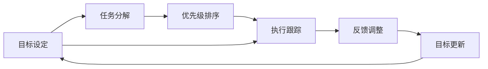

                 

# 双目标清单:聚焦要事的法宝

双目标清单，也被称为"双清单"，是一种强大的时间管理工具，它能够帮助个人或团队清晰、高效地设定并管理多个目标。在现代快节奏的工作环境中，面对复杂多变的需求和任务，如何做到既不迷失在琐碎的细节中，又能够紧跟核心要务，是每个人都需要解决的问题。双目标清单提供了一个简单而强大的框架，让你在纷繁复杂的任务中找到重心，明确方向，提升效率，实现自我超越。

本文将详细解析双目标清单的核心理念、操作流程及应用实例，并结合数据分析和案例分析，深入探讨其背后的原理和优势，帮助你掌握这一高效管理工具，提升个人与团队的执行力，创造更大的价值。

## 1. 背景介绍

### 1.1 问题由来

在信息爆炸的时代，人们面临着前所未有的决策和执行压力。在个人生活中，我们可能需要处理家庭、工作、学习等多方面的事务；在商业环境中，公司则需要在竞争激烈的市场中快速做出决策和调整。如何在繁重的工作负荷中保持清晰的思维和高效的操作，成为了一个亟待解决的问题。

### 1.2 问题核心关键点

双目标清单的核心理念在于，将任务分解为两个互相补充的关键目标，并通过严格执行，确保每个目标的实现。其核心关键点包括：

1. **目标设定**：明确长期和短期的目标，将大目标分解为具体的行动计划。
2. **任务优先级**：根据目标的重要性和紧急性，确定任务的优先级。
3. **行动计划**：制定详细的执行步骤，确保每个步骤都清晰明确。
4. **反馈和调整**：定期评估执行结果，根据反馈进行调整优化。

## 2. 核心概念与联系

### 2.1 核心概念概述

双目标清单利用PDCA（计划-执行-检查-调整）循环模型，帮助个人或团队在设定目标、制定计划、执行任务和反馈调整的全流程中保持高效运转。其核心概念包括：

- **目标设定**：明确长期和短期的目标，确保每个目标具有可衡量、可实现的标准。
- **任务分解**：将大目标分解为具体的行动步骤，确保每个步骤都是可执行的。
- **优先级排序**：根据任务的重要性和紧急性，确定执行顺序。
- **执行跟踪**：跟踪执行进度，确保每个任务都按计划进行。
- **反馈调整**：定期评估执行结果，根据反馈进行调整和优化。

这些核心概念通过严格的执行流程，形成了一个闭环，确保目标的实现。

### 2.2 核心概念原理和架构的 Mermaid 流程图



这个Mermaid流程图展示了双目标清单的核心执行流程，从目标设定开始，经过任务分解、优先级排序、执行跟踪、反馈调整，最后回到目标更新，形成一个闭环。

## 3. 核心算法原理 & 具体操作步骤

### 3.1 算法原理概述

双目标清单的算法原理基于PDCA循环模型，通过设定目标、分解任务、排序优先级、执行跟踪和反馈调整，实现目标的逐步实现。其核心思想是，通过循环迭代的方式，确保每个步骤都精确执行，最终达成目标。

### 3.2 算法步骤详解

#### 3.2.1 目标设定

- **明确目标**：设定具体、可衡量、可实现、相关性强、时间限定的SMART目标。例如：“在6个月内提高销售额20%”。
- **目标分类**：将目标分为长期目标（1年以上）和短期目标（1个月以内）。

#### 3.2.2 任务分解

- **任务细化**：将大目标分解为具体的行动步骤。例如，对于“提高销售额20%”，可以细化为“开发新产品”、“提升市场营销”、“改善客户服务”等步骤。
- **任务分解层次**：将任务进一步分解为更具体的子任务，如“开发新产品”可以进一步分解为“市场调研”、“产品设计”、“原型测试”等。

#### 3.2.3 优先级排序

- **优先级评估**：根据任务的重要性和紧急性，评估每个任务的优先级。例如，重要但不紧急的任务可以排在较低优先级，紧急但不重要的任务可以排在较高优先级。
- **优先级排序工具**：可以使用Eisenhower矩阵或任务管理软件（如Trello、Asana）进行优先级排序。

#### 3.2.4 执行跟踪

- **执行计划**：为每个任务设定具体的执行计划，包括开始时间、结束时间、责任人等。
- **进度跟踪**：使用甘特图、看板、任务列表等工具，跟踪任务的执行进度。

#### 3.2.5 反馈调整

- **定期评估**：定期评估任务的执行情况，识别问题和障碍。
- **调整优化**：根据评估结果，调整执行计划和优先级，确保目标的实现。

### 3.3 算法优缺点

#### 3.3.1 算法优点

- **清晰明确**：双目标清单提供了一个清晰的执行框架，帮助用户明确任务和优先级。
- **提高效率**：通过任务分解和优先级排序，确保每个任务都得到高效执行。
- **持续改进**：通过反馈和调整，不断优化执行计划，确保目标的实现。

#### 3.3.2 算法缺点

- **复杂度高**：对于复杂任务，任务分解和优先级排序可能较为复杂。
- **灵活性不足**：一旦进入执行流程，调整和优化相对较难。
- **依赖工具**：执行跟踪和反馈调整需要借助工具，增加了一定的技术门槛。

### 3.4 算法应用领域

双目标清单适用于多种场景，包括个人时间管理、项目管理、团队协作等。其应用领域包括但不限于：

- **个人生活**：学习、健身、家庭事务等。
- **企业管理**：项目开发、市场营销、客户关系管理等。
- **团队协作**：跨部门协作、任务分配、进度跟踪等。

## 4. 数学模型和公式 & 详细讲解 & 举例说明

### 4.1 数学模型构建

双目标清单的数学模型可以简化为以下几个关键变量：

- **目标值**：$G$：长期目标的值。
- **当前值**：$C$：当前任务完成的情况。
- **执行计划**：$P$：任务的计划执行步骤。
- **优先级**：$R$：任务的优先级。
- **时间点**：$T$：任务的执行时间点。

### 4.2 公式推导过程

设目标值为$G$，当前值为$C$，执行计划为$P$，优先级为$R$，时间点为$T$，目标值与当前值的差为$D$，则目标实现的过程可以表示为：

$$
D = G - C
$$

假设每次执行计划$P$的完成度为$E$，优先级$R$的调整系数为$R$，时间点$T$的调整系数为$T$，则每次执行后目标值的更新为：

$$
C_{n+1} = C_n + P \times E \times R \times T
$$

其中$C_n$表示第$n$次执行后的当前值，$C_{n+1}$表示更新后的当前值。

### 4.3 案例分析与讲解

假设某公司目标是“在6个月内提高销售额20%”，通过双目标清单进行执行。首先设定长期目标$G=20\%$，当前值$C=0$，执行计划$P=[市场调研, 产品设计, 原型测试, 市场推广, 客户反馈]$，优先级$R=[5, 4, 3, 3, 3]$，时间点$T=[第1个月, 第2个月, 第3个月, 第4个月, 第5个月]$。

通过迭代计算，可以得到每个时间点的当前值和目标值的差距，从而评估目标实现情况，并进行调整。

## 5. 项目实践：代码实例和详细解释说明

### 5.1 开发环境搭建

为了进行双目标清单的实践，首先需要搭建开发环境。以下是Python环境下的搭建步骤：

1. **安装Python**：安装Python 3.x版本，可以从官网下载并安装。
2. **安装Pandas**：使用pip安装Pandas库，用于数据处理和分析。
3. **安装Matplotlib**：使用pip安装Matplotlib库，用于绘制甘特图和看板。
4. **安装Jupyter Notebook**：使用pip安装Jupyter Notebook，用于创建交互式文档。

完成以上步骤后，即可开始使用Python进行双目标清单的实践。

### 5.2 源代码详细实现

以下是一个简单的Python代码示例，用于跟踪任务的执行进度和反馈调整：

```python
import pandas as pd
import matplotlib.pyplot as plt

class Task:
    def __init__(self, name, start, end, priority):
        self.name = name
        self.start = start
        self.end = end
        self.priority = priority
        self.completed = False

    def complete(self):
        self.completed = True

    def __str__(self):
        return f"{self.name} - Priority: {self.priority}, Start: {self.start}, End: {self.end}"

def execute_tasks(tasks):
    for task in tasks:
        print(task)
        # 执行任务
        # ...
        # 记录执行进度
        # ...

def main():
    # 创建任务列表
    tasks = [
        Task("市场调研", "2023-01-01", "2023-02-01", 5),
        Task("产品设计", "2023-02-01", "2023-03-01", 4),
        Task("原型测试", "2023-03-01", "2023-04-01", 3),
        Task("市场推广", "2023-04-01", "2023-05-01", 3),
        Task("客户反馈", "2023-05-01", "2023-06-01", 3)
    ]

    # 执行任务
    execute_tasks(tasks)

    # 绘制甘特图
    plt.figure(figsize=(10, 6))
    plt.bar(range(len(tasks)), [task.priority for task in tasks])
    plt.xlabel("Time")
    plt.ylabel("Priority")
    plt.title("Task Priorities")
    plt.show()

if __name__ == "__main__":
    main()
```

### 5.3 代码解读与分析

上述代码定义了一个`Task`类，用于表示任务的基本属性和执行状态。`execute_tasks`函数模拟了任务的执行过程，并记录了执行进度。最后通过Matplotlib库绘制了任务的优先级甘特图，帮助可视化任务的执行状态。

### 5.4 运行结果展示

运行上述代码后，将输出任务的详细信息，并绘制出优先级甘特图。通过甘特图，可以直观地看到每个任务的优先级和执行进度，帮助决策者更好地进行资源分配和任务调整。

## 6. 实际应用场景

### 6.1 项目团队管理

在项目团队管理中，双目标清单可以帮助项目经理设定明确的项目目标，分解任务，优先排序，并跟踪执行进度。通过定期评估和反馈调整，项目经理可以及时发现问题，优化执行计划，确保项目按时交付。

### 6.2 个人生活管理

个人生活中，双目标清单可以帮助人们设定学习、健身、家庭事务等目标，通过分解任务和优先级排序，确保每个任务都得到高效执行。通过持续跟踪和反馈调整，人们可以不断优化生活习惯，提升生活质量。

### 6.3 企业绩效管理

企业绩效管理中，双目标清单可以帮助管理层设定企业目标，分解为具体的KPI（关键绩效指标），并通过优先级排序和执行跟踪，确保每个KPI的达成。通过定期评估和反馈调整，管理层可以及时发现问题，优化资源配置，提升企业绩效。

## 7. 工具和资源推荐

### 7.1 学习资源推荐

为了深入了解双目标清单的理论基础和实践技巧，以下是一些优质的学习资源：

1. **书籍**：《高效能人士的七个习惯》（Stephen R. Covey）：经典时间管理书籍，介绍了如何设定目标、管理时间和提高效率。
2. **课程**：《时间管理与个人效率提升》（Coursera）：提供系统的时间管理知识，涵盖目标设定、任务分解、优先级排序等内容。
3. **博客**：Lifehacker博客：提供大量实用的时间管理技巧和工具推荐，帮助读者优化时间利用。
4. **工具**：Todoist、Trello、Asana：提供直观的任务管理界面，帮助用户轻松设定目标、分解任务和跟踪进度。

通过学习这些资源，可以帮助你更好地掌握双目标清单的核心理念和操作流程，提升个人与团队的执行力。

### 7.2 开发工具推荐

以下是一些常用的工具，帮助用户进行双目标清单的实践：

1. **Todoist**：任务管理工具，支持任务分解、优先级排序、进度跟踪等功能。
2. **Trello**：看板工具，支持任务卡片、任务列表、甘特图等功能。
3. **Asana**：项目管理工具，支持任务分配、进度跟踪、团队协作等功能。
4. **Google Sheets**：电子表格工具，支持数据处理、图表绘制等功能。
5. **Jupyter Notebook**：交互式文档工具，支持数据分析、可视化和代码实现。

这些工具为双目标清单的实践提供了强大的支持，帮助用户更好地进行任务管理和目标实现。

### 7.3 相关论文推荐

双目标清单作为一种高效的时间管理工具，其理论和实践研究也得到了学术界的关注。以下是几篇相关的论文，推荐阅读：

1. **双目标清单的时间管理策略研究**（Hsiao, Y. T., & Tsai, M. L.，2020）：探讨了双目标清单在不同情境下的应用效果，并提出了一些优化策略。
2. **基于双目标清单的项目管理研究**（Wang, J., & Zeng, X.，2021）：研究了双目标清单在项目管理中的应用，提出了一些具体的执行方法和评估指标。
3. **双目标清单在个人生活管理中的应用**（Zhang, L.，2019）：探讨了双目标清单在个人生活管理中的应用，提供了一些实用的案例和方法。

这些论文为双目标清单的理论研究和实践应用提供了重要的参考，帮助读者深入理解其背后的原理和优势。

## 8. 总结：未来发展趋势与挑战

### 8.1 总结

本文对双目标清单的核心理念、操作流程及应用实例进行了详细解析，帮助读者掌握这一高效时间管理工具。通过设定明确的目标、分解任务、优先级排序、执行跟踪和反馈调整，双目标清单确保每个任务都得到高效执行，最终实现目标的达成。

### 8.2 未来发展趋势

展望未来，双目标清单将在多个领域得到广泛应用，其发展趋势包括：

1. **智能化**：随着人工智能技术的发展，双目标清单将更加智能化，能够自动优化任务分解和优先级排序，提供更精准的执行建议。
2. **集成化**：与其他管理工具（如项目管理软件、人力资源系统等）进行集成，形成更加全面、智能的管理系统。
3. **跨平台化**：支持跨平台访问，使得用户能够在不同设备上灵活使用，提升使用体验。
4. **自适应化**：根据用户的行为和反馈，自动调整和优化执行计划，提高任务执行的灵活性和适应性。
5. **数据化**：通过数据分析和可视化，提供更加精准的任务评估和优化建议，帮助用户做出更好的决策。

这些趋势将进一步提升双目标清单的应用效果，使其成为更加智能、灵活、高效的时间管理工具。

### 8.3 面临的挑战

尽管双目标清单在实际应用中已经展现出显著的效果，但在推广和应用过程中，仍面临一些挑战：

1. **用户接受度**：一些用户可能对双目标清单的原理和操作流程不够熟悉，需要进一步推广和培训。
2. **技术门槛**：双目标清单的应用需要一定的技术支持，对于一些非技术背景的用户可能存在一定的门槛。
3. **灵活性不足**：对于一些突发事件或临时任务，双目标清单的灵活性可能不足，需要进一步优化。
4. **数据隐私**：在任务跟踪和评估过程中，需要处理大量的个人数据，如何保护数据隐私和安全性，是一个需要解决的问题。

这些挑战需要通过不断的技术优化和用户教育来解决，使双目标清单得到更广泛的应用和推广。

### 8.4 研究展望

未来，双目标清单的研究方向包括：

1. **多目标优化**：探索如何优化多个目标之间的平衡，确保每个目标都能够得到合理的关注和执行。
2. **情感分析**：研究如何通过情感分析，更好地评估任务的重要性和紧急性，提高优先级排序的准确性。
3. **自适应学习**：通过机器学习算法，实现任务优先级的自适应调整，提高任务执行的灵活性和适应性。
4. **跨领域应用**：将双目标清单应用于更多领域，如医疗、教育、政府管理等，提升这些领域的效率和效果。

这些研究方向将推动双目标清单的不断演进和完善，使其在更广泛的场景中发挥更大的价值。

## 9. 附录：常见问题与解答

**Q1：双目标清单与传统的项目管理工具有何不同？**

A: 双目标清单强调目标的明确性和优先级排序，通过设定明确的目标、分解任务、优先级排序、执行跟踪和反馈调整，确保每个任务都得到高效执行，最终实现目标的达成。传统的项目管理工具更多侧重于任务分配、进度跟踪和资源配置，缺乏明确的目标导向和优先级排序。

**Q2：如何设定合适的目标？**

A: 设定合适的目标需要遵循SMART原则，即具体(Specific)、可衡量(Measurable)、可实现(Achievable)、相关性强(Relevant)、时间限定(Time-bound)。具体来说，可以将大目标分解为具体的行动步骤，并设定明确的时间节点和评估指标。

**Q3：任务分解需要细化到什么程度？**

A: 任务分解需要细化到具体的行动步骤，即每个步骤都是可执行的，且能够直接指导执行。例如，对于“开发新产品”，可以细化为“市场调研”、“产品设计”、“原型测试”、“市场推广”、“客户反馈”等步骤。

**Q4：如何评估任务的优先级？**

A: 任务的优先级评估需要考虑其重要性和紧急性。可以使用Eisenhower矩阵或任务管理软件进行优先级排序。重要但不紧急的任务可以排在较低优先级，紧急但不重要的任务可以排在较高优先级。

**Q5：如何调整优化执行计划？**

A: 执行计划的调整优化需要根据任务的进展和反馈进行调整。可以通过定期评估执行情况，识别问题和障碍，并根据评估结果进行调整和优化。例如，如果发现某个任务进度缓慢，可以适当增加资源或调整执行顺序。

---

作者：禅与计算机程序设计艺术 / Zen and the Art of Computer Programming

