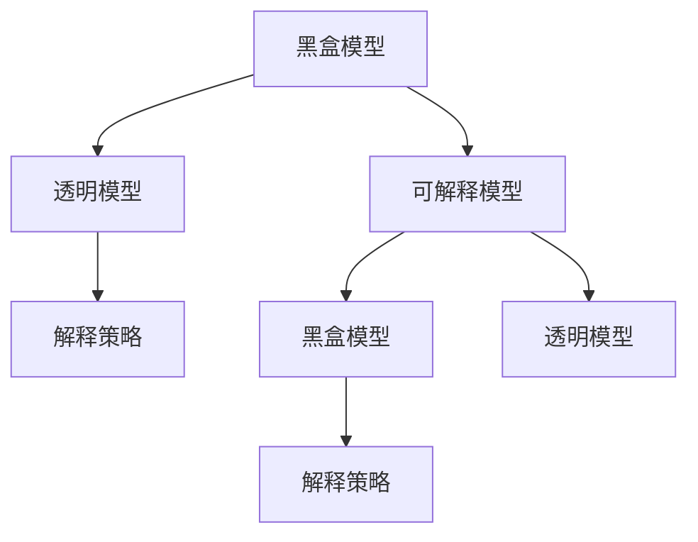

                 

# 可解释人工智能原理与代码实战案例讲解

> 关键词：可解释人工智能,黑盒模型,透明模型,可解释模型,代码实战,案例讲解

## 1. 背景介绍

### 1.1 问题由来

在人工智能(AI)领域，尤其是深度学习(Deep Learning, DL)的应用中，“黑盒”模型因其强大的预测能力而备受推崇。但这类模型往往难以解释其内部决策逻辑，导致实际应用中的“信任危机”和“模型可解释性”问题日益严重。这一问题在医疗诊断、司法判决、金融风控等高风险领域尤为突出。

为此，近年来，越来越多的研究者和开发者开始关注并致力于构建“可解释”的人工智能系统，力求在保证模型性能的同时，赋予其更高的透明度和可解释性。文章将围绕“可解释人工智能”的概念、原理、实战案例及应用领域展开深入讨论，旨在帮助读者理解并掌握相关技术，实现从理论到实践的跨越。

### 1.2 问题核心关键点

可解释人工智能的核心关键点在于：

- 可解释模型的构建：通过采用透明的模型结构，使得模型的决策过程可以被人类理解。
- 黑盒模型向透明模型的转换：将黑盒模型转化为可解释模型，以便更好地应用于实际场景。
- 解释策略的设计：选择合适的解释策略，确保解释结果的准确性和可靠性。
- 应用案例的探索：结合具体场景，提供可解释模型的实战案例，以促进其应用推广。

这些关键点共同构成了解决“信任危机”和“模型可解释性”问题的整体框架，为构建可解释人工智能系统提供了方向指引。

## 2. 核心概念与联系

### 2.1 核心概念概述

为深入理解可解释人工智能的原理和应用，本文将介绍以下几个核心概念：

- **黑盒模型**：指那些结构复杂、参数众多、难以解析内部工作机制的深度学习模型，如神经网络、深度置信网络等。
- **透明模型**：指那些结构简单、参数可控、内部工作机制易于理解的模型，如决策树、线性回归等。
- **可解释模型**：指在保证预测性能的同时，赋予模型更高透明度的模型，通常通过组合黑盒模型和透明模型实现。
- **解释策略**：指那些能够将黑盒模型决策过程解释为透明模型可理解形式的方法，如特征重要性排序、局部解释等。

这些核心概念之间的逻辑关系可以通过以下Mermaid流程图来展示：



这个流程图展示了大模型向透明模型转化的整体流程：

1. 黑盒模型通过解释策略转化为透明模型。
2. 可解释模型结合黑盒和透明模型，兼顾预测性能和解释性。
3. 解释策略的设计直接影响可解释模型的性能和效果。

通过理解这些核心概念，我们可以更好地把握可解释人工智能的工作原理和优化方向。

## 3. 核心算法原理 & 具体操作步骤
### 3.1 算法原理概述

可解释人工智能的实现通常包含两个步骤：黑盒模型到透明模型的转换，以及解释策略的设计和应用。

在模型转换方面，主要采用的方法是特征重要性分析、模型压缩、模型可视化等技术。具体来说，可以将黑盒模型视为一个黑箱，通过统计模型在不同特征上的预测差异，获得特征的重要性排序。这些特征可以被用作解释模型预测的依据。

在解释策略设计方面，常见的策略包括：局部解释、全局解释、模型可视化、特征贡献图等。这些策略旨在从不同维度展示模型预测的逻辑，以便用户理解。

### 3.2 算法步骤详解

以下是实现可解释人工智能的核心算法步骤：

**Step 1: 选择黑盒模型**
- 根据任务需求选择合适的黑盒模型，如支持向量机(SVM)、随机森林(Random Forest)、神经网络(Deep Neural Network, DNN)等。

**Step 2: 收集训练数据**
- 准备一组有标注的训练数据集，包括特征向量$x$和对应的标签$y$。

**Step 3: 模型训练**
- 使用训练数据对黑盒模型进行训练，得到模型参数$\theta$。

**Step 4: 特征重要性分析**
- 使用统计方法分析模型在不同特征上的预测差异，获得特征的重要性排序。

**Step 5: 生成解释模板**
- 根据特征重要性排序，生成解释模型预测的模板。

**Step 6: 应用解释策略**
- 选择适合的解释策略，如局部解释、全局解释、模型可视化等，将解释模板转换为透明模型的可理解形式。

**Step 7: 验证与优化**
- 使用验证集评估解释模型的性能，根据解释效果不断优化解释策略和特征重要性分析方法。

### 3.3 算法优缺点

可解释人工智能的实现方法具有以下优点：
1. 提升模型可信度：通过解释策略，将黑盒模型转化为透明模型，增强了模型的可信度和解释性。
2. 促进模型决策理解：解释策略帮助用户理解模型预测的逻辑，有助于决策制定。
3. 优化模型性能：通过特征重要性分析，可以优化模型结构，减少冗余参数，提升预测准确率。

同时，该方法也存在一些局限性：
1. 解释结果的准确性：解释结果可能不完全准确，特别是在复杂模型或非线性关系的情况下。
2. 解释成本较高：解释策略的设计和应用需要额外的时间和计算资源。
3. 模型解释的复杂度：复杂的模型可能需要更复杂的解释策略才能有效展示其内部逻辑。

尽管存在这些局限性，但就目前而言，可解释人工智能的方法在实际应用中已经取得了显著的效果，并在多个领域得到了广泛应用。

### 3.4 算法应用领域

可解释人工智能技术在多个领域得到了广泛应用，以下是几个典型应用场景：

- **医疗诊断**：可解释的机器学习模型能够帮助医生理解模型的诊断依据，提高诊断的准确性和可解释性。
- **金融风控**：在金融领域，可解释模型可以帮助风险评估人员理解模型预测的风险因素，提升风险控制能力。
- **司法判决**：司法领域中，可解释的预测模型能够帮助法官和律师理解模型的决策依据，提高司法公正性。
- **自然语言处理(NLP)**：在NLP任务中，可解释模型能够帮助用户理解模型的预测逻辑，提高模型的应用效果。
- **图像识别**：在图像识别任务中，可解释模型能够帮助用户理解模型的特征提取和分类依据，提升识别准确率。

## 4. 数学模型和公式 & 详细讲解 & 举例说明
### 4.1 数学模型构建

在构建可解释人工智能模型时，常用的数学模型包括：

- **决策树(Decision Tree)**：一种树形结构模型，用于分类和回归任务。
- **线性回归(Linear Regression)**：一种线性模型，用于连续型预测任务。
- **逻辑回归(Logistic Regression)**：一种广义线性模型，用于二分类任务。
- **随机森林(Random Forest)**：一种集成学习模型，用于分类和回归任务。

本文以决策树为例，展示可解释人工智能模型的构建过程。

### 4.2 公式推导过程

决策树的构建过程包括：

- **特征选择**：从训练数据中选择最优的特征作为决策树的分裂标准。
- **模型训练**：使用训练数据对决策树进行训练，得到最终的决策树模型。
- **模型解释**：通过树的结构展示模型决策的逻辑。

决策树的构建过程可以用以下公式表示：

$$
T = \arg\min_{T} \sum_{i=1}^{N} \mathcal{L}(T, x_i, y_i)
$$

其中，$T$为决策树模型，$\mathcal{L}$为损失函数，$N$为训练样本数量，$x_i$为第$i$个样本的特征向量，$y_i$为第$i$个样本的标签。

### 4.3 案例分析与讲解

假设我们有一个二分类问题，包含以下数据集：

| 特征 $x$ | 标签 $y$ |
| -------- | -------- |
| 1.5      | 1        |
| 2.5      | 0        |
| 3.0      | 1        |
| 4.0      | 1        |
| 4.5      | 0        |
| 5.0      | 1        |
| 5.5      | 0        |

我们希望构建一个决策树模型，用于预测新样本的标签。

首先，我们需要计算每个特征的重要性。假设我们计算得出，特征$x_1$的重要性最高，则我们可以使用该特征进行第一层划分。根据训练数据，我们发现，当$x_1 > 2.5$时，$y$为1；当$x_1 \leq 2.5$时，$y$为0。

于是，我们得到第一层划分的决策树：

```
x1 > 2.5
  ├── y = 1
  └── y = 0
```

接着，我们可以继续对第二层进行划分。假设我们计算得出，在$x_1 > 2.5$的子集内，$x_2$的重要性最高，则我们可以在这一子集内，使用$x_2$进行进一步划分。假设我们发现，当$x_2 > 3.0$时，$y$为1；当$x_2 \leq 3.0$时，$y$为0。

于是，我们得到第二层划分的决策树：

```
x1 > 2.5
  ├── x2 > 3.0
      ├── y = 1
      └── y = 0
  └── x2 ≤ 3.0
      ├── y = 1
      └── y = 0
```

通过这种方式，我们可以构建出一个完整的决策树模型。该模型不仅能够进行预测，还能够解释其决策过程，让用户理解其预测依据。

## 5. 项目实践：代码实例和详细解释说明
### 5.1 开发环境搭建

在进行可解释人工智能实践前，我们需要准备好开发环境。以下是使用Python进行Scikit-learn开发的Python环境配置流程：

1. 安装Anaconda：从官网下载并安装Anaconda，用于创建独立的Python环境。

2. 创建并激活虚拟环境：
```bash
conda create -n explain-env python=3.8 
conda activate explain-env
```

3. 安装Scikit-learn：
```bash
conda install scikit-learn
```

4. 安装相关工具包：
```bash
pip install pandas numpy matplotlib seaborn
```

完成上述步骤后，即可在`explain-env`环境中开始可解释人工智能实践。

### 5.2 源代码详细实现

以下是一个使用Scikit-learn实现决策树分类任务的代码实例。

首先，定义数据集：

```python
import pandas as pd
from sklearn.model_selection import train_test_split
from sklearn.tree import DecisionTreeClassifier

# 准备数据
data = pd.read_csv('data.csv')
X = data[['x1', 'x2']]
y = data['y']

# 划分训练集和测试集
X_train, X_test, y_train, y_test = train_test_split(X, y, test_size=0.2, random_state=42)
```

接着，构建决策树模型并进行训练：

```python
# 构建决策树模型
clf = DecisionTreeClassifier(criterion='gini', max_depth=2)

# 训练模型
clf.fit(X_train, y_train)

# 预测并评估模型
y_pred = clf.predict(X_test)
print('Accuracy:', clf.score(X_test, y_test))
```

最后，可视化决策树并解释模型：

```python
import matplotlib.pyplot as plt
from sklearn.tree import plot_tree

# 可视化决策树
plt.figure(figsize=(12, 8))
plot_tree(clf, filled=True, feature_names=['x1', 'x2'], class_names=['1', '0'])
plt.show()
```

以上就是使用Scikit-learn实现决策树分类的完整代码实例。通过这个例子，我们可以看到，Scikit-learn提供了一系列的函数和类，方便开发者快速构建和解释模型。

### 5.3 代码解读与分析

让我们再详细解读一下关键代码的实现细节：

**Data Preparation**：
- 使用Pandas库读取数据集，并分离特征$x$和标签$y$。
- 使用Scikit-learn的train_test_split函数，将数据集划分为训练集和测试集。

**Model Construction**：
- 使用Scikit-learn的DecisionTreeClassifier类，设置决策树模型的参数，如分裂准则、树深度等。
- 使用fit方法，训练决策树模型。

**Model Evaluation**：
- 使用predict方法，对测试集进行预测。
- 使用score方法，计算模型的准确率。

**Model Visualization**：
- 使用plot_tree函数，绘制决策树的结构。
- 使用Matplotlib库，调整可视化图的尺寸和显示效果。

可以看到，Scikit-learn提供了丰富的API，使得构建和解释决策树模型变得简单易行。开发者可以将更多精力放在模型优化和应用场景分析上，而不必过多关注底层实现细节。

当然，在实际应用中，还需要考虑更多因素，如超参数的自动搜索、模型的可扩展性、数据的可视化和分析等。但核心的可解释过程基本与此类似。

## 6. 实际应用场景
### 6.1 医疗诊断

在医疗诊断领域，可解释人工智能技术可以显著提升诊断的准确性和可解释性。医生可以通过解释模型，理解模型的诊断依据，从而提高诊断的可靠性。

以癌症预测为例，医生可以使用可解释的机器学习模型，分析模型的特征重要性，了解哪些指标对于预测癌症最有影响力。例如，模型可能发现，年龄、病史、基因检测结果等因素对于预测癌症具有重要意义。

### 6.2 金融风控

在金融领域，可解释人工智能技术可以帮助风险评估人员理解模型的预测依据，提升风险控制能力。

以信用评分为例，银行可以使用可解释的机器学习模型，分析模型的特征重要性，了解哪些特征对信用评分最具影响。例如，模型可能发现，客户的收入、负债、信用历史等因素对信用评分的影响最大。

### 6.3 司法判决

在司法判决中，可解释的人工智能技术可以帮助法官和律师理解模型的决策依据，提高司法公正性。

以刑事案件的判决为例，法院可以使用可解释的机器学习模型，分析模型的预测依据，了解哪些特征对判决具有重要影响。例如，模型可能发现，案件的性质、证据的强度、被告的背景等因素对判决具有重要影响。

### 6.4 未来应用展望

随着可解释人工智能技术的不断发展，其在更多领域得到了广泛应用，为各行各业带来了变革性影响。

在智慧城市治理中，可解释的人工智能技术可以帮助政府理解模型的决策依据，提高城市管理的自动化和智能化水平，构建更安全、高效的未来城市。

在智能制造中，可解释的机器学习模型可以帮助制造企业理解模型的预测依据，提升生产效率和产品质量。

在智能交通中，可解释的模型可以帮助交通部门理解模型的预测依据，优化交通流量管理，提高道路通行效率。

此外，在教育、能源、农业等多个领域，可解释人工智能技术也得到了创新性应用，为各行各业带来了新的发展机遇。相信随着技术的日益成熟，可解释人工智能必将在更多领域发挥其独特的价值，推动社会的进步和进步。

## 7. 工具和资源推荐
### 7.1 学习资源推荐

为了帮助开发者系统掌握可解释人工智能的理论基础和实践技巧，这里推荐一些优质的学习资源：

1. 《机器学习实战》系列书籍：由李航教授所著，详细介绍了机器学习的基本概念和常用算法，包括可解释机器学习的方法。
2. 《深度学习》系列书籍：由Goodfellow、Bengio和Courville三位深度学习领域大牛共同撰写，深入浅出地介绍了深度学习的原理和应用，包括可解释深度学习的内容。
3. Scikit-learn官方文档：Scikit-learn的官方文档，提供了丰富的机器学习模型和解释策略，是进行实践的最佳参考资料。
4. Python机器学习博文：由机器学习社区Kaggle的资深专家撰写，涵盖机器学习、深度学习、可解释人工智能等多个主题，是实战学习的绝佳资源。
5. AI Briefing：深度学习领域的新闻和博客平台，提供最新的研究成果和应用案例，涵盖可解释人工智能等内容。

通过对这些资源的学习实践，相信你一定能够快速掌握可解释人工智能的精髓，并用于解决实际的机器学习问题。
###  7.2 开发工具推荐

高效的开发离不开优秀的工具支持。以下是几款用于可解释人工智能开发的常用工具：

1. Scikit-learn：基于Python的开源机器学习库，提供了丰富的机器学习算法和解释策略，方便开发者快速实现可解释模型。
2. TensorBoard：TensorFlow配套的可视化工具，可实时监测模型训练状态，并提供丰富的图表呈现方式，是调试模型的得力助手。
3. Weights & Biases：模型训练的实验跟踪工具，可以记录和可视化模型训练过程中的各项指标，方便对比和调优。
4. PyTorch：基于Python的开源深度学习框架，灵活的计算图，适合快速迭代研究。许多预训练语言模型都有PyTorch版本的实现。
5. OpenAI Codex：由OpenAI推出的编程助手，通过大语言模型的推理，能够帮助开发者理解模型的决策依据，提供代码生成和调试建议。

合理利用这些工具，可以显著提升可解释人工智能任务的开发效率，加快创新迭代的步伐。

### 7.3 相关论文推荐

可解释人工智能的研究源于学界的持续研究。以下是几篇奠基性的相关论文，推荐阅读：

1. Explaining Machine Learning Predictions with Interpretable Models and Visualization（2020）：提出使用可解释模型和可视化技术，提高机器学习模型的解释性。
2. A Survey of Explainable AI Methods（2021）：全面综述了可解释人工智能的技术进展，包括可解释模型、解释策略和应用案例。
3. An Introduction to Explainable Machine Learning（2019）：由Google的专家撰写，详细介绍了可解释机器学习的原理和应用，包括可解释模型和解释策略。
4. SHAP：A Unified Approach to Interpreting Model Predictions（2017）：提出SHAP值方法，用于计算特征对模型预测的贡献，方便解释模型。
5. LIME：A Unified Approach to Interpreting Model Predictions（2017）：提出LIME方法，用于计算局部线性解释，帮助理解模型预测的逻辑。

这些论文代表了大语言模型微调技术的发展脉络。通过学习这些前沿成果，可以帮助研究者把握学科前进方向，激发更多的创新灵感。

## 8. 总结：未来发展趋势与挑战
### 8.1 总结

本文对可解释人工智能的概念、原理、实战案例及应用领域展开深入讨论。首先阐述了可解释人工智能的背景和意义，明确了其核心关键点，包括模型转换和解释策略的设计。其次，从理论到实践，详细讲解了可解释模型的构建过程，并提供了代码实例和详细解释说明。最后，探讨了可解释人工智能在未来应用中的前景，并推荐了学习资源、开发工具和相关论文。

通过本文的系统梳理，可以看到，可解释人工智能技术正在逐步从理论走向实践，为机器学习模型的应用提供了新的方向和思路。相信随着技术的不断成熟，可解释人工智能必将在更多领域发挥其独特的价值，推动社会的进步和进步。

### 8.2 未来发展趋势

展望未来，可解释人工智能技术将呈现以下几个发展趋势：

1. 模型结构的多样化：未来将会出现更多类型的可解释模型，如图神经网络、自监督学习等，以满足不同应用场景的需求。
2. 解释策略的丰富化：解释策略将更加多样和丰富，如因果解释、对比解释等，帮助用户更好地理解模型预测。
3. 应用场景的扩展：可解释人工智能技术将广泛应用于医疗、金融、司法、交通等多个领域，提升决策的透明性和公正性。
4. 数据来源的多元化：除了结构化数据，未来的解释任务将更多地依赖非结构化数据，如文本、图像等，提升模型对现实世界的理解和建模能力。
5. 解释工具的智能化：未来的解释工具将更加智能化和自动化，通过深度学习模型生成更加精准的解释结果。

以上趋势凸显了可解释人工智能技术的广阔前景。这些方向的探索发展，必将进一步提升可解释人工智能系统的性能和应用范围，为构建安全、可靠、可解释、可控的智能系统铺平道路。

### 8.3 面临的挑战

尽管可解释人工智能技术已经取得了显著进展，但在迈向更加智能化、普适化应用的过程中，它仍面临诸多挑战：

1. 数据质量问题：可解释模型依赖于高质量的数据，数据质量问题可能会影响模型的解释效果。
2. 解释成本较高：解释模型需要额外的计算资源和人工干预，解释成本较高。
3. 解释结果的准确性：解释结果可能不完全准确，特别是在复杂模型或非线性关系的情况下。
4. 模型的泛化能力：可解释模型可能存在泛化能力不足的问题，对新数据的表现可能不如预期。
5. 解释的完备性：解释模型可能无法全面解释所有特征对模型预测的影响，解释的完备性仍有待提升。

这些挑战需要研究者不断努力，寻求新的技术和方法来解决。只有解决这些问题，才能真正实现可解释人工智能技术的广泛应用和深入发展。

### 8.4 研究展望

面对可解释人工智能所面临的挑战，未来的研究需要在以下几个方面寻求新的突破：

1. 增强数据质量：提高数据标注的准确性和完备性，提升数据质量，确保模型的解释效果。
2. 降低解释成本：开发更加高效和自动化的解释工具，降低解释模型的应用成本。
3. 提升解释准确性：研究更加准确和全面的解释策略，提高解释结果的可靠性。
4. 增强模型泛化能力：研究更加鲁棒的模型结构，提升模型的泛化能力，确保新数据的解释效果。
5. 提升解释完备性：研究更加全面和系统的解释方法，提升解释的完备性，确保所有特征的影响都被解释出来。

这些研究方向的探索，必将引领可解释人工智能技术迈向更高的台阶，为构建安全、可靠、可解释、可控的智能系统提供新的动力。面向未来，可解释人工智能技术还需要与其他人工智能技术进行更深入的融合，如知识表示、因果推理、强化学习等，多路径协同发力，共同推动自然语言理解和智能交互系统的进步。

## 9. 附录：常见问题与解答

**Q1: 可解释人工智能是否适用于所有机器学习任务？**

A: 可解释人工智能主要适用于需要高透明度和可解释性的机器学习任务。例如，医疗诊断、金融风控、司法判决等任务。但对于一些需要预测精度和处理速度优先的任务，如实时推荐、图像识别等，可解释人工智能可能不是最佳选择。

**Q2: 如何选择适合的解释策略？**

A: 选择适合的解释策略需要考虑任务的特点和应用场景。例如，对于二分类任务，可以使用SHAP值方法；对于图像识别任务，可以使用特征可视化方法。在选择解释策略时，需要根据任务的具体需求和模型的复杂度进行综合考虑。

**Q3: 如何进行特征重要性分析？**

A: 特征重要性分析是构建可解释模型的重要步骤。常见的方法包括：

- 基于模型方法：如随机森林、决策树等，通过统计模型在不同特征上的预测差异，获得特征的重要性排序。
- 基于深度学习方法：如LIME、SHAP等，通过计算特征对模型预测的贡献，获得特征的重要性排序。

在进行特征重要性分析时，需要选择合适的模型和算法，并根据具体任务进行参数调优。

**Q4: 可解释人工智能在实际应用中需要注意哪些问题？**

A: 可解释人工智能在实际应用中需要注意以下问题：

- 数据质量问题：确保训练数据的准确性和完备性，避免数据质量问题对解释效果的影响。
- 解释成本较高：解释模型需要额外的计算资源和人工干预，需要考虑成本问题。
- 解释结果的准确性：解释结果可能不完全准确，需要在使用时进行验证和优化。
- 模型的泛化能力：可解释模型可能存在泛化能力不足的问题，需要在使用时进行验证和优化。

通过合理设计和使用可解释模型，可以最大限度地发挥其解释能力，提升系统的可信度和可控性。

---

作者：禅与计算机程序设计艺术 / Zen and the Art of Computer Programming

