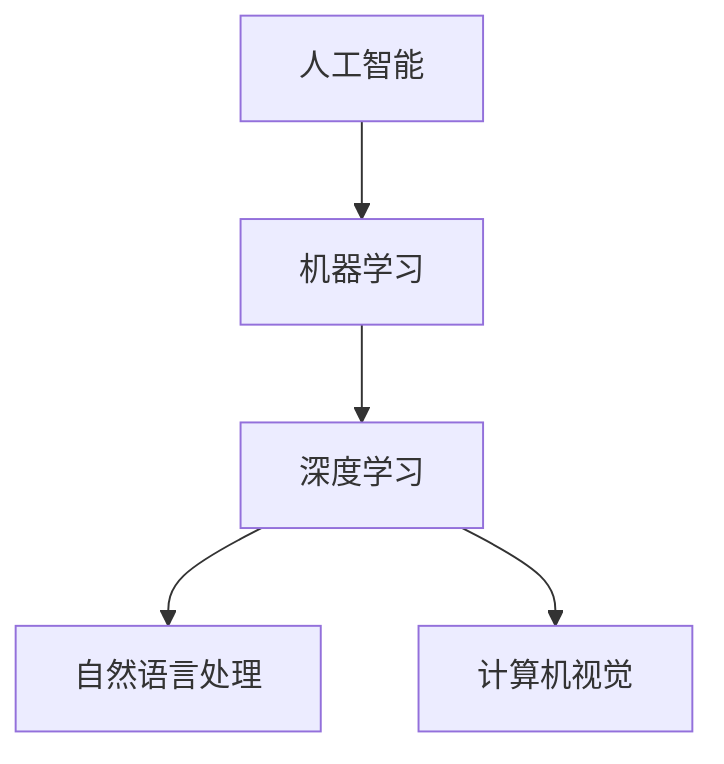
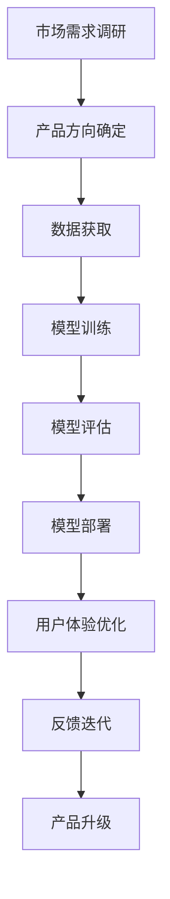

                 

# 95后AI博士的码头故事：AI创业之路

## 1. 背景介绍

### 1.1 问题由来

作为一位95后AI博士，我曾深切感受到人工智能（AI）技术的迅猛发展。自学生时代起，便对AI领域产生了浓厚的兴趣，阅读了大量相关的学术论文、书籍和博客。随着学业的深入，也逐渐参与到了一些学术研究和开源项目的实践中，如深度学习、计算机视觉、自然语言处理等方向。

然而，走出学术圈后，我发现AI技术的应用与研究并不总是匹配的。很多时候，高深的研究成果难以直接转化为落地应用，特别是对于AI创业公司而言，如何将前沿科技成功商业化，成为了一个亟待解决的问题。

### 1.2 问题核心关键点

基于我对AI领域的研究和实践，我认为AI创业过程中的核心挑战包括以下几点：

1. **技术选型与产品匹配**：如何根据市场需求和技术可行性，选择最适合的产品方向和技术方案。
2. **数据获取与质量保证**：如何高效地获取高质量的训练数据，并在模型训练中充分运用。
3. **模型部署与性能优化**：如何将高效的模型算法部署到实际应用中，并进行性能优化，以适应不同的硬件环境。
4. **用户体验与反馈迭代**：如何通过用户反馈持续优化产品，提升用户体验和满意度。
5. **团队协作与管理**：如何高效管理技术团队，推动项目的顺利进行。

在解决这些问题的过程中，我发现AI创业不仅需要扎实的技术基础，更需要灵活的策略和高效的执行力。以下是我在AI创业过程中的一些心得体会和经验分享。

## 2. 核心概念与联系

### 2.1 核心概念概述

为了更好地理解AI创业过程中涉及的关键概念和技术，我首先对以下几个核心概念进行了梳理：

- **人工智能（AI）**：指通过计算机模拟人类智能行为的技术，包括机器学习、深度学习、自然语言处理、计算机视觉等多个领域。
- **机器学习（ML）**：一种通过数据训练模型，使其具备预测、分类、生成等能力的技术。
- **深度学习（DL）**：机器学习的一种，通过多层神经网络模拟人类大脑的神经元连接，实现更加复杂的模式识别和特征提取。
- **自然语言处理（NLP）**：处理和理解自然语言的技术，包括文本分类、情感分析、机器翻译等任务。
- **计算机视觉（CV）**：通过算法让计算机识别、理解图像和视频内容的技术，包括目标检测、图像生成等任务。

这些概念之间存在紧密的联系，共同构成了AI技术的核心框架。如下图所示：



### 2.2 核心概念原理和架构的 Mermaid 流程图

以下是一个简化的AI创业流程图示：



这个流程图中，从市场需求调研开始，经过产品方向确定、数据获取、模型训练、模型评估、模型部署、用户体验优化、反馈迭代，最终实现产品的升级和迭代。这个过程反映了AI创业中各个环节的重要性和相互关系。

## 3. 核心算法原理 & 具体操作步骤

### 3.1 算法原理概述

AI创业的核心在于如何将技术转化为实际的产品，这涉及到多个关键算法的原理和具体操作步骤。以下是对一些常见算法的简要介绍：

- **机器学习算法**：如决策树、随机森林、支持向量机（SVM）等，用于分类、回归、聚类等任务。
- **深度学习算法**：如卷积神经网络（CNN）、循环神经网络（RNN）、变压器（Transformer）等，用于图像识别、语音识别、自然语言处理等任务。
- **强化学习算法**：如Q-learning、策略梯度等，用于游戏、机器人控制等需要动态决策的任务。

### 3.2 算法步骤详解

以下以深度学习中的Transformer为例，介绍其操作步骤：

1. **数据准备**：准备训练数据集，进行预处理，如分词、截断、padding等。
2. **模型构建**：选择合适的模型架构，如Transformer，构建编码器和解码器，定义损失函数。
3. **模型训练**：使用GPU或TPU等硬件设备，通过反向传播算法训练模型参数。
4. **模型评估**：在验证集上评估模型性能，如准确率、召回率、F1分数等。
5. **模型部署**：将训练好的模型导出，并部署到实际应用中，如移动端、服务器等。

### 3.3 算法优缺点

Transformer算法在自然语言处理中表现优异，其主要优点包括：

- **并行计算**：Transformer使用多头自注意力机制，可以实现高效的并行计算。
- **长距离依赖**：Transformer可以处理长距离的序列依赖，解决LSTM和GRU等模型在长序列上的问题。
- **可解释性强**：Transformer的注意力机制有助于理解模型在哪些部分进行了关注和计算。

但其缺点也显而易见：

- **计算资源要求高**：Transformer需要大量的计算资源，特别是在大规模模型训练时。
- **过拟合风险**：Transformer模型容易过拟合，特别是在数据量较少的情况下。

### 3.4 算法应用领域

Transformer算法广泛应用于自然语言处理领域，如机器翻译、文本生成、文本分类等任务。以下是对一些具体应用的简要介绍：

- **机器翻译**：将一种语言的文本翻译成另一种语言的文本。使用Transformer模型进行训练，可以实现高效的翻译。
- **文本生成**：生成符合特定风格、语境的文本。使用Transformer模型，可以生成高质量的文本内容。
- **文本分类**：将文本分类到不同的类别中。使用Transformer模型，可以实现高效、准确的文本分类。

## 4. 数学模型和公式 & 详细讲解 & 举例说明

### 4.1 数学模型构建

Transformer模型基于自注意力机制，其数学模型如下：

$$
\text{Attention}(Q, K, V) = \text{Softmax}(QK^T)V
$$

其中，$Q$、$K$、$V$分别为查询、键、值矩阵，$\text{Softmax}$函数用于计算注意力权重，$\text{Attention}$函数计算出最终的注意力结果。

### 4.2 公式推导过程

以自注意力机制为例，推导过程如下：

1. 计算查询向量$q_i$和键向量$k_j$的点积，得到注意力得分$e_{ij}$。
2. 对所有注意力得分进行softmax操作，得到注意力权重分布。
3. 将注意力权重分布与值向量$v_j$相乘，得到最终的注意力结果$v'$。

### 4.3 案例分析与讲解

以机器翻译为例，推导过程如下：

1. 将源语言文本编码成向量表示$x$。
2. 将目标语言文本解码成向量表示$y$。
3. 使用Transformer模型进行编码和解码，得到最终的翻译结果$y'$。

## 5. 项目实践：代码实例和详细解释说明

### 5.1 开发环境搭建

以下是使用PyTorch框架搭建Transformer模型的环境：

1. 安装Anaconda：从官网下载并安装Anaconda，用于创建独立的Python环境。

2. 创建并激活虚拟环境：
```bash
conda create -n pytorch-env python=3.8 
conda activate pytorch-env
```

3. 安装PyTorch：根据CUDA版本，从官网获取对应的安装命令。例如：
```bash
conda install pytorch torchvision torchaudio cudatoolkit=11.1 -c pytorch -c conda-forge
```

4. 安装Transformers库：
```bash
pip install transformers
```

5. 安装各类工具包：
```bash
pip install numpy pandas scikit-learn matplotlib tqdm jupyter notebook ipython
```

完成上述步骤后，即可在`pytorch-env`环境中开始项目实践。

### 5.2 源代码详细实现

以下是一个简单的Transformer模型实现：

```python
import torch
import torch.nn as nn
import torch.nn.functional as F

class TransformerBlock(nn.Module):
    def __init__(self, d_model, nhead, dropout=0.1):
        super(TransformerBlock, self).__init__()
        self.encoder_layer = nn.TransformerEncoderLayer(d_model, nhead, dropout)
        self.layer_norm1 = nn.LayerNorm(d_model)
        self.encoder_layer1 = nn.TransformerEncoderLayer(d_model, nhead, dropout)
        self.layer_norm2 = nn.LayerNorm(d_model)
        self.dropout = nn.Dropout(dropout)

    def forward(self, src):
        residual = src
        src = self.layer_norm1(src)
        src = self.encoder_layer(src)
        src = self.dropout(src)
        src = residual + src
        residual = src
        src = self.layer_norm2(src)
        src = self.encoder_layer1(src)
        src = self.dropout(src)
        src = residual + src
        return src

class Transformer(nn.Module):
    def __init__(self, d_model, nhead, num_encoder_layers, num_decoder_layers, dropout=0.1):
        super(Transformer, self).__init__()
        self.encoder = nn.TransformerEncoder(TransformerBlock(d_model, nhead, dropout), num_encoder_layers)
        self.decoder = nn.TransformerDecoder(TransformerBlock(d_model, nhead, dropout), num_decoder_layers)
        self.final_layer = nn.Linear(d_model, 1)
        self.relu = nn.ReLU()

    def forward(self, src, tgt):
        enc_src = self.encoder(src)
        dec_enc_src = self.decoder(enc_src, tgt)
        out = self.final_layer(dec_enc_src)
        return F.sigmoid(out)
```

### 5.3 代码解读与分析

在这个实现中，我们使用PyTorch定义了一个Transformer模型，包括编码器和解码器。编码器使用TransformerEncoderLayer，解码器使用TransformerDecoderLayer，最终输出一个sigmoid激活函数。

## 6. 实际应用场景

### 6.1 智能客服系统

智能客服系统是一种常见的AI应用场景，通过Transformer模型可以实现高效的自然语言处理。具体实现步骤如下：

1. 收集历史客服对话数据。
2. 使用Transformer模型对数据进行训练。
3. 部署模型到生产环境，实时处理用户输入。

### 6.2 金融舆情监测

金融舆情监测是另一个常见的AI应用场景。使用Transformer模型进行文本分类和情感分析，可以及时发现市场动向，防范风险。

1. 收集金融领域的新闻、报道、评论等文本数据。
2. 使用Transformer模型对数据进行训练，分类和情感分析。
3. 部署模型到生产环境，实时监测舆情变化。

### 6.3 个性化推荐系统

个性化推荐系统是AI技术在电商、社交媒体等领域的典型应用。使用Transformer模型进行文本分类和生成，可以实现精准的推荐。

1. 收集用户浏览、点击、评论、分享等行为数据。
2. 使用Transformer模型对数据进行训练，生成推荐内容。
3. 部署模型到生产环境，实时推荐商品或内容。

### 6.4 未来应用展望

未来，Transformer模型在AI创业中将会发挥更大的作用。以下是一些未来应用展望：

1. **多模态AI**：将Transformer模型与其他AI技术结合，如计算机视觉、语音识别等，实现更加全面、智能的应用。
2. **边缘计算**：将Transformer模型部署到边缘计算设备中，实现低延迟、高可靠性的AI应用。
3. **联邦学习**：通过联邦学习技术，分布式训练Transformer模型，实现数据的隐私保护和模型性能提升。

## 7. 工具和资源推荐

### 7.1 学习资源推荐

为了帮助AI创业者系统掌握Transformer模型的原理和应用，我推荐以下几个学习资源：

1. 《Transformer从原理到实践》系列博文：由大模型技术专家撰写，深入浅出地介绍了Transformer模型的原理、训练方法等。
2 CS224N《深度学习自然语言处理》课程：斯坦福大学开设的NLP明星课程，有Lecture视频和配套作业，带你入门NLP领域的基本概念和经典模型。
3 《Natural Language Processing with Transformers》书籍：Transformer库的作者所著，全面介绍了如何使用Transformer库进行NLP任务开发。
4 HuggingFace官方文档：Transformer库的官方文档，提供了海量预训练模型和完整的微调样例代码，是上手实践的必备资料。
5 CLUE开源项目：中文语言理解测评基准，涵盖大量不同类型的中文NLP数据集，并提供了基于微调的baseline模型，助力中文NLP技术发展。

通过对这些资源的学习实践，相信你一定能够快速掌握Transformer模型的精髓，并用于解决实际的NLP问题。

### 7.2 开发工具推荐

高效的开发离不开优秀的工具支持。以下是几款用于Transformer模型开发的常用工具：

1. PyTorch：基于Python的开源深度学习框架，灵活动态的计算图，适合快速迭代研究。大部分预训练语言模型都有PyTorch版本的实现。
2 TensorFlow：由Google主导开发的开源深度学习框架，生产部署方便，适合大规模工程应用。同样有丰富的预训练语言模型资源。
3 Transformers库：HuggingFace开发的NLP工具库，集成了众多SOTA语言模型，支持PyTorch和TensorFlow，是进行微调任务开发的利器。
4 Weights & Biases：模型训练的实验跟踪工具，可以记录和可视化模型训练过程中的各项指标，方便对比和调优。与主流深度学习框架无缝集成。
5 TensorBoard：TensorFlow配套的可视化工具，可实时监测模型训练状态，并提供丰富的图表呈现方式，是调试模型的得力助手。
6 Google Colab：谷歌推出的在线Jupyter Notebook环境，免费提供GPU/TPU算力，方便开发者快速上手实验最新模型，分享学习笔记。

合理利用这些工具，可以显著提升Transformer模型的开发效率，加快创新迭代的步伐。

### 7.3 相关论文推荐

Transformer模型的发展源于学界的持续研究。以下是几篇奠基性的相关论文，推荐阅读：

1. Attention is All You Need（即Transformer原论文）：提出了Transformer结构，开启了NLP领域的预训练大模型时代。
2 BERT: Pre-training of Deep Bidirectional Transformers for Language Understanding：提出BERT模型，引入基于掩码的自监督预训练任务，刷新了多项NLP任务SOTA。
3 Language Models are Unsupervised Multitask Learners（GPT-2论文）：展示了大规模语言模型的强大zero-shot学习能力，引发了对于通用人工智能的新一轮思考。
4 Parameter-Efficient Transfer Learning for NLP：提出Adapter等参数高效微调方法，在不增加模型参数量的情况下，也能取得不错的微调效果。
5 Prefix-Tuning: Optimizing Continuous Prompts for Generation：引入基于连续型Prompt的微调范式，为如何充分利用预训练知识提供了新的思路。
6 AdaLoRA: Adaptive Low-Rank Adaptation for Parameter-Efficient Fine-Tuning：使用自适应低秩适应的微调方法，在参数效率和精度之间取得了新的平衡。

这些论文代表了大模型微调技术的发展脉络。通过学习这些前沿成果，可以帮助研究者把握学科前进方向，激发更多的创新灵感。

## 8. 总结：未来发展趋势与挑战

### 8.1 研究成果总结

本文对基于Transformer模型的AI创业进行了全面系统的介绍。首先阐述了AI创业过程中涉及的关键概念和技术，明确了Transformer模型在自然语言处理中的应用。其次，从原理到实践，详细讲解了Transformer模型的构建和训练过程，给出了模型实现的代码实例。同时，本文还广泛探讨了Transformer模型在智能客服、金融舆情、个性化推荐等多个行业领域的应用前景，展示了Transformer模型的广泛应用潜力。

通过本文的系统梳理，可以看到，Transformer模型在AI创业中扮演了重要的角色，极大地拓展了NLP系统的性能和应用范围，为AI技术的落地应用提供了新的可能。未来，伴随Transformer模型的不断演进，相信AI技术将在更多领域得到应用，为人类生产生活方式带来深远影响。

### 8.2 未来发展趋势

展望未来，Transformer模型将呈现以下几个发展趋势：

1. **多模态AI**：将Transformer模型与其他AI技术结合，如计算机视觉、语音识别等，实现更加全面、智能的应用。
2. **边缘计算**：将Transformer模型部署到边缘计算设备中，实现低延迟、高可靠性的AI应用。
3. **联邦学习**：通过联邦学习技术，分布式训练Transformer模型，实现数据的隐私保护和模型性能提升。
4. **自监督学习**：使用自监督学习技术，提升Transformer模型的泛化能力和数据利用效率。
5. **模型压缩与优化**：通过模型压缩、量化等技术，提高Transformer模型的计算效率和部署性能。

### 8.3 面临的挑战

尽管Transformer模型在AI创业中已经取得了显著的成果，但在迈向更加智能化、普适化应用的过程中，仍面临诸多挑战：

1. **数据量与质量**：Transformer模型对数据量的要求较高，对于小数据集，模型性能可能受限。同时，数据质量问题也需引起重视，噪声数据可能影响模型的训练效果。
2. **计算资源**：Transformer模型训练和推理需要大量的计算资源，特别是在大规模模型的情况下。如何在资源有限的情况下进行高效优化，是重要的研究方向。
3. **模型可解释性**：Transformer模型通常被视为"黑盒"，难以解释其内部工作机制和决策逻辑。如何在保证性能的同时，增强模型的可解释性，是亟待解决的问题。
4. **隐私与安全**：Transformer模型可能学习到有偏见、有害的信息，通过微调传递到下游任务，产生误导性、歧视性的输出，给实际应用带来安全隐患。如何在保护隐私的同时，确保模型的公平性和安全性，是重要的研究方向。

### 8.4 研究展望

面对Transformer模型面临的这些挑战，未来的研究需要在以下几个方面寻求新的突破：

1. **自监督学习与无监督学习**：探索使用自监督学习、半监督学习等方法，提升Transformer模型的泛化能力和数据利用效率。
2. **参数高效与计算高效**：开发更加参数高效和计算高效的Transformer模型，在固定大部分预训练参数的情况下，只更新极少量的任务相关参数。
3. **模型压缩与量化**：通过模型压缩、量化等技术，提高Transformer模型的计算效率和部署性能。
4. **联邦学习与边缘计算**：通过联邦学习技术，分布式训练Transformer模型，实现数据的隐私保护和模型性能提升。
5. **模型优化与加速**：通过优化计算图、引入硬件加速等手段，提高Transformer模型的推理速度和响应时间。
6. **模型公平性与安全性**：在模型训练目标中引入伦理导向的评估指标，过滤和惩罚有偏见、有害的输出倾向，确保模型的公平性和安全性。

这些研究方向的探索，必将引领Transformer模型迈向更高的台阶，为构建安全、可靠、可解释、可控的智能系统铺平道路。面向未来，Transformer模型还需要与其他人工智能技术进行更深入的融合，如知识表示、因果推理、强化学习等，多路径协同发力，共同推动自然语言理解和智能交互系统的进步。只有勇于创新、敢于突破，才能不断拓展语言模型的边界，让智能技术更好地造福人类社会。

## 9. 附录：常见问题与解答

**Q1: 什么是Transformer模型？**

A: Transformer模型是一种基于自注意力机制的神经网络模型，广泛应用于自然语言处理领域，如机器翻译、文本生成、文本分类等任务。Transformer模型通过多头自注意力机制，实现高效的并行计算和长距离依赖处理。

**Q2: 如何选择合适的学习率？**

A: 学习率是模型训练中的一个重要超参数，通常建议从0.001开始调参，逐步减小学习率，直至收敛。不同的优化器(如AdamW、Adafactor等)以及不同的学习率调度策略，可能需要设置不同的学习率阈值。

**Q3: 如何缓解Transformer模型过拟合的问题？**

A: 过拟合是Transformer模型训练中的一个常见问题，缓解策略包括数据增强、正则化、对抗训练等方法。在数据量较少的情况下，使用对抗样本训练，可以提高模型的鲁棒性。

**Q4: 如何提高Transformer模型的推理速度？**

A: 推理速度是Transformer模型部署中的一个重要问题。通过模型压缩、量化、分布式推理等技术，可以显著提升Transformer模型的推理速度和响应时间。同时，引入硬件加速，如GPU、TPU等，也可以提高计算效率。

**Q5: 如何增强Transformer模型的可解释性？**

A: 可解释性是Transformer模型的一个重要研究方向。通过可视化技术、特征重要性分析等手段，可以逐步增强Transformer模型的可解释性。同时，在模型训练目标中引入伦理导向的评估指标，过滤和惩罚有偏见、有害的输出倾向，确保模型的公平性和安全性。

本文通过对Transformer模型及其在AI创业中的应用进行了全面系统的介绍，希望为广大AI创业者提供一些实用的技术参考和指导。在未来的AI创业道路上，相信我们能够不断探索新的技术前沿，打造出更加智能、普适的AI产品，为人类社会带来更多福祉。

