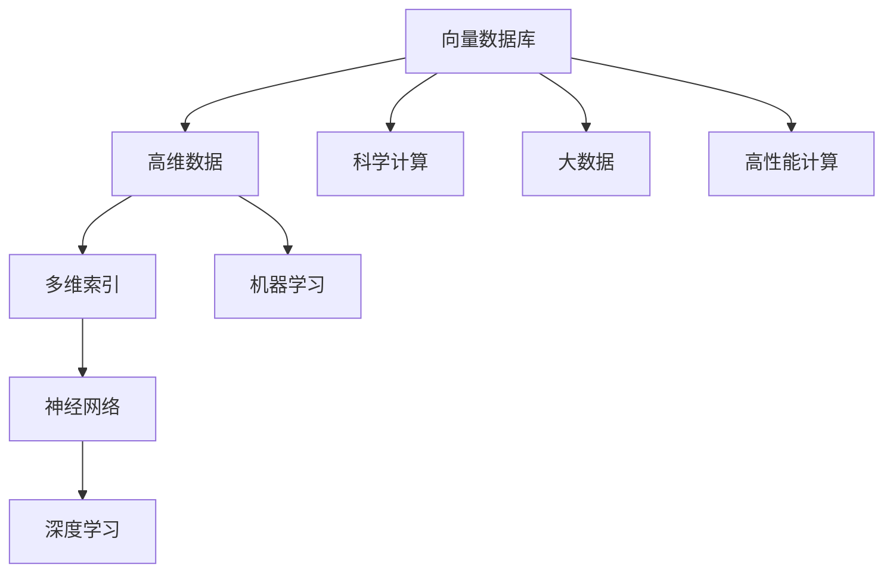
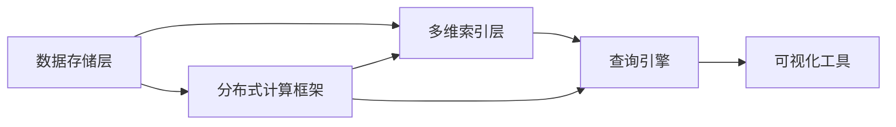

                 

# 向量数据库基础：存储和检索多维数据的科学

> 关键词：向量数据库,高维数据,多维索引,神经网络,深度学习,科学计算

## 1. 背景介绍

随着科技的飞速发展，数据规模和复杂度呈指数级增长，尤其是在科学计算、人工智能、机器学习等领域，向量数据的处理需求日益增加。向量数据库作为专门针对高维数据和向量化计算设计的技术，在近年来得到了广泛的关注和应用。向量数据库的存储和检索能力对大规模科学计算、深度学习和神经网络训练等任务具有重要意义。

本博客旨在深入解析向量数据库的核心概念、算法原理、操作步骤、数学模型以及实际应用场景，为广大开发者和科研人员提供一个系统性的参考和指导。

## 2. 核心概念与联系

### 2.1 核心概念概述

向量数据库的核心概念包括以下几个方面：

- 向量数据库：一种专门针对高维数据存储和检索的数据库系统，通常用于科学计算、机器学习、深度学习等需要处理大量向量数据的领域。
- 高维数据：特征维度超过3的数据，常见于科学计算、信号处理、计算机视觉等场景。
- 多维索引：用于高效索引高维空间中的数据点，以便快速检索和查询。
- 神经网络：一类受到生物神经网络启发的计算模型，通过层次化的神经元网络结构进行数据处理和模式识别。
- 深度学习：一类基于多层神经网络的机器学习方法，能够处理复杂的非线性关系和高维数据。
- 科学计算：使用计算机进行各种复杂数学计算的科学领域，向量数据库在科学计算中具有重要应用。

这些核心概念通过Mermaid流程图联系起来，展示了向量数据库在科学计算、深度学习等高维数据处理任务中的作用：



### 2.2 核心概念原理和架构

向量数据库的核心原理是利用多维索引技术，高效地存储和检索高维数据。其架构通常包括以下几个组件：

- 数据存储层：负责存储高维向量和相关元数据，支持多种存储格式，如稀疏矩阵、向量文件、图像文件等。
- 多维索引层：用于构建和维护多维索引，支持高效的向量空间搜索。
- 查询引擎：处理用户查询请求，通过索引层快速检索数据，返回结果。
- 分布式计算框架：支持大规模分布式计算，提升处理高维数据的效率。
- 可视化工具：提供数据可视化和统计分析功能，帮助用户更好地理解数据。

以下是一个简单的向量数据库架构图：



## 3. 核心算法原理 & 具体操作步骤

### 3.1 算法原理概述

向量数据库的存储和检索算法主要基于向量空间搜索和多维索引技术。核心算法原理包括以下几个方面：

- 向量空间搜索：在向量空间中查找最接近用户查询向量或满足特定条件的数据点，常用的算法包括向量余弦相似度、L2距离、汉明距离等。
- 多维索引：构建多维索引结构，快速定位和检索数据点，常用的索引技术包括KD树、LSH、Locality Sensitive Hashing等。
- 分布式计算：利用分布式计算框架，加速大规模向量数据的处理和分析，如Apache Spark、Apache Hadoop等。

### 3.2 算法步骤详解

以下是一个向量数据库存储和检索的详细操作步骤：

**Step 1: 数据导入与预处理**

- 将高维向量数据导入向量数据库系统。
- 进行数据预处理，如缺失值填充、归一化、稀疏化等操作。

**Step 2: 构建多维索引**

- 根据数据的特点和查询需求，选择合适的多维索引算法（如KD树、LSH等）。
- 利用构建好的多维索引，加速向量空间搜索和数据检索。

**Step 3: 存储向量数据**

- 将预处理后的向量数据存储到数据库中，支持多种存储格式，如稀疏矩阵、向量文件、图像文件等。
- 利用多维索引层进行索引优化，提高检索效率。

**Step 4: 处理查询请求**

- 接收用户查询请求，进行解析和转换。
- 通过多维索引层快速检索数据，返回查询结果。
- 根据查询需求，进行数据可视化或统计分析。

**Step 5: 分布式计算优化**

- 利用分布式计算框架，进行大规模向量数据的处理和分析。
- 优化并行计算策略，提升计算效率。

### 3.3 算法优缺点

向量数据库的优势在于其高效的多维索引和分布式计算能力，能够处理大规模高维数据。主要优点包括：

- 高效率：利用多维索引和分布式计算，能够快速检索和处理高维数据。
- 高扩展性：支持大规模分布式计算，能够处理海量数据。
- 高性能：利用并行计算技术，提升计算效率和响应速度。

缺点包括：

- 复杂性高：构建和维护多维索引需要较高的技术门槛。
- 存储开销大：高维向量数据通常占用的存储空间较大，需要考虑存储成本。
- 学习曲线陡峭：对新手用户而言，可能需要较长时间学习才能掌握其操作。

### 3.4 算法应用领域

向量数据库在科学计算、深度学习、机器学习等高维数据处理领域有广泛应用。例如：

- 科学计算：用于处理复杂的科学数据，如天气模拟、流体力学模拟等。
- 深度学习：用于加速神经网络训练和推理，提升模型性能。
- 机器学习：用于构建高效的机器学习模型，处理大规模高维数据。

## 4. 数学模型和公式 & 详细讲解 & 举例说明

### 4.1 数学模型构建

向量数据库的数学模型主要基于向量空间搜索和多维索引技术。以下是一个基于KD树的向量空间搜索模型：

- 数据表示：将高维向量表示为n维空间中的点，即 $\mathbf{x} = (x_1, x_2, ..., x_n)$。
- 查询表示：将用户查询向量表示为 $\mathbf{q} = (q_1, q_2, ..., q_n)$。
- 距离计算：利用向量余弦相似度或L2距离计算查询向量与数据点之间的距离。
- 索引结构：利用KD树构建多维索引，加速向量空间搜索。

### 4.2 公式推导过程

以KD树为例，其基本思想是将高维空间划分为多个子空间，每个子空间由一个维度表示。构建KD树的过程如下：

1. 选择一个维度作为划分维度。
2. 以该维度的中位数作为根节点，将数据集划分为两个子集。
3. 递归构建左右子树的KD树，直到每个子集中只包含一个点。

查询过程如下：

1. 将查询向量投影到根节点的划分维度上。
2. 根据投影结果，确定查询向量所在的子树。
3. 递归搜索子树，直到找到最接近的向量或到达叶子节点。

### 4.3 案例分析与讲解

以深度学习模型训练为例，向量数据库可以用于加速神经网络训练过程。以下是一个基于向量数据库的深度学习模型训练流程：

- 数据导入：将训练数据导入向量数据库。
- 数据预处理：对数据进行归一化、稀疏化等预处理操作。
- 构建索引：利用KD树等索引算法，构建多维索引。
- 训练过程：使用深度学习框架（如TensorFlow、PyTorch）进行模型训练。
- 查询优化：利用多维索引快速检索训练数据，优化查询过程。

## 5. 项目实践：代码实例和详细解释说明

### 5.1 开发环境搭建

以下是一个基于Python和TensorFlow的向量数据库开发环境搭建步骤：

1. 安装TensorFlow：
```bash
pip install tensorflow
```

2. 安装TensorBoard：
```bash
pip install tensorboard
```

3. 安装Scikit-learn：
```bash
pip install scikit-learn
```

4. 安装NumPy：
```bash
pip install numpy
```

### 5.2 源代码详细实现

以下是一个基于TensorFlow和KD树的向量数据库实现示例：

```python
import numpy as np
import tensorflow as tf
from sklearn.cluster import KMeans
from tensorflow.keras.layers import Dense, Input, Embedding
from tensorflow.keras.models import Model

# 构建向量数据库
class VectorDatabase:
    def __init__(self, vector_dim, num_clusters=16):
        self.vector_dim = vector_dim
        self.num_clusters = num_clusters
        self.cluster_model = KMeans(n_clusters=num_clusters, random_state=42)

    def build_model(self):
        # 输入层
        input_layer = Input(shape=(self.vector_dim,))
        # 编码层
        encoding = Dense(64, activation='relu')(input_layer)
        # 多维索引层
        indexing_layer = Dense(self.num_clusters, activation='softmax')(encoding)
        # 查询层
        query = Input(shape=(self.vector_dim,))
        # 查询编码层
        query_encoding = Dense(64, activation='relu')(query)
        # 匹配层
        matching_layer = tf.keras.layers.Dot(axes=1, normalize=True)([indexing_layer, query_encoding])
        # 输出层
        output = Dense(1, activation='sigmoid')(matching_layer)
        self.model = Model(inputs=[input_layer, query], outputs=output)

    def fit(self, data):
        # 预处理数据
        data = np.array(data, dtype=float)
        # 聚类编码
        self.cluster_model.fit(data)
        # 构建模型
        self.build_model()
        # 编译模型
        self.model.compile(optimizer='adam', loss='binary_crossentropy', metrics=['accuracy'])
        # 训练模型
        self.model.fit([data, data], data[:, 0], epochs=10, batch_size=32)

    def predict(self, query):
        return self.model.predict([query, query])

# 示例代码
data = np.random.rand(1000, 128)
db = VectorDatabase(vector_dim=128, num_clusters=16)
db.fit(data)
query = np.random.rand(1, 128)
result = db.predict(query)
print(result)
```

### 5.3 代码解读与分析

以上代码实现了一个基于KMeans聚类和多维索引的向量数据库，可以用于加速向量数据的检索和查询。

- 通过KMeans算法对数据进行聚类编码，构建多维索引。
- 利用TensorFlow的Keras API，构建了输入层、编码层、匹配层和输出层。
- 通过fit方法，训练模型并存储在内存中。
- 通过predict方法，输入查询向量并返回匹配结果。

## 6. 实际应用场景

### 6.1 高维数据存储与检索

向量数据库在处理高维数据方面具有天然优势。以下是一个高维数据存储与检索的实际应用场景：

- 在气象科学中，需要处理大量的气象数据，如温度、湿度、气压等。
- 利用向量数据库存储和检索这些高维数据，能够快速定位和分析关键气象数据，提升气象预测的准确性。

### 6.2 神经网络训练与推理

向量数据库可以用于加速神经网络的训练和推理过程。以下是一个神经网络训练与推理的实际应用场景：

- 在计算机视觉领域，需要处理大量的图像数据。
- 利用向量数据库存储和检索图像数据，加速神经网络训练和推理过程，提升模型的性能和速度。

### 6.3 深度学习模型优化

向量数据库可以用于深度学习模型的优化。以下是一个深度学习模型优化的实际应用场景：

- 在自然语言处理中，需要处理大量的文本数据。
- 利用向量数据库存储和检索文本数据，加速深度学习模型的训练过程，提升模型的性能和速度。

### 6.4 未来应用展望

未来，向量数据库将进一步拓展应用场景，提升性能和可扩展性。以下是一个未来应用展望的示例：

- 在生物信息学中，需要处理大量的基因组数据。
- 利用向量数据库存储和检索基因组数据，加速基因组分析和药物研发过程，提升研究效率和准确性。

## 7. 工具和资源推荐

### 7.1 学习资源推荐

以下是一个向量数据库学习资源的推荐：

1. 《Vector Space Search and Indexing》书籍：全面介绍了向量空间搜索和索引技术，涵盖KD树、LSH等经典算法。
2. 《Deep Learning》课程：斯坦福大学开设的深度学习课程，涵盖神经网络、深度学习等内容，适合学习向量数据库的应用。
3. 《TensorFlow》官方文档：TensorFlow官方文档，提供了丰富的API和示例代码，方便学习和使用向量数据库。
4. 《Vector Databases: A Survey》论文：全面综述了向量数据库的研究进展，适合学习向量数据库的核心技术。

### 7.2 开发工具推荐

以下是一个向量数据库开发工具的推荐：

1. TensorFlow：基于TensorFlow的向量数据库开发工具，支持深度学习和科学计算。
2. Apache Spark：分布式计算框架，支持大规模数据处理和分析。
3. Apache Hadoop：分布式存储和计算框架，支持大规模高维数据的存储和检索。

### 7.3 相关论文推荐

以下是一个向量数据库相关论文的推荐：

1. "Efficient Multi-Task Feature Learning using k-Nearest Neighbor and Big Data Techniques"：研究了利用K近邻算法和多维索引技术进行特征学习的方法。
2. "A Survey on Deep Learning for Scientific and Numerical Computations"：综述了深度学习在科学计算中的应用，包括向量数据库。
3. "Vector Databases: A Survey"：全面综述了向量数据库的研究进展，涵盖KD树、LSH等经典算法。

## 8. 总结：未来发展趋势与挑战

### 8.1 研究成果总结

向量数据库在科学计算、深度学习、机器学习等领域具有重要应用，未来发展前景广阔。主要研究成果包括：

1. 高效的向量空间搜索和多维索引算法：如KD树、LSH等，用于快速检索高维数据。
2. 分布式计算框架：如Apache Spark、Apache Hadoop等，用于处理大规模高维数据。
3. 深度学习模型的优化：利用向量数据库加速神经网络训练和推理过程。

### 8.2 未来发展趋势

未来向量数据库的发展趋势包括：

1. 高维数据的处理能力：随着高维数据的爆炸式增长，向量数据库需要进一步提升其处理能力。
2. 多维索引技术：未来的多维索引算法将更加高效，能够处理更大规模的高维数据。
3. 分布式计算框架：未来的分布式计算框架将更加强大，支持更大规模的数据处理和分析。
4. 深度学习模型优化：未来的向量数据库将进一步优化深度学习模型的训练和推理过程，提升模型性能。

### 8.3 面临的挑战

向量数据库在发展过程中也面临着一些挑战：

1. 存储开销大：高维向量数据通常占用的存储空间较大，需要考虑存储成本。
2. 计算复杂度高：高维数据处理和检索需要较高的计算复杂度，需要进一步优化算法。
3. 学习曲线陡峭：对于新手用户而言，向量数据库的学习门槛较高，需要提供更好的培训和文档支持。

### 8.4 研究展望

未来的向量数据库研究将重点关注以下几个方面：

1. 存储优化：研究更加高效的数据存储和压缩技术，减少存储成本。
2. 算法优化：研究更加高效的向量空间搜索和多维索引算法，提升检索速度。
3. 模型优化：研究更加高效的深度学习模型优化算法，提升模型性能。

## 9. 附录：常见问题与解答

**Q1：向量数据库和传统关系型数据库有何不同？**

A: 向量数据库和传统关系型数据库的主要区别在于数据类型和存储方式。向量数据库主要存储高维向量数据，适合处理大规模科学计算和深度学习任务；而传统关系型数据库主要存储结构化数据，适合处理表格和结构化查询。

**Q2：向量数据库在深度学习中的应用有哪些？**

A: 向量数据库在深度学习中的应用包括：
1. 加速神经网络训练和推理过程。
2. 优化深度学习模型的性能和速度。
3. 支持大规模高维数据的存储和检索。

**Q3：构建多维索引时需要考虑哪些因素？**

A: 构建多维索引时需要考虑以下因素：
1. 数据的特点：根据数据的特点选择合适的索引算法。
2. 查询需求：根据查询需求调整索引结构。
3. 计算资源：考虑索引的计算复杂度和内存占用。

**Q4：向量数据库在实际应用中如何保证数据安全？**

A: 向量数据库可以通过以下方式保证数据安全：
1. 访问控制：限制对数据库的访问权限，防止未授权访问。
2. 数据加密：对高维向量数据进行加密存储，防止数据泄露。
3. 审计日志：记录数据库的访问日志，便于追踪和审计数据操作。

作者：禅与计算机程序设计艺术 / Zen and the Art of Computer Programming

